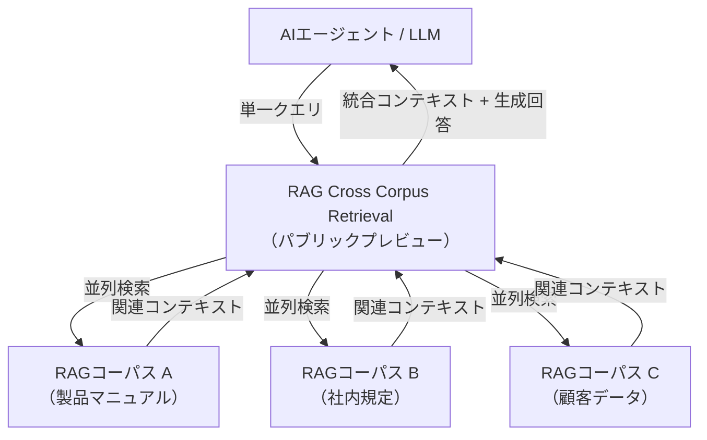
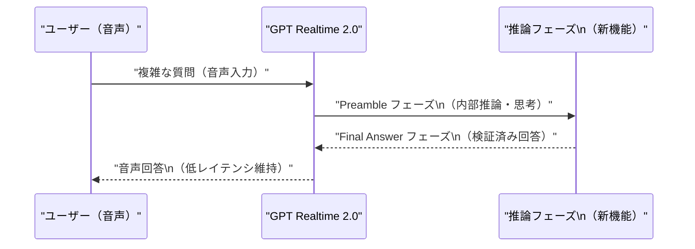
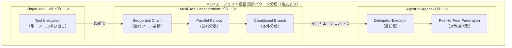
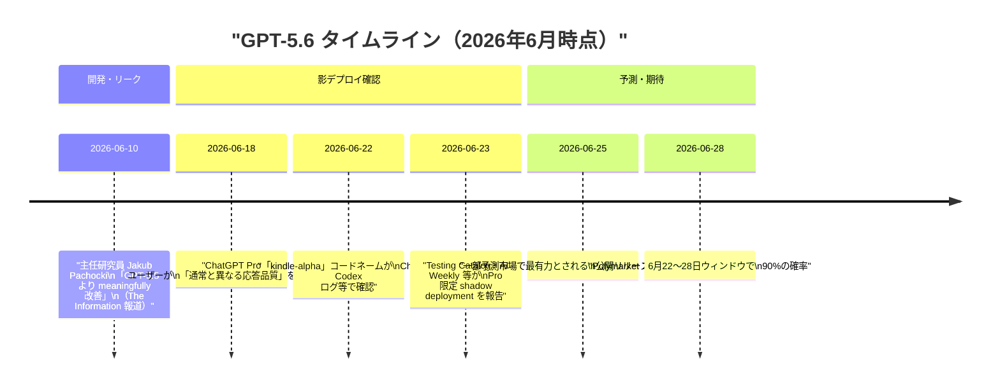
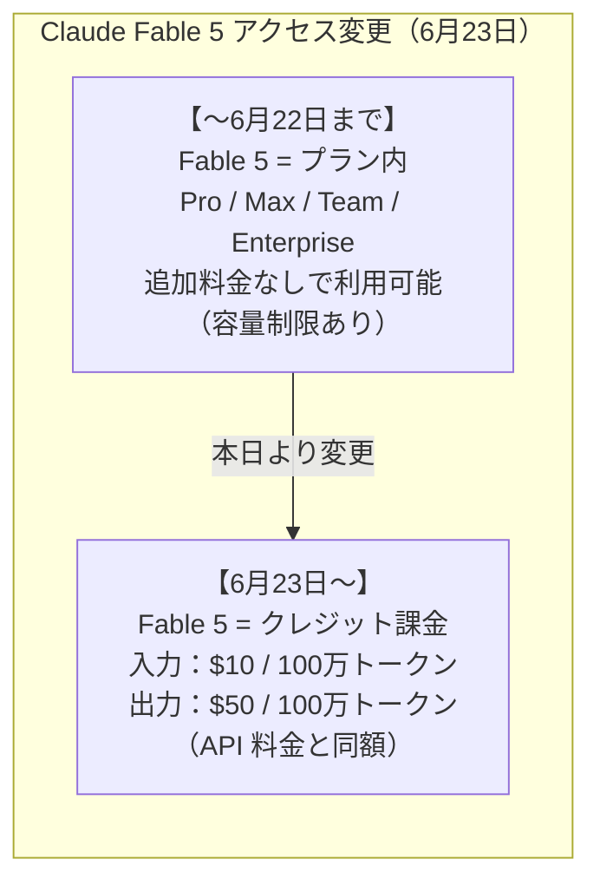
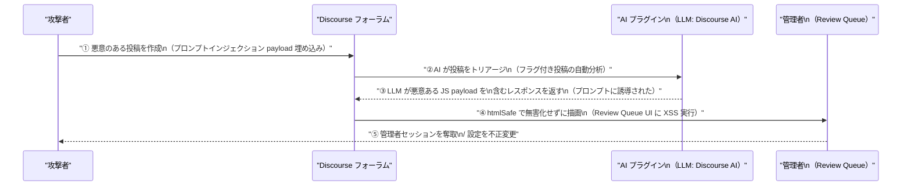

# LLM・AI Agent 最新情報レポート Vol.58

**作成日**: 2026年6月23日  
**対象期間**: 2026年6月22日〜2026年6月23日（Vol.57との差分）

---

## 目次

1. [Google Cloudアップデート](#1-google-cloudアップデート)
2. [Microsoft Azure AIアップデート](#2-microsoft-azure-aiアップデート)
3. [LLM Model / AI Agentアーキテクチャ・研究](#3-llm-model--ai-agentアーキテクチャ研究)
4. [公式ブログ・論文のリサーチ・要約](#4-公式ブログ論文のリサーチ要約)
   - [4.1 Google / Google DeepMind](#41-google--google-deepmind)
   - [4.2 OpenAI](#42-openai)
   - [4.3 Anthropic](#43-anthropic)
5. [AI Agent搭載SaaS製品情報](#5-ai-agent搭載saas製品情報)
6. [LLM/AI Agentセキュリティインシデント](#6-llmai-agentセキュリティインシデント)
7. [その他特筆すべき情報](#7-その他特筆すべき情報)
8. [参考リンク](#8-参考リンク)

---

## 1. Google Cloudアップデート

### 1.1 Vertex AI：Veo 3.1 Lite パブリックプレビュー・Claude Opus 4.7 提供開始・RAG Cross Corpus Retrieval

Vertex AI の Model Garden に3件の新リリースが確認された。[[1]](#ref-1)[[2]](#ref-2)

#### Veo 3.1 Lite（パブリックプレビュー）

Google の動画生成モデル Veo シリーズの最新軽量版。Vertex AI 上で提供される **最もコスト効率の高い Veo モデル**として位置づけられており、開発・検証フェーズでの動画生成コストを大幅に削減できる。

| 項目 | 内容 |
|---|---|
| **提供形態** | パブリックプレビュー |
| **位置づけ** | Veo on Vertex AI の最安値ティア |
| **用途** | プロトタイピング・大量バッチ動画生成・コスト重視ユースケース |

#### Claude Opus 4.7（Model Garden 提供開始）[[2]](#ref-2)

Anthropic の最上位クラスモデル **Claude Opus 4.7** が Vertex AI Model Garden で利用可能になった。前世代 Opus 4.6 から以下の点が強化されている。

| 改善点 | 内容 |
|---|---|
| **曖昧さへの対応** | 不明確な指示に対してより的確に処理 |
| **問題解決の徹底性** | 複雑なタスクをより深く掘り下げて解決 |
| **指示追従の精度** | 複雑な多段階指示への対応精度が向上 |
| **ビジョン機能** | 高解像度画像入力対応・複雑ドキュメント/チャート解析精度向上 |
| **メモリ拡張** | 長時間タスクに対応した拡張メモリ機能 |

#### RAG Cross Corpus Retrieval（パブリックプレビュー）

複数の RAG コーパスを同時参照して回答を生成する **RAG Cross Corpus Retrieval** がパブリックプレビューで提供開始された。

> **意義:** これまでは単一コーパスからのみ検索・回答生成が可能だったが、Cross Corpus Retrieval により部門横断・マルチドメインのナレッジベースを活用したエンタープライズ RAG が現実的に。複雑な業務質問への一貫した回答が可能になる。

---

## 2. Microsoft Azure AIアップデート

### 2.1 Azure OpenAI：GPT Realtime 2.0（プレビュー）——推論モード対応

**GPT Realtime 2.0** がプレビューで提供開始。リアルタイム音声インタラクション（低レイテンシ）を維持しつつ、以下の新機能が追加された。[[3]](#ref-3)

| 新機能 | 内容 |
|---|---|
| **推論サポート** | 複雑な質問に対して「思考」してから回答するモード |
| **Response Phases** | Preamble（前置き）と Final Answer（最終回答）の2フェーズ |
| **指示追従の厳格化** | システムプロンプトへの準拠率が向上 |

### 2.2 Azure OpenAI：PII 検出フィルタ——組み込みコンテンツフィルタに追加

**個人識別情報（PII）検出** が Azure OpenAI の組み込みコンテンツフィルタとして一般提供された。[[3]](#ref-3)

| 項目 | 内容 |
|---|---|
| **機能** | LLM 出力中の氏名・住所・電話番号・マイナンバー等の PII を検出・ブロック |
| **設定** | Azure AI Foundry ポータルでフィルタポリシーに組み込み可能 |
| **用途** | 医療・金融・公共機関など PII 規制が厳しいユースケース向け |

> **背景:** EU AI Act・HIPAA・個人情報保護法等の規制対応が進む中、出力フィルタとしての PII 検出は「信頼性のある AI」を求める企業の必須機能になりつつある。

---

## 3. LLM Model / AI Agentアーキテクチャ・研究

### 3.1 Survey of LLM Agent Communication with MCP：ソフトウェア設計パターン視点でのレビュー

arXiv に **「Survey of LLM Agent Communication with MCP: A Software Design Pattern Centric Review」**（arXiv:2506.05364）が公開された。Model Context Protocol（MCP）を軸に LLM エージェント間通信を設計パターンの観点から体系化した調査論文。[[4]](#ref-4)

**論文の主要な知見：**

| 観点 | 知見 |
|---|---|
| **MCP の台頭** | MCP が事実上の「エージェント間通信標準」として急速に普及。OpenAI・Anthropic・Google が相次いで対応を表明 |
| **設計パターン** | Single-Tool Call → Multi-Tool Orchestration → Agent-to-Agent Federation という複雑性のグラデーションが存在 |
| **課題** | ツール爆発問題（Tool Explosion）：エージェントが管理するツール数が増えると、適切なツール選択の精度が低下 |
| **推奨** | ツールをセマンティックグループでクラスタリングし、2段階選択（グループ選択 → ツール選択）を採用することで精度向上 |

> **実務的意義:** MCP を利用した本番エージェントシステムを設計する際のリファレンスとして活用できる。特に「ツール爆発」問題への対処法（セマンティッククラスタリング）は即実装可能な知見。

---

## 4. 公式ブログ・論文のリサーチ・要約

### 4.1 Google / Google DeepMind

新情報なし（6月22〜23日時点で特記すべき公式ブログ・論文なし）

---

### 4.2 OpenAI

#### 4.2.1 GPT-5.6「kindle-alpha」——一部 Pro 加入者への影リリースを複数レポートが確認

6月22〜23日にかけて、OpenAI の次世代モデル **GPT-5.6**（コードネーム：**kindle-alpha**）が一部の ChatGPT Pro 加入者に対して「影（shadow）デプロイメント」されていることが複数の媒体から報告された。公式発表はまだないが、信頼性の高いシグナルが集積している。[[5]](#ref-5)[[6]](#ref-6)

**現在確認できている情報（非公式）：**

| 項目 | 内容 |
|---|---|
| **コードネーム** | kindle-alpha（ChatGPT Codex ログおよびユーザー報告で観測） |
| **コンテキストウィンドウ** | 150万トークン（GPT-5.5 の 100万から拡大の見込み） |
| **音声モデル** | 次世代音声モデル「GPT-Bidi-1」（双方向リアルタイム音声）の同時リリースが有力 |
| **品質評価** | 初期テスト参加者から「推論・コーディング・ビジョン全てで改善」との評価 |
| **公式発表** | 6月23日時点で blog.openai.com への投稿・システムカード・API モデルページ等なし |

> **注意:** shadow deployment の存在は複数の独立した情報源で確認されているが、OpenAI の正式発表ではない。リリース前後で機能・価格が変わる可能性がある。

---

### 4.3 Anthropic

#### 4.3.1 Claude Fable 5：本日（6月23日）からクレジット課金に移行——プラン無制限アクセスが終了

**重要:** 2026年6月23日（本日）をもって、Claude **Fable 5** はすべての有料プランの「プラン内利用」から除外され、使用するには**追加の使用クレジット**が必要になった。[[7]](#ref-7)[[8]](#ref-8)

**詳細：**

| 項目 | 内容 |
|---|---|
| **対象プラン** | Pro・Max・Team・Enterprise（全有料プラン） |
| **変更内容** | プラン内使用枠から除外 → 使用クレジット消費へ |
| **クレジット単価** | 入力 $10 / 100万トークン、出力 $50 / 100万トークン（API 料金と同単価） |
| **理由** | Anthropic による「インフラ容量確保のための暫定措置」（容量確保後に復元予定） |
| **復元時期** | 未発表。「容量が整い次第、標準プラン機能として再提供」とのみ説明 |
| **試用期間** | Fable 5 公開（6月9日）〜 6月22日の 14日間が実質無料トライアルだった形 |

**プラン別の影響：**

| プラン | 6月22日まで | 6月23日以降 |
|---|---|---|
| **Pro** | Fable 5 を月額 $20 内で利用可 | クレジット購入が必要 |
| **Max** | 同上 | 同上 |
| **Team** | 同上 | 同上 |
| **Enterprise** | 同上（シート制内で利用可） | 同上 |
| **API（従量課金）** | $10 / $50 per M tokens | 変更なし |

> **影響評価:** Claude Fable 5 は公開（6月9日）から 14日間でベンチマーク最高峰クラスの実力が実証されており、エンタープライズでの活用計画を持つ組織は早急にクレジット予算を見直す必要がある。Anthropic は「容量確保後に復元する」としているが、時期は不明。当面の回避策として Claude Opus 4.8 がプラン内で引き続き利用可能。

---

## 5. AI Agent搭載SaaS製品情報

新情報なし（6月22〜23日時点で特記すべき新製品・アップデートなし）

---

## 6. LLM/AI Agentセキュリティインシデント

### 6.1 CVE-2026-27740：Discourse AI プラグインに LLM 出力経由の格納型 XSS

Discourse（オープンソースのコミュニティフォーラムプラットフォーム）の AI プラグインに、**LLM 出力が適切にサニタイズされずに管理画面に描画される格納型 XSS（CVE-2026-27740）**が発見された。[[9]](#ref-9)[[10]](#ref-10)

**脆弱性詳細：**

| 項目 | 内容 |
|---|---|
| **CVE** | CVE-2026-27740 |
| **種別** | 格納型 XSS（Stored Cross-Site Scripting）|
| **攻撃ベクタ** | 間接プロンプトインジェクション → LLM が悪意ある JS を含む回答を生成 → htmlSafe でサニタイズなしに描画 |
| **影響範囲** | Staff 権限ユーザー（管理者・モデレーター）のセッション奪取・管理操作の乗っ取り |
| **脆弱バージョン** | 2026.3.0-latest.1, 2026.2.1, 2026.1.2 より前のバージョン |
| **修正バージョン** | 2026.3.0-latest.1, 2026.2.1, 2026.1.2 |
| **修正内容** | LLM 生成コンテンツに `ERB::Util.html_escape` を適用してからテンプレートに挿入 |
| **暫定対策** | 即時パッチが困難な場合は AI トリアージ自動スクリプトを無効化 |

**セキュリティ上の本質的な問題点：**

> LLM が生成したコンテンツを「信頼された入力」として扱った点が根本原因。LLM の出力は外部ユーザーの入力と同様に「信頼できない（Untrusted）データ」として扱い、描画前に必ずサニタイズする必要がある。今回の脆弱性は「AI Plugin が LLM 出力の Trust Boundary を誤って設定した」典型例であり、LLM を組み込んだ Web アプリケーション全般に共通するアーキテクチャ上の注意点。

---

## 7. その他特筆すべき情報

新情報なし（6月22〜23日時点で特記すべき情報なし）

---

## 8. 参考リンク

**[1]** [Generative AI on Vertex AI release notes | Google Cloud Documentation](https://docs.cloud.google.com/vertex-ai/generative-ai/docs/release-notes)

**[2]** [Claude Opus 4.7 on Vertex AI | Google Cloud Blog](https://cloud.google.com/blog/products/ai-machine-learning/claude-opus-4-7-on-vertex-ai)

**[3]** [What's new in Azure OpenAI in Microsoft Foundry Models? | Microsoft Learn](https://learn.microsoft.com/en-us/azure/foundry-classic/openai/whats-new)

**[4]** [Survey of LLM Agent Communication with MCP: A Software Design Pattern Centric Review | arXiv:2506.05364](https://arxiv.org/pdf/2506.05364)

**[5]** [GPT-5.6 "Kindle-Alpha" Leak: Early Reports on Reasoning, Coding, and Vision | Windows Forum](https://windowsforum.com/threads/gpt-5-6-kindle-alpha-leak-early-reports-on-reasoning-coding-and-vision.423497/)

**[6]** [GPT-5.6 Kindle-Alpha Spotted With Improved Reasoning | WinCentral](https://thewincentral.com/gpt-5-6-kindle-alpha-new-checkpoint/)

**[7]** [Fable 5 Credit Cliff: What the June 23 Billing Shift Means for Teams | Groundy](https://groundy.com/articles/fable-5-credit-cliff-what-the-june-23-billing-shift-means-for-teams/)

**[8]** [Fable 5 Leaves Your Claude Plan on June 22. Here's How to Plan for It | Developers Digest](https://www.developersdigest.tech/blog/claude-fable-5-june-22-deadline)

**[9]** [CVE-2026-27740 LLM Output Causes Stored XSS | PointGuard AI](https://www.pointguardai.com/ai-security-incidents/llm-output-triggers-stored-xss-in-discourse-cve-2026-27740)

**[10]** [CVE-2026-27740: Discourse AI LLM XSS Vulnerability | SentinelOne](https://www.sentinelone.com/vulnerability-database/cve-2026-27740/)
