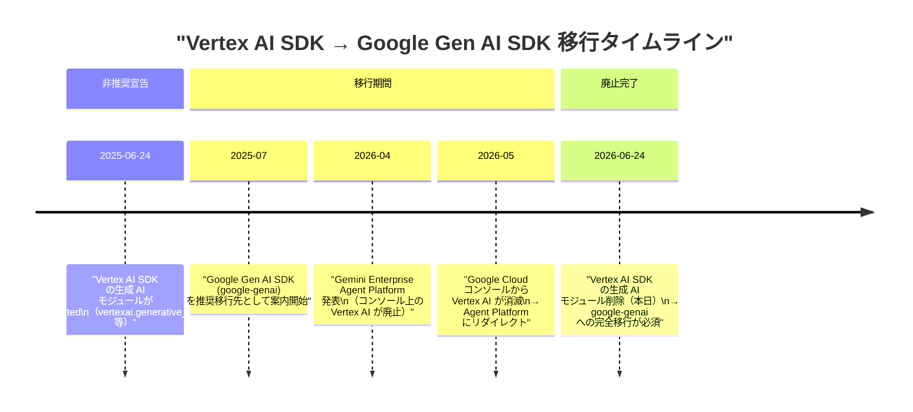
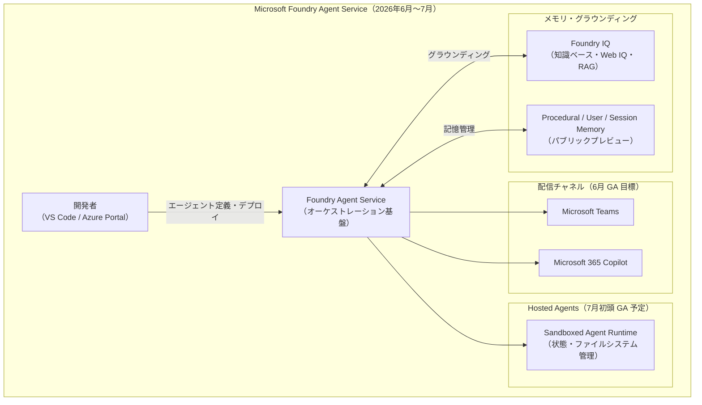
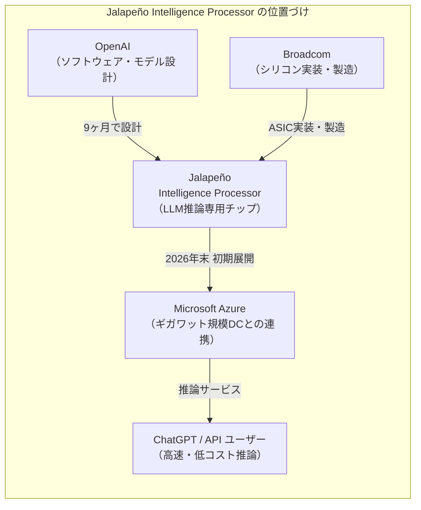
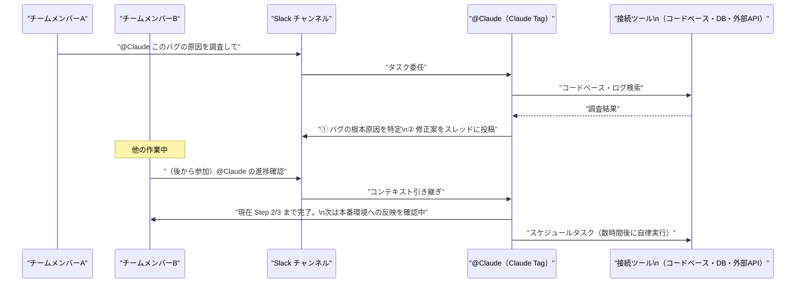
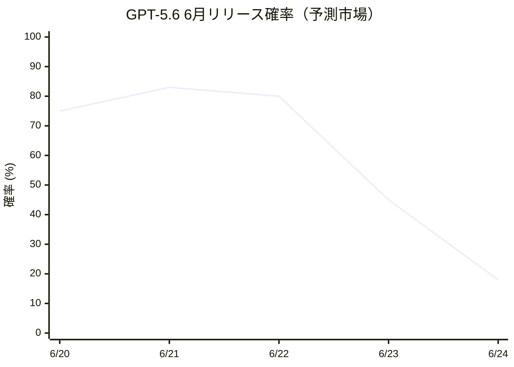

# LLM・AI Agent 最新情報レポート Vol.59

**作成日**: 2026年6月24日  
**対象期間**: 2026年6月23日〜2026年6月24日（Vol.58との差分）

---

## 目次

1. [Google Cloudアップデート](#1-google-cloudアップデート)
2. [Microsoft Azure AIアップデート](#2-microsoft-azure-aiアップデート)
3. [LLM Model / AI Agentアーキテクチャ・研究](#3-llm-model--ai-agentアーキテクチャ研究)
4. [公式ブログ・論文のリサーチ・要約](#4-公式ブログ論文のリサーチ要約)
   - [4.1 Google / Google DeepMind](#41-google--google-deepmind)
   - [4.2 OpenAI](#42-openai)
   - [4.3 Anthropic](#43-anthropic)
5. [AI Agent搭載SaaS製品情報](#5-ai-agent搭載saas製品情報)
6. [LLM/AI Agentセキュリティインシデント](#6-llmai-agentセキュリティインシデント)
7. [その他特筆すべき情報](#7-その他特筆すべき情報)
8. [参考リンク](#8-参考リンク)

---

## 1. Google Cloudアップデート

### 1.1 Vertex AI Python SDK 廃止期限到来（本日 2026年6月24日）

**本日をもって** Vertex AI Python SDK 内の生成 AI モジュール群が正式に削除される。2025年6月24日に非推奨（deprecated）宣告されてから丸1年が経過し、今日がその最終期限日に当たる。[[1]](#ref-1)[[2]](#ref-2)

**廃止対象モジュール（本日削除）：**

| 廃止モジュール（vertexai.*） | 移行先（google.genai.*） |
|---|---|
| `vertexai.generative_models` | `google.genai.GenerativeModel` |
| `vertexai.language_models` | `google.genai.models` |
| `vertexai.vision_models` | `google.genai.files` + `google.genai.models` |
| `vertexai.tuning` | `google.genai.tuning` |
| `vertexai.caching` | `google.genai.caches` |

**主な移行変更点：**

| 変更項目 | 旧 SDK（vertexai） | 新 SDK（google-genai） |
|---|---|---|
| **初期化** | `vertexai.init(project=..., location=...)` | `client = genai.Client(vertexai=True, project=..., location=...)` |
| **モデル呼び出し** | モジュールレベルのグローバルステート | クライアントオブジェクトに設定を保持 |
| **ツール/関数呼び出し** | `Tool(function_declarations=[...])` | `tools=[...]` として直接渡す |

> **実務影響:** Vertex AI SDK を利用した本番サービスを抱える組織は今日以降、`vertexai.generative_models` 等への依存が原因でエラーが発生する。`google-cloud-aiplatform` パッケージ自体は残るが、生成 AI モジュール部分は削除されるため、即日移行が必要。Langchain4j 等のサードパーティライブラリも対応版への更新が求められる。[[3]](#ref-3)

---

## 2. Microsoft Azure AIアップデート

### 2.1 Microsoft Foundry：Foundry Agent の Teams / M365 Copilot 公開が 6 月 GA 目標

Microsoft Build 2026（6月初旬）で予告されていた **Microsoft Foundry Agent Service** の Teams・M365 Copilot への展開が、6月 GA（一般提供）目標として進行中であることが確認された。[[4]](#ref-4)[[5]](#ref-5)

**主要アップデートの状況（6月24日時点）：**

| 機能 | ステータス | 詳細 |
|---|---|---|
| **Teams / M365 Copilot 公開** | 6月 GA 目標 | Foundry エージェントをそのまま Teams チャネルや M365 Copilot に展開可能。Identity・Permission・Policy が自動連携 |
| **Hosted Agents** | 7月初頭 GA 予定 | サンドボックスセッション・状態保持・ファイルシステムアクセス・フレームワーク柔軟性を備えたマネージドランタイム |
| **Foundry IQ（知識基盤）** | 拡張中 | サーバーレス検索・新知識ソース・Web IQ・セキュリティアップデート・エージェンティック検索改善 |
| **Memory（手順・ユーザー・セッション）** | パブリックプレビュー | 長期タスクに対応したメモリ層。3種類のメモリタイプが整備 |
| **Foundry Toolkit for VS Code** | GA | エージェント開発のIDE統合ツールキット |

> **ポイント:** Foundry エージェントが Teams / M365 Copilot に直接展開できるようになることで、エンドユーザーが普段使いのコミュニケーションツールからシームレスに AI エージェントを利用できる環境が整いつつある。Hosted Agents の7月 GA と合わせて、Microsoft の「本番グレードエージェント基盤」が夏に完成を迎える見込み。

---

## 3. LLM Model / AI Agentアーキテクチャ・研究

新情報なし（6月23〜24日時点で特記すべき新規論文・アーキテクチャ研究なし）

---

## 4. 公式ブログ・論文のリサーチ・要約

### 4.1 Google / Google DeepMind

新情報なし（6月23〜24日時点で特記すべき公式ブログ・論文なし）

---

### 4.2 OpenAI

#### 4.2.1 Jalapeño：OpenAI・Broadcom による初のカスタム AI 推論チップ発表

2026年6月24日、OpenAI と Broadcom は共同開発した初のカスタム AI チップ **「Jalapeño（ハラペーニョ）」** を正式発表した。OpenAI にとって初の自社開発シリコンであり、LLM 推論専用の **Intelligence Processor** と位置づけられている。[[6]](#ref-6)[[7]](#ref-7)[[8]](#ref-8)

**主な特徴・スペック：**

| 項目 | 内容 |
|---|---|
| **開発期間** | わずか9ヶ月（ASIC 開発史上最速水準） |
| **コスト削減** | 従来の AI GPU と比較して**約 50% のコスト削減**（Broadcom CEO Hock Tan 発言） |
| **電力効率** | Performance per Watt で現状最高水準を上回ると試算 |
| **用途** | LLM 推論（ChatGPT ユーザーへのサービング）専用 |
| **AI 活用** | チップ設計・最適化プロセス自体に OpenAI モデルを活用 |
| **初期展開** | 2026年末を目標（Microsoft・その他パートナーとのギガワット規模 DC に展開） |
| **戦略的意義** | Nvidia 依存からの脱却・推論コスト削減・サービス安定化 |

**背景・戦略的文脈：**

> OpenAI は推論コストの高騰と GPU 供給制約を長期課題として抱えてきた。Jalapeño はその解決策として、GPU と並行運用しながら徐々にシェアを拡大していく見込み。「AI でチップを設計する」アプローチも注目されており、設計サイクルの大幅短縮が今後の AI チップ開発の標準になる可能性がある。

---

### 4.3 Anthropic

#### 4.3.1 Claude Tag for Slack：Slack に常駐する AI チームメイト（6月23日発表）

Anthropic は 2026年6月23日、**Claude Tag** を Slack 向けにベータリリースした。Claude が Slack チャンネルに常駐する「チームメイト」として機能し、従来の Slack アプリとは根本的に異なるコラボレーション体験を提供する。[[9]](#ref-9)[[10]](#ref-10)[[11]](#ref-11)

**主な機能・特徴：**

| 機能 | 内容 |
|---|---|
| **チャンネル共有 AI** | 1チャンネルに1つの @Claude が常駐。チームメンバー全員が同じ Claude と対話でき、誰でもコンテキストを引き継いで続行可能 |
| **非同期タスク処理** | @Claude に依頼すれば、Claude が自律的にタスクを段階分解して実行。ユーザーは別の作業に専念できる |
| **コンテキストメモリ** | チャンネル内のやり取りから関連情報を記憶し、継続的なプロジェクト文脈を把握 |
| **スケジュール実行** | 数時間〜数日後のタスクを自律的にスケジュールして実行 |
| **接続ツール** | コードベース・データベース・外部 API 等と接続してタスク遂行 |
| **ベースモデル** | Claude Opus 4.8（5月発表）で動作 |

**利用状況と移行：**

| 項目 | 内容 |
|---|---|
| **対象プラン** | Claude Enterprise・Claude Team（ベータ） |
| **旧アプリ廃止** | 旧「Claude in Slack」アプリは 2026年8月3日に廃止 |
| **導入クレジット** | ローンチ記念として Enterprise・Team 組織に試用クレジットを付与 |
| **Anthropic 社内実績** | Anthropic のプロダクトチームのコードの約 **65%** が社内版 Claude Tag 経由で生成されている |

> **意義:** GitHub Copilot がコードエディタに AI を組み込んだように、Claude Tag は Slack というコミュニケーション基盤に AI を組み込む試み。「AI がいつでも働いている」状態を実現し、非同期・マルチユーザーのコラボレーションに適応した新しい AI 活用モデルとなっている。

---

## 5. AI Agent搭載SaaS製品情報

### 5.1 Claude Tag for Slack（Anthropic）：Enterprise・Team 向けベータ開始

[4.3.1](#431-claude-tag-for-slack：slack-に常駐する-ai-チームメイト6月23日発表) で詳述。Slack を主要コラボレーション基盤とするエンタープライズにとって、AI エージェントを組織の「デフォルトのチームメンバー」として組み込む最初の本格的製品となる。[[9]](#ref-9)[[10]](#ref-10)

**競合状況との比較：**

| 製品 | 提供元 | 統合先 | ステータス |
|---|---|---|---|
| **Claude Tag** | Anthropic | Slack | ベータ（6/23〜）|
| **Copilot Chat** | Microsoft | Teams | GA |
| **Gemini for Google Workspace** | Google | Google Chat / Docs | GA |

---

## 6. LLM/AI Agentセキュリティインシデント

新情報なし（6月23〜24日時点で特記すべき新規インシデントなし）

---

## 7. その他特筆すべき情報

### 7.1 GPT-5.6 リリース延期：6月ウィンドウの確率が急落

Vol.58（6月23日）レポートで報告した **GPT-5.6（コードネーム：kindle-alpha）** の 6月22〜28日リリース見込みについて、本日（6月24日）時点で予測市場の確率が大幅に低下したことが確認された。[[12]](#ref-12)[[13]](#ref-13)

**現状まとめ：**

| 項目 | 内容 |
|---|---|
| **6月22〜28日リリース確率** | ~83%（6/21）→ **~18%（6/24）** に急落 |
| **最有力リリース時期** | 2026年7月（現時点の予測市場コンセンサス） |
| **公式アナウンス** | 6月24日時点でなし |
| **現行最新公式モデル** | GPT-5.5（2026年4月リリース） |
| **背景** | shadow deployment は確認されているが、公開リリースは遅延と判断される |

> **注意:** 予測市場の値は状況変化によって急速に変動する。OpenAI の正式アナウンスが唯一の確定情報源であり、今後も公式ブログ・API ドキュメントの更新を継続的にモニタリングする必要がある。

---

## 8. 参考リンク

**[1]** [Vertex AI SDK migration guide | Generative AI on Vertex AI | Google Cloud](https://cloud.google.com/vertex-ai/generative-ai/docs/deprecations/genai-vertexai-sdk)

**[2]** [The Vertex AI Generative Models SDK is Being Deprecated | GCP Study Hub](https://gcpstudyhub.com/blog/the-vertex-ai-generative-models-sdk-is-being-deprecated)

**[3]** [\[FEATURE\] Migrate from Vertex AI SDK to Google Gen AI SDK before June 2026 deprecation · Issue #4383 · langchain4j/langchain4j | GitHub](https://github.com/langchain4j/langchain4j/issues/4383)

**[4]** [What's New in Hosted Agents in Foundry Agent Service | Microsoft Foundry Blog](https://devblogs.microsoft.com/foundry/hosted-agents-build26/)

**[5]** [Microsoft Foundry Adds Runtime, Tooling, and Governance for Production Agents | InfoQ](https://www.infoq.com/news/2026/06/microsoft-foundry-agents/)

**[6]** [OpenAI and Broadcom unveil LLM-optimized inference chip | OpenAI](https://openai.com/index/openai-broadcom-jalapeno-inference-chip/)

**[7]** [OpenAI unveils its first custom chip, built by Broadcom | TechCrunch](https://techcrunch.com/2026/06/24/openai-unveils-its-first-custom-chip-built-by-broadcom/)

**[8]** [OpenAI and Broadcom reveal Jalapeno, first AI chip in partnership | CNBC](https://www.cnbc.com/2026/06/24/openai-and-broadcom-reveal-jalapeno-first-ai-chip-in-partnership.html)

**[9]** [Anthropic's Claude Tag is learning your company, one Slack message at a time | TechCrunch](https://techcrunch.com/2026/06/23/anthropics-claude-tag-is-learning-your-company-one-slack-message-at-a-time/)

**[10]** [Anthropic introduces Claude Tag, a new AI teammate for Slack | Neowin](https://www.neowin.net/news/anthropic-introduces-claude-tag-a-new-ai-teammate-for-slack/)

**[11]** [Anthropic Launches Claude Tag for Slack With Enterprise Tool Access and Scoped Data Controls | CyberPress](https://cyberpress.org/anthropic-launches-claude-tag/)

**[12]** [GPT 5.6 release date? | Manifold Markets](https://manifold.markets/prismatic/when-will-gpt56-be-released-L8pNyNgctq)

**[13]** [ChatGPT 5.6 release date rumors point to June but OpenAI has not confirmed it | Webiano Digital](https://webiano.digital/chatgpt-5-6-release-date-rumors-point-to-june-but-openai-has-not-confirmed-it/)
