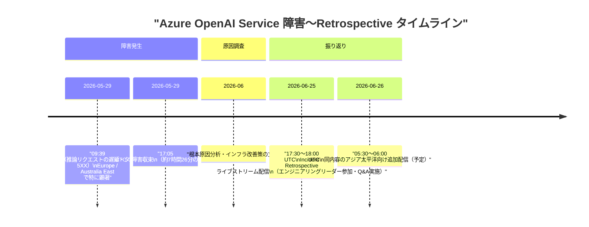
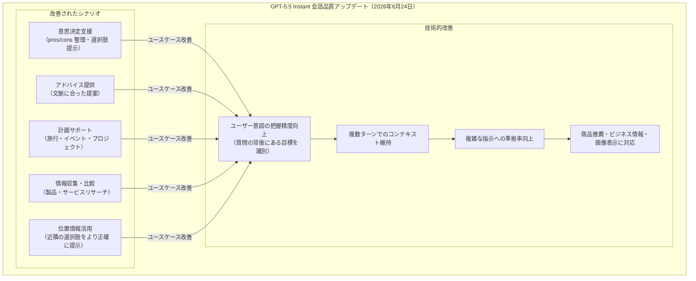
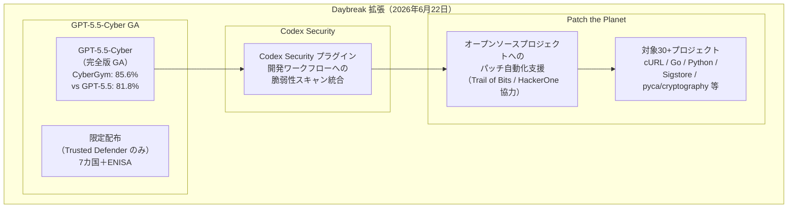
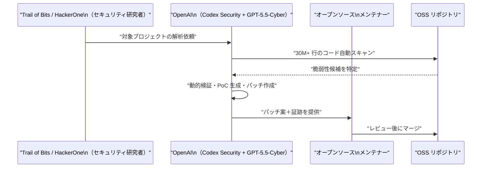
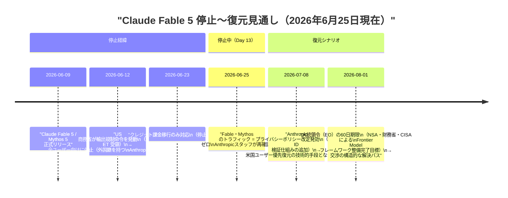
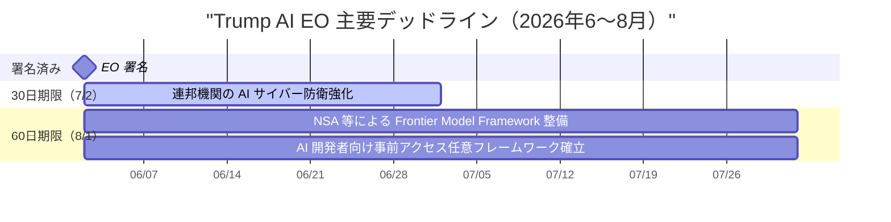

# LLM・AI Agent 最新情報レポート Vol.60

**作成日**: 2026年6月25日  
**対象期間**: 2026年6月24日〜2026年6月25日（Vol.59との差分）

---

## 目次

1. [Google Cloudアップデート](#1-google-cloudアップデート)
2. [Microsoft Azure AIアップデート](#2-microsoft-azure-aiアップデート)
3. [LLM Model / AI Agentアーキテクチャ・研究](#3-llm-model--ai-agentアーキテクチャ研究)
4. [公式ブログ・論文のリサーチ・要約](#4-公式ブログ論文のリサーチ要約)
   - [4.1 Google / Google DeepMind](#41-google--google-deepmind)
   - [4.2 OpenAI](#42-openai)
   - [4.3 Anthropic](#43-anthropic)
5. [AI Agent搭載SaaS製品情報](#5-ai-agent搭載saas製品情報)
6. [LLM/AI Agentセキュリティインシデント](#6-llmai-agentセキュリティインシデント)
7. [その他特筆すべき情報](#7-その他特筆すべき情報)
8. [参考リンク](#8-参考リンク)

---

## 1. Google Cloudアップデート

新情報なし（6月24〜25日時点で特記すべき新規発表なし）

---

## 2. Microsoft Azure AIアップデート

### 2.1 Azure OpenAI Service：5月29日障害の事後振り返り（Incident Retrospective）配信

2026年6月25日 17:30〜18:00 UTC、Microsoft Azure は **Azure OpenAI Service** の大規模障害に関する **Incident Retrospective ライブストリーム** を実施した。[[1]](#ref-1)[[2]](#ref-2)

**障害の概要と改善策：**

| 項目 | 内容 |
|---|---|
| **障害期間** | 2026年5月29日 09:39〜17:05 UTC（約7時間26分） |
| **影響内容** | 推論リクエストの遅延・断続的な失敗・タイムアウト・HTTP 5XX エラー |
| **特に影響を受けたリージョン** | Europe・Australia East（トラフィック集中による直接処理負荷が高かったリージョン） |
| **根本的な改善策** | 大規模ファーストパーティの生成 AI ワークロードを**共有ルーティングインフラから専用ルーティングインフラへ移行**（2026年6月中に完了見込み） |
| **Retrospective 記録** | 翌週 YouTube に公開予定 |

> **ポイント:** Azure OpenAI Service は大企業の生産ワークロードに組み込まれており、7時間超の障害は甚大なビジネスインパクトをもたらした。Retrospective を公開配信し、エンジニアリングリーダーが直接質疑応答に応じる姿勢は、エンタープライズ向けクラウドプロバイダーとしての信頼性担保の観点で注目に値する。専用ルーティングへの移行完了後は同種の「爆発半径」が大幅に縮小される見込み。[[3]](#ref-3)

---

## 3. LLM Model / AI Agentアーキテクチャ・研究

新情報なし（6月24〜25日時点で特記すべき新規論文・アーキテクチャ研究なし）

---

## 4. 公式ブログ・論文のリサーチ・要約

### 4.1 Google / Google DeepMind

新情報なし（6月24〜25日時点で特記すべき公式ブログ・論文なし）

---

### 4.2 OpenAI

#### 4.2.1 GPT-5.5 Instant：会話品質の大幅改善アップデート（6月24日）

OpenAI は 2026年6月24日、デフォルトモデル **GPT-5.5 Instant** の**会話品質に特化したアップデート**を実施した。ベンチマークスコアではなく「話して楽しい」体験の向上を主眼とした改修で、日常的な対話シナリオでの実用性が大きく改善した。[[4]](#ref-4)[[5]](#ref-5)[[6]](#ref-6)

**アップデートの概要：**

| 項目 | 内容 |
|---|---|
| **対象モデル** | GPT-5.5 Instant（ChatGPT 全ユーザー向けデフォルトモデル） |
| **公開日** | 2026年6月24日 |
| **主な改善点** | 会話品質（ベンチマーク性能ではなく「体験」重視） |
| **得意になったシナリオ** | 意思決定・アドバイス・計画立案・リサーチ・ショッピング支援 |
| **意図理解** | 質問の文字通りではなく「背後にある目標」を把握して回答 |
| **位置情報** | ユーザーの位置コンテキストを活用し近隣情報を提示可能 |
| **初回リリース** | GPT-5.5 Instant は 2026年5月5日に全ユーザー向けデフォルトモデルとして提供開始 |

> **意義:** ChatGPT 月間アクティブユーザー 5 億人超に直接影響する改善。GPT-5.6（kindle-alpha）の公式リリースが7月以降に延期される中、既存モデルの体験品質向上で「次世代モデル待ち」のユーザーの離脱を防ぐ施策とも読める。

---

#### 4.2.2 Daybreak 拡張：GPT-5.5-Cyber GA・Codex Security・Patch the Planet 発表（6月22日）

*本項は6月22日（月）の発表だが、Vol.57・Vol.58 での記載漏れのため本号で収録する。*

OpenAI は 2026年6月22日、サイバーセキュリティ支援プログラム **Daybreak** を大幅に拡張した。3つのリリースが同時に行われ、AI を活用した脆弱性発見・修正の「攻守逆転」を目指す戦略的な布陣が整った。[[7]](#ref-7)[[8]](#ref-8)[[9]](#ref-9)[[10]](#ref-10)

**GPT-5.5-Cyber の主な能力：**

| 能力 | 内容 |
|---|---|
| **コードベース探索** | 3,000万行以上のコードを解析し、セキュリティ関連コンポーネントを特定 |
| **攻撃経路トレース** | 脆弱なコードが実際に到達可能か検証 |
| **動的検証** | 制御環境でのエクスプロイト可能性を確認（PoC 生成） |
| **パッチ生成・テスト** | 検証済み修正案の自動生成と動作テスト |
| **証跡作成** | ヒューマンレビュー向けのエビデンスドキュメント自動生成 |
| **Linux Kernel 実績** | カーネルポインタ情報リーク PoC 8件・ローカル権限昇格エクスプロイト 24件を発見 |

**Patch the Planet の仕組み：**

**Trusted Access for Cyber（国際展開）：**

| 国・機関 | ステータス |
|---|---|
| 米国 | 発祥（Daybreak 当初から） |
| オーストラリア・カナダ・フランス・ドイツ・日本・韓国 | Trusted Defender パートナー確認済み |
| EU・ENISA | Trusted Defender パートナー確認済み |

> **意義:** GPT-5.5-Cyber の「守備専用・限定配布」アプローチは、強力な AI ツールを無制限に公開せず、国際的に検証されたディフェンダーにのみ提供するというセキュリティ観点での先進事例。Patch the Planet は AI が人間の研究者を「支援・加速」する形でオープンソースのセキュリティ負債を解消しようとする試みであり、ソフトウェアサプライチェーンのセキュリティに中長期的な影響を与える可能性がある。

---

### 4.3 Anthropic

#### 4.3.1 Claude Fable 5・Mythos 5 停止：Day 13 ── 復元の鍵となる2つの日程が明らかに

2026年6月12日から続く US 政府の輸出規制命令による **Claude Fable 5・Mythos 5** の全停止は、6月25日（本日）で **13日目** を迎えた。Anthropic スタッフは「Fable・Mythos のトラフィックはゼロ」と再確認しており、依然として全ユーザー向けに停止中。一方で、段階的な復元のシナリオを左右する重要な日程が明確化してきた。[[11]](#ref-11)[[12]](#ref-12)

**現状サマリー（6月25日）：**

| 項目 | 内容 |
|---|---|
| **停止期間** | 13日間（6月12日〜継続中） |
| **影響対象** | 全ユーザー（国内外問わず、外国籍 Anthropic 社員含む） |
| **停止理由** | Fable 5 の特定サイバーセキュリティ機能を解放するジェイルブレイクを US 政府が確認 |
| **Anthropicの立場** | 「狭い範囲のジェイルブレイクであり、全サイドガードを突破するものではない」と主張 |
| **代替モデル** | Claude Opus 4.8 がプラン内で引き続き利用可能 |

**今後の注目日程（2026年下半期）：**

| 日程 | イベント | 復元への影響 |
|---|---|---|
| **2026年7月8日** | Anthropic プライバシーポリシー改定発効 | 政府 ID 検証機能の追加 → 外国籍ユーザーのみを対象外にする技術的手段が整い、US ユーザー向けの先行復元が可能になる可能性 |
| **2026年8月1日** | EO の60日期限（NSA/財務省/CISA） | Frontier Model Framework の整備完了目標日。交渉の正規ルートが確立される構造的節目 |

> **注意:** 上記の「復元見通し」はいずれも確定ではなく、構造的な解決パスとして外部アナリストが指摘しているシナリオ。Anthropic の公式アナウンスが唯一の確定情報源。

---

## 5. AI Agent搭載SaaS製品情報

新情報なし（6月24〜25日時点で特記すべき新規製品・アップデートなし）

---

## 6. LLM/AI Agentセキュリティインシデント

新情報なし（6月24〜25日時点で特記すべき新規インシデントなし）

---

## 7. その他特筆すべき情報

### 7.1 Trump AI 大統領令：7月2日の30日期限が1週間後に迫る

2026年6月2日に署名された **「Advanced AI Innovation and Security（先進 AI イノベーション・セキュリティ推進）」大統領令** において、**30日期限（7月2日）** まで残り7日となった。この期限内に複数の連邦機関が AI 関連のサイバー防衛強化策を完了する必要がある。[[13]](#ref-13)[[14]](#ref-14)[[15]](#ref-15)

**30日期限（7月2日）の主な要件：**

| 機関・主体 | 要件 |
|---|---|
| **CNSS（国家安全保障システム委員会）** | 国家安全保障情報システムの AI サイバー防衛を最優先化 |
| **国防長官** | 国防省情報システムを対象に AI 防衛策を最優先化 |
| **連邦機関（全般）** | 政府・民間セクターシステムの先進 AI ツール導入に向けた行動計画策定 |
| **民間セクター** | 上記連邦機関との連携で情報システム強化 |

**60日期限（8月1日）の主な要件：**

| 機関・主体 | 要件 |
|---|---|
| **NSA・財務省・CISA 等** | 「対象フロンティアモデル」の分類基準策定（機密プロセス） |
| **連邦機関（全般）** | AI 開発者からリリース前（最大30日）に政府が早期アクセスを受ける任意フレームワーク設計 |

> **現時点の評価:** 30日期限（7月2日）は、政府内の IT インフラ刷新という現実的な制約を考えると「計画策定」段階での完了を想定したマイルストーンと見られる。60日期限（8月1日）の Frontier Model Framework は、Claude Fable 5/Mythos 5 の輸出規制問題（4.3.1参照）と密接に絡み合い、AI モデルのガバナンス構造に実質的な影響を与える見込み。

---

## 8. 参考リンク

**[1]** [Azure Incident Retrospectives - YouTube Playlist | Microsoft Azure](https://www.youtube.com/playlist?list=PLmsFUfdnGr3xomlYbZPAYTtFdkcvbv2ye)

**[2]** [Azure Incident Retrospective: AOAI availability degradation | YouTube](https://www.youtube.com/watch?v=2eW7K3kWvPg)

**[3]** [Azure updates | Microsoft Azure](https://azure.microsoft.com/en-us/updates/)

**[4]** [GPT-5.5 Instant: smarter, clearer, and more personalized | OpenAI](https://openai.com/index/gpt-5-5-instant/)

**[5]** [OpenAI updates GPT-5.5 Instant conversational quality | Let's Data Science](https://letsdatascience.com/news/openai-updates-gpt-55-instant-conversational-quality-5482553e)

**[6]** [OpenAI just made GPT-5.5 Instant more fun to talk to, and users may actually notice | Digital Trends](https://www.digitaltrends.com/cool-tech/openai-just-made-gpt-5-5-instant-more-fun-to-talk-to-and-users-may-actually-notice/)

**[7]** [Daybreak: Tools for securing every organization in the world | OpenAI](https://openai.com/index/daybreak-securing-the-world/)

**[8]** [OpenAI expands Daybreak with Patch the Planet and full GPT-5.5-Cyber release | SiliconANGLE](https://siliconangle.com/2026/06/22/openai-expands-daybreak-patch-planet-full-gpt-5-5-cyber-release/)

**[9]** [Patch the Planet: a Daybreak initiative to support open source maintainers | OpenAI](https://openai.com/index/patch-the-planet/)

**[10]** [OpenAI Expands Daybreak With GPT-5.5-Cyber to Help Defenders Patch Security Flaws | The Hacker News](https://thehackernews.com/2026/06/openai-expands-daybreak-with-gpt-55.html)

**[11]** [Statement on the US government directive to suspend access to Fable 5 and Mythos 5 | Anthropic](https://www.anthropic.com/news/fable-mythos-access)

**[12]** [Is Fable 5 Back? No Official Confirmation (June 25, 2026) | explainx.ai](https://explainx.ai/blog/is-fable-5-back-2026)

**[13]** [Promoting Advanced Artificial Intelligence Innovation and Security | The White House](https://www.whitehouse.gov/presidential-actions/2026/06/promoting-advanced-artificial-intelligence-innovation-and-security/)

**[14]** [Trump signs AI executive order asking companies to give government early access to models | CNBC](https://www.cnbc.com/2026/06/02/trump-executive-order-ai.html)

**[15]** [President Trump Signs Executive Order Establishing AI Cybersecurity and Frontier Model Framework | Latham & Watkins](https://www.lw.com/en/insights/president-trump-signs-executive-order-establishing-ai-cybersecurity-and-frontier-model-framework)
