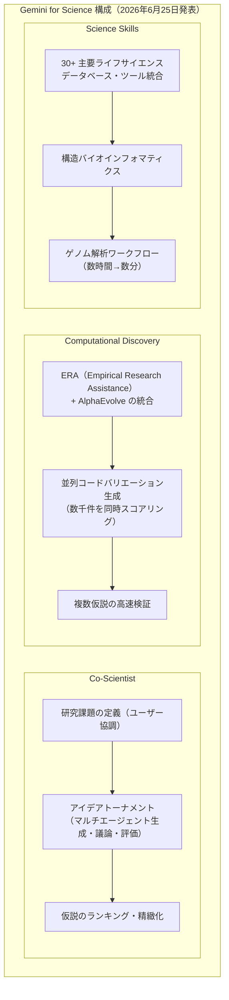
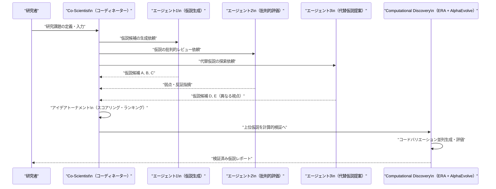
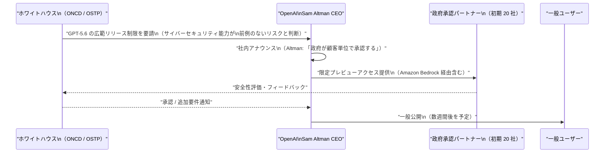
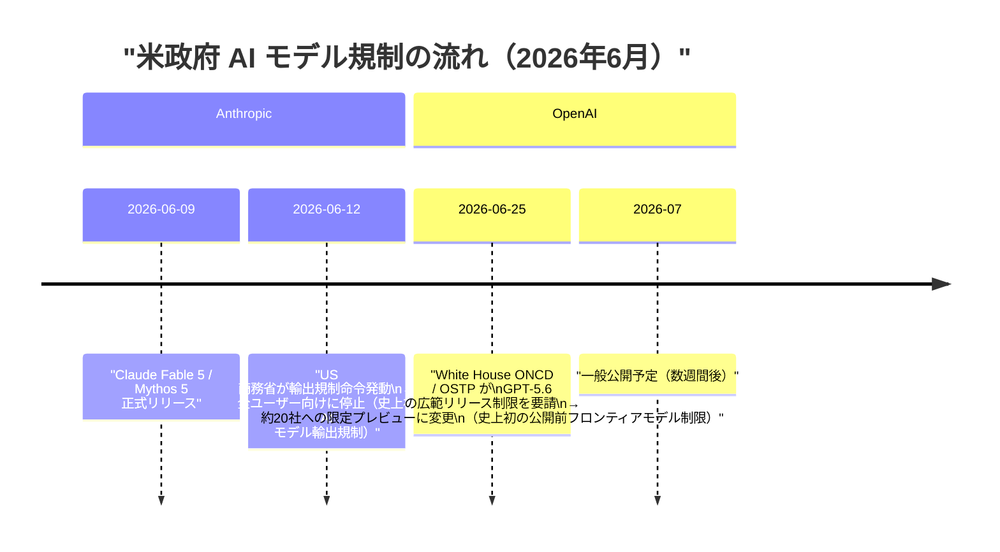
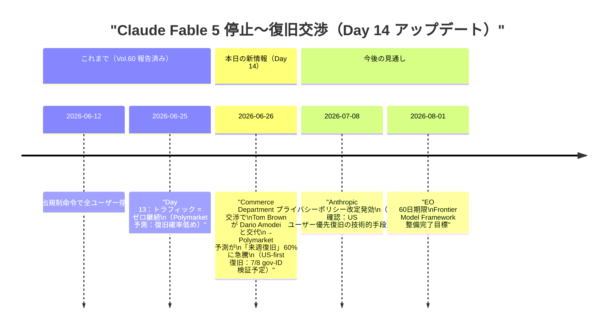
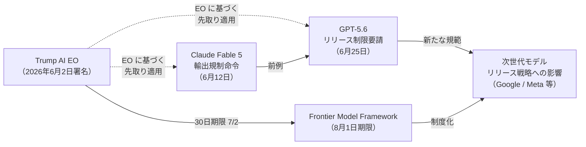

# LLM・AI Agent 最新情報レポート Vol.61

**作成日**: 2026年6月26日  
**対象期間**: 2026年6月25日〜2026年6月26日（Vol.60との差分）

---

## 目次

1. [Google Cloudアップデート](#1-google-cloudアップデート)
2. [Microsoft Azure AIアップデート](#2-microsoft-azure-aiアップデート)
3. [LLM Model / AI Agentアーキテクチャ・研究](#3-llm-model--ai-agentアーキテクチャ研究)
4. [公式ブログ・論文のリサーチ・要約](#4-公式ブログ論文のリサーチ要約)
   - [4.1 Google / Google DeepMind](#41-google--google-deepmind)
   - [4.2 OpenAI](#42-openai)
   - [4.3 Anthropic](#43-anthropic)
5. [AI Agent搭載SaaS製品情報](#5-ai-agent搭載saas製品情報)
6. [LLM/AI Agentセキュリティインシデント](#6-llmai-agentセキュリティインシデント)
7. [その他特筆すべき情報](#7-その他特筆すべき情報)
8. [参考リンク](#8-参考リンク)

---

## 1. Google Cloudアップデート

### 1.1 Gemini for Science 発表 ── マルチエージェント科学研究エンジン（2026年6月25日）

Google は 2026年6月25日、**Gemini for Science** を発表した。[[1]](#ref-1) これは科学探索の規模と精度を拡大するために設計された科学ツール・実験群であり、以下の主要コンポーネントで構成される。

**主要コンポーネント詳細：**

| コンポーネント | 機能 | 特徴 |
|---|---|---|
| **Co-Scientist** | マルチエージェント仮説生成 | 研究者と協調し「アイデアトーナメント」方式で仮説を競争的に生成・評価 |
| **Computational Discovery** | ERA + AlphaEvolve によるコード生成・並列評価 | 数千のコードバリエーションを同時生成・スコアリングし、仮説の高速テストを実現 |
| **Science Skills** | 専門科学ワークフロー統合 | 30 以上の主要ライフサイエンス DB を統合し、構造バイオインフォマティクスやゲノム解析を会話で実行可能に |

> **意義:** Co-Scientist の「アイデアトーナメント」方式は、複数エージェントが仮説を生成・議論・評価するマルチエージェントアーキテクチャの実用例として注目される。ERA・AlphaEvolve との統合により、ウェット実験に依存せずに仮説の計算的検証が可能になるアプローチは、創薬・材料科学への応用が期待される。

---

### 1.2 Gemini Paper Assistant（PAT）at STOC 2026 ── AI による論文品質フィードバック実証

Google Research は **Gemini Paper Assistant Tool（PAT）** を ACM STOC 2026（理論計算機科学の主要国際会議）に導入し、提出前フィードバックの自動化実験を実施した。[[2]](#ref-2)

**プログラム概要：**

| 項目 | 内容 |
|---|---|
| **対象会議** | ACM Symposium on Theory of Computing 2026（STOC 2026） |
| **目的** | 提出前24時間以内に AI が建設的フィードバック・技術的問題を特定 |
| **技術基盤** | Gemini 2.5 Deep Think の先進版（推論スケーリング手法を活用） |
| **成果** | 94% の参加者が有用と評価、85% が論文の明瞭さ改善を報告 |
| **累積実績** | ICML・NeurIPS 等を含む主要会議で 10,000+ 論文をレビュー |

> **意義:** PAT は ICML 2026・NeurIPS 2026 にも展開済みで、AI が科学コミュニティの知識生産プロセスそのものに組み込まれる「AI-in-the-loop 査読」の先駆的事例となっている。

---

## 2. Microsoft Azure AIアップデート

新情報なし（6月25〜26日時点で特記すべき新規発表なし）

---

## 3. LLM Model / AI Agentアーキテクチャ・研究

### 3.1 Co-Scientist ── マルチエージェント仮説生成アーキテクチャ

Google の Gemini for Science に搭載された **Co-Scientist** は、複数エージェントが協調して仮説を競争的に生成・評価するマルチエージェントアーキテクチャを採用している。[[1]](#ref-1)

**アーキテクチャの特徴：**

| 特徴 | 説明 |
|---|---|
| **競争的生成** | 複数エージェントが独立して仮説を生成し、相互批評によって質を向上させる |
| **計算的検証統合** | 仮説をコードとして実装し、AlphaEvolve で並列評価することで実験コストを削減 |
| **反復的精緻化** | トーナメント方式で弱い仮説を排除し、強い仮説を段階的に洗練 |
| **ドメイン専門知識** | Science Skills を通じた 30+ DB の知識を各エージェントが参照可能 |

---

## 4. 公式ブログ・論文のリサーチ・要約

### 4.1 Google / Google DeepMind

#### 4.1.1 Gemini for Science 公式ブログ（2026年6月25日）

「Gemini for Science: AI experiments and tools for a new era of discovery」として Google 公式ブログに掲載。[[1]](#ref-1) 詳細は [1章](#1-google-cloudアップデート) を参照。

ERA（Empirical Research Assistance）と Co-Scientist はいずれも Nature 誌に掲載された研究が基盤となっており、Computational Discovery はこれらを統合した「アジェンティック研究エンジン」として位置付けられる。

---

### 4.2 OpenAI

#### 4.2.1 ホワイトハウスが GPT-5.6 のリリース制限を要請 ── 史上初のフロンティアモデル公開前規制（2026年6月25日〜26日）

2026年6月25日、複数の主要メディア（TechCrunch・Axios・CNN 等）が一斉に報道した最大のニュースとして、**米国ホワイトハウスが OpenAI に対し次世代フラッグシップモデル GPT-5.6 の広範なリリースを制限するよう要請した**ことが明らかになった。[[3]](#ref-3)[[4]](#ref-4)[[5]](#ref-5)[[6]](#ref-6)

**要請の背景と詳細：**

| 項目 | 内容 |
|---|---|
| **要請主体** | White House ONCD（国家サイバー長官室）・OSTP（科学技術政策局） |
| **理由** | GPT-5.6 の先進サイバーセキュリティ能力が「前例のないリスク」をもたらす可能性 |
| **初期アクセス対象** | 政府承認済みパートナー約20社（Amazon Bedrock を含む） |
| **Altman CEO のコメント** | 「プレビュー期間中は政府が顧客単位でアクセスを承認する」「一般公開は数週間後を予定」 |
| **Altman の本音** | 「これは長期的に好ましいモデルではない」と社員に率直に伝達 |
| **前例** | 史上初となる米国政府によるフロンティアモデルの公開前リリース制限 |
| **関連文脈** | Claude Fable 5 / Mythos 5 の輸出規制命令（6月12日）に続く 2 件目の規制 |

> **意義:** この件は米国政府が **フロンティア AI モデルのリリース前に実質的な介入を行う「新たな規範」** が形成されつつあることを示す重大な先例。TechCrunch が指摘するように、ホワイトハウスが EO に基づく Frontier Model Framework（8月1日期限）の整備を待たずに個別ケースで対応を進めたことは、規制の実質的先取りとも読める。OpenAI・Anthropic の両社が同様の制限を受けたことで、次世代モデルを開発する他社（Meta・Google 等）の公開戦略にも影響を与えることが予想される。[[7]](#ref-7)

---

### 4.3 Anthropic

#### 4.3.1 Claude Fable 5 Day 14 ── 交渉担当者が交代、Polymarket 予測が急騰（2026年6月26日）

停止 14 日目を迎えた **Claude Fable 5** の状況に、新たな動きが報じられた。[[8]](#ref-8)[[9]](#ref-9)

**Day 14 新情報のポイント：**

| 項目 | 内容 |
|---|---|
| **交渉担当者交代** | Commerce Department との交渉で Dario Amodei CEO に代わり Tom Brown が担当に就任 |
| **Polymarket 予測変動** | 「来週（6月29日〜7月5日）中の復旧」確率が約60%に急騰 |
| **コードヒント** | 内部コードに gov-ID 検証フローの追加（7月8日発効予定のプライバシーポリシー改定と連動） |
| **復旧モデル（見込み）** | US ユーザーを政府 ID で確認してから先行復旧→その後グローバル展開 |
| **利用上限** | 週次利用上限の導入が検討されている可能性 |

> **注意:** 交渉担当者の交代や Polymarket の予測は確定した復旧スケジュールを意味しない。Anthropic 公式アナウンスのみが確定情報となる。

---

## 5. AI Agent搭載SaaS製品情報

新情報なし（6月25〜26日時点で特記すべき新規製品・アップデートなし）

---

## 6. LLM/AI Agentセキュリティインシデント

新情報なし（6月25〜26日時点で特記すべき新規インシデントなし）

---

## 7. その他特筆すべき情報

### 7.1 GPT-4.5 が ChatGPT から明日（6月27日）退役

OpenAI は **GPT-4.5 を 2026年6月27日をもって ChatGPT から退役**させる予定。[[10]](#ref-10) 30 日間のサンセット期間を経ての対応で、既存の会話は対応する GPT-5.5 モデルに自動的に引き継がれる。

| 退役モデル | 退役日 | 引き継ぎ先 |
|---|---|---|
| GPT-4.5（ChatGPT） | **2026年6月27日（明日）** | GPT-5.5 |
| OpenAI o3（ChatGPT） | 2026年8月26日 | GPT-5.5 Thinking |

> **ポイント:** GPT-4.5 の退役により、ChatGPT の利用可能モデルラインナップは GPT-5.x 系に完全移行する節目となる。

---

### 7.2 GPT-5.6 White House 規制とフロンティアモデルガバナンスの新局面

White House による GPT-5.6 リリース制限要請（[4.2.1](#421-ホワイトハウスが-gpt-56-のリリース制限を要請--史上初のフロンティアモデル公開前規制2026年6月25日26日)参照）は、**Trump AI 大統領令（EO）が正式な Frontier Model Framework を確立する前に、個別ケースで先取り的に機能し始めた**ことを意味する。

> **注目点:** Fable 5 規制（輸出規制）と GPT-5.6 規制（リリース前制限）は法的根拠が異なるが、いずれも「政府が AI モデルの公開をコントロールする」という実態は同じ。8月1日の Frontier Model Framework が策定されれば、現在の個別対応が「制度化」される可能性がある。

---

## 8. 参考リンク

**[1]** [Gemini for Science: AI experiments and tools for a new era of discovery | Google Blog](https://blog.google/innovation-and-ai/technology/research/gemini-for-science-io-2026/)

**[2]** [Gemini-backed Paper Assistant Tool provides automated feedback for theoretical computer scientists at STOC 2026 | Google Research](https://research.google/blog/gemini-provides-automated-feedback-for-theoretical-computer-scientists-at-stoc-2026/)

**[3]** [The White House is asking OpenAI to slow roll the release of its new model over safety concerns | TechCrunch](https://techcrunch.com/2026/06/25/the-white-house-is-asking-openai-to-slow-roll-the-release-of-its-new-model-over-safety-concerns/)

**[4]** [Trump administration asks OpenAI to limit release of GPT-5.6 | Axios](https://www.axios.com/2026/06/25/trump-administration-openai-gpt-model-release)

**[5]** [White House asks OpenAI to limit its next model release | CNN Business](https://www.cnn.com/2026/06/25/tech/openai-limit-release-white-house)

**[6]** [OpenAI's next flagship AI model faces launch delay; White House demands safety checks | BusinessToday](https://www.businesstoday.in/amp/technology/artificial-intelligence/story/openais-next-flagship-ai-model-faces-launch-delay-white-house-demands-safety-checks-539349-2026-06-26)

**[7]** [White House reins in OpenAI's GPT-5.6 | The Rundown AI](https://www.therundown.ai/p/white-house-reins-in-openai-gpt-5-6)

**[8]** [Statement on the US government directive to suspend access to Fable 5 and Mythos 5 | Anthropic](https://www.anthropic.com/news/fable-mythos-access)

**[9]** [Is Fable 5 Back? Anthropic Says Zero Traffic (June 25, 2026) | explainx.ai](https://explainx.ai/blog/is-fable-5-back-2026)

**[10]** [Model Release Notes | OpenAI Help Center](https://help.openai.com/en/articles/9624314-model-release-notes)
