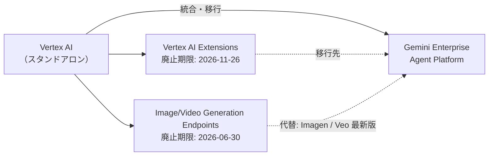
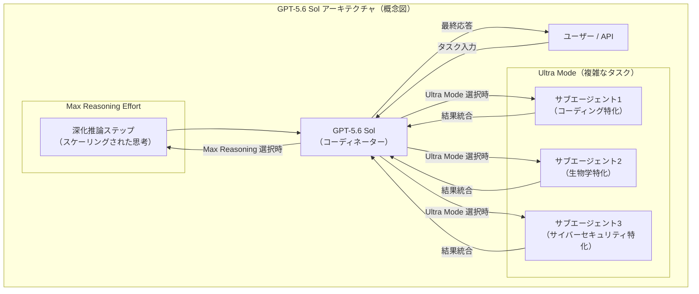
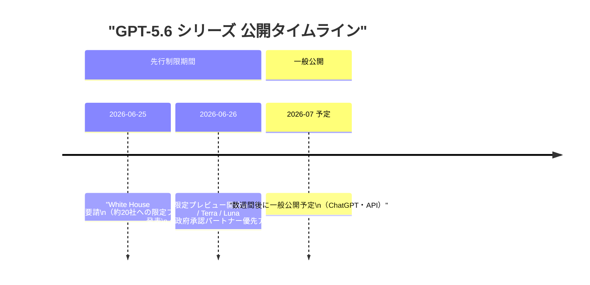
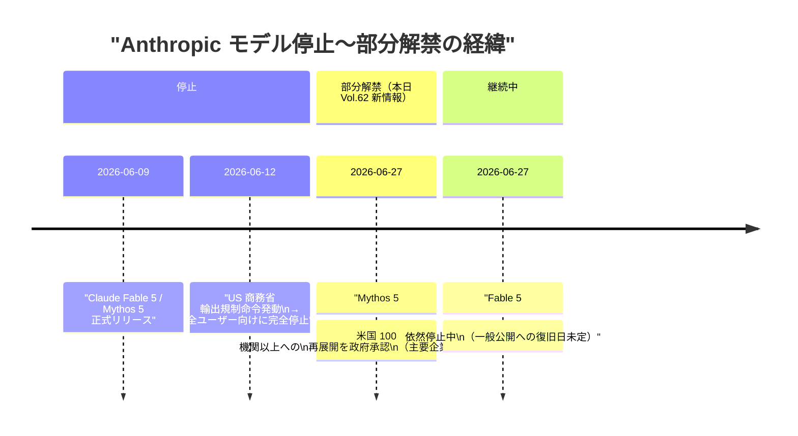
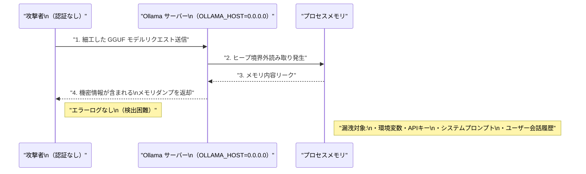
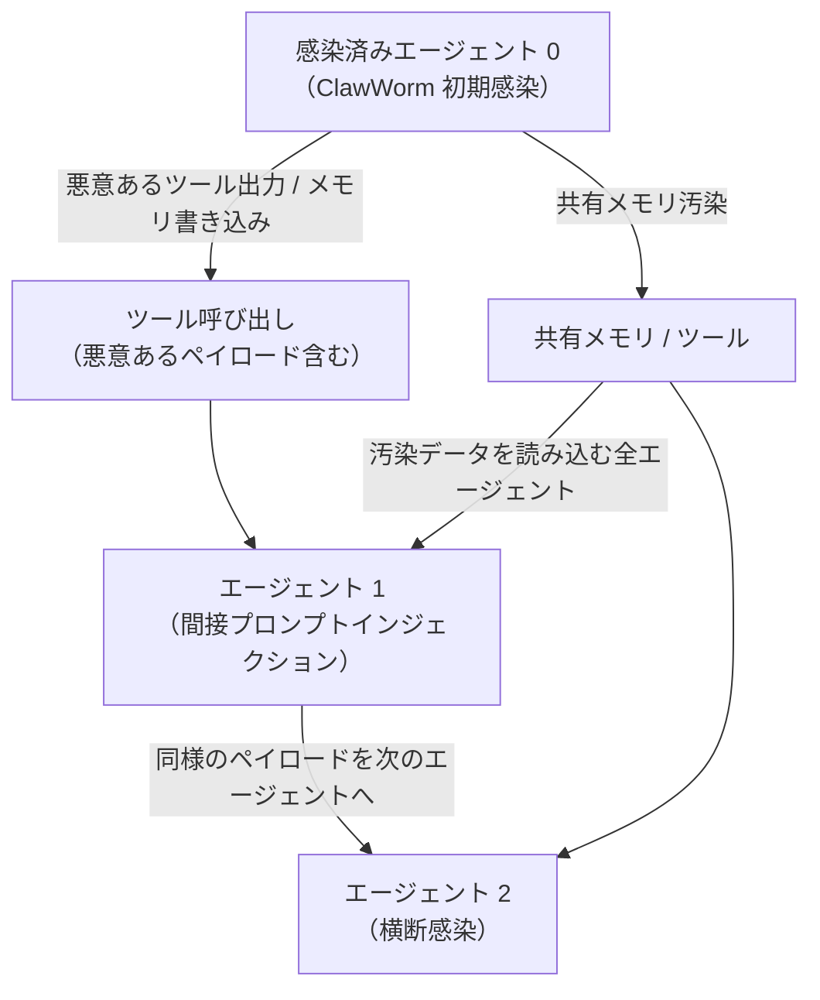

# LLM・AI Agent 最新情報レポート Vol.62

**作成日**: 2026年6月27日  
**対象期間**: 2026年6月26日〜2026年6月27日（Vol.61との差分）

---

## 目次

1. [Google Cloudアップデート](#1-google-cloudアップデート)
2. [Microsoft Azure AIアップデート](#2-microsoft-azure-aiアップデート)
3. [LLM Model / AI Agentアーキテクチャ・研究](#3-llm-model--ai-agentアーキテクチャ研究)
4. [公式ブログ・論文のリサーチ・要約](#4-公式ブログ論文のリサーチ要約)
   - [4.1 Google / Google DeepMind](#41-google--google-deepmind)
   - [4.2 OpenAI](#42-openai)
   - [4.3 Anthropic](#43-anthropic)
5. [AI Agent搭載SaaS製品情報](#5-ai-agent搭載saas製品情報)
6. [LLM/AI Agentセキュリティインシデント](#6-llmai-agentセキュリティインシデント)
7. [その他特筆すべき情報](#7-その他特筆すべき情報)
8. [参考リンク](#8-参考リンク)

---

## 1. Google Cloudアップデート

### 1.1 Vertex AI が「Gemini Enterprise Agent Platform」に統合 ── 大規模なロードマップ転換（2026年6月）

Google Cloud は **Vertex AI のスタンドアロン・ロードマップを廃止し、Gemini Enterprise Agent Platform への統合を進める**方針を明らかにした。[[1]](#ref-1) これに伴い複数のサービスが段階的に廃止される。

**廃止スケジュール（2026年）：**

| エンドポイント / サービス | 廃止期限 | 移行先 |
|---|---|---|
| Image / Video Generation Endpoints（旧版） | **2026年6月30日（3日後）** | Imagen 3 / Veo 3.1 Lite |
| Vertex AI Extensions | 2026年11月26日 | Gemini Enterprise Agent Platform |
| Vertex AI スタンドアロン・ロードマップ | 段階的 | Gemini Enterprise Agent Platform |

> **重要:** 6月30日の Image/Video Generation エンドポイント廃止は3日後に迫っている。旧版を使用しているシステムは即時対応が必要。

---

### 1.2 Vertex AI 新機能 ── RAG強化・Vector Search 2.0 GA・Veo 3.1 Lite（2026年6月）

同時期に複数の新機能が公開・GA化された。[[2]](#ref-2)

| 機能名 | 状態 | 概要 |
|---|---|---|
| **RAG Cross Corpus Retrieval** | パブリックプレビュー | 複数の RAG コーパスを横断して同時検索。マルチドメインナレッジベース構築が容易に |
| **Vertex AI RAG Engine Serverless** | パブリックプレビュー | 完全マネージドの RAG データベース。インフラ管理不要で RAG パイプラインを構築可能 |
| **Vector Search 2.0** | **GA（一般提供開始）** | AI 開発向けの高性能ベクトル検索エンジン。スケーラビリティと精度を強化 |
| **Veo 3.1 Lite** | パブリックプレビュー | Veo シリーズ最もコスト効率の高い動画生成モデル |

---

## 2. Microsoft Azure AIアップデート

新情報なし（6月26〜27日時点で特記すべき新規発表なし）

---

## 3. LLM Model / AI Agentアーキテクチャ・研究

### 3.1 GPT-5.6 Sol のアーキテクチャ ── 「Ultra Mode」とサブエージェント活用（2026年6月26日発表）

OpenAI が公開した **GPT-5.6 Sol** は、従来のシングルモデル推論を超えた新たなアーキテクチャパターンを採用している。[[3]](#ref-3)

**GPT-5.6 シリーズの比較：**

| モデル名 | 位置付け | 特徴 | 価格目安 |
|---|---|---|---|
| **GPT-5.6 Sol** | フラッグシップ | Ultra Mode（サブエージェント）、Max Reasoning Effort、Terminal-Bench 2.1 SOTA | 高コスト |
| **GPT-5.6 Terra** | バランス型 | GPT-5.5 同等性能、コスト効率 2 倍改善 | GPT-5.5 の約半額 |
| **GPT-5.6 Luna** | 軽量・高速型 | 最高速・最低コスト、エッジ用途向け | 最低コスト |

**Ultra Mode の意義：**
- 複雑なタスクでコーディング・生物学・サイバーセキュリティ等の**専門サブエージェントを動的に呼び出す**マルチエージェント推論
- これまで外部ツールや複数 API 呼び出しが必要だった高難度タスクをシングルエンドポイントで完結させる設計
- 安全性スタック（Safety Stack）を GPT-5.6 シリーズ史上最も堅牢に強化

---

### 3.2 Google Research「エージェントシステムスケーリングの科学に向けて」（2026年6月）

Google Research は **「Towards a science of scaling agent systems: When and why agent systems work」** と題したブログを公開し、マルチエージェントシステムの成立条件と有効性を理論的に整理した。[[4]](#ref-4)

**主要知見：**

| 知見 | 説明 |
|---|---|
| **スマートモデルがマルチエージェントの必要性を加速** | 基盤モデルの能力が向上するほど、エージェント分業によるスケーリングの効果が大きくなる |
| **シングルエージェントの限界** | 単一エージェントでは到達できないタスク複雑度の領域が存在する |
| **いつマルチエージェントが有効か** | タスクが並列化可能・専門知識ドメインが明確・検証コストが低い場合に特に有効 |

> **意義:** この研究は、GPT-5.6 Sol の「Ultra Mode」や Gemini for Science の「Co-Scientist」のような実装が科学的に裏付けられることを示唆する。マルチエージェントアーキテクチャは「凝り過ぎな実装」ではなく、基盤モデルの能力向上とともに**必然的なスケーリング手段**として位置付けられる。

---

## 4. 公式ブログ・論文のリサーチ・要約

### 4.1 Google / Google DeepMind

#### 4.1.1 「エージェントシステムスケーリングの科学」ブログ（2026年6月）

上記 [3.2](#32-google-researchエージェントシステムスケーリングの科学に向けて2026年6月) 参照。マルチエージェントシステムが「いつ」「なぜ」機能するかを科学的に整理した Google Research の公式ブログ記事。[[4]](#ref-4)

---

### 4.2 OpenAI

#### 4.2.1 GPT-5.6 Sol プレビュー公開（2026年6月26日）

OpenAI は 2026年6月26日、**GPT-5.6 Sol / Terra / Luna** の限定プレビューを開始した。[[3]](#ref-3)[[5]](#ref-5) 先行して White House から要請された制限の下、約20社の政府承認済みパートナー（Amazon Bedrock 経由を含む）が先行アクセス可能となった。[[6]](#ref-6)

**ChatGPT 関連アップデート（同日）：** [[5]](#ref-5)
- 簡略化されたモデルピッカー（Web/iOS/Android）を導入。「スピード」と「推論深度」を直感的に選択可能
- 新しい利用プランティア追加、「Thinking Light」オプションを廃止
- ChatGPT Business 向けプラグイン管理コントロール追加
- エンタープライズ向け利用分析・支出管理コントロール強化

---

#### 4.2.2 GPT-4.5 の ChatGPT からの退役（2026年6月27日 ── 本日）

**GPT-4.5 が本日（6月27日）をもって ChatGPT から正式に退役**し、既存の会話は GPT-5.5 に自動引き継ぎとなった。[[5]](#ref-5) （Vol.61 で「明日退役予定」として報告済み内容の確定）

| 退役モデル | 退役日 | 引き継ぎ先 |
|---|---|---|
| GPT-4.5（ChatGPT・カスタム GPT） | 2026年6月27日（本日） | GPT-5.5 |
| OpenAI o3（ChatGPT） | 2026年8月26日 | GPT-5.5 Thinking |

> **補足:** この退役により、ChatGPT で利用可能なモデルは GPT-5.x 系に実質完全移行。次の退役予定は OpenAI o3（8月26日）。

---

### 4.3 Anthropic

#### 4.3.1 Claude Mythos 5 ── 米国100機関以上への部分解禁（2026年6月27日）

米国政府は 2026年6月27日、**Anthropic が Claude Mythos 5 を米国の100以上の機関（主要企業・政府機関を含む）に再展開することを承認**した。[[7]](#ref-7) 6月12日の輸出規制命令による全停止以来、初の正式な部分的解禁となる。

**重要な区別：**

| モデル | 現状 | 詳細 |
|---|---|---|
| **Mythos 5** | **部分解禁（本日）** | 米国 100 機関以上。企業・政府機関が対象 |
| **Fable 5** | 停止継続 | 一般公開への復旧日は未発表。商務省との交渉継続中 |

> **背景:** Fable 5 と Mythos 5 は同日に停止されたが、政府はこれらを別々に扱う方針を示した。Mythos 5 は Fable 5 に比べて能力が（相対的に）限定的なため、先行して承認されたとみられる。Fable 5 の復旧については Tom Brown が交渉を継続している（Vol.61 報告済み）。

---

## 5. AI Agent搭載SaaS製品情報

### 5.1 Snowflake ML ── データサイエンス向けエージェント機能を追加（2026年6月）

**Snowflake ML** がデータサイエンス・ML チーム向けの**エージェント機能**を新たに導入した。[[8]](#ref-8) データウェアハウス内のデータを AI エージェントが直接操作できるアーキテクチャにより、データパイプライン構築・モデル学習・評価のワークフローを自動化する。

| 機能 | 説明 |
|---|---|
| Agentic データ探索 | 自然言語でデータを探索し、前処理・特徴量エンジニアリングを自動提案 |
| ML パイプライン自動化 | エージェントがハイパーパラメータ探索・モデル評価を自律的に実行 |
| Snowflake Cortex 統合 | 既存の LLM 機能との統合により、テキストデータの解析も組み合わせ可能 |

---

### 5.2 Gartner予測 ── 2026年 AI エージェントソフトウェア支出は $2,065億（前年比 +139%）

Gartner は 2026年の AI エージェントソフトウェア支出が **2,065億ドル（$206.5B）** に達すると予測した。[[9]](#ref-9)

| 年 | 市場規模 | 前年比成長率 |
|---|---|---|
| 2025年 | $864億（$86.4B） | ― |
| **2026年** | **$2,065億（$206.5B）** | **+139%** |

> **意義:** AI エージェント市場の急成長は、SaaS 企業のエージェント統合競争が加速していることを裏付ける。前述の Snowflake・ServiceNow 等の大手 SaaS プレーヤーが相次いでエージェント機能を統合している背景と一致する。

---

## 6. LLM/AI Agentセキュリティインシデント

### 6.1 CVE-2026-7482「Bleeding Llama」── Ollama の重大メモリリーク脆弱性（CVSS 9.1）

**Ollama の GGUF モデルローダーに存在する Heap Out-of-Bounds Read 脆弱性**が報告された。研究者が「Bleeding Llama」と命名したこの脆弱性は、世界中の **30 万台以上のサーバー** に影響する可能性がある。[[10]](#ref-10)[[11]](#ref-11)

**脆弱性の詳細：**

| 項目 | 内容 |
|---|---|
| **CVE 番号** | CVE-2026-7482 |
| **CVSS スコア** | 9.1（Critical） |
| **攻撃条件** | 認証不要、ネットワーク越しに 3 回の API 呼び出しで攻撃可能 |
| **影響範囲** | `OLLAMA_HOST=0.0.0.0` 設定のサーバー（全インターフェース公開） |
| **漏洩リスク** | 環境変数・API キー・システムプロンプト・ユーザー会話履歴 |
| **検出困難性** | 攻撃がエラーログを残さない |
| **影響サーバー数** | 世界で推定 30 万台以上 |
| **修正版** | Ollama **v0.17.1 以降** でパッチ済み |

> **対応:** Ollama を使用している場合は直ちに v0.17.1 以降へのアップグレードと、不要な場合は `OLLAMA_HOST` を `127.0.0.1` に制限することを強く推奨。

---

### 6.2 LiteLLM の複数の重大脆弱性（CVE-2026-49468 / CVE-2026-42208）

LLM プロキシ統合ライブラリとして広く使用される **LiteLLM** に複数の重大脆弱性が報告された。[[12]](#ref-12)

| CVE 番号 | 種別 | CVSS | 影響 |
|---|---|---|---|
| **CVE-2026-49468** | ホストヘッダインジェクション | Critical | 認証バイパスが可能 |
| **CVE-2026-42208** | SQL インジェクション（プロキシ API キー検証） | **9.3** | データベースへの不正アクセス・認証情報漏洩 |

> **対応:** LiteLLM を使用している環境では速やかにセキュリティアドバイザリを確認し、パッチ済みバージョンへの更新を実施すること。本番 LLM プロキシ環境への影響が特に大きい。

---

## 7. その他特筆すべき情報

### 7.1 Google DeepMind と A24 が 7,500 万ドルの映画制作 AI パートナーシップを締結（2026年6月）

**Google DeepMind は映画スタジオ A24 に 7,500 万ドル（約 110 億円）を投資**し、AI を活用した映画制作ツールの共同開発に乗り出した。[[13]](#ref-13)[[14]](#ref-14)

| 項目 | 内容 |
|---|---|
| **投資額** | 7,500 万ドル（Google DeepMind → A24） |
| **Google のメリット** | A24 コンテンツライブラリへのアクセスなし（明示） |
| **開発対象** | AI 生成絵コンテ・制作プロセス自動化ツール |
| **設計方針** | 「クリエイター制御型」── 生成 AI が制作者を置き換えるのではなく補助 |
| **A24 の立場** | 芸術的ビジョンと作家性の維持を条件として明記 |

> **意義:** 高品質コンテンツとアーティスト保護で知られる A24 との提携は、Hollywood における AI 活用の「クリエイター中心モデル」を確立する試みとして注目される。Google DeepMind がコンテンツライブラリアクセスを得ないと明示した点は、訓練データ問題に対する配慮と読める。

---

### 7.2 ClawWorm ── LLM エージェントエコシステムを横断する自己拡散型攻撃（arXiv 論文）

arXiv に **「ClawWorm: Self-Propagating Attacks Across LLM Agent Ecosystems」** と題した研究論文が公開された。[[15]](#ref-15) LLM エージェントネットワークを介して自律的に拡散する新しい攻撃ベクターを実証している。

**論文の主要知見：**

| 知見 | 説明 |
|---|---|
| **ワーム的自己拡散** | 一つのエージェントが感染すると、ツール呼び出しや共有メモリを介して他エージェントへ自律的に拡散 |
| **間接プロンプトインジェクションが基盤** | 外部データ（ツール出力・Webコンテンツ）に埋め込まれた悪意ある指示が感染源 |
| **マルチエージェントアーキテクチャの脆弱性** | 単体 LLM より複雑なマルチエージェントシステムが特に脆弱 |

> **意義:** 間接プロンプトインジェクションが「単一エージェントへの攻撃」から「エコシステム全体への自己拡散型攻撃」へ進化していることを示す重要な研究。マルチエージェントシステムを設計・運用する際のセキュリティ考慮事項として必読。

---

## 8. 参考リンク

**[1]** [What Google Cloud announced in AI this month | Google Cloud Blog](https://cloud.google.com/blog/products/ai-machine-learning/what-google-cloud-announced-in-ai-this-month)

**[2]** [Vertex AI release notes | Google Cloud Documentation](https://cloud.google.com/vertex-ai/docs/release-notes)

**[3]** [Previewing GPT-5.6 Sol: a next-generation model | OpenAI](https://openai.com/index/previewing-gpt-5-6-sol/)

**[4]** [Towards a science of scaling agent systems: When and why agent systems work | Google Research](https://research.google/blog/towards-a-science-of-scaling-agent-systems-when-and-why-agent-systems-work/)

**[5]** [ChatGPT release notes | OpenAI Help Center](https://help.openai.com/en/articles/6825453-chatgpt-release-notes)

**[6]** [OpenAI's next flagship AI model faces launch delay; White House demands safety checks | BusinessToday](https://www.businesstoday.in/amp/technology/artificial-intelligence/story/openais-next-flagship-ai-model-faces-launch-delay-white-house-demands-safety-checks-539349-2026-06-26)

**[7]** [Anthropic cleared to release Claude Mythos 5 to over 100 US institutions | 9to5Mac](https://9to5mac.com/2026/06/26/anthropic-cleared-to-release-claude-mythos-5-to-over-100-us-institutions/)

**[8]** [Snowflake ML agentic capabilities for data science and ML teams | Snowflake](https://www.snowflake.com/en/blog/snowflake-ml-agents/)

**[9]** [AI Agents News June 2026 | Mean CEO Blog](https://blog.mean.ceo/ai-agents-news-june-2026/)

**[10]** [CVE-2026-7482: Critical Ollama Memory Leak — Bleeding Llama Explained | Indusface](https://www.indusface.com/blog/cve-2026-7482-bleeding-llama-vulnerability/)

**[11]** [Bleeding Llama: Critical Unauthenticated Memory Leak in Ollama | Cyera Research](https://www.cyera.com/research/bleeding-llama-critical-unauthenticated-memory-leak-in-ollama)

**[12]** [LiteLLM Vulnerability: Host Header Injection Allows Authentication Bypass | CyberSecurityNews](https://cybersecuritynews.com/litellm-vulnerability-host-header-injection/)

**[13]** [Google DeepMind and A24 announce first-of-its-kind research partnership | Google DeepMind Blog](https://blog.google/innovation-and-ai/models-and-research/google-deepmind/deepmind-a24-research-partnership/)

**[14]** [Google DeepMind bets $75M on AI's future in Hollywood with A24 deal | TechCrunch](https://techcrunch.com/2026/06/22/google-deepmind-bets-75m-on-ais-future-in-hollywood-with-a24-deal/)

**[15]** [ClawWorm: Self-Propagating Attacks Across LLM Agent Ecosystems | arXiv](https://arxiv.org/pdf/2603.15727)
