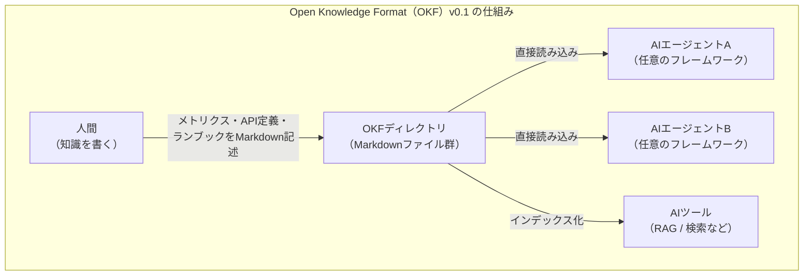
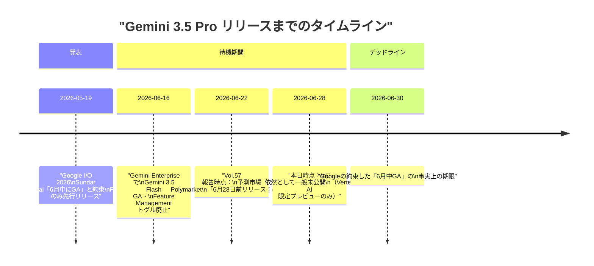
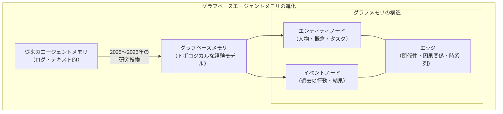
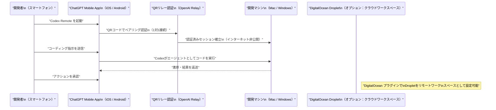
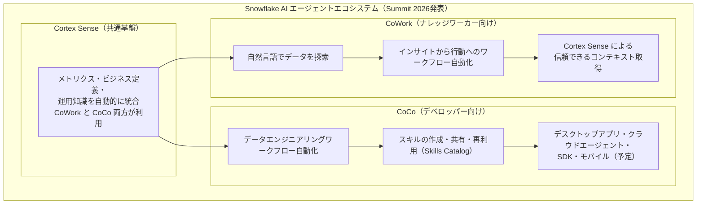
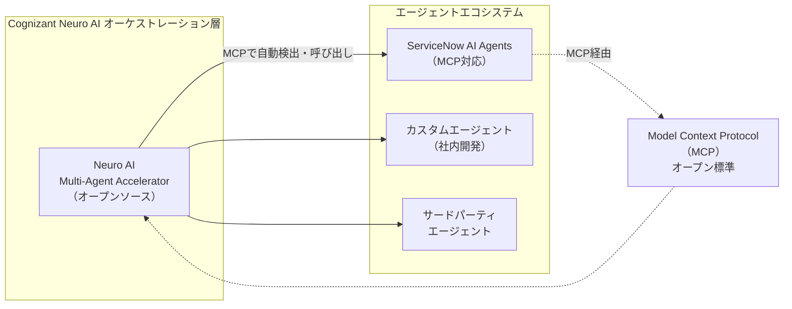

# LLM・AI Agent 最新情報レポート Vol.63

**作成日**: 2026年6月28日  
**対象期間**: 2026年6月27日〜2026年6月28日（Vol.62との差分）

---

## 目次

1. [Google Cloudアップデート](#1-google-cloudアップデート)
2. [Microsoft Azure AIアップデート](#2-microsoft-azure-aiアップデート)
3. [LLM Model / AI Agentアーキテクチャ・研究](#3-llm-model--ai-agentアーキテクチャ研究)
4. [公式ブログ・論文のリサーチ・要約](#4-公式ブログ論文のリサーチ要約)
   - [4.1 Google / Google DeepMind](#41-google--google-deepmind)
   - [4.2 OpenAI](#42-openai)
   - [4.3 Anthropic](#43-anthropic)
5. [AI Agent搭載SaaS製品情報](#5-ai-agent搭載saas製品情報)
6. [LLM/AI Agentセキュリティインシデント](#6-llmai-agentセキュリティインシデント)
7. [その他特筆すべき情報](#7-その他特筆すべき情報)
8. [参考リンク](#8-参考リンク)

---

## 1. Google Cloudアップデート

### 1.1 Open Knowledge Format（OKF）v0.1 ── AIエージェント向け知識表現の標準仕様（2026年6月12日発表）

Google Cloud は 2026年6月12日、**Open Knowledge Format（OKF）v0.1** を公開した。[[1]](#ref-1)[[2]](#ref-2) これはAIエージェントが組織の知識を直接読み取り・利用できるようにするためのオープン仕様で、特定のベンダーやフレームワークに依存しない「ベンダーニュートラル」な設計が特徴だ。

**OKF v0.1 の主要概念：**

| 概念 | 内容 |
|---|---|
| **フォーマット** | YAMLフロントマター付きMarkdownファイルのディレクトリ構造 |
| **表現できる知識** | メトリクス定義・テーブル・データセット・API・ランブックなど |
| **設計原則** | 人間可読かつエージェント可読（翻訳・変換不要で直接読み込み可能） |
| **相互運用性** | 異なるプロデューサーが書いたウィキを、異なるエージェントが翻訳なしで消費可能 |
| **ポジショニング** | v0.1 は「完成した標準ではなく出発点」とGoogle Cloudが明示 |

**背景と意義：**
OKF は、企業内に散在する知識を「LLM Wiki」と呼ばれるパターンで整理する試みを標準化したものだ。[[3]](#ref-3) 従来、各企業・各ツールが独自形式で知識を管理していたため、異なるエージェント間でのコンテキスト共有が困難だった。OKF はこの課題に対し、ベンダーロックインのない共通フォーマットを提供する。

> **評価:** AIエージェントの爆発的普及に伴い、「エージェントが読める知識ベース」の整備が次の課題として浮上している。OKF がデファクトスタンダードになれば、RAGパイプラインやマルチエージェントシステムでの知識共有が大幅に簡素化される可能性がある。ただし v0.1 は初期仕様であり、エコシステムの形成はこれからだ。

---

### 1.2 Gemini 3.5 Pro：6月30日 GA デッドライン直前の状況（2026年6月28日）

Sundar Pichai が Google I/O 2026（5月19日）で「6月中に一般公開」と約束していた **Gemini 3.5 Pro** は、6月28日時点でいまだ一般提供（GA）に至っていない。[[4]](#ref-4)[[5]](#ref-5) 残り2日でリリースが実現するかが注目される。

**確認済みスペック：**

| 仕様 | 内容 |
|---|---|
| **コンテキストウィンドウ** | 200万トークン（2M tokens） |
| **推論モード** | "Deep Think"（拡張推論モード） |
| **マルチモーダル** | テキスト・画像・動画・音声の統合理解 |
| **予想価格** | 入力 $15 / 出力 $60 per 1M tokens |

> **現状:** 本日（6月28日）時点で GA 未達成。6月30日が事実上のデッドラインだが、正式な期日は設定されていない。Vertex AI の限定プレビューアクセスのみ提供中。

---

## 2. Microsoft Azure AIアップデート

新情報なし（6月27〜28日時点で特記すべき新規発表なし）

---

## 3. LLM Model / AI Agentアーキテクチャ・研究

### 3.1 グラフ構造によるAIエージェントメモリ ── 「Graph-based Agent Memory」調査論文（arXiv:2602.05665）

エージェントのメモリ設計に関する新しい調査論文 **「Graph-based Agent Memory: Taxonomy, Techniques, and Applications」** が注目を集めている。[[6]](#ref-6) 本論文は、AIエージェントにおけるメモリの役割をグラフ構造で表現する手法の体系的な整理を行っている。

**キーポイント：**

**従来メモリとグラフメモリの比較：**

| 項目 | 従来メモリ（テキスト的） | グラフベースメモリ |
|---|---|---|
| **情報の保持形式** | フラットなログ・チャット履歴 | ノードとエッジによるトポロジカルな構造 |
| **関係性の表現** | 暗黙的（文脈に埋もれる） | 明示的（エッジとして保存） |
| **長期記憶への対応** | コンテキスト窓の制約を受けやすい | 関連ノードのみ選択的に取得可能 |
| **時間的な知識進化** | 更新が困難（書き直しが必要） | ノード・エッジの追加・削除で対応 |
| **マルチエージェント共有** | 構造化されておらず共有困難 | グラフ構造が相互運用を促進 |

**主要な知見：**
- グラフベースのエージェントメモリは、事実の「ログ」から「経験のトポロジカルモデル」へと進化しており、情報がどのように接続されているかを時系列で保存する
- 2025〜2026年にかけてこの領域が研究の最前線となっており、長期タスクの実行において特に有効
- Microsoft Azure Foundry Agent Service の「3スコープメモリ（手続き的・ユーザー・セッション）」など、実プラットフォームへの実装が始まっている

> **意義:** マルチエージェントシステムが複雑化するなか、エージェントが「何を知っているか」だけでなく「どのように知識が繋がっているか」を構造的に管理できるグラフメモリは、長期エージェントの信頼性向上に直結する基盤技術として重要性を増している。

---

## 4. 公式ブログ・論文のリサーチ・要約

### 4.1 Google / Google DeepMind

#### 4.1.1 Open Knowledge Format（OKF）v0.1 公開（2026年6月12日）

[1.1](#11-open-knowledge-formatokfv01--aiエージェント向け知識表現の標準仕様2026年6月12日発表) を参照。AIエージェント向けの知識表現標準としてGoogle Cloudが公開したオープン仕様。[[1]](#ref-1)

---

### 4.2 OpenAI

#### 4.2.1 Codex Remote ── 全有料プランに一般提供開始（2026年6月25日）

OpenAI は 2026年6月25日、**Codex Remote** を全有料 ChatGPT プラン（Plus・Pro・Business・Enterprise・Education）で一般提供（GA）を開始した。[[7]](#ref-7)[[8]](#ref-8)

**Codex Remote の主要機能：**

| 機能 | 詳細 |
|---|---|
| **モバイルからのリモート制御** | iPhone/Android から Mac/Windows の開発マシンで Codex セッションを開始・継続 |
| **QRペアリング認証** | 旧来のリモートシェル接続を廃止し、デバイスと開発マシンを1対1でQR認証。開発マシンはパブリックインターネットに非公開のまま接続可能 |
| **進捗確認と承認** | 長時間実行中のコーディングセッションの進捗をモバイルで確認し、アクションを承認 |
| **DigitalOcean プラグイン** | Droplet をプロビジョニングして Codex のリモートワークスペースとして設定するプラグインを追加 |
| **対応プラン** | ChatGPT Plus・Pro・Business・Enterprise・Education（全有料プラン） |

> **意義:** 従来の Codex はブラウザ/デスクトップ前提だったが、Codex Remote により開発者が移動中でも AI エージェントによるコーディングセッションを監視・継続できるようになった。QR ペアリング方式の導入により、旧来の開発マシン公開接続に伴うセキュリティリスクも軽減されている。

---

### 4.3 Anthropic

#### 4.3.1 Claude Code 機能強化 ── /rewind 追加・CPU 37%削減（2026年6月27日）

Anthropic は 2026年6月27日、**Claude Code** の機能強化をリリースした。[[9]](#ref-9)

| 改善項目 | 内容 |
|---|---|
| **`/rewind` コマンド追加** | `/clear` 実行前の会話に巻き戻して再開が可能に |
| **MCP 信頼性向上** | MCP 接続の信頼性改善・OAuth リトライ機能の強化 |
| **CPU 使用率削減** | ストリーミング中の CPU 使用率を約 **37%** 削減 |
| **音声入力改善** | 音声ディクテーションのバグ修正、Linux での音声検出改善 |
| **Remote セッション改善** | `claude agents` およびリモートセッション起動の安定性向上 |
| **フルスクリーンマウス制御** | フルスクリーン表示でのマウスクリック操作に対応 |

> **背景:** Claude Code の /rewind は、`/clear` 後に「あの会話から再開したかった」という開発者の声に応えた機能追加。MCP 信頼性向上は、Claude Code を AI エージェントの中枢として使う複雑なワークフローでの安定性に直結する。

---

## 5. AI Agent搭載SaaS製品情報

### 5.1 Snowflake Summit 2026 ── CoWork & CoCo 発表（2026年6月2日）

Snowflake は 2026年6月2日開催の **Snowflake Summit 2026** にて、エンタープライズ向けのAIエージェント戦略を大幅に強化した新製品・新機能を発表した。[[10]](#ref-10)[[11]](#ref-11)

**主要アップデート詳細：**

| 製品 / 機能 | 旧名 | 概要 |
|---|---|---|
| **Snowflake CoWork** | Snowflake Intelligence | ナレッジワーカー向けパーソナルAIエージェント。Summit時点でアカウント数が前四半期比**2倍以上**に増加、週次アクティブ利用は13,600アカウント超 |
| **Snowflake CoCo** | Cortex Code | データエンジニア・AI開発者向けコーディングエージェント。デスクトップアプリ・クラウドエージェント・SDK として展開 |
| **Cortex Sense** | （新機能） | データ・ビジネス定義・運用知識を自動的に統合して提供する共通基盤。CoWork / CoCo の両方が活用 |
| **Skills Catalog** | （新機能） | チーム間でスキル（再利用可能なエージェント機能）を共有・インストール・公開できるカタログ |

> **意義:** CoWork のアカウント数2倍増（前四半期比）はエンタープライズにおけるデータ分析エージェントの実採用が急速に進んでいることを示す。特に Cortex Sense による「知識の自動統合」は、前述の Google OKF と同様の問題（AIエージェントへの文脈提供）に対して Snowflake 独自のアプローチで答えるものだ。

---

### 5.2 Cognizant × ServiceNow ── MCPベースのAIエージェント相互運用を実現（2026年6月18日）

Cognizant は 2026年6月18日、**ServiceNow AI エージェント** と **Cognizant Neuro® AI マルチエージェントアクセラレーター** の相互運用性を発表した。[[12]](#ref-12)[[13]](#ref-13)

**技術的特徴：**

| 項目 | 内容 |
|---|---|
| **統合技術** | Model Context Protocol（MCP）── ServiceNow がサポートするオープン標準 |
| **自動ディスカバリ** | Neuro AI が ServiceNow の新しいエージェントを自動的に検出・登録 |
| **カスタムコネクタ不要** | MCP経由のため専用コネクタの開発・保守が不要 |
| **リアルタイムルーティング** | 各リクエストを適切なエージェントへリアルタイムでルーティング |
| **オープンソース** | Neuro AI Multi-Agent Accelerator は GitHub で公開（`cognizant-ai-lab/neuro-san-studio`） |

> **意義:** MCP（Model Context Protocol）が企業向けエージェントオーケストレーションのデファクトスタンダードとして普及しつつあることを示す事例。ServiceNow のような既存 SaaS に「MCP サポート」を持たせることで、外部エージェントが専用コネクタなしに ServiceNow エージェントを呼び出せる世界が近づいている。

---

## 6. LLM/AI Agentセキュリティインシデント

新情報なし（昨日の Vol.62 にて CVE-2026-7482「Bleeding Llama」（Ollama）および LiteLLM 複数 CVE を報告済み。6月28日時点で新たな重大インシデントの報告なし）

---

## 7. その他特筆すべき情報

### 7.1 GPT-5.6 シリーズ ── 政府承認ゲートの最新状況（2026年6月28日）

GPT-5.6 Sol/Terra/Luna は 6月26日の限定プレビュー開始後、依然として **約20社の政府承認済みパートナー限定** の状態が続いている。[[14]](#ref-14)[[15]](#ref-15)

| 状況 | 詳細 |
|---|---|
| **現在の対象** | 政府が承認した約20社（Amazon Bedrock 経由含む） |
| **OpenAI の立場** | 「これは広い公開への最短ルート」と声明。サイバー大統領令フレームワーク策定と並行して交渉継続中 |
| **次のステップ** | 翌週（7月第1週）に「追加企業へのアクセス拡大」をOpenAIが予告 |
| **一般公開予定** | 「数週間後」（7月中旬〜下旬と予想） |

> **背景 (Vol.62 からの続報):** Vol.62 で報告した White House の制限要請を受け、OpenAI は政府のサイバー大統領令フレームワークが確立されるまでの「橋渡し期間」として限定配布を継続している。Anthropic の Mythos 5 との並行制限は、2026年の「AI 安全保障」を巡る米政府と AI 企業の緊張関係の象徴的事例となっている。

---

## 8. 参考リンク

**[1]** [How the Open Knowledge Format can improve data sharing | Google Cloud Blog](https://cloud.google.com/blog/products/data-analytics/how-the-open-knowledge-format-can-improve-data-sharing)

**[2]** [Open Knowledge Format (OKF): Google AI Agent Standard | explainx.ai](https://www.explainx.ai/blog/google-open-knowledge-format-okf-ai-agents-2026)

**[3]** [Google Cloud Introduces Open Knowledge Format (OKF): A Vendor-Neutral Markdown Spec for Giving AI Agents Curated Context | MarkTechPost](https://www.marktechpost.com/2026/06/16/google-cloud-introduces-open-knowledge-format-okf-a-vendor-neutral-markdown-spec-for-giving-ai-agents-curated-context/)

**[4]** [Gemini 3.5 Pro: The June 2026 Launch Guide | Codersera](https://codersera.com/blog/gemini-3-5-pro-launch-guide-2026/)

**[5]** [Gemini 3.5 Pro Release Date: Features & Price (2026) | TechJournal](https://techjournal.org/gemini-3-5-pro-release-date)

**[6]** [Graph-based Agent Memory: Taxonomy, Techniques, and Applications | arXiv:2602.05665](https://arxiv.org/html/2602.05665v1)

**[7]** [OpenAI Codex Remote Goes Live for All Plans: Phone Control Now Secured by QR Relay | TechTimes](https://www.techtimes.com/articles/319201/20260627/openai-codex-remote-goes-live-all-plans-phone-control-now-secured-qr-relay.htm)

**[8]** [Changelog – Codex | OpenAI Developers](https://developers.openai.com/codex/changelog)

**[9]** [Anthropic Release Notes - June 2026 Latest Updates | Releasebot](https://releasebot.io/updates/anthropic)

**[10]** [Snowflake CoWork Powers the Agentic Enterprise as the Personal Agent for Knowledge Workers | Snowflake](https://www.snowflake.com/en/news/press-releases/snowflake-cowork-powers-the-agentic-enterprise-as-the-personal-agent-for-knowledge-workers-to-work-smarter/)

**[11]** [Snowflake CoCo Redefines Enterprise AI Development as the Coding Agent | Snowflake](https://www.snowflake.com/en/news/press-releases/snowflake-coco-redefines-enterprise-ai-development-as-the-coding-agent-built-for-faster-easier-and-more-powerful-innovation-anywhere/)

**[12]** [Cognizant expands cross-platform agentic AI with new ServiceNow AI Agent interoperability | Cognizant Newsroom](https://news.cognizant.com/2026-06-18-Cognizant-expands-cross-platform-agentic-AI-with-new-ServiceNow-AI-Agent-interoperability)

**[13]** [Cognizant links ServiceNow AI agents to one orchestration layer | StockTitan](https://www.stocktitan.net/news/CTSH/cognizant-expands-cross-platform-agentic-ai-with-new-service-now-ai-4gb03ft7dcb7.html)

**[14]** [GPT-5.6 Release Hits Government Approval Gate | WinBuzzer](https://winbuzzer.com/2026/06/28/gpt-56-faces-government-approval-gate-for-ai-access-xcxwbn/)

**[15]** [OpenAI limits GPT-5.6 rollout after government request, says restrictions shouldn't be the norm | TechCrunch](https://techcrunch.com/2026/06/26/openai-limits-gpt-5-6-rollout-after-government-request-says-restrictions-shouldnt-be-the-norm/)
