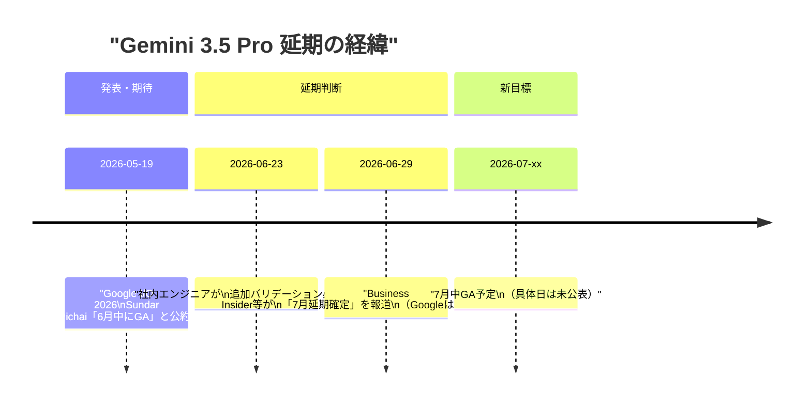
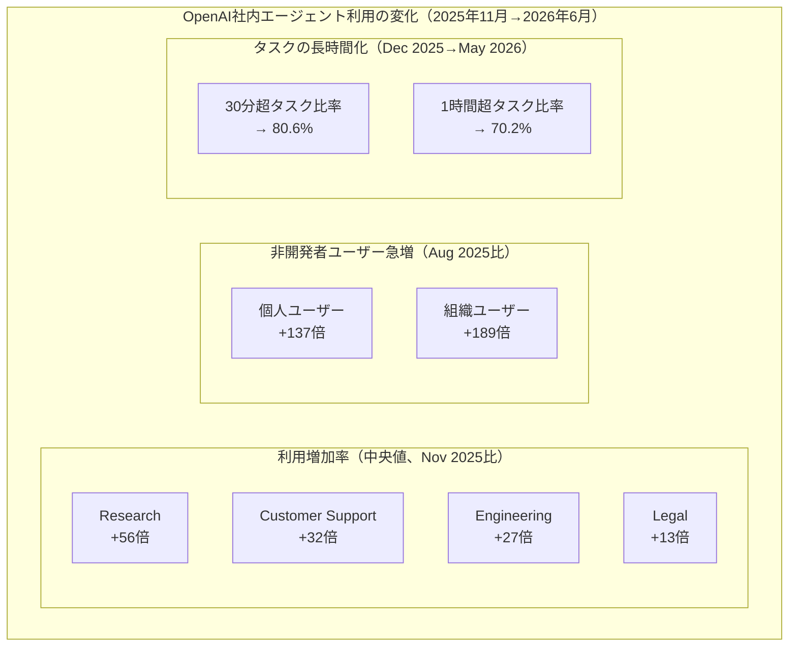
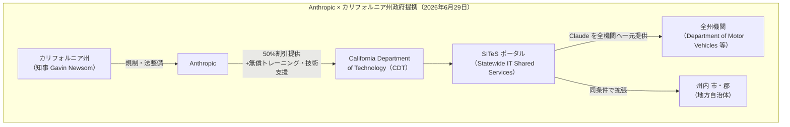
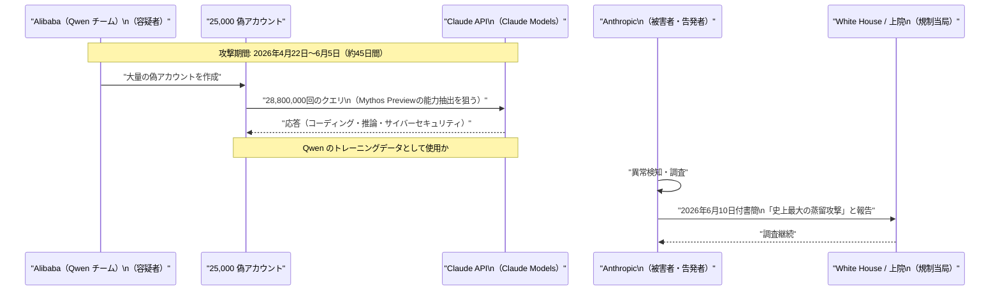
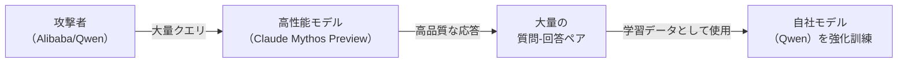

# LLM・AI Agent 最新情報レポート Vol.64

**作成日**: 2026年6月29日  
**対象期間**: 2026年6月28日〜2026年6月29日（Vol.63との差分）

---

## 目次

1. [Google Cloudアップデート](#1-google-cloudアップデート)
2. [Microsoft Azure AIアップデート](#2-microsoft-azure-aiアップデート)
3. [LLM Model / AI Agentアーキテクチャ・研究](#3-llm-model--ai-agentアーキテクチャ研究)
4. [公式ブログ・論文のリサーチ・要約](#4-公式ブログ論文のリサーチ要約)
   - [4.1 Google / Google DeepMind](#41-google--google-deepmind)
   - [4.2 OpenAI](#42-openai)
   - [4.3 Anthropic](#43-anthropic)
5. [AI Agent搭載SaaS製品情報](#5-ai-agent搭載saas製品情報)
6. [LLM/AI Agentセキュリティインシデント](#6-llmai-agentセキュリティインシデント)
7. [その他特筆すべき情報](#7-その他特筆すべき情報)
8. [参考リンク](#8-参考リンク)

---

## 1. Google Cloudアップデート

### 1.1 Gemini 3.5 Pro ── June 30 デッドライン突破、7月延期が事実上確定（2026年6月29日）

Vol.63（6月28日）では「残り2日でGAが実現するか注目」と報告していた **Gemini 3.5 Pro** だが、Business Insider 等の内部情報により **7月リリースへの延期が事実上確定** した。[[1]](#ref-1)[[2]](#ref-2)

**延期の背景として指摘される要因：**

| 要因 | 詳細 |
|---|---|
| **品質改善** | 早期エンタープライズテスターのフィードバックを受け、コーディング・トークン効率・長時間タスク性能を追加調整 |
| **人材流出** | Gemini 共同リード Noam Shazeer を含むシニア研究者4名が OpenAI・Anthropic へ相次いで移籍 |
| **競争環境** | GPT-5.6 Sol のプレビュー開始と Claude Fable 5 のGA済みにより、性能比較のハードルが上昇 |

**確認済みスペック（変更なし）：**

| 仕様 | 内容 |
|---|---|
| コンテキストウィンドウ | 200万トークン（2M tokens） |
| 推論モード | "Deep Think"（拡張推論） |
| マルチモーダル | テキスト・画像・動画・音声 |
| 予想価格 | 入力 $15 / 出力 $60 per 1M tokens |

> **評価:** Sundar Pichai の「6月GA」という公約が守られなかったことは Google にとって信頼性面での痛手だ。一方、品質優先での延期判断そのものは適切であり、7月リリース後のユーザー受容に影響する要素として注目される。なお Google は6月29日時点でも公式コメントを拒否している。

---

## 2. Microsoft Azure AIアップデート

新情報なし（6月28〜29日時点で特記すべき新規発表なし）

---

## 3. LLM Model / AI Agentアーキテクチャ・研究

### 3.1 「チャットボットからエージェントへの転換」── OpenAI 内部統計が示すエージェント利用の爆発的拡大（2026年6月28日）

OpenAI が6月28日に公開したブログ **「How agents are transforming work」** は、同社内部でのエージェント活用データを公開した初の詳細な定量レポートとして注目される。[[3]](#ref-3)

**主要統計：**

| 指標 | 内容 |
|---|---|
| **Codex 出力割合** | 平均的な OpenAI 社員の全出力トークンの **85% 以上** が Codex 経由 |
| **週次アクティブユーザー** | Codex が **500万人/週** を超過（うち非開発者が約20%、開発者の3倍速で成長） |
| **99パーセンタイル利用** | パワーユーザーが1日あたり **60時間超** の Codex エージェントターンを並列実行 |
| **部門横断利用** | Legal・Recruiting を含む**全部門**が Codex を主要 AI ツールとして採用 |

**アーキテクチャ的意義：**

このデータは、LLM の利用パターンが **「質問→回答」の1回交換（チャット）** から **「長時間・複数ステップ・並列実行」（エージェント）** へ構造的にシフトしていることを定量的に示す。特に「1時間超のタスク比率が70%を超えた」事実は、エージェントインフラ（永続メモリ・人間の承認フロー・コスト制御）の設計が従来より高い優先度で求められることを示唆する。

> **背景:** このブログは OpenAI 社内データを使った事例研究だが、Codex をベースとした分析であるため外部企業への一般化には注意が必要。ただし「チャットボット利用からエージェント利用への転換」のシグナルとしては重要な一次資料となる。

---

## 4. 公式ブログ・論文のリサーチ・要約

### 4.1 Google / Google DeepMind

#### 4.1.1 Gemini 3.5 Pro 延期と Google AI 人材流出（2026年6月29日）

Gemini 3.5 Pro の7月延期と並んで注目されるのが、Google DeepMind の **シニア AI 研究者の相次ぐ離脱** だ。[[1]](#ref-1)[[4]](#ref-4)

| 離脱者 | 役職 | 移籍先 |
|---|---|---|
| **Noam Shazeer** | Gemini 共同リード（Transformer の共同発明者）| OpenAI |
| その他シニア研究者3名 | Gemini 開発チーム上位 | OpenAI / Anthropic |

Shazeer は2024年に Google を退職して Character.AI を設立後、2025年に Google が Character.AI を買収する形で一度復帰していた。今回は再び OpenAI へ移籍したとみられる。

> **構造的リスク:** Gemini の中核設計者が競合他社へ流出することは、単なる人材喪失に留まらず、技術的優位の維持に影響しうる。特に Shazeer が Transformer アーキテクチャの共同発明者であることを踏まえると、次世代モデル開発への影響が懸念される。

---

### 4.2 OpenAI

#### 4.2.1 「エージェントが働き方を変えている」── 内部統計レポート公開（2026年6月28日）

[3.1](#31-チャットボットからエージェントへの転換--openai-内部統計が示すエージェント利用の爆発的拡大2026年6月28日) を参照。OpenAI が公開した定量データは、エージェントの業務浸透度を示す最重要一次資料のひとつとなった。[[3]](#ref-3)

---

### 4.3 Anthropic

#### 4.3.1 カリフォルニア州政府と提携 ── 全州機関に Claude を50%割引で提供（2026年6月29日）

Anthropic と **カリフォルニア州知事 Gavin Newsom** は2026年6月29日、州政府・地方自治体向けの AI 活用推進で正式提携を発表した。[[5]](#ref-5)[[6]](#ref-6)

**提携の主要内容：**

| 項目 | 内容 |
|---|---|
| **割引率** | 通常価格の **50% 割引** |
| **対象** | カリフォルニア州全機関、州内の市・郡（地方自治体） |
| **提供チャネル** | CDT の新ポータル「SITeS」に Claude を掲載（AI ツールを一元化） |
| **付加サービス** | 無償のワークフォーストレーニング・技術支援・ワークフロー改善支援 |
| **位置づけ** | Claude が「全州機関で利用可能な初の AI 生産性ツール」に |

**既存の活用実績：**

一部州機関は提携以前から Claude を実業務に活用しており、以下の事例が報告されている：

- **Department of Motor Vehicles（DMV）**: 顧客サービス改善
- **California Department of Health Care Services**: 内部ワークフロー効率化
- **Department of Technology / Office of Emergency Services**: サイバーセキュリティ（コードスキャン・パッチ適用）

> **意義:** 州政府規模（人口4,000万人）への AI 導入を政府公式プログラムとして推進する先例となる。Anthropic にとっては公共部門への本格参入の橋頭堡であり、FedRAMP 認定の加速が次のステップとして注目される。また「AI は政府職員を代替するのではなく支援するもの」という Newsom 知事のフレーミングは、AI 導入に対する市民の懸念払拭を意図したメッセージとなっている。

---

## 5. AI Agent搭載SaaS製品情報

### 5.1 Anthropic × カリフォルニア州政府 ── 政府向け AI エージェント活用の実装事例（2026年6月29日）

[4.3.1](#431-カリフォルニア州政府と提携--全州機関に-claude-を50割引で提供2026年6月29日) で報告した提携の中で、カリフォルニア州は Claude をエージェントとして活用するユースケースを複数公表した。

| 活用先 | ユースケース | エージェントとしての機能 |
|---|---|---|
| **DMV** | 市民向けカスタマーサービス | 問い合わせ応答・手続きガイダンスの自動化 |
| **Health Care Services** | 内部オペレーション | ワークフロー自動化・文書処理 |
| **OES（緊急管理局）** | サイバーセキュリティ対応 | 州コードの脆弱性スキャン・パッチ生成 |

特に注目されるのは OES での活用だ。**サイバーセキュリティ目的でのコードスキャン・パッチ適用**という用途は、AI エージェントが公共インフラの防御に直接関与する事例として前例的な意義を持つ。

---

## 6. LLM/AI Agentセキュリティインシデント

### 6.1 Anthropic、Alibaba による史上最大の「蒸留攻撃」を告発（2026年6月10日書簡 → 6月24日公開）

Anthropic は2026年6月10日付でアメリカ上院議員（Tim Scott、Elizabeth Warren）および White House 当局者宛に書簡を送付し、**Alibaba の Qwen チームが約25,000の偽アカウントを使って Claude に2,880万回のクエリを実行した** と告発した。[[7]](#ref-7)[[8]](#ref-8)[[9]](#ref-9)

**インシデントの概要：**

| 項目 | 内容 |
|---|---|
| **攻撃期間** | 2026年4月22日〜6月5日（約45日間） |
| **偽アカウント数** | 約25,000アカウント |
| **クエリ総数** | 2,880万回 |
| **ターゲットモデル** | Claude の Mythos Preview（コーディング・多段階推論・サイバーセキュリティに特化した高性能モデル） |
| **目的（Anthropic主張）** | Alibaba の **Qwen モデル** の能力向上のためのトレーニングデータ収集（蒸留攻撃） |
| **規模** | 「Anthropic が把握する中で史上最大の蒸留攻撃」と Anthropic が認定 |

**蒸留攻撃（Distillation Attack）の仕組み：**

蒸留攻撃とは、より高性能な他社モデルに大量のクエリを送り、その応答を学習データとして利用することで、自社のモデルを安価に高性能化する手法だ。Anthropic はこれを「数千億ドルのアメリカの AI 投資を地政学的競合国への補助金に変える行為」と批判している。

**Alibaba の反応：**  
Alibaba は疑惑を否定しており、第三者による独立した検証は行われていない。

> **意義と評価:** この告発はいくつかの点で重要だ。第一に、モデル能力の保護という観点から、API へのアクセス制御と利用パターン監視の重要性が改めて浮き彫りになった。第二に、蒸留攻撃が「高度な AI 能力の拡散」を加速させる新しいリスクとして政策議論の俎上に載せられた点は注目に値する。ただし現時点では Anthropic の一方的な主張であり、Alibaba はこれを否定している。

---

## 7. その他特筆すべき情報

### 7.1 GPT-5.6 ── 7月第1週に追加企業へのアクセス拡大を予告（2026年6月29日時点）

Vol.63 で報告した GPT-5.6 の政府承認ゲート問題の続報。6月29日時点でも依然として限定プレビュー（政府承認済み約20社）が継続しており、OpenAI は「翌週（7月第1週）に追加企業へアクセスを拡大する」と予告している。[[10]](#ref-10)

| 状況 | 詳細 |
|---|---|
| **現在の対象** | 政府承認済み約20社 |
| **次のステップ** | 7月第1週に「追加企業へのアクセス拡大」（詳細未定） |
| **一般公開** | 「数週間後」（7月中旬〜下旬と予想） |
| **ChatGPTへの展開** | 未発表 |

GPT-5.6 のモデル価格（参考）：

| モデル | 入力 | 出力 |
|---|---|---|
| **GPT-5.6 Sol**（最上位） | $5 / 1M tokens | $30 / 1M tokens |
| **GPT-5.6 Terra**（バランス） | $2.50 / 1M tokens | $15 / 1M tokens |
| **GPT-5.6 Luna**（高速・低コスト） | $1 / 1M tokens | $6 / 1M tokens |

---

## 8. 参考リンク

**[1]** [Google delays Gemini 3.5 Pro launch to July 2026 | CryptoBriefing](https://cryptobriefing.com/google-delays-gemini-35-pro-launch-to-july-2026/)

**[2]** [Google Delays Gemini 3.5 Pro Launch To July As It Tweaks Its New Frontier AI Model | Business Insider via TradingView](https://www.tradingview.com/news/reuters.com,2026:newsml_FWN42W0FW:0-google-delays-gemini-3-5-pro-launch-to-july-as-it-tweaks-its-new-frontier-ai-model-business-insider/)

**[3]** [How agents are transforming work | OpenAI](https://openai.com/index/how-agents-are-transforming-work/)

**[4]** [Google delays Gemini 3.5 Pro to July as talent exodus deepens the pressure on its AI ambitions | Startup Fortune](https://startupfortune.com/google-delays-gemini-35-pro-to-july-as-talent-exodus-deepens-the-pressure-on-its-ai-ambitions/)

**[5]** [Governor Newsom announces a first-of-its-kind partnership, providing Anthropic tools to state agencies | Governor of California](https://www.gov.ca.gov/2026/06/29/governor-newsom-announces-a-first-of-its-kind-partnership-providing-anthropic-tools-to-state-agencies-and-improving-services-for-californians/)

**[6]** [Anthropic and Gov. Newsom forge deal allowing California government to use Claude at half price | TechCrunch](https://techcrunch.com/2026/06/29/anthropic-and-gov-newsom-forge-deal-allowing-california-government-to-use-claude-at-half-price/)

**[7]** [Anthropic accuses Alibaba of campaign to 'brazenly' and 'illicitly' extract AI capabilities | CNBC](https://www.cnbc.com/2026/06/24/anthropic-alibaba-distillation-campaign.html)

**[8]** [Anthropic says Alibaba used 25,000 fake accounts to query Claude 28.8 million times and train Qwen off the results | Tweaktown](https://www.tweaktown.com/news/112361/anthropic-says-alibaba-used-25000-fake-accounts-to-query-claude-28-8-million-times-and-train-qwen-off-the-results/index.html)

**[9]** [Anthropic claims that China's Alibaba used 25,000 fake accounts and 28.8 million exchanges to illicitly 'distill' its Claude model | Tom's Hardware](https://www.tomshardware.com/tech-industry/artificial-intelligence/anthropic-claims-that-chinas-alibaba-illicitly-distilled-its-models-from-april-to-june-2026-says-effort-involved-25-000-fake-accounts-and-28-8-million-exchanges-on-claude)

**[10]** [OpenAI defers public rollout of GPT‑5.6 as US seeks early access to frontier AI models | Yahoo News / AP](https://www.yahoo.com/news/politics/articles/openai-defers-public-rollout-gpt-170216740.html)
