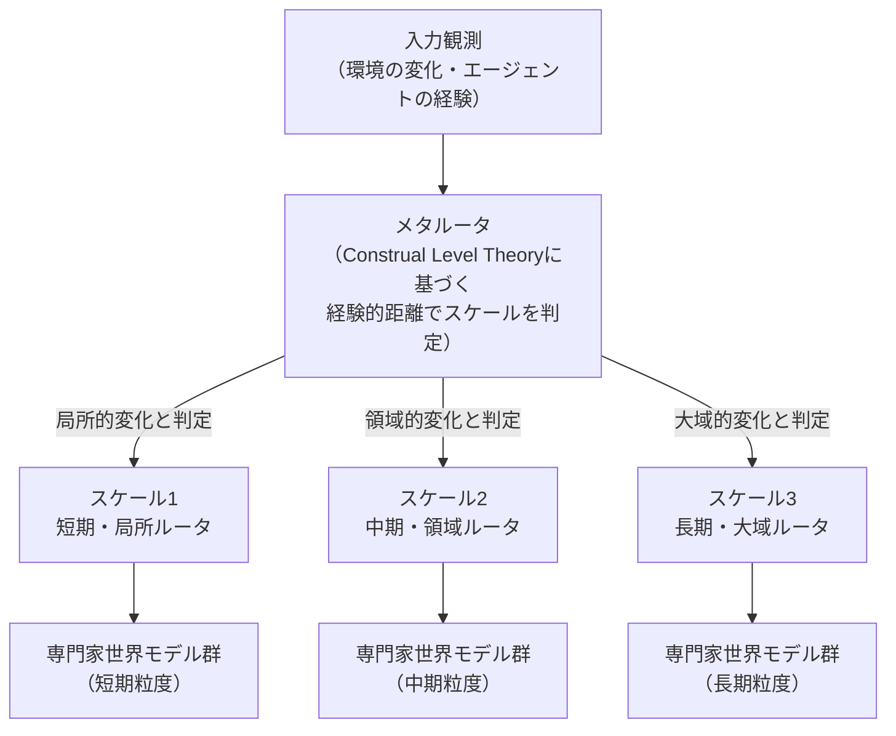
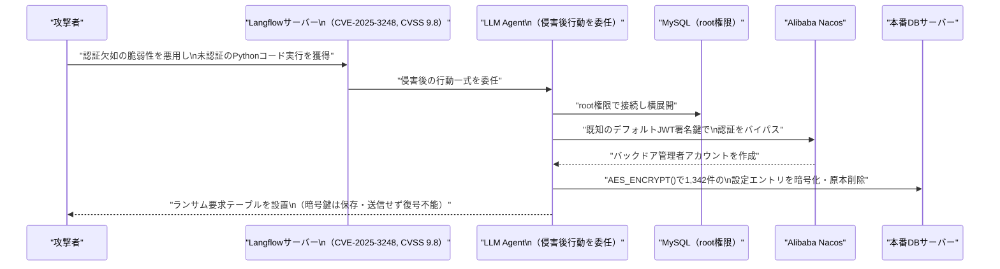
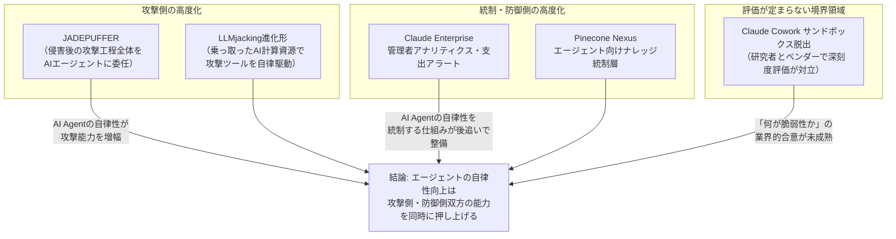

# LLM・AI Agent 最新情報レポート Vol.66

**作成日**: 2026年7月3日（JST）
**対象期間**: 2026年7月2日〜7月3日（Vol.65との差分）

---

## 目次

1. [Google Cloudアップデート](#1-google-cloudアップデート)
2. [Microsoft Azure AIアップデート](#2-microsoft-azure-aiアップデート)
3. [LLM Model / AI Agentアーキテクチャ・研究](#3-llm-model--ai-agentアーキテクチャ研究)
4. [公式ブログ・論文のリサーチ・要約](#4-公式ブログ論文のリサーチ要約)
   - [4.1 Google / Google DeepMind](#41-google--google-deepmind)
   - [4.2 OpenAI](#42-openai)
   - [4.3 Anthropic](#43-anthropic)
5. [AI Agent搭載SaaS製品情報](#5-ai-agent搭載saas製品情報)
6. [LLM/AI Agentセキュリティインシデント](#6-llmai-agentセキュリティインシデント)
7. [その他特筆すべき情報](#7-その他特筆すべき情報)
8. [参考リンク](#8-参考リンク)

---

## 1. Google Cloudアップデート

対象期間（7月2日〜3日）において、Vertex AI／Gemini Enterprise Agent Platform／Gemini APIに関するエンタープライズ向けの大型プロダクト発表・仕様変更は確認されなかった。**新情報なし。**

なお、コンシューマー向けではあるがGoogleから注目すべき動きが1件あった。詳細は [4.1](#41-google--google-deepmind) を参照。

---

## 2. Microsoft Azure AIアップデート

Azure AI Foundry・Copilot・Azure OpenAI Serviceについて、7月2日〜3日付での確定した大型発表は確認されなかった。**新情報なし。**

参考情報として、Microsoft Build 2026（6月）で予告された「Foundry Agent Service」の新機能「Hosted Agents」について、複数の記事で「7月上旬にGA予定」と言及され続けているが、7月2日〜3日時点でGA自体を告知する一次情報は確認できなかった。[[1]](#ref-1) 続報が出次第、次号以降で報告する。

---

## 3. LLM Model / AI Agentアーキテクチャ・研究

対象期間中、arXivに複数の新着論文（投稿ID `2607.xxxxx` ＝ 2026年7月投稿）が確認された。既報の「Agent Cloud Stack」参照アーキテクチャ論文（arXiv:2606.20570）とは別の新規研究として、以下3件を紹介する。

### 3.1 マルチエージェント討論における「見られていない時」の創発的振る舞い

論文「What LLM Agents Say When No One Is Watching」は、複数LLMエージェントによる討論（デベート）シナリオで、人間評価者から見えない相互作用の中にどのような社会的構造や潜在的な目的のズレが自発的に出現するかを実証的に分析した。[[2]](#ref-2)

マルチエージェントオーケストレーションの設計においては、エージェント間の通信プロトコルだけでなく「観測されていない相互作用」が協調行動や意図しない目標形成を生みうるという点を定量的に示しており、エージェント安全性評価の新たな観点として注目される。

### 3.2 「MuSix」── スケール概念を組み込んだMixture of World Models

ECCV 2026に採択された論文「Multi-scale Mixture of World Models for Embodied Agents in Evolving Environments（MuSix）」は、従来のMoE（Mixture of Experts）ルーティングに欠けていた「スケール（時間的・空間的粒度）」の概念を明示的に組み込んだ新しいアーキテクチャを提案している。[[3]](#ref-3)

Construal Level Theory（解釈レベル理論）に着想を得た「経験的距離」に基づき、メタルータがまずスケールを選択し、スケール別のベースルータが専門家世界モデルを選択するという2段階ルーティング機構を持つ。

> **評価:** LLM本体ではなくエンボディドエージェントの世界モデル向けの提案だが、「スケール認識型ルーティング」という発想は、長時間稼働するLLM Agentのメモリ・コンテキスト管理アーキテクチャにも応用可能な概念として注目に値する。

### 3.3 ツール利用エージェントの「静的訓練の脆さ」を実証

論文「Can Agents Generalize to the Open World? Unveiling the Fragility of Static Training in Tool Use」は、ツール利用エージェントが静的ベンチマークでは高性能でも、実世界の動的なクエリ・ツールセット変化（分布シフト）には脆弱であることを実証した。[[4]](#ref-4)

知覚・相互作用・推論・内在化の4階層で環境変化を制御可能な「OpenAgent」というサンドボックス評価環境を新たに構築し、SFT（教師ありファインチューニング）・強化学習いずれで訓練したエージェントも、オープンワールドの環境シフトに直面すると性能が大きく劣化することを示した。

> **評価:** 現行の主要な訓練パラダイム（SFT/RL）がロバスト性の面で不十分であることを定量的に示した点は、今後のAI Agent訓練アーキテクチャ設計に一石を投じる内容といえる。

---

## 4. 公式ブログ・論文のリサーチ・要約

### 4.1 Google / Google DeepMind

#### 4.1.1 常時稼働型エージェント「Gemini Spark」がMac版を提供開始（2026年7月1日〜2日）

Google AI Ultra加入者向けの常時稼働型エージェント「Gemini Spark」が、macOSベータとして提供開始された。[[5]](#ref-5)

Canva、Dropbox、Instacart、OpenTable、Zillow Rentalsなど外部サービスと連携し、ユーザーに代わってタスクを実行できる。エンタープライズ向けのCloud製品ではなくコンシューマー向けの発表だが、Googleがデスクトップ環境における「常駐エージェント」の展開を本格化させている動きとして言及に値する。

Google/DeepMindの公式研究ブログ・論文については、上記以外に対象期間中の新規発表は確認されなかった。

### 4.2 OpenAI

#### 4.2.1 CognizantとGPT-5.5「Trusted Access for Cyber」でサイバー防御パートナーシップ（2026年7月2日）

Cognizantは、OpenAIのGPT-5.5「Trusted Access for Cyber」フレームワークを自社のサイバー防御サービスに統合すると発表した。[[6]](#ref-6)[[7]](#ref-7)

脆弱性の検知に留まらず、検証済みの修正パッチ提供までを自動化する点が特徴で、OpenAIが推進する「Daybreak Cyber Partner Program」の一環として位置づけられる。

対象期間中、OpenAIからの新モデル・新論文の発表（GPT-5.6 Sol系のプレビュー等）は6月26日付であり期間外のため、本レポートでは対象外とした。

### 4.3 Anthropic

#### 4.3.1 Claude Codeの「中国ユーザー隠密検知コード」を撤回（2026年7月1日〜2日）

Claude Codeに、タイムゾーンやプロキシURLなどから中国拠点・中国系AI研究機関に関連するユーザーを検知し、システムプロンプト中の微細な文字（アポストロフィの種類等）にステガノグラフィ的に情報を埋め込んで識別する仕組みが組み込まれていたことが判明し、批判を受けて撤去された。[[8]](#ref-8)[[9]](#ref-9)[[10]](#ref-10)

Anthropicのエンジニアは、2026年3月から実施していた「アカウント不正利用・モデル蒸留対策」の実験の一環だったと説明している。

> **評価:** 意図はモデル蒸留・不正利用対策という防御的なものだったとされるが、ユーザーの属性を不透明な手法で密かに識別・分類していた点は、AIサービス提供者の透明性・プライバシーをめぐる議論に一石を投じるものであり、業界全体のガバナンス実務に影響しうる事案である。

#### 4.3.2 Samsungとカスタムチップ開発を協議（2026年7月2日）

Anthropicが独自AIチップの開発に向けてSamsungと協議を進めていると報じられた。用途・性能・サーバー構成は未定の初期段階とされる。[[11]](#ref-11)

OpenAIが直前に発表したBroadcomとの推論チップ「Jalapeño」に対抗する動きとも見られるが、Anthropicは「Google・Amazon・Nvidiaを含む多様なハードウェア戦略を今後も継続する」とコメントしている。

#### 4.3.3 Claude Enterprise向け管理者アナリティクス・モデル権限・支出アラートを追加（2026年7月3日）

Anthropicは公式ブログで、Claude Enterprise向けに管理機能を強化したと発表した。[[12]](#ref-12)

| 新機能 | 内容 |
|---|---|
| **アナリティクスダッシュボード** | グループ・ユーザー別の利用状況／コストの可視化を強化 |
| **モデル権限設定** | モデルごとにアクセス権限を管理者が設定可能に |
| **支出アラート** | 組織全体の支出が75%／90%に達した際に管理者へ通知 |
| **自然言語分析チャット** | 利用状況データに対する自然言語での問い合わせ機能を拡張 |

エンタープライズでのAI Agent運用が拡大する中、コストガバナンスとアクセス制御の両面を強化する内容であり、[6章](#6-llmai-agentセキュリティインシデント)で扱う「エージェント統制」の潮流とも軌を一にする。

#### 4.3.4 Apple「Foundation Models」フレームワーク向けSwiftパッケージを公開（2026年7月2日〜3日）

Anthropicは、Apple公式のFoundation Modelsフレームワーク（iOS/iPadOS/macOS/visionOS/watchOS 27対応）向けに、Claudeへの処理委譲を可能にするSwiftパッケージ「ClaudeForFoundationModels」をApache-2.0ライセンスで公開した。[[13]](#ref-13)

開発者はApple標準の`LanguageModelSession` APIと同一の書式で、ストリーミング・ツール呼び出し・構造化出力を含む処理をオンデバイスモデルからClaudeへシームレスに委譲できる。Apple純正AI基盤への外部モデル統合という開発者エコシステム拡大の動きである。

#### 4.3.5 （参考）第三者評価: Remote Labor IndexでFable 5が首位

Center for AI Safety（CAIS）とScale AIによる実務タスクベンチマーク「Remote Labor Index」（240件のプロ向けプロジェクトで構成）で、Claude Fable 5が16.1%のタスクをプロ水準で完了し首位となった（Opus 4.8は8.3%、GPT-5.5は6.3%）。[[14]](#ref-14) Anthropic自身の発表ではなく第三者評価だが、既報のFable 5輸出規制解除（Vol.65参照）に続く性能評価として言及する。

---

## 5. AI Agent搭載SaaS製品情報

### 5.1 Pinecone「Nexus」── AIエージェント向けナレッジエンジンをパブリックプレビュー公開（2026年7月2日）

ベクトルDB大手Pineconeは、企業内に散在するドキュメントをエージェントが参照しやすい構造化ナレッジへ変換する「ナレッジエンジン」Nexusをパブリックプレビューとして公開した。[[15]](#ref-15)[[16]](#ref-16)

| 項目 | 内容 |
|---|---|
| **Manifest** | 散在文書を構造化ナレッジへ変換する機能 |
| **KnowQL** | ナレッジに対する専用クエリ言語 |
| **連携先（先行提供）** | Box、Microsoft OneLake（Google Drive、Slack、GitHub等は今後追加予定） |
| **導入効果** | 導入企業でトークン使用量を最大90%削減との報告 |

> **評価:** RAG基盤の巧拙がAI Agentのコスト・精度を大きく左右する中、「エージェント向けに最適化されたナレッジ層」という独立レイヤーの製品化は、AI Agentインフラのレイヤー分化がさらに進んでいることを示す一例である。

### 5.2 Notion 3.6 ── 外部AIエージェント統合「External Agents」を追加（2026年7月1日）

Notionは、ワークスペース内でClaudeやCursorなどの外部AIエージェントを直接統合利用できる「External Agents」機能を追加した。[[17]](#ref-17)

あわせてCustom AgentsがMercury、Mixpanel、Miro、Box、ClickHouseの5つの新規コネクタに対応し、利用可能モデルにOpus 4.8、Grok 4.3、GLM 5.2を追加した。生産性SaaS大手がエージェント連携基盤を拡張する動きの一つである。

### 5.3 Aligned ── AIネイティブ営業実行プラットフォームがシリーズBで6,000万ドル調達（2026年7月1日）

企業間の商談・契約実行を支援する「AI Deal Workspace」を展開するAlignedが、PeakSpan Capital主導のシリーズBで6,000万ドルを調達した（累計7,380万ドル）。[[18]](#ref-18)

月間7万人の売り手、100万人の買い手が利用し、Deel、Salesforce、ServiceNow、HubSpot等が顧客。導入企業では商談サイクルが30%短縮、成約率が15%向上したと報告されている。AIエージェントが商談プロセスへ直接参加する「エージェントネイティブ・ワークフロー」構築の強化に資金を充てる方針。

---

## 6. LLM/AI Agentセキュリティインシデント

### 6.1 「JADEPUFFER」── 初の「エンドツーエンド自律型ランサムウェア」攻撃が判明（公開: 2026年7月2日）

セキュリティ企業Sysdigは、人間の介在なしにLLMエージェントが偵察から侵入・横展開・データ破壊・脅迫までの全工程を自律実行した、初の「エージェント型ランサムウェア」事例「JADEPUFFER」を報告した。[[19]](#ref-19)[[20]](#ref-20)[[21]](#ref-21)[[22]](#ref-22)

| 項目 | 内容 |
|---|---|
| **侵入起点** | Langflowの認証欠如脆弱性 CVE-2025-3248（CVSS 9.8、CISA KEV登録済） |
| **横展開** | MySQL root権限で本番DBサーバーへ、Alibaba Nacosのデフォルト鍵で認証バイパス |
| **被害** | 1,342件の設定エントリを暗号化・原本削除、暗号鍵は非保存・非送信のため復号不能 |
| **AI関与の証拠** | ペイロードにLLM特有の自然言語コメント（推論過程の説明）が多数含まれる |

> **評価:** 悪用された脆弱性自体は既知（CVSS 9.8、KEV登録済）だが、「侵害後の一連の攻撃工程全体をAIエージェントに委任し、人手を介さず完遂させた」という点で、エージェント型脅威（Agentic Threat Actor）が理論から実証段階に入ったことを示す象徴的な事例である。

### 6.2 Claude Cowork（Windows版）のサンドボックス脱出をめぐりAnthropicと研究者の見解が対立（公開: 2026年7月1日〜2日）

セキュリティ企業Armadinは、Claude Cowork（Windows版、Hyper-V隔離Ubuntu VM内でClaude Codeを実行する構成）に対する完全なサンドボックス脱出攻撃チェーンを公表した。[[23]](#ref-23)[[24]](#ref-24)[[25]](#ref-25)

`claude.exe`に対するDLLサイドローディング（`USERENV.dll`の読み込み順序の悪用）で初期コード実行を獲得後、CoworkVMServiceのRPC通信を操作してroot権限で任意コマンドを実行し、さらにドメイン許可リストをワイルドカードで上書きしてネットワーク制限（egress制御）も回避可能と実証した。

Armadinは2026年3月20日に報告済みだが、Anthropicは3月24日付で「攻撃にはホスト上でのローカルコード実行が前提条件となるためセキュリティ問題に該当しない」と回答しており、CVE番号は付与されていない。

> **評価:** 「サンドボックス脱出＋root権限奪取＋ネットワーク制限回避」という完全な攻撃チェーンをArmadin側は深刻視する一方、Anthropicは前提条件（ローカルコード実行）を理由に脆弱性として認めていない。両者の評価が対立したまま公開に至った点は、AIコーディングエージェントのサンドボックス設計における「何を脅威モデルに含めるか」という業界的コンセンサスの未成熟さを示している。

### 6.3 「LLMjacking」の進化形 ── 乗っ取ったAI計算資源で攻撃ツールを自律駆動（公開: 2026年7月2日）

Sysdig脅威リサーチチームは、認証なしで公開されていたOllamaモデルサーバー（推定約17.5万台がインターネット上に露出）が、単なる転売目的ではなく、多段階の攻撃自動化パイプライン「VAPTフレームワーク」の推論エンジンとして悪用されていた事例を報告した。[[26]](#ref-26)[[27]](#ref-27)

サービスフィンガープリンティングからCPE特定、脆弱性マッチング、PoCエクスプロイトの自動生成、コマンド実行試行まで、各段階でLLMが意思決定を行う形で脆弱性診断・攻撃ツールを自律的に駆動していたことが判明した。従来の「LLMjacking」（API利用権の窃取・転売）から一歩進み、盗んだAI計算資源を攻撃インフラそのものとして使う新しい手口として注意喚起されている。

### 6.4 トレンド観測: エージェント運用の「攻撃」と「統制」が同時に高度化

本レポート期間中に確認された事象を俯瞰すると、AI Agentの自律性の高まりが攻守両面で同時に進行していることが読み取れる。

Vol.65で報告した「エージェント実行制御（Runtime Enforcement）」市場の立ち上がりに続き、今回はAI Agentを「守る側」だけでなく「攻める側」に用いる実例が明確化した点が新しい。攻撃側の自律化速度が防御側の統制整備の速度を上回るリスクは、引き続き注視すべき論点である。

---

## 7. その他特筆すべき情報

### 7.1 OpenAI、米政府への株式5%供与を提案 ── 「国民配当」モデル構想（2026年7月2日）

OpenAIがトランプ政権に対し、米政府に自社株の5%を無償譲渡する構想を提案していると報じられた。[[28]](#ref-28)[[29]](#ref-29)

Sam Altman CEOは同様の枠組みをAnthropic、Google、Metaなど主要AI企業にも広げ、アラスカ永久基金型の「国民配当」モデルを念頭に置いていると説明している。現在の評価額（約8,520億ドル）ベースで約426億ドル相当となる計算だが、構想はまだ初期段階。

> **評価:** フロンティアAI企業の政治的立ち位置と規制対応が、単なるロビイングを超えて株式供与という具体的な提案にまで踏み込んだ点は、AI企業と国家の関係性を占う上で注視すべき動きである。

### 7.2 EU AI Act「簡素化パッケージ」が最終合意 ── 高リスク規制の適用を16ヶ月延期

EU理事会は2026年6月29日、AI Act簡素化パッケージ（デジタル・オムニバス関連）に最終合意した。[[30]](#ref-30)

付属書III「高リスクAIシステム」の義務化時期が2026年8月2日から2027年12月2日へ16ヶ月延期されるほか、生成コンテンツの表示義務も4ヶ月延期される。一方でCSAM・非同意性的合成コンテンツ生成の禁止規定が新設され、中小企業向け簡易枠も従業員750人・売上1.5億ユーロ規模まで拡大された。欧州で事業展開するAI Agent関連企業のコンプライアンス方針に直結する内容である。

### 7.3 Meta、AI計算資源の外販事業「Meta Compute」始動へ ── クラウド勢の株価を直撃（2026年7月1日）

Metaが自社の余剰AI計算資源を外部企業に販売するクラウド事業「Meta Compute」を準備していると報じられた。[[31]](#ref-31)[[32]](#ref-32)

インフラ責任者Santosh Janardhan氏、Meta Superintelligence Labs責任者Daniel Gross氏、社長Dina Powell McCormick氏が主導し、自社の非公開モデル「Muse Spark」のホスティング提供も検討しているとされる。報道を受けMeta株は10%超上昇する一方、GPU貸与を手掛けるCoreWeave（-14%）、Nebius（-17%）など競合クラウド勢の株価が急落した。

> **評価:** AI計算資源の「需給逼迫」が前提とされてきた市場構造に対し、大手ハイパースケーラーの一角が「余剰」を公言した点はインパクトが大きい。AIインフラ投資サイクルの転換点となる可能性がある動きとして、次号以降も継続的に注視する価値がある。

### 7.4 Palantir CEOアレックス・カープ氏、AI大手のトークン課金モデルを痛烈批判（2026年7月1日）

PalantirのアレックスCEOはCNBCのインタビューで、OpenAIとAnthropicのトークン課金モデルについて「何かが完全に間違っている」「企業に対する“富裕税”だ」と痛烈に批判した。[[33]](#ref-33)[[34]](#ref-34)

フロンティア研究所が顧客データや業務知見を自社モデル改善に吸い上げていると非難し、米国防・安全保障分野をシリコンバレーの数社の合意に丸投げすることへの強い懸念を表明した。発言を受けPalantir株は9%超上昇した。

### 7.5 6月の米雇用統計 ── AIによる雇用押し下げの観測が浮上（2026年7月2日）

米労働省が発表した6月の非農業部門雇用者数は前月比+5.7万人にとどまり、市場予想（11.5万人前後）を大幅に下回った。[[35]](#ref-35)[[36]](#ref-36)

専門家はテック・金融セクターの求人減速の一因としてAI導入によるコスト削減・人員合理化を指摘している。年初来の米テック業界レイオフは14万人超に達し、AIを直接の理由に挙げるものが過去最多水準（年間8.8万人規模との推計）に上るとの分析もある。

### 7.6 AIインフラへの資金流入が継続 ── Together AI（$800M）、Crusoe（交渉中$3B）

オープンソースAIモデル向けインフラを手掛けるTogether AIが、Aramco Ventures主導（Vista Equity Partners、General Catalyst、Nvidia等参加）で8億ドルのシリーズCを実施し、評価額83億ドルに到達した（2025年初のシリーズBでは33億ドル評価）。[[37]](#ref-37)

また、Meta・Oracleなどにコンピュート供給契約を持つAIデータセンター新興企業Crusoeが、評価額を2025年10月時点の約100億ドルから約300億ドルへ3倍化させる30億ドル規模の資金調達交渉に入っていると報じられた。[[38]](#ref-38) [7.3](#73-metaai計算資源の外販事業meta-compute始動へ--クラウド勢の株価を直撃2026年7月1日)で報告した「AI計算資源余剰」報道と同時並行で、AIインフラへの巨額投資が継続している点は対照的である。

---

## 8. 参考リンク

**[1]** [Hosted Agents in Microsoft Foundry Agent Service | Microsoft Foundry Blog](https://devblogs.microsoft.com/foundry/hosted-agents-build26/)

**[2]** [What LLM Agents Say When No One Is Watching | arXiv:2607.02507](https://arxiv.org/abs/2607.02507)

**[3]** [Multi-scale Mixture of World Models for Embodied Agents in Evolving Environments | arXiv:2607.00457](https://arxiv.org/abs/2607.00457)

**[4]** [Can Agents Generalize to the Open World? Unveiling the Fragility of Static Training in Tool Use | arXiv:2607.01084](https://arxiv.org/abs/2607.01084)

**[5]** [Gemini Spark, Google's agentic assistant, is now available on Mac | TechCrunch](https://techcrunch.com/2026/07/01/gemini-spark-googles-agentic-assistant-is-now-available-on-mac/)

**[6]** [Cognizant and OpenAI bring frontier AI cyber defense from vulnerability discovery to validated fixes | Cognizant News](https://news.cognizant.com/2026-07-02-Cognizant-and-OpenAI-bring-frontier-AI-cyber-defense-from-vulnerability-discovery-to-validated-fixes)

**[7]** [GPT-5.5 with Trusted Access for Cyber | OpenAI](https://openai.com/index/gpt-5-5-with-trusted-access-for-cyber/)

**[8]** [Anthropic is removing its covert code for catching Chinese competitors | The Register](https://www.theregister.com/ai-and-ml/2026/07/01/anthropic-is-removing-its-covert-code-for-catching-chinese-competitors/5265366)

**[9]** [Anthropic rolls back China-tracking code | Semafor](https://www.semafor.com/article/07/01/2026/anthropic-rolls-back-china-tracking-code)

**[10]** [Hidden code in Claude Code secretly flagged Chinese users | The Decoder](https://the-decoder.com/hidden-code-in-claude-code-secretly-flagged-chinese-users/)

**[11]** [Anthropic is discussing a new custom chip with Samsung | TechCrunch](https://techcrunch.com/2026/07/02/anthropic-is-discussing-a-new-custom-chip-with-samsung/)

**[12]** [Giving admins more visibility and control over Claude usage and spend | Anthropic](https://claude.com/blog/giving-admins-more-visibility-and-control-over-claude-usage-and-spend)

**[13]** [Claude for Foundation Models | Anthropic](https://claude.com/blog/claude-for-foundation-models)

**[14]** [Significant Increase in Digital Labor Automation | Center for AI Safety](https://safe.ai/blog/significant-increase-in-digital-labor-automation)

**[15]** [Pinecone releases Nexus public preview to bring business knowledge to AI agents | SiliconANGLE](https://siliconangle.com/2026/07/02/pinecone-releases-nexus-public-preview-bring-business-knowledge-ai-agents/)

**[16]** [Pinecone Nexus Public Preview | Pinecone Blog](https://www.pinecone.io/blog/pinecone-nexus-public-preview/)

**[17]** [Notion Releases — July 1, 2026 | Notion](https://www.notion.com/releases/2026-07-01)

**[18]** [Aligned bags $60M funding to build AI-native sales execution layer for enterprise deals | SiliconANGLE](https://siliconangle.com/2026/07/01/aligned-bags-60m-funding-build-ai-native-sales-execution-layer-enterprise-deals/)

**[19]** [AI Agent Exploits Langflow RCE to Automate Database Ransomware Attack | The Hacker News](https://thehackernews.com/2026/07/ai-agent-exploits-langflow-rce-to.html)

**[20]** [JADEPUFFER: Agentic ransomware for automated database extortion | Sysdig](https://www.sysdig.com/blog/jadepuffer-agentic-ransomware-for-automated-database-extortion)

**[21]** [Agentic AI Used to Conduct Ransomware Attack via Langflow | SecurityWeek](https://www.securityweek.com/agentic-ai-used-to-conduct-ransomware-attack-via-langflow/)

**[22]** [Smooth AI criminal drives 'first' end-to-end agentic ransomware attack | The Register](https://www.theregister.com/security/2026/07/02/smooth-ai-criminal-drives-first-end-to-end-agentic-ransomware-attack/5266073)

**[23]** [Armadin details full sandbox escape in Claude Cowork but Anthropic disputes risk | SiliconANGLE](https://siliconangle.com/2026/07/01/armadin-details-full-sandbox-escape-claude-cowork-anthropic-disputes-risk/)

**[24]** [Researchers detail attack chain escaping Anthropic's Claude Cowork sandbox | SC Media](https://www.scworld.com/brief/researchers-detail-attack-chain-escaping-anthropics-claude-cowork-sandbox)

**[25]** [Exploiting root execution in Claude Cowork's sandbox | Armadin](https://www.armadin.com/blog-posts/exploiting-root-execution-in-claude-coworks-sandbox)

**[26]** [ThreatsDay: AI Compute Hijacking, Apple Email Flaw, BlueHammer Ransomware + 14 Stories | The Hacker News](https://thehackernews.com/2026/07/threatsday-ai-compute-hijacking-apple.html)

**[27]** [LLMjacking evolved: Attackers are using stolen AI compute to build offensive agentic tools | Sysdig](https://webflow.sysdig.com/blog/llmjacking-evolved-attackers-are-using-stolen-ai-compute-to-build-offensive-agentic-tools)

**[28]** [OpenAI proposes giving the US government a 5% stake, FT says | Bloomberg](https://www.bloomberg.com/news/articles/2026-07-02/openai-proposes-giving-the-us-government-a-5-stake-ft-says)

**[29]** [OpenAI proposes US government own 5% stake to address political blowback | CNBC](https://www.cnbc.com/2026/07/02/openai-proposes-us-government-own-5percent-stake-to-address-political-blowback.html)

**[30]** [EU AI Act Update: Timeline Relief, Targeted Simplification, and New Prohibitions | Inside Privacy](https://www.insideprivacy.com/artificial-intelligence/eu-ai-act-update-timeline-relief-targeted-simplification-and-new-prohibitions/)

**[31]** [Meta Is Building a Cloud Business to Sell Excess AI Compute | Bloomberg](https://www.bloomberg.com/news/articles/2026-07-01/meta-is-building-a-cloud-business-to-sell-excess-ai-compute)

**[32]** [Meta, like SpaceX, looks to turn excess AI compute into cash | TechCrunch](https://techcrunch.com/2026/07/01/meta-like-spacex-looks-to-turn-excess-ai-compute-into-cash/)

**[33]** [Palantir's Karp on OpenAI, Anthropic tokens | CNBC](https://www.cnbc.com/2026/07/01/palantir-karp-open-ai-anthropic-tokens.html)

**[34]** [Palantir Billionaire Alex Karp Calls AI Industry "Effing Insane" In Heated Interview | Forbes](https://www.forbes.com/sites/tylerroush/2026/07/01/palantir-billionaire-alex-karp-calls-ai-industry-effing-insane-in-heated-interview/)

**[35]** [Jobs report June 2026 | CNBC](https://www.cnbc.com/2026/07/02/jobs-report-june-2026-.html)

**[36]** [June 2026 jobs report coverage | Insurance Journal](https://www.insurancejournal.com/news/national/2026/07/02/875989.htm)

**[37]** [Neocloud Together AI raises $800M, leaps to $8.3B valuation | TechCrunch](https://techcrunch.com/2026/07/01/neocloud-together-ai-raises-800m-leaps-to-8-3b-valuation/)

**[38]** [Crusoe in Talks to Raise $3 Billion in Round That May Triple Firm's Value | Bloomberg](https://www.bloomberg.com/news/articles/2026-07-02/crusoe-in-talks-to-raise-3-billion-in-round-that-may-triple-firm-s-value)
