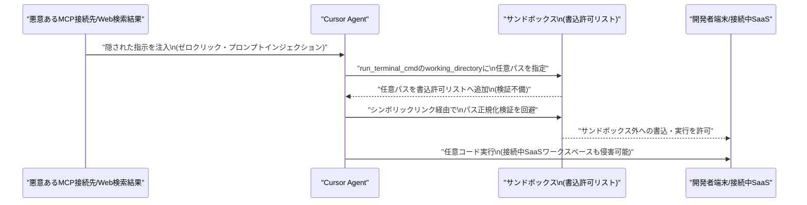

# LLM・AI Agent 最新情報レポート Vol.67

**作成日**: 2026年7月4日（JST）
**対象期間**: 2026年7月3日〜7月4日（Vol.66との差分）

---

## 目次

1. [Google Cloudアップデート](#1-google-cloudアップデート)
2. [Microsoft Azure AIアップデート](#2-microsoft-azure-aiアップデート)
3. [LLM Model / AI Agentアーキテクチャ・研究](#3-llm-model--ai-agentアーキテクチャ研究)
4. [公式ブログ・論文のリサーチ・要約](#4-公式ブログ論文のリサーチ要約)
   - [4.1 Google / Google DeepMind](#41-google--google-deepmind)
   - [4.2 OpenAI](#42-openai)
   - [4.3 Anthropic](#43-anthropic)
5. [AI Agent搭載SaaS製品情報](#5-ai-agent搭載saas製品情報)
6. [LLM/AI Agentセキュリティインシデント](#6-llmai-agentセキュリティインシデント)
7. [その他特筆すべき情報](#7-その他特筆すべき情報)
8. [参考リンク](#8-参考リンク)

---

## 1. Google Cloudアップデート

Vertex AI／Gemini Enterprise Agent Platform／Gemini APIについて、対象期間（7月3日〜4日）中の新規の大型プロダクト発表・仕様変更は確認されなかった。**新情報なし。**

---

## 2. Microsoft Azure AIアップデート

### 2.1 Foundry Agent Service・Copilot Studioのセキュリティ機能が「Microsoft Agent 365」ライセンス必須に移行（2026年7月1日発効）

2026年7月1日付で、Microsoft Copilot StudioおよびMicrosoft Foundryのエージェント向けセキュリティ機能（脅威検知、observabilityログ、エージェントレジストリ等）が、既存のDefender for Cloud Apps／Defender for Cloudライセンスの対象から外れ、新設の「Microsoft Agent 365」ライセンス（単体契約またはM365 E7スイート included）が必須となった。[[1]](#ref-1)

Agent 365ライセンスを持たないテナントは該当のセキュリティ機能へのアクセスを失う仕様であり、企業がエージェント運用のガバナンス投資を迫られる形となっている。

### 2.2 Microsoft 365 CopilotにAnthropic「Claude Sonnet 5」が展開開始

Microsoft公式Tech Communityブログにて、Claude Sonnet 5がCopilot Cowork・PowerPoint向けCopilotへのロールアウトを開始したと発表された。[[2]](#ref-2)

複数ステップにまたがる文書・表計算・プレゼン作成などのエージェント的タスク向けの新フロンティアモデルとして位置づけられ、Opus 4.8に近い性能をより低コストで提供するとされる。管理者は組織ポリシーに応じたアクセス制御が可能。

### 2.3 Copilot組織再編・有料化強化の内部方針が報道（一次情報ではなく内部メモのリーク報道）

The Information発の報道として、Microsoft Copilot担当EVPのJacob Andreou氏が社内約11,000名のCopilotチームに向けたメモで、コンシューマー向け／エンタープライズ向けCopilotを2026年8月までに単一アプリへ統合する方針、不採算機能の廃止、常時バックグラウンド動作の新エージェント機能「Autopilot」向け新有料ティア導入などを指示したと報じられた。[[3]](#ref-3)[[4]](#ref-4)

背景として、M365商用顧客4.5億のうちCopilot有料利用率は4.5%未満で、2025年7月の18.8%から2026年1月には11.5%まで低下（Geminiに逆転）というデータも報じられている。社内メモのリーク報道であり公式発表ではない点に留意が必要。

### 2.4 （参考）Microsoft「Frontier Company」設立発表

対象期間の直前（7月2日）だが関連性が高いため参考情報として記載する。Microsoftは顧客企業内にAIエンジニアを常駐させAIシステムの構築・運用を直接手掛ける新組織「Microsoft Frontier Company」を発表した。25億ドル・約6,000人規模を投じ、前Microsoft Asia社長のRodrigo Kede Lima氏が統括する。[[5]](#ref-5)[[6]](#ref-6)

OpenAIやAnthropicが5月に発表した「フォワード・デプロイド・エンジニアリング」施策に対抗する動きと位置づけられる。

---

## 3. LLM Model / AI Agentアーキテクチャ・研究

arXivの新着投稿（cs.AI/cs.CL等）を調査したが、対象期間（7月3日〜4日）に投稿された、既報の3論文（マルチエージェント討論の創発的振る舞い／MuSix／ツール利用エージェントの静的訓練の脆弱性、いずれもVol.66既報）とは別に、アーキテクチャ的な新規性が明確に確認できる論文は見当たらなかった。米国独立記念日（7月4日、振替休日7月3日）の影響でarXivの新着アナウンス自体が少なかった可能性もある。**新情報なし。**

---

## 4. 公式ブログ・論文のリサーチ・要約

### 4.1 Google / Google DeepMind

対象期間中、Google／Google DeepMindの公式ブログ・研究論文における新規の大型発表は確認されなかった。**新情報なし。**

### 4.2 OpenAI

#### 4.2.1 ソフトバンクグループ、OpenAIへ2回目の追加出資100億ドルを実行（2026年7月1日）

ソフトバンクグループが、2026年2月27日締結の総額300億ドル追加出資契約に基づく第2弾として、OpenAIへ100億ドル（約1兆6,273億円）の出資を実行したと報じられた。[[7]](#ref-7)

第1弾（100億ドル）は4月1日実行済み、残る第3弾（100億ドル）は10月1日予定。全弾完了時点でソフトバンクの累計出資額は646億ドル（10兆円超）、出資比率は約13%に達する見込み。

#### 4.2.2 サム・アルトマンCEO、「米国主導の国際AIフォーラム」設立を提唱

アルトマン氏はFinancial Times紙への寄稿で、IAEA（国際原子力機関）型の国際的なAI安全基準策定機関の設立を提唱した。[[8]](#ref-8)[[9]](#ref-9)

同寄稿では既報の「政府への株式5%供与（パブリック・ウェルスファンド）」構想にも言及しており、地政学的な立ち位置を模索する一連の動きの一部として位置づけられる。

### 4.3 Anthropic

#### 4.3.1 国防総省とAnthropicの「自律型兵器」制限を巡る対立が法廷文書で発覚（2026年7月2日〜4日）

カリフォルニア北部地区連邦地裁で、AnthropicとDoD（国防総省／Department of War）の契約交渉に関する内部メールが未封印（unsealed）となり、対象期間中に大きく報道された。[[10]](#ref-10)[[11]](#ref-11)[[12]](#ref-12)

| 項目 | 内容 |
|---|---|
| **発端** | 国防総省研究・エンジニアリング担当次官Emil Michael氏が、Anthropicの契約上のレッドライン（完全自律型兵器・国内大規模監視の禁止）撤回を要求 |
| **Anthropicの対応** | Dario Amodei CEOはガードレール堅持の姿勢を崩さず、Michael氏は「機能しない（just not workable）」と一蹴 |
| **その後** | 翌日、国防長官Pete HegsethがAnthropicを「サプライチェーンリスク」に指定 |
| **利益相反疑惑** | Michael氏は指定とほぼ同時期（1月9日）にxAI株を売却し400〜4800%のリターンを得ていたことが判明 |
| **裁判所の指摘** | 連邦判事Rita Linは、指定直後にMichael氏が「契約はvery close」と伝えていた事実と、政府側の「容認しがたいリスク」との説明の整合性に疑義を呈した |

> **評価:** AI安全性を巡るガードレールの是非が、防衛調達という具体的な契約実務の場で規制当局・調達担当者・ベンダー間の利害対立として表面化した事案であり、フロンティアAI企業と国家安全保障機関との緊張関係を象徴する事例といえる。

#### 4.3.2 Alibaba、Claude Codeの社内利用を禁止／AnthropicはChina経由の「抜け道」アクセス遮断へ

前号既報の「Claude Code中国ユーザー隠密検知コード撤回」の続報として、Alibabaが自社従業員によるClaude Code利用を2026年7月10日付で禁止する方針と報じられた。[[13]](#ref-13)

一方Anthropicは、Ant Group系列がシンガポール子会社名義でClaudeを利用する、ByteDance従業員が個人契約のVPN費用を経費精算する等、中国企業がリージョン制限を回避する「抜け道」の実態が判明したとして、これらを含めて締め出す方針を明らかにした。[[14]](#ref-14)

> **評価:** 蒸留・不正利用対策を巡るAnthropicと中国系企業との緊張は、追跡コードの撤回だけでは収束せず、双方向の利用制限（Alibaba側の禁止・Anthropic側の抜け道遮断）へと発展している。米中間のAI利用を巡る分断がサービス運用レベルで具体化しつつある動きとして注視したい。

---

## 5. AI Agent搭載SaaS製品情報

### 5.1 TikTok for Business「Agentic Hub」── 広告AIエージェント向けスキル基盤を開設

TikTok for Businessは、自社Business MCP上で動作するAIエージェント向けの「AI Skills」マーケットプレイス「Agentic Hub」を開設した。[[15]](#ref-15)

広告クリエイティブ生成、商品カタログ管理、キャンペーンシミュレーション、パフォーマンス分析等をAIエージェントが自動実行できる仕組みで、HubSpot、Wix、Constant Contactなど14社が連携パートナーとして参加している。

### 5.2 Aily Labs × AWS ── 経営意思決定AIエージェントを戦略提携

意思決定インテリジェンスSaaSのAily LabsがAWSと戦略的提携を発表した。[[16]](#ref-16)

財務・サプライチェーン・製造・研究開発・営業の5領域向けAIエージェントをAWS Marketplaceでサブスクリプション提供し、Amazon Bedrock経由で複数の基盤モデルをタスクごとに動的振り分けする。既存AWS顧客は最短1日で自社環境内に導入可能とされる。

### 5.3 Profound「Aim」── マーケティング向け常駐バックグラウンドエージェント

AI検索可視性分析を手掛けるProfoundが、ブランドの引用数・センチメント低下等をAIが検知し、原因分析から専門エージェントへのタスク割り当てまでを自動で行う常駐エージェント「Aim」を発表した。[[17]](#ref-17)[[18]](#ref-18)

Figma、Walmart、Ramp、MongoDBなどが既存顧客。Profoundは直近で9,600万ドルを調達済み。

### 5.4 Spellbook「Autonomous Contract Management」── 契約書ライフサイクル全体を自律処理

法務AIのSpellbookが、契約書の受領・レビュー・redline・署名後管理・更新通知までをエンドツーエンドで自律処理する「Autonomous Contract Management（ACM）」をアーリーアクセスで開始した。[[19]](#ref-19)

Outlook・Slack等から文書を自動取得し、既存の法務チーム基準に基づきレビュー・redlineを行う。4,500以上の法務チームが利用対象とされる。

### 5.5 ServiceNow、ライセンス体系を「AIネイティブ」の3階層へ全面移行

ServiceNowは従来の5階層パッケージSKUを7月1日付で販売終了し、AI成熟度に応じたFoundation（タスク支援）・Advanced（エージェント型ワークフロー）・Prime（自律型AIエージェント）の3階層ライセンスへ統一した。[[20]](#ref-20)

> **評価:** エンタープライズSaaS大手が製品ラインナップそのものを「AIエージェントの自律度」を軸に再編する動きであり、価格戦略・提供価値の重心がエージェント機能へ完全に移行しつつあることを示す一例である。

---

## 6. LLM/AI Agentセキュリティインシデント

### 6.1 「DuneSlide」── Cursor IDEのゼロクリック・プロンプトインジェクションからサンドボックス脱出

セキュリティ企業Cato Networks（Cato AI Labs）は、AIコードエディタ「Cursor」の重大脆弱性2件（CVE-2026-50548、CVE-2026-50549、CVSS3.1で9.8）を公表した。[[21]](#ref-21)[[22]](#ref-22)[[23]](#ref-23)

Cursor 3.0（2026年4月2日リリース）で修正済みだが、それ以前の2.x系は全て影響を受ける。現時点で実際の悪用実績は確認されていない（研究発表段階）。

### 6.2 「GuardFall」── オープンソースAIコーディングエージェント11種中10種でシェルインジェクション回避が成立

Adversa AIは、セーフガードが「生のコマンド文字列」を検査する一方、実行時にBashが引用符処理・変数展開・コマンド置換・IFS展開等で文字列を書き換えてしまう「検査と実行のズレ」を突く手法「GuardFall」を報告した。[[24]](#ref-24)[[25]](#ref-25)[[26]](#ref-26)

Hermes、opencode、Goose、Cline、Roo-Code、Aider、Plandex、Open Interpreter、OpenHands、SWE-agentの10製品でバイパスが成立し、「Continue」のみ大半の回避を緩和できていた。悪意あるリポジトリ・パッケージに仕込んだ指示により、SSH鍵・クラウド認証情報の窃取やファイル破壊につながりうる。

### 6.3 ワシントン大学の研究 ── エージェント型AIブラウザがSame-Origin Policyを弱体化

ワシントン大学（UW）の研究チームは、ChatGPT Atlas、Chrome+Gemini、Claude for Chrome、Perplexity Cometなど主要7種のエージェント型ブラウザのうち4種で、異なるオリジン間のデータ分離（Same-Origin Policy）を破る条件が存在することを実証した。[[27]](#ref-27)[[28]](#ref-28)

攻撃ベクトルは(1)悪意あるWebページに埋め込んだ隠し指示によるプロンプトインジェクション、(2)エージェントの記憶がオリジンをまたいで汚染される「メモリポイズニング」の2種。ChatGPT Atlasでは、あるサイトに埋め込まれた別サイトの機密情報を抽出するPoCに成功した。権限が少ないブラウザ（Firefox AIモード）ほど安全という結果が示されている。

### 6.4 Anthropic、Claude Fable 5をジャイルブレイク対策の新分類器とともに再展開

Anthropicは、Amazon所属研究者が発見したジェイルブレイク手法（脆弱性の指摘や実証コード生成に応じてしまう問題）を受け、同手法を99%以上の確率でブロックする新分類器を実装し、CAISIによる独立検証を経て2026年7月1日にClaude Fable 5をグローバル再展開したと発表した。[[29]](#ref-29)[[30]](#ref-30)

同種のプロンプト誘導手法はHaiku 4.5、Sonnet 4.6、Opus 4.6/4.7/4.8、GPT-5.4/5.5、Kimi K2.7でも有効だったことが判明しており、Amazon・Microsoft・Google等と業界横断のジェイルブレイク評価基準を共同策定中という。

> **評価:** 6.1〜6.3で確認されたコーディングエージェント・エージェント型ブラウザの脆弱性は、いずれも「エージェントが自律的に外部入力を解釈・実行する」という構造そのものに起因する共通パターンであり、防御側（6.4のような分類器強化）の対応速度が追いついていない現状がうかがえる。

---

## 7. その他特筆すべき情報

### 7.1 国連「AI for Good Global Commission」発足

国連とITUが共同で、AIガバナンスに関する新委員会「AI for Good Global Commission」を発足させた。初会合は7月8日にジュネーブで開催予定。[[31]](#ref-31)[[32]](#ref-32)

共同議長はSalesforce CEOのマーク・ベニオフ氏とルワンダのポール・カガメ大統領。委員にNVIDIAのジェンスン・フアン氏、Amazonのアンディ・ジャシー氏、Microsoftのブラッド・スミス氏、Anthropic共同創業者のジャック・クラーク氏らが名を連ね、史上最大級のAIガバナンス関連CEO・首脳級会合と評されている。

### 7.2 2026年上半期の世界VC投資が過去最高の5,100億ドルに ── OpenAI・Anthropicが4割超を占有

Crunchbaseの発表によると、2026年上半期の世界VC投資額は半期ベースで過去最高の5,100億ドルに達した。うちOpenAIとAnthropicの2社だけで2,170億ドル（全体の43%）を占め、資金の一極集中が鮮明になっている。[[33]](#ref-33)

関連する動きとして、AnthropicへのステークをきっかけにMenlo Venturesが50年の歴史で最大となる30億ドルの新ファンドを組成したほか、プライバシー重視AIの「Venice AI」が評価額10億ドルで6,500万ドルを調達するなど、AI関連の資金流入は継続している。[[34]](#ref-34)

### 7.3 米民間調査、6月の人員削減は減少もAIは4カ月連続で最大の削減理由

Challenger, Gray & Christmasの発表によると、2026年6月の米企業人員削減発表は45,849人（前月比53%減）と2025年12月以来の低水準となった一方、AIは4カ月連続で削減理由のトップを維持し、年初来のAI関連削減は101,743人（全削減の約23%）に達した。[[35]](#ref-35)[[36]](#ref-36)

上半期累計の削減数は443,604人で、前年同期（744,308人）から大幅に減少している。

### 7.4 Meta最高AI責任者、開発中モデル「Watermelon」がGPT-5.5に「追いついた」と社内発言

Meta最高AI責任者のアレクサンドル・ワン氏が全社ミーティングで、開発中のモデル「Watermelon」が主要ベンチマークでOpenAIのGPT-5.5に匹敵する性能に達したと発言したと報じられた。[[37]](#ref-37)[[38]](#ref-38)

前モデル「Avocado（Muse Spark）」比で「1桁多い」計算資源を投入しているとも説明したとされるが、具体的なベンチマーク名は非公表で、Meta・OpenAI双方とも公式には確認していない。

---

## 8. 参考リンク

**[1]** [Transition Agent Security to Agent 365 | Microsoft Learn](https://learn.microsoft.com/en-us/defender-xdr/security-for-ai/transition-agent-security-to-agent-365)

**[2]** [Available today: Anthropic's Claude Sonnet 5 in Microsoft 365 Copilot | Microsoft Tech Community](https://techcommunity.microsoft.com/blog/microsoft365copilotblog/available-today-anthropic%E2%80%99s-claude-sonnet-5-in-microsoft-365-copilot/4532188)

**[3]** [Microsoft Copilot Merges Into One App In August, Feature Cuts Reveal Paid Adoption Crisis | Tech Times](https://www.techtimes.com/articles/319706/20260704/microsoft-copilot-merges-one-app-august-feature-cuts-reveal-paid-adoption-crisis.htm)

**[4]** [Microsoft Plans Copilot App Merge To Prove Its Value | WinBuzzer](https://winbuzzer.com/2026/07/04/microsoft-plans-copilot-app-merge-to-prove-its-value-xcxwbn/)

**[5]** [Microsoft Frontier Company: AI engineering that amplifies and protects your intelligence | Microsoft](https://blogs.microsoft.com/blog/2026/07/02/microsoft-frontier-company-ai-engineering-that-amplifies-and-protects-your-intelligence/)

**[6]** [Microsoft announces $2.5B 'Frontier Company' to embed AI engineers inside customers | GeekWire](https://www.geekwire.com/2026/microsoft-announces-2-5b-frontier-company-to-embed-ai-engineers-inside-customers/)

**[7]** [ソフトバンクG、OpenAIへ2回目の追加出資1兆6273億円を実行 | ITmedia](https://www.itmedia.co.jp/news/articles/2607/01/news139.html)

**[8]** [Sam Altman calls for US-led international forum to set global AI standards | SiliconANGLE](https://siliconangle.com/2026/07/02/sam-altman-calls-us-led-international-forum-set-global-ai-standards/)

**[9]** [Sam Altman's new world order for AI | Fortune](https://fortune.com/2026/07/02/sam-altman-new-world-order-ai-openai-google-anthropic/)

**[10]** [Pentagon Blacklisted Anthropic Over Autonomous Weapons Limits, Emails Reveal 'Very Close' Talks | Tech Times](https://www.techtimes.com/articles/319713/20260704/pentagon-blacklisted-anthropic-over-autonomous-weapons-limits-emails-reveal-very-close-talks.htm)

**[11]** [Read the Tense Emails Between the Pentagon, a Former Uber Exec, and Anthropic's Dario Amodei | Gizmodo](https://gizmodo.com/read-the-tense-emails-between-the-pentagon-former-uber-exec-and-anthropic-dario-amodei-2000780849)

**[12]** [Statement from Dario Amodei on our discussions with the Department of War | Anthropic](https://www.anthropic.com/news/statement-department-of-war)

**[13]** [Alibaba to ban Claude Code in workplace over alleged backdoor risks, source says | U.S. News](https://www.usnews.com/news/top-news/articles/2026-07-03/alibaba-to-ban-claude-code-in-workplace-over-alleged-backdoor-risks-source-says)

**[14]** [Anthropic targets loopholes used by Chinese firms to access Claude, FT reports | Investing.com](https://www.investing.com/news/stock-market-news/anthropic-targets-loopholes-used-by-chinese-firms-to-access-claude-ft-reports-4774998)

**[15]** [TikTok Agentic Hub: AI Agents & Skills on MCP | TikTok for Business](https://ads.tiktok.com/business/en/blog/tiktok-agentic-hub-ai-agents-skills-mcp)

**[16]** [Aily Labs and AWS Announce Strategic Partnership to Accelerate AI Decision Intelligence Across the Fortune 500 | PR Newswire](https://www.prnewswire.com/news-releases/aily-labs-and-aws-announce-strategic-partnership-to-accelerate-ai-decision-intelligence-across-the-fortune-500-302817247.html)

**[17]** [Meet Aim: The First Background Agent for Marketing | Profound](https://www.tryprofound.com/resources/webinars/meet-aim-the-first-background-agent-for-marketing)

**[18]** [Profound launches Aim to transform AI-era marketing | Yahoo Finance](https://finance.yahoo.com/media-advertising/articles/profound-launches-aim-transform-ai-130000823.html)

**[19]** [Spellbook Announces Autonomous Contract Management System | Legaltech News](https://www.law.com/legaltechnews/2026/06/30/spellbook-announces-autonomous-contract-management-system/)

**[20]** [ServiceNow AI-Native Licensing in 2026: A Practical Guide | ServiceNow Community](https://www.servicenow.com/community/upgrades-and-patching-forum/servicenow-ai-native-licensing-in-2026-a-practical-guide-to/td-p/3565858)

**[21]** [DuneSlide: Two Critical RCE Vulnerabilities in Cursor | Cato Networks](https://www.catonetworks.com/blog/duneslide-two-critical-rce-vulnerabilities/)

**[22]** [Critical Cursor Flaws Could Let Prompt Injection Lead to Remote Code Execution | The Hacker News](https://thehackernews.com/2026/07/critical-cursor-flaws-could-let-prompt.html)

**[23]** [Critical Cursor AI IDE Flaws Could Lead to OS-Level Remote Code Execution | SecurityWeek](https://www.securityweek.com/critical-cursor-ai-ide-flaws-could-lead-to-os-level-remote-code-execution/)

**[24]** [GuardFall Exposes Open-Source AI Coding Agents to Shell Injection | The Hacker News](https://thehackernews.com/2026/06/guardfall-exposes-open-source-ai-coding.html)

**[25]** [Open-Source AI Coding Agents Shell Injection Vulnerability | Adversa AI](https://adversa.ai/blog/opensource-ai-coding-agents-shell-injection-vulnerability/)

**[26]** [GuardFall flaw hits 10 of 11 popular open-source AI agents | Security Affairs](https://securityaffairs.com/194546/ai/guardfall-flaw-hits-10-of-11-popular-open-source-ai-agents.html)

**[27]** [Some agentic AI browsers come with major cybersecurity risks, UW study finds | University of Washington](https://www.washington.edu/news/2026/06/30/some-agentic-ai-browsers-come-with-major-cybersecurity-risks-uw-study-finds/)

**[28]** [Some agentic AI browsers come with major cybersecurity risks | Tech Xplore](https://techxplore.com/news/2026-06-agentic-ai-browsers-major-cybersecurity.html)

**[29]** [Redeploying Claude Fable 5 | Anthropic](https://www.anthropic.com/news/redeploying-fable-5)

**[30]** [Anthropic Restores Claude Fable 5 After US Export Controls Lift, Adds New Cybersecurity Classifier | The Hacker News](https://thehackernews.com/2026/07/anthropic-restores-claude-fable-5-after.html)

**[31]** [UN forms AI governance commission with CEOs, world leaders | Axios](https://www.axios.com/2026/07/01/un-ai-commission-ceos-world-leaders)

**[32]** [UN AI Governance Commission: Jensen Huang, Jassy, Benioff head to Geneva | Eastern Herald](https://easternherald.com/2026/07/02/un-ai-governance-commission-jensen-huang-jassy-benioff-geneva/)

**[33]** [Global Startup Exits, IPOs, And M&A Soar Amid AI Boom In Q2, H1 2026 | Crunchbase News](https://news.crunchbase.com/venture/global-startup-exits-ipo-ma-soar-ai-q2-h1-2026/)

**[34]** [AI Update, July 3, 2026: AI News And Views From The Past Week | MarketingProfs](https://www.marketingprofs.com/opinions/2026/55197/ai-update-july-3-2026-ai-news-and-views-from-the-past-week)

**[35]** [Tech layoffs surge 83% in H1 2026 as Challenger flags AI disruption | CFO Dive](https://www.cfodive.com/news/tech-layoffs-surge-83percent-h1-2026-challenger-ai-disruption/824260/)

**[36]** [Layoffs march lower in June, though AI remains major reason behind job cuts: Challenger | Yahoo Finance](https://finance.yahoo.com/economy/article/layoffs-march-lower-in-june-though-ai-remains-major-reason-behind-job-cuts-challenger-113933253.html)

**[37]** [Meta's Upcoming 'Watermelon' AI Model Matches OpenAI's GPT-5.5 On Key Benchmarks, Alexandr Wang Reportedly Tells Employees | Benzinga](https://www.benzinga.com/markets/tech/26/07/60264651/metas-upcoming-watermelon-ai-model-matches-openais-gpt-5-5-on-key-benchmarks-alexandr-wang-reportedly-tells-employees)

**[38]** [Meta AI chief says 'Watermelon' model has caught up to GPT-5.5 | American Bazaar](https://americanbazaaronline.com/2026/07/03/meta-ai-chief-says-watermelon-model-has-caught-up-to-gpt-5-5-484022/)
