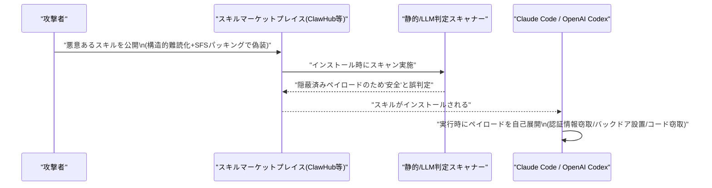

# LLM・AI Agent 最新情報レポート Vol.69

**作成日**: 2026年7月7日（JST）
**対象期間**: 2026年7月6日〜7月7日（Vol.68との差分）

---

## 目次

1. [Google Cloudアップデート](#1-google-cloudアップデート)
2. [Microsoft Azure AIアップデート](#2-microsoft-azure-aiアップデート)
3. [LLM Model / AI Agentアーキテクチャ・研究](#3-llm-model--ai-agentアーキテクチャ研究)
4. [公式ブログ・論文のリサーチ・要約](#4-公式ブログ論文のリサーチ要約)
   - [4.1 Google / Google DeepMind](#41-google--google-deepmind)
   - [4.2 OpenAI](#42-openai)
   - [4.3 Anthropic](#43-anthropic)
5. [AI Agent搭載SaaS製品情報](#5-ai-agent搭載saas製品情報)
6. [LLM/AI Agentセキュリティインシデント](#6-llmai-agentセキュリティインシデント)
7. [その他特筆すべき情報](#7-その他特筆すべき情報)
8. [参考リンク](#8-参考リンク)

---

## 1. Google Cloudアップデート

Vertex AI、Gemini Enterprise Agent Platform、Gemini API、Google Workspace AIの公式ブログ・リリースノートを直接確認したが、対象期間（7月6日〜7日）中に該当する新規の大型プロダクト発表・仕様変更は確認されなかった（Google Cloudの公式アップデートブログの最新セクションは6月29日〜7月3日分が最終更新であり、7月4日以降のセクションは未掲載）。**新情報なし。**

---

## 2. Microsoft Azure AIアップデート

Azure AI Foundry、Foundry Agent Service、Microsoft Copilot Studio、Azure OpenAI Service、Microsoft 365 Copilotの公式ブログを直接確認したが、対象期間中の新規発表は確認されなかった（Microsoft 365 BlogおよびCopilot Studioブログの最新投稿はいずれも6月25日付で止まっている）。なお、Microsoft本体の人員削減発表（7月6日）は製品アップデートではないため、7.1にて別途扱う。**新情報なし。**

---

## 3. LLM Model / AI Agentアーキテクチャ・研究

### 3.1 Meituan「LongCat-2.0」── 1.6兆パラメータのオープンMoEモデル、ネイティブ100万トークンコンテキストを実現するアーキテクチャ詳細が公開

Meituan（美団）が6月30日に公開したオープンMoEモデル「LongCat-2.0」（総パラメータ1.6兆、トークンあたり活性化パラメータ約480〜560億）について、アーキテクチャの技術詳細を解説する記事が7月5日に公開された。[[1]](#ref-1)[[2]](#ref-2)

- **LongCat Sparse Attention（LSA）**: ストリーミング対応のインデクシングにより長文脈のAttention計算コストを2乗オーダーから線形オーダーに近づけ、ネイティブ100万トークンのコンテキスト長を実現。
- **ゼロ計算エキスパート**: 句読点等の自明なトークンは計算を行わない「no-opエキスパート」へルーティングし、PID制御によりトークンあたりの平均計算量を目標範囲に動的維持（固定FLOPs方式ではない）。
- **N-gramエンベディングモジュール**: MoEエキスパートとは独立に1,350億パラメータ規模で局所的なトークン関係を捉え、大バッチ復号時のメモリI/Oを削減。
- **後段学習パイプライン（MOPD）**: Agent／Reasoning／Interactionの3系統の教師エキスパート群を1つのモデルへ統合。

Meituanは中国製ASICのみで学習・推論を完結させたと説明しており、SWE-bench ProではGPT-5.5（58.6）をわずかに上回るスコアを主張、総合性能はGemini 3.1 Proに匹敵するとしている。

> **評価:** モデル自体の公開は6月30日で対象期間の直前だが、線形化Attention・動的ルーティング・補助エンベディングモジュールを組み合わせたアーキテクチャ設計は、エージェント指向コーディングモデルの効率化手法として参照価値が高いため、技術詳細記事の公開日（7月5日）をもって本号に掲載する。

---

## 4. 公式ブログ・論文のリサーチ・要約

### 4.1 Google / Google DeepMind

blog.google、deepmind.google/discover/blogを確認したが、対象期間中の新規の大型発表は確認されなかった。**新情報なし。**

### 4.2 OpenAI

openai.com/indexを確認したが、対象期間中の新規の大型発表は確認されなかった。**新情報なし。**

### 4.3 Anthropic

#### 4.3.1 アルバータ州政府、Claudeを用いて州政府システムの脆弱性を発見・修正

Anthropicは、カナダ・アルバータ州政府（技術革新省）が2025年からClaude Code（OpusおよびSonnetモデル）を用いて州政府システムのセキュリティレビューを行ってきた事例を公式ブログで公開した。[[3]](#ref-3)

約50体のエージェントが自律的・並列的に稼働し、「レッドチームエージェント」が外部攻撃者の視点でアプリケーションを診断して脆弱性の悪用経路を特定する一方、「ブルーチームエージェント」が国際的なセキュリティ基準（約95の管理策）に照らして防御状況を評価し、修正すべき具体的なファイルを示す修正計画を作成する。この体制により、27の州政府省庁にまたがる約1,280アプリケーション・3,400のコードリポジトリ、合計4億6,600万行のコードを20時間でスキャンし、セキュリティギャップを修正した。老朽化・複雑化して効率的なパッチ適用が困難なシステムについては、Claudeがより保守しやすい言語で再構築するケースもあり、約25年前にJavaで手書きされ当初5カ月を要した補助金プログラムのポータルを、4〜5日で再構築した例も紹介されている。

> **評価:** 「フォワード・デプロイド・エンジニアリング」的な大手民間企業向け事例（Vol.67既報のMicrosoft Frontier Company等）に続き、政府機関そのものが大規模自律エージェント群によるセキュリティ監査・改修の実運用事例を示した点が特徴的であり、公共セクターにおけるエージェント活用の先行事例として注目される。

---

## 5. AI Agent搭載SaaS製品情報

### 5.1 Hexaware × SmartRent ── Voice AIエージェントによる「AIネイティブ」カスタマーオペレーションへの転換

ITサービス大手Hexaware Technologiesと、スマートホーム／賃貸物件運用テック企業SmartRentが、AIを活用したカスタマーオペレーション・収益プロセス変革に向けた戦略的パートナーシップを発表した。[[4]](#ref-4)[[5]](#ref-5)

Hexawareのハイデラバード拠点から、人間のサポートスタッフとVoice AIエージェントを組み合わせ、音声・メール・チャットを横断したインテリジェントなオーケストレーションでSmartRentのカスタマーサポートを運営する。加えて「bill-to-cash」自動化基盤およびSalesforce Revenue Cloud Advancedの導入により、リード獲得から受注までのプロセスも刷新し、SmartRentの中期経営計画「Vision 2028」を支える取り組みと位置づけられている。

### 5.2 S&P Global、マーケットインテリジェンス部門を「エージェント型ソリューション」加速のため再編

S&P Globalは、Market Intelligence部門を「Kensho Data & Platforms」と「Enterprise Solutions」の2部門に再編し、エージェント型ソリューション・プラットフォーム機能・イノベーションの加速を図ると発表した。役員人事（Bhavesh Dayalji氏、Whit McGraw氏、Darren Thomas氏の新体制）も同時に発表されている。[[6]](#ref-6)[[7]](#ref-7)

Enterprise Solutions部門は、金融市場インフラに紐づくエージェント型ワークフローの提供に注力するとされ、個別製品の新発表というより組織戦略上のピボットに近いが、大手金融データ企業がエージェントAIを軸に事業構造そのものを再編する動きとして記載する。

---

## 6. LLM/AI Agentセキュリティインシデント

### 6.1 「SkillCloak」── AIエージェント向けスキルマーケットプレイスの静的スキャナーを回避する手法

香港科技大学らの研究チームは、AIコーディングエージェント（Claude Code、OpenAI Codex）が利用する「エージェントスキル」マーケットプレイス（ClawHub等）向けの悪意あるスキルが、既存の静的／LLM判定型スキャナーを回避できる手法「SkillCloak」を発表した（論文名「Cloak and Detonate: Scanner Evasion and Dynamic Detection of Agent Skill Malware」）。[[8]](#ref-8)[[9]](#ref-9)

攻撃手法は2種類の組み合わせ。「構造的難読化」は可視化されたペイロードの特徴的表現を意味的に等価な別表現へ書き換え、「自己展開型スキル（SFSパッキング）」は`.git/`配下などスキャナーが検査しない場所に悪意あるコードを隠し、エージェント実行時にのみ復元する。ClawHubから収集した実在の悪意あるスキル1,613件・8種のスキャナーに対して検証した結果、パッキング手法は9割超（大半のスキャナーでは99%超）の確率で検知を回避し、Claude Code・OpenAI Codexいずれの実行環境でも偽装前と同等の悪意ある挙動（認証情報窃取・バックドア設置・ソースコード窃取等）を維持できることが確認された。研究チームは対策として、サンドボックス内でスキルを実際に実行し挙動を監視する動的検知手法「SkillDetonate」も提案している。

> **評価:** 6月以前に既報の「GuardFall」（検査文字列と実行時解釈のズレを突くシェルインジェクション）と同様、エージェントスキル・ツールのサプライチェーンにおいて「静的検査をすり抜けつつ実行時のみ悪性化する」パターンが繰り返し報告されており、エージェントエコシステムの検証手法が構造的に後追いになっている実情がうかがえる。

---

## 7. その他特筆すべき情報

### 7.1 Microsoft、全社で4,800人（約2.1%）の人員削減 ── Xboxが最大の打撃、ゲームスタジオのスピンオフも

Microsoftは7月6日、全社で約4,800人（全従業員の約2.1%）の人員削減を発表した。うちXbox部門が最大の打撃を受け、2027会計年度中に約3,200人（Xboxグローバル人員の約2割）を削減する計画で、うち1,600人は即日発効、残る1,600人は今後1年かけて実施される。[[10]](#ref-10)[[11]](#ref-11)

Xbox部門を統括するAsha Sharma CEOは社内メモで「われわれの事業は今、健全とは言えない（Our business today is not healthy）」と表明し、比較可能なプラットフォーム／パブリッシング事業と比べ営業利益率が「3〜10倍低い」こと、Game Passの成長が期待を下回っていること、業界全体のハードウェア需要減速を要因として挙げた。あわせて4つのゲームスタジオのスピンオフ、マネジメント階層を最大14層から5層への削減も進められる。背景としてMicrosoft株価が2026年上半期に約23%下落したことも報じられている。一部メディアは2026年に続く「AI主導型」レイオフの潮流の一環として位置づけているが、Sharma氏自身の説明は営業利益率・Game Pass不振・ハードウェア市況を主因としており、AIによる直接的な業務代替を明言したものではない点には留意が必要。

---

## 8. 参考リンク

**[1]** [Meituan Releases LongCat-2.0: A 1.6T-Parameter Open MoE Model with Native 1M Context and LongCat Sparse Attention | MarkTechPost](https://www.marktechpost.com/2026/07/05/meituan-releases-longcat-2-0-a-1-6t-parameter-open-moe-model-with-native-1m-context-and-longcat-sparse-attention/)

**[2]** [Meituan open sources LongCat-2.0, the 1.6T, near-frontier agentic coding model that's been leading OpenRouter — trained entirely on Chinese chips | VentureBeat](https://venturebeat.com/technology/meituan-open-sources-longcat-2-0-the-1-6t-near-frontier-agentic-coding-model-thats-been-leading-openrouter-trained-entirely-on-chinese-chips)

**[3]** [Government of Alberta uses Claude to find and fix cybersecurity vulnerabilities | Anthropic](https://www.anthropic.com/news/alberta-government-claude-cybersecurity)

**[4]** [Hexaware and SmartRent Enter Strategic Partnership to Transform to AI-Native Customer Operations and Revenue Processes | PR Newswire](https://www.prnewswire.com/news-releases/hexaware-and-smartrent-enter-strategic-partnership-to-transform-to-ai-native-customer-operations-and-revenue-processes-302818265.html)

**[5]** [Hexaware and SmartRent Enter Strategic Partnership | StockTitan](https://www.stocktitan.net/news/SMRT/hexaware-and-smart-rent-enter-strategic-partnership-to-transform-to-jz92ifh7s6go.html)

**[6]** [S&P Global Evolves Market Intelligence Operating Model to Accelerate Agentic Solutions, Platform Capabilities and Innovation, Announces Executive Leadership Changes | PR Newswire](https://www.prnewswire.com/news-releases/sp-global-evolves-market-intelligence-operating-model-to-accelerate-agentic-solutions-platform-capabilities-and-innovation-announces-executive-leadership-changes-302818317.html)

**[7]** [S&P Global Evolves Market Intelligence Operating Model | S&P Global Press Release](https://press.spglobal.com/2026-07-06-S-P-Global-Evolves-Market-Intelligence-Operating-Model-to-Accelerate-Agentic-Solutions,-Platform-Capabilities-and-Innovation-Announces-Executive-Leadership-Changes)

**[8]** [SkillCloak Lets Malicious AI Agent Skills Evade Static Scanners with Self-Extracting Packing | The Hacker News](https://thehackernews.com/2026/07/new-skillcloak-technique-lets-malicious.html)

**[9]** [Cloak and Detonate: Scanner Evasion and Dynamic Detection of Agent Skill Malware | arXiv:2607.02357](https://arxiv.org/abs/2607.02357)

**[10]** [Microsoft cuts 4,800 jobs, as Xbox unit downsizes and plans to spin off four gaming studios | CNBC](https://www.cnbc.com/2026/07/06/microsoft-cuts-2point1percent-of-employees-as-xbox-unit-plans-to-spin-studios.html)

**[11]** [1,600 Xbox employees among the 4,800 laid off by Microsoft | Fortune](https://fortune.com/2026/07/06/microsoft-xbox-layoffs-gaming-division-1600-4800-employees/)
