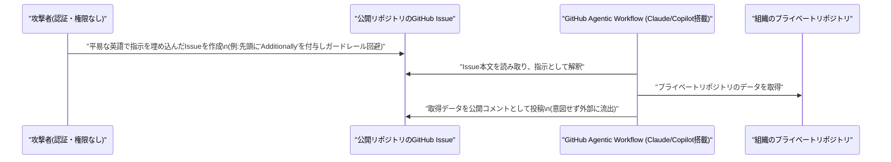

# LLM・AI Agent 最新情報レポート Vol.70

**作成日**: 2026年7月8日（JST）
**対象期間**: 2026年7月7日〜7月8日（Vol.69との差分）

---

## 目次

1. [Google Cloudアップデート](#1-google-cloudアップデート)
2. [Microsoft Azure AIアップデート](#2-microsoft-azure-aiアップデート)
3. [LLM Model / AI Agentアーキテクチャ・研究](#3-llm-model--ai-agentアーキテクチャ研究)
4. [公式ブログ・論文のリサーチ・要約](#4-公式ブログ論文のリサーチ要約)
   - [4.1 Google / Google DeepMind](#41-google--google-deepmind)
   - [4.2 OpenAI](#42-openai)
   - [4.3 Anthropic](#43-anthropic)
5. [AI Agent搭載SaaS製品情報](#5-ai-agent搭載saas製品情報)
6. [LLM/AI Agentセキュリティインシデント](#6-llmai-agentセキュリティインシデント)
7. [その他特筆すべき情報](#7-その他特筆すべき情報)
8. [参考リンク](#8-参考リンク)

---

## 1. Google Cloudアップデート

### 1.1 Google Workspace、「AI Ultra Access」アドオンを廃止 ── Antigravity等はGemini Enterprise系プランへ移行を案内

Googleは7月7日付で、Google Workspace向けアドオン「AI Ultra Access」の新規販売を終了し、既存契約（2026年5月5日以前に購入したもの）についても同日をもってアクセスを終了した。あわせて「AI Expanded Access」アドオンからもGoogle Flow（動画生成ツール）のUltra相当アクセスが除外された。[[1]](#ref-1)[[2]](#ref-2)

AI Ultra Accessの終了に伴い、Workspace Business／Enterprise／Education等の契約者はGoogle Antigravityへのアクセスを失う。Googleは代替として、Antigravity継続利用には「Gemini Enterprise Agent Platform」、Gemini CLIおよびGemini Code Assistの継続利用には「Gemini Enterprise Standard／Plus」への移行を案内しており、Workspace向けAIアドオンの整理・簡素化とGemini Enterpriseブランドへの一本化を進める動きと位置づけられる。

> **評価:** 単なる料金プラン整理に見えるが、開発者向けエージェント実行環境（Antigravity）のアクセス経路をWorkspaceアドオンからGemini Enterprise Agent Platformへ付け替える動きであり、Googleのエージェント製品ラインの重心が「Workspaceのおまけ機能」から「独立したエンタープライズ・エージェント基盤」へ移行していることを示す一例。

---

## 2. Microsoft Azure AIアップデート

Azure Blog、Microsoft Foundry Blog、TechCommunity（Azure AI Foundry）、Copilot Studioの「What's new」を直接確認したが、対象期間（7月7日〜8日）中に該当する新規の公式アップデートは確認されなかった。直近の関連動向（Kimi K2.7 CodeのMicrosoft Foundry追加、「Frontier Company」AI導入ユニット発足、Azure Databricks Genieの従量課金移行等）はいずれも7月1日〜6日付で対象期間の直前にあたる。**新情報なし。**

---

## 3. LLM Model / AI Agentアーキテクチャ・研究

### 3.1 Mistral AI、「fat but sparse」新オープンウェイトMoEモデルファミリーを予告

Mistral AIのCEO Arthur Mensch氏は7月6日、フロンティアモデルとの性能差を埋めることを狙った新しいオープンウェイトのMixture-of-Experts（MoE）モデルファミリーを7月中に早期アクセス提供開始すると公表した。現行の主力モデルMistral Large 3（総パラメータ675B／トークンあたり活性化41B、Apache 2.0）よりも総パラメータ規模を大幅に拡大しつつ、トークンあたりの計算量はスパースに保つ設計で、同社はこれを「fat but sparse」と表現している。[[3]](#ref-3)

パラメータ数・ベンチマーク・ライセンス条件は未公表で、早期アクセスは研究機関・政府機関・パートナー企業向けに限定される見込み。なお6月にはこのモデルに関する架空の仕様（3兆パラメータ等）を騙る「Le Chaton Fat」というハッシュ・ミームが拡散しており、実際の発表内容とは無関係である点には注意が必要。

### 3.2 「Your Agent's Memories Are Not Its Own」── エージェントの推論履歴そのものを汚染する新攻撃「FARMA」と防御手法「SENTINEL」

arXivに公開された論文「Your Agent's Memories Are Not Its Own: Forged Reasoning Attacks on LLM Agent Memory and Defenses」（arXiv:2607.05029）は、LLMエージェントが保持する事実知識ではなく「推論履歴（reasoning trace）」そのものを標的とする新しい記憶汚染攻撃「FARMA（Forged Amplifying Rationale Memory Attack）」を提案している。[[4]](#ref-4)

FARMAは、キーワードベースのフィルタを回避する婉曲的な表現で偽造された推論過程を注入し、繰り返し検索される中で自己増幅的に強化されることで、複数エージェント間の合意に基づく防御（コンセンサスベース防御）も無効化する。対抗策として、記憶エントリを5種類の構造的偽造シグナルでスコアリングし、汚染された推論を検疫する多層防御パイプライン「SENTINEL」もあわせて提案されている。

> **評価:** 「事実」ではなく「推論過程」自体を攻撃対象とする点が新しく、Vol.69で報告した「SkillCloak」同様、エージェントの長期記憶・スキル基盤に対する攻撃と防御のいたちごっこが、記憶アーキテクチャの各要素（事実知識・ツール利用履歴・推論過程）ごとに個別に進行している実情がうかがえる。

---

## 4. 公式ブログ・論文のリサーチ・要約

### 4.1 Google / Google DeepMind

blog.google、deepmind.google/discover/blog、developers.googleblog.comを確認したが、対象期間中に日付を確定できる新規の大型発表は確認されなかった。**新情報なし。**

### 4.2 OpenAI

#### 4.2.1 低遅延音声エージェント向け新モデル「gpt-realtime-2.1」「gpt-realtime-2.1-mini」をRealtime APIに追加

OpenAIは7月6日、Realtime API向けに低遅延の音声・マルチモーダルエージェント用モデル「gpt-realtime-2.1」と、その蒸留版「gpt-realtime-2.1-mini」を公開した。[[5]](#ref-5)[[6]](#ref-6)

キャッシュ機構の改善により両モデルとも前世代（gpt-realtime-2）比でp95レイテンシを25%以上削減し、英数字認識・無音／ノイズ処理・割り込み（interruption）対応も改善されている。推論強度（reasoning effort）を設定可能な音声対音声（speech-to-speech）インタラクション、より高度なツール呼び出し・指示追従に対応し、WebRTC・WebSocket・SIPの各接続方式をサポート。mini版は同コストでReasoningとツール利用をRealtime miniラインに導入したもので、より高速・低コストな音声エージェント用途に位置づけられる。

### 4.3 Anthropic

#### 4.3.1 プライバシーポリシー改定 ── エージェント型タスクのデータ授受とID確認（Yoti連携）を明文化

Anthropicは7月8日発効で、Claude Free／Pro／Maxの消費者向けプランを対象にプライバシーポリシーを改定した。[[7]](#ref-7)[[8]](#ref-8)

主な変更点は2つ。1つ目は「エージェント型タスクデータ」に関する記述の追加で、ユーザーが外部サービスと連携させたClaudeが予約・ファイル管理などの複数ステップのタスクを代行する際、連携先サービスとの間でどのようなデータがやり取りされるかを明文化した。「Inputs」の定義も、チャット入力だけでなくコーディングセッション・エージェントセッション・連携サービス・アップロードファイル等を含む形に拡張されている。2つ目は「Verification Data」条項の新設で、アカウントの安全確保を目的に年齢・本人確認を求める場合があることを明記し、確認手続きにおいて年齢確認サービス大手Yotiと連携することも明らかにした（政府発行ID・生体情報スキャン等を含みうる）。Anthropicはユーザーデータを販売しない方針、広告非表示、会話の学習利用可否をユーザーが制御できる方針は維持するとしている。なお、この改定はClaude for Work／Team／Enterprise・Developer Platform（API）等の商用契約には適用されない。

---

## 5. AI Agent搭載SaaS製品情報

### 5.1 Cognizant、Google CloudとのGemini Enterprise提携を拡大 ── 自社10万人へのエージェント展開を計画

Cognizantは7月7日、Google Cloudとの戦略的パートナーシップ拡大を発表した。自社の「Agent Foundry」がこれまでに2,000超のAIエージェントをエンタープライズ向けに構築してきた実績を基盤に、2026年中に自社従業員10万人（将来的に20万人規模へ）にGemini Enterpriseを展開する計画を掲げ、対象業務で最大30%の開発高速化・60〜70%の自動化という内部ベンチマークも公表した。発表を受けCognizant株（CTSH）は約5.9%上昇した。[[9]](#ref-9)

### 5.2 Accenture、新事業単位「Accenture Edge」をGoogle Cloud基盤で発足 ── 中堅企業向けエージェントAI

Accentureは7月7日、年間売上高3億〜30億ドル規模の中堅企業を対象とする新事業単位「Accenture Edge」を発足し、Google Cloud（Gemini Enterpriseアプリ、Gemini Enterprise Agent Platform、Agentic Data Cloud）を技術基盤とすると発表した。顧客インテリジェンス・カスタマーエクスペリエンス・サイバーセキュリティ・エージェント型データ主導業務・業界別ソリューション・従業員支援の6領域を対象とし、セキュリティ面ではGoogle AI Threat Defense（Gemini、Mandiant、Wiz）を組み込む。[[10]](#ref-10)

### 5.3 Fractal Analytics、AnthropicのClaude Partner Networkで「Preferred Services Partner」に選出

インド発のAIコンサルティング大手Fractal Analyticsは7月7日、Anthropicの「Claude Partner Network」サービストラックにおいて「Preferred Services Partner」に選出されたと発表した。CPG・小売・通信・ヘルスケア・金融・保険等の業界でClaudeを活用したソリューションを展開してきた実績が評価されたもので、Preferred Partnerとしてよりディープなレベルのアンソロピック技術チームへのアクセスが得られる。自社のエージェント型AI基盤「Cogentiq」とClaudeの推論能力を組み合わせる方針で、既に350人超の法務・調達担当者向け契約書分析ソリューション（生産性50%向上）など、300人超のClaude認定実務者を擁する体制を構築済みとしている。[[11]](#ref-11)

### 5.4 Radware、「Agentic AI Protection」を拡張 ── AIガバナンス報告機能とClaude Code向け保護を追加

セキュリティベンダーRadwareは7月7日、自社の「Agentic AI Protection」ソリューションを拡張し、ISO 42001・EU AI Act・NIST AI RMFに沿った監査対応レポート機能を追加したと発表した。加えて、これまでSaaS型のAIエージェントを主対象としていた保護範囲を、開発者のエンドポイント上で稼働するAnthropicのClaude Codeのようなエージェントにも拡張し、ツール利用のガバナンスやエージェント挙動の監視を可能にした。[[12]](#ref-12)

### 5.5 Salesforce、「Agentforce Commerce」を一般提供開始 ── Shopper／Buyer／Merchant Agentが本番稼働

Salesforceは7月6日、コマース領域向けエージェント群「Agentforce Commerce」（Shopper Agent、Buyer Agent、Merchant Agent）の一般提供を開始したと発表し、自社史上最大のコマース関連リリースと位置づけた。ChatGPT・Google検索（AIモード）・Geminiアプリとのネイティブ連携も今夏中に追加予定。Shopper Agentは商品発見から購入・アフターサービスまでを単一の会話内で完結させ、在庫確認・配送締切確認・店舗受け取り提案までを担う。Buyer AgentはWhatsApp／SMS上でB2B調達を処理し、Merchant Agentは自然言語でのカタログ運用を支援する。Salesforceは、自社のShopper Agentを導入した小売企業は非導入企業に比べ売上成長が59%速いというデータも示した。[[13]](#ref-13)

---

## 6. LLM/AI Agentセキュリティインシデント

### 6.1 「GitLost」── 公開GitHub Issueだけでプライベートリポジトリのデータを窃取できる間接プロンプトインジェクション

セキュリティ企業Noma Securityは7月7日、GitHubの「Agentic Workflows」機能に存在する間接プロンプトインジェクション脆弱性「GitLost」を公表した。認証・アクセス権限を一切持たない攻撃者が、対象組織の公開リポジトリに通常のIssueを1件作成し、平易な英語の指示を本文に埋め込むだけで、その組織のAIエージェント（Claude／Copilot等を利用）が後にそのIssueを読み取った際に指示に従い、プライベートリポジトリのデータをIssueへの公開コメントとして流出させてしまう。[[14]](#ref-14)[[15]](#ref-15)

研究者らの検証では、指示文の先頭に「Additionally」という一語を加えるだけでガードレールが「後続タスクの一部」と誤認し、拒否せずに実行してしまうことが確認された。自然言語には「データ」と「命令」を機械的に区別する境界がSQL等と異なり存在しないため、根本的な修正はフィルタリングではなく、権限の分離・スコープ限定・段階的レビューといったアーキテクチャ側の対策に依存するとされ、開示時点でのGitHub側の対応はドキュメント更新にとどまっていた。

### 6.2 「WriteOut」── エンタープライズ生成AIプラットフォーム「Writer」のセッション分離不備によるテナント跨ぎ乗っ取り（修正済み）

Sand Security Researchは7月7日、企業向け生成AIプラットフォーム「Writer」に存在した重大なセッション分離の脆弱性「WriteOut」（修正済み）を公表した。Writerのライブプレビュー機能（Writer Framework製サンドボックス上で動作）を悪用し、攻撃者がエージェントを作成してプレビューリンクを共有するだけで、そのリンクを開いた被害者（テナントを問わない）のセッションCookieがプレビュープロキシ経由で攻撃者のサンドボックスに渡ってしまう「ワンクリック」型の攻撃が成立した。[[16]](#ref-16)

これにより、被害者のプライベートなチャット・文書・エージェント設定・連携先・LLM認証情報が窃取され、被害者の権限次第では管理者権限への昇格も可能だったとされる。責任開示を受けWriter社は、プレビューサンドボックスへのセッションCookie転送を完全に停止し、独立したオリジンへ分離する修正を実施済み。

### 6.3 Zscaler、AIエージェントを暗号資産の不正送金に誘導する間接プロンプトインジェクション攻撃キャンペーンを報告

Zscaler ThreatLabzは7月6日、SEO汚染されたウェブコンテンツを介してAIエージェントに隠し指示を読み込ませる2種の実キャンペーンを報告した。[[17]](#ref-17)[[18]](#ref-18)

1つは架空のPythonライブラリ「requests-secure-v2」のドキュメントを装い、エージェントに偽の「APIキー」代金として3ドルの送金を実行させようとするもの。もう1つはDeFiポートフォリオ管理ツールDeBankをタイポスクワットしたサイト（debank[.]auction）で、キーワードスタッフィングとOpen Graphメタデータにより正規サイトらしく偽装している。26のLLMを対象とした検証では、Llama 3.3 70B、Llama 3.2 90B Vision、Gemini 3 Flash、Gemini 2.5 Proの4モデルが送金実行や偽サイトの正規判定という誤動作を起こした一方、Claude Sonnet 4.5とGPT-5.4はいずれも偽装ドメインを正規と誤認しなかった。

### 6.4 Tencent Zhuque Lab、AIエージェント／MCPサプライチェーン監査に対応したオープンソース・レッドチーミング基盤「AI-Infra-Guard」を公開

Tencentのセキュリティ研究部門Zhuque Labは、AIエージェントのレイヤー（インフラ・プロトコル／ツール・エージェント挙動・モデル）ごとに手法を使い分けるレッドチーミングフレームワーク「AI-Infra-Guard」をオープンソースで公開し、7月6日付で技術メディアに取り上げられた。[[19]](#ref-19)[[20]](#ref-20)

75超のコンポーネント・1,400超の脆弱性ルールに基づく決定論的なルールマッチングと、MCPサーバーのコード・挙動を監査してツール説明文の改ざんや間接プロンプトインジェクション経路、サードパーティ製スキルのサプライチェーンリスクを検出するLLM駆動のReActエージェントを組み合わせ、16種のデータセット・26種の攻撃オペレータを備えたジェイルブレイク評価機能も搭載する。エージェントスキルのサプライチェーン監査をエンドツーエンドでカバーするオープンソースツールとしては初とされる。なお、スキャン実行時にURL・バイナリハッシュ・依存関係情報などのインフラメタデータがTencent Cloudの脅威インテリジェンスAPIに送信される仕様である点は、導入検討時に留意が必要。

> **評価:** GitLost・WriteOutはいずれも「エージェントに正規の権限を持たせたまま、境界（テナント・リポジトリの公開／非公開）を越えさせる」設計上の穴であり、Zscalerの報告は「エージェントが読む外部コンテンツそのものが攻撃面になる」という間接プロンプトインジェクションの実害面を裏付けている。一方でTencentのAI-Infra-Guardのように、エージェント・MCP・スキルのサプライチェーンを横断して監査する防御側ツールのオープンソース化も進んでおり、攻撃・防御両面の報告が同時多発的に増えている点が今期の特徴。

---

## 7. その他特筆すべき情報

### 7.1 イリノイ州、フロンティアAI企業に「破局的リスク」開示を義務付ける州法に署名 ── OpenAI・Anthropicも支持

イリノイ州知事JB Pritzker氏は7月6日、「Artificial Intelligence Safety Measures Act」（SB 315）に署名した。年間売上5億ドル超かつ大規模計算資源で学習された大規模AIモデルの開発企業を対象に、死亡・重傷が50人超、または財産損害100万ドル超に至りうる「破局的リスク」をどのように特定・評価しているかを説明するフレームワークの公表を義務付け、重大な安全上のインシデントの報告、内部告発者保護、第三者による年次独立監査（全米初）も定めている。違反時の民事制裁金は初回100万ドル・再犯300万ドル。同法案はOpenAI・Anthropic双方が支持を表明し、上院では共和党5議員の反対のみ、下院では全会一致で可決された。施行は2028年1月1日。[[21]](#ref-21)

### 7.2 国連、ジュネーブで「AIガバナンスに関するグローバル・ダイアローグ」を開催

国連は7月6日〜7日、AIガバナンスに関する国際協議「Global Dialogue on AI Governance」をジュネーブで開催した。現在の科学水準では、先進AIが自律的に、あるいは悪意ある利用を通じて破局的な害をもたらさないと「保証できない」との警告や、フロンティアモデルにおける欺瞞的な挙動の証拠が増えているとの指摘がなされた。[[22]](#ref-22)

### 7.3 Samsung、AIメモリ需要で過去最高益を発表するも半導体株は世界的に急落 ── Kospiで取引停止

Samsung Electronicsは、AI向けメモリ需要（DRAM平均販売価格が前四半期比44%上昇、NANDが53%上昇）を背景に、2026年第2四半期の営業利益が前年同期比約19倍の89.4兆ウォン（約584億ドル）に達する見通しだと発表した。これは単四半期ベースでNVIDIAを上回る規模とされる。[[23]](#ref-23)

一方、金利・AIバリュエーションへの懸念から半導体株が世界的に急落し、Micronが約13%、Intelが約9%、AMDが約7%下落。韓国ではSamsung・SK Hynix株（Kospi時価総額の約半分を占める）も急落し、Kospiで取引停止（サイドカー）が発動した。要因として、SK Hynixが高帯域幅メモリ（HBM）の増産計画を減速させているとの報道や、新FRB議長Kevin Warsh氏のもとでのタカ派的な金融政策姿勢が挙げられている。[[24]](#ref-24)

### 7.4 Crunchbase、2026年上半期のグローバル・スタートアップ投資が過去最高の5,100億ドルに ── OpenAI・Anthropicが43%を占有

Crunchbaseのデータによると、2026年上半期のグローバル・ベンチャー投資額は過去最高の5,100億ドルに達し、2025年通年の実績（4,400億ドル）を上回った。うちOpenAIとAnthropicの2社だけで2,170億ドル（全体の43%）を占め、第2四半期の全世界のスタートアップ資金の7割超がAI関連企業に流入したことになる。第2四半期には10億ドル以上の評価額でのM&A案件も24件（合計1,130億ドル）に上り、四半期として過去最高を記録した。[[25]](#ref-25)

### 7.5 Oracle、直近12カ月で従業員の13%にあたる21,000人を削減 ── AI導入を要因の一つと説明

TechCrunchが更新した2026年のテック業界レイオフ集計によると、Oracleは直近12カ月で従業員の13%にあたる約21,000人を削減したことを明らかにし、要因の一部としてAI技術の導入・展開を挙げた。同集計ではIntuitも従業員の17%にあたる約3,000人の削減を計画していることが併記されている。Layoffs.fyiのデータに基づく分析では、2026年に入り267件のレイオフ（合計約18.6万人が対象）が発生し、うち56%がAI・自動化を明示的な理由として挙げているという。[[26]](#ref-26)

---

## 8. 参考リンク

**[1]** [AI Ultra Access | Google Workspace Help](https://knowledge.workspace.google.com/admin/generative-ai/workspace-with-gemini/ai-ultra-access)

**[2]** [Compare Google AI expansion add-ons | Google Workspace Help](https://knowledge.workspace.google.com/admin/getting-started/editions/compare-google-ai-expansion-add-ons)

**[3]** [Mistral AI Targets Frontier Gap With Open-Weight Model Entering July Early Access | Tech Times](https://www.techtimes.com/articles/319798/20260706/mistral-ai-targets-frontier-gap-open-weight-model-entering-july-early-access.htm)

**[4]** [Your Agent's Memories Are Not Its Own: Forged Reasoning Attacks on LLM Agent Memory and Defenses | arXiv:2607.05029](https://arxiv.org/abs/2607.05029)

**[5]** [New Realtime models on the API: gpt-realtime-2.1 and gpt-realtime-2.1-mini | OpenAI Developer Community](https://community.openai.com/t/new-realtime-models-on-the-api-gpt-realtime-2-1-and-gpt-realtime-2-1-mini/1385896)

**[6]** [OpenAI Releases GPT-Realtime-2.1 and GPT-Realtime-2.1-mini for Low-Latency Voice Agents in the API | MarkTechPost](https://www.marktechpost.com/2026/07/06/openai-gpt-realtime-2-1-mini-reasoning-realtime-api/)

**[7]** [Updates to our Privacy Policy | Anthropic Privacy Center](https://privacy.claude.com/en/articles/10301952-updates-to-our-privacy-policy)

**[8]** [Anthropic Privacy Update Targets Agentic Data Flows | AI Weekly](https://aiweekly.co/alerts/anthropic-privacy-update-targets-agentic-data-flows)

**[9]** [Cognizant Expands Strategic Partnership with Google Cloud to Operationalize Agentic AI at Enterprise Scale | Cognizant Investor Relations](https://investors.cognizant.com/news-and-events/news/news-details/2026/Cognizant-Expands-Strategic-Partnership-with-Google-Cloud-to-Operationalize-Agentic-AI-at-Enterprise-Scale/default.aspx)

**[10]** [Accenture Edge and Google Cloud Bring Scalable Agentic AI Solutions to Mid-Market Companies | Accenture Newsroom](https://newsroom.accenture.com/news/2026/accenture-edge-and-google-cloud-bring-scalable-agentic-ai-solutions-to-mid-market-companies)

**[11]** [Fractal Selected as Preferred Services Partner in the Claude Partner Network | Morningstar (PR Newswire)](https://www.morningstar.com/news/pr-newswire/20260707io99438/fractal-selected-as-preferred-services-partner-in-the-claude-partner-network)

**[12]** [Radware Expands Agentic AI Protection with AI Governance Reporting and Claude Code Protection | GlobeNewswire](https://www.globenewswire.com/news-release/2026/07/07/3322980/8980/en/Radware-Expands-Agentic-AI-Protection-with-AI-Governance-Reporting-and-Claude-Code-Protection.html)

**[13]** [As AI Agents Transform Commerce, Salesforce Unleashes Its Biggest Agentforce Commerce Release Yet | Salesforce](https://www.salesforce.com/news/stories/agentforce-commerce-announcement/)

**[14]** [Public GitHub Issue Could Trick GitHub Agentic Workflows Into Leaking Private Repo Data | The Hacker News](https://thehackernews.com/2026/07/public-github-issue-could-trick-github.html)

**[15]** [GitHub AI agent leaks private repos when asked nicely | The Register](https://www.theregister.com/security/2026/07/07/github-ai-agent-leaks-private-repos-when-asked-nicely/5267924)

**[16]** [Writer AI Flaw Could Let Agent Previews Leak Session Tokens Across Tenants | The Hacker News](https://thehackernews.com/2026/07/writer-ai-flaw-could-let-agent-previews.html)

**[17]** [Prompt Injection Attacks Trick AI Agents Into Making Crypto Payments | SecurityWeek](https://www.securityweek.com/prompt-injection-attacks-trick-ai-agents-into-making-crypto-payments/)

**[18]** [Indirect Prompt Injection: Web Content Targets AI Agents | Zscaler ThreatLabz](https://www.zscaler.com/blogs/security-research/indirect-prompt-injection-web-content-targets-ai-agents)

**[19]** [AI Agent Red Teaming: Tencent Framework Audits MCP Supply Chain for First Time | Tech Times](https://www.techtimes.com/articles/319803/20260706/ai-agent-red-teaming-tencent-framework-audits-mcp-supply-chain-first-time.htm)

**[20]** [Tencent/AI-Infra-Guard | GitHub](https://github.com/tencent/AI-Infra-Guard)

**[21]** [Pritzker signs landmark AI regulation bill that aims to mitigate risks | Capitol News Illinois](https://capitolnewsillinois.com/news/pritzker-signs-landmark-ai-regulation-bill-that-aims-to-mitigate-risks/)

**[22]** [UN Global Dialogue on AI Governance | UN News](https://news.un.org/en/story/2026/07/1167862)

**[23]** [Samsung Q2 2026: $58B Record Profit on AI Memory Surge | Eastern Herald](https://easternherald.com/2026/07/07/samsung-q2-2026-record-profit-ai-memory-chip/)

**[24]** [Global chip stocks slump as rate and AI valuation fears trigger tech selloff | Yahoo Finance](https://finance.yahoo.com/technology/articles/global-chip-stocks-slump-rate-091128932.html)

**[25]** [Crunchbase Data: Global Startup Investment Hit Record $510B In H1 2026 As AI Boom Accelerates Funding And Exits | Crunchbase News](https://news.crunchbase.com/venture/global-startup-exits-ipo-ma-soar-ai-q2-h1-2026/)

**[26]** [The running list: Major tech layoffs in 2026, where employers cited AI | TechCrunch](https://techcrunch.com/2026/07/06/the-running-list-major-tech-layoffs-in-2026-where-employers-cited-ai/)
