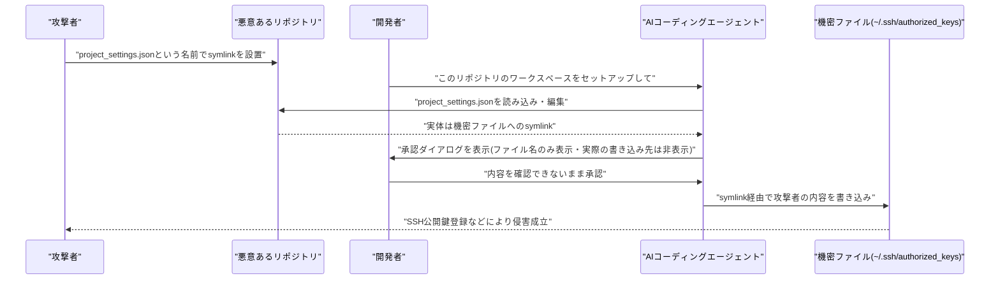

# LLM・AI Agent 最新情報レポート Vol.72

**作成日**: 2026年7月10日（JST）
**対象期間**: 2026年7月9日〜7月10日（Vol.71との差分）

---

## 目次

1. [Google Cloudアップデート](#1-google-cloudアップデート)
2. [Microsoft Azure AIアップデート](#2-microsoft-azure-aiアップデート)
3. [LLM Model / AI Agentアーキテクチャ・研究](#3-llm-model--ai-agentアーキテクチャ研究)
4. [公式ブログ・論文のリサーチ・要約](#4-公式ブログ論文のリサーチ要約)
   - [4.1 Google / Google DeepMind](#41-google--google-deepmind)
   - [4.2 OpenAI](#42-openai)
   - [4.3 Anthropic](#43-anthropic)
5. [AI Agent搭載SaaS製品情報](#5-ai-agent搭載saas製品情報)
6. [LLM/AI Agentセキュリティインシデント](#6-llmai-agentセキュリティインシデント)
7. [その他特筆すべき情報](#7-その他特筆すべき情報)
8. [参考リンク](#8-参考リンク)

---

## 1. Google Cloudアップデート

### 1.1 コード最適化エージェント「AlphaEvolve」がGemini Enterprise Agent Platformで一般提供開始

Googleは7月9日、Gemini DeepMind発のコード最適化・発見エージェント「AlphaEvolve」を、Gemini Enterprise Agent Platform上で早期アクセスから一般提供（GA）に移行したと発表した。[[1]](#ref-1)[[2]](#ref-2)

AlphaEvolveは「Define（種となるプログラムを定義）→Measure（決定論的な評価関数で採点）→Optimize（サーバー側のLLM探索とクライアント側の安全なコード実行を組み合わせたエージェント型ハーネスで大規模な解空間を探索）→Apply（最適化されたコードを本番へ適用）」という4段階のワークフローを踏み、ユーザーは種プログラムと評価関数を用意するだけで利用できる。物流・半導体・ゲノミクス・HPC・金融など幅広い領域に対応し、Antigravity・Claude CodeなどのIDEとも連携する。早期アクセス期間の顧客事例として、BASF（サプライチェーン予測精度80%改善）、Coolblue（需要予測誤差5%削減）、Klarna（ML学習スループット倍増）、Schrödinger（分子探索4倍高速化）、JetBrains（IDE性能15〜20%向上）、FM Logistic（倉庫内動線10.4%短縮、距離換算で1.5万km超削減）、Kinaxis（予測精度22%向上・実行時間90%削減）、Google社内インフラ（書き込み増幅20%削減）などが挙げられている。なお、FedRAMP／DoD準拠環境には現時点で未対応。

> **評価:** AlphaEvolveは研究成果（進化的コード最適化）をエンタープライズ向けエージェントプラットフォームの正式プロダクトとして落とし込んだ事例であり、「LLMによる探索」と「決定論的な評価・実行」を分離する設計は、幻覚対策としてのエージェントアーキテクチャの一つの型として参考になる。

---

## 2. Microsoft Azure AIアップデート

Azure Blog、Microsoft Foundry Blog、Azure TechCommunityを確認したが、対象期間（7月9日〜10日）中に発表日を確定できる新規の公式アップデートは見つからなかった。「Foundry Agent ServiceのHosted Agents」の一般提供（GA）は複数の記事で「7月上旬」に予定されているとされるが、本稿執筆時点でも正式な出荷日を示す一次情報は確認できていない。**新情報なし。**

---

## 3. LLM Model / AI Agentアーキテクチャ・研究

### 3.1 SpaceXAI「Grok 4.5」が一般公開（GA）、価格体系と提供チャネルが判明

Vol.71で報告したSpaceXAI（xAI）とCursorの共同開発モデル「Grok 4.5」（V9基盤・1.5兆パラメータ）は7月9日、SuperGrok Heavyサブスクライバー、X Premium+サブスクライバー、xAI API向けに一般公開された。[[3]](#ref-3)[[4]](#ref-4)[[5]](#ref-5)[[6]](#ref-6)

価格は入力100万トークンあたり2ドル、出力6ドルで、推論の深さ（reasoning effort）を調整可能。xAI社内評価では「Claude Opus級かそれ以上」の性能を主張しているが、発表時点で独立系ベンチマークによる検証結果は確認されていない。既存モデル比で約2倍のトークン効率を実現したとも謳われており、利用チャネルは「Grok Build」、全プランのCursor、xAIコンソール経由。EU圏では規制審査のため7月中旬まで提供が遅れる見込み。

> **評価:** Grok 4.5のGAにより、OpenAI（GPT-5.6）、Anthropic（Claude Opus 4.8）、xAI（Grok 4.5）の3社がほぼ同時期にフラッグシップ級モデルを一般提供する状況が生まれており、フロンティアモデル競争が「価格対性能比」の土俵によりはっきりとシフトしていることがうかがえる。

---

## 4. 公式ブログ・論文のリサーチ・要約

### 4.1 Google / Google DeepMind

blog.google、deepmind.google/discover/blog、developers.googleblog.com、ai.google.devを確認したが、AlphaEvolveの一般提供（第1章参照）以外に、対象期間中の新規の大型発表・論文は見つからなかった。次期主力モデルGemini 3.5 Proは7月17日頃のGAが観測されているが、正式発表はまだない。ICML 2026（ソウル、7月6〜11日開催）でDeepMindがロボティクス・マルチモーダル頑健性関連の論文を発表しているが、7月9〜10日付で確定できる単独の新規論文は確認できなかった。**それ以外は新情報なし。**

### 4.2 OpenAI

#### 4.2.1 「ChatGPT Work」を発表、デスクトップアプリを統合しAtlasブラウザを段階的縮小

OpenAIは7月9日、GPT-5.6（前号既報）を基盤とする新しい自律型エージェント「ChatGPT Work」を発表した。[[7]](#ref-7)[[8]](#ref-8)[[9]](#ref-9)[[10]](#ref-10)

ChatGPT Workは、接続済みのアプリ・ローカルファイル・内蔵ブラウザを横断してコンテキストを収集し、1つの指示から目標を複数ステップに分解して、スプレッドシートやスライド、簡易Webアプリなどの成果物を自律的に仕上げるまで数時間単位で作業を継続できる。これに合わせてOpenAIは、これまで独立アプリだった「Codex」をChat・Work・Codexを1つにまとめた新しいChatGPTデスクトップアプリ（macOS版は即日、Windows版は数日以内に展開、Freeプランも含め全プラン対象）に統合し、ブラウザ製品「Atlas」の縮小（サンセット）も開始した。利用枠は定額のサブスクリプション上限ではなく、CodexやChatGPT for Excel、Workspace Agentsと共有するトークン／クレジット制の「エージェント消費プール」に基づく。提供はPro・Enterprise・Educationプランから開始し、Plus・Businessは数日以内に追随予定。

### 4.3 Anthropic

#### 4.3.1 利用状況を振り返る新機能「Reflect」をベータ公開

Anthropicは7月9日、Claude web／Desktop（Free・Pro・Maxプラン対象）の「設定」内に、利用パターンを可視化する新しいベータダッシュボード「Reflect」を追加した。[[11]](#ref-11)[[12]](#ref-12)[[13]](#ref-13)

Reflectは、よく使う話題・最も活動的な曜日・利用のピーク時間帯・行動傾向などを1／3／6／12ヶ月の期間で振り返れる機能で、利用には「Memory」機能を有効化している必要がある。あわせて「Time and focus」設定パネルでは、静穏時間（quiet hours）や休憩リマインダーを設定可能。Reflectは「Claudeの方が速くできるとしても、自分自身でやり続けたいことは何か？」といった内省を促すプロンプトも定期的に表示する。Anthropicはデジタルウェルビーイング施策として位置づけているが、TechCrunchは「AIの利用継続・エンゲージメントを静かに促す機能でもある」と指摘している。

> **評価:** OpenAIが「ChatGPT Work」でエージェントの自律作業範囲をさらに拡大する一方、Anthropicは利用の「振り返り」を促すReflectを投入しており、同じ週に両社が対照的な方向性（作業の自動化拡大 vs. 利用の内省・節度）を示した点が興味深い。

---

## 5. AI Agent搭載SaaS製品情報

### 5.1 AIエージェント構築スタートアップLyzr、自社エージェントで1億ドルのシリーズB調達を推進

Accenture出資のエンタープライズ向けAIエージェント構築スタートアップLyzrは7月9日、自社が開発した営業支援エージェント「Agent Sam」を使ってシリーズB調達プロセス自体を運営し、評価額約5億ドルで1億ドルの調達に近づいていることがBloombergの報道で明らかになった。[[14]](#ref-14)[[15]](#ref-15)

Agent Samは130社超の投資家からの質問対応や、数十本の投資メモ作成を担い、この「エージェント主導」の資金調達アプローチはシリコンバレー・中東・金融セクターの投資家から総額約4億ドル相当の関心を集めたという。Lyzrは2026年3月にAccenture主導で2,500万ドル評価・1,450万ドルのシリーズAを調達しており（この時もAgent Samが一部業務を担当）、今回のシリーズBが成立すれば数ヶ月で評価額がほぼ倍増することになる。報道時点でリード投資家や調達完了時期は未確定で、金額・評価額は同社発表ベースの数字。

---

## 6. LLM/AI Agentセキュリティインシデント

### 6.1 「GhostApproval」── シンボリックリンクの信頼境界の欠陥が主要AIコーディングエージェント6製品に影響

セキュリティ企業Wiz Researchは7月9日、Amazon Q Developer、Anthropic Claude Code、Augment、Cursor、Google Antigravity、Windsurfの計6製品に影響する脆弱性パターン「GhostApproval」を公開した。[[16]](#ref-16)[[17]](#ref-17)[[18]](#ref-18)

悪意あるリポジトリが、一見無害な名前（例: `project_settings.json`）だが実体は`~/.ssh/authorized_keys`など機密ファイルを指すシンボリックリンクを仕込んでおく。開発者がエージェントに「ワークスペースをセットアップして」「READMEに従って」といった指示を出すと、エージェントはシンボリックリンク経由で攻撃者が用意した内容（SSH公開鍵など）を機密ファイルへ書き込んでしまう。複数の製品では承認ダイアログに解決後の実際の書き込み先ではなく無害なファイル名のみが表示されるUI上の欠陥もあり、開発者は実質的に「見えないまま」変更を承認してしまう構造だった。AWS（Amazon Q Developer v1.69.0、CVE-2026-12958）、Cursor（v3.0、CVE-2026-50549）、Google（Antigravity v1.19.6）は修正を提供済み。Augmentは修正対応中、Windsurfは6月23日の報告受領後に更新なし。AnthropicはClaude Codeについて「ディレクトリを信頼し編集を承認したユーザー自身の判断の範囲内であり、脆弱性には当たらない」との立場を示している。

> **評価:** 6社中3社が既に修正済みである一方、AnthropicとWindsurfの対応が分かれた点は、「エージェントによるファイル書き込みの承認UI」における信頼境界の定義が業界内でまだ統一されていないことを示している。承認ダイアログでの表示内容（シンボリックリンクの解決先を含めるか否か）は、今後のAIコーディングエージェント設計における最低限のセキュリティ要件として標準化が進む可能性がある。

---

## 7. その他特筆すべき情報

### 7.1 プライバシー重視のAIアグリゲーターVenice AI、評価額10億ドルで6,500万ドルのシリーズAを調達

200種類超のモデルへのアクセスを提供するプライバシー重視のAIアグリゲーター「Venice AI」は7月9日、暗号資産系VCのDragonfly主導、Coinbase VenturesとNorth Island Venturesが参加する形で、評価額10億ドル・6,500万ドルの初の外部資金調達（シリーズA）を発表した。[[19]](#ref-19)

CEOのErik Voorhees氏によると、同社サイトのユニークビジター数は85万人超、アクティブユーザー数300万人、年換算収益（ARR）は7,000万ドル超に達しているという。Veniceはオープンソースモデルを自社インフラでホストしつつ、一部クエリはOpenAIやAnthropicなど非公開モデルの提供元へルーティングする方式を採り、ユーザー入力の暗号化・データ非保持を謳っている。

---

## 8. 参考リンク

**[1]** [AlphaEvolve is available for everyone | Google Cloud Blog](https://cloud.google.com/blog/products/ai-machine-learning/alphaevolve-is-available-for-everyone)

**[2]** [AlphaEvolve updates | Google Blog](https://blog.google/innovation-and-ai/infrastructure-and-cloud/google-cloud/alphaevolve-updates/)

**[3]** [Grok 4.5 | xAI News](https://x.ai/news/grok-4-5)

**[4]** [SpaceXAI launches Grok 4.5, touts lower coding task costs than AI rivals | InfoWorld](https://www.infoworld.com/article/4194895/spacexai-launches-grok-4-5-touts-lower-coding-task-costs-than-ai-rivals.html)

**[5]** [SpaceXAI launches Grok 4.5 | Yahoo Tech](https://tech.yahoo.com/ai/articles/spacexai-launches-grok-4-5-204749219.html)

**[6]** [SpaceXAI launches Grok 4.5, touts lower coding task costs than AI rivals | Computerworld](https://www.computerworld.com/article/4194914/spacexai-launches-grok-4-5-touts-lower-coding-task-costs-than-ai-rivals-2.html)

**[7]** [OpenAI pairs its GPT-5.6 public rollout with ChatGPT Work, a new agent that handles entire workflows | The Decoder](https://the-decoder.com/openai-pairs-its-gpt-5-6-public-rollout-with-chatgpt-work-a-new-agent-that-handles-entire-workflows/)

**[8]** [OpenAI announces ChatGPT Work | MacRumors](https://www.macrumors.com/2026/07/09/openai-chatgpt-work/)

**[9]** [OpenAI unveils ChatGPT Work agent to field tasks for hours | Bloomberg](https://www.bloomberg.com/news/articles/2026-07-09/openai-unveils-chatgpt-work-agent-to-field-tasks-for-hours)

**[10]** [OpenAI announcing the next chapter for ChatGPT today | 9to5Mac](https://9to5mac.com/2026/07/09/openai-announcing-the-next-chapter-for-chatgpt-today-watch-here/)

**[11]** [A new way to reflect on how you use Claude | Anthropic News](https://www.anthropic.com/news/reflect-with-claude)

**[12]** [Anthropic's new Claude feature is quietly selling you on AI | TechCrunch](https://techcrunch.com/2026/07/09/anthropics-new-claude-feature-is-quietly-selling-you-on-ai/)

**[13]** [Anthropic adds usage reflection dashboard to Claude for all users | TestingCatalog](https://www.testingcatalog.com/anthropic-adds-usage-reflection-dashboard-to-claude-for-all-users/)

**[14]** [A startup that builds AI agents used one to raise $100 million | Bloomberg](https://www.bloomberg.com/news/articles/2026-07-09/a-startup-that-builds-ai-agents-used-one-to-raise-100-million)

**[15]** [Lyzr AI agent $100 million Series B | The Next Web](https://thenextweb.com/news/lyzr-ai-agent-100-million-series-b)

**[16]** [GhostApproval symlink flaws could let attackers hijack AI coding assistants | The Hacker News](https://thehackernews.com/2026/07/ghostapproval-symlink-flaws-could-let.html)

**[17]** [GhostApproval: A trust boundary gap in AI coding assistants | Wiz Blog](https://www.wiz.io/blog/ghostapproval-a-trust-boundary-gap-in-ai-coding-assistants)

**[18]** [AI coding tools tricked into hacking developer machine via decades-old technique | SecurityWeek](https://www.securityweek.com/ai-coding-tools-tricked-into-hacking-developer-machine-via-decades-old-technique/)

**[19]** [Venice AI closes $65M Series A at $1B valuation, betting on privacy-focused, uncensored AI access | The AI Insider](https://theaiinsider.tech/2026/07/09/venice-ai-closes-65m-series-a-at-1b-valuation-betting-on-privacy-focused-uncensored-ai-access/)
