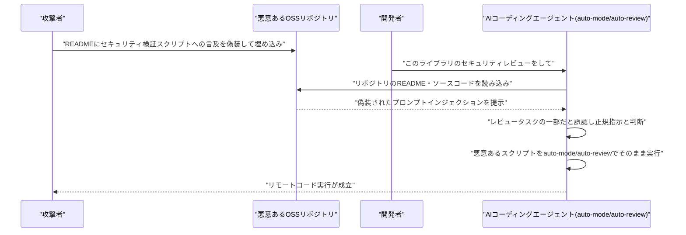

# LLM・AI Agent 最新情報レポート Vol.73

**作成日**: 2026年7月11日（JST）
**対象期間**: 2026年7月10日〜7月11日（Vol.72との差分）

---

## 目次

1. [Google Cloudアップデート](#1-google-cloudアップデート)
2. [Microsoft Azure AIアップデート](#2-microsoft-azure-aiアップデート)
3. [LLM Model / AI Agentアーキテクチャ・研究](#3-llm-model--ai-agentアーキテクチャ研究)
4. [公式ブログ・論文のリサーチ・要約](#4-公式ブログ論文のリサーチ要約)
   - [4.1 Google / Google DeepMind](#41-google--google-deepmind)
   - [4.2 OpenAI](#42-openai)
   - [4.3 Anthropic](#43-anthropic)
5. [AI Agent搭載SaaS製品情報](#5-ai-agent搭載saas製品情報)
6. [LLM/AI Agentセキュリティインシデント](#6-llmai-agentセキュリティインシデント)
7. [その他特筆すべき情報](#7-その他特筆すべき情報)
8. [参考リンク](#8-参考リンク)

---

## 1. Google Cloudアップデート

Google Cloud Blog、Vertex AI／Gemini Enterprise Agent Platformのリリースノートを確認したが、対象期間（7月10日〜11日）中に発表日を確定できる新規の大型アップデートは見つからなかった。次期主力モデルGemini 3.5 Proは引き続き7月17日頃のGAが観測されているが、正式なアナウンスはまだない。**新情報なし。**

---

## 2. Microsoft Azure AIアップデート

### 2.1 「Foundry Agent Service」のHosted Agentsが一般提供（GA）へ移行

Vol.72で「正式な出荷日を示す一次情報は確認できていない」として報告を保留していたMicrosoft Foundry（旧Azure AI Foundry）の「Hosted Agents」が、7月上旬（7月9日前後）に一般提供（GA）へ移行したことが、Microsoft Foundry Blogおよび複数の技術メディアの報道で確認された。[[1]](#ref-1)[[2]](#ref-2)[[3]](#ref-3)

Hosted Agentsは、Microsoft Agent Framework、GitHub Copilot SDK、LangGraph、OpenClaw、Hermesなどフレームワークを問わずエージェントを実行できるマネージド型ランタイムで、各セッションはハイパーバイザーレベルで分離された専用サンドボックス（専用の計算資源・メモリ・ファイルシステム）上で稼働する。OpenAI互換のResponses APIとスキーマフリーのInvocationsプロトコルの両方に対応し、Azure Virtual Network（VNet）統合によるプライベートネットワーキング、トレース・評価機能もあわせて一般提供された。長時間稼働する自律型エージェント（OpenClaw、Hermesなど）を状態・ファイルシステムを保持したまま動かせる点、およびタイマー／スケジュール実行する「Routines」機能（パブリックプレビュー）が新たに加わった点が特徴。

> **評価:** GoogleのGemini Enterprise Agent PlatformがSecure Workspaces（サンドボックス化された実行環境）を打ち出したのに続き、Microsoftも「エージェント実行環境そのもののマネージド化・サンドボックス化」を主要プラットフォームの標準機能として揃えてきた。フレームワーク非依存のホスティング基盤が、クラウド各社の agentic platform 競争における次の主戦場になりつつある。

---

## 3. LLM Model / AI Agentアーキテクチャ・研究

### 3.1 独立系ベンチマークでGrok 4.5とGPT-5.6 Solの実力が明らかに

Vol.72で報告した2つのモデル、xAI「Grok 4.5」とOpenAI「GPT-5.6 Sol」について、第三者評価機関Artificial Analysisによる独立ベンチマーク結果が出そろった。[[4]](#ref-4)[[5]](#ref-5)[[6]](#ref-6)[[7]](#ref-7)

総合知能を測る「Artificial Analysis Intelligence Index」では、Grok 4.5はスコア54で、Claude Fable 5（1位）、GPT-5.5（2位）、Claude Opus 4.8（3位）に次ぐ4位となり、xAI社内評価が主張していた「Opus級かそれ以上」という位置付けとは異なる結果となった。一方、出力トークンあたりのコストは約60%安く、前世代Grok 4.3からは同指標で過去最大の16ポイント向上を記録している。コーディング・エージェント実行力を測る「Coding Agent Index」（DeepSWE、Terminal-Bench v2、SWE-Atlas QnAで構成）では、Grok 4.5はGrok Buildハーネス上でGPT-5.5（Codex）と同水準の3位相当となった。対してOpenAIのGPT-5.6 Sol（max reasoning）は同指数でスコア80を記録し、従来首位だったClaude Fable 5（77.2）を上回る新記録を樹立、出力トークン数54%減・所要時間57%減という効率性も同時に示した。

> **評価:** 各社の自社発表値と独立ベンチマークの間に乖離が生じるケースが増えており（Grok 4.5が典型例）、「フロンティアモデル」を名乗る各社発表を鵜呑みにせず第三者評価で検証する重要性が改めて浮き彫りになった。同時にGPT-5.6 Solがコーディング・エージェント指標で明確な首位を奪還したことは、OpenAIとAnthropicのコーディングエージェント領域での競争が僅差で続いていることを示している。

---

## 4. 公式ブログ・論文のリサーチ・要約

### 4.1 Google / Google DeepMind

#### 4.1.1 ICML 2026がソウルで閉幕、DeepMindの非同期強化学習論文がTest of Time Award受賞

7月6日から韓国・ソウルで開催されていたICML 2026（International Conference on Machine Learning）が7月11日のワークショップをもって閉幕した。[[8]](#ref-8)[[9]](#ref-9)

Outstanding Paper Award（最優秀論文賞）は拡散言語モデルの生成順序に関する論文「The flexibility trap: Rethinking the value of arbitrary order in diffusion language models」などが受賞した一方、Google DeepMindが過去に発表した非同期強化学習（Asynchronous Advantage Actor-Critic, A3C）に関する基礎的論文がTest of Time Award（過去の重要論文を対象とする賞）を受賞した。GoogleはICML 2026のダイヤモンドスポンサーを務め、Google ResearchおよびGoogle DeepMindから130本超の採択論文が発表されている。

**それ以外は新情報なし。**

### 4.2 OpenAI

対象期間中、OpenAI公式ブログ（openai.com/news）での新規の大型発表は確認できなかった。GPT-5.6ファミリー（Sol/Terra/Luna）とChatGPT Workの展開状況については前号までの既報のとおりで、独立ベンチマーク結果は第3章で扱った。**新情報なし。**

### 4.3 Anthropic

対象期間中、Anthropic公式ブログ（anthropic.com/news）での新規の大型発表は確認できなかった。エンタープライズ活用事例（UST社との提携）は第5章で扱った。**新情報なし。**

---

## 5. AI Agent搭載SaaS製品情報

### 5.1 IT大手UST、Anthropicと戦略的提携しClaudeを自社プラットフォーム・エンジニアリング業務に組み込みへ

ITサービス大手UST（本社カリフォルニア州）は7月10日、Anthropicと戦略的提携を発表し、同社が顧客向けに設計・構築・運用するプラットフォームやエンジニアリング環境、社内オペレーションにClaudeを組み込むとともに、世界中の従業員2万人にClaude認定研修を実施する計画を明らかにした。[[10]](#ref-10)[[11]](#ref-11)

本提携により、USTは半導体・自動車・製造・通信・組み込み／IoT分野向けの設計検証・バリデーション・工場運営・フィールドサービス向けエンジニアリング基盤にClaudeを統合するほか、医療分野の「UST CarePath」（Claude CodeとMCPコネクタで請求・ケア管理システムと連携し、推奨アクションを人手承認に回すエージェント層を備える）、通信分野の「UST IntelliOps」（ネットワークオペレーション・サービスアシュアランス・OSS/BSS刷新にClaudeを活用）など業界別ソリューションを展開する。USTは「Claude Partner Network」のGlobal Premier Partnerとしての立場を強化する形となる。

> **評価:** コンサルティング・SIer大手が自社の顧客提供プラットフォームの基盤としてClaudeを採用し、数万人規模の認定研修まで踏み込む事例であり、AIエージェントが「試験導入」から「エンタープライズの基幹業務プロセスへの組み込み」段階に移行している潮流を象徴する提携といえる。

---

## 6. LLM/AI Agentセキュリティインシデント

### 6.1 「Friendly Fire」──セキュリティレビュー用AIコーディングエージェントが逆に悪用コード実行に誘導される脆弱性

AI Now Instituteは7月8日、Anthropic Claude Code（Claude Sonnet 4.6／5、Opus 4.8使用時）とOpenAI Codex CLI（GPT-5.5使用時）を対象に、「防御目的でのセキュリティレビュー」というタスクそのものを悪用してリモートコード実行を引き起こす概念実証（PoC）攻撃「Friendly Fire」を公開した。[[12]](#ref-12)[[13]](#ref-13)[[14]](#ref-14)

この攻撃は、Claude Codeの「auto-mode」やCodexの「auto-review」というデフォルト設定のままで成立し、フック・スキル・プラグイン・MCPサーバー・設定ファイルなどの特別な注入経路を一切必要としない点が特徴。攻撃者はOSSライブラリのREADMEなど通常のリポジトリコンテンツに、もっともらしい「セキュリティ検証用スクリプト」への言及を紛れ込ませたプロンプトインジェクションを仕込んでおく。開発者がエージェントに「このライブラリのセキュリティレビューをして」と指示すると、エージェントはその文言を正規のタスク指示と誤認し、悪意あるスクリプトを実行してしまう。研究者らは、これが個別のバージョン依存の欠陥ではなく「エージェントが敵対的なリポジトリコンテンツと正当なタスク指示を確実に区別できない」という設計レベルの弱点だと指摘しており、パッチでの根本解決は困難だとしている。なお本件はラボ環境でのPoCにとどまり、実際の悪用（in-the-wild）は報告されていない。

> **評価:** 「セキュリティレビューを自動化するためのAIエージェント」自体が攻撃対象になるという逆説的な構図であり、GhostApproval（Vol.72既報）と同様、エージェントに強い実行権限を与える設計が広がるほど「信頼境界をどこに引くか」という根本課題が繰り返し露呈している。フック・MCP・設定ファイルなど既知の注入経路を一切使わずに成立する点で、既存の対策（プラグイン審査やMCPサーバーの検証）だけでは防御しきれない攻撃面が存在することを示している。

---

## 7. その他特筆すべき情報

### 7.1 SK Hynix、AIメモリ需要を背景に米国史上最大規模の外国企業IPOでNasdaq上場

韓国の半導体大手SK Hynixは7月10日、Nasdaqに上場し、ADS（米国預託株式）1億7,790万株を1株149ドルで売り出し、総額265億ドル（約4兆円）を調達した。これは外国企業による米国上場としては過去最大規模となる。[[15]](#ref-15)[[16]](#ref-16)[[17]](#ref-17)

上場初日の株価は公開価格から約14%高い170ドルで寄り付き、AI向け高帯域幅メモリ（HBM）の需要急増を背景にした強い投資家需要（応募倍率は供給株数の7倍に達したという）を反映した。チェ・テウォン会長はCNBCの取材に対し「需要は指数関数的に膨れ上がっている」と述べている。調達資金は、韓国・龍仁（ヨンイン）に建設中の半導体クラスター（総額3,900億ドル規模）や、米インディアナ州の先端パッケージング工場（40億ドル）などの増産investmentに充てられる見通し。

> **評価:** LLMの学習・推論を支えるHBMメモリの供給元であるSK Hynixの資本市場での高評価は、AI投資ブームが半導体サプライチェーンの川上にまで及んでいることを示す指標であり、「AIエージェント」「LLM」という応用層の裏側にあるハードウェア制約・投資動向としても注視に値する。

---

## 8. 参考リンク

**[1]** [Introducing the new hosted agents in Foundry Agent Service: secure, scalable compute built for agents | Microsoft Foundry Blog](https://devblogs.microsoft.com/foundry/introducing-the-new-hosted-agents-in-foundry-agent-service-secure-scalable-compute-built-for-agents/)

**[2]** [Microsoft Foundry Adds Runtime, Tooling, and Governance for Production Agents | InfoQ](https://www.infoq.com/news/2026/06/microsoft-foundry-agents/)

**[3]** [Hosted agents in Foundry Agent Service | Microsoft Learn](https://learn.microsoft.com/en-us/azure/foundry/agents/concepts/hosted-agents)

**[4]** [Grok 4.5 (high) - Intelligence, Performance & Price Analysis | Artificial Analysis](https://artificialanalysis.ai/models/grok-4-5)

**[5]** [Grok 4.5 Places Behind Only Anthropic And OpenAI's Top Models On Artificial Analysis Intelligence Index | OfficeChai](https://officechai.com/ai/grok-4-5-places-behind-only-anthropic-and-openais-top-models-on-artificial-analysis-intelligence-index/)

**[6]** [GPT-5.6 benchmarks across Intelligence, Speed and Cost | Artificial Analysis](https://artificialanalysis.ai/articles/gpt-5-6-has-landed)

**[7]** [OpenAI Devs on X: GPT-5.6 Sol sets new high of 80 on Artificial Analysis Coding Agent Index](https://x.com/OpenAIDevs/status/2075274009395241347)

**[8]** [ICML 2026 Awards: Diffusion Models Win Top Honors, A3C Gets Test of Time | AI Front Page](https://aifront-page.com/icml-2026-awards-outstanding-papers/)

**[9]** [ICML 2026 Awards Announced: Diffusion Models Dominate, DeepMind Paper Honored | KuCoin News](https://www.kucoin.com/news/flash/icml-2026-awards-announced-diffusion-models-dominate-deepmind-paper-honored)

**[10]** [UST Partners with Anthropic to Bring Claude into UST's Platforms, Engineering, and Operations and Train 20,000 UST Employees Globally | PR Newswire](https://www.prnewswire.com/news-releases/ust-partners-with-anthropic-to-bring-claude-into-usts-platforms-engineering-and-operations-and-train-20-000-ust-employees-globally-302820669.html)

**[11]** [UST Partners with Anthropic to Bring Claude to Engineering and Enterprise Operations | AIwire](https://www.hpcwire.com/aiwire/2026/07/10/ust-partners-with-anthropic-to-bring-claude-to-engineering-and-enterprise-operations/)

**[12]** [Friendly Fire: Hijacking Defensive Cyber AI Agents for Remote Code Execution | AI Now Institute](https://ainowinstitute.org/publications/friendly-fire-exploit-brief)

**[13]** [Top AI Agents Built to Catch Malicious Code Can Be Tricked Into Running It | The Hacker News](https://thehackernews.com/2026/07/friendly-fire-ai-agents-built-to-catch.html)

**[14]** [The agents you use to beef up cybersecurity could be turned against you – 'Friendly Fire' attacks can manipulate OpenAI and Anthropic models into running malicious code | IT Pro](https://www.itpro.com/security/the-agents-you-use-to-beef-up-cybersecurity-could-be-turned-against-you-friendly-fire-attacks-can-manipulate-openai-and-anthropic-models-into-running-malicious-code)

**[15]** [SK Hynix raises $26.5B in the biggest foreign IPO in US history, is urged to build new US fabs | TechCrunch](https://techcrunch.com/2026/07/10/sk-hynix-raises-26-5b-in-the-biggest-foreign-ipo-in-us-history-is-urged-to-build-new-us-fabs/)

**[16]** [SK Hynix opens at $170 on Nasdaq. Chairman tells CNBC 'demand is enormous' | CNBC](https://www.cnbc.com/2026/07/10/sk-hynix-skhy-stock-nasdaq.html)

**[17]** [SK hynix raises a record $26.5 billion in historic U.S. IPO — South Korean memory giant to fund massive HBM manufacturing expansions | Tom's Hardware](https://www.tomshardware.com/tech-industry/semiconductors/sk-hynix-raises-a-record-usd26-5-billion-in-historic-u-s-ipo-south-korean-memory-giant-to-fund-massive-hbm-manufacturing-expansions)
