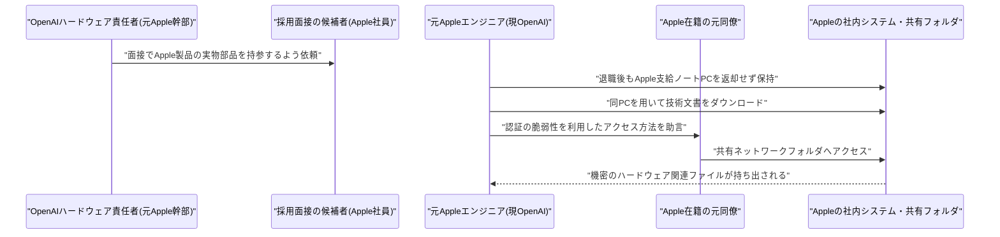

# LLM・AI Agent 最新情報レポート Vol.75

**作成日**: 2026年7月13日（JST）
**対象期間**: 2026年7月12日〜7月13日（Vol.74との差分）

---

## 目次

1. [Google Cloudアップデート](#1-google-cloudアップデート)
2. [Microsoft Azure AIアップデート](#2-microsoft-azure-aiアップデート)
3. [LLM Model / AI Agentアーキテクチャ・研究](#3-llm-model--ai-agentアーキテクチャ研究)
4. [公式ブログ・論文のリサーチ・要約](#4-公式ブログ論文のリサーチ要約)
   - [4.1 Google / Google DeepMind](#41-google--google-deepmind)
   - [4.2 OpenAI](#42-openai)
   - [4.3 Anthropic](#43-anthropic)
5. [AI Agent搭載SaaS製品情報](#5-ai-agent搭載saas製品情報)
6. [LLM/AI Agentセキュリティインシデント](#6-llmai-agentセキュリティインシデント)
7. [その他特筆すべき情報](#7-その他特筆すべき情報)
   - [7.1 Anthropic、Claude Fable 5の従量課金移行を三度目の延期、7月19日へ](#71-anthropicclaude-fable-5の従量課金移行を三度目の延期7月19日へ)
   - [7.2 Apple対OpenAI訴訟、新たな疑惑の詳細が続々判明、Musk・Altmanも応酬](#72-apple対openai訴訟新たな疑惑の詳細が続々判明musk・altmanも応酬)
8. [参考リンク](#8-参考リンク)

---

> **今号について:** 対象期間（7月12日・13日）は、Google Cloud・Microsoft Azure・主要LLMラボの公式チャネルからは目立った新規発表が確認できず、クラウド・モデルリリース面では「凪」が継続した。一方でAnthropicは研究ブログでClaudeの「価値観」がモデル・言語によってどう変化するかを分析した新論文を公開したほか、フラッグシップモデル「Claude Fable 5」の従量課金移行期限を三度目となる延期で7月19日まで再延長した。また、前号で報告したApple対OpenAIの営業秘密訴訟は、対象期間中に新たな疑惑の詳細が複数メディアで報じられたほか、Elon Musk氏とSam Altman氏がSNS上で応酬する場面もあり、引き続き大きな話題となった。

---

## 1. Google Cloudアップデート

Google Cloud Blogの「What's new」まとめページ、Vertex AI／Gemini Enterprise Agent Platformのリリースノートを確認したが、対象期間（7月12日〜13日）中に発表日を確定できる新規の公式アップデートは見つからなかった。次期主力モデルGemini 3.5 Proについても、7月13日時点でGemini API公式変更履歴にモデルカードやエンドポイントの追加は確認できず、「7月17日頃GA」との観測は依然として非公式情報の域を出ない。**新情報なし。**

---

## 2. Microsoft Azure AIアップデート

Microsoft Foundry Blog、Azure Blog、Azure TechCommunityを確認したが、対象期間（7月12日〜13日）中に発表日を確定できる新規の公式アップデートは見つからなかった。既報のFoundry Agent Service「Hosted Agents」のGA（7月9日前後）についても、続報は確認できていない。**新情報なし。**

---

## 3. LLM Model / AI Agentアーキテクチャ・研究

Artificial Analysis、LMArenaの公式リーダーボードについては、対象期間中に発表日を確定できる新規のベンチマーク更新は確認できなかった（第三者集計サイト経由でGPT-5.6がFable 5を上回ったとする情報もあったが、一次情報源での裏付けが取れず、信頼性の観点から本号では採用を見送った）。

一方、Hugging Face Daily Papersでは、AIエージェントのアーキテクチャ・評価に関する新規論文が複数取り上げられた。

- **UniClawBench**（7月9日投稿、7月12日付でHugging Face Daily Papersに掲載）: Dockerコンテナ上の実環境でエージェントを評価する新ベンチマーク。スキル利用・探索・長文脈推論・マルチモーダル理解・クロスプラットフォーム協調の5能力を分離して評価する点が特徴で、英中バイリンガルの実タスク400件を収録する。[[1]](#ref-1)
- **Remember When It Matters**（Meta AI、7月10日投稿、7月12日付で掲載）: 長期タスクを行うエージェントの「行動状態の劣化」に対処する提案手法。実行エージェントとは別に記憶エージェントを並走させ、必要な場面でのみリマインドを注入する方式で、Terminal-Bench 2.0で+8.3pt、τ²-Benchで+6.8ptの改善を報告している。[[2]](#ref-2)
- **CausalDS**（7月9日投稿、7月12日付で掲載）: データサイエンスエージェントの因果推論能力を測るベンチマーク。構造的因果モデルから合成データとストーリーを生成し、Pearlの因果階層3段階すべてをカバーする。[[3]](#ref-3)
- **Self-Guided Test-Time Training（S-TTT）**（7月10日投稿、7月13日付で掲載）: 長文脈LLMのテスト時学習（TTT）において、性能を左右するのは適応手法自体ではなく学習データの質（信号対雑音比）であることを示し、ランダムサンプリングよりも精度の高い手法を提案している。[[4]](#ref-4)

> **評価:** 対象期間中に大型モデルの新規リリースはなかったものの、エージェント評価手法の精緻化（能力軸の分離、記憶の能動的介入、因果推論、テスト時学習のデータ品質）が着実に進んでいる点は、今後のエージェントアーキテクチャ設計に影響しうる基礎研究として注目したい。

---

## 4. 公式ブログ・論文のリサーチ・要約

### 4.1 Google / Google DeepMind

blog.google、deepmind.google/discover/blog、research.google/blogを確認したが、対象期間中に新規の大型発表・論文は確認できなかった。**新情報なし。**

### 4.2 OpenAI

openai.com/newsを確認したが、対象期間中に新規の大型発表は確認できなかった。Apple対OpenAI訴訟については第7章で扱う。**新情報なし。**

### 4.3 Anthropic

Anthropicは7月13日、研究ブログ「How Claude's values vary by model and language」を公開した。Claude.ai上の会話ログ（2026年5月の2週間分、Sonnet 4.6・Opus 4.6・Opus 4.7の3モデル×主要20言語で言語・モデルごとに約5,000件ずつ抽出）を分析し、Claudeの応答に表れる「価値観」を「配慮 vs 慎重」「温かみ vs 厳密さ」「深さ vs 簡潔さ」「率直さ vs 実行重視」の4軸で定量化した。分析の結果、モデル世代間（例: Sonnet 4.6は温かく配慮的で簡潔な傾向、Opus 4.7は厳密・慎重・深い傾向）だけでなく、言語間（アラビア語・ヒンディー語では温かみの表現が多い、英語・ロシア語では厳密さの表現が多いなど）でも系統的な差異が見られたとしている。[[5]](#ref-5)

> **評価:** モデルの「価値観」がバージョンや利用言語によって意図せず変動しうることを定量的に示した点は、AI安全性・整合性（アライメント）研究として意義深い。多言語展開が進む中で、非英語圏ユーザーへの応答品質・一貫性の担保という観点からも今後の追加検証が注目される。

---

## 5. AI Agent搭載SaaS製品情報

Salesforce、ServiceNow、HubSpot、Notion、Slackなど主要SaaS各社の公式ニュースルーム・リリースノートを確認したが、対象期間（7月12日〜13日）中に発表日を確定できる新規のAIエージェント機能・資金調達・企業提携は見つからなかった（Salesforce株価の上昇を「Agentforceの収益化進展」と結びつけるアナリスト論評はあったが、一次情報源で確認できず本号では見送った）。**新情報なし。**

---

## 6. LLM/AI Agentセキュリティインシデント

The Hacker News、SecurityWeek、Dark Reading、BleepingComputer、Wiz Blog、AI Now Instituteなどを確認したが、対象期間（7月12日〜13日）中に発表日を確定できる新規の脆弱性報告・セキュリティインシデントは見つからなかった。既報の「GhostApproval」「Friendly Fire」「HalluSquatting」についても、対象期間中の新たな続報（パッチ状況の更新や新規被害）は確認できていない。**新情報なし。**

---

## 7. その他特筆すべき情報

### 7.1 Anthropic、Claude Fable 5の従量課金移行を三度目の延期、7月19日へ

Anthropicは、Pro・Max・Team・一部Enterpriseプランにおけるフラッグシップモデル「Claude Fable 5」のサブスクリプション込みアクセス（included access）について、当初6月22日としていた終了予定日を7月7日、続いて7月12日へと2度延期していたが、対象期間中の7月12日、3度目の延期として新たな期限を7月19日に設定したことを発表した。前号（Vol.74）では7月12日の期限到来をもって従量課金クレジット制へ移行したと報告したが、実際にはこの移行は再度先送りされた形となる。[[6]](#ref-6)[[7]](#ref-7)[[8]](#ref-8)

延長期間中も、週次利用上限の50%を割り当てる条件や対象プランに変更はない。7月19日以降も継続利用するには、入力100万トークンあたり10ドル・出力同50ドルの事前購入型クレジットが必要となる点も従来方針から変わっていないが、Anthropicは今回もクレジット制への移行は暫定措置であり、キャパシティが確保でき次第サブスクリプションへの再統合を目指すとコメントしている。[[9]](#ref-9)[[10]](#ref-10)

> **評価:** 6月22日の当初期限から数えて3度目の延期となり、最上位モデルの需要が供給キャパシティを継続的に上回っている状況がうかがえる。ベンチマークで高評価を得たフラッグシップモデルほど計算資源の逼迫が顕著になるという構図は、他社を含めた業界共通の課題として今後も注視が必要である。

### 7.2 Apple対OpenAI訴訟、新たな疑惑の詳細が続々判明、Musk・Altmanも応酬

前号（Vol.74）で報告したAppleによるOpenAI提訴（7月10日提起、営業秘密の窃取を主張）について、対象期間中の7月12日〜13日にかけて新たな疑惑の詳細や関連動向が相次いで報じられた。

まず7月12日、この訴訟をめぐりElon Musk氏とSam Altman氏がX（旧Twitter）上で応酬する場面があった。Altman氏が「Appleを恐れてはいないが、深い敬意を持っている。s-tier企業だ」と投稿したのに対し、Musk氏は「Scam Altman（詐欺師アルトマン）がまたやった」などと繰り返し揶揄し、Altman氏も同氏のSpaceXによる軌道上データセンター構想を引き合いに反論するなど、両者の応酬が話題となった。[[11]](#ref-11)

さらに7月13日には、訴状の詳細を掘り下げた続報が複数メディアから出た。TechCrunchやFortuneの報道によれば、Appleは元従業員400人以上が現在OpenAIに在籍していると主張しているほか、元Appleエンジニアのチャン・リュー氏について、退職後も返却しなかったApple支給ノートPCで機密文書をダウンロードしただけでなく、元同僚のノートPC経由でApple社内ネットワークへアクセスし、未公表の認証脆弱性を悪用して共有フォルダから数十件の機密ハードウェア関連ファイルを持ち出したとする、より具体的な疑惑が明らかにされた。[[12]](#ref-12)[[13]](#ref-13)

Bloombergは、訴訟がOpenAIのハードウェア人材採用や部品供給網（特にアジアの受託製造大手との関係）に既に悪影響を及ぼし始めていると報じた一方、OpenAI関係者は今年中の第1弾ハードウェア製品発表・2027年の発売という計画自体は維持する方針だとしている。[[14]](#ref-14)

> **評価:** 訴状の詳細が明らかになるにつれ、単発の情報漏洩ではなく採用プロセスを含む組織的な関与が疑われている点が浮き彫りになっている。Bloombergが指摘するように、係争中であること自体がOpenAIのハードウェア戦略・サプライチェーン構築の重荷になり得るという点は、判決の帰趨を待たずに実害が生じ得るという意味で示唆的である。IPO準備が取り沙汰される時期と重なっていることも含め、引き続き動向を注視したい。

---

## 8. 参考リンク

**[1]** [UniClawBench: A Universal Benchmark for Proactive Agents on Real-World Tasks | arXiv](https://arxiv.org/abs/2607.08768)

**[2]** [Remember When It Matters: Proactive Memory Agent for Long-Horizon Agents | arXiv](https://arxiv.org/abs/2607.08716)

**[3]** [CausalDS: Benchmarking Causal Reasoning in Data-Science Agents | arXiv](https://arxiv.org/abs/2607.08093)

**[4]** [Self-Guided Test-Time Training for Long-Context LLMs | arXiv](https://arxiv.org/abs/2607.09415)

**[5]** [How Claude's values vary by model and language | Anthropic](https://www.anthropic.com/research/claude-values-models-languages)

**[6]** [Claude Fable 5 stays free for paid users until July 19 as Anthropic buys more time | BleepingComputer](https://www.bleepingcomputer.com/news/artificial-intelligence/claude-fable-5-stays-free-for-paid-users-until-july-19-as-anthropic-buys-more-time/)

**[7]** [Claude Fable 5 Free Access Extended Until July 19 | Dataconomy](https://dataconomy.com/2026/07/13/claude-fable-5-free-access-extended-july-19/)

**[8]** [Fable 5 Free Through July 19: Anthropic Blinks Again as Opus 5 Leak Surfaces in Cursor | Tech Times](https://www.techtimes.com/articles/320265/20260712/fable-5-free-through-july-19-anthropic-blinks-again-opus-5-leak-surfaces-cursor.htm)

**[9]** [Claude Fable 5 Extends To July 19. 7 Days, 7 Power Moves | Forbes](https://www.forbes.com/sites/sandycarter/2026/07/13/claude-fable-5-extends-to-july-19-7-days-7-power-moves/)

**[10]** [Claude just delayed the Fable 5 paywall again, extending free access until this date | Android Authority](https://www.androidauthority.com/claude-fable-5-access-extended-3686668/)

**[11]** [Elon Musk and Sam Altman spar on X after Apple files OpenAI lawsuit | CNBC](https://www.cnbc.com/2026/07/12/elon-musk-and-sam-altman-spar-.html)

**[12]** [The wildest allegations in Apple's trade secrets lawsuit against OpenAI | TechCrunch](https://techcrunch.com/2026/07/13/the-wildest-allegations-in-apples-trade-secrets-lawsuit-against-openai/)

**[13]** [Stolen laptops, data breaches, secret moles, and recruiting-as-espionage. Apple's lawsuit against OpenAI reads like a corporate spy thriller | Fortune](https://fortune.com/2026/07/13/apple-lawsuit-against-openai-stolen-trade-secrets-wildest-claims/)

**[14]** [How Apple's Lawsuit Threatens to Disrupt OpenAI's Bid to Rival the iPhone | Bloomberg](https://www.bloomberg.com/news/articles/2026-07-13/how-apple-s-lawsuit-threatens-to-disrupt-openai-s-bid-to-rival-the-iphone)
