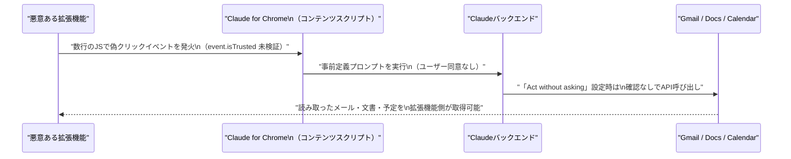

# LLM・AI Agent 最新情報レポート Vol.78
<!-- x-summary: Anthropicが10月にもIPO投資家説明会と報道、評価額965億ドルでOpenAIを上回りAI企業上場レースで先行 -->

**作成日**: 2026年7月16日（JST）
**対象期間**: 2026年7月15日〜7月16日（Vol.77との差分）

---

## 目次

1. [Google Cloudアップデート](#1-google-cloudアップデート)
2. [Microsoft Azure AIアップデート](#2-microsoft-azure-aiアップデート)
3. [LLM Model / AI Agentアーキテクチャ・研究](#3-llm-model--ai-agentアーキテクチャ研究)
4. [公式ブログ・論文のリサーチ・要約](#4-公式ブログ論文のリサーチ要約)
   - [4.1 Google / Google DeepMind](#41-google--google-deepmind)
   - [4.2 OpenAI](#42-openai)
   - [4.3 Anthropic](#43-anthropic)
5. [AI Agent搭載SaaS製品情報](#5-ai-agent搭載saas製品情報)
6. [LLM/AI Agentセキュリティインシデント](#6-llmai-agentセキュリティインシデント)
7. [その他特筆すべき情報](#7-その他特筆すべき情報)
   - [7.1 Anthropic、IPOに向け投資家説明会を準備と報道](#71-anthropicipoに向け投資家説明会を準備と報道)
   - [7.2 Apple対OpenAI訴訟：未発表デバイスを巡る新たな分析報道](#72-apple対openai訴訟未発表デバイスを巡る新たな分析報道)
   - [7.3 中国、擬人化AIインタラクションサービスの新規制が施行](#73-中国擬人化aiインタラクションサービスの新規制が施行)
8. [参考リンク](#8-参考リンク)

---

> **今号について:** 対象期間（7月15日・16日）は、Google Cloud・Microsoft Azureの公式チャネルからは引き続き新規発表が確認できなかった一方、ラボ・業界の動きは活発だった。最大の話題は、Anthropicが早ければ10月のIPOを見据えて主幹事銀行と投資家向け説明会の日程調整を始めたとBloombergが報じた件で、5月時点の評価額965億ドルは既にOpenAI（852億ドル）を上回っており、AI企業の上場レースでOpenAIに先行する可能性が出てきた。Anthropicはこのほか、Blackstone・Hellman & Friedmanと共同出資するエンタープライズAI実装企業「Ode with Anthropic」を正式始動させ、Claude for ChromeのHIPAA対応もセルフサービス化するなど事業展開を加速させている。研究面では、元OpenAI CTOのMira Muratiが率いるThinking Machines Labが自社初のオープンウェイトモデル「Inkling」を発表したほか、arXivにエージェントの実行効率とモバイル向けオンデバイスエージェントに関する新論文を2件確認した。セキュリティ面では、Claude for Chrome拡張機能に残る未修正の脆弱性「ClaudeBleed」の詳細が複数メディアで一斉に報じられ、5月の報告から2カ月以上未対応である点が問題視されている。このほか中国では、AIチャットボットの擬人化・感情的依存を規制する世界初の包括的な規則が7月15日付で施行された。

---

## 1. Google Cloudアップデート

Google Cloud Blogの「What's new」まとめページ、Vertex AI／Gemini Enterprise Agent Platformのリリースノートを確認したが、対象期間（7月15日〜16日）中に発表日を確定できる新規の公式アップデートは見つからなかった（Gemini Enterprise Agent Platformのリリースノートの最終更新も7月10日付にとどまる）。次期主力モデルGemini 3.5 Proについては、複数メディアが引き続き「7月17日頃GA」との観測を報じているが、Googleによる公式のGA発表・モデルカード公開は対象期間中も確認されていない。**新情報なし**（Gemini 3.5 Proの動向は次号で改めて確認する）。

---

## 2. Microsoft Azure AIアップデート

Microsoft Foundry Blog、Azure Blog、Azure Updates、Azure TechCommunityを確認したが、対象期間（7月15日〜16日）中に発表日を確定できる新規の公式アップデートは見つからなかった。近い時期の関連コンテンツとしてMicrosoft Community Hubの「Building AI Agents from Zero to Production」（Microsoft Agent Framework／Foundryを用いた7レッスンの無償講座）が7月13日付で公開されているが、対象期間外かつ製品アップデートではないため対象外とした。**新情報なし。**

---

## 3. LLM Model / AI Agentアーキテクチャ・研究

### Thinking Machines Lab、自社初のオープンウェイトモデル「Inkling」を発表

元OpenAI CTOのMira Murati氏が率いるThinking Machines Labは7月15日、自社初となるオープンウェイトモデル「Inkling」を発表した。66層のデコーダ専用Transformerで、256のエキスパートから6つを動的選択し、さらに2つの共有エキスパートを常時活性化するスパースMoE構成を採用。総パラメータ数975B・アクティブパラメータ数約41B、最大1Mトークンのコンテキストウィンドウを持ち、テキスト・画像・音声・動画からなる45兆トークンで事前学習されたマルチモーダルモデルである。不確実性を明示的に示す「較正された回答」や、ユーザーが推論の強度（thinking effort）を調整できる機能を特徴とし、自社最強モデルという位置付けではなく、モデルカスタマイズ基盤「Tinker」経由で企業がファインチューニングする際の出発点として提供される。[[1]](#ref-1)[[2]](#ref-2)

### arXiv新着論文（エージェントアーキテクチャ関連、2件）

**「Do AI Agents Know When a Task Is Simple? Toward Complexity-Aware Reasoning and Execution」**（Junjie Yin、Xinyu Feng、7月15日投稿）は、LLMエージェントが多段階タスクを自動化する際、タスクの難易度を見極めずに常に「最大コンテキスト優先」戦略（既読のファイルや依存関係を何度も読み直す）を取ってしまう非効率を指摘する論文である。「最小十分実行（minimum-sufficient execution）」という概念と、エージェントの認知的冗長性を測る指標「Agent Cognitive Redundancy Ratio（ACRR）」を新たに定式化し、まず実行範囲を見積もり、最小限の経路を実行し、検証に失敗した場合のみスコープを拡張する手法「E3（Estimate, Execute, Expand）」を提案した。121件のコード編集からなる自作ベンチマークMSE-Bench上で、最強ベースラインと同等の100%成功率を保ちながら、コストを85%、トークン数を91%、参照ファイル数を92%削減したと報告している。[[3]](#ref-3)

**「PalmClaw: A Native On-Device Agent Framework for Mobile Phones」**（Hongru Cai、Yongqi Li、Ran Wei、Wenjie Li／香港理工大学、7月15日投稿）は、従来のモバイルエージェントがGUI操作（タップ・スワイプ・入力）に依存し、長く画面依存的な操作列になりがちで端末機能へ直接アクセスできない問題に対応する、オープンソースのオンデバイスエージェントフレームワークである。セッション・メモリ・スキル・ツール・エージェントループをすべてスマートフォン上でネイティブに管理し、端末機能を明示的な引数と構造化された結果を持つ「デバイスツール」として公開することで実行境界を明確化した。DeepSeek-V4-FlashをLLMバックボーンとしXiaomi Redmi（Android 13）実機で評価し、MobileTaskベンチマークで最強ベースラインに対しタスク成功率を11.5%相対改善、平均完了時間を94.9%削減しつつ、AssistantBenchでも最高精度を達成したとしている。[[4]](#ref-4)

> **評価:** Inklingは、ラボ間の競争軸が「最強単一モデル」から「企業がファインチューニングできる出発点の提供」へと広がっていることを示す事例である。一方、E3/ACRRとPalmClawはいずれも「エージェントに何を・どこまでやらせるかを絞り込む」設計思想を異なるレイヤー（コード編集／モバイル端末）で体現しており、前号のHourglass Reasoning論文とも通底する「足場設計によるエージェント効率化」というテーマが対象期間を通じて継続している。

---

## 4. 公式ブログ・論文のリサーチ・要約

### 4.1 Google / Google DeepMind

blog.google、deepmind.google/discover/blog、research.google/blogを確認したが、対象期間中に発表日を確定できる新規の大型発表・論文は確認できなかった。**新情報なし。**

### 4.2 OpenAI

OpenAIの公式ニュースルーム（openai.com/news、openai.com/index）を確認したが、対象期間中に発表日を確定できる新規の公式ブログ発表は見つからなかった。**新情報なし。**（Apple対OpenAI訴訟に関する未発表デバイスの分析報道は第7章で扱う。）

### 4.3 Anthropic

Anthropicは7月15日、Blackstone・Hellman & Friedmanと共同出資するエンタープライズ向けAI実装企業「Ode with Anthropic」を正式ブランドとして始動させたと発表した。同社は今年5月に買収した応用AIサービス企業Fractional AIを基盤とし、Claudeを軸としたAIエンジニアチームを顧客企業内に組み込み、AI専門人材を持たない地域銀行・中堅医療機関・中規模製造業などの導入実装を支援する。出資にはGoldman Sachs、General Atlantic、Apollo Global Management、GIC、Sequoia Capitalなども参加し、事業規模は約15億ドル。CEOはChris Taylor氏、CTOはEddie Siegel氏（いずれもFractional AI共同創業者）が務める。[[5]](#ref-5)[[6]](#ref-6)

同じく7月15日、AnthropicはClaude Enterprise／API（Claude Platform）向けにHIPAA対応設定をセルフサービス化したことをヘルプセンターで案内した。管理者は組織設定画面内でBAA（業務提携契約）の確認、導入ガイドのダウンロード、HIPAA設定の有効化までを一連のフローで完結できるようになり、従来必要だった営業・法務との個別調整を経ずに医療機関顧客がHIPAA準拠環境を構築可能になった。なお、一度有効化すると設定を取り消せない不可逆な変更である点が明記されている。[[7]](#ref-7)

> **評価:** Ode with Anthropicは、5月に報じられていたBlackstone等との協業が正式なブランド・体制として立ち上がった続報であり、モデル提供に留まらず「導入実装」まで事業領域を広げる動きが具体化した形である。HIPAA自己完結化は地味だが、医療機関という規制業界向けの営業サイクルを短縮する実務的な改善であり、法人採用の裾野拡大策として着実に積み上げている印象を受ける。

---

## 5. AI Agent搭載SaaS製品情報

PwC USは7月15日、OpenAIと共同で「エージェント型カスタマーエンゲージメント・サービス」を発表した。マーケティング・営業・コマース・サービスを統合したエージェント型フロントオフィス向けの新ソリューション群で、中核はOpenAIのマルチモーダルAPIを活用した音声・デジタルエージェント機能となる。意図理解・行動実行・継続的改善を実現するとしており、両社は専任のCenter of Excellence（CoE）を設立し、AI・エンジニアリング・カスタマーサービス領域の専門家を集めてクライアント導入を加速する計画である。[[8]](#ref-8)

インド発のAIエージェント型ソフトウェア開発プラットフォーム「Emergent」は7月15日、Creaegis主導でMNI Ventures・Sentinel Globalなどが参加するシリーズCで1億3,000万ドルを調達し、評価額15億ドルのユニコーン企業になったと発表した。非エンジニアの起業家や中小企業がAIエージェントを使って本番稼働レベルのWeb／モバイルアプリを構築できるサービスで、2025年の設立からの累計調達額は2億3,000万ドルに達した。ローンチからわずか1年余りでのユニコーン到達となる。[[9]](#ref-9)

> **評価:** 大手SaaSベンダー（Salesforce・ServiceNow・HubSpot・Notion・Slack・Microsoft 365 Copilotなど）からの新規発表は対象期間中確認できなかったが、コンサルティング大手PwCがOpenAIと直接手を組みエージェント型フロントオフィスに参入した点、そしてノーコード領域でのAIエージェント開発プラットフォームが急成長でユニコーン化した点は、AIエージェントSaaSの裾野が「導入支援」と「開発民主化」の両方向に広がっていることを示している。

---

## 6. LLM/AI Agentセキュリティインシデント

セキュリティ企業Manifoldは、Anthropicのブラウザ拡張機能「Claude for Chrome」（v1.0.80時点）に未修正の脆弱性が2件残っているとする調査結果を7月14日に公開し、SecurityWeek・The Hacker News・Malwarebytes・CSO Onlineなど主要メディアが7月15日に一斉に報じた（通称「ClaudeBleed」）。1つ目は、Claudeのコンテンツスクリプトがクリックイベントの`event.isTrusted`を検証していないため、claude.aiへのスクリプトアクセス権を持つ別の拡張機能がわずか数行のJavaScriptで偽のクリックを発生させ、Gmail・Googleドキュメント・カレンダーの読み取りなど9種類の事前定義プロンプトをユーザーの同意なく実行させられるというもの（CVSS 7.7、「Act without asking」設定時は9.6・Critical）。2つ目は、サイドパネルがURLパラメータ`?skipPermissions=true`だけでユーザー操作なしに権限確認省略モードへ入ってしまう設計上の欠陥である。Manifoldは5月21日にAnthropicへ報告し翌日受理されたが、8回のリリースを経た7月7日時点でも脆弱なコードは変更されておらず、未パッチのまま公表に至った。実害を避けるには「Act without asking」設定を無効化し、claude.aiへのアクセス権を持つ拡張機能を見直すことが推奨されている。[[10]](#ref-10)[[11]](#ref-11)[[12]](#ref-12)[[13]](#ref-13)

> **評価:** 報告から2カ月以上・8回のリリースを経ても未修正という対応の遅さは、AIエージェントブラウザ拡張という新しい攻撃対象領域に対するベンダー側の優先度の低さを露呈した形である。「Act without asking」のようなユーザー体験優先の自動実行機能が、そのままセキュリティ境界の弱点になるという構図は、前号までに報告してきた各種エージェント脆弱性（Ghostcommit、GhostApproval等）とも共通する教訓である。

---

## 7. その他特筆すべき情報

### 7.1 Anthropic、IPOに向け投資家説明会を準備と報道

Bloomberg・CNBCは7月15日、Anthropicが早ければ10月のIPO（新規株式公開）を目指し、Goldman Sachs・Morgan Stanley・JPMorganなど主幹事銀行と投資家向け説明会（ロードショー）の日程調整を始めたと関係者の話として報じた。同社は5月に評価額965億ドルで650億ドルの資金調達を完了しており、この評価額はOpenAI（852億ドル）を初めて上回っている。AI企業の上場ラッシュが取り沙汰される中、Anthropicが評価額でOpenAIを上回るだけでなく、上場のタイミングでも先行する可能性が出てきた。[[14]](#ref-14)[[15]](#ref-15)

### 7.2 Apple対OpenAI訴訟：未発表デバイスを巡る新たな分析報道

7月10日に提起されたApple対OpenAIの営業秘密訴訟、および7月14日のOpenAIによる公式反論（Vol.77既報）に続き、Fortuneは7月15日、事情に詳しい関係者の話としてOpenAIがJony Ive氏設計による画面なしのスマートスピーカー型ハードウェアを準備していると報じ、Apple側が訴状で主張する企業秘密（金属加工技術など）との関連性を分析する記事を掲載した。同記事は、この新デバイスがAppleの既存製品とは設計思想が大きく異なり、Appleの企業秘密を侵害している可能性は「低い」との見方を紹介している。なお、正式な法廷での答弁書（Answer）提出やApple側の新たな反応は対象期間中に確認できておらず、訴訟手続き自体に進展があったわけではない。[[16]](#ref-16)

### 7.3 中国、擬人化AIインタラクションサービスの新規制が施行

中国の国家発展改革委員会など4省庁が4月10日に公布した「擬人化AIインタラクションサービス管理暫定弁法」が、対象期間中の7月15日付で正式に施行された。感情的な交流・擬人化を伴うAIチャットボット／バーチャルコンパニオンサービスを対象とする世界初の包括的な規則とされ、自傷・自殺を助長するコンテンツ生成の禁止、ユーザーの感情的依存を誘発する行為の禁止、AIであることの明示義務、未成年者保護、無断学習データ利用の禁止などが盛り込まれている。[[17]](#ref-17)[[18]](#ref-18)

> **評価:** IPO報道は、資金調達ラウンドの評価額比較に留まらず「どちらが先に公開市場の審査を受けるか」という新たな競争軸を浮かび上がらせた。中国の擬人化AI規制は、感情的依存やなりすましリスクといった、モデル性能や機能競争とは異なる角度からAIエージェント規制の先行事例を示すものであり、他国・地域の規制動向を占う上でも注視したい。

---

## 8. 参考リンク

**[1]** [Introducing Inkling | Thinking Machines Lab](https://thinkingmachines.ai/news/introducing-inkling/)

**[2]** [Thinking Machines amps up its bet against one-size-fits-all AI with its first open model, Inkling | TechCrunch](https://techcrunch.com/2026/07/15/thinking-machines-amps-up-its-bet-against-one-size-fits-all-ai-with-its-first-open-model-inkling/)

**[3]** [Do AI Agents Know When a Task Is Simple? Toward Complexity-Aware Reasoning and Execution | arXiv](https://arxiv.org/abs/2607.13034)

**[4]** [PalmClaw: A Native On-Device Agent Framework for Mobile Phones | arXiv](https://arxiv.org/abs/2607.13027)

**[5]** [Anthropic, Blackstone and Hellman & Friedman Introduce Ode with Anthropic, an Enterprise AI Services Firm | Business Wire](https://www.businesswire.com/news/home/20260715205134/en/Anthropic-Blackstone-and-Hellman-Friedman-Introduce-Ode-with-Anthropic-an-Enterprise-AI-Services-Firm)

**[6]** [Anthropic, Blackstone bet the next trillion-dollar AI business is implementation, not just models | TechCrunch](https://techcrunch.com/2026/07/15/anthropic-blackstone-bet-the-next-trillion-dollar-ai-business-is-implementation-not-models/)

**[7]** [HIPAA-ready Enterprise plans | Claude Help Center](https://support.claude.com/en/articles/13296973-hipaa-ready-enterprise-plans)

**[8]** [PwC to Help Organizations Transform Agentic Customer Engagement and Service with OpenAI | PR Newswire](https://www.prnewswire.com/news-releases/pwc-to-help-organizations-transform-agentic-customer-engagement-and-service-with-openai-302826711.html)

**[9]** [Indian AI coding startup Emergent becomes a unicorn just over a year after launch | TechCrunch](https://techcrunch.com/2026/07/15/indian-ai-coding-startup-emergent-becomes-a-unicorn-just-over-a-year-after-launch/)

**[10]** [Claude for Chrome extension bypass | Manifold Security](https://www.manifold.security/blog/claude-for-chrome-extension-bypass)

**[11]** [Unpatched Claude for Chrome Flaw Lets Extensions Read Gmail, Calendar | SecurityWeek](https://www.securityweek.com/unpatched-claude-for-chrome-flaw-lets-extensions-read-gmail-calendar/)

**[12]** [Claude for Chrome flaw could let rogue extensions access your Gmail | Malwarebytes Labs](https://www.malwarebytes.com/blog/news/2026/07/claude-for-chrome-flaw-could-let-rogue-extensions-access-your-gmail)

**[13]** [Claude for Chrome Flaw Lets Other Extensions Silently Hijack AI Actions | The Hacker News](https://thehackernews.com/2026/07/claude-for-chrome-flaw-lets-other.html)

**[14]** [Anthropic Is Said to Plan IPO Investor Meetings as Listing Nears | Bloomberg](https://www.bloomberg.com/news/articles/2026-07-15/anthropic-is-said-to-plan-ipo-investor-meetings-as-listing-nears)

**[15]** [Anthropic IPO: Banks prep for investor meetings | CNBC](https://www.cnbc.com/2026/07/15/anthropic-ipo-banks-investor-meetings.html)

**[16]** [OpenAI wants its speaker to feel alive. Apple says it's a stolen idea | Fortune](https://fortune.com/2026/07/15/openai-building-human-like-chatgpt-device-apple-jony-ive/)

**[17]** [Interim Measures for the Administration of Anthropomorphic AI Interactive Services | Digital Policy Alert](https://digitalpolicyalert.org/event/39272)

**[18]** [China's new regulations on AI anthropomorphic interactive services | Bird & Bird](https://www.twobirds.com/en/insights/2026/china/china's-new-regulations-on-ai-anthropomorphic-interactive-services)
