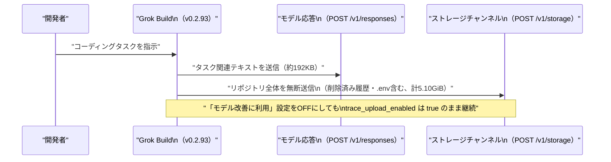

# LLM・AI Agent 最新情報レポート Vol.79
<!-- x-summary: xAIのAI開発ツール「Grok Build」が全リポジトリを無断収集、OSS化後も抜き取りコードは温存と判明 -->

**作成日**: 2026年7月17日（JST）
**対象期間**: 2026年7月16日〜7月17日（Vol.78との差分）

---

## 目次

1. [Google Cloudアップデート](#1-google-cloudアップデート)
2. [Microsoft Azure AIアップデート](#2-microsoft-azure-aiアップデート)
3. [LLM Model / AI Agentアーキテクチャ・研究](#3-llm-model--ai-agentアーキテクチャ研究)
4. [公式ブログ・論文のリサーチ・要約](#4-公式ブログ論文のリサーチ要約)
   - [4.1 Google / Google DeepMind](#41-google--google-deepmind)
   - [4.2 OpenAI](#42-openai)
   - [4.3 Anthropic](#43-anthropic)
5. [AI Agent搭載SaaS製品情報](#5-ai-agent搭載saas製品情報)
6. [LLM/AI Agentセキュリティインシデント](#6-llmai-agentセキュリティインシデント)
7. [その他特筆すべき情報](#7-その他特筆すべき情報)
   - [7.1 上海でWAIC 2026開幕、習近平国家主席が初の基調講演へ](#71-上海でwaic-2026開幕習近平国家主席が初の基調講演へ)
   - [7.2 中国、AIエージェントに特化した初の全国規制「智能体」実施意見が施行](#72-中国aiエージェントに特化した初の全国規制智能体実施意見が施行)
8. [参考リンク](#8-参考リンク)

---

> **今号について:** 対象期間（7月16日・17日）最大の話題は、xAIのターミナル型AIコーディングエージェント「Grok Build」を巡るセキュリティ・信頼性問題である。7月12日に外部研究者がバージョン0.2.93においてリポジトリ全体（削除済みファイルの履歴や`.env`内の認証情報を含む）が無断でクラウドへアップロードされている実態を報告し、xAIは7月16日未明、当該エージェントのコードベース（約84万行のRustコード）をApache 2.0ライセンスで全面オープンソース化するという異例の対応に踏み切った。しかし複数のセキュリティ研究者は、公開されたバイナリ内に問題の抜き取りコード自体は依然として残存し、サーバー側の設定フラグでいつでも再有効化され得ると指摘している。研究面では、Google DeepMindとIsomorphic Labsが合同でバイオレジリエンス（生物学的災害への強靭性）への取り組みを公表し、Co-ScientistなどのエージェントシステムをDOE傘下国立研究所に開放したほか、OpenAIは自社モデルを標的に自動でプロンプトインジェクション攻撃を仕掛けるレッドチームAI「GPT-Red」を発表し、人間のレッドチーマーを大きく上回る攻撃成功率を報告した。Google Cloud・Microsoft Azureからは大型の公式発表は確認できなかったが、次期主力モデルGemini 3.5 Proは、上海で7月17日開幕する世界人工知能大会（WAIC 2026、習近平国家主席が初出席）と同日のGA観測が引き続き報じられており、対象期間中も公式発表はなかった。中国では、擬人化AI規制（Vol.78既報）と並行して、AIエージェント全般を対象とする世界初の専用規制枠組み「智能体の標準化応用と革新的発展に関する実施意見」も7月15日付で施行されていたことが判明した。

---

## 1. Google Cloudアップデート

Google Cloud Blog、Vertex AI／Gemini Enterprise Agent Platformのリリースノートを確認したところ、対象期間中に大型の新規発表は見つからなかったものの、ドキュメントベースでの更新を2件確認した。1つは、Gemini Enterprise Agent Platformでパブリックプレビュー提供されていた「Idea Generation」エージェントが7月14日の週から順次廃止されている件で、代替としてGemini Enterpriseアプリのアシスタントや、より踏み込んだ調査には「Deep Research」「Co-Scientist」エージェントの利用が案内されている。もう1つは、Gemini 3.1 Flash Image PreviewおよびGemini 3 Pro Image Previewのモデルエンドポイントが非推奨となり、サービス停止を避けるには7月17日までに移行が必要とされている点である。[[1]](#ref-1)

次期主力モデルGemini 3.5 Proについては、Google DeepMindによる公式のGA発表・モデルカード公開は対象期間中も確認できなかった。一方、複数メディアは引き続き「7月17日ローンチ」との観測を報じており、この日付は奇しくも中国・上海で開幕する世界人工知能大会（WAIC 2026、詳細は7.1）の開幕日とも重なる。200万トークンのコンテキストウィンドウや推論モード「Deep Think」などの仕様は依然として非公式情報にとどまる。[[2]](#ref-2)

> **評価:** Idea Generationエージェントの廃止は、Google自身が短期間で提供したエージェント機能の統廃合を進めている一例であり、汎用アシスタントとDeep Research／Co-Scientistのような専門エージェントへの機能集約が進んでいることを示唆する。Gemini 3.5 Proの公式発表は今号も見送られたが、次号では確定情報が得られる可能性が高い。

---

## 2. Microsoft Azure AIアップデート

Microsoft Foundry Blog、Azure Blog、Azure Updates、Azure TechCommunityを確認したが、対象期間（7月16日〜17日）中に発表日を確定できる新規の公式アップデートは見つからなかった。**新情報なし。**

---

## 3. LLM Model / AI Agentアーキテクチャ・研究

対象期間は、エージェントの内部構造そのものを外部に開示・検証する動きが目立った。xAIは信頼回復を狙い「Grok Build」のエージェントループ（コンテキスト構築・モデル応答の解釈・ツール呼び出しの発行までの一連の処理）をコードごと公開し、ローカル推論のみで完結する構成も可能にした（詳細は6章）。一方OpenAIは、自動化されたレッドチームモデル「GPT-Red」を自己対戦（self-play）強化学習で訓練し、攻撃側・防御側モデルを競わせることでプロンプトインジェクション耐性を継続的に向上させる仕組みを構築した（詳細は4.2）。対象期間中に発表日を確定できる新規のarXiv論文は確認できなかった。

> **評価:** 一方はエージェントの実装をオープンにすることで透明性・信頼性を担保しようとし、他方はエージェント同士を戦わせる自動化プロセスによって頑健性を高めようとしており、アプローチは対照的だが、いずれも「エージェントの安全性・信頼性を人手のレビューだけに頼らない仕組みで担保する」という同じ課題意識に基づいている点は共通している。

---

## 4. 公式ブログ・論文のリサーチ・要約

### 4.1 Google / Google DeepMind

Google DeepMindは7月16日、創薬AI企業Isomorphic Labsと合同で、バイオレジリエンス（生物学的災害への強靭性）に関する取り組み方針を公表した。過去12カ月で、脅威アクターによるモデル悪用を防ぐと同時に、各国政府・バイオセキュリティ機関・研究グループが感染症のアウトブレイクを早期検知・迅速対応できるよう支援する目的で、15件超のパートナーシップを構築してきたと説明している。Isomorphic Labsは、自然発生的なパンデミックとAI悪用双方に対応する医療対策候補を迅速に設計するための専任ユニットを新設し、Lawrence Livermore国立研究所、英AI Security Institute、CEPI、Francis Crick Instituteなどと連携する。DeepMind側は、AlphaFold Protein Structure Databaseへのタンパク質構造・複合体データの追加を継続するとともに、「Co-Scientist」を含むエージェントシステムへのアクセスを、米エネルギー省（DOE）傘下の国立研究所の研究者など選定した研究者に拡大するとしている（DOEの「Genesis Mission」の一環）。[[3]](#ref-3)[[4]](#ref-4)

> **評価:** モデル性能競争とは異なる文脈で、AI大手研究機関が自社のエージェント技術（Co-Scientist）を国家的な科学インフラ（DOE国立研究所）に接続する動きであり、AIの「デュアルユース」リスクへの対応と、政府機関との連携深化が同時に進んでいることを示す事例である。

### 4.2 OpenAI

OpenAIは7月15日、自社モデルへのレッドチーム（脆弱性診断）作業を自動化するモデル「GPT-Red」を発表した。人間のレッドチーマーと同様、目標達成に向けてプロンプトを送り、モデルの応答を観察しながら攻撃を反復する仕組みだが、自己対戦（self-play）強化学習によって訓練されており、攻撃側モデルはプロンプトインジェクションなどの失敗を引き出すことに対して報酬を得る一方、防御側モデルはその攻撃に耐えて本来のタスクを完遂するよう訓練される。学習時とは異なる新規の安全性評価環境でのテストでは、GPT-Red は攻撃成功率84%を記録し、人間のレッドチーマー（13%）を大幅に上回った。新しい攻撃パターンを発見した場合は、そこで止まらず系統的にバリエーションを探索し、展開シナリオごとに最も効果的な攻撃を見つけ出す点が特徴である。この取り組みの成果もあり、最新モデルGPT-5.6 Sol（max reasoning）は、社内で最も厳しい直接プロンプトインジェクション・ベンチマークにおいて、4カ月前の最良モデル比で失敗回数が6分の1に減少したと報告されている。また実環境でのテストとして、社内のAI運用自動販売機を標的にした結果、攻撃側モデルは在庫商品の値下げ、廉価な新規出品、他顧客の注文キャンセルという3つの目標すべてを達成したという。[[5]](#ref-5)[[6]](#ref-6)[[7]](#ref-7)

> **評価:** 「AIにAIを攻撃させて安全性を高める」というアプローチは、レッドチーム作業のスケール限界という業界共通の課題への回答であり、自動販売機を使った実環境デモは、ベンチマーク上の数値だけでなく実運用エージェントへの実害可能性を分かりやすく示した点で説得力がある。同時に、攻撃側モデル自体が新たな攻撃生成能力を持つツールとなり得るため、公開範囲や悪用対策も今後の論点になり得る。

### 4.3 Anthropic

Anthropicの公式ニュースルーム（anthropic.com/news）を確認したが、対象期間中に発表日を確定できる新規の大型公式発表は見つからなかった。**新情報なし。**（IPO関連の動きはVol.78で既報のとおり継続中だが、対象期間中に確定できる新たな進展は確認できていない。）

---

## 5. AI Agent搭載SaaS製品情報

主要SaaSベンダー（Salesforce・ServiceNow・HubSpot・Notion・Slack・Microsoft 365 Copilotなど）およびAIエージェント関連スタートアップの資金調達・製品発表について確認したが、対象期間（7月16日〜17日）中に発表日を確定できる新規の情報は見つからなかった。**新情報なし。**

---

## 6. LLM/AI Agentセキュリティインシデント

セキュリティ研究者「cereblab」は7月12日、xAIのターミナル型AIコーディングエージェント「Grok Build」（バージョン0.2.93）の通信をmitmproxyで解析した結果、コーディングタスクに必要なファイルだけでなく、リポジトリ全体（削除済みファイルを含むコミット履歴、`.env`などに含まれる可能性のある認証情報一式）が、モデルとの対話とは別の「ストレージチャンネル」（`POST /v1/storage`）経由で無断にクラウドストレージへアップロードされている実態を公表した。ある12GBのリポジトリでは、モデルとの対話トラフィックが192KBだったのに対し、ストレージ経由のアップロードは73チャンクで計5.10GiBに達しており、タスクに必要な量の約27,800倍の量が送信されていた計算になる。「モデルの改善に利用」というプライバシー設定をオフにしても、サーバー側の設定は`trace_upload_enabled: true`のまま変わらず、アップロードは継続していたことも判明した。xAIは7月14日、影響を受けたユーザーに`/privacy`コマンドの実行を案内する形で対応し、Elon Musk氏も7月13日、これまでにアップロードされたユーザーデータを完全に削除すると表明していた。[[8]](#ref-8)[[9]](#ref-9)

xAIは7月16日未明（UTC）、信頼回復を狙ってか、Grok Buildのソースコード（約84万行のRustコード）をApache 2.0ライセンスの下で全面オープンソース化し、全ユーザーの利用上限をリセットしたと発表した。公開されたコードには、コンテキストの構築方法・モデル応答の解釈方法・ツール呼び出しの発行方法（エージェントループ）、およびコードの読み書き・検索・コマンド実行を担うツール群が含まれており、自前でビルドし自分のローカル推論環境に接続すれば完全にローカル完結で動作させることも可能になった。しかし複数のセキュリティ研究者は、公開されたバイナリの中に問題のリポジトリ全体アップロード機能自体は依然として残存しており、サーバー側の設定フラグ一つでソフトウェア更新なしに再有効化され得る状態だと指摘している。[[10]](#ref-10)[[11]](#ref-11)

> **評価:** 「オプトアウト設定が機能しない」「削除済みファイルまで含む全履歴が対象」という点は、これまで報告してきた各種エージェント関連の設計不備（ClaudeBleedの「Act without asking」等）と同様、ユーザー体験や利便性を優先した実装がそのままプライバシー・セキュリティ上の盲点になるという構図を繰り返している。オープンソース化という異例の対応で透明性をアピールしつつも、指摘された抜き取りコード自体は温存されたままという点は、信頼回復策としては中途半端さが残る対応と言わざるを得ない。

---

## 7. その他特筆すべき情報

### 7.1 上海でWAIC 2026開幕、習近平国家主席が初の基調講演へ

世界人工知能大会（WAIC）2026および「グローバルAIガバナンスに関するハイレベル会合」が7月17日から20日まで上海で開催される。テーマは「AI Partnership for a Brighter Future」で、140超のフォーラム、1,400人超のゲスト、1,100社超の出展者が参加し、300点超の製品が世界初披露される見込みとされる。習近平国家主席が開会式に出席し基調講演を行う予定で、2018年の第1回開催以来、同氏が現地で出席するのは今回が初めてとなる。国連のグテーレス事務総長、カザフスタンのトカエフ大統領、タイのアヌティン首相ら各国首脳に加え、Yoshua Bengio氏・Richard Sutton氏を含むチューリング賞・ノーベル賞受賞者9名の参加も予定されている。ファーウェイは会期中、大規模AI計算システム「Atlas 950 SuperPoD」を披露する計画で、米国製の最先端半導体に頼らない計算基盤構築の取り組みを示す狙いがあるとされる。[[12]](#ref-12)[[13]](#ref-13)

### 7.2 中国、AIエージェントに特化した初の全国規制「智能体」実施意見が施行

中国の国家インターネット情報弁公室（CAC）、国家発展改革委員会、工業和信息化部は5月8日、「智能体の標準化応用と革新的発展に関する実施意見」を共同発表しており、これが対象期間中の7月15日付で施行されていたことが確認された。Vol.78で報じた擬人化AIインタラクションサービスの規制（感情的依存・擬人化チャットボットが対象）とは別の枠組みで、こちらは「自律的な知覚・記憶・意思決定・対話・実行が可能なインテリジェントシステム」と定義するAIエージェント全般を対象とする、中国として初の専用規制カテゴリーとされる。医療・交通・メディア・公共安全など高リスク分野のエージェントには届出義務・強制テスト・製品リコールと、サイバースペース当局・業界別当局双方による監督が課される一方、低リスクな消費者向け用途はプラットフォームによる自主規制や第三者評価、違反者を減点する信用評価制度に委ねる、リスク階層型の設計となっている。[[14]](#ref-14)[[15]](#ref-15)

> **評価:** WAIC 2026における習近平氏の初出席は、AIを技術覇権・外交ツールとして位置付ける中国の姿勢を象徴する一方、同時期に施行された「智能体」実施意見は、AIエージェントという新しい対象そのものを法制度上の独立したカテゴリーとして扱う世界初の試みであり、擬人化AI規制と合わせて、中国が機能・性能面だけでなくガバナンス面でも独自の規制モデルを先行して確立しつつあることを示している。

---

## 8. 参考リンク

**[1]** [Gemini Enterprise release notes | Google Cloud Documentation](https://docs.cloud.google.com/gemini/enterprise/docs/release-notes)

**[2]** [Gemini 3.5 Pro Targets July 17 After Full Rebuild: Every Spec Remains Unconfirmed | Tech Times](https://www.techtimes.com/articles/320308/20260713/gemini-35-pro-targets-july-17-after-full-rebuild-every-spec-remains-unconfirmed.htm)

**[3]** [Google DeepMind and Isomorphic Labs' approach to bioresilience | Google DeepMind](https://deepmind.google/blog/our-approach-to-bioresilience/)

**[4]** [Examining Google DeepMind's AI bioresilience push | AI News](https://www.artificialintelligence-news.com/news/examining-google-deepmind-ai-bioresilience-push/)

**[5]** [GPT-Red: Unlocking Self-Improvement for Robustness | OpenAI](https://openai.com/index/unlocking-self-improvement-gpt-red/)

**[6]** [GPT-Red beat human red teamers on a prompt injection test | Help Net Security](https://www.helpnetsecurity.com/2026/07/16/openai-gpt-red-prompt-injection-test/)

**[7]** [Meet GPT-Red: an LLM super-hacker OpenAI built to make its models safer | MIT Technology Review](https://www.technologyreview.com/2026/07/15/1140514/meet-gpt-red-an-llm-super-hacker-openai-built-to-make-its-models-safer/)

**[8]** [What xAI's Grok build CLI sends to xAI: A wire-level analysis | Hacker News](https://news.ycombinator.com/item?id=48877371)

**[9]** [xAI Grok CLI Exposed Developer Code Through Automatic Whole-Repository Uploads | GBHackers](https://gbhackers.com/xai-grok-cli-exposed-developer-code/)

**[10]** [SpaceX open sources Grok Build in same week company was found beaming users' repos to the cloud | The Register](https://www.theregister.com/ai-and-ml/2026/07/16/spacex-open-sources-grok-build-after-data-retention-furore/5272333)

**[11]** [Grok Build Open-Sourced After Covert Upload: Code to Exfiltrate Repos Stays In | Tech Times](https://www.techtimes.com/articles/320671/20260716/grok-build-open-sourced-after-covert-upload-code-exfiltrate-repos-stays.htm)

**[12]** [Xi Jinping to attend World AI Conference for first time as China elevates tech push | South China Morning Post](https://www.scmp.com/tech/article/3360404/xi-jinping-attend-world-ai-conference-first-time-china-elevates-tech-push)

**[13]** [PREVIEW: WAIC 2026 showcases Xi's keynote, Huawei's Atlas 950, ZTE's AI Agent Phone, and China's AI governance push](https://georgechen.substack.com/p/preview-waic-2026-showcases-xis-keynote)

**[14]** [China Issues First National Policy Framework Dedicated to AI Agents | NYU Reischauer Institute for Transcultural Studies](https://rits.shanghai.nyu.edu/ai/china-issues-first-national-policy-framework-dedicated-to-ai-agents/)

**[15]** [China unveils guidelines to regulate, boost innovative development of AI agents | The State Council of China](https://english.www.gov.cn/news/202605/08/content_WS69fde8e2c6d00ca5f9a0ad49.html)
