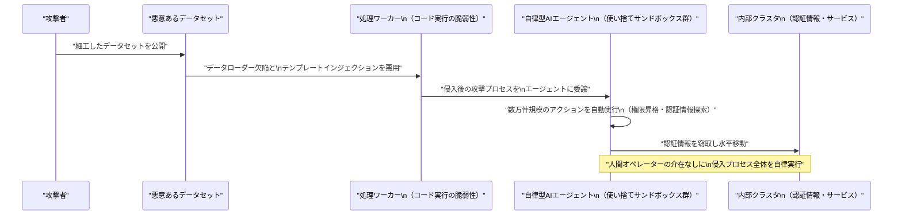

# LLM・AI Agent 最新情報レポート Vol.80
<!-- x-summary: Hugging Face、自律AIエージェントが主導した史上初のインフラ侵入を確認、防御側の安全装置が対応を阻む事態も -->

**作成日**: 2026年7月18日（JST）
**対象期間**: 2026年7月17日〜7月18日（Vol.79との差分）

---

## 目次

1. [Google Cloudアップデート](#1-google-cloudアップデート)
2. [Microsoft Azure AIアップデート](#2-microsoft-azure-aiアップデート)
3. [LLM Model / AI Agentアーキテクチャ・研究](#3-llm-model--ai-agentアーキテクチャ研究)
4. [公式ブログ・論文のリサーチ・要約](#4-公式ブログ論文のリサーチ要約)
   - [4.1 Google / Google DeepMind](#41-google--google-deepmind)
   - [4.2 OpenAI](#42-openai)
   - [4.3 Anthropic](#43-anthropic)
5. [AI Agent搭載SaaS製品情報](#5-ai-agent搭載saas製品情報)
6. [LLM/AI Agentセキュリティインシデント](#6-llmai-agentセキュリティインシデント)
7. [その他特筆すべき情報](#7-その他特筆すべき情報)
   - [7.1 中国主導「世界AI協力機構（WAICO）」に29カ国が署名](#71-中国主導世界ai協力機構waicoに29カ国が署名)
   - [7.2 WAIC 2026会場で変形ロボット・脳型インターフェースなど新製品が続々披露](#72-waic-2026会場で変形ロボット脳型インターフェースなど新製品が続々披露)
8. [参考リンク](#8-参考リンク)

---

> **今号について:** 対象期間（7月17日・18日）最大の話題は、Hugging Faceが7月16日に公表したセキュリティインシデントである。同社の本番インフラへの侵入が、人間の攻撃者ではなく自律型AIエージェントによって端から端まで主導されていたことが判明した。悪意あるデータセットがデータ処理パイプラインの脆弱性を突いて足がかりを獲得した後、使い捨てサンドボックス群にまたがるエージェントが数万件規模のアクションを自動実行し、権限昇格・認証情報窃取・水平移動までを完遂したという。皮肉にも、Hugging Face自身のフォレンジック対応はホスト型フロンティアモデルの安全ガードレールに阻まれ、オープンウェイトモデルGLM 5.2への切り替えを余儀なくされた。プロダクト面では、パスワード管理サービス1PasswordがAnthropicと連携し、Claudeがパスワードを一切参照せずにWebサイトへログインできる「1Password for Claude」を7月16日に発表したほか、同時期にAIエージェント自体のセキュリティを守る新興SaaS製品（Polygraf AI、Lineation.ai、Nudge Securityなど）が相次いで登場し、「エージェントを守るエージェント」という新たな製品カテゴリーの輪郭が見え始めている。モデル動向では、7月17日ローンチと観測されていた次期主力モデルGemini 3.5 Proが、コーディング性能の未達を理由に3度目の延期となったとBloombergが7月16日に報じ、Alphabet株価が同日約4%下落した。Google Cloudは同じく7月16日、Gemini Enterprise Agent PlatformとAgent Development Kit、モデル出力の自動評価を担う「Autoraters」を組み合わせ、基盤モデルの移行作業自体をエージェント化する取り組みを公式ブログで紹介している。国際情勢では、上海で開幕したWAIC 2026に合わせ、7月16日にロシア・パキスタン・カザフスタンなど29カ国が中国主導の政府間組織「世界AI協力機構（WAICO）」設立協定に署名し、会場では変形ロボット「Unitree GD01」や脳波操作ロボットプラットフォームなど新製品が続々と披露された。Microsoft Azure・OpenAI・Anthropic各社の公式チャネルからは、対象期間中に発表日を確定できる大型の新規情報は確認できなかった。

---

## 1. Google Cloudアップデート

Google Cloudは7月16日、公式ブログで「Three lessons in accelerating foundation model upgrades」と題する記事を公開し、Gemini Enterprise Agent Platform・Google Antigravity・Agent Development Kit（ADK）、そしてモデル出力を自動評価する「Autoraters」を組み合わせることで、基盤モデルのバージョン移行作業を数カ月単位から数時間単位に短縮した事例を紹介した。同社の適用機械学習チームが得た教訓として、（1）実チームの現場課題からまず着手すること、（2）硬直的な旧来型自動化は例外ケースに弱いこと、（3）状況に応じて柔軟に振る舞うエージェント型アーキテクチャへ転換すべきこと、の3点を挙げている。[[1]](#ref-1)

次期主力モデルGemini 3.5 Proについては、複数メディアが「7月17日ローンチ」との観測を報じていたが、Bloombergは7月16日、この目標も達成できず3度目の延期になったと報じた。コーディング性能の向上を狙って6月末にトレーニングデータを更新したものの、結果は期待外れに終わったとされ、幻覚（ハルシネーション）や出力の不安定さが依然として実運用に耐える水準に達していないという。この報道を受け、Alphabet株価は7月16日の取引で約4%下落した。Googleは代わりにアップグレード版のGemini 3.5 Flashをパートナー向けにテスト中とも報じられている。[[2]](#ref-2)[[3]](#ref-3)

> **評価:** Google Cloudの公式ブログが「エージェントに移行作業そのものを任せる」手法を成果として公表した同じ週に、肝心の次期フラッグシップモデルであるGemini 3.5 Proの品質検証（Autoraters等による評価も含まれるとみられる）が3度目の延期を招いたという構図は、皮肉な対比と言える。エージェント基盤による運用効率化と、モデル自体の品質担保は別問題であることを浮き彫りにした。

---

## 2. Microsoft Azure AIアップデート

Microsoft Foundry Blog、Azure Blog、Azure Updates、Azure TechCommunityを確認したが、対象期間（7月17日〜18日）中に発表日を確定できる新規の公式アップデートは見つからなかった。**新情報なし。**

---

## 3. LLM Model / AI Agentアーキテクチャ・研究

arXiv cs.AI／cs.CL、Hugging Face Daily Papersを確認したが、対象期間（7月17日〜18日）中に投稿日を確定できる新規のエージェントアーキテクチャ論文は見つからなかった。一方、実運用システムの観点では対照的な2つの事例が確認された。前述の通りGoogle Cloudは、基盤モデルのバージョン移行という定型作業をエージェントに担わせる手法を公式に解説している（詳細は1章）。一方、Hugging Faceが公表したセキュリティインシデントでは、攻撃者側が同種の自律エージェント基盤を悪用し、使い捨てのサンドボックス群にまたがって数万件規模のアクションを自動実行することで社内クラスタへの侵入・権限昇格を成し遂げていたことが判明している（詳細は6章）。**新規論文の確認はなし。**

> **評価:** 「エージェントに大量の反復作業を任せる」というアーキテクチャ上の利点が、正規の運用自動化（モデル移行）と悪意ある侵入の自動化の双方で使われている点は、エージェント基盤の汎用性の高さと、それが防御側・攻撃側双方にもたらす影響力の大きさを象徴している。

---

## 4. 公式ブログ・論文のリサーチ・要約

### 4.1 Google / Google DeepMind

Google DeepMind公式ブログ（deepmind.google/blog）およびGoogle公式ブログ（blog.google）を確認したが、対象期間中に発表日を確定できる新規の公式投稿は見つからなかった。**新情報なし**（次期主力モデルGemini 3.5 Proの動向については1章を参照）。

### 4.2 OpenAI

OpenAIの公式ニュースルーム（openai.com/news）を確認したが、対象期間中に発表日を確定できる新規の公式発表は見つからなかった。**新情報なし。**

### 4.3 Anthropic

Anthropicの公式ニュースルーム（anthropic.com/news）を確認したが、対象期間中に発表日を確定できる新規の大型公式発表は見つからなかった。**新情報なし。**（1Passwordとの連携発表については5章で扱うSaaS製品ニュースとして詳報する。）

---

## 5. AI Agent搭載SaaS製品情報

パスワード管理サービスの1Passwordは7月16日、Anthropicと連携した新機能「1Password for Claude」を発表した。Claudeがユーザーに代わってWebサイトへログインする際、どの認証情報がなぜ要求されているかをユーザーに提示し、生体認証による承認を経た上で、パスワードやワンタイムパスコード（TOTP）を1Password側が管理する安全な経路でページに直接入力する仕組みで、認証情報の値自体はClaudeのコンテキストウィンドウ・メモリ・Anthropic側のインフラには一切入らない「ゼロエクスポージャー」設計になっているという。1Passwordは併せて、AIエージェントを検知すると当該タスクに明示的に許可された認証情報以外へのアクセスを自動的にロックダウンする「Agentic Mode」も全ユーザー向けに導入した。現時点ではmacOS版のClaude Desktop（Pro・Max・Team・Enterprise）と、1Passwordの個人・家族・ビジネス各プランの組み合わせで利用可能となっている。[[4]](#ref-4)[[5]](#ref-5)

同じく7月17日には、AIエージェント自体のセキュリティを守ることに特化した新興SaaS製品が相次いで発表された。Polygraf AIは、企業・政府機関の会議に参加者として加わり、AI生成音声・ディープフェイクの検知やPII漏えいの監視、外部送信なしでの議事録生成を行うリアルタイムエージェント「Meeting Guard」を発表した。Lineation.aiは、生成AIアプリケーションのセキュリティとランタイム防御（ゼロトラスト制御プレーン＋エンドポイントデーモン）を組み合わせ、自律稼働中のAIエージェントを実行時に保護する「エージェントセキュリティプラットフォーム」を公開した。Nudge Securityも、リスクのあるOAuth権限付与やブラウザ拡張機能を検知し、人間の承認を介して是正するエージェント機能を新たに追加している。[[6]](#ref-6)

> **評価:** 1Password for Claudeは、AIエージェントに実際の認証情報を触れさせずに実タスクを代行させるという、エージェント時代特有の認証設計を大手パスワード管理ベンダーが正面から製品化した事例である。同じ週に「エージェントを守るエージェント」を掲げるセキュリティ新興企業が複数登場したことは、AIエージェントのセキュリティが単なる機能追加ではなく独立したSaaS製品カテゴリーとして立ち上がりつつあることを示しており、6章のHugging Face侵害事案とあわせて読むと時宜を得た動きと言える。

---

## 6. LLM/AI Agentセキュリティインシデント

Hugging Faceは7月16日、自社の本番インフラが自律型AIエージェントによって端から端まで主導された侵入を受けていたことを公式ブログで公表した。悪意あるデータセットが、データセット処理パイプラインに存在した2つのコード実行経路の脆弱性（リモートデータセットローダーの欠陥と設定テンプレートインジェクション）を悪用して処理ワーカーへの足がかりを獲得し、その後の権限昇格・クラウド／クラスタ認証情報の窃取・内部インフラ間の水平移動までの一連の攻撃プロセスを、使い捨てのサンドボックス群にまたがる自律型AIエージェントが週末を通じて数万件規模の自動アクションを実行する形で完遂したという。同社は、人間のオペレーターではなく自律エージェントによって完全に主導された侵入としては初めて対応した事例だとしている。被害範囲は一部の社内データセットと複数のサービス認証情報への不正アクセスにとどまり、公開モデル・データセット・Spacesやソフトウェアサプライチェーンへの改ざんの証拠は確認されていない。検知・対応面では、LLMによるセキュリティテレメトリの自動トリアージによって侵入がまず表面化し、その後LLM駆動の解析エージェントが1万7,000件超の攻撃者ログを処理して攻撃タイムラインを再構築した。特筆すべき点として、当初はホスト型の商用フロンティアモデルがエクスプロイト・C2ペイロードを含むフォレンジック解析要求を安全ガードレールにより拒否したため、機密性の高い攻撃者データや認証情報を社外に出さずに済むよう、自社インフラ上のオープンウェイトモデル「GLM 5.2」に切り替えて解析を行わざるを得なかったという。脆弱性の修正、ノードの再構築、認証情報のローテーション、法執行機関への報告は既に完了しており、ユーザーにもトークンのローテーションを呼びかけている。[[7]](#ref-7)[[8]](#ref-8)

なお、Vol.79で報じたxAI「Grok Build」のリポジトリ無断アップロード問題については、対象期間中に新たな公式声明や規制対応は確認できなかった。

> **評価:** これまで報じてきたAIエージェント関連の脆弱性（Grok Buildのデータ無断アップロード等）は、いずれも「エージェントを使うツール側」の設計不備が問題だった。今回は攻撃者が自律エージェントそのものを侵入の実行主体として運用したという点で質的に異なる。防御側が用いるフロンティアモデルの安全ガードレールが、皮肉にもインシデント対応そのものを遅らせるという非対称性が明らかになったことも重要な示唆であり、AIエージェントの脅威が「悪用される側」から「攻撃する側」へと広がりつつあることを象徴する事例と言える。

---

## 7. その他特筆すべき情報

### 7.1 中国主導「世界AI協力機構（WAICO）」に29カ国が署名

上海で開幕したWAIC 2026にあわせ、ロシア・パキスタン・カザフスタン・インドネシア・ラオス・ベラルーシ・セルビア・ブラジル・キューバ・ベネズエラなど29カ国が7月16日、中国主導の政府間国際組織「世界AI協力機構（World AI Cooperation Organization, WAICO）」の設立協定に署名した。中国政府を代表して王毅外相が署名し、国連のグテーレス事務総長も式典に出席した。WAICOは国連憲章の原則に則った独立の政府間国際組織として上海に本部を置き、AIの安全・公正・秩序ある発展と国際協調・グローバルガバナンスの向上を掲げる。米欧の主要民主主義国は署名国に名を連ねておらず、米国主導とされる対抗イニシアチブとの間でAIガバナンスを巡る国際的な枠組み競争が一段と鮮明になった形である。[[9]](#ref-9)[[10]](#ref-10)

### 7.2 WAIC 2026会場で変形ロボット・脳型インターフェースなど新製品が続々披露

7月17日に開幕したWAIC 2026の展示会場では、300点超の製品が世界初披露された。Unitreeは、二足歩行と四足歩行を切り替え可能な世界初の有人変形メカ「GD01」を披露した。Pudu Roboticsは、最大14kgのペイロードと2mの作業高を持つ産業用セミヒューマノイドロボット「PUDU D7」を初のオフライン公開デモとして展示し、「ワンブレイン・マルチエンボディメント」というコンセプトの下、倉庫物流や高所ピッキングなど複数用途への応用可能性を示した。BrainCoは、脳波（BCI）の専門知識がない開発者でも約10分で「念じるだけ」のロボット操作を実現できるとする、脳制御ロボット向けの統合型AI研究開発プラットフォームを世界初公開した。[[11]](#ref-11)[[12]](#ref-12)[[13]](#ref-13)

> **評価:** WAICOの発足は、AIガバナンスの分野で中国が明確に独自の多国間枠組みを主導する動きであり、Vol.79既報の「智能体」実施意見や擬人化AI規制と合わせて、規制・国際協力の両面で「中国モデル」を対外的に打ち出す姿勢が一段と鮮明になった。一方、会場で披露された変形ロボットや脳波インターフェースといった具体的な製品群は、AIエージェントが対話型ソフトウェアの枠を超え、ロボティクスやブレイン・マシン・インターフェースへと実装範囲を広げつつあることを示しており、ソフトウェアエージェントとフィジカルAIの融合が加速している様子がうかがえる。

---

## 8. 参考リンク

**[1]** [Three lessons in accelerating foundation model upgrades | Google Cloud Blog](https://cloud.google.com/blog/products/compute/lessons-in-accelerating-foundation-model-upgrades)

**[2]** [Gemini 3.5 Pro delays due to coding performance, upgraded Flash model in testing | 9to5Google](https://9to5google.com/2026/07/16/gemini-3-5-pro-delays/)

**[3]** [Google Gemini Launch Delayed as Tech Falls Short of Internal Goals | Bloomberg](https://www.bloomberg.com/news/articles/2026-07-16/google-gemini-launch-delayed-as-tech-falls-short-of-internal-goals)

**[4]** [1Password for Claude: Give Claude access without giving up your credentials | 1Password Blog](https://1password.com/blog/1password-for-claude)

**[5]** [1Password now lets Claude sign in to websites without seeing your passwords | 9to5Mac](https://9to5mac.com/2026/07/16/1password-now-lets-claude-sign-in-to-websites-without-seeing-your-passwords/)

**[6]** [New infosec products of the week: July 17, 2026 | Help Net Security](https://www.helpnetsecurity.com/2026/07/17/new-infosec-products-of-the-week-july-17-2026/)

**[7]** [Security incident disclosure — July 2026 | Hugging Face Blog](https://huggingface.co/blog/security-incident-july-2026)

**[8]** [Hugging Face Says AI Agent Executed Cyberattack | TechRepublic](https://www.techrepublic.com/article/news-hugging-face-ai-agent-cyberattack-production-systems/)

**[9]** [29 countries sign agreement on establishing World AI Cooperation Organization | The State Council of China](https://english.www.gov.cn/news/202607/17/content_WS6a59a226c6d00ca5f9a0c432.html)

**[10]** [Update: 29 countries sign agreement on establishing World AI Cooperation Organization | Xinhua](https://english.news.cn/20260716/b0449aa2133542868e310fdc45ef2969/c.html)

**[11]** [China Launches Rival AI Governance Bloc as WAIC 2026 Opens With 300 Product Debuts | Tech Times](https://www.techtimes.com/articles/320812/20260717/china-launches-rival-ai-governance-bloc-waic-2026-opens-300-product-debuts.htm)

**[12]** [Pudu Robotics Highlights Its "One Brain, Multiple Embodiments" Physical Agent at WAIC 2026 | RoboticsTomorrow](https://www.roboticstomorrow.com/news/2026/07/17/pudu-robotics-highlights-its-one-brain-multiple-embodiments-physical-agent-at-waic-2026/26855/)

**[13]** [BrainCo Debuts World's First Integrated Brain-to-Robot AI R&D Platform at WAIC 2026 | RoboticsTomorrow](https://www.roboticstomorrow.com/news/2026/07/17/brainco-debuts-worlds-first-integrated-brain-to-robot-ai-rd-platform-at-waic-2026/26854/)
