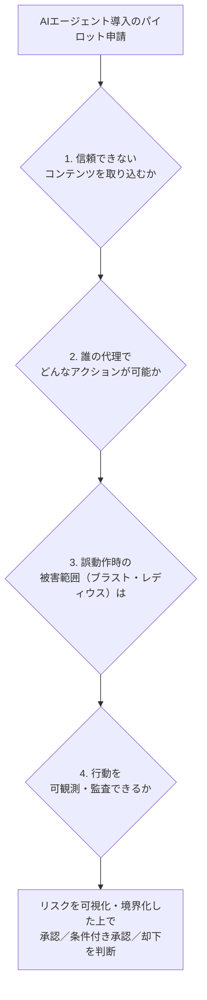

# LLM・AI Agent 最新情報レポート Vol.81
<!-- x-summary: AnthropicのCISOが「ゼロリスクが目標ではない」とAIエージェント導入時の4つの問いを公式提示 -->

**作成日**: 2026年7月19日（JST）
**対象期間**: 2026年7月18日〜7月19日（Vol.80との差分）

---

## 目次

1. [Google Cloudアップデート](#1-google-cloudアップデート)
2. [Microsoft Azure AIアップデート](#2-microsoft-azure-aiアップデート)
3. [LLM Model / AI Agentアーキテクチャ・研究](#3-llm-model--ai-agentアーキテクチャ研究)
4. [公式ブログ・論文のリサーチ・要約](#4-公式ブログ論文のリサーチ要約)
   - [4.1 Google / Google DeepMind](#41-google--google-deepmind)
   - [4.2 OpenAI](#42-openai)
   - [4.3 Anthropic](#43-anthropic)
5. [AI Agent搭載SaaS製品情報](#5-ai-agent搭載saas製品情報)
6. [LLM/AI Agentセキュリティインシデント](#6-llmai-agentセキュリティインシデント)
7. [その他特筆すべき情報](#7-その他特筆すべき情報)
   - [7.1 WAIC 2026、AGIBOTが人型ロボット4機種を一挙発表](#71-waic-2026agibotが人型ロボット4機種を一挙発表)
   - [7.2 KEENON Robotics、人型＋専用サービスロボットの併用戦略を披露](#72-keenon-roboticsが人型専用サービスロボットの併用戦略を披露)
8. [参考リンク](#8-参考リンク)

---

> **今号について:** 対象期間（7月18日・19日）は、Google Cloud・Azureともに発表日を確定できる新規の公式アップデートがなく、arXiv・Hugging Face Daily Papersにも該当日付の新規エージェントアーキテクチャ論文は見当たらなかった。一方、Anthropicは7月17日、同社Deputy CISOのJason Clinton氏名義で「ゼロリスクは目標ではない」と題するAIエージェント導入のリスク評価ガイドを公式ブログで公開した。取り込むコンテンツの信頼性・実行可能なアクションの範囲・誤動作時の被害範囲・可観測性という4つの問いを軸に、リスクを「可視化し、境界を定める」ことを目指す実務的な枠組みを提示しており、Vol.80で報じたHugging Faceの自律エージェント主導インフラ侵入事案を踏まえると時宜を得た内容と言える。SaaS動向では、コンタクトセンター大手transcosmosがCXプラットフォームにAIエージェント機能を追加した「trans-DX Plus for Support」を、決済インフラのStrivveがAIショッピングエージェント向けに自社カードを既定の決済手段とする仕組みをそれぞれ発表した。国際情勢では、上海WAIC 2026の会場で中国の身体性AI企業AGIBOTが人型ロボット4機種を、サービスロボット大手KEENON Roboticsが人型ロボットと専用ロボットを組み合わせる運用戦略をそれぞれ披露し、フィジカルAIの実装競争が引き続き活発化している。セキュリティ面では、Hugging Face事案の続報や新規インシデントの開示は対象期間中に確認できなかった。

---

## 1. Google Cloudアップデート

Google Cloud Blog、developers.googleblog.com、Vertex AI／Gemini Enterprise Agent Platformのリリースノートを確認したが、対象期間（7月18日〜19日）中に発表日を確定できる新規の公式アップデートは見つからなかった。**新情報なし。**

---

## 2. Microsoft Azure AIアップデート

Microsoft Foundry Blog、Azure AI Foundry、Azure Updates、Azure TechCommunityを確認したが、対象期間（7月18日〜19日）中に発表日を確定できる新規の公式アップデートは見つからなかった。**新情報なし。**

---

## 3. LLM Model / AI Agentアーキテクチャ・研究

arXiv cs.AI／cs.CL、Hugging Face Daily Papersを確認したが、対象期間（7月18日〜19日）中に投稿日を確定できる新規のエージェントアーキテクチャ論文は見つからなかった。**新情報なし。**

---

## 4. 公式ブログ・論文のリサーチ・要約

### 4.1 Google / Google DeepMind

Google DeepMind公式ブログ（deepmind.google/blog）およびGoogle公式ブログ（blog.google）を確認したが、対象期間中に発表日を確定できる新規の公式投稿は見つからなかった。**新情報なし。**

### 4.2 OpenAI

OpenAIの公式ニュースルーム（openai.com/news）を確認したが、対象期間中に発表日を確定できる新規の公式発表は見つからなかった。**新情報なし。**

### 4.3 Anthropic

Anthropicは7月17日、公式ブログに同社Deputy CISOのJason Clinton氏名義で「Zero risk isn't the job: a CISO's guide to agentic AI」と題する記事を公開した。「ゼロリスクを目指すことは目標ではなく、リスクを可視化し境界を定めた上で意図的に受容することが目標だ」という基本思想のもと、AIエージェントを組織に導入する際にセキュリティ責任者が問うべき4つの質問――（1）どのような信頼できないコンテンツを取り込むか、（2）誰の代理としてどのようなアクション（読み取り専用か書き込み可能かを含む）を実行できるか、（3）誤動作・逸脱した場合の被害範囲（ブラスト・レディウス）はどこまで及ぶか、（4）エージェントの行動をユーザーの行動と区別してログ・監視できる可観測性をどの程度備えているか――を提示した。同社はこの枠組みを、インシデント対応やコードレビューなど社内でのエージェント活用において実際に運用しているとしており、ベンダーに対しては既存のID基盤（IdP）を通じたアイデンティティ管理や、データ持ち出しを防ぐためのegressアローリストの整備といった要件を求めるべきだと提言している。[[1]](#ref-1)[[2]](#ref-2)

> **評価:** Vol.80で報じたHugging Faceの事案は、自律エージェントが数万件規模のアクションを人手を介さず実行し、権限昇格から認証情報窃取までを完遂した実例だった。今回のAnthropic公式ガイドが挙げる「実行可能なアクションの範囲」「被害範囲」「可観測性」という論点は、まさに同事案で問題となった要素と重なっており、業界最前線のAIラボ自身が、自社エージェントが引き起こしうるリスクへの実務的な備えを公式に言語化した形だ。エージェントの能力拡張が進むほど、こうした「導入前チェックリスト」の重要性は増していくと考えられる。

---

## 5. AI Agent搭載SaaS製品情報

コンタクトセンター大手のtranscosmosは7月17日、自社のCXプラットフォームを「trans-DX Plus for Support」として刷新し、AIエージェント機能を追加したと発表した。パートナー企業vottiaとの連携により複数のLLMを切り替えて利用できるほか、ガードレール機能やデータ暗号化を備え、問い合わせ対応業務へのAIエージェント適用を進める狙いがあるとしている。[[3]](#ref-3)

決済インフラ企業のStrivveも同日、カード情報を保持する「Top of Wallet」プラットフォームを、AIショッピングエージェントが決済時に既定で利用するカードとしてカード発行会社の商品を選ばせる「アジェンティック・コマース」領域に拡張したと発表した。AIエージェントがオンラインで購買・決済を代行する場面が増える中、カード発行会社側が自社カードを「エージェントが選ぶ既定の支払い手段」として位置づけるための仕組みを提供する。[[4]](#ref-4)

> **評価:** 両社の発表は、AIエージェントが「利用者に代わってタスクを実行する主体」としてサポート業務や購買行動に組み込まれつつある現状を裏付けている。特にStrivveの事例は、AIエージェントが最終的な購買・決済の意思決定プロセスに直接介在する「エージェント経済」の萌芽ともいえ、4.3で紹介したAnthropicのリスク評価フレームワークが問う「誰の代理としてどのようなアクションを実行できるか」という論点が、まさに決済のような実害の大きい領域で現実の課題になりつつあることを示している。

---

## 6. LLM/AI Agentセキュリティインシデント

対象期間（7月18日〜19日）中に新規に開示されたLLM/AIエージェント関連のセキュリティインシデント・脆弱性は確認できなかった。Vol.80で報じたHugging Faceの自律エージェント主導インフラ侵入事案についても、新たな公式声明や技術的続報は見つからなかった。**新情報なし。**

---

## 7. その他特筆すべき情報

### 7.1 WAIC 2026、AGIBOTが人型ロボット4機種を一挙発表

中国の身体性AI企業AGIBOT（智元機器人）は7月18日、上海で開催中のWAIC 2026において、フルサイズ人型ロボット「A3 Ultra」、教育向けプラットフォーム「X2 Edu」、重量物搬送用の産業ロボット「G2 Max」、高性能ハンド「OmniHand 3 Ultra-M」の4製品を同時発表した。A3 Ultraは NVIDIA Thorチップを用いた3層のヘテロジニアス計算アーキテクチャ（700TOPS）を搭載し、GPS・RTK・UWBを統合したセンチメートル級の測位精度と、ホットスワップ式バッテリーによる8時間連続稼働を実現しているという。同社は世界の人型ロボット供給市場で約39%のシェアを持つとされ（Omdia調べ）、会場では30台超のロボットが稼働展示された。[[5]](#ref-5)

### 7.2 KEENON Roboticsが人型＋専用サービスロボットの併用戦略を披露

商用サービスロボットの世界出荷台数で首位とされる（IDC調べ、2025年実績）KEENON Roboticsも7月18日、WAIC 2026会場で、人型ロボットと配膳・清掃向けの専用サービスロボットを同一ワークフロー内で組み合わせる戦略を発表した。ホテルのランドリー業務を想定したデモでは、人型ロボットが洗濯機の操作や洗濯物のたたみ作業を担当し、配膳ロボット「DINERBOT T9」が搬送を引き継ぐ様子を実演した。同社のサービスロボットは世界70カ国以上で10万台超が稼働しているとしている。[[6]](#ref-6)

> **評価:** Vol.80で報じたUnitreeの変形メカやBrainCoの脳制御プラットフォームに続き、AGIBOT・KEENONの発表も、AIエージェントの実装先がソフトウェアからフィジカルな身体へと広がっていることを示す事例である。特にKEENONが示した「汎用人型ロボット×専用タスク特化ロボット」の役割分担モデルは、現時点の人型ロボットが万能ではなく、既存の専用ロボットと協調させることで実用性を確保しようとする現実的なアプローチとして注目される。

---

## 8. 参考リンク

**[1]** [Zero risk isn't the job: a CISO's guide to agentic AI | Claude by Anthropic](https://claude.com/blog/ciso-guide-to-agentic-ai)

**[2]** [Anthropic CISO Details Framework for Governing Agentic AI Risks | Blockchain.News](https://blockchain.news/news/anthropic-ciso-agentic-ai-risk-framework)

**[3]** [transcosmos Evolves Its CX Platform Into "trans-DX Plus for Support" With New AI Agent Capabilities | PR Newswire](https://www.prnewswire.com/news-releases/transcosmos-evolves-its-cx-platform-into-trans-dx-plus-for-support-with-new-ai-agent-capabilities-302828171.html)

**[4]** [Strivve Extends Top of Wallet to Agentic Commerce | PR Newswire](https://www.prnewswire.com/news-releases/strivve-extends-top-of-wallet-to-agentic-commerce--making-the-issuers-card-the-one-the-ai-agent-uses-302828655.html)

**[5]** [AGIBOT Debuts Four Robots at WAIC 2026 in Global Export Push | Tech Times](https://www.techtimes.com/articles/320899/20260718/agibot-debuts-four-robots-waic-2026-global-export-push-meets-chinas-spy-law-obligation.htm)

**[6]** [Global Commercial Service Robot Shipments Leader KEENON Puts Humanoids to Work at WAIC 2026 | PR Newswire](https://www.prnewswire.com/news-releases/global-commercial-service-robot-shipments-leader-keenon-puts-humanoids-to-work-at-waic-2026-302828931.html)
