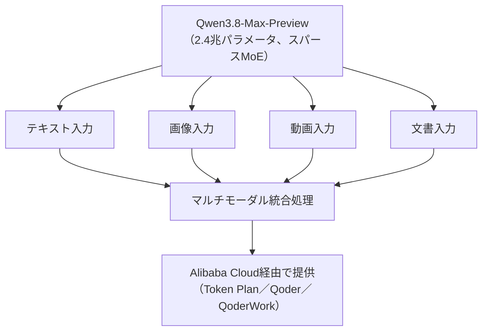

# LLM・AI Agent 最新情報レポート Vol.82
<!-- x-summary: Alibaba「Qwen3.8」発表、2.4兆パラメータMoEでClaude Fable 5に次ぐ性能と主張 -->

**作成日**: 2026年7月20日（JST）
**対象期間**: 2026年7月19日〜7月20日（Vol.81との差分）

---

## 目次

1. [Google Cloudアップデート](#1-google-cloudアップデート)
2. [Microsoft Azure AIアップデート](#2-microsoft-azure-aiアップデート)
3. [LLM Model / AI Agentアーキテクチャ・研究](#3-llm-model--ai-agentアーキテクチャ研究)
   - [3.1 Alibaba、2.4兆パラメータの新モデル「Qwen3.8」を発表](#31-alibabaが24兆パラメータの新モデルqwen38を発表)
4. [公式ブログ・論文のリサーチ・要約](#4-公式ブログ論文のリサーチ要約)
   - [4.1 Google / Google DeepMind](#41-google--google-deepmind)
   - [4.2 OpenAI](#42-openai)
   - [4.3 Anthropic](#43-anthropic)
5. [AI Agent搭載SaaS製品情報](#5-ai-agent搭載saas製品情報)
   - [5.1 Emdoor、複数デバイス横断のAIハブ「Ailyn」を発表](#51-emdoorが複数デバイス横断のaiハブailynを発表)
6. [LLM/AI Agentセキュリティインシデント](#6-llmai-agentセキュリティインシデント)
7. [その他特筆すべき情報](#7-その他特筆すべき情報)
   - [7.1 ACE ROBOTICS、WAIC 2026で新世界モデル「Kairos 3.1」を発表](#71-ace-roboticsがwaic-2026で新世界モデルkairos-31を発表)
   - [7.2 WAIC 2026、中国AI市場が「価格競争」から「階層別プレミアム化」へ転換](#72-waic-2026中国ai市場が価格競争から階層別プレミアム化へ転換)
8. [参考リンク](#8-参考リンク)

---

> **今号について:** 対象期間（7月19日・20日）で最も注目度が高かったのは、Alibaba傘下のQwenチームが7月19日に発表した新モデル「Qwen3.8」（プレビュー版はQwen3.8-Max-Preview）である。2.4兆パラメータのスパースMoE構成を採用した同チーム初の1兆パラメータ超えマルチモーダルモデルで、Alibabaは自社ベンチマークで「Claude Fable 5に次ぐ性能」と主張しているが、独立した第三者ベンチマークはまだ公開されていない。Google Cloud・Azureともに発表日を確定できる新規の公式アップデートはなく、Google／OpenAI／Anthropicの公式ブログにも対象期間中の新規投稿は見当たらなかった。arXiv・Hugging Face Daily Papersにも該当日付の新規エージェントアーキテクチャ論文は確認できなかった。SaaS動向では、Emdoorが複数デバイスを横断してタスクを引き継ぐAIハブ「Ailyn」をWAIC 2026で発表した。その他、同じくWAIC 2026会場では具身知能企業ACE ROBOTICSが新世界モデル「Kairos 3.1」を披露したほか、中国のAI市場が単純な価格競争から性能重視の高価格帯モデルと低価格モデルへの二極化（階層別プレミアム化）に向かいつつあるとの分析も報じられた。セキュリティ面では、対象期間中に新規インシデントの開示は確認できなかった。

---

## 1. Google Cloudアップデート

Google Cloud Blog、developers.googleblog.com、Vertex AI／Gemini Enterprise Agent Platformのリリースノートを確認したが、対象期間（7月19日〜20日）中に発表日を確定できる新規の公式アップデートは見つからなかった。**新情報なし。**

---

## 2. Microsoft Azure AIアップデート

Microsoft Foundry Blog、Azure AI Foundry、Azure Updates、Azure TechCommunityを確認したが、対象期間（7月19日〜20日）中に発表日を確定できる新規の公式アップデートは見つからなかった。**新情報なし。**

---

## 3. LLM Model / AI Agentアーキテクチャ・研究

arXiv cs.AI／cs.CL、Hugging Face Daily Papersを確認したが、対象期間（7月19日〜20日）中に投稿日を確定できる新規のエージェントアーキテクチャ論文は見つからなかった。一方、新規LLMモデルのリリースとしては以下の発表があった。

### 3.1 Alibabaが2.4兆パラメータの新モデル「Qwen3.8」を発表

Alibaba傘下のQwenチームは7月19日、2.4兆パラメータのマルチモーダルAIモデル「Qwen3.8」（プレビュー版：Qwen3.8-Max-Preview）を発表した。スパースMoE（Mixture-of-Experts）アーキテクチャを採用しており、同チームにとって初の1兆パラメータ超えマルチモーダルモデルとなる。テキスト・画像・動画・文書を横断的に処理できるとしており、Alibabaは自社ベンチマークで「Claude Fable 5に次ぐ性能」と主張しているが、これは自社発表によるもので独立した第三者ベンチマークはまだ公開されていない。プレビュー版はAlibaba CloudのToken Plan、Qoder、QoderWork経由で通常価格の10%という先行価格で提供されており、フルモデルはオープンウェイトで近日公開予定とされているが、正式な公開日やライセンスは未定である。これは、7月16日に発表されたMoonshot AIの「Kimi K3」（2.8兆パラメータ）に次ぐ、公開されている中では2番目に大きい規模のモデルとなる。[[1]](#ref-1)[[2]](#ref-2)

> **評価:** 2026年7月は、Moonshot「Kimi K3」（2.8兆パラメータ、7/16）に続きAlibaba「Qwen3.8」（2.4兆パラメータ、7/19）と、中国勢による超大規模MoEモデルの発表が相次いだ月となった。両モデルとも「フロンティアモデルに迫る性能」を自社ベンチマークで主張しているが、独立検証はいずれも未実施であり、実際の性能評価には第三者ベンチマークの公開を待つ必要がある。パラメータ規模の拡大競争と、7.2で報じる「価格帯の二極化」が同時並行で進んでいる点は、中国AI業界の戦略転換を象徴していると言える。

---

## 4. 公式ブログ・論文のリサーチ・要約

### 4.1 Google / Google DeepMind

Google DeepMind公式ブログ（deepmind.google/blog）およびGoogle公式ブログ（blog.google）を確認したが、対象期間中に発表日を確定できる新規の公式投稿は見つからなかった。**新情報なし。**

### 4.2 OpenAI

OpenAIの公式ニュースルーム（openai.com/news）を確認したが、対象期間中に発表日を確定できる新規の公式発表は見つからなかった。**新情報なし。**

### 4.3 Anthropic

Anthropicの公式ニュースルーム（anthropic.com/news）およびClaude公式ブログ（claude.com/blog）を確認したが、対象期間中に発表日を確定できる新規の公式投稿は見つからなかった。**新情報なし。**

---

## 5. AI Agent搭載SaaS製品情報

### 5.1 Emdoorが複数デバイス横断のAIハブ「Ailyn」を発表

インテリジェントコンピューティング機器メーカーのEmdoorは7月19日、WAIC 2026において「Ailyn」と名付けたAIハブを発表した。個人・家庭・企業・産業の4シーンにまたがり、ミニPC、AI PC、AIタブレット、ウェアラブル、産業用AI BOXなど複数のデバイスを横断してタスクを引き継ぐ「プライベート・コンピューティング・バックボーン」の構築を狙う。オンデバイスでのモデル実行を優先しつつ、必要に応じてデータセンター級の演算をオフロードする仕組みを備え、知識蓄積・スキル拡張・ペルソナカスタマイズ・タスク自動実行といったエージェント的機能を搭載しているという。純粋なソフトウェア型SaaSというより、ハードウェアとAIエージェント機能を統合した基盤である点には留意が必要だが、ハードウェア専業企業がインテリジェント基盤企業への転換を図る動きとして注目される。[[3]](#ref-3)

---

## 6. LLM/AI Agentセキュリティインシデント

対象期間（7月19日〜20日）中に新規に開示されたLLM/AIエージェント関連のセキュリティインシデント・脆弱性は確認できなかった。**新情報なし。**

---

## 7. その他特筆すべき情報

### 7.1 ACE ROBOTICSがWAIC 2026で新世界モデル「Kairos 3.1」を発表

中国の具身知能（Embodied AI）企業ACE ROBOTICSは7月19日、WAIC 2026会期中に自社フォーラムを開催し、行動指向型の世界モデル最新版「Kairos 3.1」と「Ambient Capture Engine 2.0」、および小売・宿泊・屋外サービス向けの3つの商用ソリューションを発表した。空間認識・ナビゲーション・操作・タスク進捗評価を含む12の公開ベンチマークで最高水準の成績を達成したとしており、失敗時に途中のステップから再開できる自己修復的なタスク実行能力を実証している。同フォーラムでは具身知能の統一ベンチマーク「PHYSICAL IQ」も新たに立ち上げられた。[[4]](#ref-4)

### 7.2 WAIC 2026、中国AI市場が「価格競争」から「階層別プレミアム化」へ転換

WAIC 2026会場での取材に基づく報道によれば、中国AI業界はこれまでの単純な価格競争から、性能重視の高価格帯モデルと低価格・従量課金モデルへの二極化（階層別戦略）に移行しつつあるという。MiniMaxは月額40元（約5.5ドル）のサブスクリプションをコスト効率重視のモデル構成により持続可能だと擁護する一方、アナリストからはこの価格帯の持続性に疑問の声も上がり、200元（約27.5ドル）帯の方が有望との指摘もあった。7月16日に発表されたMoonshot AIの高性能モデル「Kimi K3」（百万トークンあたり入力3ドル・出力15ドル）が、この高価格帯戦略の象徴例として挙げられている。[[5]](#ref-5)

> **評価:** 3.1で報じたAlibaba「Qwen3.8」の先行提供価格（通常価格の10%）も含め、中国の主要AIラボが「性能で選ばれる高価格帯モデル」と「コストで選ばれる普及価格帯モデル」の両にらみ戦略を取り始めている様子がうかがえる。パラメータ規模の拡大競争と価格戦略の二極化が同時進行している点は、中国生成AI市場が単純な価格競争のフェーズを抜け、収益モデルの転換点に差し掛かっていることを示していると考えられる。

---

## 8. 参考リンク

**[1]** [Alibaba's Qwen Unveils Preview of Flagship AI Model | Bloomberg](https://www.bloomberg.com/news/articles/2026-07-19/alibaba-s-qwen-unveils-preview-of-flagship-ai-model)

**[2]** [Alibaba Launches Qwen3.8 With 2.4 Trillion Parameters, Claims Near-Frontier Performance | MLQ.ai](https://mlq.ai/news/alibaba-launches-qwen-38-with-24-trillion-parameters-claims-near-frontier-performance/)

**[3]** [Emdoor Launches "Ailyn" AI Hub at WAIC 2026: Unifying Intelligence Across Every Device | PR Newswire](http://www.prnewswire.com/news-releases/emdoor-launches-ailyn-ai-hub-at-waic-2026-unifying-intelligence-across-every-device-302829098.html)

**[4]** [ACE ROBOTICS Unveils Kairos 3.1 and Expands Its Embodied AI Stack from Data to Deployment at WAIC 2026 | The Manila Times](https://www.manilatimes.net/2026/07/19/tmt-newswire/media-outreach-newswire/ace-robotics-unveils-kairos-31-and-expands-its-embodied-ai-stack-from-data-to-deployment-at-waic-2026/2387147)

**[5]** [WAIC 2026: Chinese AI 'price war' turns to 'premium tiering' | CGTN](https://news.cgtn.com/news/2026-07-19/WAIC-2026-Chinese-AI-price-war-turns-to-premium-tiering--1OUf9SdQF5S/p.html)
