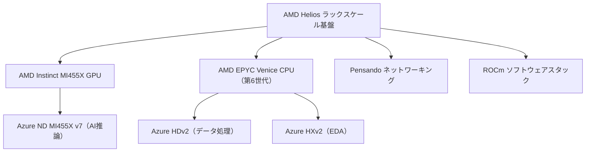

# LLM・AI Agent 最新情報レポート Vol.83
<!-- x-summary: 欧州委員会がDMAに基づきGoogleに命令、AndroidのAI機能と検索データをライバル各社へ開放させる方針 -->

**作成日**: 2026年7月21日（JST）
**対象期間**: 2026年7月20日〜7月21日（Vol.82との差分）

---

## 目次

1. [Google Cloudアップデート](#1-google-cloudアップデート)
2. [Microsoft Azure AIアップデート](#2-microsoft-azure-aiアップデート)
   - [2.1 MicrosoftがAMDとの提携拡大を発表、Helios AIインフラをAzureに導入](#21-microsoftがamdとの提携拡大を発表heliosaiインフラをazureに導入)
3. [LLM Model / AI Agentアーキテクチャ・研究](#3-llm-model--ai-agentアーキテクチャ研究)
4. [公式ブログ・論文のリサーチ・要約](#4-公式ブログ論文のリサーチ要約)
   - [4.1 Google / Google DeepMind](#41-google--google-deepmind)
   - [4.2 OpenAI](#42-openai)
   - [4.3 Anthropic](#43-anthropic)
5. [AI Agent搭載SaaS製品情報](#5-ai-agent搭載saas製品情報)
6. [LLM/AI Agentセキュリティインシデント](#6-llmai-agentセキュリティインシデント)
7. [その他特筆すべき情報](#7-その他特筆すべき情報)
   - [7.1 欧州委員会、GoogleにAndroidと検索データのAI競合他社への開放を命令](#71-欧州委員会googleにandroidと検索データのai競合他社への開放を命令)
   - [7.2 WAIC 2026閉幕、世界のAIガバナンスが二極化し企業に「二重コンプライアンス」の重荷](#72-waic-2026閉幕世界のaiガバナンスが二極化し企業に二重コンプライアンスの重荷)
8. [参考リンク](#8-参考リンク)

---

> **今号について:** 対象期間（7月20日・21日）で最も注目度が高かったのは、欧州委員会が7月16日に下した、デジタル市場法（DMA）に基づく拘束力ある決定である。GoogleはAndroidの11機能をライバルAIアシスタントに開放し、検索データも外部の検索エンジン・AIチャットボットと共有するよう義務付けられた。決定自体は7月16日付だが、7月20日時点でも欧米メディアで大きく報じられ続けており、GeminiがAndroid上で享受してきたネイティブ統合の優位性が揺らぐ可能性がある一方、サードパーティ製AIアシスタントには新たな流通チャネルが開けることになる。クラウド分野では、Microsoftが7月20日、AMDとの長期戦略提携拡大を発表し、新型ラックスケールAIインフラ「Helios」をAzureに導入すると公式発表した。NVIDIA一極依存からの分散を進める動きとして注目される。国際情勢では、上海で開催されていたWAIC 2026が7月20日に閉幕し、中国主導の「世界AI協力機構（WAICO）」とEU AI Act・G7広島プロセスなど既存の枠組みが並立する「二重のAIガバナンス」が事実上固定化したとの分析が報じられた。Google Cloudの公式アップデート、Google／OpenAI／Anthropicの公式ブログ、新規のエージェントアーキテクチャ論文、AI Agent搭載SaaS製品、LLM/AIエージェント関連のセキュリティインシデントについては、対象期間中に発表日を確定できる新規情報は見つからなかった。

---

## 1. Google Cloudアップデート

Google Cloud Blog、developers.googleblog.com、Vertex AI／Gemini Enterprise Agent Platformのリリースノートを確認したが、対象期間（7月20日〜21日）中に発表日を確定できる新規の公式アップデートは見つからなかった。**新情報なし。**

---

## 2. Microsoft Azure AIアップデート

### 2.1 MicrosoftがAMDとの提携拡大を発表、Helios AIインフラをAzureに導入

Microsoftは7月20日、AMDとの長期戦略提携拡大を公式ブログで発表し、AMDの新しいラックスケールAIインフラ「Helios」をAzureに導入すると明らかにした。Heliosラックは、AMD Instinct MI455X GPU、次世代EPYC「Venice」CPU（第6世代）、Pensando製ネットワーキング、ROCmソフトウェアスタックを統合したオープン仕様の基盤である。これにあわせて、AI推論向けの新VM「Azure ND MI455X v7」、データ処理向けの「Azure HDv2」（第6世代EPYCコア約500基・4TBメモリ・32TBのNVMeストレージを搭載）、電子設計自動化（EDA）向けの「Azure HXv2」（クロック5GHz超・176コア）という3つの新シリーズが発表された。AMDは2026年後半からMicrosoftを含む顧客へのHelios出荷を開始する予定としている。Cloud + AI担当のScott Guthrie EVPは、AIワークロードの急拡大に単一のインフラアプローチでは対応しきれなくなっているとし、スタック全体での専門特化が必要だと説明している。[[1]](#ref-1)[[2]](#ref-2)

> **評価:** Microsoftはこれまで主にNVIDIA GPUを軸にAzureのAI基盤を構築してきたが、今回のHelios導入によりNVIDIA一極依存からの分散を明確に進めた形となる。CPU・GPU・ネットワーキングを垂直統合した「ラックスケール」単位での提供は、Huawei Atlas 950 SuperPoD（Vol.80既報）とも設計思想が近く、ハイパースケーラー各社の競争軸がGPU単体の性能比較から、ラック単位でのAI学習・推論性能へと移りつつあることを示している。

---

## 3. LLM Model / AI Agentアーキテクチャ・研究

arXiv cs.AI／cs.CL、Hugging Face Daily Papersを確認したが、対象期間（7月20日〜21日）中に投稿日を確定できる新規のLLMモデル発表・エージェントアーキテクチャ論文は見つからなかった。**新情報なし。**

---

## 4. 公式ブログ・論文のリサーチ・要約

### 4.1 Google / Google DeepMind

Google DeepMind公式ブログ（deepmind.google/blog）およびGoogle公式ブログ（blog.google）を確認したが、対象期間中に発表日を確定できる新規の公式投稿は見つからなかった。**新情報なし。**

### 4.2 OpenAI

OpenAIの公式ニュースルーム（openai.com/news）を確認したが、対象期間中に発表日を確定できる新規の公式発表は見つからなかった。**新情報なし。**

### 4.3 Anthropic

Anthropicの公式ニュースルーム（anthropic.com/news）およびClaude公式ブログ（claude.com/blog）を確認したが、対象期間中に発表日を確定できる新規の公式投稿は見つからなかった。なお、7月20日にはClaude Opus 4.8で約40分間のエラー増加インシデントが発生し復旧しているが、原因分析や公式ブログでの言及は確認できていない。**新情報なし。**

---

## 5. AI Agent搭載SaaS製品情報

対象期間（7月20日〜21日）中に発表日を確定できる新規のAI Agent搭載SaaS製品は見つからなかった。**新情報なし。**

---

## 6. LLM/AI Agentセキュリティインシデント

対象期間（7月20日〜21日）中に新規に開示されたLLM/AIエージェント関連のセキュリティインシデント・脆弱性は確認できなかった。**新情報なし。**

---

## 7. その他特筆すべき情報

### 7.1 欧州委員会、GoogleにAndroidと検索データのAI競合他社への開放を命令

欧州委員会は7月16日、デジタル市場法（DMA）に基づき、Googleに対して2件の拘束力ある決定を下した。1件目は、競合AIアシスタントがタクシー予約や音声メッセージ返信などのタスクを実行できるよう、Android上の11機能への同等アクセスを認めるというもの。Android 18の実装により2027年8月1日までに対応し、複数ウェイクワードへの同時対応は2028年8月までの実施が義務付けられる。2件目は、Google検索の改善に用いているクエリ・ランキング・クリック・閲覧データなどを匿名化した上で、対象となる第三者の検索エンジンやAIチャットボットと共有するというもので、2027年1月から開始される。決定に罰金は付されていないが、違反時にはGoogleの世界売上高の最大10%に相当する制裁金が科される可能性がある。決定日は7月16日だが、7月20日時点でも欧米メディアで大きく報じられ続けている。[[3]](#ref-3)[[4]](#ref-4)

> **評価:** 今回の規制はAndroidのシステムレベルAPIと検索エンジンという、Googleの事業の核心的な「堀」を直接の対象としている点が特筆される。GeminiがAndroid上で享受してきたネイティブ統合の優位性が薄れる一方、ChatGPTやClaudeなど競合AIアシスタントには新たな配信チャネルが開かれる可能性がある。7.2で触れる中国主導のWAICOとあわせ、米欧中それぞれで異なるアプローチによるAIガバナンス・競争政策の制度化が同時並行で進んでいる。

### 7.2 WAIC 2026閉幕、世界のAIガバナンスが二極化し企業に「二重コンプライアンス」の重荷

上海で7月17日に開幕したWAIC 2026は7月20日、4日間の会期を終えて閉幕した。開幕にあわせて中国主導の政府間組織「世界AI協力機構（WAICO、Vol.80既報）」に29カ国が署名したことを受け、閉幕時点でEU AI Act・OECDのAI原則・G7広島プロセスといった既存の枠組みとは互換性を前提としない、中国主導の独自規制圏が事実上確立した形となった。TechTimesの分析記事は、これによりグローバルに事業展開する企業が、EU AI Act準拠仕様で設計したAIシステムをWAICO加盟国市場向けに再設計せざるを得なくなる可能性があるなど、2つの非互換な規制体系を同時に運用する実務負担が今後の企業活動に表面化すると指摘している。[[5]](#ref-5)

> **評価:** 7.1のEU・DMA決定とあわせて考えると、7月後半は「米欧圏の競争法によるプラットフォーム開放」と「中国主導の対抗的国際枠組みによる規制圏形成」という、AIガバナンスの2つの異なる制度化が同時進行した期間だったと言える。企業にとっては、モデル選定やAPI活用、コンプライアンス対応において地域ごとの設計判断が一段と避けられなくなりつつある。

---

## 8. 参考リンク

**[1]** [Microsoft expands Azure AI and HPC infrastructure with AMD | The Official Microsoft Blog](https://blogs.microsoft.com/blog/2026/07/20/microsoft-expands-azure-ai-and-hpc-infrastructure-with-amd/)

**[2]** [Microsoft to Deploy Next-Gen AMD Instinct and AMD EPYC Processors as the Companies Expand Their Long-Term Strategic Partnership | AMD Newsroom](https://newsroom.amd.com/news/microsoft-azure-ai-infrastructure/)

**[3]** [EU Orders Google To Open Android And Search Data To Rival AI Services | Dataconomy](https://dataconomy.com/2026/07/20/eu-orders-google-open-android-search-data-ai-services/)

**[4]** [Commission provides guidance to Google for AI interoperability on Android and sharing of Google Search data under the Digital Markets Act | European Commission](https://digital-markets-act.ec.europa.eu/commission-provides-guidance-google-ai-interoperability-android-and-sharing-google-search-data-under-2026-07-16_en)

**[5]** [WAIC Ends With Two Incompatible AI Governance Orders Locked In for Enterprises | TechTimes](https://www.techtimes.com/articles/320997/20260720/waic-ends-two-incompatible-ai-governance-orders-locked-enterprises.htm)
