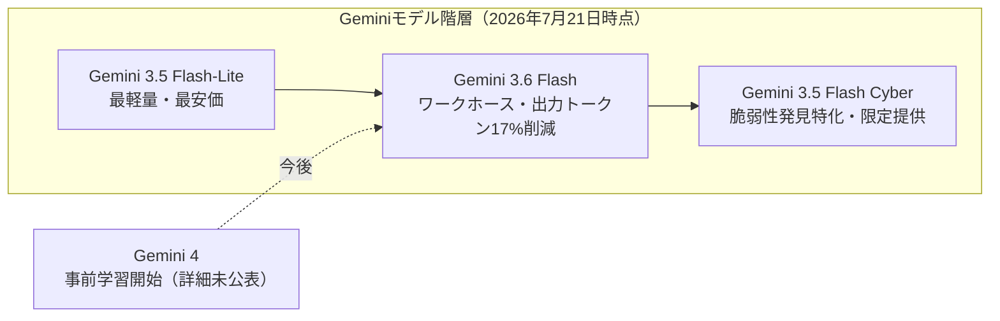

# LLM・AI Agent 最新情報レポート Vol.85
<!-- x-summary: Google、Gemini 3.6 FlashとFlash-Liteを投入、次期Gemini 4の事前学習も開始と発表 -->

**作成日**: 2026年7月23日（JST）
**対象期間**: 2026年7月22日〜7月23日（Vol.84との差分）

---

## 目次

1. [Google Cloudアップデート](#1-google-cloudアップデート)
   - [1.1 Google Cloud、DOE「Genesis Mission」に4000万ドル相当のAIトークン・クラウドクレジットを提供](#11-google-clouddoegenesis-missionに4000万ドル相当のaiトークンクラウドクレジットを提供)
2. [Microsoft Azure AIアップデート](#2-microsoft-azure-aiアップデート)
3. [LLM Model / AI Agentアーキテクチャ・研究](#3-llm-model--ai-agentアーキテクチャ研究)
   - [3.1 Googleが「Gemini 3.6 Flash」「3.5 Flash-Lite」を投入、Gemini 4の事前学習開始も表明](#31-googleがgemini-36-flash35-flash-liteを投入gemini-4の事前学習開始も表明)
   - [3.2 arXivに長期稼働エージェントの実運用課題とコーディングエージェントの予算配分ルーティングに関する論文](#32-arxivに長期稼働エージェントの実運用課題とコーディングエージェントの予算配分ルーティングに関する論文)
4. [公式ブログ・論文のリサーチ・要約](#4-公式ブログ論文のリサーチ要約)
   - [4.1 Google / Google DeepMind](#41-google--google-deepmind)
   - [4.2 OpenAI](#42-openai)
   - [4.3 Anthropic](#43-anthropic)
5. [AI Agent搭載SaaS製品情報](#5-ai-agent搭載saas製品情報)
   - [5.1 Syncfusionが「BoldDesk AI 2.0」を発表、ホスト型MCPサーバーで外部AIツール連携を強化](#51-syncfusionがbolddesk-ai-20を発表ホスト型mcpサーバーで外部aiツール連携を強化)
6. [LLM/AI Agentセキュリティインシデント](#6-llmai-agentセキュリティインシデント)
7. [その他特筆すべき情報](#7-その他特筆すべき情報)
   - [7.1 中国政府がAIモデル・半導体の輸出規制強化を検討と報道](#71-中国政府がaiモデル半導体の輸出規制強化を検討と報道)
   - [7.2 FRBがAnthropicの「Mythos」への早期アクセスを要求も数か月間取得できず](#72-frbがanthropicのmythosへの早期アクセスを要求も数か月間取得できず)
8. [参考リンク](#8-参考リンク)

---

> **今号について:** 対象期間（7月22日・23日）の中心はGoogleによるGeminiモデルラインナップの刷新である。7月21日（現地時間）、GoogleはFlash系モデル3種（Gemini 3.6 Flash、3.5 Flash-Lite、3.5 Flash Cyber）を一挙に投入し、エージェント向けワークロードを意識したトークン効率化を打ち出すと同時に、次期フラグシップ「Gemini 4」の事前学習を既に開始したと明らかにした。OpenAIも動きが速く、企業向け音声・チャットエージェント基盤「Presence」と、セルフサーブ型のChatGPT広告出稿ツール「Ads Manager」を相次いで公式発表し、エージェントとマネタイズ両面での事業化を加速させている。Anthropicは自社の経済統計データをClaude上で対話的に参照できる「Anthropic Economic Index connector」を公開した。その他の特筆すべき動きとしては、中国政府がAIモデル・半導体の輸出規制強化を検討していると英Financial Timesが報じたほか、米連邦準備制度理事会（FRB）がAnthropicのサイバーセキュリティ特化モデル「Claude Mythos」への早期アクセスを求めながら数か月間取得できずにいたことが明らかになった。なお、Vol.84既報のOpenAI評価用モデルによるHugging Face侵害事案・ServiceNow脆弱性については、対象期間中に事実関係を更新する新情報は確認できなかった。

---

## 1. Google Cloudアップデート

### 1.1 Google Cloud、DOE「Genesis Mission」に4000万ドル相当のAIトークン・クラウドクレジットを提供

Googleは7月22日、米エネルギー省（DOE）が主導する国家的科学研究加速プログラム「Genesis Mission」のサミットにおいて、4000万ドル相当のAIトークンおよびクラウドクレジットを提供すると発表した。提供内容は、コード生成・発見エージェント「AlphaEvolve」、タンパク質構造予測「AlphaFold 3」、DNA変異解析「AlphaGenome」、気象予測「WeatherNext」、地球観測「AlphaEarth Foundations」といったフロンティア科学AIツール群と、DOE傘下の国立研究所職員数万人分の「Gemini for Government」の1年間分の利用枠から成る。Googleは昨年12月時点で既にDOE傘下17か所の国立研究所全てにAI for Scienceツールの早期アクセスプログラムを提供しており、今回はその取り組みを拡大する形となる。Genesis Missionは、AIを活用して米国の科学的発見のペースを今後10年で倍増させることを目指すホワイトハウス主導の国家プロジェクトである。[[1]](#ref-1)[[2]](#ref-2)

> **評価:** Microsoftも既にGenesis Missionに6000万ドルの投資を表明しており、フロンティアAI企業各社が政府の科学研究基盤に自社モデル・インフラを組み込む競争が本格化している。国家の研究基盤にAlphaFoldやAlphaEvolveのような専門特化エージェントが標準的に組み込まれていくと、AI企業と政府機関の間の技術的な相互依存が一段と深まることになる。

---

## 2. Microsoft Azure AIアップデート

対象期間中、Microsoft公式ブログ（blogs.microsoft.com）およびAzure公式ブログ（azure.microsoft.com/blog）を確認したが、7月20日に既に発表されていたAMD Heliosラック規模インフラのAzure展開（Vol.83既報）に関する記事が複数メディアで再掲・後追いされているのみで、投稿日を確定できる新規のAzure AI関連発表は見つからなかった。**新情報なし。**

---

## 3. LLM Model / AI Agentアーキテクチャ・研究

### 3.1 Googleが「Gemini 3.6 Flash」「3.5 Flash-Lite」を投入、Gemini 4の事前学習開始も表明

Googleは7月21日、Geminiモデルラインナップの中位・軽量帯を刷新する3モデル「Gemini 3.6 Flash」「Gemini 3.5 Flash-Lite」「Gemini 3.5 Flash Cyber」を公式ブログで発表した。中核となる「Gemini 3.6 Flash」は、旧世代の3.5 Flash比で出力トークン消費量を17%削減するアーキテクチャ改良を施した「ワークホース」モデルと位置付けられており、出力価格は100万トークンあたり9.00ドルから7.50ドルへ引き下げられた一方、入力価格は1.50ドルで据え置かれている。知識カットオフも2025年1月から2026年3月に更新された。最軽量帯の「Gemini 3.5 Flash-Lite」は、入力0.30ドル・出力2.50ドル（100万トークンあたり）という価格帯で、3月に投入された旧世代3.1 Flash-Liteから「大幅な品質向上」を実現したとされる。セキュリティ特化の「Gemini 3.5 Flash Cyber」は、脆弱性の発見・修正に特化してファインチューニングされたモデルで、当面は各国政府と信頼できるパートナーに限定したパイロット提供にとどまる（1章のCodeMenderとの関連は同章参照）。あわせてGoogleは、次期フラグシップモデル「Gemini 4」に向けた「これまでで最も野心的な」事前学習ランを既に開始したことを明らかにしたが、詳細な仕様やリリース時期には言及していない。[[3]](#ref-3)[[4]](#ref-4)[[5]](#ref-5)

> **評価:** 出力トークンの削減幅（17%）を明示的な訴求点としている点は、エージェント型ワークロードでは推論回数・ツール呼び出し回数が増え出力トークンのコスト比重が増すという実務上の課題を反映している。Gemini 4の事前学習開始という発表は、まだ仕様が固まっていない段階であえて公表することで、GPT系・Claude系との次世代モデル競争において先手を印象づける狙いがあると見られる。

### 3.2 arXivに長期稼働エージェントの実運用課題とコーディングエージェントの予算配分ルーティングに関する論文

arXiv cs.AIには対象期間中、エージェントアーキテクチャに関連する新規論文が複数投稿された。「Agents in the Wild: Where Research Meets Deployment」は、研究用ベンチマークで培われた推論・計画・マルチエージェント協調の手法が、創薬・金融といった実運用環境に展開される際に直面する頑健性・安全性・信頼性の課題を、実際のケーススタディを通じて分析するチュートリアル論文である。また「CodeRescue: Budget-Calibrated Recovery Routing for Coding Agents」は、コーディングエージェントがタスク実行中に失敗・行き詰まりに陥った際、限られたトークン予算の中でどのモデル・戦略にリカバリー処理をルーティングすべきかを定式化した手法を提案している。[[6]](#ref-6)[[7]](#ref-7)

> **評価:** 両論文とも、ベンチマーク上の性能そのものよりも「本番運用に投入した際に何が壊れるか」に焦点を当てている点が共通しており、エージェント研究の重心がアルゴリズムの新規性から運用信頼性・コスト管理へと移りつつあることを示している。

---

## 4. 公式ブログ・論文のリサーチ・要約

### 4.1 Google / Google DeepMind

対象期間中の主要な公式発表は3章で述べたGemini 3.6 Flash／3.5 Flash-Lite／3.5 Flash Cyberのリリースと、1章で述べたGenesis Missionへの4000万ドル拠出に集約される。それ以外に発表日を確定できる新規の公式投稿は見つからなかった。**新情報なし（詳細は1章・3章参照）。**

### 4.2 OpenAI

OpenAIは7月22日、企業向けに音声・チャットのAIエージェントを展開するための新プラットフォーム「Presence」を公式発表した。Presenceでは、エージェントがアクセスできるナレッジ、連携可能な業務システム、実行を許可するアクションの範囲を企業側が細かく設定できるほか、本番投入前にシナリオをシミュレーションするツールや、本番環境での性能を継続的に監視し弱点や改善余地を検出する仕組みを備える。既にOpenAI自身の英語圏カスタマーサポート電話回線で稼働しており、着信の75%を人手を介さず解決しているという。展開はOpenAIのフォワード・デプロイド・エンジニアや提携システムインテグレーターが主導する形の限定的な一般提供（GA）プログラムを通じて行われ、想定用途はカスタマーサポート、アウトバウンド営業開発、調達、IT、人事など多岐にわたる。[[8]](#ref-8)[[9]](#ref-9)

同日、OpenAIはセルフサーブ型のChatGPT広告出稿プラットフォーム「Advertise in ChatGPT」のAds Managerも公開した。広告主はads.openai.com上でアカウント登録、予算設定、クリエイティブのアップロード、配信ペース管理、成果測定までを自ら完結できるようになり、従来CPM課金が中心だった料金体系にCPC（クリック課金）入札も追加された。従来設定されていた5万ドルの最低出稿額も撤廃され、中小企業や個人ブランドの参入障壁が下がった。Best Buy、Lowe's、VistaPrintなどが早期導入事例として紹介されている。[[10]](#ref-10)[[11]](#ref-11)

> **評価:** 同じ日に企業向けエージェント基盤（Presence）と広告収益化基盤（Ads Manager）を並行して発表した点は、OpenAIがChatGPTを「対話型検索」から「企業の業務・マーケティング活動そのものを担うプラットフォーム」へと押し広げていることを示す。両者は独立した発表ながら、将来的にはChatGPT上でのエージェントによる購買行動と広告配信が接続されていく可能性も見据えておく必要がある。

### 4.3 Anthropic

Anthropicは7月22日、Claude上でAnthropic Economic Index（AIが経済活動・雇用にどう影響しているかを分析する自社調査データ）を直接参照できる新機能「Anthropic Economic Index connector」を公式発表した。ユーザーはclaude.aiのコネクタメニューからディレクトリ内のAnthropic Economic Indexを有効化するだけで、「どの職種が最もAIを活用しているか」「教師はClaudeをどのようなタスクに使っているか」といった質問をClaudeに投げかけ、自社調査データに基づいた回答を得られるようになる。[[12]](#ref-12)

> **評価:** 自社の経済指標データセットをコネクタという形でClaudeから直接引き出せるようにした点は、Anthropicが継続的に公表してきたEconomic Indexレポートの活用範囲を、研究者・政策担当者向けの静的なレポートから、一般ユーザーが対話的に掘り下げられる形へと広げる試みと言える。

---

## 5. AI Agent搭載SaaS製品情報

### 5.1 Syncfusionが「BoldDesk AI 2.0」を発表、ホスト型MCPサーバーで外部AIツール連携を強化

カスタマーサポート・ヘルプデスクSaaSを手がけるSyncfusionは7月21日、「BoldDesk AI 2.0」を発表した。新設された「Ticket AIエージェント」はチケットの自動振り分けと文脈に応じた返信案・メモの自動生成を行い、「Email AIエージェント」は受信メールの読み取り・分類・返信案作成を担う。いずれも人間の承認を経てから送信される設計となっている。今回の目玉機能は、Claude、ChatGPT、Gemini、GitHub Copilotなど外部のAIツールからBoldDeskのチケット作成・更新・返信・履歴取得・承認管理を直接行えるようにする、ホスト型MCP（Model Context Protocol）サーバーの提供である。利用企業は自前でMCPサーバーを構築・保守する必要がない。同製品は2026年SaaS Awardsのファイナリストにも選出されている。[[13]](#ref-13)

> **評価:** 垂直特化型SaaSがMCPサーバーをホスト型で提供し、外部の汎用AIエージェントから自社の業務データ・ワークフローに直接アクセスさせる設計は、SaaS各社が「自社アプリ内にAI機能を作り込む」路線から「外部のフロンティアモデル・エージェントに接続点を提供する」路線へとシフトしていることを示す一例である。

---

## 6. LLM/AI Agentセキュリティインシデント

対象期間中、Vol.84既報のOpenAI評価用モデルによるHugging Face侵害事案、およびServiceNow AI Platformの脆弱性（CVE-2026-6875）について、事実関係を更新する新たな一次情報は確認できなかった（複数メディアによる後追い報道が続いているのみ）。それ以外に発表日を確定できる新規のセキュリティインシデントも見つからなかった。**新情報なし。**

---

## 7. その他特筆すべき情報

### 7.1 中国政府がAIモデル・半導体の輸出規制強化を検討と報道

英Financial Timesは7月21日、中国政府がAIモデルおよび半導体の輸出に対する規制強化を検討していると報じた。商務省を中心とする規制当局が、自国の主要AI・半導体企業と協議を進めており、検討対象には最先端モデル（未公開のものを含む）の海外への提供制限、モデル重みや機微な学習データの国境を越えた移転の制限、先端半導体技術に対する規制強化が含まれるという。今月上旬にはReutersが、中国当局がByteDance、Alibaba、Huaweiなど大手テック企業と、海外への最先端モデルアクセス制限について協議したと報じていた。無断でのAI技術流出・窃取を国家安全法違反として扱う案も検討対象に上っているとされる。中国商務省、ByteDance、Alibaba、Zhipu、Huawei、Qualcomm、TSMCはいずれも取材に応じていない。[[14]](#ref-14)[[15]](#ref-15)

> **評価:** 米国が半導体・AIモデルの対中輸出規制を強化してきたのに対し、中国側も自国の先端AI技術を「国家の戦略的資産」として囲い込む方向に動いていることを示す報道であり、米中間でのAI技術のブロック化が双方向で進行していることをうかがわせる。

### 7.2 FRBがAnthropicの「Mythos」への早期アクセスを要求も数か月間取得できず

米CNBCは7月21日、連邦準備制度理事会（FRB）と財務省が今年4月、主要銀行のCEOを緊急招集し、Anthropicのサイバーセキュリティ特化モデル「Claude Mythos Preview」がもたらしうる未曾有のサイバーセキュリティ上の脅威について警告していたと報じた。Anthropicは同モデルを、JPMorgan Chase、Amazon、Apple、Googleなど約50組織が参加する脆弱性発見の枠組み「Project Glasswing」を通じて限定提供しており、6月には対象組織を15か国150組織超に拡大していた。しかし当のFRBは7月半ば時点でもMythos Previewへのアクセスを得られていなかったといい、FRBのKevin Warsh議長は、中央銀行自身のシステムおよび金融セクター全体に接続するシステムの脆弱性を特定・対処するため、Mythosを含むフロンティアAIモデルへのアクセスを求め続けていると議会で証言した。[[16]](#ref-16)[[17]](#ref-17)

> **評価:** 銀行業界に脅威を警告した当の監督機関が、警告対象と同じ検証ツールへのアクセスを数か月間得られずにいたという状況は、フロンティアAI企業による限定提供モデルのアクセス配分の意思決定が、規制当局よりも民間の大手金融機関を先行させる形になっている実態を浮き彫りにしている。安全性評価用アクセスの優先順位付け自体が、新たなガバナンス上の論点になりつつある。

---

## 8. 参考リンク

**[1]** [Accelerating frontiers of scientific discovery with a $40M commitment to the Genesis Mission | Google Cloud Blog](https://cloud.google.com/blog/topics/public-sector/accelerating-frontiers-of-scientific-discovery-40-million-dollar-commitment-genesis-mission)

**[2]** [Google DeepMind Supports DOE Genesis: a National Mission to Accelerate Innovation and Scientific Discovery | HPCwire](https://www.hpcwire.com/off-the-wire/google-deepmind-supports-doe-genesis-a-national-mission-to-accelerate-innovation-and-scientific-discovery/)

**[3]** [Introducing Gemini 3.6 Flash, 3.5 Flash-Lite, and 3.5 Flash Cyber | Google Blog](https://blog.google/innovation-and-ai/models-and-research/gemini-models/gemini-3-6-flash-3-5-flash-lite-3-5-flash-cyber/)

**[4]** [Google releases three new Gemini models — but no 3.5 Pro | TechCrunch](https://techcrunch.com/2026/07/21/google-releases-three-new-gemini-models-but-no-3-5-pro/)

**[5]** [Google Releases Gemini 3.6 Flash, 3.5 Flash-Lite, and 3.5 Flash Cyber: A Cheaper, More Token-Efficient Flash Tier Built for Agentic Workloads | MarkTechPost](https://www.marktechpost.com/2026/07/21/google-releases-gemini-3-6-flash-3-5-flash-lite-and-3-5-flash-cyber-a-cheaper-more-token-efficient-flash-tier-built-for-agentic-workloads/)

**[6]** [Agents in the Wild: Where Research Meets Deployment | arXiv:2607.19336](https://arxiv.org/abs/2607.19336)

**[7]** [CodeRescue: Budget-Calibrated Recovery Routing for Coding Agents | arXiv:2607.19338](https://arxiv.org/abs/2607.19338)

**[8]** [Introducing OpenAI Presence | OpenAI](https://openai.com/index/introducing-openai-presence/)

**[9]** [OpenAI unveils Presence, a new platform that lets enterprises launch and manage realtime voice agents and chatbots | VentureBeat](https://venturebeat.com/orchestration/openai-unveils-presence-a-new-platform-that-lets-enterprises-launch-and-manage-realtime-voice-agents-and-chatbots)

**[10]** [New ways to buy ChatGPT ads | OpenAI](https://openai.com/index/new-ways-to-buy-chatgpt-ads/)

**[11]** [OpenAI launches ads manager, reduces ChatGPT ad pilot cost to $50,000 | eMarketer](https://www.emarketer.com/content/openai-launches-ads-manager--reduces-chatgpt-ad-pilot-cost--50-000)

**[12]** [The Anthropic Economic Index connector | Anthropic](https://www.anthropic.com/news/anthropic-economic-index-connector)

**[13]** [Syncfusion Unveils BoldDesk AI 2.0; Named Finalist in SaaS Awards | GlobeNewswire](https://www.globenewswire.com/news-release/2026/07/21/3330745/0/en/syncfusion-unveils-bolddesk-ai-2-0-named-finalist-in-saas-awards.html)

**[14]** [China considers tighter export controls on AI models and chips, FT reports | Yahoo Finance](https://finance.yahoo.com/technology/ai/articles/china-considers-tighter-export-controls-041139427.html)

**[15]** [After US, China eyes export restrictions on AI models and chips | Business Today](https://www.businesstoday.in/technology/news/story/after-us-china-eyes-export-restrictions-on-ai-models-and-chips-544257-2026-07-21)

**[16]** [The Fed rang the alarm about Anthropic's Mythos AI model — but had to go months without it | CNBC](https://www.cnbc.com/2026/07/21/fed-mythos-ai-cybersecurity-banks-project-glasswing.html)

**[17]** [The Fed Sought Early Access To Anthropic's Mythos To Address Its Capabilities. It Didn't Get It For Months | IBTimes](https://www.ibtimes.com/fed-sought-early-access-anthropics-mythos-address-its-capabilities-it-didnt-get-it-months-3805600)
