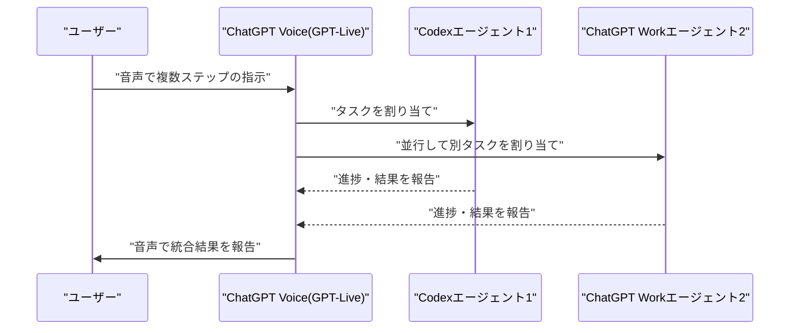

# LLM・AI Agent 最新情報レポート Vol.87
<!-- x-summary: Anthropicが新モデル「Claude Opus 5」を発表、価格据え置きでFable 5に迫る性能を実現 -->

**作成日**: 2026年7月25日（JST）
**対象期間**: 2026年7月24日〜7月25日（Vol.86との差分）

---

## 目次

1. [Google Cloudアップデート](#1-google-cloudアップデート)
2. [Microsoft Azure AIアップデート](#2-microsoft-azure-aiアップデート)
   - [2.1 Microsoft 365 Copilot/Copilot Studioで、OpenAI提供モデルがサブプロセッサーとして既定有効化](#21-microsoft-365-copilotcopilot-studioでopenai提供モデルがサブプロセッサーとして既定有効化)
3. [LLM Model / AI Agentアーキテクチャ・研究](#3-llm-model--ai-agentアーキテクチャ研究)
4. [公式ブログ・論文のリサーチ・要約](#4-公式ブログ論文のリサーチ要約)
   - [4.1 Google / Google DeepMind](#41-google--google-deepmind)
   - [4.2 OpenAI](#42-openai)
   - [4.3 Anthropic](#43-anthropic)
5. [AI Agent搭載SaaS製品情報](#5-ai-agent搭載saas製品情報)
   - [5.1 Fly.io、「エージェントのためのコンピュータ」基盤構築に2,500万ドルを調達](#51-flyioエージェントのためのコンピュータ基盤構築に2500万ドルを調達)
6. [LLM/AI Agentセキュリティインシデント](#6-llmai-agentセキュリティインシデント)
   - [6.1 Googleが「Bard」の誤情報を巡る名誉毀損訴訟で敗訴回避できず、審理継続へ](#61-googleがbardの誤情報を巡る名誉毀損訴訟で敗訴回避できず審理継続へ)
7. [その他特筆すべき情報](#7-その他特筆すべき情報)
   - [7.1 Stripe、AIモデルマーケットプレイスOpenRouterを約100億ドルで買収交渉中と報道](#71-stripeaiモデルマーケットプレイスopenrouterを約100億ドルで買収交渉中と報道)
   - [7.2 OpenAIの安全システム統括責任者Johannes Heidecke氏が退社、安全部門幹部の離脱が6人目に](#72-openaiの安全システム統括責任者johannes-heidecke氏が退社安全部門幹部の離脱が6人目に)
   - [7.3 VentureBeat調査、企業のAIエージェント導入にガバナンス整備が追いついていない実態を報告](#73-venturebeat調査企業のaiエージェント導入にガバナンス整備が追いついていない実態を報告)
8. [参考リンク](#8-参考リンク)

---

> **今号について:** 対象期間（7月24日・25日）で最大の出来事はAnthropicによる新モデル「Claude Opus 5」の発表である。価格をOpus 4.8から据え置きながら最上位モデル「Fable 5」に迫る性能を実現し、日常的なオフィスワークやエージェント型コーディング用途のデフォルトモデルと位置付けられた。同時期にOpenAIもChatGPT Voiceをデスクトップアプリに拡大し、音声だけでCodexやChatGPT Work上の複数エージェントを同時に操作できるようにするなど、両社がハンズフリーなエージェント操作性を競う動きが見られた。クラウド基盤側では、Microsoft 365 CopilotおよびCopilot StudioでOpenAI提供モデルがサブプロセッサーとして既定有効化され、Azure OpenAI経由に加えOpenAI直営インフラ上のモデルも利用可能になった。ビジネス面ではStripeによるAIモデルマーケットプレイスOpenRouterの約100億ドル規模での買収交渉、インフラ面ではエージェント専用コンピューティング基盤を手がけるFly.ioの2,500万ドル調達が報じられた。一方でOpenAIでは安全システム統括責任者のJohannes Heidecke氏が退社し、過去2年で6人目となる安全部門幹部の離脱が話題となった。セキュリティ・法務面では、GoogleのBardが生成した誤情報を巡る名誉毀損訴訟でデラウェア州裁判所が却下申し立てを退け審理継続を命じており、AI企業がチャットボットの生成内容について法的責任を問われ得ることを示す注目すべき判断となった。Google Cloud公式ブログおよびLLM/AIエージェントアーキテクチャに関する新規論文については、対象期間中に発表日を確定できる重要な新情報は確認できなかった。

---

## 1. Google Cloudアップデート

対象期間中、Google Cloud公式ブログ（cloud.google.com/blog）を確認したが、発表日を確定できる新規のAI関連発表は見つからなかった。**新情報なし。**

---

## 2. Microsoft Azure AIアップデート

### 2.1 Microsoft 365 Copilot/Copilot Studioで、OpenAI提供モデルがサブプロセッサーとして既定有効化

Microsoftは7月24日、Message Center通知（MC1422074）で予告していたとおり、Microsoft 365 CopilotおよびCopilot Studioにおいて、OpenAIが直接運用するモデル（GPT-5.6を含む）をサブプロセッサーとして利用する設定を「既定で有効化」へ切り替えた。従来Azure OpenAI Service経由でホストされるモデルに限定されていた対象テナントは、事前に明示的なオプトアウト設定を行っていない限り、OpenAI運営インフラ上のモデルにもアクセスできるようになる。この変更は既存のMicrosoft製品条項・データ保護契約（DPA）の枠内で運用されるとされる。[[1]](#ref-1)[[2]](#ref-2)

> **評価:** これまでAzure OpenAI Serviceという単一の契約・データガバナンス境界の中で完結していたCopilot系エージェントの基盤モデル調達が、OpenAI直営インフラという別のサブプロセッサーへと既定で拡張された点は、エンタープライズ管理者にとって見過ごされやすいが影響の大きい変更である。オプトアウトが前提の「既定有効化」という設計は、可用性とモデル性能を優先する一方で、データ管轄・コンプライアンス要件が厳しい業種の管理者には事前の設定確認を促す必要がある。

---

## 3. LLM Model / AI Agentアーキテクチャ・研究

対象期間中、arXivおよび主要研究機関のブログを確認したが、発表日を確定できる新規のLLM/AIエージェントアーキテクチャ関連論文は見つからなかった。**新情報なし。**

---

## 4. 公式ブログ・論文のリサーチ・要約

### 4.1 Google / Google DeepMind

対象期間中、Google公式ブログ（blog.google）およびGoogle DeepMind公式ブログ（deepmind.google）を確認したが、発表日を確定できる新規のLLM/AIエージェント関連投稿は見つからなかった。**新情報なし。**

### 4.2 OpenAI

OpenAIは7月24日、音声対話機能「ChatGPT Voice」をデスクトップアプリ（macOS/Windows）に拡大したと発表した。全二重（フルデュプレックス）音声モデル「GPT-Live」を用いており、ユーザーは音声のみでコンピュータを操作し、ChatGPT WorkやCodex上で複数のエージェントを同時に指揮できるようになる。複雑な複数ステップの指示やウェブサイトのナビゲーションにも対応し、Plus・Pro・Business・Edu・Enterpriseの各プランへ順次展開される。Codexの音声操作はiOSからのリモートペアリングでも利用可能（Android版は今後対応予定）。[[3]](#ref-3)[[4]](#ref-4)

> **評価:** テキスト入力を介さず音声だけで複数エージェントを並行制御するという設計は、単一チャットへの入力を前提としてきた従来のChatGPT UIから、ユーザーが「オーケストレーター」として複数のバックグラウンドタスクを口頭指揮する運用形態への転換を示唆している。4.3節のAnthropicによるOpus 5発表と合わせ、両社が同時期に「エージェントをいかに自然な入力手段で操作させるか」に注力している点が対象期間の特徴といえる。

### 4.3 Anthropic

Anthropicは7月24日、新モデル「Claude Opus 5」を発表した。「Claude 5」ファミリー（Fable 5、Mythos 5に続く4番目のモデル）に位置づけられ、価格はOpus 4.8と同水準（100万トークンあたり入力5ドル・出力25ドル）に据え置きながら、最上位モデルFable 5に迫る性能を約半額のコストで実現したとする。エージェント型コーディング、コンピュータ操作、長時間にわたる知識労働、数学分野で性能が向上し、Frontier-BenchおよびGDPval-AAで新たな最高スコアを記録した一方、サイバーセキュリティ分野のタスクではMythos 5に及ばないとしている。低・中・高の3段階で思考の労力を調整できる新機能「effort」トグルも追加された。Claude MaxではOpus 5が新たなデフォルトモデルとなり、Claude Proでも利用可能な最上位モデルとなった。API、Amazon Bedrock、Google Cloud、Microsoft Foundry、claude.ai、Claude Code、Cowork経由で利用できる。[[5]](#ref-5)[[6]](#ref-6)[[7]](#ref-7)[[8]](#ref-8)

> **評価:** 上位モデルFable 5の性能に迫りながら価格を据え置いたという打ち出し方は、フロンティア性能と実用コストの両立を重視する層への訴求を意図したものであり、対象期間中最も具体的な進展を伴うモデルリリースである。低・中・高で調整可能な「effort」トグルは、推論コストとレイテンシのトレードオフをタスクの重要度に応じてユーザー自身が制御できるようにする設計であり、長時間稼働するエージェントワークロードにおいてコスト管理の実務的な選択肢を広げるものといえる。

---

## 5. AI Agent搭載SaaS製品情報

### 5.1 Fly.io、「エージェントのためのコンピュータ」基盤構築に2,500万ドルを調達

クラウドインフラ企業のFly.ioは7月24日、Dell Technologies CapitalとIntel Capitalが主導するシリーズDラウンドで2,500万ドルを調達したと発表した。同社は「エージェントのためのコンピュータ」というコンセプトのもと、ディスクストレージを備えた永続的なコンピュートインスタンス、安全な接続性、本番稼働するエージェント型アプリケーション向けに数百万インスタンスへスケールできる基盤の構築を進める。この資金調達にあわせ、新CEOにScott Johnston氏が就任する経営体制の刷新も発表された。[[9]](#ref-9)

> **評価:** 本件はエンドユーザー向けのAIエージェント機能そのものではなく、AIエージェントを本番運用するための下層インフラへの投資である点で、これまでのSaaS製品セクションで扱ってきたDevRevやBitwave（Vol.86既報）のようなアプリケーション層の動きとは階層が異なる。エージェントが「使い捨てのチャットセッション」から「継続的に稼働する永続プロセス」へと運用形態を変えつつある中で、専用コンピュートインフラへの投資家の関心が高まっていることを示す一例である。

---

## 6. LLM/AI Agentセキュリティインシデント

### 6.1 Googleが「Bard」の誤情報を巡る名誉毀損訴訟で敗訴回避できず、審理継続へ

米ブルームバーグは7月24日、デラウェア州上位裁判所の裁判官が、Googleに対し保守派活動家Robby Starbuck氏が提起した名誉毀損訴訟の審理継続を命じたと報じた。同氏は、GoogleのチャットボットBard（Geminiの前身）およびGemmaが、同氏を児童虐待の加害者であるかのように誤って言及し、白人至上主義者リチャード・スペンサー氏との関連付けや、同氏の処刑を正当化するような主張を生成したと主張している。Googleは、Starbuck氏が意図的にAIを誤用してハルシネーションを引き出したものであり、実際に誰かがその内容を信じたわけではないとして訴訟の却下を求めていたが、裁判官はこれを認めず審理を継続させる判断を下した。[[10]](#ref-10)[[11]](#ref-11)

> **評価:** AIチャットボットが生成したハルシネーション内容についてAI企業自身が名誉毀損の当事者として法廷で争わされるという構図は、生成AIの「出力」を巡る法的責任の所在を占う重要な先例になり得る。今回は却下申し立てが退けられた段階に過ぎず本案の勝敗は未確定だが、Vol.86で扱った規制動向（AIキルスイッチ法案）が「エージェントの逸脱行動」を主眼とするのに対し、本件は「チャットボットの生成内容そのもの」に対する民事責任を問うものであり、AI企業が直面する法的リスクの領域がモデルの挙動全般に広がりつつあることを示している。

---

## 7. その他特筆すべき情報

### 7.1 Stripe、AIモデルマーケットプレイスOpenRouterを約100億ドルで買収交渉中と報道

米ウォール・ストリート・ジャーナル/The Informationの報道を受け複数メディアが7月23日から24日にかけて報じたところによると、決済大手のStripeは、OpenAI・Anthropicをはじめとする各社の数百のモデルを取り扱うAIモデルマーケットプレイスOpenRouter（利用開発者500万人以上）の買収に向けて交渉を進めており、評価額は前回ラウンドの13億ドルから大幅に上昇した約100億ドル規模になるとされる。発表は1か月以内に行われる可能性があるが交渉が破談する可能性も残る。OpenRouterはDatabricksとも初期段階の交渉を行っていたとされる。[[12]](#ref-12)[[13]](#ref-13)

> **評価:** 決済インフラ企業がAIモデルのルーティング・課金レイヤーを担うマーケットプレイスの買収を検討している構図は、AIエージェントやアプリケーションが複数のLLMプロバイダーを動的に使い分ける「マルチモデル」運用が一般化する中で、モデル利用量に応じた課金・決済の仕組み自体が戦略的インフラとして評価され始めていることを示している。

### 7.2 OpenAIの安全システム統括責任者Johannes Heidecke氏が退社、安全部門幹部の離脱が6人目に

複数の業界メディアは7月24日、OpenAIで安全システムチームを率いていたJohannes Heidecke氏が退社したと報じた。同社はこのタイミングで安全部門を研究部門傘下に統合する組織改編を実施しており、新設のVPポストにはMia Glaese氏が就任、安全チームの後任統括はSaachi Jain氏が暫定的に務める。Heidecke氏の退社は、Jan Leike氏、Miles Brundage氏、Steven Adler氏、Andrea Vallone氏、Joshua Achiam氏に続き、過去約2年間でOpenAIを去った安全分野の上級幹部として6人目にあたり、同社のIPO準備が進む時期と重なっている。[[14]](#ref-14)[[15]](#ref-15)

> **評価:** 安全部門を独立組織から研究部門傘下へ統合する組織改編と、それに伴う安全担当幹部の相次ぐ離脱という構図は、OpenAIにおいて「安全性」がプロダクト開発・研究のスピードとどう両立されるかという内部的な緊張が続いていることを示唆する。IPO準備という商業的な節目と時期が重なっている点は、対外的な説明責任の観点からも注視すべき動きである。

### 7.3 VentureBeat調査、企業のAIエージェント導入にガバナンス整備が追いついていない実態を報告

VentureBeatは7月24日、2026年6月に実施した5本の並行調査（従業員100人以上の企業573社が回答）を基にしたリサーチ記事を公開し、企業がAIエージェントを導入するスピードに対し、ID管理・評価・コスト計測・コンテキスト管理・オーケストレーションといった統制機能の整備が追いついていない実態を報告した。多くの企業がその状態を認識しながらも導入を進めており、各統制レイヤーにおいて57〜68%の企業が今後12か月以内にベンダーの切り替えまたは追加を計画しているという。[[16]](#ref-16)

> **評価:** 個別のインシデントではなく市場全体を対象にした調査データという性質上、他章のようなピンポイントな事案ではないが、6章で扱ったGoogleの名誉毀損訴訟のような個別の法的リスクが顕在化する土壌として、企業側の統制体制整備の遅れが構造的に存在することを裏付けるデータであり、AIエージェント導入企業にとって注視すべき指標といえる。

---

## 8. 参考リンク

**[1]** [OpenAI as a subprocessor for Microsoft 365 Copilot and Copilot Studio | Microsoft Learn](https://learn.microsoft.com/en-us/microsoft-365/copilot/openai-subprocessor)

**[2]** [MC1422074 — OpenAI as a subprocessor | Message Center Archive](https://mc.merill.net/message/MC1422074)

**[3]** [OpenAI's new voice mode makes it to the ChatGPT desktop app | TechCrunch](https://techcrunch.com/2026/07/24/openais-new-voice-mode-makes-it-to-the-chatgpt-desktop-app/)

**[4]** [Agentic coding goes hands-free as OpenAI brings GPT-Live's full-duplex voice control to Codex and ChatGPT on the desktop | VentureBeat](https://venturebeat.com/orchestration/agentic-coding-goes-hands-free-as-openai-brings-gpt-lives-full-duplex-voice-control-to-codex-and-chatgpt-on-the-desktop)

**[5]** [Introducing Claude Opus 5 | Anthropic](https://www.anthropic.com/news/claude-opus-5)

**[6]** [Claude Opus 5 System Card (PDF) | Anthropic](https://www-cdn.anthropic.com/c5fbac3f0b1280a933ebd26d3cb8bb9f5bdeaf48/Claude%20Opus%205%20System%20Card.pdf)

**[7]** [Anthropic Unveils More Cost-Efficient Model for Everyday Tasks | Bloomberg](https://www.bloomberg.com/news/articles/2026-07-24/anthropic-unveils-more-cost-efficient-model-for-everyday-tasks)

**[8]** [Anthropic launches Opus 5 | TechCrunch](https://techcrunch.com/2026/07/24/anthropic-launches-opus-5/)

**[9]** [Fly.io Doubles Down on "Computers for Agents" with $25M to Deliver the Next Generation of AI Infrastructure | GlobeNewswire (Manila Times)](https://www.manilatimes.net/2026/07/24/tmt-newswire/globenewswire/flyio-doubles-down-on-computers-for-agents-with-25m-to-deliver-the-next-generation-of-ai-infrastructure/2391189)

**[10]** [Google Must Face Conservative Activist's AI Defamation Lawsuit | Bloomberg](https://www.bloomberg.com/news/articles/2026-07-24/google-must-face-conservative-activist-s-ai-defamation-lawsuit)

**[11]** [Google hit with lawsuit over AI hallucinations linking conservative activist to child abuse claims | Fox News](https://www.foxnews.com/media/google-hit-lawsuit-over-ai-hallucinations-linking-conservative-activist-child-abuse-claims)

**[12]** [Stripe in Talks to Acquire OpenRouter in Potential $10 Billion Deal | Yahoo Finance (WSJ/The Information)](https://finance.yahoo.com/technology/ai/articles/stripe-talks-acquire-openrouter-potential-215104525.html)

**[13]** [Stripe Eyes OpenRouter In Potential $10 Billion AI Infrastructure Deal | Benzinga](https://www.benzinga.com/markets/private-markets/26/07/60678706/stripe-eyes-openrouter-in-potential-10-billion-ai-infrastructure-deal)

**[14]** [OpenAI's Top Safety Executive to Depart July 24 in IPO Run-Up | AI Weekly](https://aiweekly.co/alerts/openais-top-safety-executive-to-depart-july-24-in-ipo-run-up)

**[15]** [OpenAI Safety Head Heidecke Departs | Cryptobriefing](https://cryptobriefing.com/openai-safety-head-heidecke-departs/)

**[16]** [VentureBeat Research: Where enterprise AI agent governance hasn't caught up | VentureBeat](https://venturebeat.com/technology/venturebeat-research-where-enterprise-ai-agent-governance-hasnt-caught-up)
