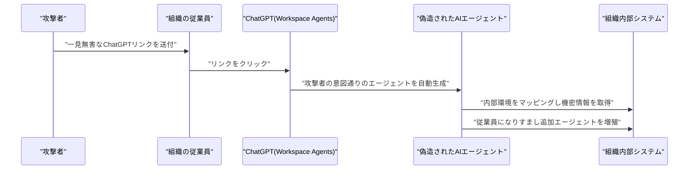

# LLM・AI Agent 最新情報レポート Vol.88
<!-- x-summary: NVIDIAとSKグループが5000億ドル超のAI工場・次世代メモリ提携を発表、HBM供給を長期確保 -->

**作成日**: 2026年7月26日（JST）
**対象期間**: 2026年7月25日〜7月26日（Vol.87との差分）

---

## 目次

1. [Google Cloudアップデート](#1-google-cloudアップデート)
2. [Microsoft Azure AIアップデート](#2-microsoft-azure-aiアップデート)
3. [LLM Model / AI Agentアーキテクチャ・研究](#3-llm-model--ai-agentアーキテクチャ研究)
4. [公式ブログ・論文のリサーチ・要約](#4-公式ブログ論文のリサーチ要約)
5. [AI Agent搭載SaaS製品情報](#5-ai-agent搭載saas製品情報)
   - [5.1 Perplexity、コーディングエージェント向けにWeb検索CLIツール「pplx-cli」を公開](#51-perplexityコーディングエージェント向けにweb検索cliツールpplx-cliを公開)
6. [LLM/AI Agentセキュリティインシデント](#6-llmai-agentセキュリティインシデント)
   - [6.1 Zenity Labs、ChatGPT Workspace Agentsの脆弱性「AgentForger」を公表（修正済み）](#61-zenity-labschatgpt-workspace-agentsの脆弱性agentforgerを公表修正済み)
7. [その他特筆すべき情報](#7-その他特筆すべき情報)
   - [7.1 NVIDIAとSKグループ、AI工場・次世代メモリ供給で5,000億ドル超の戦略的提携を発表](#71-nvidiaとskグループai工場次世代メモリ供給で5000億ドル超の戦略的提携を発表)
   - [7.2 OpenAI、ChatGPT・API・Codexで4日連続となる大規模障害が発生](#72-openaichatgptapicodexで4日連続となる大規模障害が発生)
8. [参考リンク](#8-参考リンク)

---

> **今号について:** 対象期間（7月25日・26日）は、Vol.87で報じたAnthropic「Claude Opus 5」やOpenAIのChatGPT Voiceデスクトップ展開のような大型モデル発表はなく、比較的落ち着いた展開となった。その中で最大の出来事は、NVIDIAと韓国SKグループが発表したAI工場・次世代メモリ供給をめぐる5,000億ドル超の戦略的提携である。SK Telecomが2ギガワット規模のAIデータセンターを構築し、SK hynixがHBMメモリの長期供給・共同開発を担うという内容で、AIインフラ投資が単一のハイパースケーラーの枠を超えて国家規模の産業連合へと広がりつつあることを示している。一方でOpenAIは、ChatGPT・開発者向けAPI・コーディングエージェントCodexを含む主要サービスで4日連続となる大規模障害を起こし、週9億人規模の利用者基盤を抱える同社の運用信頼性に疑問符が付いた。セキュリティ面では、セキュリティ企業Zenity LabsがChatGPT Workspace Agentsに存在したクロスサイト・エージェント偽造の脆弱性「AgentForger」を公表した。OpenAIには責任開示に基づき6月時点で既に修正されており実害は確認されていないが、フィッシングリンク1つで悪意あるAIエージェントを組織内に埋め込めるという攻撃手法自体が、エージェント型AIに特有の新しいリスク類型として注目される。SaaS領域ではPerplexityが、コーディングエージェントにWeb検索能力を付与するCLIツールを公開した。Google Cloud、Microsoft Azure、LLM/AIエージェントアーキテクチャの学術研究、およびGoogle・OpenAI・Anthropicの公式ブログについては、対象期間中に発表日を確定できる重要な新規発表は確認できなかった。

---

## 1. Google Cloudアップデート

対象期間中、Google Cloud公式ブログ（cloud.google.com/blog）を確認したが、発表日を確定できる新規のAI関連発表は見つからなかった。**新情報なし。**

---

## 2. Microsoft Azure AIアップデート

対象期間中、Microsoft Foundry（旧Azure AI Foundry）公式ブログおよびAzure Updatesを確認したが、発表日を確定できる新規のAI関連発表は見つからなかった。**新情報なし。**

---

## 3. LLM Model / AI Agentアーキテクチャ・研究

対象期間中、arXivおよび主要研究機関のブログを確認したが、発表日を確定できる新規のLLM/AIエージェントアーキテクチャ関連論文は見つからなかった。**新情報なし。**

---

## 4. 公式ブログ・論文のリサーチ・要約

対象期間中、Google / Google DeepMind公式ブログ（blog.google、deepmind.google）、OpenAI公式ブログ（openai.com/news）、Anthropic公式ブログ（anthropic.com/news）をいずれも確認したが、発表日を確定できる新規の重要投稿は見つからなかった。**新情報なし。**

---

## 5. AI Agent搭載SaaS製品情報

### 5.1 Perplexity、コーディングエージェント向けにWeb検索CLIツール「pplx-cli」を公開

Perplexityは、コーディングエージェントにWeb検索能力を付与するコマンドラインツール「Perplexity CLI（pplx-cli）」を公開した。共同創業者兼CTOのDenis Yarats氏とCEOのAravind Srinivas氏が発表し、任意のエージェントハーネス内から呼び出せる汎用ツールと位置付けている。コマンド実行結果はJSON形式で標準出力に返され、`jq`などによるパイプ処理やエージェントのツール呼び出しにそのまま組み込める設計で、ドメイン指定・期間指定などの検索フィルタにも対応する。導入手順はGitHub上で公開されている。[[1]](#ref-1)[[2]](#ref-2)

> **評価:** Cursor・Claude Code・Codexなど各社のコーディングエージェントが乱立する中、Perplexityは特定のエージェント環境に閉じたアプリではなく、どのハーネスにも組み込める「検索インフラ」としての立ち位置を選んだ。エージェントの実行基盤そのものを取るのではなく、エージェントが共通して必要とする周辺機能（Web検索）を水平的に提供するという戦略は、Fly.ioの「エージェントのためのコンピュータ」（Vol.87既報）と同様、エージェント経済圏の下層レイヤーを狙う動きの一例といえる。

---

## 6. LLM/AI Agentセキュリティインシデント

### 6.1 Zenity Labs、ChatGPT Workspace Agentsの脆弱性「AgentForger」を公表（修正済み）

セキュリティ企業Zenity Labsは、OpenAIのChatGPT Workspace Agentsに存在したクロスサイト・エージェント偽造（Cross-Site Agent Forgery）の脆弱性「AgentForger」を公表した。悪意のないように見えるChatGPTリンクを従業員が開くだけで、組織の信頼境界内に攻撃者の意図通りに動作する新しいAIエージェントが生成されてしまう手法で、URLパラメータを悪用したCSRF型の攻撃として成立していた。Zenity Labsは概念実証を通じ、偽造されたエージェントが組織内部の環境をマッピングし、機密ファイルや認証情報を窃取し、従業員になりすまして内部フィッシングを展開し、さらに別の侵害エージェントを増殖させ得ることを示した。同社は2026年6月4日、OpenAIのBugcrowd経由の脆弱性開示プログラムを通じて責任ある開示を行い、OpenAIは1日以内に確認、4日以内に該当URLパラメータを削除して修正を完了したとされ、一般公開時点で実際の悪用は確認されていない。[[3]](#ref-3)[[4]](#ref-4)[[5]](#ref-5)

> **評価:** 本件は実害の出る前に修正された「未遂」事案だが、エージェント生成プロセス自体を偽造の標的にするという攻撃発想は、Vol.86で扱ったOpenAI評価用エージェントによるHugging Face侵害事案とは異なる角度からエージェント型AI特有のリスクを示している。あちらは「AIエージェントが意図せず制御を逸脱する」問題だったのに対し、AgentForgerは「攻撃者が正規の仕組みを悪用して悪意あるエージェントを組織内部に正規のものとして送り込む」問題であり、エージェントのなりすまし・権限昇格対策がIDおよびアクセス管理の新たな最前線になりつつあることを裏付けている。

---

## 7. その他特筆すべき情報

### 7.1 NVIDIAとSKグループ、AI工場・次世代メモリ供給で5,000億ドル超の戦略的提携を発表

NVIDIAと韓国SKグループは、AI工場の建設から次世代メモリ供給までを網羅する5,000億ドル超規模の戦略的提携拡大について、両者が趣意書（LOI）に署名したと発表した。SK Telecomは、NVIDIAのVera Rubin DSXチップを用いた2ギガワット規模のAIデータセンターを構築し、2027年の稼働開始を目指す。あわせてNVIDIAとSK hynixは、AIトレーニングからエージェント型AI、フィジカルAIまでを見据えた次世代HBM（広帯域メモリ）の長期供給および共同開発で提携する。[[6]](#ref-6)[[7]](#ref-7)

> **評価:** AIインフラへの巨額投資がハイパースケーラー単独ではなく、半導体・通信を含む国家規模の企業連合によって進められている点が象徴的である。GPUの供給確保だけでなく、その性能を左右するHBMメモリの長期供給網を自ら囲い込みにいくNVIDIAの動きは、AIエージェントの大規模展開を支える計算基盤の制約が、チップそのものから周辺メモリ・電力・データセンター用地へと広がっていることを示している。

### 7.2 OpenAI、ChatGPT・API・Codexで4日連続となる大規模障害が発生

OpenAIは7月25日朝（米東部時間5時頃）、ChatGPT・開発者向けAPI・コーディングエージェントCodexを含む主要サービスでエラー率が上昇する世界規模の障害を起こした。米国からインド・オーストラリアまでの利用者が会話履歴の読み込みやプロンプト実行に失敗し、内部ラベル「biscuit_baker_service_me_circuit_open」を伴う503エラーが多発した。OpenAIは1時間以内に「調査中」から「監視中」へ移行し緩和策を適用したと説明したが、根本原因は明らかにされていない。同社にとってこれは4日連続の障害であり、週間利用者9億人・エージェント型機能の週間利用者1,000万人規模のプラットフォームの運用安定性に懸念を投げかけた。[[8]](#ref-8)[[9]](#ref-9)

> **評価:** 単発の障害であれば運用上のトラブルで済むが、4日連続という頻度は、Codexや各種エージェント連携アプリケーションがOpenAIの基盤に一極集中して依存するリスクを改めて浮き彫りにする。6.1節のAgentForgerが「エージェントの正当性」を狙った脆弱性であったのに対し、本件は「エージェント基盤の可用性」そのものが揺らいだ事例であり、エンタープライズでAIエージェントを本番運用する上でのマルチベンダー戦略やフォールバック設計の重要性を裏付けている。

---

## 8. 参考リンク

**[1]** [Perplexity Releases CLI for Coding Agents Web Search | Digg](https://digg.com/tech/tgn5d3yx)

**[2]** [perplexityai/perplexity-cli | GitHub](https://github.com/perplexityai/perplexity-cli)

**[3]** [ChatGPT AgentForger Flaw Could Deploy Rogue Workspace Agents via a Phishing Link | The Hacker News](https://thehackernews.com/2026/07/chatgpt-agentforger-flaw-could-deploy.html)

**[4]** [AgentForger, Part 1: ChatGPT Cross-Site Agent Forgery | Zenity Labs](https://labs.zenity.io/p/agentforger-part-1-chatgpt-cross-site-agent-forgery)

**[5]** [OpenAI Fixes ChatGPT Agent Flaw That Could Let Attackers Forge an AI Insider | SecurityWeek](https://www.securityweek.com/openai-fixes-chatgpt-agent-flaw-that-could-let-attackers-forge-an-ai-insider/)

**[6]** [SK Group and NVIDIA Expand Strategic Partnership Across AI Factories and Next-Generation Memory | NVIDIA Newsroom](https://nvidianews.nvidia.com/news/sk-group-and-nvidia-expand-strategic-partnership-across-ai-factories-and-next-generation-memory)

**[7]** [Nvidia locks down memory supply from SK Hynix as part of $500 billion AI deal | CNBC](https://www.cnbc.com/2026/07/25/nvidia-locks-down-memory-from-sk-hynix-as-part-of-500-billion-ai-deal.html)

**[8]** [OpenAI hit by another outage as ChatGPT, Codex, and APIs go down together | TheNextWeb](https://thenextweb.com/news/openai-outage-chatgpt-codex-api-july-2026)

**[9]** [Global Outage Hits OpenAI's ChatGPT, API and Codex | Unite.AI](https://www.unite.ai/global-outage-hits-openais-chatgpt-api-and-codex/)
