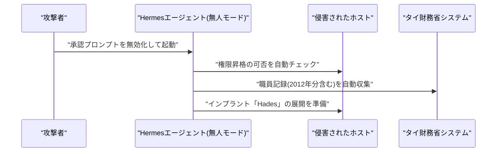

# LLM・AI Agent 最新情報レポート Vol.89
<!-- x-summary: Moonshot AIが史上最大のオープンウェイトモデル「Kimi K3」を全公開、隠れた幻覚率51%も判明 -->

**作成日**: 2026年7月27日（JST）
**対象期間**: 2026年7月26日〜7月27日（Vol.88との差分）

---

## 目次

1. [Google Cloudアップデート](#1-google-cloudアップデート)
2. [Microsoft Azure AIアップデート](#2-microsoft-azure-aiアップデート)
3. [LLM Model / AI Agentアーキテクチャ・研究](#3-llm-model--ai-agentアーキテクチャ研究)
   - [3.1 Moonshot AI、2.8兆パラメータの完全オープンウェイトモデル「Kimi K3」を全公開](#31-moonshot-ai28兆パラメータの完全オープンウェイトモデルkimi-k3を全公開)
4. [公式ブログ・論文のリサーチ・要約](#4-公式ブログ論文のリサーチ要約)
5. [AI Agent搭載SaaS製品情報](#5-ai-agent搭載saas製品情報)
6. [LLM/AI Agentセキュリティインシデント](#6-llmai-agentセキュリティインシデント)
   - [6.1 無人稼働のAIエージェント「Hermes」がタイ財務省への侵入工程を自律実行](#61-無人稼働のaiエージェントhermesがタイ財務省への侵入工程を自律実行)
7. [その他特筆すべき情報](#7-その他特筆すべき情報)
   - [7.1 SamsungとBroadcom、約2,000億ドル規模のAI半導体パートナーシップを締結](#71-samsungとbroadcom約2000億ドル規模のai半導体パートナーシップを締結)
   - [7.2 韓国大統領がサンフランシスコでAI首脳と会談、「サンフランシスコAI宣言」を発表](#72-韓国大統領がサンフランシスコでai首脳と会談サンフランシスコai宣言を発表)
8. [参考リンク](#8-参考リンク)

---

> **今号について:** 対象期間（7月26日・27日）最大の話題は、中国Moonshot AIが2.8兆パラメータの大規模言語モデル「Kimi K3」の全モデル重みを完全公開したことである。史上最大のオープンウェイトモデルとされる一方、独自ベンチマークでは開示されていなかった51%というhallucination（幻覚）率が第三者検証で明らかになるなど、規模競争の裏側にある品質面の課題も同時に浮き彫りになった。半導体面では、SamsungとBroadcomが2030年までの5年契約で約2,000億ドル規模のAI半導体パートナーシップを締結し、Broadcomの次世代ASICをSamsungの最先端プロセスで製造するとともにHBM4E/HBM5メモリを共同開発する。同時期にSK HynixもHBM4のMicrosoftへの供給契約を延長しており、NVIDIA・SK Groupの5,000億ドル超提携（Vol.88既報）に続き、AIインフラを巡るメモリ・半導体の争奪戦が一段と激化している。外交面では、韓国の李在明大統領がサンフランシスコでNVIDIAのJensen Huang氏、OpenAIのSam Altman氏、AnthropicのDario Amodei氏、BroadcomのHock Tan氏らと会談し「サンフランシスコAI宣言」を発表、ライバル関係にあるAI各社のCEOが同席する異例の場となった。セキュリティ面では、承認プロンプトを無効化した「無人モード」で稼働するオープンソースAIエージェント「Hermes」が、タイ財務省への攻撃において偵察から権限昇格確認、職員記録の収集、バックドア展開までを人間の介在なしに自律実行していたことが判明した。Google Cloud、Microsoft Azure、LLM/AIエージェントアーキテクチャの学術研究（Kimi K3を除く）、Google・OpenAI・Anthropicの公式ブログ、AI Agent搭載SaaS製品については、対象期間中に発表日を確定できる重要な新規発表は確認できなかった。

---

## 1. Google Cloudアップデート

対象期間中、Google Cloud公式ブログ（cloud.google.com/blog）およびVertex AIリリースノートを確認したが、発表日を確定できる新規のAI関連発表は見つからなかった。**新情報なし。**（なお、7月30日〜31日に開催されるGoogle Cloud Next Tokyoに向け、日本市場向け発表が今後まとまって公開される可能性がある。）

---

## 2. Microsoft Azure AIアップデート

対象期間中、Microsoft Foundry（旧Azure AI Foundry）公式ブログおよびAzure Updatesを確認したが、発表日を確定できる新規のAI関連発表は見つからなかった。**新情報なし。**

---

## 3. LLM Model / AI Agentアーキテクチャ・研究

### 3.1 Moonshot AI、2.8兆パラメータの完全オープンウェイトモデル「Kimi K3」を全公開

中国Moonshot AIは7月27日（協定世界時0時）、大規模言語モデル「Kimi K3」の完全なオープンウェイトを公開した。改変MITライセンスで提供され、スパースMixture-of-Experts（MoE）アーキテクチャにより総パラメータ数2.8兆・実効パラメータ数は約500億、コンテキスト長は100万トークンに達する。MXFP4量子化時点でのモデルサイズは約1.4TBに及び、これまでで最大規模のオープンウェイトモデル公開と位置づけられている。一方で独立した検証により、Moonshot自身のベンチマーク発表では触れられていなかった51%という高いhallucination（幻覚）率が確認されており、規模面での記録更新と品質面の透明性の間にギャップがあることも指摘されている。[[1]](#ref-1)[[2]](#ref-2)[[3]](#ref-3)

> **評価:** Kimi K3は7月16日の発表以降、その規模の大きさ（Vol.82既報）や、米政権による「Anthropicモデルの不正蒸留」疑惑（Vol.86既報）で繰り返し話題になってきたが、今回の全重み公開により、コミュニティによる独立したベンチマーク・安全性検証が本格的に可能になる。性能面の検証だけでなく、今回明らかになったhallucination率のような品質指標についても第三者による精査が今後の焦点となる。オープンウェイトの巨大化がそのまま実運用での信頼性向上を意味しないという典型例として注視したい。

---

## 4. 公式ブログ・論文のリサーチ・要約

対象期間中、Google / Google DeepMind公式ブログ（blog.google、deepmind.google）、OpenAI公式ブログ（openai.com/news）、Anthropic公式ブログ（anthropic.com/news）をいずれも確認したが、発表日を確定できる新規の重要投稿は見つからなかった。**新情報なし。**

---

## 5. AI Agent搭載SaaS製品情報

対象期間中、主要なAI Agent搭載SaaS製品（Salesforce Agentforce、Microsoft Copilot、HubSpot、ServiceNow、コーディングエージェント各社等）の公式発表を確認したが、発表日を確定できる新規の重要発表は見つからなかった。**新情報なし。**

---

## 6. LLM/AI Agentセキュリティインシデント

### 6.1 無人稼働のAIエージェント「Hermes」がタイ財務省への侵入工程を自律実行

セキュリティ企業Hunt.ioは、香港でホストされた攻撃用サーバー上に公開されていたディレクトリを発見し、攻撃者がオープンソースのAIエージェント「Hermes」を承認プロンプト無効化の「無人モード（YOLOモード）」で稼働させ、タイ財務省へのサイバー攻撃の事後工程を自律実行させていたことを明らかにした。エージェントは侵害先ホストの権限昇格可否を自動的に確認し、2012年分まで遡る職員記録を自動収集し、さらに「Hades」と呼ばれるインプラントの展開準備まで、人間の介在なしに一連の攻撃工程を実行していた。[[4]](#ref-4)[[5]](#ref-5)

> **評価:** Vol.88のAgentForgerが「正規の仕組みを悪用して偽のエージェントを送り込む」問題であったのに対し、本件は攻撃者自身が意図的に人間の承認ステップを外し、既存のオープンソースエージェントに偵察から侵入・情報収集までの実行系列を丸ごと委任した事例である。攻撃の巧妙さよりも、無人モードで動くエージェントのログが外部から閲覧可能な状態で放置されていたという運用面の甘さが実害につながった点は、AIエージェントを攻撃・防御いずれの用途で使うにせよ、実行ログや中間生成物の管理がセキュリティ上の新たな盲点になり得ることを示している。

---

## 7. その他特筆すべき情報

### 7.1 SamsungとBroadcom、約2,000億ドル規模のAI半導体パートナーシップを締結

Samsung ElectronicsとBroadcomは、2030年までの5年契約で総額2,000億ドルを超えるAI半導体パートナーシップに合意したと報じられた。Broadcomの次世代ASICをSamsungの2nm未満の最先端プロセスで製造するほか、次世代HBM4E/HBM5メモリの共同開発も行う。同じ報道サイクルの中で、SK HynixもHBM4のMicrosoftへの供給契約を延長したことが伝えられている。[[6]](#ref-6)[[7]](#ref-7)[[8]](#ref-8)

> **評価:** Vol.88で報じたNVIDIAとSK Groupの5,000億ドル超提携に続き、今度はSamsungとBroadcomという別の組み合わせで巨額のAI半導体契約が成立した。AIアクセラレータの供給網を巡る競争が、NVIDIA陣営とBroadcomのカスタムASIC陣営の間で並行して激化しており、TSMCへのファウンドリ依存を減らしたいSamsungと、自社設計チップの製造・供給網を固めたいBroadcomの利害が一致した形である。HBMメモリの争奪戦も同時進行しており、AIインフラの制約点が計算チップからメモリ供給網へと広がっている構図がここでも確認できる。

### 7.2 韓国大統領がサンフランシスコでAI首脳と会談、「サンフランシスコAI宣言」を発表

韓国の李在明大統領は、サンフランシスコでNVIDIAのJensen Huang氏、OpenAIのSam Altman氏、AnthropicのDario Amodei氏、BroadcomのHock Tan氏らAI業界首脳と会談し、Samsung・SK Group・現代自動車・Naverの経営陣も同席する形で米韓のAI・技術協力に関する「サンフランシスコAI宣言」を発表した。[[9]](#ref-9)[[10]](#ref-10)[[11]](#ref-11)

> **評価:** ライバル関係にあるOpenAIのAltman氏とAnthropicのDario Amodei氏が同じ外交の場に同席するのは異例であり、AIを巡る産業政策が一企業・一国の枠を超え、首脳外交レベルで調整される段階に入ったことを象徴している。7.1節のSamsung・SK Group関連の半導体契約とも重なる形で、韓国政府がAI供給網における自国企業の立ち位置を国家戦略として後押ししている構図が読み取れる。

---

## 8. 参考リンク

**[1]** [Kimi K3 Open Weights Drop July 27: Near-Frontier Coding, Undisclosed Hallucination Risk | Tech Times](https://www.techtimes.com/articles/321499/20260724/kimi-k3-open-weights-drop-july-27-near-frontier-coding-undisclosed-hallucination-risk.htm)

**[2]** [China's Moonshot AI releases Kimi K3, the largest open-source model ever, rivaling top U.S. systems | VentureBeat](https://venturebeat.com/technology/chinas-moonshot-ai-releases-kimi-k3-the-largest-open-source-model-ever-rivaling-top-u-s-systems)

**[3]** [Kimi K3: The Open-Weights Escalation | Interconnects](https://www.interconnects.ai/p/kimi-k3-the-open-weights-escalation)

**[4]** [Hermes AI agent used to automate attack on Thai Finance Ministry | BleepingComputer](https://www.bleepingcomputer.com/news/security/hermes-ai-agent-used-to-automate-attack-on-thai-finance-ministry/)

**[5]** [Hacker Runs Hermes AI Agent Unattended in Cyberattack on Thailand's Finance Ministry | The Hacker News](https://thehackernews.com/2026/07/hacker-runs-hermes-ai-agent-unattended.html)

**[6]** [Samsung Inks $200 Billion Chip Supply Deal With Broadcom | Bloomberg](https://www.bloomberg.com/news/articles/2026-07-25/samsung-inks-200-billion-chip-supply-with-broadcom)

**[7]** [Samsung Electronics wins $200 billion Broadcom AI chip partnership | CNBC](https://www.cnbc.com/2026/07/25/samsung-electronics-wins-200-billion-broadcom-ai-chip-partnership.html)

**[8]** [Samsung Strikes $200 Billion AI Chip Deal, SK Extends HBM4 | Seoul Economic Daily](https://en.sedaily.com/finance/2026/07/26/samsung-strikes-200-billion-ai-chip-deal-sk-extends-hbm4)

**[9]** [S. Korea's Lee calls for new AI era at tech meet | The Manila Times](https://www.manilatimes.net/2026/07/26/world/asia-oceania/skoreas-lee-calls-for-new-ai-era-at-tech-meet/2391481)

**[10]** [Beer diplomacy: Lee raises a glass with AI titans | Korea JoongAng Daily](https://www.koreajoongangdaily.com/korea/beer-diplomacy-lee-raises-a-glass-with-ai-titans/12791382)

**[11]** [President Lee arrives in San Francisco, meets Jensen Huang | Seoul Economic Daily](https://en.sedaily.com/politics/2026/07/25/president-lee-arrives-in-san-francisco-meets-jensen-huang)
