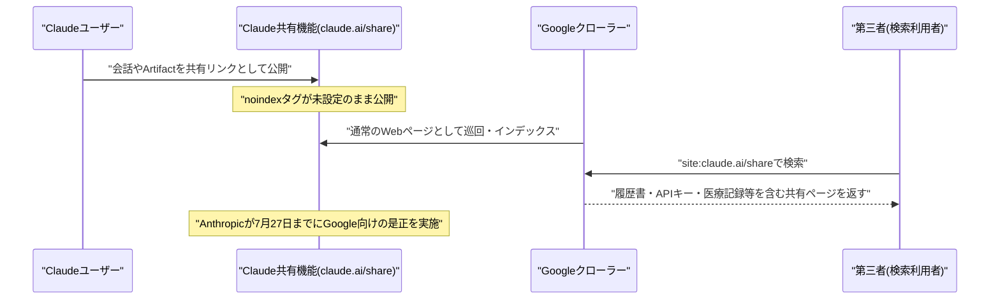

# LLM・AI Agent 最新情報レポート Vol.90
<!-- x-summary: NVIDIAがOpenAIの巨大データセンターに最大2500億ドルの資金保証を検討、史上最大級のAIインフラ投資に -->

**作成日**: 2026年7月28日（JST）
**対象期間**: 2026年7月27日〜7月28日（Vol.89との差分）

---

## 目次

1. [Google Cloudアップデート](#1-google-cloudアップデート)
2. [Microsoft Azure AIアップデート](#2-microsoft-azure-aiアップデート)
3. [LLM Model / AI Agentアーキテクチャ・研究](#3-llm-model--ai-agentアーキテクチャ研究)
4. [公式ブログ・論文のリサーチ・要約](#4-公式ブログ論文のリサーチ要約)
5. [AI Agent搭載SaaS製品情報](#5-ai-agent搭載saas製品情報)
   - [5.1 Keyfactor、AIエージェント向けID基盤「Cofide」の買収を発表](#51-keyfactoraiエージェント向けid基盤cofideの買収を発表)
   - [5.2 Emerson、発電・上下水道向けOvation AIエージェントを拡充](#52-emerson発電上下水道向けovation-aiエージェントを拡充)
6. [LLM/AI Agentセキュリティインシデント](#6-llmai-agentセキュリティインシデント)
   - [6.1 Claudeの共有チャット・ArtifactsがGoogle検索にインデックスされ機密情報が露出](#61-claudeの共有チャットartifactsがgoogle検索にインデックスされ機密情報が露出)
   - [6.2 ワークフロー自動化基盤n8nでサンドボックスエスケープ脆弱性が発覚](#62-ワークフロー自動化基盤n8nでサンドボックスエスケープ脆弱性が発覚)
7. [その他特筆すべき情報](#7-その他特筆すべき情報)
   - [7.1 NVIDIA、OpenAIの巨大データセンター向けに最大2,500億ドルの資金保証を検討](#71-nvidiaopenaiの巨大データセンター向けに最大2500億ドルの資金保証を検討)
   - [7.2 ロボティクス新興Enigma、7,100万ドルのシード調達でステルスから始動](#72-ロボティクス新興enigma7100万ドルのシード調達でステルスから始動)
8. [参考リンク](#8-参考リンク)

---

> **今号について:** 対象期間（7月27日・28日）最大の話題は、NVIDIAがOpenAIの巨大データセンター案件に対し最大2,500億ドル規模の資金保証を検討していると報じられたことである。SoftBankのエネルギー子会社が旧ウラン濃縮施設跡地（オハイオ州パイクトン）に建設中の10ギガワット級データセンターをOpenAIがリースできるよう、NVIDIAが融資債務を保証する枠組みで、施設内に納入するチップ向けの別枠約3,500億ドルの資金支援も協議されているとされ、案件全体は5,000億ドルを超える可能性がある。これが実現すれば史上最大級のデータセンター案件となる見込みだが、条件は未確定で破談の可能性も残る。セキュリティ面では、Anthropicの「Claude」で作成した共有チャットやArtifactsが、noindex設定の不備によりGoogle検索にインデックスされ、実名入り履歴書やAPIキー、医療記録など機微な情報が第三者から閲覧可能な状態になっていたことが判明した。Anthropicは7月27日までにGoogle側の是正を行ったが、Bing等への波及や第三者によるスクレイピングの可能性は残るとされる。またワークフロー自動化基盤「n8n」では、式（expression）のサンドボックスを回避してOS上で任意のコマンドを実行できる脆弱性（CVSS 8.7）が発覚し、修正版が公開された。SaaS領域では、ID管理企業KeyfactorがAIエージェント向けワークロードID基盤「Cofide」の買収を発表したほか、EmersonがOvation Automation Platform向けに発電・上下水道インフラ運用者向けの新AIエージェント群を投入した。ロボティクス分野では、汎用ロボット制御向け基盤モデルを開発するイスラエル発新興企業Enigmaが7,100万ドルのシードラウンドとともにステルスを脱した。Google Cloud、Microsoft Azure、LLM/AIエージェントアーキテクチャの学術研究、Google・OpenAI・Anthropicの公式ブログについては、対象期間中に発表日を確定できる重要な新規発表は確認できなかった。

---

## 1. Google Cloudアップデート

対象期間中、Google Cloud公式ブログ（cloud.google.com/blog）およびVertex AIリリースノートを確認したが、発表日を確定できる新規のAI関連発表は見つからなかった。**新情報なし。**

---

## 2. Microsoft Azure AIアップデート

対象期間中、Microsoft Foundry（旧Azure AI Foundry）公式ブログおよびAzure Updatesを確認したが、発表日を確定できる新規のAI関連発表は見つからなかった。**新情報なし。**

---

## 3. LLM Model / AI Agentアーキテクチャ・研究

対象期間中、新規のLLMモデルリリースおよびAI Agentアーキテクチャに関するarXiv等の学術論文を確認したが、発表日を確定できる重要な新規発表・論文は見つからなかった。**新情報なし。**

---

## 4. 公式ブログ・論文のリサーチ・要約

対象期間中、Google / Google DeepMind公式ブログ（blog.google、deepmind.google）、OpenAI公式ブログ（openai.com/news）、Anthropic公式ブログ（anthropic.com/news）をいずれも確認したが、発表日を確定できる新規の重要投稿は見つからなかった。**新情報なし。**（なお、Anthropicの「Claude」共有機能に関する事案は同社公式ブログの投稿ではなく第三者メディアの報道であるため、6.1節にて扱う。）

---

## 5. AI Agent搭載SaaS製品情報

### 5.1 Keyfactor、AIエージェント向けID基盤「Cofide」の買収を発表

デジタルID・PKI管理企業のKeyfactorは7月27日、英国のワークロードID基盤スタートアップ「Cofide」の買収意向を発表した。買収により、自社の「Trust Control Plane」をAIエージェントやクラウドネイティブなワークロードにまで拡張し、非人間（non-human）IDを単一の仕組みで管理・統制できるようにする狙いがある。Cofideの基盤はSPIFFE、OAuth、OIDCといったオープン標準に基づき、各AIエージェントに固有かつ短命な検証済みIDを付与することで、静的で盗用されやすい認証情報への依存を減らす設計になっている。Cofideの創業者Matthew Bates氏は、2020年にVenafiに買収されたJetstackの共同創業者でもある。買収額は非公開で、Cofideのチームと技術は即時Keyfactorに統合される予定。[[1]](#ref-1)[[2]](#ref-2)[[3]](#ref-3)

> **評価:** AIエージェントが人間の承認なしに社内外のシステムへアクセスする場面が増える中、エージェント自体を「静的パスワードで守られた特権アカウント」ではなく「短命な検証済みIDを持つワークロード」として扱う発想は、6.2節のn8n脆弱性のように認証情報の窃取が被害拡大の起点になりやすい現状に対する構造的な対策になり得る。IDaaS企業がAIエージェント向けID管理を製品ラインに組み込む動きは今後さらに広がると見られる。

### 5.2 Emerson、発電・上下水道向けOvation AIエージェントを拡充

産業オートメーション大手のEmersonは7月27日、発電・上下水道インフラの運用者向けに、Ovation Automation Platform 4.0に統合する5種類の新しいAIエージェント（シーケンスアシスタント、アラームインサイト、予知保全、根本原因分析、ループ性能監視の各エージェント）を発表した。従来別々の分析ツールを行き来する必要があった診断作業をオペレーターの既存ワークフローに直接組み込むことで、数時間〜数日かかっていた診断・分析作業を数分に短縮するという。人間がなお主導権を持つ「human-in-the-loop」設計を採用し、エージェントはバックグラウンドでプラント状況を分析し最適化案を能動的に提案する。Emersonは今後、運用・保守・最適化領域をカバーする追加28種のOvation AIエージェントを展開する計画としている。[[4]](#ref-4)[[5]](#ref-5)[[6]](#ref-6)

> **評価:** 電力・水道という高い信頼性が求められる重要インフラ領域でも、AIエージェントを既存の制御システムに直接埋め込む形での実運用が進んでいる。汎用チャット型エージェントとは異なり、特定ドメインの計器・アラームデータに特化したエージェント群を段階的に拡充していくアプローチは、Salesforce Agentforceなど業務SaaS領域で見られる「垂直特化型エージェント」の流れが重要インフラ分野にも波及していることを示している。

---

## 6. LLM/AI Agentセキュリティインシデント

### 6.1 Claudeの共有チャット・ArtifactsがGoogle検索にインデックスされ機密情報が露出

7月25日のRedditへの投稿をきっかけに、Anthropicの「Claude」で作成した共有チャットおよびArtifacts（`claude.ai/share`配下の公開ページ）が、検索エンジンによるインデックスを防ぐ「noindex」タグの設定漏れにより、Google検索で`site:claude.ai/share`のような検索から誰でも閲覧可能な状態になっていたことが判明した。7月26日時点で、実名・電話番号入りの履歴書、APIキー、暗号資産ウォレット情報、弁護士による倫理案件のメモ、社会保障番号を含むとみられる文書、患者名入りの詳細な医療レポートや臨床試験結果、未就学児を含む子どもの氏名・連絡先、社外秘の社内文書、従業員の個人情報を含む人事評価など、機微な内容が多数閲覧できる状態にあった。Anthropicは、共有リンクはユーザー自身がクロール可能な場所（掲示板等）に投稿しない限り推測・発見されない設計であり、同社としてこれらのページのサイトマップを検索エンジンに送信していないとコメントした一方、Google向けの是正措置は7月27日までに完了させたが、Bing等の他の検索エンジンや第三者によるスクレイピングによる露出は完全には解消されていない可能性があるとされる。[[7]](#ref-7)[[8]](#ref-8)[[9]](#ref-9)

> **評価:** 本件は攻撃者による能動的な侵害ではなく、「共有」という基本機能に検索エンジン向けの一行の設定（noindexタグ）が欠けていたという単純な実装ミスに起因する。しかし影響範囲は、ユーザー自身が「限定共有のつもり」で作成したコンテンツが不特定多数に閲覧可能になるという、AIチャットサービス特有の構造的リスクを浮き彫りにした。AIとの対話には個人情報や社外秘情報が持ち込まれやすいだけに、共有機能を提供する各社は同種の設定漏れがないか点検する必要があるだろう。

### 6.2 ワークフロー自動化基盤n8nでサンドボックスエスケープ脆弱性が発覚

セキュリティ企業Security Joesは、2026年2月に修正済みの脆弱性（CVE-2026-27577）を調査する過程で、ワークフロー自動化基盤「n8n」に新たなサンドボックスエスケープの脆弱性（GHSA-gv7g-jm28-cr3m、CVSS 4.0スコアで8.7、7月27日時点でCVE番号は未付与）を発見したことを明らかにした。ワークフローの作成・編集権限を持つアカウントであれば、アロー関数（arrow function）の本体を悪用した式（expression）を細工することでJavaScriptサンドボックスを回避し、n8nプロセスの権限でOSコマンドを実行できるというもので、暗号化キー（N8N_ENCRYPTION_KEY）の窃取や保存済み認証情報の復号にもつながりうる。n8nはバージョン2.31.5および2.32.1で修正版を公開したが、n8n自身が示した「編集権限を信頼できるユーザーに限定する」という暫定的な緩和策は不十分だとされている。[[10]](#ref-10)[[11]](#ref-11)[[12]](#ref-12)

> **評価:** n8nのようなノーコード／ローコードのワークフロー自動化基盤は、AIエージェントの実行環境としても急速に普及しているだけに、式評価のサンドボックスという基盤的な防御層の突破は影響範囲が広い。Vol.89で報じたHermesの無人モード事案が「エージェントに人間の承認を外して実行させる」運用面のリスクだったのに対し、本件は「エージェント実行基盤そのものの隔離機構」に穴があったという点で異なる種類のリスクであり、AIエージェント基盤のセキュリティ点検は運用ルールとソフトウェア実装の両面で必要であることを改めて示している。

---

## 7. その他特筆すべき情報

### 7.1 NVIDIA、OpenAIの巨大データセンター向けに最大2,500億ドルの資金保証を検討

NVIDIAが、SoftBank Groupのエネルギー子会社SB Energyがオハイオ州パイクトン（旧ウラン濃縮施設跡地）に建設中の10ギガワット級データセンターキャンパスをOpenAIがリースできるよう、最大2,500億ドル規模の融資・債務保証を提供する方向で協議していると報じられた。この保証はデータセンターのリース料および建設債務の資金調達をカバーするもので、施設に納入するNVIDIA製チップ自体の購入資金については別途最大3,500億ドル規模の支援が協議されているとされる。案件全体ではリース・建設・チップを合わせて5,000億ドルを超える可能性があり、実現すれば史上最大級のデータセンター案件になるとみられる。営利化前で投資適格格付けを持たないOpenAIに代わってNVIDIAが信用を補完する形であり、条件は未確定で破談の可能性も残るとされる。[[13]](#ref-13)[[14]](#ref-14)[[15]](#ref-15)

> **評価:** Vol.88で報じたNVIDIA・SK Group間の5,000億ドル超提携に続き、NVIDIAがOpenAIの巨大データセンター案件そのものの信用補完役を担う形の関与が明らかになった。GPU販売企業がAI事業者の資金調達構造にまで深く入り込むことで、NVIDIAの業績とOpenAIの生存可能性が一段と相互依存する構図が強まっている。半導体・データセンター・電力インフラを巡る資金の規模が四半期ごとに更新され続けている点は、AI業界のインフラ投資が依然として拡大局面にあることを示す一方、特定少数のプレイヤーへの集中リスクとしても注視が必要である。

### 7.2 ロボティクス新興Enigma、7,100万ドルのシード調達でステルスから始動

イスラエル発のロボティクス新興企業Enigmaは7月27日、Index VenturesとRibbit Capitalが主導し、Conviction Partnersや、OpenAI・Anthropic・DeepMind・xAI・Cognition・Wiz出身者らが参加した7,100万ドルのシードラウンドとともにステルスから始動したことを発表した。創業1年に満たないJonathan Jacobi氏とGal Niv氏によって設立され、複数のハードウェア基盤にまたがって動作し、ロボット制御に必要なエンジニアリング負荷を下げる汎用基盤モデルの開発を進めている。モデルの性能そのものよりも人間とロボットの関わり方を研究し、直感的なインターフェースを実現することに重点を置くとしており、100台超のAI搭載ロボットと誰でもオンラインで対話できる一般公開の体験も同時に開始した。ヘルスケア、物流、エンターテインメント分野の企業とすでに提携しているという。[[16]](#ref-16)[[17]](#ref-17)

> **評価:** LLMの基盤モデル開発競争が一段落しつつある中、投資家やAI大手出身の人材が次に注目するのが「物理世界を制御するための基盤モデル」であることを示す事例である。ロボット単体のハードウェア性能ではなく、人間との対話・操作性に着目したアプローチは、LLMの分野で見られた「モデル性能競争」から「エージェントの使いやすさ競争」への軸足の移動と軌を一にしており、Physical AI領域でも同様の展開が今後加速する可能性がある。

---

## 8. 参考リンク

**[1]** [Keyfactor Announces Intent to Acquire Cofide to Bring Verified Identity to AI Agents and Cloud Workloads | PR Newswire](https://www.prnewswire.com/news-releases/keyfactor-announces-intent-to-acquire-cofide-to-bring-verified-identity-to-ai-agents-and-cloud-workloads-302834309.html)

**[2]** [Keyfactor to acquire Cofide as AI agents drive identity shift | Biometric Update](https://www.biometricupdate.com/202607/keyfactor-to-acquire-cofide-as-ai-agents-drive-identity-shift)

**[3]** [Keyfactor Expands Into AI Agent Identity With Cofide Deal | GovInfoSecurity](https://www.govinfosecurity.com/keyfactor-expands-into-ai-agent-identity-cofide-deal-a-32331)

**[4]** [Emerson Expands Ovation AI Portfolio with New Intelligent Agents | PR Newswire](https://www.prnewswire.com/news-releases/emerson-expands-ovation-ai-portfolio-with-new-intelligent-agents-302833750.html)

**[5]** [Emerson Launches 5 Ovation AI Agents for Power, Water | StockTitan](https://www.stocktitan.net/news/EMR/emerson-expands-ovation-ai-portfolio-with-new-intelligent-tbl4i6un2rwf.html)

**[6]** [Emerson launches AI agents for power and water operations | Investing.com](https://www.investing.com/news/company-news/emerson-launches-ai-agents-for-power-and-water-operations-93CH-4814286)

**[7]** [PSA: Your Claude shared chats and Artifacts may have ended up on Google | TechCrunch](https://techcrunch.com/2026/07/27/psa-your-claude-shared-chats-and-artifacts-may-have-ended-up-on-google/)

**[8]** [Uh-oh: Some Claude shared conversations and Artifacts appear to be indexed and publicly accessible on Google Search | VentureBeat](https://venturebeat.com/technology/uh-oh-some-claude-shared-conversations-and-artifacts-appear-to-be-indexed-and-publicly-accessible-on-google-search)

**[9]** [Claude chats and workspaces turn up on Google, revealing avoidable privacy flaw | Cybernews](https://cybernews.com/ai-news/claude-chats-artifacts-indexed-google/)

**[10]** [n8n Sandbox Escape Lets Workflow Editors Run OS Commands as the n8n Process | The Hacker News](https://thehackernews.com/2026/07/n8n-sandbox-escape-lets-workflow.html)

**[11]** [Expression sandbox escape via arrow-function bodies enabling command execution (GHSA-gv7g-jm28-cr3m) | GitHub](https://github.com/n8n-io/n8n/security/advisories/GHSA-gv7g-jm28-cr3m)

**[12]** [n8n Sandbox Escape Lets Workflow Editors Run OS Commands as the n8n Process | GuardianMSSP](https://www.guardianmssp.com/2026/07/27/n8n-sandbox-escape-lets-workflow-editors-run-os-commands-as-the-n8n-process/)

**[13]** [Nvidia and OpenAI in talks for up to $250 billion dollar backstop to fund AI infrastructure plans | CNBC](https://www.cnbc.com/2026/07/27/nvidia-and-openai-in-talks-for-up-to-250-billion-dollar-ai-backstop.html)

**[14]** [Nvidia weighs $250 billion guarantee so OpenAI can lease SoftBank's 10-gigawatt Ohio campus | Tom's Hardware](https://www.tomshardware.com/tech-industry/data-centers/nvidia-weighs-250-billion-guarantee-so-openai-can-lease-softbanks-10-gigawatt-ohio-campus)

**[15]** [Nvidia plans $250bn push to bolster OpenAI's infrastructure ambitions | Al Jazeera](https://www.aljazeera.com/economy/2026/7/27/nvidia-plans-250bn-push-to-bolster-openais-infrastructure-ambitions)

**[16]** [Enigma raises $71M to make controlling a robot as easy as adjusting the volume | TechCrunch](https://techcrunch.com/2026/07/27/enigma-raises-70m-to-make-controlling-a-robot-as-easy-as-adjusting-the-volume/)

**[17]** [Israeli AI robotics startup Enigma emerges from stealth with $71 million Seed round | Calcalistech](https://www.calcalistech.com/ctechnews/article/h1tdxjhrgx)
