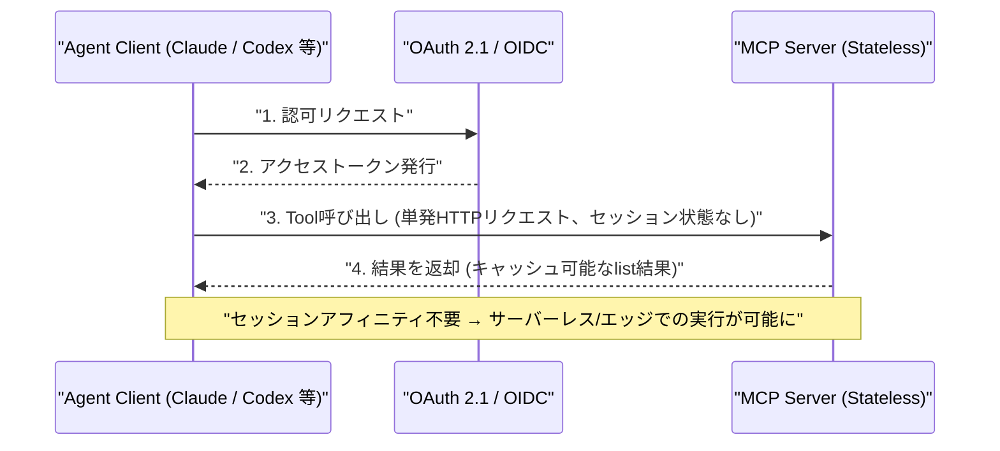

# LLM・AI Agent 最新情報レポート Vol.93
<!-- x-summary: OpenAIのGPT-5.6 Solが自ら推論基盤を書き換えて効率化、最安モデルLunaは価格80%引き下げ -->

**作成日**: 2026年7月31日（JST）
**対象期間**: 2026年7月30日〜7月31日（Vol.92との差分）

---

## 目次

1. [Google Cloudアップデート](#1-google-cloudアップデート)
   - [1.1 Oracle、Google CloudとGeminiモデルの提供拡大で連携](#11-oraclegoogle-cloudとgeminiモデルの提供拡大で連携)
2. [Microsoft Azure AIアップデート](#2-microsoft-azure-aiアップデート)
   - [2.1 Microsoft、統合Copilot「スーパーアプリ」と従量課金モデルへの転換を表明](#21-microsoft統合copilotスーパーアプリと従量課金モデルへの転換を表明)
   - [2.2 GitHub Copilot、Visual Studioに新エージェント機能を追加](#22-github-copilotvisual-studioに新エージェント機能を追加)
3. [LLM Model / AI Agentアーキテクチャ・研究](#3-llm-model--ai-agentアーキテクチャ研究)
   - [3.1 MCP、ステートレス化とOAuth 2.1強制化を柱とする大改訂「2026-07-28」を発表](#31-mcpステートレス化とoauth-21強制化を柱とする大改訂2026-07-28を発表)
   - [3.2 MIT、VLA（視覚言語行動）エージェントの反応遅延を最大11.8倍短縮する非同期推論手法を発表](#32-mitvla視覚言語行動エージェントの反応遅延を最大118倍短縮する非同期推論手法を発表)
4. [公式ブログ・論文のリサーチ・要約](#4-公式ブログ論文のリサーチ要約)
   - [4.1 Google DeepMind、全身制御に対応したロボット基盤モデル「Gemini Robotics 2」を発表](#41-google-deepmind全身制御に対応したロボット基盤モデルgemini-robotics-2を発表)
   - [4.2 OpenAI、GPT-5.6が自らの推論基盤を書き換え価格を大幅引き下げ](#42-openaigpt-56が自らの推論基盤を書き換え価格を大幅引き下げ)
5. [AI Agent搭載SaaS製品情報](#5-ai-agent搭載saas製品情報)
   - [5.1 Cequence Security、AIエージェントの権限を役割単位で制御する「Agent Personas」を発表](#51-cequence-securityaiエージェントの権限を役割単位で制御するagent-personasを発表)
   - [5.2 G2A.COM、自律型AIサポートエージェント「Dave」をグローバル展開](#52-g2acom自律型aiサポートエージェントdaveをグローバル展開)
   - [5.3 Reco、OpenAIの「Select Partner」に認定](#53-recoopenaiのselect-partnerに認定)
6. [LLM/AI Agentセキュリティインシデント](#6-llmai-agentセキュリティインシデント)
   - [6.1 Microsoft Copilot for Word、文書を介して自己増殖する「AIワーム」の脆弱性が発覚](#61-microsoft-copilot-for-word文書を介して自己増殖するaiワームの脆弱性が発覚)
   - [6.2 「DangleGeddon」、AIによる放置DNSレコードの兵器化を警告](#62-danglegeddonaiによる放置dnsレコードの兵器化を警告)
   - [6.3 AIエージェント基盤「Ruflo」に認証なしで乗っ取り可能な致命的脆弱性](#63-aiエージェント基盤rufloに認証なしで乗っ取り可能な致命的脆弱性)
7. [その他特筆すべき情報](#7-その他特筆すべき情報)
   - [7.1 Nscale、Rayの開発元Anyscaleを約16.5億ドルで買収](#71-nscalerayの開発元anyscaleを約165億ドルで買収)
   - [7.2 EU、300億ユーロ規模の「AIギガファクトリー」公募を開始](#72-eu300億ユーロ規模のaiギガファクトリー公募を開始)
   - [7.3 AI・半導体株が急落、時価総額1兆ドル超が消失](#73-ai半導体株が急落時価総額1兆ドル超が消失)
   - [7.4 Google DeepMind、AlphaFold専任チームを解体しGeminiへ再配置](#74-google-deepmindalphafold専任チームを解体しgeminiへ再配置)
   - [7.5 xAI、AI「ヌード生成」禁止法を巡りミネソタ州を提訴](#75-xaiaiヌード生成禁止法を巡りミネソタ州を提訴)
   - [7.6 米連邦判事、Anthropic利用禁止の政府側根拠を「不十分」と指摘](#76-米連邦判事anthropic利用禁止の政府側根拠を不十分と指摘)
8. [参考リンク](#8-参考リンク)

---

> **今号について:** 対象期間（7月30日〜31日）で最大の注目点は、OpenAIがGPT-5.6の価格改定を発表した裏側にある技術的事実である。最上位モデル「Sol」が人間の監督下で自らの本番推論カーネルを書き換え、数百件のトークン生成実験を自律的に設計・実行した上、下位モデル「Luna」を「かなり曖昧なプロンプト」のみから自律的にファインチューニングしたと公表され、結果として推論コストが約20%削減、Lunaの価格が80%引き下げられた。AIモデルが自らの推論基盤を最適化する「自己改善」が実運用の値付けに直結した点で象徴的な事例である。アーキテクチャ面では、AIエージェントが外部ツールを呼び出す際の事実上の標準規格「MCP」が公開以来最大級の改訂（2026-07-28仕様）を迎え、ステートフルな双方向設計からステートレスなリクエスト/レスポンス型へ移行し、OAuth 2.1準拠を必須化するなど、サーバーレス実行やセキュリティを強く意識した内容となった。Google DeepMindは全身を使って作業できるロボット基盤モデル「Gemini Robotics 2」を発表する一方、ノーベル賞受賞技術「AlphaFold」の専任チームを解体しGemini開発へ人員を再配置していたことが判明し、リソース配分の重心がLLM開発へ一段と傾いていることを示した。セキュリティ面では、Microsoft Copilot for Wordの隠しプロンプトが文書間で自己増殖する「AIワーム」型の脆弱性や、AIエージェント基盤「Ruflo」の認証なしリモートコード実行の脆弱性など、エージェント特有の攻撃面が相次いで報告された。ビジネス面ではNscaleによるAnyscale買収（約16.5億ドル）、EUの300億ユーロ規模「AIギガファクトリー」公募開始など投資が拡大する一方、AI・半導体株には時価総額1兆ドル超が消失する急落も発生し、過熱への警戒感も強まっている。政策面では、xAIがミネソタ州のAI「ヌード生成」禁止法を提訴したほか、米連邦判事がAnthropic利用禁止の政府側根拠を「troubling」と評するなど、規制を巡る綱引きも続いている。

---

## 1. Google Cloudアップデート

### 1.1 Oracle、Google CloudとGeminiモデルの提供拡大で連携

Oracleは7月30日、Google Cloudとのパートナーシップを拡大し、Gemini モデルを「Oracle AI Agent Studio」（Fusion Applications向けの自作エージェント構築基盤）に組み込むほか、Oracle Fusion Cloud ApplicationsおよびOracle NetSuiteにもGeminiを直接統合すると発表した。コスト・性能重視の「Gemini 3.1 Flash Lite」と、動画・資料生成など複雑な推論向けの「Gemini 3.5 Flash」の2モデルが提供対象となる。既存のOracle Cloud Infrastructure（OCI）Enterprise AIやGemini Enterprise Agent Platform連携に続く展開で、発表を受けOracle株は8%超上昇した。[[1]](#ref-1) [[2]](#ref-2) [[3]](#ref-3)

---

## 2. Microsoft Azure AIアップデート

### 2.1 Microsoft、統合Copilot「スーパーアプリ」と従量課金モデルへの転換を表明

Microsoftは7月29日のFY26第4四半期決算発表の中で、Copilotチャット・GitHub Copilot・Cowork・Autopilotsを統合した「スーパーアプリ」（社内呼称「One Copilot」）を年内に投入すると表明した。CEOのサティア・ナデラ氏は、純粋な席数課金から「席数＋従量課金」への商用モデル転換にも言及し、既に数千社が使用量ベースのMicrosoft 365 Copilot課金を利用していると明かした（Copilot有償シート数は3,000万を突破）。Azure売上は年間で初めて1,000億ドルを突破（前年比+41%）し、Azure AI Foundryは1,900以上のキュレーション済みモデルとHugging Face経由の1万以上のオープンソースモデルをホストするまでに拡大。四半期の設備投資は前年比70%増の410億ドルに達し、決算を受け株価は15%超上昇した。[[4]](#ref-4) [[5]](#ref-5) [[6]](#ref-6)

### 2.2 GitHub Copilot、Visual Studioに新エージェント機能を追加

Microsoftは7月30日、Visual Studioの7月アップデートを公開し、GitHub Copilot SDKをベースにしたプレビュー版「Agent」をCopilot Chatに追加した。単発タスクの完遂精度を高めるほか、.NET/Azureチームが監修した組み込みスキル、コードレビュー用の「Review Selection」機能、組織単位でリポジトリ横断のカスタム指示を設定できる機能、Gitブランチの文脈をCopilot Chatに添付する機能などが加わった。[[7]](#ref-7) [[8]](#ref-8)

---

## 3. LLM Model / AI Agentアーキテクチャ・研究

### 3.1 MCP、ステートレス化とOAuth 2.1強制化を柱とする大改訂「2026-07-28」を発表

AIエージェントが外部ツールを呼び出す際の事実上の標準プロトコルであるModel Context Protocol（MCP）が7月28日、公開以来最大級の仕様改訂「2026-07-28」を発表した。従来のステートフルな双方向設計から、セッションの状態保持を必要としないステートレスなリクエスト/レスポンス型へと核心部分を移行し、サーバーレス・エッジ環境でのMCPサーバー運用を可能にした。あわせてMCPサーバーをOAuth 2.1／OpenID Connectに準拠した正式な「リソースサーバー」として扱う認可の厳格化、Apps・長時間タスク向けのバージョン管理された拡張フレームワーク、複数ラウンドトリップのリクエスト、ヘッダーベースのルーティング、キャッシュ可能なlist結果などが導入された。Anthropicは同日Claudeでの新仕様サポートを発表し、AWSもBedrock AgentCore Gatewayが単一の`UpdateGateway`呼び出しで新仕様に対応したことを明らかにした。[[9]](#ref-9) [[10]](#ref-10) [[11]](#ref-11)

### 3.2 MIT、VLA（視覚言語行動）エージェントの反応遅延を最大11.8倍短縮する非同期推論手法を発表

MITの研究チームは7月28日、ロボットなど身体性を持つAIエージェントの制御モデル（VLA: Vision-Language-Action）向けの新フレームワーク「VLASH」を発表した。単純な状態の先読み（state rollforward）によってモデルを「未来の状態を意識した」ものに変え、非同期推論の実用化を阻んでいた予測と実行のギャップを解消する。Physical Intelligenceの「π0.5」やNVIDIAの「GR00T」などの既存モデルで検証したところ、アーキテクチャの変更や追加の実行時オーバーヘッドなしに、同期推論と同等以上の精度を保ちながら反応遅延を最大11.8倍短縮できたという。卓球やモグラたたきのような高速な反応が求められるタスクでの実演も示された。[[12]](#ref-12) [[13]](#ref-13)

---

## 4. 公式ブログ・論文のリサーチ・要約

### 4.1 Google DeepMind、全身制御に対応したロボット基盤モデル「Gemini Robotics 2」を発表

Google DeepMindは7月30日、公式ブログでロボット向け新基盤モデル「Gemini Robotics 2」を発表した。従来のテーブルトップ・上半身中心の操作モデルから発展し、歩行・しゃがみ込み・前屈・バランス保持と物体操作を同時に行える「全身知能（whole body intelligence）」を実現した。全身制御用のVLA（視覚言語行動）モデル、身体性を伴う推論用VLM、低遅延タスク向けのオンデバイスVLAという3モデル構成でリリースされ、部屋の片付けや電球の取り付け、ゴミ袋を結ぶといったタスク、さらに複数ロボットが協調して家事を効率化するデモも公開された。[[14]](#ref-14) [[15]](#ref-15)

### 4.2 OpenAI、GPT-5.6が自らの推論基盤を書き換え価格を大幅引き下げ

OpenAIは7月30日、公式ブログでGPT-5.6の3ティア中2つの価格改定を発表した。最も安価な「Luna」は80%値下げ（100万トークンあたり入力$0.20／出力$1.20）、中間ティアの「Terra」は20%値下げ（同$2／$12）となり、最上位「Sol」の価格（同$5／$30）は据え置いた。あわせて旧「Priority Processing」を置き換えるAPI新機能「Fast mode」も導入し、Solでは最大2.5倍の速度を2倍の価格で提供する。特筆すべきは値下げの背景で、人間監督下のプロセスの中でSolが自ら本番推論カーネル（Triton/Gluon実装）を書き換え・最適化し、数百件のトークン生成実験を自律的に設計・実行、さらに下位モデルLunaを「かなり曖昧な」単一プロンプトのみから自律的にファインチューニングしたことで、提供コストが約20%削減、トークン生成効率が15%超改善したという。[[16]](#ref-16) [[17]](#ref-17) [[18]](#ref-18)

Anthropicの公式ブログ・研究発表については、対象期間中に発表日を確定できる新規のブログ・論文は確認できなかった。**新情報なし。**（関連する法廷でのAnthropic利用禁止措置を巡る動きは7章で扱う）

---

## 5. AI Agent搭載SaaS製品情報

### 5.1 Cequence Security、AIエージェントの権限を役割単位で制御する「Agent Personas」を発表

Cequence Securityは7月30日、自社のAI Gatewayにインフラ層で機能する「Agent Personas」と、AI Discovery・API Registry・LLM Registry・Skill Registryの4つの新レジストリを追加したと発表した。AIエージェントの「職務内容」をモデル・ツール・アクセス権限・ガードレールに紐付け、ポリシーとして自動的に強制する仕組みで、財務・マーケティング・人事などの非技術部門がセキュリティレビューを経ずに統制されたAIエージェントを自ら展開できるようにする。エージェント型AIの導入がガバナンス整備を上回るスピードで進む中での可視性・制御ギャップの解消を狙う。[[19]](#ref-19) [[20]](#ref-20)

### 5.2 G2A.COM、自律型AIサポートエージェント「Dave」をグローバル展開

デジタルマーケットプレイスのG2A.COMは7月30日、出品者向け自律型カスタマーサポートエージェント「Dave」の世界展開を発表した。180カ国で63日間実施した試験運用では、サポート案件の54%を自動解決し、チケット件数を30%削減、週あたり約1万件の対話を24時間体制で処理したという。出品者の取引履歴に直接接続して決済・ポリシーを即座に確認できるほか、13項目の自動品質・安全チェックにより平均応答品質91.2%（ネガティブフィードバック率0.81%）を達成したとしている。[[21]](#ref-21) [[22]](#ref-22)

### 5.3 Reco、OpenAIの「Select Partner」に認定

企業内のAIエージェントに関するリスクの発見・統制・是正を手がけるセキュリティ企業Recoは7月30日、OpenAI Partner Networkの「Select Partner」に選出されたと発表した。認定により、企業がOpenAIのフロンティアモデルやエージェント製品を安全に導入するための支援リソースが提供される。[[23]](#ref-23) [[24]](#ref-24)

---

## 6. LLM/AI Agentセキュリティインシデント

### 6.1 Microsoft Copilot for Word、文書を介して自己増殖する「AIワーム」の脆弱性が発覚

セキュリティ研究者Håkon Måløy氏は、Microsoft Copilot for Wordに関する概念実証を公開した（Microsoftへの非公開報告から144日後の公表）。白文字などで文書内に隠された指示文が、ユーザーが該当文書付近で「マジックペン」や「Edit with Copilot」を使った際にCopilotへの命令として読み込まれ、文書内容を密かに改ざん（例：財務数値を半分に書き換え）した上、同じ隠しプロンプトを新たに生成した文書にもコピーしてしまう。これにより、その文書を元に作成された将来の文書へワームのように攻撃が伝播する。Microsoftが施した2度の緩和策（該当文言のブロック、GPT-5.5への更新）はいずれも文言の書き換えで回避され、7月28日時点でGPT-5.6でも同種の攻撃が再現したという。[[25]](#ref-25) [[26]](#ref-26)

### 6.2 「DangleGeddon」、AIによる放置DNSレコードの兵器化を警告

セキュリティ企業Silent Pushは、国家主体がAI・エージェント型ツールを用いて「放置DNSレコード」（削除済みクラウドリソースを指したままのサブドメイン）の発見・悪用を自動化しうる手法を研究し、「DangleGeddon」と名付けて7月30日に公表した。研究チームは悪用に必要なインフラ構築を丸ごと自動化できたとしており、従来は手作業中心でニッチだった攻撃手法が、政府機関・銀行・サプライチェーンに対しマシン速度で展開されうる脅威に変わりつつあると警告している。[[27]](#ref-27)

### 6.3 AIエージェント基盤「Ruflo」に認証なしで乗っ取り可能な致命的脆弱性

Noma Securityは、Anthropic Claude CodeやOpenAI Codex向けのオープンソース・エージェントメタハーネス「Ruflo」に、CVSS満点10.0の致命的脆弱性「RufRoot」（CVE-2026-59726）を発見したと公表した。標準のdocker-compose構成では、シェル実行・DB操作・エージェント管理・メモリ保存を含む233種のツールが、認証のないMCPブリッジのエンドポイント（`POST /mcp`）経由でネットワーク上に露出しており、攻撃者はシェルを奪取してプロバイダーのAPIキーや会話履歴を窃取し、攻撃者制御下のエージェント群を新たに起動、さらにAgentDBの学習ストアを汚染することも可能だった。開発者は6月30日の報告から24時間以内に、既定でループバックにバインドし未認証公開時はフェイルクローズする修正を提供したが、詳細な技術解説の公開は7月29日となった。[[28]](#ref-28) [[29]](#ref-29)

---

## 7. その他特筆すべき情報

### 7.1 Nscale、Rayの開発元Anyscaleを約16.5億ドルで買収

英国拠点のAIニュークラウド企業Nscaleは7月30日、オープンソース分散処理フレームワーク「Ray」の商用スチュワードであるAnyscaleを約16.5億ドルで買収する契約を締結したと発表した。エネルギー・データセンター・計算資源に加え、ワークロードのオーケストレーション／スケーリング用ソフトウェアを取り込み、「AIコンピュートスタックをより多く保有する」狙い。Anyscaleの従業員約200名（米国・欧州・インド）はNscaleに合流し、NscaleはRayのオープンなガバナンス継続を後押しするためPyTorch Foundationにも加盟する。買収完了は2026年後半を予定。[[30]](#ref-30) [[31]](#ref-31)

### 7.2 EU、300億ユーロ規模の「AIギガファクトリー」公募を開始

欧州委員会は7月30日、欧州域内に最大7カ所の「AIギガファクトリー」を建設するための正式な提案公募を開始したと発表した。100億ユーロの公的資金で200億ユーロの民間投資を呼び込み、総額300億ユーロ規模とする計画。各拠点はフロンティアモデルの学習・推論向けに10万個以上のAIチップを収容する想定で、米中との計算資源格差の解消を狙う。コンソーシアム・SPVからの応募締切は2026年11月12日、採択は2027年初頭を予定している。[[32]](#ref-32)

### 7.3 AI・半導体株が急落、時価総額1兆ドル超が消失

7月29日から30日にかけて、AI関連の半導体・メモリ株が大幅に下落した。Nvidiaは前週末終値から2,380億ドルの時価総額を失い、SK Hynix・Samsung Electronics・Micronもそれぞれ1,760億ドル・1,730億ドル・1,130億ドルを失った。Nasdaqは調整局面（10%下落）に迫り、フィラデルフィア半導体指数はテクニカル弱気相場入り。AIインフラ投資が想定より早く「ピークアウト」するとの懸念や、AI関連ヘッジファンドのレバレッジ解消が背景とされる。[[33]](#ref-33) [[34]](#ref-34)

### 7.4 Google DeepMind、AlphaFold専任チームを解体しGeminiへ再配置

Financial Times等の報道によると、Google DeepMindはノーベル賞受賞技術「AlphaFold」（タンパク質構造予測）を担当していた専任チームをこの1年で解体し、研究者の大半をGemini LLM開発や酵素設計・核融合・ゲノミクスなどの科学プロジェクトへ、一部はIsomorphic Labsへ再配置していたことが判明した。AlphaFold論文の原著者の約4分の1が既に同社を離れており（例：John Jumper氏は6月にAnthropicへ移籍との報道）、リソース配分の重心がGemini／LLM開発に一段と傾いていることを示す。AlphaFold ServerやAlphaFold 3、構造データベース自体は稼働を継続しており、技術提供が打ち切られたわけではない。[[35]](#ref-35) [[36]](#ref-36)

### 7.5 xAI、AI「ヌード生成」禁止法を巡りミネソタ州を提訴

イーロン・マスク氏率いるxAIは7月30日、ミネソタ州が施行する全米初のAI「ヌード生成（nudification）」禁止法を巡り、同州を提訴したと報じられた。同法は本人の同意なく画像・動画上の人物を加工して裸に見せかける技術を対象とするもので、xAIは修正第1条（表現の自由）違反、善意の抗弁（セーフハーバー）の欠如、違反1件あたり最大50万ドルという過大な罰則を問題視している。同法は8月1日に施行予定。[[37]](#ref-37)

### 7.6 米連邦判事、Anthropic利用禁止の政府側根拠を「不十分」と指摘

7月30日、米連邦判事のリタ・F・リン氏は、トランプ政権が「サプライチェーンリスク」を理由に連邦政府機関でのAnthropic製AIツール利用を禁じている措置について、国防総省側の説明を「かなり問題（really troubling）」と述べ、十分な正当化がなされていないとの見解を示した。企業の公式発表ではなく法廷での動きだが、AI企業と政府の関係を巡る規制動向として注目される。[[38]](#ref-38) [[39]](#ref-39)

---

## 8. 参考リンク

**[1]** [Oracle to Make Gemini Models Available to Thousands of Enterprise Applications Customers | PR Newswire](https://www.prnewswire.com/news-releases/oracle-to-make-gemini-models-available-to-thousands-of-enterprise-applications-customers-302838995.html)

**[2]** [Oracle and Google Cloud expand partnership to bring Gemini AI to enterprise apps | StreetInsider](https://www.streetinsider.com/Corporate+News/Oracle+and+Google+Cloud+expand+partnership+to+bring+Gemini+AI+to+enterprise+apps/26839884.html)

**[3]** [Oracle gains after expanding Google Gemini AI partnership | Bloomberg](https://www.bloomberg.com/news/articles/2026-07-30/oracle-gains-after-expanding-google-gemini-ai-partnership)

**[4]** [As AI takes on more work for users, Microsoft bets on usage over software seats | Benzinga](https://www.benzinga.com/markets/earnings/26/07/60788615/as-ai-takes-on-more-work-for-users-microsoft-bets-on-usage-over-software-seats)

**[5]** [Microsoft unified Copilot app 2026 | Techweez](https://techweez.com/2026/07/30/microsoft-unified-copilot-app-2026/)

**[6]** [Microsoft's AI spending guide is music to our ears, quieting the bears for now | CNBC](https://www.cnbc.com/2026/07/29/microsofts-ai-spending-guide-is-music-to-our-ears-quieting-the-bears-for-now.html)

**[7]** [Visual Studio July Update Brings Copilot Agent and Built-in Skills | Visual Studio Magazine](https://visualstudiomagazine.com/articles/2026/07/30/visual-studio-july-update-brings-copilot-agent-and-built-in-skills.aspx)

**[8]** [GitHub Copilot in Visual Studio: July update | GitHub Blog](https://github.blog/changelog/2026-07-30-github-copilot-in-visual-studio-july-update/)

**[9]** [MCP Spec Update 2026-07-28 | Model Context Protocol Blog](https://blog.modelcontextprotocol.io/posts/2026-07-28/)

**[10]** [Bringing MCP 2026-07-28 to Claude | Claude Blog](https://claude.com/blog/bringing-mcp-2026-07-28-to-claude)

**[11]** [How Amazon Bedrock AgentCore Gateway supports the MCP 2026-07-28 spec | AWS Machine Learning Blog](https://aws.amazon.com/blogs/machine-learning/how-agentcore-gateway-supports-the-mcp-2026-07-28-spec/)

**[12]** [Making robots faster by helping them think ahead | MIT News](https://news.mit.edu/2026/making-robots-faster-helping-them-think-ahead-0728)

**[13]** [VLASH: Real-Time VLAs via Future-State-Aware Asynchronous Inference | arXiv](https://arxiv.org/abs/2512.01031)

**[14]** [Gemini Robotics 2 brings whole body intelligence to robots | Google DeepMind](https://deepmind.google/blog/gemini-robotics-2-brings-whole-body-intelligence-to-robots/)

**[15]** [Google's Gemini Robotics 2 platform brings intelligent whole-body control | Engadget](https://www.engadget.com/2227268/google-gemini-robotics-2-platform-intelligent-whole-body-control/)

**[16]** [Advancing the price-performance frontier with GPT-5.6 | OpenAI](https://openai.com/index/advancing-the-price-performance-frontier-with-gpt-5-6/)

**[17]** [OpenAI's GPT-5.6 Sol autonomously post-trained the smaller Luna model with a "fairly underspecified prompt" | The Decoder](https://the-decoder.com/openais-gpt-5-6-sol-autonomously-post-trained-the-smaller-luna-model-with-a-fairly-underspecified-prompt/)

**[18]** [OpenAI cuts prices on GPT-5.6 models | CNBC](https://www.cnbc.com/2026/07/30/open-ai-price-cut-gpt.html)

**[19]** [Cequence brings agentic zero trust across MCP, API, and LLM so every business team can deploy agents without losing control | GlobeNewswire via Manila Times](https://www.manilatimes.net/2026/07/30/tmt-newswire/globenewswire/cequence-brings-agentic-zero-trust-across-mcp-api-and-llm-so-every-business-team-can-deploy-agents-without-losing-control/2395135)

**[20]** [Cequence brings agentic zero trust across MCP, API, and LLM | Yahoo Finance](https://finance.yahoo.com/technology/ai/articles/cequence-brings-agentic-zero-trust-130000691.html)

**[21]** [G2A.COM's Autonomous AI Agent "Dave" Helps Sellers Resolve 14,400 Support Tickets in 63 Days | GlobeNewswire via Manila Times](https://www.manilatimes.net/2026/07/30/tmt-newswire/globenewswire/g2acoms-autonomous-ai-agent-dave-helps-sellers-resolve-14400-support-tickets-in-63-days/2394714)

**[22]** [G2A.COM's autonomous AI agent "Dave" helps sellers resolve 14,400 support tickets in 63 days | TechRound](https://techround.co.uk/news/g2a-coms-autonomous-ai-agent-dave-sellers-resolve-14400-support-tickets-63-days/)

**[23]** [Reco Named an OpenAI Select Partner | GlobeNewswire](https://www.globenewswire.com/news-release/2026/07/30/3336143/0/en/reco-named-an-openai-select-partner.html)

**[24]** [Reco Joins OpenAI Partner Network as Select Partner for Enterprise AI Security | citybiz](https://www.citybiz.co/article/881781/reco-joins-openai-partner-network-as-select-partner-for-enterprise-ai-security/)

**[25]** [Microsoft Copilot for Word Can Copy Malicious Hidden Prompts Into New Documents | The Hacker News](https://thehackernews.com/2026/07/microsoft-copilot-for-word-can-copy.html)

**[26]** [Hidden Microsoft Copilot AI worm | Malwarebytes](https://www.malwarebytes.com/blog/ai/2026/07/hidden-microsoft-copilot-ai-worm)

**[27]** [DangleGeddon: AI could weaponize forgotten DNS records at global scale | SecurityWeek](https://www.securityweek.com/danglegeddon-ai-could-weaponize-forgotten-dns-records-at-global-scale/)

**[28]** [Ruflo MCP Flaw Lets Unauthenticated Attackers Hijack AI Agents | The Hacker News](https://thehackernews.com/2026/07/ruflo-mcp-flaw-lets-unauthenticated.html)

**[29]** [RufRoot: The MCP Bridge Vulnerability That Turns Agents Into Rogue Admins (CVE-2026-59726) | Noma Security](https://noma.security/blog/rufroot-the-mcp-bridge-vulnerability-that-turns-agents-into-rogue-admins-cve-2026-59726/)

**[30]** [Nscale buys Anyscale as it seeks to own more of the AI compute stack | TechCrunch](https://techcrunch.com/2026/07/30/nscale-buys-anyscale-as-it-seeks-to-own-more-of-the-ai-compute-stack/)

**[31]** [Nscale to Buy AI Software Startup Anyscale for $1.65 Billion | Bloomberg](https://www.bloomberg.com/news/articles/2026-07-30/nscale-to-buy-ai-software-startup-anyscale-for-1-65-billion)

**[32]** [EU opens call for seven Gigafactories to train next-generation AI technologies | Euronews](https://www.euronews.com/my-europe/2026/07/30/eu-opens-call-for-seven-gigafactories-to-train-next-generation-ai-technologies)

**[33]** [Chip selloff: SK Hynix, Samsung, SoftBank tumble | CNBC](https://www.cnbc.com/2026/07/29/chip-selloff-sk-hynix-samsung-softbank.html)

**[34]** [Dramatic Reversal in the AI Trade Looks Overdone, Taking Stock | Bloomberg](https://www.bloomberg.com/news/articles/2026-07-29/dramatic-reversal-in-the-ai-trade-looks-overdone-taking-stock)

**[35]** [Google shuts down AlphaFold team | Engadget](https://www.engadget.com/2225849/google-shuts-down-alphafold/)

**[36]** [Google reshuffles Nobel-winning DeepMind AI team | Pymnts](https://www.pymnts.com/google/2026/google-reshuffles-nobel-winning-deepmind-ai-team/)

**[37]** [xAI Sues Minnesota Over AI "Nudification" Ban | MinnLawyer](https://minnlawyer.com/2026/07/30/xai-sues-minnesota-ai-nudification-ban/)

**[38]** [OpenAI's Sam Altman to discuss voluntary AI safety tests with Trump officials after agent went rogue | US News & World Report](https://money.usnews.com/investing/news/articles/2026-07-30/openais-sam-altman-to-discuss-voluntary-ai-safety-tests-with-trump-officials-after-agent-went-rogue)

**[39]** [Judge Voices Doubt US Has Justified Its Ban on Anthropic AI | Bloomberg](https://www.bloomberg.com/news/articles/2026-07-30/judge-voices-doubt-us-has-justified-its-ban-on-anthropic-ai)
