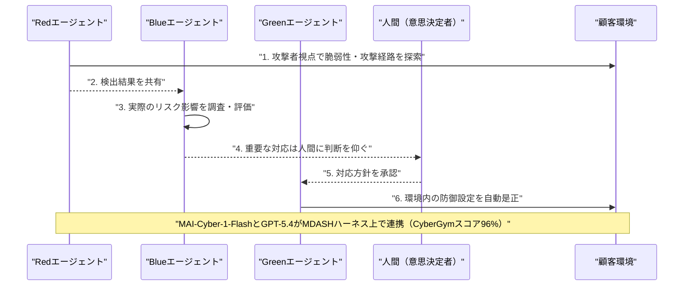

# LLM・AI Agent 最新情報レポート Vol.96
<!-- x-summary: MicrosoftのAIエージェント型セキュリティ基盤「Project Perception」が8月3日プレビュー開始 -->

**作成日**: 2026年8月3日（JST）
**対象期間**: 2026年8月2日〜8月3日（Vol.95との差分）

---

## 目次

1. [Google Cloudアップデート](#1-google-cloudアップデート)
2. [Microsoft Azure AIアップデート](#2-microsoft-azure-aiアップデート)
   - [2.1 Microsoft、AIエージェント型セキュリティ基盤「Project Perception」を8月3日にパブリックプレビュー公開](#21-microsoftaiエージェント型セキュリティ基盤project-perceptionを8月3日にパブリックプレビュー公開)
3. [LLM Model / AI Agentアーキテクチャ・研究](#3-llm-model--ai-agentアーキテクチャ研究)
4. [公式ブログ・論文のリサーチ・要約](#4-公式ブログ論文のリサーチ要約)
5. [AI Agent搭載SaaS製品情報](#5-ai-agent搭載saas製品情報)
6. [LLM/AI Agentセキュリティインシデント](#6-llmai-agentセキュリティインシデント)
7. [その他特筆すべき情報](#7-その他特筆すべき情報)
   - [7.1 カリフォルニア州のAI透明性法（SB 942）が8月2日に施行](#71-カリフォルニア州のai透明性法sb-942が8月2日に施行)
   - [7.2 カリフォルニア州議会、AI関連法案の「生殺与奪」審議を8月3日に実施](#72-カリフォルニア州議会ai関連法案の生殺与奪審議を8月3日に実施)
8. [参考リンク](#8-参考リンク)

---

> **今号について:** 対象期間（8月2日〜3日）は全体として動きが少ない2日間だったが、最大の注目点はMicrosoftが自律型AIエージェントでサイバー攻防を行う新基盤「Project Perception」を8月3日にパブリックプレビュー公開したことである。攻撃側視点で脆弱性を洗い出す「Red」、リスクを調査・評価する「Blue」、実際に修正を実行する「Green」という3種のエージェントを連携させ、専用モデル「MAI-Cyber-1-Flash」とAzure AI Foundryを組み合わせて脆弱性管理業務の大半を自動化する狙いで、AIエージェントが防御実務の担い手として実運用に組み込まれ始めた事例として特筆される。一方、Google Cloud、LLMモデル/アーキテクチャ研究、Google・OpenAI・Anthropicの公式ブログ、AI Agent搭載SaaS製品、セキュリティインシデントの各カテゴリでは、対象期間中に発表日を確定できる新規の重要情報は確認できなかった。政策面では、カリフォルニア州のAI生成コンテンツ透明性を義務付ける「AI Transparency Act」（SB 942）が8月2日に施行されたほか、州議会では多数のAI関連法案の存廃を決める重要審議が8月3日に行われるなど、EU AI法の執行開始（Vol.95既報）に続き、米国州レベルでもAI規制の実装が本格化している。

---

## 1. Google Cloudアップデート

対象期間中に発表日を確定できる新規の重要発表は確認できなかった。**新情報なし。**

---

## 2. Microsoft Azure AIアップデート

### 2.1 Microsoft、AIエージェント型セキュリティ基盤「Project Perception」を8月3日にパブリックプレビュー公開

Microsoftは7月27日、自律型AIエージェントによるサイバーセキュリティ基盤「Project Perception」と、自社初のサイバーセキュリティ特化モデル「MAI-Cyber-1-Flash」を発表し、8月3日にパブリックプレビューの提供を開始した。Project Perceptionは、攻撃者に先んじて脆弱性や攻撃経路を洗い出す「Red」エージェント、検出内容を調査し実際のリスクを評価する「Blue」エージェント、環境内の防御を自動的に是正する「Green」エージェントの3種を継続的なループで連携させる設計で、人間は重要な意思決定の最終権限を保持する。同社の脆弱性管理ハーネス「MDASH」にMAI-Cyber-1-FlashとOpenAIのGPT-5.4を組み合わせた構成は、サイバーセキュリティベンチマーク「CyberGym」で96%のスコアを記録し、Anthropicの「Claude Mythos」を12ポイント上回りつつ、従来のMDASH構成比で約50%のコスト削減を実現したとしている。MAI-Cyber-1-Flashが定型的なセキュリティ業務の約9割を担い、GPT-5.4は難易度の高い案件のみを処理する住み分けを想定しており、MAI-Cyber-1-FlashはAzure AI Foundry経由で提供される。数値はMicrosoft自身の発表によるもので、第三者による独立検証はまだ行われていない。[[1]](#ref-1) [[2]](#ref-2) [[3]](#ref-3) [[4]](#ref-4)

---

## 3. LLM Model / AI Agentアーキテクチャ・研究

対象期間中に発表日を確定できる新規の重要発表は確認できなかった（2章のProject Perceptionを除く）。**新情報なし。**

---

## 4. 公式ブログ・論文のリサーチ・要約

Google、OpenAI、Anthropicのいずれについても、対象期間中に発表日を確定できる新規の重要な投稿は確認できなかった。**新情報なし。**

---

## 5. AI Agent搭載SaaS製品情報

対象期間中に発表日を確定できる新規の重要発表は確認できなかった。**新情報なし。**

---

## 6. LLM/AI Agentセキュリティインシデント

対象期間中に発表日を確定できる新規のインシデントは確認できなかった。**新情報なし。**

---

## 7. その他特筆すべき情報

### 7.1 カリフォルニア州のAI透明性法（SB 942）が8月2日に施行

カリフォルニア州のAI生成コンテンツに関する透明性義務法「AI Transparency Act」（SB 942、AB 853による修正を反映）が8月2日に施行された。月間100万人を超えるカリフォルニア州内ユーザーを持つ生成AI事業者に対し、AI生成コンテンツを検知できる無償の公開ツールの提供と、画像・動画・音声へのC2PA準拠の可視・潜在的な来歴表示の埋め込みを義務付ける内容で、違反1件・1日あたり最大5,000ドルの民事制裁金が州司法長官により科され得る。EU AI法の透明性義務が同じく8月2日に執行段階へ移行した（Vol.95既報）のと期せずして同日となり、米欧双方でAI生成コンテンツの開示義務が同時に本格化した形である。[[5]](#ref-5) [[6]](#ref-6) [[7]](#ref-7)

### 7.2 カリフォルニア州議会、AI関連法案の「生殺与奪」審議を8月3日に実施

カリフォルニア州上院歳出委員会は8月3日午前、下院を通過した法案群（多数のAI関連法案を含む）の可否を一括審議する審議会を開催した。この審議で可決されなかった法案は2026年会期での成立が事実上不可能となる。対になる下院歳出委員会での上院発法案の審議は8月5日に予定されている。報道では、EU AI法の執行権限発動（最大1,500万ユーロまたは全世界売上高3%の制裁金）から1日後というタイミングでカリフォルニア州のAI法案の存廃が決まる点が注目された。審議を通過した法案も、9月12日の会期末までに本会議での可決が別途必要となる。[[8]](#ref-8) [[9]](#ref-9)

---

## 8. 参考リンク

**[1]** [Rethinking security for the age of AI | The Official Microsoft Blog](https://blogs.microsoft.com/blog/2026/07/27/rethinking-security-for-the-age-of-ai/)

**[2]** [Microsoft escalates the AI cybersecurity race with 'Project Perception' and a new in-house model | GeekWire](https://www.geekwire.com/2026/microsoft-escalates-the-ai-cybersecurity-race-with-project-perception-and-a-new-in-house-model/)

**[3]** [Microsoft built an agentic security system with red, blue, and green team AI agents. It enters public preview August 3. | TheNextWeb](https://thenextweb.com/news/microsoft-project-perception-agentic-security-cyber-model)

**[4]** [Microsoft's first cybersecurity model powers new Project Perception agents | SiliconANGLE](https://siliconangle.com/2026/07/27/microsofts-first-cybersecurity-model-powers-new-project-perception-agents/)

**[5]** [California AI Transparency Laws: SB 942 & AB 2013 | TrustArc](https://trustarc.com/resource/california-ai-transparency-laws-sb942-ab2013/)

**[6]** [California Establishes AI Transparency Act | The National Law Review](https://natlawreview.com/article/california-establishes-ai-transparency-act)

**[7]** [California Senate Bill 942 (SB 942) — California AI Transparency Act | FACIA](https://facia.ai/knowledgebase/california-senate-bill-942-sb-942-california-ai-transparency-act/)

**[8]** [California AI Bills Face 'Kill or Survive' Vote Monday as EU Fines Start | Tech Times](https://www.techtimes.com/articles/322386/20260731/california-ai-bills-face-kill-survive-vote-monday-eu-fines-start.htm)

**[9]** [2026 Bill Hearings | California State Senate Appropriations Committee](https://sapro.senate.ca.gov/billhearings/2026-bill-hearings)
