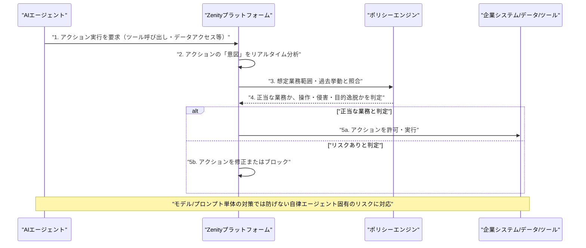

# LLM・AI Agent 最新情報レポート Vol.97
<!-- x-summary: Alibaba、新モデル「Qwen3.8-Max」を正式公開しClaude Fable 5に匹敵する性能を達成 -->

**作成日**: 2026年8月4日（JST）
**対象期間**: 2026年8月3日〜8月4日（Vol.96との差分）

---

## 目次

1. [Google Cloudアップデート](#1-google-cloudアップデート)
2. [Microsoft Azure AIアップデート](#2-microsoft-azure-aiアップデート)
3. [LLM Model / AI Agentアーキテクチャ・研究](#3-llm-model--ai-agentアーキテクチャ研究)
   - [3.1 Alibaba、2.4兆パラメータの新モデル「Qwen3.8-Max」を正式公開](#31-alibaba24兆パラメータの新モデルqwen38-maxを正式公開)
4. [公式ブログ・論文のリサーチ・要約](#4-公式ブログ論文のリサーチ要約)
5. [AI Agent搭載SaaS製品情報](#5-ai-agent搭載saas製品情報)
   - [5.1 AIエージェント統制のZenity、SoftBank等が参加するシリーズCで1億2500万ドルを調達](#51-aiエージェント統制のzenitysoftbank等が参加するシリーズcで1億2500万ドルを調達)
6. [LLM/AI Agentセキュリティインシデント](#6-llmai-agentセキュリティインシデント)
7. [その他特筆すべき情報](#7-その他特筆すべき情報)
8. [参考リンク](#8-参考リンク)

---

> **今号について:** 対象期間（8月3日〜4日）で最大の注目点は、Alibabaが2.4兆パラメータの新フラッグシップモデル「Qwen3.8-Max」を8月3日に正式公開したことである。7月19日にプレビュー発表していたモデルの本公開で、コーディング・複雑な調査・長時間タスクに特化したチューニングを施しつつ、自社ベンチマークでは一部指標でAnthropicのClaude Fable 5を上回る結果を示しており、Moonshot AIのKimi K3に続き中国発のフロンティアモデルが米国勢に肉薄する構図が続いている。もう一つの注目点は、AIエージェントの挙動をリアルタイムで統制するセキュリティ企業Zenityが、SoftBank Vision Fund 2やHitachi Ventures、LG Technology Venturesなどを引受先とするシリーズCで1億2500万ドルを調達したことで、「モデルやプロンプトの安全性だけでは自律的に行動するAIエージェントを守れない」という問題意識のもと、エージェントの意図分析・行動制御に特化した投資が拡大している実態を示す事例といえる。一方、Google Cloud、Microsoft Azure、Google・OpenAI・Anthropicの公式ブログ、LLM/AI Agentセキュリティインシデントの各カテゴリでは、対象期間中に発表日を確定できる新規の重要情報は確認できなかった。

---

## 1. Google Cloudアップデート

対象期間中に発表日を確定できる新規の重要発表は確認できなかった。**新情報なし。**

---

## 2. Microsoft Azure AIアップデート

対象期間中に発表日を確定できる新規の重要発表は確認できなかった。**新情報なし。**

---

## 3. LLM Model / AI Agentアーキテクチャ・研究

### 3.1 Alibaba、2.4兆パラメータの新モデル「Qwen3.8-Max」を正式公開

Alibabaは8月3日、7月19日に上海のWAICでプレビュー発表していた新フラッグシップモデル「Qwen3.8-Max」を正式公開した。総パラメータ2.4兆・アクティブ950億のMoE（Mixture of Experts）構成で、テキスト・画像・動画を扱うマルチモーダルモデルとして、自律的なコーディング、複雑な調査、長時間にわたる「long-horizon」タスクに特化したチューニングを施したとしている。コンテキストウィンドウは最大100万トークンに対応し、大量のドキュメント群や大規模なソフトウェアリポジトリ、長尺動画などを扱えるという。自社発表のベンチマークでは、Terminal-Bench 2.1で86.6点を記録し、Claude Opus 4.8・Claude Fable 5（いずれも84.6点）を上回った一方、GPT-5.6 Sol（max）の88.8点には届かなかった。このほかPaperBenchで93.0点、WideSearchで81.9点、マルチモーダル評価のOSWorld-Verifiedで86.1点などを記録している。QwenCloud経由のAPIで即日提供を開始し、料金は入力100万トークンあたり2ドル・出力6ドル・キャッシュ入力0.25ドルに設定された。重みについては翌週にHugging FaceおよびModelScopeでオープンソース公開予定としている。数値はいずれもAlibaba自身の発表によるもので、第三者による独立検証はまだ行われていない。7月中旬のMoonshot AI「Kimi K3」公開に続く発表であり、中国発のオープンウェイトモデルが相次いで欧米フロンティアモデルに迫る性能を主張する流れが継続している。[[1]](#ref-1) [[2]](#ref-2) [[3]](#ref-3) [[4]](#ref-4)

---

## 4. 公式ブログ・論文のリサーチ・要約

Google、OpenAI、Anthropicのいずれについても、対象期間中に発表日を確定できる新規の重要な投稿は確認できなかった。**新情報なし。**

---

## 5. AI Agent搭載SaaS製品情報

### 5.1 AIエージェント統制のZenity、SoftBank等が参加するシリーズCで1億2500万ドルを調達

イスラエル・テルアビブ拠点のAIエージェントセキュリティ企業Zenityは8月3日、Norwestをリード投資家とするシリーズCラウンドで1億2500万ドルを調達したと発表した。新規投資家としてQumra Capital、SoftBank Vision Fund 2、Hitachi Ventures、LG Technology Venturesが参加したほか、既存投資家のVertex Ventures、Third Point Ventures、DTCP、Intel Capitalも追加出資し、累計調達額は約1億8500万ドルに達した。同社は、AIエージェントが企業のデータ・アプリケーション・ツールにアクセスし、自律的に判断・実行できるようになったことで生じるリスクに着目し、モデルやプロンプト単体の安全対策だけでは自律行動するエージェントを守るには不十分だと主張する。プラットフォームはエージェントが起こそうとするアクションの「意図」を分析し、実行前に許可・修正・ブロックを判断できる設計で、正当な業務と、操作・侵害・目的逸脱によって歪められた挙動とを区別できるとしている。調達資金は製品開発の加速とグローバル展開に充てる方針で、非公開の増資後評価額は開示されていない。[[5]](#ref-5) [[6]](#ref-6) [[7]](#ref-7) [[8]](#ref-8)

---

## 6. LLM/AI Agentセキュリティインシデント

対象期間中に発表日を確定できる新規のインシデントは確認できなかった。**新情報なし。**

---

## 7. その他特筆すべき情報

対象期間中に発表日を確定できる新規の重要情報は確認できなかった。**新情報なし。**

---

## 8. 参考リンク

**[1]** [Alibaba Qwen Releases Qwen3.8-Max: A 2.4 Trillion Parameter MoE Model and the Most Capable One in the Qwen Family to Date | MarkTechPost](https://www.marktechpost.com/2026/08/03/alibaba-qwen-releases-qwen3-8-max/)

**[2]** [Alibaba debuts Qwen3.8-Max model with 2.4T parameters | SiliconANGLE](https://siliconangle.com/2026/08/03/alibaba-debuts-qwen3-8-max-model-2-4t-parameters/)

**[3]** [Alibaba's Qwen3.8-Max AI Model Claims Benchmark Scores Rivaling Anthropic | Bloomberg](https://www.bloomberg.com/news/articles/2026-08-03/alibaba-drops-another-china-ai-model-with-breakthrough-performance)

**[4]** [Alibaba releases Qwen3.8-Max, challenging GPT-5.6 Sol and Claude Fable 5 on AI benchmarks | Neowin](https://www.neowin.net/news/alibaba-releases-qwen38-max-challenging-gpt-56-sol-and-claude-fable-5-on-ai-benchmarks/)

**[5]** [Zenity Raises $125 Million to Secure the Era of 1 Billion AI Agents | Businesswire](https://www.businesswire.com/news/home/20260803963850/en/Zenity-Raises-$125-Million-to-Secure-the-Era-of-1-Billion-AI-Agents)

**[6]** [SoftBank, Hitachi, LG back Zenity's $125 million round to police AI agents | Fortune](https://fortune.com/2026/08/03/softbank-hitachi-lg-back-zenitys-125-million-round-to-police-ai-agents/)

**[7]** [Zenity raises $125 million Series C as AI agent security startup accelerates global expansion | CTech (Calcalist)](https://www.calcalistech.com/ctechnews/article/b1ahbbcbfe)

**[8]** [Zenity Raises $125 Million Series C To Expand AI Agent Security Platform | Pulse2](https://pulse2.com/zenity-raises-125-million-series-c-to-expand-ai-agent-security-platform/)
