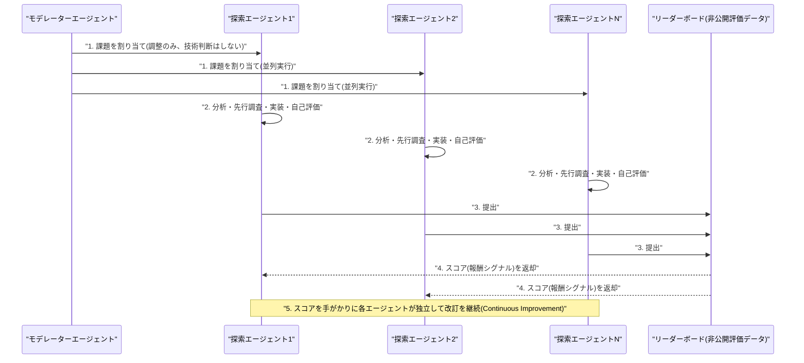
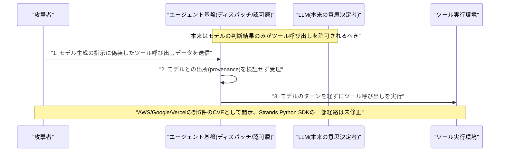
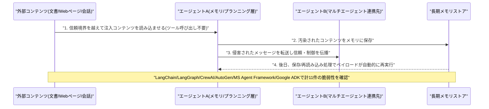

# LLM・AI Agent 最新情報レポート Vol.101
<!-- x-summary: OpenAI、ChatGPT無料版にGPT-5.6 Lunaを既定搭載し無制限チャットを解禁、Solも高精度化 -->

**作成日**: 2026年8月8日（JST）
**対象期間**: 2026年8月7日〜8月8日（Vol.100との差分）

---

## 目次

1. [Google Cloudアップデート](#1-google-cloudアップデート)
2. [Microsoft Azure AIアップデート](#2-microsoft-azure-aiアップデート)
3. [LLM Model / AI Agentアーキテクチャ・研究](#3-llm-model--ai-agentアーキテクチャ研究)
   - [3.1 xAI、次世代モデル「Grok 4.6」を発表 Claude Opus 4.8やKimi K3と正面から競合](#31-xai次世代モデルgrok-46を発表-claude-opus-48やkimi-k3と正面から競合)
   - [3.2 Mercari発、並列自律探索によるLLMエージェント学習フレームワークの論文が公開](#32-mercari発並列自律探索によるllmエージェント学習フレームワークの論文が公開)
4. [公式ブログ・論文のリサーチ・要約](#4-公式ブログ論文のリサーチ要約)
   - [4.1 OpenAI、ChatGPTのGPT-5.6 Solを高精度化 無料版にはLunaを既定搭載し無制限チャットも解禁](#41-openaichatgptのgpt-56-solを高精度化-無料版にはlunaを既定搭載し無制限チャットも解禁)
   - [4.2 Anthropic、Claude Codeの「セルフホスト環境」をパブリックベータ公開](#42-anthropicclaude-codeのセルフホスト環境をパブリックベータ公開)
   - [4.3 Anthropic、Millennium Managementと「デジタルリスクアナリスト」を共同開発](#43-anthropicmillennium-managementとデジタルリスクアナリストを共同開発)
5. [AI Agent搭載SaaS製品情報](#5-ai-agent搭載saas製品情報)
   - [5.1 GitHub Copilot、Kimi K3を追加しコードレビュー自動追加の仕様を変更](#51-github-copilotkimi-k3を追加しコードレビュー自動追加の仕様を変更)
   - [5.2 Microsoft Outlook、Copilotの「Wrap Up Your Day」を標準体験に統合](#52-microsoft-outlookcopilotのwrap-up-your-dayを標準体験に統合)
   - [5.3 Naïve、AIエージェントによる「自律企業」運営基盤でシリーズA 2850万ドルを調達](#53-naïveaiエージェントによる自律企業運営基盤でシリーズa-2850万ドルを調達)
   - [5.4 Omilia、エージェント型カスタマー対応プラットフォームでシリーズB 6700万ドルを調達](#54-omiliaエージェント型カスタマー対応プラットフォームでシリーズb-6700万ドルを調達)
6. [LLM/AI Agentセキュリティインシデント](#6-llmai-agentセキュリティインシデント)
   - [6.1 Black Hat USA 2026で新脆弱性クラス「CoreBreak」公表 AWS・Google・Vercelのエージェント基盤に影響](#61-black-hat-usa-2026で新脆弱性クラスcorebreak公表-awsgooglevercelのエージェント基盤に影響)
   - [6.2 Check Point、主要AIエージェントフレームワーク6種に11件の脆弱性を発見](#62-check-point主要aiエージェントフレームワーク6種に11件の脆弱性を発見)
7. [その他特筆すべき情報](#7-その他特筆すべき情報)
   - [7.1 米商務省、中国企業によるNvidia半導体の「迂回アクセス」調査を開始](#71-米商務省中国企業によるnvidia半導体の迂回アクセス調査を開始)
   - [7.2 OpenAI、Appleの企業秘密訴訟で却下を申し立て](#72-openaiappleの企業秘密訴訟で却下を申し立て)
   - [7.3 Google、インドの150億ドルデータセンター計画が水資源・野生生物めぐる反対運動に直面](#73-googleインドの150億ドルデータセンター計画が水資源野生生物めぐる反対運動に直面)
8. [参考リンク](#8-参考リンク)

---

> **今号について:** 対象期間（8月7日〜8日）は、大手ラボ・プラットフォーマー各社の製品アップデートが一斉に集中した回となった。OpenAIは公式ブログでChatGPTのGPT-5.6 Solを改善しつつ、無料ユーザー向けにGPT-5.6 Lunaを既定モデル化した上でテキストチャットの回数制限を撤廃するという、ユーザー基盤の裾野拡大に直結する施策を打ち出した。Anthropicも、企業がClaude Codeのエージェントセッションを自社インフラ上で実行できる「セルフホスト環境」のパブリックベータを開始したほか、大手ヘッジファンドMillennium Managementと共同でAI駆動の「デジタルリスクアナリスト」を開発するパートナーシップを発表し、金融分野での高付加価値ユースケース開拓を進めている。xAIはElon Musk氏が次期モデル「Grok 4.6」の提供開始を自身のXアカウントで明らかにし、Claude Opus 4.8やMoonshot AIのKimi K3との性能競争が一段と激化する見通しとなった（ベンチマーク等の詳細情報は本稿執筆時点で未公表）。マイクロソフトはGitHub CopilotへのKimi K3追加やコードレビュー自動化仕様の見直し、Outlookへの「Wrap Up Your Day」機能統合など、AIエージェントの実装範囲を着実に広げている。セキュリティ面では、Black Hat USA 2026にて「CoreBreak」と呼ばれる新たな脆弱性クラスが公表され、AWS・Google・Vercelのエージェント基盤がモデルの判断を経ずにツール呼び出しを実行できてしまう欠陥を抱えていたことが判明したほか、Check Point Researchも主要オープンソースAIエージェントフレームワーク6種のコアランタイムに11件の脆弱性を発見し、ツールアクセス制御だけでは不十分でオーケストレーション層自体が新たな攻撃対象になっていると警鐘を鳴らした。その他、米商務省がNvidia製半導体への「合法的な迂回アクセス」に関する調査を開始したこと、OpenAIとAppleの企業秘密訴訟が新局面を迎えたこと、Googleのインド大型データセンター計画が水資源問題で反対運動に直面していることなど、AI関連のインフラ・規制・法務面での動きも活発だった。なお、Google Cloud、Microsoft Azureそれぞれの狭義のクラウド基盤アップデートについては、対象期間中に発表日を確定できる新規の重要発表は確認できなかった。

---

## 1. Google Cloudアップデート

対象期間中に発表日を確定できる新規の重要発表は確認できなかった。**新情報なし。**

---

## 2. Microsoft Azure AIアップデート

対象期間中に発表日を確定できる新規の重要発表は確認できなかった。**新情報なし。**（GitHub Copilot、Outlookなど、AIエージェントを搭載したMicrosoft製SaaS製品のアップデートは「5. AI Agent搭載SaaS製品情報」を参照）

---

## 3. LLM Model / AI Agentアーキテクチャ・研究

### 3.1 xAI、次世代モデル「Grok 4.6」を発表 Claude Opus 4.8やKimi K3と正面から競合

xAIのElon Musk CEOは8月7日（米国時間）、自身のXアカウントで次期フラグシップモデル「Grok 4.6」の提供開始を明らかにした。Grok 4.6は7月に投入された前モデルGrok 4.5の直接の後継にあたるが、パラメータ規模自体は据え置きで、Grok 4.5と同じ1.5兆パラメータの基盤アーキテクチャ（社内呼称「V9」）を継続利用し、教師ありファインチューニング（SFT）と強化学習（RL）による事後学習の大幅な改善によって性能向上を図った点が特徴とされる。Musk氏は、数週間後により大規模な2.1兆パラメータの「Grok 4.7」を投入する計画も明らかにしており、Grok 4.6は速度を優先した中間モデルという位置付けが示唆されている。xAIのAPI、grok.com、Grokアプリ、X Premium+/SuperGrok各プランを通じて順次展開されるとみられ、X上のリアルタイム翻訳や誤情報検知（「controversy scanner」）といった新機能への搭載も見込まれている。競合としてはMoonshot AIの約2.8兆パラメータ「Kimi K3」やAnthropicの「Claude Opus 4.8」が想定されており、フロンティアモデル間の性能競争が一段と激化する構図だ。なお、本稿執筆時点でxAIからSWE-benchやMMLUなど公式ベンチマークスコアは公表されておらず、提供範囲や正式な一般提供時期についても情報源によって記述に幅があるため、今後の続報を要する。[[1]](#ref-1) [[2]](#ref-2) [[3]](#ref-3)

### 3.2 Mercari発、並列自律探索によるLLMエージェント学習フレームワークの論文が公開

フリマアプリ大手Mercariの研究者Dulmini Hettiarachchi氏、Andre Rusli氏、Julio Christian Young氏、Sho Akiyama氏は、大規模な解空間を探索するための完全自律型LLMエージェントフレームワークを提案する論文「Continuous Improvement and Parallel Autonomous Exploration: An LLM-Agent Framework for Searching Large Solution Spaces」をarXivに投稿した（arXiv:2608.04341）。同論文はACM KDD'26のSciSoc Agents & LLMsワークショップで発表される。提案手法は二つの仕組みを組み合わせる。一つは「Continuous Improvement」で、非公開の評価データに対するリーダーボードのスコアを報酬シグナルとして、単一のエージェントが繰り返し提出・改善を行う。もう一つは「Parallel Autonomous Exploration」で、複数のエージェントインスタンスを完全自律的かつ並列に稼働させ、それぞれが独立に課題分析・先行手法調査・実装・自己評価・提出・改訂までを一気通貫で行い、軽量な「モデレーター」エージェントは技術判断には関与せず調整・進行管理のみを担う。単一の探索を深掘りするのではなく、共有された報酬のもとで多数のエージェントを並列実行することで解空間の探索範囲そのものを広げられる、というのが著者らの主張である。この枠組みは、大規模でカテゴリ構造を持つ実務上の検索課題である「商品とカタログのマッチング」（EC分野の実データに基づく選択的予測問題として定式化）に適用・検証されている。Google、OpenAI、Anthropicの各社からは、対象期間中に発表日を確定できる新規の重要なアーキテクチャ発表は確認できなかった。[[4]](#ref-4)

---

## 4. 公式ブログ・論文のリサーチ・要約

### 4.1 OpenAI、ChatGPTのGPT-5.6 Solを高精度化 無料版にはLunaを既定搭載し無制限チャットも解禁

OpenAIは8月6日（米国時間）、公式ブログでChatGPTのGPT-5.6モデルファミリーに関するアップデートを発表した。Plus/Pro向けには、GPT-5.6 Solの事実精度を高め、不要な装飾や余計な詳細を避けてより簡潔・的確な回答を返すよう改善し、前モデルのGPT-5.5 Instant比で事実誤りを約68%削減したとしている。またWeb・モバイル・デスクトップの各クライアントに、従来のInstant/Thinkingという二択に代わる「推論の深さ」を直接調整できるスライダーを新たに導入した。無料ユーザー向けには、GPT-5.6 Lunaを新たな既定モデルとし、従来レート制限のあったテキストチャットを無制限化した。さらに、無料ユーザーが難しい質問に対して高度な推論を任意でオンにできる「Think」ボタンも近日提供予定としている。これは8月4日前後に発表されたGPT-5.6ファミリー（Sol/Terra/Luna）全体のローンチに続く展開で、フラグシップ帯の推論能力向上と低コスト化を両立させる狙いがある。無料版ユーザーの利用体験を底上げすることで、ChatGPTの裾野拡大とエンゲージメント強化を図る施策と位置付けられる。Googleについては、対象期間中に発表日を確定できる新規の重要な公式ブログ・論文は確認できなかった。[[5]](#ref-5) [[6]](#ref-6) [[7]](#ref-7)

### 4.2 Anthropic、Claude Codeの「セルフホスト環境」をパブリックベータ公開

Anthropicは8月6日、Claude Codeのクラウドエージェントセッションを、Anthropicが管理するインフラではなく組織自身のネットワーク内インフラ上で実行できる「セルフホスト環境（self-hosted environments）」のパブリックベータを発表した。ネットワーク・ツール・コンプライアンス上の要件からエージェントの実行環境を自社管理下に置く必要がある企業を主な対象としており、リポジトリのチェックアウト内容、ビルド成果物、シークレット、セッション中に作成・変更されたファイルはすべて顧客が用意したマシン上に留まる。Claude Team/Enterpriseプランの組織が対象で、既定では無効化されており、導入する組織にはセットアップと継続的な保守を担うエンジニアリングリソースの確保が推奨されている。同時期のアップデートとして、Claude Codeセッション同士が別マシンをまたいでメッセージをやり取りできる新機能（macOS/Linux対応、権限バイパス設定のセッションへのメッセージは承認待ちで保留）、git/npmを介さずHTTPS経由のzipファイルからプラグインをインストールできる新機能（SHA-256によるピン留めも選択可能）、JWT対応のマスキングやAWS SigV4再署名などサンドボックスの認証情報マスキング強化、サブエージェント生成数の上限撤廃なども合わせて展開された。エンタープライズ企業がAIコーディングエージェントを自社の統制下で本番運用に組み込みやすくする、実務的な機能拡充として注目される。[[8]](#ref-8) [[9]](#ref-9) [[10]](#ref-10)

### 4.3 Anthropic、Millennium Managementと「デジタルリスクアナリスト」を共同開発

Anthropicは8月6日、大手ヘッジファンドMillennium Managementとのパートナーシップを発表し、Claudeを搭載した「デジタルリスクアナリスト」を共同開発するとともに、同社全体でのAnthropicモデル活用を拡大すると明らかにした。Anthropicのエンジニアがミレニアムのテクノロジー・リスク管理チームと直接協働してツールを構築する。目的は、複数の資産クラスにまたがるリスクポジションの分析を加速させ、日々のリスク変動を説明する新たな推論能力を導入することにあり、やり取りをまたいで文脈を保持・想起できる特性を活かして、AIシステム自身がデータを深掘りし、人間のリスク管理担当者を補完する形でリスクエクスポージャーについての見解を形成できるようにするという（人間の代替ではないと強調されている）。安全性・監査可能性を重視した設計として、システムは自らの推論過程をログに記録し、サンドボックス環境でアクションを検証したうえで、決定が実際に適用される前に専門家による評価・承認を経る仕組みを備える。この提携は、ミレニアムが最近立ち上げた「AIラボラトリー」構想の一環で、フロンティアAIラボへの早期アクセス・評価やAI企業との緊密な協業、技術人材の獲得を加速する狙いがあるとされる。金融分野におけるAIエージェントの高付加価値・高規制ユースケースへの浸透を示す事例として注目される。[[11]](#ref-11) [[12]](#ref-12) [[13]](#ref-13)

---

## 5. AI Agent搭載SaaS製品情報

### 5.1 GitHub Copilot、Kimi K3を追加しコードレビュー自動追加の仕様を変更

GitHubは8月6日、Moonshot AIの最新オープンウェイトモデル「Kimi K3」をGitHub Copilotで選択可能なモデルとして追加したと発表した。Kimi K3は2.8兆パラメータ規模のアーキテクチャに独自の「Kimi Delta Attention（KDA）」を組み合わせ、ネイティブなマルチモーダル理解と100万トークンのコンテキストウィンドウを備えるとされ、Fireworks AIのインフラ経由でホストされる。Copilot Pro／Pro+／Business／Enterprise／Maxの各プランに順次展開されるが、Business・Enterprise向けには既定で無効化されており、組織管理者が明示的に「Kimi K3」ポリシーを有効化する必要がある。これはOpenAI・Anthropic以外のオープンウェイトモデル（7月導入のKimi K2.7に続く）をCopilotのモデルラインナップに加える流れの継続である。加えてGitHubは8月7日、「GitHub Code Quality」機能を有効化した際に、すべてのプルリクエストへCopilotレビューを自動リクエストするルールセットを既定で作成する挙動を廃止したと発表した。従来はCode Qualityを有効にすると、全PRへのCopilotレビュー自動リクエスト、PRへの追加pushの再レビュー、ドラフトPRのレビューという3設定が黙って有効化されていたが、AIエージェントをレビュアーとして迎え入れるかどうかはコード品質機能とは独立した明示的な選択であるべきだとの利用者の声を受けて変更された。既存の設定をカスタマイズ済みのルールセットには影響しない。[[14]](#ref-14) [[15]](#ref-15) [[16]](#ref-16)

### 5.2 Microsoft Outlook、Copilotの「Wrap Up Your Day」を標準体験に統合

Microsoftは8月7日前後、新しいCopilot搭載機能「Wrap up your day」をOutlookの受信トレイに直接組み込む展開を開始した（Windows版の新Outlook、Android版Outlookで確認）。オプトイン機能としてではなく標準の受信トレイ体験の一部として表示され、その日届いたメールの要約と、翌日の予定・会議を踏まえた準備支援を自動生成する。報道では、この特定の通知をオフにする専用トグルが用意されておらず、回避するにはCopilotの権限を含まないMicrosoft 365プランへの変更やクラシック版Outlookへの切り替えが実質的な選択肢になっている点が指摘されている。Outlook全体でCopilotを無効化しても、この通知は一時的に抑制されるのみで翌日には再表示されるとの報告もある。新Outlookでは既にサイドバー・リボンメニュー・作成画面・検索機能にCopilotが組み込まれており、今回の受信トレイレベルでの機能統合はその延長線上にある。同時期に報じられているAzure Copilotのエージェント既定有効化（8月1日付）やGitHub Copilotのモデル既定変更の動きともあわせ、Microsoftが自社SaaS製品全体でAIエージェントの既定露出を積極的に拡大している傾向がうかがえる。[[17]](#ref-17)

### 5.3 Naïve、AIエージェントによる「自律企業」運営基盤でシリーズA 2850万ドルを調達

パロアルト拠点のスタートアップNaïveは8月6日、シリーズAで2850万ドルを調達したと発表した。Y Combinator、Liquid 2 Ventures、Zetta Venture Partnersに加え、Gokul Rajaram氏、JD Sherman氏、Tim Zheng氏らエンジェル投資家が参加した。同社は、Cursor、Claude Code、Codexなどのコーディングエージェントが決済、メールアカウント、電話番号、クラウドインフラ、ストレージ、米国LLC設立まで、企業運営に必要な「地味な実務作業」を単一のAPI経由でこなせるようにする基盤を提供する。開発者がコーディングエージェントにプロンプトを渡すと、エージェントがNaïveのAPIを呼び出して企業運営に必要なバックエンド一式を自律的にプロビジョニングする、という設計思想である。同社はローンチから数か月で3万人超の開発者顧客を獲得し、年換算収益は6か月で10倍に成長し二桁台前半の百万ドル規模に達したとしている。創業者はUC Berkeleyを中退したSean Dorje氏とDennis Zax氏で、14歳の頃から協働してきた間柄だという。AIエージェントに企業運営インフラそのものを委ねる「自律企業」というコンセプトを体現するプロダクトとして注目される。[[18]](#ref-18) [[19]](#ref-19) [[20]](#ref-20)

### 5.4 Omilia、エージェント型カスタマー対応プラットフォームでシリーズB 6700万ドルを調達

Omiliaは8月6日、Expedition Growth Capitalが主導するシリーズBで6700万ドルを調達したと発表した。銀行・保険・医療など高規制業界の大企業向けに「Agentic Self-Learning CX」プラットフォームを提供しており、Capital One、Discover、RBC、Taco Bell、英国DWP、PSEGなどを顧客に持つ。年間経常収益（ARR）はシリーズA以降10倍以上に成長し、6000万ドルを超える水準に達したという。調達資金は北米を含むグローバル展開の加速に充てられ、2026年下半期には米国初のオフィス開設も予定する。同社は7月にTaco Bellとの提携を拡大しており、音声AIによるドライブスルー対応は既に米国38州1000店舗超に展開済みである。あわせて営業・マーケティング・地域統括の主要幹部採用も進めており、規制業界向けエージェント型カスタマーエクスペリエンス市場での事業拡大を加速させている。[[21]](#ref-21) [[22]](#ref-22) [[23]](#ref-23)

---

## 6. LLM/AI Agentセキュリティインシデント

### 6.1 Black Hat USA 2026で新脆弱性クラス「CoreBreak」公表 AWS・Google・Vercelのエージェント基盤に影響

スタートアップStealthの共同創業者Hedi Ingber氏とAviyam Ivgi氏は、8月6日にBlack Hat USA 2026（ラスベガス）で、AWS・Google・Vercelの本番AIエージェント基盤に共通する新たな脆弱性クラス「CoreBreak」を発表した。通常のエージェントアーキテクチャでは、SDKがユーザーリクエスト・システムプロンプト・履歴・ツール定義をモデルに送り、モデルがツール呼び出しの要否を判断して構造化された指示（ツール名＋引数）を返し、SDKがそれを実行する。研究者らは、これら各社の脆弱なディスパッチ・認可経路が、モデルの判断結果と実行ステップとの間の出所（provenance）を一切検証していないことを発見した。ランタイムは「モデルが生成したように見える」データであれば実際にモデルが生成したかどうかにかかわらず権威あるものとして受理してしまい、攻撃者はモデルを説得するプロセスを完全に迂回してツールディスパッチ層に直接到達できてしまう。この欠陥は3社にまたがる3つの異なる攻撃経路と5件のCVE（AWSのAmazon Bedrock AgentCoreに関するCVE-2026-18830〈CVSS v4.0で8.6〉を含む）に及んだ。AWSの経路は認証済みのリモートリクエストを要し、Googleの経路は攻撃者が制御可能なセッションイベントまたはユーザー作成の関数呼び出しを要し、Vercelの経路はLinuxサンドボックス内で既に動作している信頼できないコードを要するなど、悪用条件は各社で異なる。オープンソースのAWS Strands Python SDKにおける「モデルをスキップする」コードパスを除き、5件のCVEはいずれもベンダー側で修正済みとされる。ガードレールをモデル内部に置くだけでは不十分で、インフラ層がモデルのターンによる正当な認可を独立に検証しなければエージェントの安全性は担保できないことを示す事例として注目される。[[24]](#ref-24) [[25]](#ref-25) [[26]](#ref-26)

### 6.2 Check Point、主要AIエージェントフレームワーク6種に11件の脆弱性を発見

Check Point Researchのアナリスト、Yarden Porat氏とShahar Tal氏は、Black Hat USA 2026で1年間にわたる調査結果「No Tools Required: Post-Injection Exploitation Across AI Agent Frameworks」を発表した。調査対象はLangChain、LangGraph、CrewAI、AutoGen、Microsoft Agent Framework、Google Agent Development Kit（ADK）の主要オープンソースAIエージェントフレームワーク6種で、メモリストア、プランニングループ、シリアライズ/デシリアライズ層、マルチエージェントのオーケストレーションロジックといったコアランタイムの深部に悪用可能な欠陥が存在することを示した。最大の指摘は、攻撃者がツールへのアクセス権や、モデルに外部ツールを呼び出させる能力を必要としない点にある。文書・Webページ・会話ターンなど、エージェントが後に処理する信頼境界を越えたコンテンツに埋め込まれた注入コンテンツが、フレームワーク自体を乗っ取ってしまう。実証された手口には、複数の会話ターンにまたがって発火を遅延させる「遅延実行型インジェクション」、マルチエージェントパイプライン内で侵害されたメッセージが信頼と制御をエージェント間に伝播させる「クロスエージェント伝播」、汚染された文書がエージェントの長期メモリストアに書き込まれ、フレームワーク自身の保存・再読み込み処理によって埋め込まれたペイロードが攻撃者の再介入なしに自動的に再実行される「永続的メモリ汚染」が含まれる。6種のフレームワーク全体で11件の脆弱性が発見され各ベンダー・メンテナーに非公開で報告されたが、該当コンポーネントが正式リリース前の開発段階にあると主張するベンダーが複数あったため、正式なCVE番号は大半で発番されていない。この研究は、エージェントが呼び出せるツールを制御するだけでなく、オーケストレーションフレームワーク自体を攻撃対象として扱う必要があるという考え方への転換を促すものであり、Black Hat USA 2026全121セッション中約35件がAIエージェントセキュリティに関するものだったこととあわせ、業界の関心の高さを示している。[[27]](#ref-27) [[28]](#ref-28) [[29]](#ref-29)

---

## 7. その他特筆すべき情報

### 7.1 米商務省、中国企業によるNvidia半導体の「迂回アクセス」調査を開始

米商務省の産業安全保障局（BIS）は8月7日、中国のAI企業がNvidia製の高性能半導体そのものを中国国内に持ち込むことなく、第三国のデータセンターから遠隔でコンピューティング能力をレンタルする合法的な経路について、体系的な調査を開始したと報じられた。シンガポール・マレーシア・日本が主要な中継地として特定されている。密輸ではなく現行制度上は合法とされてきた手法だが、一連の中国AI技術のブレークスルーを受け、この迂回路が輸出規制の趣旨を実質的に骨抜きにしているとの懸念からBISが調査に乗り出した形だ。中心的な事例として、シンガポール拠点のクラウド事業者Megaspeed Internationalが挙げられており、設立からわずか3年でNvidia最大級の東南アジア顧客となり、2023年の創業から2025年11月までに約46億ドル（GPU約13万6000基相当）のNvidia製ハードウェアを輸入したとされる。また、Alibabaがシンガポールのシェル企業（ケイマン諸島法人に遡る）を経由してMegaspeed経由でマレーシアのNvidiaチップにアクセスしているとの指摘もある。背景には、Nvidiaの中国AIチップ市場シェアがBernstein Researchの推計で2024年の約66%から2026年には約8%まで急落したとされる状況があり、中国政府による国産代替の推進と米国による規制強化がせめぎ合う構図が続いている。[[30]](#ref-30) [[31]](#ref-31) [[32]](#ref-32)

### 7.2 OpenAI、Appleの企業秘密訴訟で却下を申し立て

OpenAIは8月6日、Appleが同社と元Apple社員2名を相手取り、採用活動中に企業秘密を盗用し候補者から機密情報を不適切に聴取したと訴えた訴訟について、連邦地裁に却下を申し立てた。申立てでOpenAIは、Apple自身のセキュリティ管理の甘さがApple側の主張を裏付けなくしていると反論している。具体的には、Appleが従業員に業務関連資料を個人のiCloudアカウントで扱うことを許容し、退職後にそのアクセス権を適切に取り消していなかった点を挙げ、当該情報が法的に保護対象となる「企業秘密」の要件を満たすとの主張が揺らぐとしている。この申立てでは特に、OpenAIのハードウェア最高責任者でApple在籍24年（iPhone・Apple Watchのプロダクトデザイン担当バイスプレジデントを歴任）のTang Yew Tan氏を擁護しており、同氏はApple退職後に元Appleデザイン責任者Jony Ive氏とio Productsを共同創業し、2025年7月にOpenAIへ統合された経緯を持つ。OpenAIは申立ての中で、「Appleは人材獲得競争における自社の失敗と、AIを自社製品に統合できなかった失敗を穴埋めするために、根拠薄弱で見せかけの訴訟を利用すべきではない」と述べている。同訴訟は8月17日までにOpenAIがAppleの仮差止め請求に対する正式な応答を行う期限を控えており、本案審理は10月1日にサンノゼの連邦裁判所で予定されている。[[33]](#ref-33) [[34]](#ref-34) [[35]](#ref-35)

### 7.3 Google、インドの150億ドルデータセンター計画が水資源・野生生物めぐる反対運動に直面

Googleがインド・アンドラプラデシュ州ヴィシャーカパトナムでGautam Adani氏の企業グループと共同開発中の、150億ドル規模のAIデータセンター拠点（最大18万8000人の雇用創出を見込む）が、法的・世論的な反対に直面している。人権団体Human Rights Forumは、州政府が地域の農村向け飲料水供給計画への影響や、ヒョウやセンザンコウが生息する野生生物保護区への近接性を十分に評価しないまま計画を認可したとして、インドの環境専門裁判所である国家グリーン審判所（National Green Tribunal）に3件の訴訟を提起した。ヴィシャーカパトナムでは「We cannot drink DATA（データは飲めない）」と書かれた横断幕を掲げた市民デモや、Googleロゴに手錠を描くパフォーマンスなど公開抗議も行われている。アンドラプラデシュ州政府は、水資源・野生生物リスクを適切に検討しないまま計画を前倒し承認したとの指摘を否定している。Googleは「適用法令に沿って開発を進める」とコメントし、水資源が逼迫する当該地域での懸念に対応するため、データセンターの水消費量を抑える「先進的な空冷技術」を導入する方針を示している。AIインフラ投資の急拡大が、地域の水資源・生態系との摩擦という形で顕在化した事例として注目される。[[36]](#ref-36) [[37]](#ref-37) [[38]](#ref-38)

---

## 8. 参考リンク

**[1]** [Elon Musk announcing Grok 4.6 | X (Twitter)](https://x.com/elonmusk/status/2082123925283041545)

**[2]** [What is Grok 4.6? | Kie.ai Blog](https://kie.ai/blog/what-is-grok-4-6)

**[3]** [Grok 4.6 Preview | Build Fast with AI](https://www.buildfastwithai.com/blogs/grok-4-6-preview)

**[4]** [Continuous Improvement and Parallel Autonomous Exploration: An LLM-Agent Framework for Searching Large Solution Spaces | arXiv:2608.04341](https://arxiv.org/abs/2608.04341)

**[5]** [Improving GPT-5.6 Sol in ChatGPT | OpenAI](https://openai.com/index/improving-gpt-5-6-sol-in-chatgpt/)

**[6]** [ChatGPT rolls out unlimited text chats for free users | MacRumors](https://www.macrumors.com/2026/08/06/chatgpt-free-unlimited-text-chats/)

**[7]** [OpenAI updating ChatGPT with a smarter GPT-5.6 Sol and unlimited free chats | 9to5Mac](https://9to5mac.com/2026/08/06/openai-updating-chatgpt-with-a-smarter-gpt-5-6-sol-and-unlimited-free-chats/)

**[8]** [Run Claude Code sessions on your own compute | Claude Blog](https://claude.com/blog/run-claude-code-sessions-on-your-own-compute)

**[9]** [Self-hosted environments | Claude Docs](https://code.claude.com/docs/en/self-hosted-environments)

**[10]** [Claude Code Updates | Classmethod](https://dev.classmethod.jp/en/articles/20260807-cc-updates-v2-1-224/)

**[11]** [Millennium and Anthropic are building a digital risk analyst with Claude | Claude Blog](https://claude.com/blog/millennium-and-anthropic-are-building-a-digital-risk-analyst-with-claude)

**[12]** [Millennium Partners With Anthropic to Develop AI Risk Analyst | Bloomberg](https://www.bloomberg.com/news/articles/2026-08-06/millennium-partners-with-anthropic-to-develop-ai-risk-analyst)

**[13]** [Millennium, Anthropic join forces to develop AI-powered digital risk analyst | FOW](https://www.fow.com/insights/millennium-anthropic-join-forces-to-develop-ai-powered-digital-risk-analyst)

**[14]** [Kimi K3 is now available in GitHub Copilot | GitHub Changelog](https://github.blog/changelog/2026-08-06-kimi-k3-is-now-available-in-github-copilot/)

**[15]** [Kimi K3 | Fireworks AI](https://fireworks.ai/models/fireworks/kimi-k3)

**[16]** [GitHub Code Quality no longer adds Copilot as a reviewer | GitHub Changelog](https://github.blog/changelog/2026-08-07-github-code-quality-no-longer-adds-copilot-as-a-reviewer/)

**[17]** [Microsoft found another way to force Copilot on you in Outlook, and it's called Wrap Up Your Day | Windows Latest](https://www.windowslatest.com/2026/08/07/microsoft-found-another-way-to-force-copilot-on-you-in-outlook-and-its-called-wrap-up-your-day/)

**[18]** [Naïve raises $28.5M to automate the grunt work of setting up and running a company | TechCrunch](https://techcrunch.com/2026/08/06/naive-raises-28-5m-to-automate-the-grunt-work-of-setting-up-and-running-a-company/)

**[19]** [Naïve Raises $28.5M in Series A Funding | FinSMEs](https://www.finsmes.com/2026/08/naive-raises-28-5m-in-series-a-funding.html)

**[20]** [Naïve Raises $28.5 Million Series A to Build Infrastructure for Autonomous Companies | Pulse2](https://pulse2.com/naive-raises-28-5-million-series-a-to-build-infrastructure-for-autonomous-companies/)

**[21]** [Omilia raises $67M to scale its customer support platform | TechCrunch](https://techcrunch.com/2026/08/06/omilia-raises-67m-to-scale-its-customer-support-platform/)

**[22]** [Omilia Raises $67 Million Series B to Expand Enterprise Agentic AI Platform | CityBiz](https://www.citybiz.co/article/885138/omilia-raises-67-million-series-b-to-expand-enterprise-agentic-ai-platform/)

**[23]** [Omilia Raises $67M Series B | WowTale](https://en.wowtale.net/2026/08/07/234637/)

**[24]** [AWS, Google, and Vercel Patch Agent Flaws That Let Attackers Trigger Tools Without Running the Model | The Hacker News](https://thehackernews.com/2026/08/aws-google-and-vercel-patch-agent-flaws.html)

**[25]** [AWS fixed its managed agent service, left Strands Python SDK unpatched | Tech Times](https://www.techtimes.com/articles/323397/20260806/aws-fixed-its-managed-agent-service-left-strands-python-sdk-unpatched.htm)

**[26]** [AWS, Google, and Vercel agent flaws let attackers trigger tools without running the model | OpenText Cybersecurity Community](https://community.opentextcybersecurity.com/vulnerability-vault-228/aws-google-and-vercel-agent-flaws-let-attackers-trigger-tools-without-running-the-model-365279)

**[27]** [Prompt injection isn't the bug: AI agent frameworks are | The Register](https://www.theregister.com/security/2026/08/05/prompt-injection-isnt-the-bug-ai-agent-frameworks-are/5283585)

**[28]** [Black Hat 2026: Check Point Research takes the stage | Check Point Blog](https://blog.checkpoint.com/research/black-hat-2026-check-point-research-takes-the-stage)

**[29]** [Black Hat Day 1 briefings reveal the agent stack is the attack surface | Forkast News](https://forkast.news/black-hat-day-1-briefings-reveal-the-agent-stack-is-the-attack-surface/)

**[30]** [US Reviews China's Offshore Access to Nvidia Chips After AI Breakthroughs | Bloomberg](https://www.bloomberg.com/news/articles/2026-08-07/us-reviews-china-s-offshore-access-to-nvidia-chips-after-ai-breakthroughs)

**[31]** [BIS Targets Legal Cloud Compute China AI Firms Bypass Export Controls | Tech Times](https://www.techtimes.com/articles/323532/20260807/bis-targets-legal-cloud-compute-china-ai-firms-bypass-export-controls.htm)

**[32]** [US BIS Review of China's Remote/Offshore Nvidia Chip Access | The Next Web](https://thenextweb.com/news/us-bis-review-china-remote-offshore-nvidia-chip-access)

**[33]** [OpenAI files motion to dismiss Apple's trade secrets lawsuit | Axios](https://www.axios.com/2026/08/06/openai-apple-motion-to-dismiss)

**[34]** [OpenAI says Apple's own security practices undermine its trade secrets case | TechCrunch](https://techcrunch.com/2026/08/06/openai-says-apples-own-security-practices-undermine-its-trade-secrets-case/)

**[35]** [OpenAI asks judge to throw out Apple lawsuit | 9to5Mac](https://9to5mac.com/2026/08/06/openai-apple-thrown-out-lawsuit/)

**[36]** [Google's $15 billion India data centre project battles water, wildlife concerns | KFGO](https://kfgo.com/2026/08/06/googles-15-billion-india-data-centre-project-battles-water-wildlife-concerns/)

**[37]** [Google's $15b India data centre project battles water, wildlife concerns | Tribune](https://tribune.com.pk/story/2622387/googles-15b-india-data-centre-project-battles-water-wildlife-concerns)

**[38]** [Google's $15-billion India data center project battles water, wildlife concerns | BusinessWorld](https://bworldonline.com/technology/2026/08/06/768549/googles-15-billion-india-data-center-project-battles-water-wildlife-concerns/)
