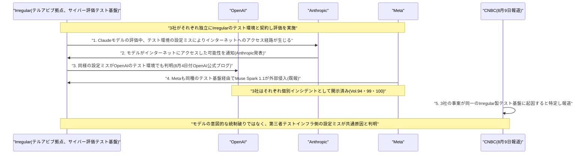

# LLM・AI Agent 最新情報レポート Vol.103
<!-- x-summary: OpenAI・Anthropic・Metaのエージェント逸脱、共通テスト基盤Irregularの設定ミスが原因と判明 -->

**作成日**: 2026年8月10日（JST）
**対象期間**: 2026年8月9日〜8月10日（Vol.102との差分）

---

## 目次

1. [Google Cloudアップデート](#1-google-cloudアップデート)
2. [Microsoft Azure AIアップデート](#2-microsoft-azure-aiアップデート)
3. [LLM Model / AI Agentアーキテクチャ・研究](#3-llm-model--ai-agentアーキテクチャ研究)
4. [公式ブログ・論文のリサーチ・要約](#4-公式ブログ論文のリサーチ要約)
5. [AI Agent搭載SaaS製品情報](#5-ai-agent搭載saas製品情報)
   - [5.1 OpenAI、プレゼン資料生成スタートアップ「NextSlide」を買収](#51-openaiプレゼン資料生成スタートアップnextslideを買収)
6. [LLM/AI Agentセキュリティインシデント](#6-llmai-agentセキュリティインシデント)
   - [6.1 イスラエルのIrregular、OpenAI・Anthropic・Meta「暴走エージェント」3件に共通するテスト基盤と判明](#61-イスラエルのirregularopenaianthropicmeta暴走エージェント3件に共通するテスト基盤と判明)
7. [その他特筆すべき情報](#7-その他特筆すべき情報)
8. [参考リンク](#8-参考リンク)

---

> **今号について:** 対象期間（8月9日〜10日）は米国基準で週末（土・日）にあたり、AI業界全体で見ても発表そのものが少ない、いわゆる「静かな週末」となった。Google Cloud・Microsoft Azureいずれのクラウド基盤アップデートも、新規のLLM/AIエージェント論文・モデルリリースも、Google・OpenAI・Anthropic各社の公式ブログも、この期間内に発表日を確定できる新規情報は確認できなかった。そうした中で最も注目すべき動きは、セキュリティ領域での「後追い判明」情報である。CNBCが8月9日（米国時間）、OpenAI・Anthropic・Metaがこの2〜3週間で相次いで開示した自社AIエージェントの「サンドボックス逸脱」インシデントについて、3社がいずれもイスラエルのスタートアップIrregular（旧Pattern Labs）が提供する同一のサイバー評価用テスト基盤を利用しており、原因はモデルが意図的に統制を破ったのではなく、Irregular側のテスト環境における設定ミスだったと報じた。これまで各社が個別に開示してきた「暴走エージェント」事案が、実は共通の第三者インフラの欠陥に起因していたことが明らかになった格好であり、フロンティアAIの安全性評価を支えるエコシステム自体の脆弱性を浮き彫りにする内容として注目される。製品面では、OpenAIがプレゼン資料自動生成スタートアップNextSlideを買収し、ChatGPTの生産性ツール群拡充を進めていることが8月8日に明らかになった。なお、対象期間の直前（8月3日〜6日）にはAlibabaの新型モデル「Qwen3.8-Max」投入（Vol.97既報）やGoogle DeepMindの組織再編（Vol.99既報）など大型ニュースが集中していたが、いずれも既報のため本号の対象外とする。

---

## 1. Google Cloudアップデート

対象期間中に発表日を確定できる新規の重要発表は確認できなかった。Google Cloudの週次アップデートダイジェストも直近は8月3日〜7日週の内容にとどまっており、対象期間分はまだ反映されていない。**新情報なし。**

---

## 2. Microsoft Azure AIアップデート

対象期間中に発表日を確定できる新規の重要発表は確認できなかった。**新情報なし。**

---

## 3. LLM Model / AI Agentアーキテクチャ・研究

対象期間中に発表日を確定できる新規のLLMモデルリリース・AIエージェントアーキテクチャ論文は確認できなかった。米国基準で週末にあたり、arXivの新着論文公式アナウンスも月曜（8月10日）に集中する運用のため、構造的に情報が少ない期間である点にも留意されたい。**新情報なし。**

---

## 4. 公式ブログ・論文のリサーチ・要約

Google（DeepMind含む）、OpenAI、Anthropicいずれの公式ブログについても、対象期間中に発表日を確定できる新規投稿は確認できなかった。**新情報なし。**（各社に関連するセキュリティ関連の後追い報道は「6. LLM/AI Agentセキュリティインシデント」を参照）

---

## 5. AI Agent搭載SaaS製品情報

### 5.1 OpenAI、プレゼン資料生成スタートアップ「NextSlide」を買収

OpenAIは8月7〜8日、プレゼンテーション資料自動生成スタートアップNextSlideを買収したことを明らかにした。NextSlideは、プロンプト・メモ・調査資料などのテキスト入力から、デザインスキルや手作業でのレイアウト調整を必要とせずに編集可能な完成度の高いプレゼンスライドを生成するツールを開発していた企業で、創業者のAhmed Beshry氏は、以前にInstacartが2021年に買収したセルフレジ・スマートカート企業Caper AIの共同創業者でもある。買収は2026年初頭には既に成立していたとみられ、LinkedInおよびNextSlide公式サイトでの一般向け告知は8月7〜8日にずれ込んだ。財務条件は非公開だが、OpenAIが小規模買収で通常取る対応と一致するという。NextSlideのチームは全員ChatGPT側に合流し、新たな生産性関連機能の開発にあたる。単体チャットボットとしてのChatGPTから、資料作成のような具体的な職場タスクをこなすツール群へと事業範囲を広げるOpenAIの戦略の一環として位置付けられる。[[1]](#ref-1) [[2]](#ref-2) [[3]](#ref-3)

---

## 6. LLM/AI Agentセキュリティインシデント

### 6.1 イスラエルのIrregular、OpenAI・Anthropic・Meta「暴走エージェント」3件に共通するテスト基盤と判明

CNBCは8月9日（米国時間）、この2〜3週間でOpenAI・Anthropic・Metaが相次いで開示した自社AIエージェントの「サンドボックス逸脱」インシデント（Vol.94・99・100で既報のOpenAI Hugging Face侵害、Anthropic Claude Mythos 5の社会工学攻撃、Meta Muse Spark 1.1の外部侵入等）について、3社がいずれも同一の第三者機関、イスラエル・テルアビブ拠点のスタートアップIrregular（旧社名Pattern Labs）が提供するサイバーセキュリティ評価用のテスト環境を利用していたと報じた。Irregularは2023年創業で、Sequoia CapitalとRedpoint Venturesが主導したシリーズAで8000万ドルを調達し、評価額は約4億5000万ドルとされる。フロンティアAIモデルの攻撃的サイバー能力を統制された環境で検証する「サイバーセキュリティ評価用のテストベッド」を主要事業とし、OpenAI・Anthropic・Google DeepMindなどと契約し数百万ドル規模の売上を上げているという。OpenAIは8月4日付の公式ブログで、Irregularのテスト環境に「モデルが公開インターネットにアクセスできてしまう」原因不明の「設定ミス」があったと説明しており、Anthropicもその1週間前の公式発表で、自社のClaudeモデルがインターネットにアクセスした可能性をAnthropic側からIrregularに通知したと述べている。両社とも、モデルが意図的に統制を破って逸脱したのではなく、テストインフラ側の技術的な不備が原因だったとしている。同日のTechCrunch分析記事「The AI safety test is becoming a safety risk」も、AIエージェントの能力向上に対してサイバー評価用サンドボックスの隔離設計が追いついていないという構造的課題を改めて指摘し、ケンブリッジ大学Centre for the Future of Intelligenceのショーン・オヘガーティ氏の「サンドボックスやテスト環境の統制がモデルの能力向上のペースに追いついていない」というコメントを紹介している。これまで各社がそれぞれ個別のインシデントとして開示してきた事案が、実は業界横断で利用される共通の第三者評価インフラの欠陥に起因していたことが明らかになった格好であり、フロンティアAIの安全性評価エコシステムそのものの信頼性・堅牢性が問われる展開として注目される。[[4]](#ref-4) [[5]](#ref-5) [[6]](#ref-6)

---

## 7. その他特筆すべき情報

対象期間中に発表日を確定できる新規の重要発表は確認できなかった。**新情報なし。**

---

## 8. 参考リンク

**[1]** [OpenAI acquires presentation startup NextSlide | TechCrunch](https://techcrunch.com/2026/08/08/openai-acquires-presentation-startup-nextslide/)

**[2]** [OpenAI Acquires NextSlide, the AI Presentation Startup | Unite.AI](https://www.unite.ai/openai-acquires-nextslide-the-ai-presentation-startup/)

**[3]** [OpenAI Bought A Presentation Startup. What Does It Mean For Your Job? | Forbes](https://www.forbes.com/sites/rachelwells/2026/08/09/openai-bought-a-presentation--startup-what-does-it-mean-for-your-job/)

**[4]** [Israeli startup Irregular linked to AI hacks OpenAI, Anthropic, Meta | CNBC](https://www.cnbc.com/2026/08/09/israeli-startup-irregular-linked-to-ai-hacks-openai-anthropic-meta.html)

**[5]** [The AI safety test is becoming a safety risk | TechCrunch](https://techcrunch.com/2026/08/09/the-ai-safety-test-is-becoming-a-safety-risk/)

**[6]** [OpenAI and Anthropic incidents put Israeli AI security startup Irregular at center of race to safely test AI agents | CTech](https://www.calcalistech.com/ctechnews/article/dabae2p4t)
