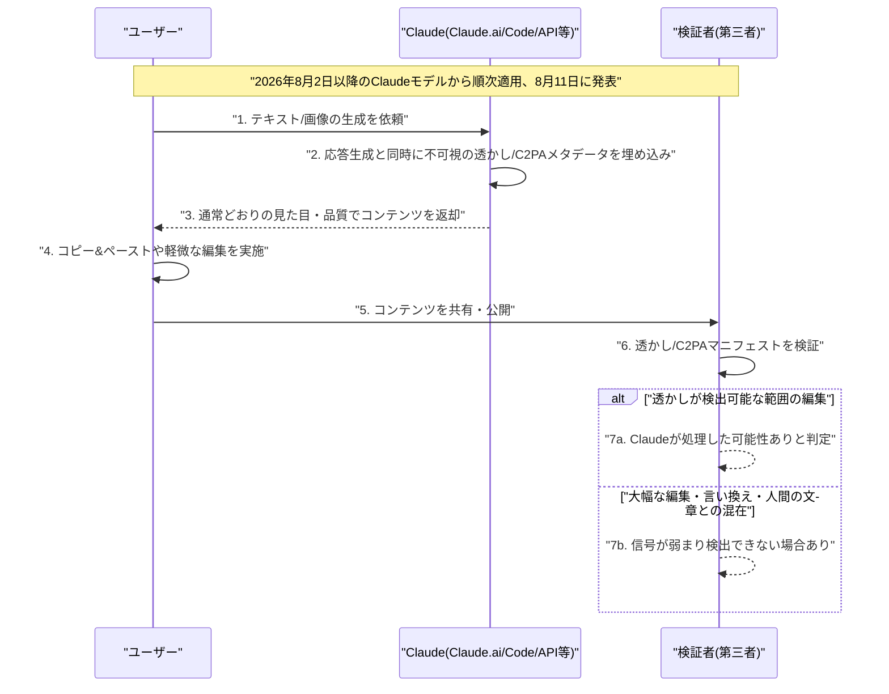

# LLM・AI Agent 最新情報レポート Vol.105
<!-- x-summary: Anthropicが業界初、Claude生成コンテンツに不可視の透かしを組み込み全製品へ本番規模で展開 -->

**作成日**: 2026年8月12日（JST）
**対象期間**: 2026年8月11日〜8月12日（Vol.104との差分）

---

## 目次

1. [Google Cloudアップデート](#1-google-cloudアップデート)
2. [Microsoft Azure AIアップデート](#2-microsoft-azure-aiアップデート)
3. [LLM Model / AI Agentアーキテクチャ・研究](#3-llm-model--ai-agentアーキテクチャ研究)
4. [公式ブログ・論文のリサーチ・要約](#4-公式ブログ論文のリサーチ要約)
   - [4.1 Anthropic、Claude生成コンテンツへの不可視の電子透かし導入を発表](#41-anthropicclaude生成コンテンツへの不可視の電子透かし導入を発表)
5. [AI Agent搭載SaaS製品情報](#5-ai-agent搭載saas製品情報)
   - [5.1 GitHub Copilot、Microsoftの新モデル「MAI-Code-1.1-Flash」の提供を開始](#51-github-copilotmicrosoftの新モデルmai-code-11-flashの提供を開始)
   - [5.2 Notion、AIエージェント機能「Workers」をクレジット課金制へ移行](#52-notionaiエージェント機能workersをクレジット課金制へ移行)
6. [LLM/AI Agentセキュリティインシデント](#6-llmai-agentセキュリティインシデント)
7. [その他特筆すべき情報](#7-その他特筆すべき情報)
   - [7.1 Anthropic、Riot PlatformsおよびMacquarie・GICと大型データセンター契約を相次いで締結](#71-anthropicriot-platformsおよびmacquariegicと大型データセンター契約を相次いで締結)
8. [参考リンク](#8-参考リンク)

---

> **今号について:** 対象期間（8月11日〜12日）は、前号Vol.104（Anthropicのリーマン予想関連研究、Meta「Muse Glimmer」、OpenAI「GPT-5.6-Cyber」など大型ニュースが集中）から一転し、新規のLLMモデルリリースやAIエージェントアーキテクチャの発表、重大なセキュリティインシデントは確認されず、比較的静かな48時間となった。その中で最大の注目点は、Anthropicが主要フロンティアAI企業として初めて、Claudeが生成する文章・画像に不可視の電子透かし（ウォーターマーク）を組み込み、Claude.ai・Claude Code・Claude Cowork・APIなど全製品へ本番規模で展開したと発表したことである。EU AI Actの透明性規範への対応が主な動機とされるが、適用範囲は欧州に限らず全世界のユーザーに及ぶ点が特徴的で、AI生成コンテンツの真正性・来歴管理という論点における業界の先行事例として注目される。製品面では、GitHub Copilotに低コストな新モデル「MAI-Code-1.1-Flash」が追加されたほか、NotionのAIエージェント機能「Workers」がベータ提供からクレジット課金制へ移行し、AIエージェント機能のマネタイズが進む節目となった。またAnthropicは、ビットコインマイニング企業Riot Platformsとの91億ドル規模のデータセンターリース契約、資産運用大手MacquarieおよびシンガポールGICとの合弁「Theseus Infrastructure」設立を相次いで発表し、Claude/Claude Codeの提供能力拡大に向けた計算資源確保を積極化させている様子がうかがえた。

---

## 1. Google Cloudアップデート

対象期間中に発表日を確定できる新規の重要発表は確認できなかった。Google Cloud Blogの「What's new」まとめも直近は8月3日〜7日週の内容にとどまっており、対象期間分はまだ反映されていない。**新情報なし。**

---

## 2. Microsoft Azure AIアップデート

対象期間中に発表日を確定できる新規の重要発表は確認できなかった。Microsoft Foundry Blog・Azure Updates等の直近更新も8月6日以前の内容にとどまっている。**新情報なし。**

---

## 3. LLM Model / AI Agentアーキテクチャ・研究

対象期間中、確度の高い新規のLLMモデルリリースやAIエージェントのアーキテクチャ・フレームワークに関する正式発表は確認できなかった。Zhipu AI「GLM-5.5」やMoonshot AI「Kimi K4」など8月中のリリースを予測する報道はあるものの、対象期間内の公式発表には至っていない。**新情報なし。**

---

## 4. 公式ブログ・論文のリサーチ・要約

### 4.1 Anthropic、Claude生成コンテンツへの不可視の電子透かし導入を発表

Anthropicは8月11日、Claudeが生成する文章および対応ファイル形式に、来歴（プロベナンス）を示すマークを組み込む取り組みを発表した。テキストについては、意味・品質・可読性に影響を与えない人間には知覚できない統計的な透かしパターンを文章に直接埋め込む方式で、コピー＆ペーストしても維持され、一定程度の編集を経ても検出できる場合があるという。SVG・PNG・JPGなど対応するファイル形式には、C2PA（Coalition for Content Provenance and Authenticity）標準に準拠した署名付きのプロベナンスメタデータを付与し、改ざん検知にも利用できるようにした。適用範囲はClaude.ai、Claude Code、Claude Cowork、Claude Tag、Anthropic APIに加え、AWS・Google Cloud・Microsoft Foundry経由の利用にも及び、2026年8月2日以降にリリースされたClaudeモデルから順次対応済みとされる。Anthropicはこれにより、主要フロンティアAI企業の中で初めてテキスト透かしを本番規模で全製品に一斉展開した企業になったとみられる。取り組みの背景にはEU AI Actの「AI生成コンテンツの透明性に関する行動規範（Article 50(2) Code of Practice）」への対応があるとされるが、展開は欧州に限らずグローバルに適用される。一方でAnthropic自身、大幅な編集・言い換えや人間の文章との混在によって透かしの信号が弱まったり消えたりする可能性があること、検出はあくまで「Claudeが処理した可能性がある」ことを示すに留まり、誰が書いたかという完全な著作性の証明にはならないことを認めている。校正・翻訳・要約など、AIが文章の一部にのみ関与した場合でも透かしが付与される点にも留意が必要とされ、AI生成コンテンツの真正性表示を巡る業界的な論点の先行事例として注目を集めた。[[1]](#ref-1) [[2]](#ref-2) [[3]](#ref-3)

---

## 5. AI Agent搭載SaaS製品情報

### 5.1 GitHub Copilot、Microsoftの新モデル「MAI-Code-1.1-Flash」の提供を開始

GitHubは8月11日、公式Changelogで、GitHub CopilotにMicrosoftの最新小型コーディングモデル「MAI-Code-1.1-Flash」の提供を開始したと発表した。前モデル「MAI-Code-1-Flash」をベースに、画像を理解できるネイティブなビジョン（vision）サポートを新たに追加したほか、コーディング品質・指示追従性・ツール利用・パフォーマンス全般が改善されている。モデル・サービング効率の進化により、旧モデルと比べて一覧価格が73%低減し、軽量なコーディングワークフロー向けにコストパフォーマンスに優れた選択肢として位置づけられている。年間契約のCopilot利用者に対しては0.25倍のプレミアムリクエスト倍率で課金される。[[4]](#ref-4)

### 5.2 Notion、AIエージェント機能「Workers」をクレジット課金制へ移行

NotionのAIエージェント機能「Workers」が、8月11日よりNotionクレジット制の課金対象になった。Workersはベータ提供期間中、Business/Enterpriseプランで無料提供されていたが、今回の変更により「run（実行）」単位でクレジットを消費する仕組みへ移行した。消費クレジット数は処理内容や実行時間に応じて変動し、Notionはクレジット1,000単位あたり月額10ドルで課金しており、Workersはこの既存の課金メーターの対象に加わった形となる。ワークスペース管理者はBusiness/Enterpriseプランのアドオンとしてクレジットを追加購入できる。新機能の発表というよりは、AIエージェント機能のベータ提供から本格的なマネタイズへの節目となる変更として位置づけられる。[[5]](#ref-5)

---

## 6. LLM/AI Agentセキュリティインシデント

対象期間中、確度の高い新規インシデントの発生・報道は確認できなかった。直前の週（8月4日〜8月10日）に、Anthropic Claudeのテスト環境からの実システムへの不正アクセス、英AI Safety Institute報告書、Meta Muse Spark 1.1の他社システム侵害、OpenAI Astraモデルの"Critical"級サイバー能力によるパイプライン一時停止、豪メルボルンのジム予約ハッキング事件（Vol.104既報）など、フロンティアAIのセキュリティに関する重大ニュースが集中して発生・報道されていた反動もあり、対象期間はこれらの後追い分析記事が中心で独立した新規インシデントは見当たらなかった。**新情報なし。**

---

## 7. その他特筆すべき情報

### 7.1 Anthropic、Riot PlatformsおよびMacquarie・GICと大型データセンター契約を相次いで締結

Anthropicの計算インフラ確保に向けた動きが8月10日〜11日にかけて相次いで報じられた。まず8月11日、ビットコインマイニング企業からAIデータセンター容量販売にも参入したRiot Platforms社との間で91億ドル規模の契約を締結したと報じられた。Riot社はテキサス州Rockdaleのキャンパスから191メガワットのITキャパシティを、2048年6月まで続く20年間のリース契約で「大手フロンティアAI企業」（Anthropicと特定）に供給する。5年間の延長オプションが2回行使された場合、契約総額は最大161億ドルに達する可能性がある。容量は段階的に稼働予定で、2027年12月までに96メガワット、2028年6月までに全191メガワットの構築が完了する見込み。これに先立つ8月10日には、資産運用大手Macquarie Asset Management、シンガポール政府系ファンドGICとの戦略的パートナーシップにより、AI向けデータセンターインフラを大規模に開発・運営・リースする新プラットフォーム「Theseus Infrastructure」を発足させたことも報じられた。MacquarieとGICが各プロジェクトの株式資本の大部分を拠出し、Anthropicは長期契約でこれら施設のアンカーテナントとなる。Anthropicは、データセンター稼働に伴い生じうる近隣住民の電気料金上昇分の負担も約束しており、当初は米国内での新規サイト開発に注力する。Anthropicは既に総額500億ドル規模のデータセンター投資計画やFluidstack社とのテキサス州・ニューヨーク州での建設、ノルウェーのVolta Infra Holdingsとの100億ドル・6年契約などを表明しており、Claude/Claude Codeの提供能力拡大に向けた大型コンピューティング契約の積み増しが続いている。[[6]](#ref-6) [[7]](#ref-7) [[8]](#ref-8) [[9]](#ref-9)

---

## 8. 参考リンク

**[1]** [How Claude marks AI-generated content | Claude Help Center](https://support.claude.com/en/articles/16266773-how-claude-marks-ai-generated-content)

**[2]** [Anthropic says it will watermark text generated by its AI models | TechCrunch](https://techcrunch.com/2026/08/11/anthropic-says-it-will-watermark-text-generated-by-its-ai-models/)

**[3]** [EU compliance, delivered globally: Anthropic to watermark Claude's output worldwide | Euronews](https://www.euronews.com/next/2026/08/11/eu-compliance-delivered-globally-anthropic-to-watermark-claudes-output-worldwide)

**[4]** [MAI-Code-1.1-Flash available in GitHub Copilot | GitHub Changelog](https://github.blog/changelog/2026-08-11-mai-code-1-1-flash-available-in-github-copilot/)

**[5]** [Understand pricing for Workers | Notion Help Center](https://www.notion.com/en-gb/help/understand-pricing-for-workers)

**[6]** [Anthropic Strikes $9 Billion Deal With Cloud Computing Firm Riot | Bloomberg](https://www.bloomberg.com/news/articles/2026-08-11/anthropic-strikes-9-billion-deal-with-cloud-computing-firm-riot)

**[7]** [Riot Platforms signs Anthropic deal as miners shift to AI infrastructure | CNBC](https://www.cnbc.com/2026/08/11/riot-platforms-signs-anthropic-deal-as-miners-shift-to-ai-infrastructure-.html)

**[8]** [Anthropic, Macquarie and GIC Form Venture for AI Data Centers | Bloomberg](https://www.bloomberg.com/news/articles/2026-08-10/anthropic-macquarie-and-gic-form-venture-for-ai-data-centers)

**[9]** [GIC and Macquarie form Theseus Infrastructure to serve Anthropic's data center needs | Data Center Dynamics](https://www.datacenterdynamics.com/en/news/gic-and-macquarie-form-theseus-infrastructure-to-serve-anthropics-data-center-needs/)
