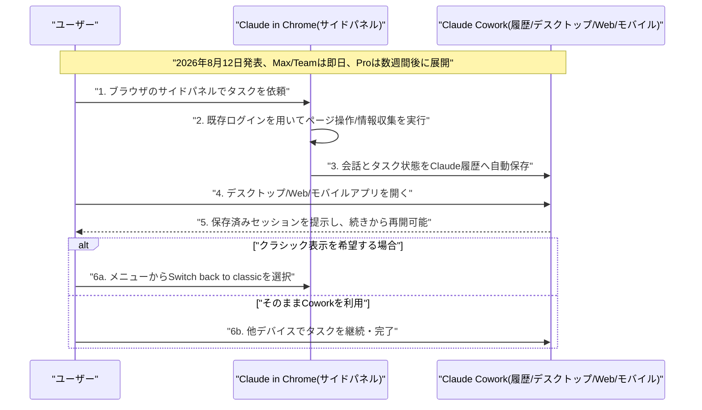

# LLM・AI Agent 最新情報レポート Vol.106
<!-- x-summary: xAIが「Grok 4.6」を発表、長時間稼働エージェント向けに強化しGPT-5.6 Sol水準の性能を半額で提供開始 -->

**作成日**: 2026年8月13日（JST）
**対象期間**: 2026年8月12日〜8月13日（Vol.105との差分）

---

## 目次

1. [Google Cloudアップデート](#1-google-cloudアップデート)
2. [Microsoft Azure AIアップデート](#2-microsoft-azure-aiアップデート)
3. [LLM Model / AI Agentアーキテクチャ・研究](#3-llm-model--ai-agentアーキテクチャ研究)
   - [3.1 xAI、長時間稼働エージェント特化の新フラッグシップ「Grok 4.6」を発表](#31-xai長時間稼働エージェント特化の新フラッグシップgrok-46を発表)
4. [公式ブログ・論文のリサーチ・要約](#4-公式ブログ論文のリサーチ要約)
5. [AI Agent搭載SaaS製品情報](#5-ai-agent搭載saas製品情報)
   - [5.1 Anthropic、ChromeサイドパネルをClaude Coworkに統合しクロスデバイスで作業継続可能に](#51-anthropicchromeサイドパネルをclaude-coworkに統合しクロスデバイスで作業継続可能に)
   - [5.2 GitHub Copilot for JetBrains、永続メモリとOllamaローカルモデル対応を追加](#52-github-copilot-for-jetbrains永続メモリとollamaローカルモデル対応を追加)
   - [5.3 OpenAI、ChatGPT広告表示を英国・メキシコ・ブラジル・日本・韓国へ拡大](#53-openaichatgpt広告表示を英国メキシコブラジル日本韓国へ拡大)
6. [LLM/AI Agentセキュリティインシデント](#6-llmai-agentセキュリティインシデント)
   - [6.1 VentureBeat調査、企業の過半数がAIエージェントの安全事故・ニアミスを経験と判明](#61-venturebeat調査企業の過半数がaiエージェントの安全事故ニアミスを経験と判明)
7. [その他特筆すべき情報](#7-その他特筆すべき情報)
   - [7.1 AIコーディングエージェント「Devin」のCognition、評価額400億ドルでの新規資金調達交渉中と判明](#71-aiコーディングエージェントdevinのcognition評価額400億ドルでの新規資金調達交渉中と判明)
8. [参考リンク](#8-参考リンク)

---

> **今号について:** 対象期間（8月12日〜13日）は、Google Cloud・Microsoft Azureの両クラウドベンダーからは発表日を確定できる重要アップデートが確認できず静かな一方、モデルリリース・製品機能・セキュリティ調査・資金調達の各面で動きが見られた。最大の注目点は、xAIが長時間稼働するエージェント向けに強化した新フラッグシップモデル「Grok 4.6」を投入したことで、OpenAIのGPT-5.6 Solに匹敵する性能をおよそ半額の価格で提供し、発表と同日にCursorへも組み込まれるなど、エージェント指向モデルの価格競争が一段と激化している様子がうかがえる。製品面では、AnthropicがChromeサイドパネル版Claudeを正式にClaude Coworkへ統合しブラウザでの作業をデスクトップ・モバイルへシームレスに引き継げるようにしたほか、GitHub Copilot for JetBrainsにセッションをまたぐ永続メモリとOllama連携によるローカルモデル対応が加わり、OpenAIはChatGPT広告表示を英国・メキシコ・ブラジル・日本・韓国の5市場へ拡大するなど、各社が主力製品のマネタイズ・利便性強化を同時並行で進めた。セキュリティ面では、VentureBeatの企業調査により、AIエージェントを本番運用する組織の過半数が既にセキュリティ事故またはニアミスを経験している一方、権限の実行時制御は3分の2にとどまり高リスクエージェントの隔離は5分の1未満と、ガバナンスの実装が実運用の広がりに追いついていない実態が改めて浮き彫りになった。その他では、AIコーディングエージェント「Devin」を手がけるCognitionが、5月の260億ドルからわずか3か月足らずで評価額400億ドルへの引き上げを目指す新規資金調達交渉に入ったと報じられ、AIコーディングエージェント市場への投資熱の高さを印象づけた。

---

## 1. Google Cloudアップデート

対象期間中に発表日を確定できる新規の重要発表は確認できなかった。Google Cloud Blogの「What's new」まとめも直近は8月3日〜7日週の内容にとどまっており、対象期間分はまだ反映されていない。**新情報なし。**

---

## 2. Microsoft Azure AIアップデート

対象期間中に発表日を確定できる新規の重要発表は確認できなかった。Microsoft Foundry Blog・Azure Updates等の直近更新も8月11日以前の内容（GitHub Copilot for JetBrains関連を除く）にとどまっている。**新情報なし。**

---

## 3. LLM Model / AI Agentアーキテクチャ・研究

### 3.1 xAI、長時間稼働エージェント特化の新フラッグシップ「Grok 4.6」を発表

xAI（SpaceXAI）は8月12日、新フラッグシップモデル「Grok 4.6」を公開した。前モデル「Grok 4.5」をベースに、より長い追加学習を実施し、モデル生成の推論データや技術・エンジニアリングデータを厳選して用いたほか、最適化アルゴリズムを刷新し、教師ありファインチューニングの軌跡を再生成、さらにカーネル最適化・Web開発・CAD（コンピュータ支援設計）など専用のドメイン別環境を含む強化学習を実施した。これにより、リサーチ・情報分析・コードベース全体での作業・成果物の作成といった複数ステップにわたる長時間タスクを継続的にこなす「長時間稼働エージェント」としての性能を重点的に強化したとしている。ベンチマークでは、総合指標のArtificial Analysis Intelligence Indexで61点を記録し、OpenAIのGPT-5.6 Sol（同61点）と並ぶ水準に達した一方、Anthropicの Claude Fable 5 Max（62点）にはわずかに及ばなかった。個別評価では、コーディング実務タスクのDeepSWE v1.1で65.9%（Grok 4.5の54%から上昇、GPT-5.6 Sol Maxの73%には届かず）、ターミナル操作評価のTerminal-Bench v3.0で26%（Grok 4.5の15.7%から上昇）を記録したほか、知識労働評価のGDPVal-AA v2では1753と首位を獲得した。コンテキストウィンドウは50万トークンで、推論負荷をlow/medium/high/xhighの4段階から選択できる。価格は入力100万トークンあたり2ドル、出力100万トークンあたり6ドルで、GPT-5.6 Solのおよそ半額とされる。発表と同日にAPI・xAI自社のGrok Buildツールに加え、AIコーディングエディタ「Cursor」にも即日組み込まれ、エージェント指向モデルを巡る主要プロバイダー間の性能・価格競争が一段と激化していることを印象づけた。[[1]](#ref-1) [[2]](#ref-2) [[3]](#ref-3) [[4]](#ref-4)

---

## 4. 公式ブログ・論文のリサーチ・要約

対象期間中、Google・OpenAI・Anthropicの公式ブログ・論文において、LLM/AI Agentのアーキテクチャや安全性研究に関する確度の高い新規発表は確認できなかった。**新情報なし。**

---

## 5. AI Agent搭載SaaS製品情報

### 5.1 Anthropic、ChromeサイドパネルをClaude Coworkに統合しクロスデバイスで作業継続可能に

Anthropicは8月12日、Chrome拡張機能「Claude in Chrome」のサイドパネルを、正式に「Claude Cowork」のフルセッションへと統合したと発表した。これまでブラウザのサイドパネルは独立した体験として扱われていたが、今回の変更によりブラウザ上で開始した会話・タスクがClaudeの会話履歴に保存されるようになり、デスクトップアプリ・Web版・モバイルアプリからいつでも再開できるようになった。アカウントに設定済みのスキルやコネクタもブラウザ上でそのまま利用可能で、追加設定は不要という。Claude in Chromeは現在のページを認識し、既存のブラウザログイン情報を使ってリンクのクリック・ページ間の移動・テキスト入力・フォーム入力といった操作をユーザーに代わって実行できる一方、対応はChrome本体に限られ、他のChromium系ブラウザやモバイル端末は現時点で非対応となっている。Cowork版サイドパネルはMax・Teamプランで即日利用可能となり、Proプランへは数週間かけて順次展開される予定。エンタープライズ管理者は機能を有効化した上で、利用を承認済みドメインに制限することもできる。旧来のインターフェースを好むユーザーは、画面右上のメニューから「Switch back to classic」を選択することで以前の表示に戻すことも可能。ブラウザ操作型エージェントの体験をClaudeの他製品群とシームレスに統合する動きとして注目される。[[5]](#ref-5) [[6]](#ref-6) [[7]](#ref-7)

### 5.2 GitHub Copilot for JetBrains、永続メモリとOllamaローカルモデル対応を追加

GitHubは8月11日、公式Changelogで、GitHub Copilot for JetBrainsに永続メモリ機能とOllama連携によるローカルモデル対応を追加したと発表した。「Copilotメモリ」機能により、エージェントチャットのセッションをまたいで有用な情報を保持・想起できるようになり、プロジェクトの詳細や好みを毎回入力し直す必要がなくなる。設定はCopilot設定ポータルの「Copilot Memory」トグルから管理できる。またOllamaをBYOK（Bring Your Own Key）プロバイダーとして利用できるようになり、ローカル環境で稼働するモデルをCopilotのワークフローに組み込めるようになった。このほか、macOS・Linux・Windowsの統合ターミナルからCopilot CLIを自動インストールできるようになり、ターミナルベースのエージェントワークフローをIDEから直接開始しやすくなったほか、MCPサーバー・ターミナル・カスタマイズ・クラウドエージェント全般にわたる信頼性の問題も併せて修正された。管理者向けには、プラグインの利用可否・MCPサーバーへのアクセス・権限バイパスの挙動・OpenTelemetry設定などを制御できるサーバー側の管理設定も拡充されている。[[8]](#ref-8)

### 5.3 OpenAI、ChatGPT広告表示を英国・メキシコ・ブラジル・日本・韓国へ拡大

OpenAIは8月12日、公式ブログ「Testing ads in ChatGPT」で、ChatGPTにおける広告表示のパイロットを英国・メキシコ・ブラジル・日本・韓国の5市場へ拡大したことを明らかにした。今年2月に米国のFree・ChatGPT Goプランのログイン済み成人ユーザー向けに開始した広告表示の試験提供を、今回段階的に国際展開した形となる。広告はChatGPTの回答の下に表示されるスポンサー付きの独立したユニットとして配置され、広告主名・ロゴ・見出し・説明文・リンク先ページ・画像アセットなどで構成される。パーソナライズが有効な場合、現在の会話・過去のチャット履歴・広告への反応などが表示広告の選定に利用されるという。一方、Plus・Pro・Business・Enterprise・Educationの各有料プランは引き続き広告非表示を維持する。OpenAIは、広告収益によって無料・低価格プランの質を高め、より多くのユーザーに高度なAIへのアクセスを提供する原資とする狙いを説明しており、「思慮深く拡大する」との方針を強調している。ChatGPTの製品戦略が、広告収益を軸にした無料層のマネタイズへとさらに踏み込む節目として注目される。[[9]](#ref-9) [[10]](#ref-10) [[11]](#ref-11)

---

## 6. LLM/AI Agentセキュリティインシデント

### 6.1 VentureBeat調査、企業の過半数がAIエージェントの安全事故・ニアミスを経験と判明

VentureBeatは8月12日、従業員100名超の企業116社を対象に実施したAIエージェントのセキュリティに関する調査結果「Pulse Research」シリーズの最新レポートを公開した。調査対象企業ではAIエージェントが既に本番環境で稼働しており、過半数の企業が実際にAIエージェント関連のセキュリティ事故、またはそれに近いニアミスを経験済みであることが明らかになった。制御面では、実行時にスコープを絞った権限を強制している企業は3分の2にとどまる一方、リスクの高いエージェントを隔離（アイソレーション）できている企業は5分の1未満にとどまり、封じ込め（コンテインメント）がセキュリティ体制の中で最も弱い層になっていると指摘された。またエージェント群全体で認証情報（クレデンシャル）を共有している企業もおよそ3分の2に上るという。別途実施された「エージェント・オーケストレーション」に関する調査（企業107社対象）では、典型的な企業は単一のオーケストレーション基盤ではなく平均3つのプラットフォームを同時運用していることが判明し、主要利用ではMicrosoftが先行する一方、今後の採用検討ではAnthropicが大差をつけてリードしていることも分かった。さらに、暴走したエージェントをコストが膨らむ前にリアルタイムで停止する手段を持たない企業が5社に1社に上ることも明らかになった。両調査は、AIエージェントの本番導入が急速に進む一方で、権限管理・隔離・コスト管理といったガバナンスの実装がその拡大スピードに追いついていない実態を改めて裏付ける内容となった。[[12]](#ref-12) [[13]](#ref-13)

---

## 7. その他特筆すべき情報

### 7.1 AIコーディングエージェント「Devin」のCognition、評価額400億ドルでの新規資金調達交渉中と判明

Bloombergは8月12日、AIコーディングエージェント「Devin」を開発するCognitionが、評価額少なくとも400億ドルでの新規資金調達に向けて投資家と初期交渉に入ったと報じた。同社は今年5月、260億ドルの評価額（プレマネー）で10億ドルを調達したばかりで、実現すればわずか3か月足らずで評価額が50%以上引き上げられることになる。新たな評価額は、Cognitionの年間経常収益（ARR）が10億ドルのランレートに到達するとの見通しに連動しているとみられる。5月の資金調達発表時、CEOのScott Wu氏はTechCrunchに対し、当時の年間経常収益ランレートが4億9200万ドルに達し、企業ユーザーによるDevinの利用が6か月間にわたり毎月50%ずつ増加していると説明していた。今回検討されている調達規模は10億ドルを上回るとみられ、実現すればCognitionはOpenAI・Anthropicなどのフロンティアラボに次ぐ評価額水準のAIスタートアップとなる可能性がある。自律型AIソフトウェアエンジニアを標榜するDevinを核に、AIコーディングエージェント市場への投資家の期待の高さが改めて示された形である。[[14]](#ref-14) [[15]](#ref-15) [[16]](#ref-16)

---

## 8. 参考リンク

**[1]** [Introducing Grok 4.6 | SpaceXAI](https://x.ai/news/grok-4-6)

**[2]** [SpaceXAI debuts Grok 4.6, overtaking Kimi K3's performance and matching GPT-5.6 Sol for world's third best on Artificial Analysis | VentureBeat](https://venturebeat.com/technology/spacexai-debuts-grok-4-6-overtaking-kimi-k3s-performance-and-matching-gpt-5-6-sol-for-worlds-third-best-on-artificial-analysis)

**[3]** [Introducing Grok 4.6 | Cursor](https://cursor.com/blog/grok-4-6)

**[4]** [SpaceXAI's Grok 4.6 matches OpenAI's best model and undercuts it on price | The Decoder](https://the-decoder.com/spacexais-grok-4-6-matches-openais-best-model-and-undercuts-it-on-price/)

**[5]** [Claude's Chrome side panel is now a full Cowork session | 9to5Mac](https://9to5mac.com/2026/08/12/claude-cowork-chrome/)

**[6]** [Claude can now pull data from your browser tabs and keep working on your desktop | Digital Trends](https://www.digitaltrends.com/computing/claude-can-now-pull-data-from-your-browser-tabs-and-keep-working-on-your-desktop/)

**[7]** [Use Claude Cowork on web, desktop, and mobile | Claude Help Center](https://support.claude.com/en/articles/15520349-use-claude-cowork-on-web-desktop-and-mobile)

**[8]** [Copilot memory and Ollama in GitHub Copilot for JetBrains | GitHub Changelog](https://github.blog/changelog/2026-08-11-copilot-memory-and-ollama-in-github-copilot-for-jetbrains/)

**[9]** [Testing ads in ChatGPT | OpenAI](https://openai.com/index/testing-ads-in-chatgpt/)

**[10]** ['Expand thoughtfully': OpenAI offers ChatGPT ads to new markets including the U.K., Brazil and Japan | Digiday](https://digiday.com/media-buying/expand-thoughtfully-openai-offers-chatgpt-ads-to-new-markets-including-the-u-k-brazil-and-japan/)

**[11]** [ChatGPT ads are now in the UK, South Korea, Mexico and Brazil; with further expansion expected throughout the year | Newsquawk](https://www.newsquawk.com/headlines/chatgpt-ads-are-now-in-the-uk-south-korea-mexico-and-brazil-with-further-expansion-expected-throughout-the-year)

**[12]** [Agentic security: Enterprises enforce agent permissions two-thirds of the time — and isolate high-risk agents less than one in five | VentureBeat](https://venturebeat.com/resources/agentic-security-enterprises-enforce-agent-permissions-two-thirds-of-the-time-and-isolate-high-risk-agents-less-than-one-in-five)

**[13]** [Agentic orchestration: Enterprise AI organizations know how to govern agents but still can't meter what they cost | VentureBeat](https://venturebeat.com/resources/agentic-orchestration-enterprise-ai-organizations-know-how-to-govern-agents-but-still-cant-meter-what-they-cost)

**[14]** [AI Startup Cognition in New Funding Talks at $40 Billion Value | Bloomberg](https://www.bloomberg.com/news/articles/2026-08-12/ai-startup-cognition-in-new-funding-talks-at-40-billion-value)

**[15]** [AI coding startup Cognition reportedly already in talks to raise at $40B valuation | TechCrunch](https://techcrunch.com/2026/08/12/ai-coding-startup-cognition-reportedly-already-in-talks-to-raise-at-40b-valuation/)

**[16]** [Cognition AI eyes $40B valuation less than three months after $26B mark | Tech Funding News](https://techfundingnews.com/cognition-ai-eyes-40b-valuation-less-than-three-months-after-26b-mark/)
