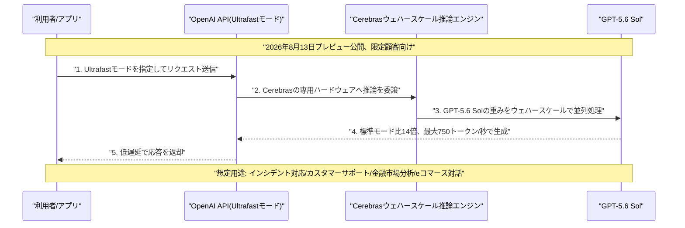

# LLM・AI Agent 最新情報レポート Vol.107
<!-- x-summary: Googleが新型「Gemini 3.7 Flash」を発表、コーディング・エージェント性能強化し価格半額に -->

**作成日**: 2026年8月14日（JST）
**対象期間**: 2026年8月13日〜8月14日（Vol.106との差分）

---

## 目次

1. [Google Cloudアップデート](#1-google-cloudアップデート)
2. [Microsoft Azure AIアップデート](#2-microsoft-azure-aiアップデート)
3. [LLM Model / AI Agentアーキテクチャ・研究](#3-llm-model--ai-agentアーキテクチャ研究)
   - [3.1 Google、コーディング・エージェント特化の新モデル「Gemini 3.7 Flash」を投入](#31-googleコーディングエージェント特化の新モデルgemini-37-flashを投入)
4. [公式ブログ・論文のリサーチ・要約](#4-公式ブログ論文のリサーチ要約)
5. [AI Agent搭載SaaS製品情報](#5-ai-agent搭載saas製品情報)
   - [5.1 OpenAI、Cerebrasとの連携で応答速度14倍の「Ultrafast」モードをプレビュー公開](#51-openaicerebrasとの連携で応答速度14倍のultrafastモードをプレビュー公開)
   - [5.2 Microsoft、CopilotアプリとMicrosoft 365 Copilotを単一アプリへ統合開始](#52-microsoftcopilotアプリとmicrosoft-365-copilotを単一アプリへ統合開始)
   - [5.3 Google、Geminiでスプレッドシートをミニアプリ化する「Sheets canvas」を提供開始](#53-googlegeminiでスプレッドシートをミニアプリ化するsheets-canvasを提供開始)
6. [LLM/AI Agentセキュリティインシデント](#6-llmai-agentセキュリティインシデント)
7. [その他特筆すべき情報](#7-その他特筆すべき情報)
   - [7.1 Anthropic、動画生成・GPU効率化スタートアップDecartを60億ドルで買収交渉中と判明](#71-anthropic動画生成gpu効率化スタートアップdecartを60億ドルで買収交渉中と判明)
   - [7.2 OpenAI、元Wiz幹部のDali Rajic氏を最高収益責任者(CRO)に招聘](#72-openai元wiz幹部のdali-rajic氏を最高収益責任者croに招聘)
8. [参考リンク](#8-参考リンク)

---

> **今号について:** 対象期間（8月13日〜14日）を貫く最大のテーマは、モデル・製品双方における「速度と効率」を巡る競争の激化である。Googleはわずか3か月で3世代目となる新型軽量モデル「Gemini 3.7 Flash」を投入し、コーディング・エージェント性能を高めつつ価格を前世代の半額に引き下げた一方、OpenAIもCerebrasとの連携により応答速度を14倍に高める「Ultrafast」モードをプレビュー公開するなど、フロンティアラボ各社が知能水準の向上だけでなく処理速度・コスト効率でも差別化を競う構図が一段と鮮明になった。製品面では、Microsoftが乱立していた「Copilot」アプリと「Microsoft 365 Copilot」を単一アプリへ統合する取り組みを開始し、GoogleもGemini搭載でスプレッドシートを自然言語だけでインタラクティブなミニアプリへ変換できる「Sheets canvas」の提供を始めるなど、生成AIを日常業務ツールへより深く溶け込ませる「プロダクト統合・生成UI化」の動きが目立った。ビジネス面では、Anthropicが動画生成・GPU効率化技術を手がけるイスラエルのスタートアップDecartを、同社として過去最大規模となる約60億ドルで買収する交渉に入ったと報じられたほか、OpenAIは元Wiz幹部のDali Rajic氏を新たな最高収益責任者(CRO)に招聘するなど、IPOを見据えた事業基盤・商用戦略の強化に向けた動きも相次いだ。なお、対象期間中はGoogle Cloud・Microsoft Azureの両クラウドプラットフォーム自体のアップデート、公式ブログ・論文によるアーキテクチャ研究の新規発表、および新規のセキュリティインシデント開示については、発表日を確定できる重要情報は確認できなかった。

---

## 1. Google Cloudアップデート

対象期間中に発表日を確定できる新規の重要発表は確認できなかった。Google Cloud Blogの「What's new」まとめも直近は8月11日〜12日週の内容（Apigee hybridのマイナーアップデート等）にとどまっており、対象期間分の目立った更新は反映されていない。**新情報なし。**

---

## 2. Microsoft Azure AIアップデート

対象期間中に発表日を確定できる新規の重要発表は確認できなかった。Microsoft Foundry Blog・Azure Updates等の直近更新も6月〜7月分の内容が中心で、対象期間に該当する新規のプラットフォームアップデートは見当たらなかった。**新情報なし。**

---

## 3. LLM Model / AI Agentアーキテクチャ・研究

### 3.1 Google、コーディング・エージェント特化の新モデル「Gemini 3.7 Flash」を投入

Googleは8月13日、Gemini Flashシリーズの最新モデル「Gemini 3.7 Flash」を公開した。6月の「Gemini 3.5 Flash-Lite」、7月21日の「Gemini 3.6 Flash」に続き、わずか3か月で3世代目となるFlash系モデルの投入であり、自社ブログでは「最も知的なワークホースモデル」と位置づけ、人間による逐一の監督を減らした本番運用ワークフローを必要とする開発者・企業・サブスクライバー向けに、コーディングとエージェント機能を重点的に強化したとしている。特にデバッグなどのコーディングタスクで前モデルを上回り、初回実行から本番投入可能な水準のコードを生成しやすくなったほか、複数ステップにわたるタスク処理や自動化エージェントの実行速度・精度も向上したという。発表と同時に、Google自身のAI生産性エージェント「Gemini Spark」もGemini 3.7 Flashへ切り替わり、Google AI Ultra/Proサブスクライバー向けに160以上の新規国・地域で利用可能になった。ベンチマークでは、総合指標のArtificial Analysis Intelligence Indexで56点を記録し、前モデルのGemini 3.6 Flash（52点）から4点上昇、Claude Sonnet 5（55点）をわずかに上回った一方、GPT-5.6 TerraおよびMuse Spark 1.2（ともに57点）にはわずかに届かなかった。個別評価では、Webアプリ開発力を測るCode Arena（Elo）で1588を記録し、Muse Spark 1.2（1535）、Claude Sonnet 5（1541）、GPT-5.6 Terra（1523）を上回って首位に立った一方、長時間のソフトウェアエンジニアリング評価DeepSWE v1.1ではGPT-5.6 Terraが69.6%で首位、Geminiは65.3%、Claude Sonnet 5は53.8%にとどまった。知識労働評価のGDPVal-AA v2ではMuse Spark 1.2が首位で、Geminiは1525と伸び悩み、エージェントのコンピュータ操作能力を測るOSWorld-2.0でもGeminiは38.1%とGPT-5.6 Terraの50.2%に及ばず、コーディング・Web開発では強みを見せる一方、汎用的なエージェント操作力では他社モデルに一日の長がある結果となった。価格は2026年末まで入力100万トークンあたり0.75ドル、出力100万トークンあたり3.75ドルの導入価格が適用され、前モデルの発表時価格からおよそ半額に引き下げられた。Google AI Studio・Android Studio・Vertex AIなどのエンタープライズ向けツールで即日利用可能となっている。なお同モデルは、上位モデルと目される「Gemini 3.5 Pro」の投入が遅延を続ける中での投入となっており、Bloomberg・Axiosなど複数メディアは、Googleがフラッグシップモデルの遅延を横目にFlash系モデルの高頻度投入で開発者の関心をつなぎとめようとしている構図だと指摘している。[[1]](#ref-1) [[2]](#ref-2) [[3]](#ref-3) [[4]](#ref-4) [[5]](#ref-5)

---

## 4. 公式ブログ・論文のリサーチ・要約

対象期間中、Google・OpenAI・Anthropicの公式ブログ・論文において、LLM/AI Agentのアーキテクチャや安全性研究に関する確度の高い新規発表は確認できなかった。**新情報なし。**

---

## 5. AI Agent搭載SaaS製品情報

### 5.1 OpenAI、Cerebrasとの連携で応答速度14倍の「Ultrafast」モードをプレビュー公開

OpenAIは8月13日、公式ブログ「Previewing Ultrafast mode」で、フラッグシップモデル「GPT-5.6 Sol」向けの新しい処理モード「Ultrafast」をプレビュー公開したと発表した。標準モードと比較して最大14倍の速度でタスクを処理でき、出力トークンを毎秒最大750トークンという高速度で生成できるという。技術基盤には半導体メーカーCerebrasとの連携によるウェハースケール推論エンジンが採用されており、両社は同日付でそれぞれ技術詳細を解説する記事を公開した。想定用途としては、より小型で専用特化型のモデルに切り替えることなく、応答速度そのものが重要となる場面、具体的にはインシデント対応、カスタマーサポート、金融市場分析、eコマースにおける対話処理などが挙げられている。現時点ではプレビュー版として限定的な顧客のみへの提供にとどまる。8月12〜13日にかけてxAIの「Grok 4.6」が価格面での差別化を打ち出した（Vol.106既報）のに続き、OpenAIは今回、知能水準を維持したまま処理速度で差別化を図る格好となり、フロンティアラボ各社の競争軸が「知能」に加えて「速度」「コスト効率」へと広がっている実態を改めて印象づけた。[[6]](#ref-6) [[7]](#ref-7) [[8]](#ref-8) [[9]](#ref-9)

### 5.2 Microsoft、CopilotアプリとMicrosoft 365 Copilotを単一アプリへ統合開始

Microsoftは8月13日、これまで別々に提供してきた一般消費者向け「Copilot」アプリと業務向け「Microsoft 365 Copilot」アプリを、単一のアプリへ統合する取り組みを開始したと発表した。年内に予定される、より広範な「スーパーアプリ」化構想に先立つ布石と位置づけられており、統合後のアプリにはアカウント切り替え機能が搭載され、個人利用と業務利用の体験を1つのアプリ内で明確に切り分けられるようにする。無料ユーザーもCopilot Chatへのアクセスが提供されるほか、Word・Excel・Outlookなど他のMicrosoft 365アプリやファイル・コンテンツにも、統合後のアプリから直接アクセスできるようになるという。これまで用途の重なる2つのCopilotアプリが並存し利用者の混乱を招いていたとの指摘があった中、ブランド・体験の一本化を図る動きとなる。Microsoft 365 Copilotを巡っては、Copilot ChatへのGPT-5導入やWordでのAnthropicモデル対応など、複数のAIモデルを併用できるマルチモデル戦略も並行して進められており、今回のアプリ統合はこうした製品ラインアップ全体の整理・強化の一環として位置づけられる。[[10]](#ref-10) [[11]](#ref-11) [[12]](#ref-12)

### 5.3 Google、Geminiでスプレッドシートをミニアプリ化する「Sheets canvas」を提供開始

Googleは、Gemini搭載の新機能「Sheets canvas」の提供を開始した。自然言語による指示だけで、既存のGoogleスプレッドシートを読み書き可能なインタラクティブなカスタムアプリへと変換できる機能で、コーディング不要でスタディトラッカーや座席表といった業務用途のミニアプリを作成できる。利用者はスプレッドシートを開き、「Ask Gemini」サイドパネルから「Create canvas」を選択したうえで、欲しい出力を自然言語で説明するだけでよく、Geminiが既存データをもとにレイアウトを構築し、生成後も追加のプロンプトでデザインや構成、機能を変更できる。作成されたキャンバスは元データと自動的に同期する。Google AI Pro/Ultraサブスクライバー向けにはグローバルで英語版が提供されるほか、Workspaceの Business・Enterprise Standard/Plusプラン、Google AI Pro for Educationアドオンの利用者にも順次展開される。Rapid Releaseドメイン向けには8月10日から拡張ロールアウトが始まっており、Scheduled Releaseドメイン向けには8月31日から段階的に展開される予定。ノーコードでの「生成UI」型アプリ構築という潮流の中で、常に最新のデータと同期する点を特徴とする機能として位置づけられる。[[13]](#ref-13) [[14]](#ref-14) [[15]](#ref-15)

---

## 6. LLM/AI Agentセキュリティインシデント

対象期間中、新規に開示された確度の高いLLM/AI Agent関連のセキュリティインシデントは確認できなかった。**新情報なし。**

---

## 7. その他特筆すべき情報

### 7.1 Anthropic、動画生成・GPU効率化スタートアップDecartを60億ドルで買収交渉中と判明

Bloombergは8月13日、Anthropicがイスラエル発のAIインフラ・動画生成スタートアップDecartを、約60億ドルで買収する初期段階の交渉に入ったと報じた。実現すればAnthropicにとって過去最大規模の買収となり、注目度の高いIPOを控えるタイミングでの動きとなる。Decartは2023年、Dean Leitersdorf氏・Orian Leitersdorf氏の兄弟とMoshe Shalev氏の3名のイスラエル人エンジニアが創業し、リアルタイムの生成動画技術、シミュレーション環境向けの世界モデル、そしてAIの学習・運用コストを削減するGPU効率化技術を手がけている。同社は5月の資金調達ラウンドで評価額約40億ドルに達しており（2025年8月時点の31億ドルから上昇）、今回報じられた60億ドルはそこからおよそ50%のプレミアムに相当する。買収の狙いは、Decartのチップ効率化技術を取り込むことで、Claudeの需要急増に対応するAnthropic自社の計算インフラの処理能力を底上げすることにあるとみられる。なお交渉はまだ最終合意に至っておらず、破談となる可能性も残されている。[[16]](#ref-16) [[17]](#ref-17) [[18]](#ref-18)

### 7.2 OpenAI、元Wiz幹部のDali Rajic氏を最高収益責任者(CRO)に招聘

OpenAIは8月13日、Dali Rajic氏を新たな最高収益責任者(Chief Revenue Officer, CRO)に任命したと発表した。同氏は、企業のグローバルな収益戦略の統括を担い、広告事業の拡大やエンタープライズ需要の取り込みなど、OpenAIが商用展開の新たな局面に入る中での舵取りを担うことになる。Rajic氏は、Googleが約320億ドルで買収したクラウドセキュリティ企業Wizで社長兼COOを務めた経歴を持つほか、Zscaler、AppDynamicsでも要職を歴任してきた。IPOに向けた準備が進むとされる中、OpenAIが商用・営業体制の強化を急いでいることを示す人事といえる。[[19]](#ref-19) [[20]](#ref-20)

---

## 8. 参考リンク

**[1]** [Gemini 3.7 Flash: our most intelligent workhorse model | Google Blog](https://blog.google/innovation-and-ai/models-and-research/gemini-models/introducing-gemini-3-7-flash/)

**[2]** [Gemini 3.7 Flash launches three weeks after last model, live in Spark | 9to5Google](https://9to5google.com/2026/08/13/gemini-3-7-flash-launch/)

**[3]** [Gemini 3.7 Flash Launches with Major Performance Gains and Half-Off Pricing | Android Headlines](https://www.androidheadlines.com/2026/08/google-gemini-3.7-flash-launch-price-cut-performance-boost.html)

**[4]** [Google Releases Gemini 3.7 Flash, Competes With GPT 5.6 Terra & Muse Spark 1.2 On Benchmarks | OfficeChai](https://officechai.com/ai/gemini-3-7-flash-benchmarks/)

**[5]** [Google's Gemini 3.7 Flash arrives before Gemini 3.5 Pro | Axios](https://www.axios.com/2026/08/13/google-gemini-37-flash)

**[6]** [Previewing Ultrafast mode: GPT-5.6 Sol at up to 14X the speed | OpenAI](https://openai.com/index/previewing-ultrafast/)

**[7]** [OpenAI introduces 'Ultrafast,' a new mode that makes GPT-5.6 Sol work at 14x the speed | TechCrunch](https://techcrunch.com/2026/08/13/openai-introduces-ultrafast-a-new-mode-that-makes-gpt-5-6-sol-work-at-14x-the-speed/)

**[8]** [Accelerating GPT-5.6 Sol Ultrafast with OpenAI | Cerebras](https://www.cerebras.ai/blog/accelerating-gpt-5-6-sol-ultrafast-with-openai)

**[9]** [OpenAI previews 'Ultrafast' GPT-5.6 Sol running up to 14 times faster | 9to5Mac](https://9to5mac.com/2026/08/13/openai-previews-ultrafast-gpt-5-6-sol-running-up-to-14-times-faster/)

**[10]** [Microsoft's dueling Copilot apps have combined into a single entity | The Register](https://www.theregister.com/ai-and-ml/2026/08/13/microsofts-dueling-copilot-apps-have-combined-into-a-single-entity/5287512)

**[11]** [Microsoft begins unified Copilot app rollout | Windows Central](https://www.windowscentral.com/artificial-intelligence/microsoft-copilot/microsoft-begins-unified-copilot-app-rollout-reveals-major-plan-to-merge-copilot-and-microsoft-365-copilot-across-all-platforms-along-with-updated-branding)

**[12]** [Microsoft is Unifying its Consumer Copilot App and Microsoft 365 Copilot into a Single App | Thurrott](https://www.thurrott.com/a-i/340382/microsoft-is-unifying-its-consumer-copilot-app-and-microsoft-365-copilot-into-a-single-app)

**[13]** [Build mini-apps with Gemini in Google Sheets | Google Workspace Blog](https://blog.google/products-and-platforms/products/workspace/sheets-canvas-for-google-sheets-spreadsheets/)

**[14]** [Google Sheets gets Gemini-powered Canvas for interactive data | Android Authority](https://www.androidauthority.com/google-sheets-gemini-canvas-3698582/)

**[15]** [Google launches Sheets canvas for Gemini mini-apps | TestingCatalog](https://www.testingcatalog.com/google-launches-sheets-canvas-for-gemini-mini-apps/)

**[16]** [Anthropic Said in Talks to Buy AI Startup Decart for $6 Billion | Bloomberg](https://www.bloomberg.com/news/articles/2026-08-13/anthropic-said-in-talks-to-buy-ai-startup-decart-for-6-billion)

**[17]** [Anthropic said in talks to buy startup Decart for $6 billion | Fortune](https://fortune.com/2026/08/13/anthropic-said-in-talks-to-buy-startup-decart-for-6-billion/)

**[18]** [Anthropic is reportedly in talks to buy Decart for $6bn, its biggest deal yet | TNW](https://thenextweb.com/news/anthropic-decart-6bn-acquisition-talks)

**[19]** [Dali Rajic Appointed as New OpenAI Chief Revenue Officer | LatestLY](https://www.latestly.com/technology/dali-rajic-appointed-as-new-openai-chief-revenue-officer-7558998.html)

**[20]** [OpenAI Hires Wiz Exec Rajic as CRO | StartupHub.ai](https://www.startuphub.ai/ai-news/artificial-intelligence/2026/openai-hires-wiz-exec-rajic-as-cro)
