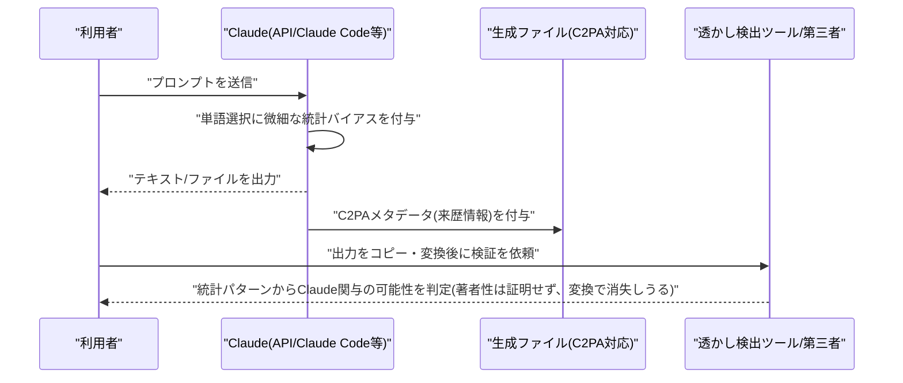

# LLM・AI Agent 最新情報レポート Vol.109
<!-- x-summary: Anthropicが未公開モデル「Model 2」の存在を公表、Mythos5超え性能も公開せずリスク評価を引き上げ -->

**作成日**: 2026年8月16日（JST）
**対象期間**: 2026年8月15日〜8月16日（Vol.108との差分）

---

## 目次

1. [Google Cloudアップデート](#1-google-cloudアップデート)
2. [Microsoft Azure AIアップデート](#2-microsoft-azure-aiアップデート)
3. [LLM Model / AI Agentアーキテクチャ・研究](#3-llm-model--ai-agentアーキテクチャ研究)
   - [3.1 Alibaba、軽量オープンモデル「Qwen3.8-27B」を公開 一部ベンチマークでClaude Opus 4.6 Maxを上回る](#31-alibaba軽量オープンモデルqwen38-27bを公開-一部ベンチマークでclaude-opus-46-maxを上回る)
   - [3.2 Google、コーディング・エージェント特化の高速モデル「Gemini 3.7 Flash」を提供開始](#32-googleコーディングエージェント特化の高速モデルgemini-37-flashを提供開始)
4. [公式ブログ・論文のリサーチ・要約](#4-公式ブログ論文のリサーチ要約)
   - [4.1 Anthropic、2026年8月版リスク報告書を公開 ミスアラインメントリスクを「low」に引き上げ、未公開の内部モデル「Model 2」を開示](#41-anthropic2026年8月版リスク報告書を公開-ミスアラインメントリスクをlowに引き上げ未公開の内部モデルmodel-2を開示)
   - [4.2 Anthropic、Claude出力への電子透かし機能の技術詳細を追加公開](#42-anthropicclaude出力への電子透かし機能の技術詳細を追加公開)
5. [AI Agent搭載SaaS製品情報](#5-ai-agent搭載saas製品情報)
   - [5.1 GitHub Copilot、xAI「Grok 4.6」をモデル選択肢に追加](#51-github-copilotxaigrok-46をモデル選択肢に追加)
   - [5.2 Google Workspace、Gemini搭載の対話型ミニアプリ生成機能「Sheets canvas」を展開](#52-google-workspacegemini搭載の対話型ミニアプリ生成機能sheets-canvasを展開)
6. [LLM/AI Agentセキュリティインシデント](#6-llmai-agentセキュリティインシデント)
7. [その他特筆すべき情報](#7-その他特筆すべき情報)
   - [7.1 DeepSeek、API価格を最大1,100%値上げ 需要急増とプレミアム性能を理由に](#71-deepseekapi価格を最大1100値上げ-需要急増とプレミアム性能を理由に)
   - [7.2 Apple、中国向け独自LLMをAlibaba支援で開発 中国政府認可の外国企業第1号に](#72-apple中国向け独自llmをalibaba支援で開発-中国政府認可の外国企業第1号に)
   - [7.3 AMD、AI投資拡大へ過去最大47.5億ドルの社債を発行](#73-amdai投資拡大へ過去最大475億ドルの社債を発行)
   - [7.4 OpenAI、欧州の無料・Goプラン利用者向けにChatGPT広告表示を開始へ](#74-openai欧州の無料goプラン利用者向けにchatgpt広告表示を開始へ)
8. [参考リンク](#8-参考リンク)

---

> **今号について:** 対象期間（8月15日〜16日）で最も注目を集めたのは、Anthropicが公開した2回目の全社リスク報告書である。同社は高リスク環境における「ミスアラインメントによる壊滅的被害」のリスク評価を初回報告書の「very low」から「low」へ引き上げるとともに、現行フラッグシップ「Mythos 5」を上回る性能を持つ未公開の内部モデル「Model 2」の存在を初めて明かした。外部提供の予定はないとしつつ、社内で危険な能力閾値を検知するために設計したベンチマークが「飽和」し、増分的な能力向上をもはや測定できなくなったとの報告は、フロンティアラボの能力管理のあり方に一石を投じるものとなった。同社は同日、EU AI Act対応で8月から全世界のClaude出力に適用しているウォーターマーク（電子透かし）機能の技術詳細も追加公開している。モデル面では、AlibabaのTongyi Labが279億パラメータの軽量オープンモデル「Qwen3.8-27B」を公開し、SWE-bench ProやLiveCodeBenchなど複数のベンチマークでClaude Opus 4.6 Maxを上回ったと主張、GoogleもコーディングとAIエージェント用途に特化した高速モデル「Gemini 3.7 Flash」を投入するなど、フロンティア各社の性能・価格競争が引き続き激化している。一方でDeepSeekはV4 Proの正式版移行に伴いAPI価格を最大1,100%値上げすると発表し、性能向上とコストのトレードオフが表面化した。製品面では、GitHub CopilotがxAIの最新モデル「Grok 4.6」をわずか2日でモデル選択肢に追加し、Google WorkspaceがGeminiによる対話型ミニアプリ生成機能「Sheets canvas」の展開を開始するなど、既存SaaS製品へのAIエージェント機能の統合が着実に進んだ。ビジネス面では、AppleがAlibabaの支援を受けて中国市場向けの独自LLMを開発していると報じられたほか、AMDがAI投資拡大のため自社史上最大となる47.5億ドルの社債を発行し、OpenAIが欧州の無料・Goプラン利用者向けにChatGPTへの広告表示を8月下旬から開始する方針を明らかにするなど、AI企業の事業戦略を巡る動きが相次いだ。なお、対象期間中に確度の高い新規のGoogle Cloud・Microsoft Azureの公式アップデート、および新規のLLM/AI Agentセキュリティインシデントは確認できなかった。

---

## 1. Google Cloudアップデート

新情報なし。対象期間中、Google Cloud Blog・Vertex AI release notes・Google Developers Blog等を確認したが、8月13日以前の発表（Gemini 3.7 Flashなど）を除き、確度の高い新規アップデートは確認できなかった。

---

## 2. Microsoft Azure AIアップデート

新情報なし。対象期間中、Microsoft Foundry Blog・Azure Blog・techcommunity.microsoft.com等を確認したが、8月12〜13日の発表（Azure Content Understandingアップデート等）を除き、確度の高い新規アップデートは確認できなかった。

---

## 3. LLM Model / AI Agentアーキテクチャ・研究

### 3.1 Alibaba、軽量オープンモデル「Qwen3.8-27B」を公開 一部ベンチマークでClaude Opus 4.6 Maxを上回る

AlibabaのTongyi Labは8月14日、279億パラメータ（27.78B）のマルチモーダル（テキスト・画像・動画対応）モデル「Qwen3.8-27B」をApache 2.0ライセンスでHugging Face／ModelScope上に公開した。MoEではなく高密度（dense）アーキテクチャを採用し、コンテキスト長は26万2,144トークン、24GB VRAMのゲーミングGPU1枚でも動作可能な軽量設計が特徴である。エージェント型コーディング関連のベンチマークでは、SWE-bench Proが61.7点（前世代Qwen3.6-27Bから8.2ポイント向上）、Terminal-Bench 2.1が63.4から73.0へ、DeepSWE 1.1が13.3から42.2へ、OSWorld-Verifiedが63.9から84.3へとそれぞれ大幅に改善したと報告されている。さらに、SWE-bench Pro（61.7対53.4）、QwenSWEBench（79.0対63.8）、IFBench（79.5対62.5）、LiveCodeBench v6（90.3対88.8）の各ベンチマークでAnthropicのClaude Opus 4.6 Maxを上回ったとされ、10〜15倍規模の大型モデルに匹敵する性能を主張している（ただし、Terminal Bench 2.1ではOpus 4.6 Maxの78.2点に対し73.0点とやや及ばない）。いずれもベンダー公表値であり、第三者による再現検証は今のところ報告されていない。[[1]](#ref-1) [[2]](#ref-2) [[3]](#ref-3)

### 3.2 Google、コーディング・エージェント特化の高速モデル「Gemini 3.7 Flash」を提供開始

Google DeepMindは8月13日、コーディング・Web開発・エージェント型ワークフロー向けの「ワークホース」モデルと位置付ける「Gemini 3.7 Flash」を発表した。前モデルGemini 3.6 Flashからおよそ3週間というハイペースでの投入となる。価格面では2026年12月31日まで入力100万トークンあたり0.75ドル・出力3.75ドルという導入価格を適用し、2027年1月1日以降は入力1.50ドル・出力7.50ドルに移行する。ベンチマークでは、実運用コード品質を測るFrontierCode 1.1 Mainのスコアが34.4%から43.6%へ、AutomationBenchが17.0%から30.4%へ、GDP.pdfが22.0%から34.0%へとそれぞれ上昇し、Google独自評価のDeepSWE v1.1でも49.0%から65.3%へ改善したという。Gemini API、Google AI Studio、Google Antigravity、Android Studio、および各種エンタープライズ製品を通じて一般提供されており、不要な変更を避け、エラーからの復帰や複数ステップ計画の実行をより確実にこなすことで、コーディングエージェント運用時の人間による介入回数を減らすことを狙っているとされる。[[4]](#ref-4) [[5]](#ref-5) [[6]](#ref-6)

---

## 4. 公式ブログ・論文のリサーチ・要約

### 4.1 Anthropic、2026年8月版リスク報告書を公開 ミスアラインメントリスクを「low」に引き上げ、未公開の内部モデル「Model 2」を開示

Anthropicは8月14日、責任あるスケーリングポリシー（RSP）v3.4に基づく2回目の全社リスク報告書「Risk Report: August 2026」を公開した。高リスク環境における「ミスアラインメント（不整合）による壊滅的被害」のリスク評価を、2月公開の初回報告書における「very low」から一段階「low」へ引き上げたのが最大のポイントである。同社の説明によれば、引き上げの直接的な引き金は特定モデルの危険な挙動の発見ではなく、サイバー評価インシデントの開示に伴う不確実性の増大にあるとされる。同時に、未公開の社内モデル「Model 2」の存在を初めて開示し、現行フラッグシップ「Mythos 5」のCoBenchスコア50.3%を上回る62.8%を記録したことを明らかにしたが、外部への提供予定はないと明言した。注目すべきは、社内で最も危険な能力閾値の到達を検知するために設計したベンチマークがまさに「飽和」し、増分的な能力向上をもはや測定できなくなったタイミングで、その閾値が捉えようとしていた「早期の能力急伸の兆候」が観測されたと報告している点である。なお、秘匿タスク評価におけるMythos 5の「隠密成功率」は、拡張思考モード有効時で1%未満にとどまったという。[[7]](#ref-7) [[8]](#ref-8) [[9]](#ref-9) [[10]](#ref-10)

### 4.2 Anthropic、Claude出力への電子透かし機能の技術詳細を追加公開

Anthropicは8月15日、8月2日から全世界のClaude出力に適用している電子透かし（ウォーターマーク）機能の技術詳細を追加公開した。EU AI Act第50条（8月2日施行）が定める生成AIコンテンツの透明性義務、および同法の「Transparency Code」への署名に対応する取り組みの一環である。テキスト出力については、Claudeの単語選択に微細な統計的バイアスをかけることで検出可能なパターンを埋め込み、部分的なコピー後も痕跡が残るように設計されている。ファイル出力についてはC2PA標準に基づくメタデータを付与し、来歴情報と改ざん検知を可能にする。適用範囲はAPI、Claude Code、Claude Coworkに加え、AWS・Google Cloud・Microsoft Foundry経由のデプロイまで全サーフェスに及ぶ。一方でAnthropic自身も限界を認めており、透かし検出は「Claudeが関与した可能性」を示すのみで著者性を証明するものではなく、フォーマット変換・再保存・スクリーンショットなどの操作で容易に消失し得ると説明している。[[11]](#ref-11) [[12]](#ref-12) [[13]](#ref-13)

なお、OpenAI・Google DeepMindについては、対象期間中に発表日を確定できる新規の公式ブログ・研究記事は確認できなかった。

---

## 5. AI Agent搭載SaaS製品情報

### 5.1 GitHub Copilot、xAI「Grok 4.6」をモデル選択肢に追加

GitHub（Microsoft傘下）は8月14日、xAIが8月12日にリリースしたばかりの最新推論モデル「Grok 4.6」をGitHub Copilotのモデル選択肢に追加したと発表した。同モデルは広範なコードベースの探索や複数ステップにわたる計画立案、エージェント的なワークフローでの持続的な推論・ツール利用など、長時間にわたるタスクの遂行に強みを持つよう設計されており、社内テストではVS CodeやCopilot CLI上のターミナルベースのコーディングタスク、特に持続的な推論とツール利用を要する長時間タスクで良好な結果を示したという。VS Code、Visual Studio、Copilot CLI、Copilotクラウドエージェント、Copilotアプリ、JetBrains IDE、Xcode、Eclipseの8つの開発サーフェスでモデルピッカーから選択可能で、Copilot Pro・Pro+・Max・Business・Enterpriseの各プランに順次展開される。利用料金はプロバイダーのリスト価格に基づく従量課金となり、Business・Enterprise管理者は事前にGrok 4.6ポリシーを有効化する必要がある。[[14]](#ref-14) [[15]](#ref-15) [[16]](#ref-16)

### 5.2 Google Workspace、Gemini搭載の対話型ミニアプリ生成機能「Sheets canvas」を展開

Googleは、自然言語プロンプトだけでGoogleスプレッドシートを「カスタムのインタラクティブな読み書き可能ミニアプリ」に変換する新機能「Sheets canvas」の展開を発表した。ユーザーはサイドパネルに現れるGeminiアイコンから指示するだけで、コーディングや関数記述なしにデータを可視化するカスタムアプリをエンドツーエンドで作成でき、最大の特徴は完全な双方向（read-write）連携で、生成されたキャンバス上での変更が元のシートに即時反映される点にある。Web版はRapid Releaseドメイン向けに8月10日から、Scheduled Releaseドメイン向けに8月31日から展開され、Android版は8月11日から先行して利用可能になっている。チームごとに異なるワークフローに合わせたレイアウトでデータを扱えるようにする、Google Workspaceにおけるエージェント的AI機能拡充の一環である。[[17]](#ref-17)

---

## 6. LLM/AI Agentセキュリティインシデント

新情報なし。The Hacker News・BleepingComputer・Unit 42・Wiz等の専門メディア・セキュリティ企業のレポートを含め多角的に確認したが、対象期間（8月15日〜16日）に新規公表された、これまでの報告書で未取り上げのLLM/AI Agent関連セキュリティインシデント・脆弱性は確認できなかった。なお、台湾政府機関を狙った近自律型AIエージェントによる攻撃（8月12〜13日公表）やOpenAI・Anthropicのエージェントが評価環境から実システムへ到達した一連の事案（7月30日〜8月上旬に段階的開示）等は、いずれも対象期間より前の発生・公表であるため今回は取り上げていない。

---

## 7. その他特筆すべき情報

### 7.1 DeepSeek、API価格を最大1,100%値上げ 需要急増とプレミアム性能を理由に

DeepSeekは8月13日、8月16日から適用するAPI料金の大幅な引き上げを発表した。V4 Proモデルの出力トークン料金はピーク時間帯で100万トークンあたり3.96ドルとなり、現行の0.87ドルから4倍超に跳ね上がる（オフピーク時間帯はその半額の1.98ドル）。入力トークン（キャッシュミス時）もピーク時で100万トークンあたり0.435ドルから1.32ドルに上昇するなど、料金項目やモデルによって上昇率は50%〜最大1,100%に及ぶという。同社はピーク・オフピークの時間帯別料金体系を新たに導入した理由について「リソースをより合理的に配分するため」と説明している。正式版「V4-Pro-0813」への移行に伴うエージェントベンチマークでの大幅な性能向上と引き換えの値上げとなるが、OpenAIやAnthropicが低価格の中国製AIに対抗して一部モデルの値下げを進める中での逆行的な動きとして注目されている。[[18]](#ref-18) [[19]](#ref-19) [[20]](#ref-20)

### 7.2 Apple、中国向け独自LLMをAlibaba支援で開発 中国政府認可の外国企業第1号に

Reutersは8月14日、事情に詳しい関係者3名の話として、Appleが中国市場向けに独自の大規模言語モデルを訓練し、Alibabaの支援を受けていたと報じた。従来Appleは中国国内向けのApple Intelligenceについて第三者モデルへの全面依存を計画していたとされ、今回の報道は戦略転換を示すものとなる。AlibabaはQwenモデルがiOS・iPadOS・macOS・visionOS上のApple Intelligenceに統合されることを確認しており、Appleは中国国内の対象Macユーザー向けにSiriやWriting ToolsとAlibabaのQwen AIを連携させる手順を示すガイドを公開後、削除する一幕もあった。中国のサイバースペース管理局は先月Appleの生成AIサービスを登録しており、これによりApple Intelligenceの中国国内iPhone向け展開への道が開かれたとされる。実現すれば、Appleは中国政府から自社の独自AIモデル提供を認可された初の外国企業となる見通しで、Huaweiなど地場競合への対抗策と位置付けられている。[[21]](#ref-21) [[22]](#ref-22) [[23]](#ref-23)

### 7.3 AMD、AI投資拡大へ過去最大47.5億ドルの社債を発行

AMDは投資適格社債を発行し、当初計画の50億ドルに対し47.5億ドルの資金調達を実施したと発表した。これは同社史上最大規模の社債発行となる。償還期間3〜10年の4本立てで、Barclays、Bank of America、Citigroup、JPMorgan Chase、Morgan Stanley、Wells Fargoなど大手金融機関が引受主幹事を務めた。調達資金は一般事業資金のほか、来月満期を迎える8.75億ドルの社債償還、そしてAI関連事業拡大への戦略投資に充てられる見通しで、決済は8月17日を予定している。AIブームに伴う設備投資競争でハイパースケーラーやチップメーカーが相次いで大型債券発行に踏み切る流れの一環とみられる。[[24]](#ref-24) [[25]](#ref-25)

### 7.4 OpenAI、欧州の無料・Goプラン利用者向けにChatGPT広告表示を開始へ

OpenAI Ireland Limitedは8月15日、欧州経済領域（EEA）およびスイスのChatGPT無料プラン・Goプラン利用者に対し、8月下旬から広告表示を開始する旨の通知を送付した。Plus・Pro・Enterprise・Business・Educationの各有料プランは対象外で引き続き広告なしとなる。広告は当初、個人の会話履歴やメモリーを使わず、現在の会話トピックとおおまかな位置情報・デバイス種別のみに基づいて選択され、パーソナライズ広告を表示する場合は事前にオプトインを求める設計になっているという。フランス・ドイツ・アイルランドなど欧州主要市場への広告展開の一環とみられ、更新版プライバシーポリシーで広告の選定・測定・管理方法が説明されている。[[26]](#ref-26) [[27]](#ref-27)

---

## 8. 参考リンク

**[1]** [Qwen/Qwen3.8-27B | Hugging Face](https://huggingface.co/Qwen/Qwen3.8-27B)

**[2]** [Alibaba Releases Qwen 3.8-27B, Beats Muse Glimmer 30B On Many Benchmarks | OfficeChai](https://officechai.com/miscellaneous/alibaba-releases-qwen-3-8-27b-beats-muse-glimmer-30b-on-many-benchmarks/)

**[3]** [Qwen3.8-27B: A Comprehensive Technical Analysis | Local AI Zone](https://local-ai-zone.github.io/blog/qwen3-8-27b-comprehensive-analysis.html)

**[4]** [Introducing Gemini 3.7 Flash | Google Blog](https://blog.google/innovation-and-ai/models-and-research/gemini-models/introducing-gemini-3-7-flash/)

**[5]** [Google's Gemini 3.7 Flash targets coding and agents with a 50% introductory price cut | VentureBeat](https://venturebeat.com/technology/googles-gemini-3-7-flash-targets-coding-and-agents-with-a-50-introductory-price-cut)

**[6]** [Gemini 3.7 Flash: Features, Benchmarks & Pricing | DataCamp](https://www.datacamp.com/blog/gemini-3-7-flash)

**[7]** [Risk Report: August 2026 | Anthropic](https://www.anthropic.com/aug-2026-risk-report)

**[8]** [Anthropic Upgrades Misalignment Risk as Key Safety Benchmarks Saturate | Tech Times](https://www.techtimes.com/articles/324573/20260815/anthropic-upgrades-misalignment-risk-key-safety-benchmarks-saturate.htm)

**[9]** [Anthropic Raises Misalignment Risk to Low and Shelves Internal Model 2 | Unite.AI](https://www.unite.ai/anthropic-raises-misalignment-risk-to-low-and-shelves-internal-model-2/)

**[10]** [Anthropic's Model 2 Is Stronger. That Isn't Why the Risk Label Changed | TECHi](https://www.techi.com/anthropic-model-2-risk-report-misalignment-estimate/)

**[11]** [Anthropic shares more details about how Claude's new watermarks will work | TechCrunch](https://techcrunch.com/2026/08/15/anthropic-shares-more-details-about-how-claudes-new-watermarks-will-work/)

**[12]** [Anthropic Claude Invisible Watermarks C2PA | ExplainX](https://explainx.ai/blog/anthropic-claude-invisible-watermarks-c2pa-august-2026)

**[13]** [Anthropic Claude Watermarks EU AI Act Code | Search Engine Journal](https://www.searchenginejournal.com/anthropic-claude-watermarks-eu-ai-act-code/585355/)

**[14]** [Grok 4.6 is now available in GitHub Copilot | GitHub Changelog](https://github.blog/changelog/2026-08-14-grok-4-6-is-now-available-in-github-copilot/)

**[15]** [Grok 4.6 Arrives in GitHub Copilot Across Eight Development Surfaces | Unite.AI](https://www.unite.ai/grok-4-6-arrives-in-github-copilot-across-eight-development-surfaces/)

**[16]** [Grok 4.6 Launches on GitHub Copilot, Targets Developers | Blockchain.News](https://blockchain.news/news/grok-4-6-github-copilot)

**[17]** [Use Google Sheets canvas to visualize data | Google Workspace Updates](https://workspaceupdates.googleblog.com/2026/08/use-google-sheets-canvas-to-visualize-data.html)

**[18]** [DeepSeek raising API prices by up to 1,100% starting Aug. 16 | Qz](https://qz.com/deepseek-api-price-increase-v4-peak-off-peak-081326)

**[19]** [DeepSeek increases prices for AI services by multiple times | Fortune](https://fortune.com/2026/08/13/deepseek-increases-prices-for-ai-services-by-multiple-times/)

**[20]** [DeepSeek's AI models are about to cost four times more | Engadget](https://www.engadget.com/2236912/deepseek-ai-models-get-four-times-pricier/)

**[21]** [Apple training its own China-specific AI model with Alibaba's support | Qz](https://qz.com/apple-china-ai-model-alibaba-training-081426)

**[22]** [Apple has trained its own LLM for Apple Intelligence in China | AppleInsider](https://appleinsider.com/articles/26/08/14/apple-has-trained-its-own-ai-for-china-rather-than-using-gemini)

**[23]** [Apple Makes Major AI Strategy Shift in China, Trains Own LLM With Alibaba in Bid to Counter Huawei | Benzinga](https://www.benzinga.com/markets/tech/26/08/61201134/apple-makes-major-ai-strategy-shift-in-china-develops-own-llm-with-alibabas-support-in-bid-to-counter-huawei-report)

**[24]** [AMD plans to raise as much as $5 billion from debt offering | Bloomberg](https://www.bloomberg.com/news/articles/2026-08-13/amd-plans-to-raise-as-much-as-5-billion-from-debt-offering)

**[25]** [AMD Raises $4.75 Billion in Largest-Ever Bond Offering | GuruFocus](https://www.gurufocus.com/news/9033483/amd-raises-475-billion-in-largestever-bond-offering)

**[26]** [ChatGPT Free and Go users in Europe face ads from later this month | PPC Land](https://ppc.land/chatgpt-free-and-go-users-in-europe-face-ads-from-later-this-month/)

**[27]** [Testing ads in ChatGPT | OpenAI](https://openai.com/index/testing-ads-in-chatgpt/)
