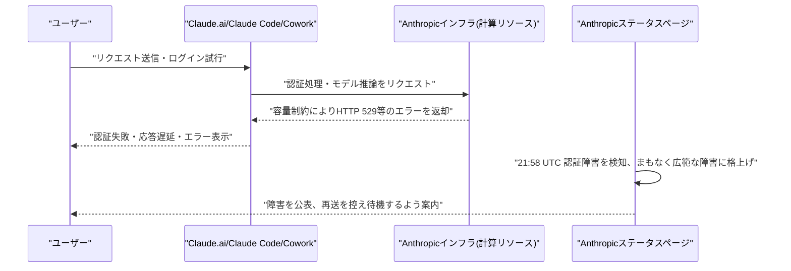

# LLM・AI Agent 最新情報レポート Vol.110
<!-- x-summary: 決済大手Stripe、AIモデルゲートウェイ「OpenRouter」を70億ドル超で買収へ、AIインフラ再編加速 -->

**作成日**: 2026年8月17日（JST）
**対象期間**: 2026年8月16日〜8月17日（Vol.109との差分）

---

## 目次

1. [Google Cloudアップデート](#1-google-cloudアップデート)
2. [Microsoft Azure AIアップデート](#2-microsoft-azure-aiアップデート)
3. [LLM Model / AI Agentアーキテクチャ・研究](#3-llm-model--ai-agentアーキテクチャ研究)
   - [3.1 DeepSeek「V4 Flash」、ベンチマーク首位も実運用エージェントタスクでは伸び悩みとComposio調査](#31-deepseekv4-flashベンチマーク首位も実運用エージェントタスクでは伸び悩みとcomposio調査)
4. [公式ブログ・論文のリサーチ・要約](#4-公式ブログ論文のリサーチ要約)
5. [AI Agent搭載SaaS製品情報](#5-ai-agent搭載saas製品情報)
   - [5.1 Google Workspace、Gemini in Google Classroomのモバイル展開を完了 文脈対応スタータープロンプトを追加](#51-google-workspacegemini-in-google-classroomのモバイル展開を完了-文脈対応スタータープロンプトを追加)
6. [LLM/AI Agentセキュリティインシデント](#6-llmai-agentセキュリティインシデント)
7. [その他特筆すべき情報](#7-その他特筆すべき情報)
   - [7.1 決済大手Stripe、AIモデルゲートウェイ「OpenRouter」を70億ドル超で買収へ](#71-決済大手stripeaiモデルゲートウェイopenrouterを70億ドル超で買収へ)
   - [7.2 Anthropic CEO Dario Amodei氏、AIへの逆風は「信頼の危機」と発言](#72-anthropic-ceo-dario-amodei氏aiへの逆風は信頼の危機と発言)
   - [7.3 Claude、世界的な障害が発生 認証・応答に不具合](#73-claude世界的な障害が発生-認証応答に不具合)
8. [参考リンク](#8-参考リンク)

---

> **今号について:** 対象期間（8月16日〜17日）は新モデルの発表こそなかったものの、AI業界の構造変化を示す動きが相次いだ。最大の話題は、決済大手StripeがAIモデルゲートウェイのOpenRouterを70億ドル超で買収することが明らかになった件で、5月時点の評価額13億ドルから1年足らずで5倍超に跳ね上がったことになり、「モデルへのアクセス層」というレイヤー自体がAIインフラの要衝として資本市場から評価され始めたことを印象づけた。研究・分析面では、ベンチマークで首位級の性能を示すDeepSeek「V4 Flash」を8種類のエージェントハーネスで実運用タスクにかけたComposioの検証で、成功率がハーネスによって46.7%〜66.7%まで大きくばらつくことが明らかになり、モデル単体の性能スコアと実運用での信頼性は別物であるという重要な示唆が得られた。企業トップの発言としては、Anthropic CEOのDario Amodei氏が、AIへの社会的逆風は同社の警鐘的な発言が原因ではなく、テック業界全体に対する数十年来の「信頼の危機」が根底にあるとの見解を示し、業界論調に一石を投じた。また対象期間の終盤には、Claude.ai・Claude Code・Claude Coworkを含む世界的なサービス障害が発生し、認証エラーや応答遅延が報告された（本稿執筆時点で対応状況を追い切れていない部分がある点に留意されたい）。製品面では、Google WorkspaceがGemini in Google Classroomのモバイル展開を完了し、授業文脈を踏まえたスタータープロンプト機能を追加するなど、教育分野でのAIエージェント活用が着実に進んだ。なお、Google Cloud・Microsoft Azureの確度の高い新規アップデート、公式ブログ・論文の新規発表、および新規のLLM/AI Agentセキュリティインシデントは、対象期間中には確認できなかった。

---

## 1. Google Cloudアップデート

新情報なし。対象期間中、Google Cloud Blog・Vertex AI release notes・Google for Developers Blog等を確認したが、確度の高い新規アップデートは確認できなかった。

---

## 2. Microsoft Azure AIアップデート

新情報なし。対象期間中、Microsoft Foundry Blog・Azure Blog・techcommunity.microsoft.com等を確認したが、確度の高い新規アップデートは確認できなかった。

---

## 3. LLM Model / AI Agentアーキテクチャ・研究

### 3.1 DeepSeek「V4 Flash」、ベンチマーク首位も実運用エージェントタスクでは伸び悩みとComposio調査

エージェントツール企業Composioは8月16日、DeepSeekの軽量モデル「V4 Flash」を対象に、Claude Code・Codex・OpenCode・Pi・Oh My Pi（OMP）・DeepAgentsを含む8種類のエージェントハーネス上で実運用タスクを検証した結果を公表した。V4 FlashはArtificial Analysis Intelligence Indexなど各種ベンチマークで上位に位置づけられる一方、Gmail・GitHub・Slack・Google Sheetsといった実際のツールを操作する30種類の複雑な複数ステップタスクをハーネスにかけたところ、合計240回の試行のうち成功は129回（53.8%）にとどまり、全ハーネスが共通して成功できたワークフローは30件中わずか6件だった。ハーネス別ではPiが20件成功（66.7%）で最高、Claude Code・Codex・DeepAgentsが16件（53.3%）、OpenCodeが14件（46.7%）で最低となるなど、同一モデルでもオーケストレーション層（ツール構成・キャッシュ挙動・リトライ設計・プロバイダースタック）次第で結果が大きく変動することが示された。コスト面では1タスクあたりの成功コストがPiで約0.028ドル、Claude Codeで約0.195ドルと7倍近い差が生じたという。なお、DeepSeekは8月16日16時（UTC）付けでV4 Pro/Flashのピーク・オフピーク別料金体系を本格適用しており、Flashの出力トークン価格はオフピークで100万トークンあたり0.66ドル、ピークで1.32ドルとなる（既報の値上げの実施分）。Composioは、モデル単体の性能スコアだけでなく、エージェントハーネス側の設計が実運用での信頼性を左右する主要因になっていると指摘している。[[1]](#ref-1) [[2]](#ref-2)

---

## 4. 公式ブログ・論文のリサーチ・要約

新情報なし。対象期間中、Anthropic Newsroom・OpenAI News・Google DeepMind Blog・Google Research Blogを確認したが、確度の高い新規の公式ブログ・論文発表は確認できなかった（Anthropicの複数エージェント研究レポートは8月13日付、電子透かし技術詳細は8月15日付でいずれもVol.108・Vol.109で既報のため対象外）。

---

## 5. AI Agent搭載SaaS製品情報

### 5.1 Google Workspace、Gemini in Google Classroomのモバイル展開を完了 文脈対応スタータープロンプトを追加

Googleは、教育向けAIアシスタント「Gemini in Google Classroom」について、Web版で8月10日から展開していた新機能のモバイル版展開を8月17日に完了したと発表した。目玉機能は、生徒向けGeminiタブのスタータープロンプトがClassroomの文脈情報を取り込めるようになった点で、生徒がスタータープロンプトをタップすると対象の授業・課題を選択するボックスが表示され、その課題のタイトル・指示文・カリキュラム教材を踏まえた形でGeminiとのやり取りが始まる仕組みになっている。従来18歳以上の生徒に限定されていた対象年齢も、管理者が許可すればK-12を含む全年齢の生徒に拡大されており、Classroomモバイルアプリ上でもスタータープロンプトや個人用クラスノートブックが利用可能になった。授業内でのAIエージェント活用を、Classroomアプリと行き来する手間なく完結させることを狙った機能強化である。[[3]](#ref-3)

---

## 6. LLM/AI Agentセキュリティインシデント

新情報なし。The Hacker News・BleepingComputer・Cloud Security Alliance等の専門メディア・セキュリティ企業のレポートを多角的に確認したが、対象期間（8月16日〜17日）に新規公表された、これまでの報告書で未取り上げのLLM/AI Agent関連セキュリティインシデント・脆弱性は確認できなかった。なお、LiteLLMの脆弱性CVE-2026-42271（MCPテストエンドポイントを悪用したコマンドインジェクション）は6月に既に活発な悪用が確認・CISA KEV登録済みのものであり、対象期間より前の事案のため今回は取り上げていない。

---

## 7. その他特筆すべき情報

### 7.1 決済大手Stripe、AIモデルゲートウェイ「OpenRouter」を70億ドル超で買収へ

Bloombergは8月16日、決済大手Stripeが複数のAIモデルへの単一アクセスポイントを提供するAIゲートウェイ「OpenRouter」を70億ドル超（約1兆500億円）で買収する契約を最終合意したと報じた。OpenRouterは2023年にNFTマーケットプレイスOpenSeaの共同創業者Alex Atallah氏らが設立した企業で、400以上のモデルへのアクセスを提供し、世界で800万人のユーザーを抱えるとされる。同社は5月に実施したシリーズB（Alphabet傘下CapitalG主導、調達額1億1,300万ドル）で評価額13億ドルをつけたばかりで、今回の買収額はその5倍超に相当する（一部報道では最終合意前の交渉段階で100億ドル規模との観測もあった）。OpenRouterのAtallah CEOは自社を「AI版のStripe」と位置づけており、企業が特定ベンダーへのロックインを避けつつコストに応じてモデルを使い分けられる点を強みとして訴求してきた。Stripeにとっては、決済処理事業で培った基盤を生かしつつ、急成長するAIインフラ市場での足場を強化する狙いがあるとみられる。[[4]](#ref-4) [[5]](#ref-5)

### 7.2 Anthropic CEO Dario Amodei氏、AIへの逆風は「信頼の危機」と発言

Anthropic CEOのDario Amodei氏は8月15日、投資家のGavin Baker氏がAll-InポッドキャストおよびX上で「Amodei氏によるAIリスクへの警鐘的な発言が、データセンター建設などへの反発を助長している」と主張したのに対し反論し、8月16日付でTechCrunch・Fortune等が報じた。Amodei氏は、自身の発信は「リスクと恩恵にほぼ半々の比重を置いてきた」とした上で、AIが世界を良い方向に変えうる可能性を十分に描けていないとの問題意識からエッセイ「Machines of Loving Grace」を執筆したと説明した。その上で同氏は「これは根本的に信頼の危機だと思う。一般の人々は企業も政府もテック業界も信頼しておらず、常に『自分たちを騙す新しい手口を企んでいるのではないか』と疑っている」と述べ、こうした不信感は数十年来蓄積されてきたものであり、単発のマーケティングキャンペーンでは払拭できないと注意を促した。同氏の発言は、AI業界内でのリスクコミュニケーションのあり方や、フロンティアラボの情報発信が世論に与える影響を巡る議論の一環として注目されている。[[6]](#ref-6) [[7]](#ref-7)

### 7.3 Claude、世界的な障害が発生 認証・応答に不具合

Anthropicは8月16日21時58分（UTC、日本時間8月17日6時58分）頃、Claude.ai・Claude Code・Claude Coworkの一部ユーザーで認証に失敗する問題を検知したとステータスページで発表し、その後まもなくClaude.aiおよびplatform.claude.comにおけるパフォーマンス低下を伴うより広範なサービス障害へと切り替わったことを確認したと報告した。BleepingComputerによれば、影響はログイン不可・Claudeの読み込み失敗・リクエストの未完了・各種エラーなど複数の形で現れているという。Newsweekの報道では、Claudeのサービス障害は「capacity constraints（容量制約）」、すなわちプラットフォーム全体への需要がAnthropicの計算リソースを一時的に上回った際に発生するHTTP 529エラーとして現れることが多いと説明されており、Anthropicは障害発生時に同じプロンプトを繰り返し再送するとキューの混雑を悪化させるため、待機を推奨しているという。報道によれば、Claudeは2026年に入ってから同種のサービス障害を繰り返しており、8月5日には7時間半にわたり主要モデル4種が停止する障害も発生していた。なお本件は本稿執筆時点（日本時間8月17日朝）で発生から間もなく、Anthropicによる完全復旧の確認や原因の詳細は追い切れていない。[[8]](#ref-8) [[9]](#ref-9)

---

## 8. 参考リンク

**[1]** [DeepSeek's top-ranked V4 Flash stumbles on real agent tasks as its prices surge | VentureBeat](https://venturebeat.com/orchestration/deepseeks-top-ranked-v4-flash-stumbles-on-real-agent-tasks-as-its-prices-surge)

**[2]** [Finding the Best Harness for DeepSeek V4 Flash | Composio](https://composio.dev/content/best-agent-harness-deepseek-v4-flash)

**[3]** [Gemini in Google Classroom is expanding to users of all ages, with contextualized Gemini starter prompts for students | Google Workspace Updates](https://workspaceupdates.googleblog.com/2026/08/gemini-in-google-classroom-is-expanding-to-users-of-all-ages-with-contextualized-Gemini-starter-prompts-for-students.html)

**[4]** [Stripe will reportedly acquire AI gateway startup OpenRouter for $7B+ | TechCrunch](https://techcrunch.com/2026/08/16/stripe-will-reportedly-acquire-ai-gateway-startup-openrouter-for-7b/)

**[5]** [Stripe Finalizes Deal to Acquire AI Startup OpenRouter for Over $7 Billion | Bloomberg](https://www.bloomberg.com/news/articles/2026-08-16/stripe-nears-deal-to-buy-ai-firm-openrouter-for-over-7-billion)

**[6]** [Anthropic CEO says AI backlash is 'fundamentally a crisis of trust' | TechCrunch](https://techcrunch.com/2026/08/16/anthropic-ceo-says-ai-backlash-is-fundamentally-a-crisis-of-trust/)

**[7]** [Dario Amodei admits AI suffers from a crisis of trust, saying people worry companies or governments are 'cooking up some new way to screw them over' | Fortune](https://fortune.com/2026/08/16/dario-amodei-anthropic-ai-trust-crisis-regulation-frontier-open-models-negative-views/)

**[8]** [Anthropic confirms Claude is down in major outage affecting multiple services | BleepingComputer](https://www.bleepingcomputer.com/news/artificial-intelligence/anthropic-confirms-claude-is-down-in-major-outage-affecting-multiple-services/)

**[9]** [Is Claude Down? Users Report AI Platform Issues as Anthropic Confirms Outage | Newsweek](https://www.newsweek.com/claude-down-outage-capacity-constraints-not-working-anthropic-12262120)
