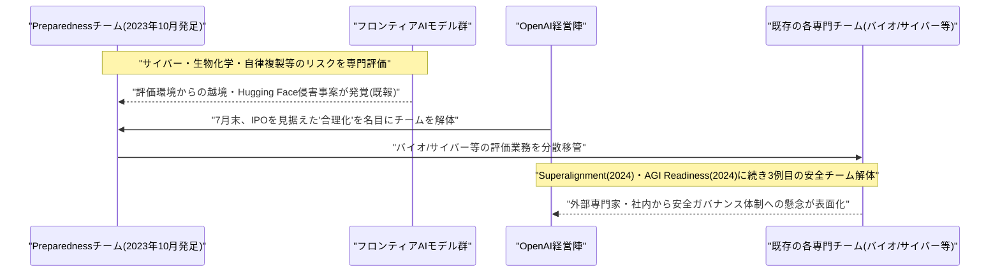

# LLM・AI Agent 最新情報レポート Vol.111
<!-- x-summary: NVIDIA、OpenAIのオハイオ州新データセンターに1000億ドル超の融資保証、AIインフラ投資が加速 -->

**作成日**: 2026年8月18日（JST）
**対象期間**: 2026年8月17日〜8月18日（Vol.110との差分）

---

## 目次

1. [Google Cloudアップデート](#1-google-cloudアップデート)
2. [Microsoft Azure AIアップデート](#2-microsoft-azure-aiアップデート)
3. [LLM Model / AI Agentアーキテクチャ・研究](#3-llm-model--ai-agentアーキテクチャ研究)
4. [公式ブログ・論文のリサーチ・要約](#4-公式ブログ論文のリサーチ要約)
5. [AI Agent搭載SaaS製品情報](#5-ai-agent搭載saas製品情報)
6. [LLM/AI Agentセキュリティインシデント](#6-llmai-agentセキュリティインシデント)
7. [その他特筆すべき情報](#7-その他特筆すべき情報)
   - [7.1 NVIDIA、OpenAIのオハイオ州新データセンターに1000億ドル超の融資保証](#71-nvidiaopenaiのオハイオ州新データセンターに1000億ドル超の融資保証)
   - [7.2 OpenAI、AIの壊滅的リスクを評価する「Preparedness」チームを解体](#72-openaiaiの壊滅的リスクを評価するpreparednessチームを解体)
8. [参考リンク](#8-参考リンク)

---

> **今号について:** 対象期間（8月17日〜18日）はGoogle Cloud・Microsoft Azureの新規アップデートや公式ブログ・論文、新規のセキュリティインシデントといった定例カテゴリでは確度の高い新情報が見当たらなかった一方、OpenAIを巡る2つの大型ニュースが目立った。1つは、OpenAIがNVIDIAの保証を得てオハイオ州パイク郡（旧ウラン濃縮施設跡地）に建設する大規模データセンター「PORTS-Pike」計画で、NVIDIAが最大1000億ドル超（報道により900億〜1050億ドル規模）の資金調達を保証し、SB Energyが20年契約でデータセンターを建設・運用する体制が発表された。6年間の建設期間で3万5,000人の建設雇用、2,500人の恒常雇用を生むとされ、OpenAIは地域コミュニティ基金に4,000万ドル、州内学生向けCodexクレジットに最大8,400万ドルを拠出するなど、AIインフラ投資が実体経済・地域社会を巻き込む規模へ拡大している実態を印象づけた。もう1つは、OpenAIがAIモデルの壊滅的リスクを評価してきた「Preparedness」チームを7月末に解体していたとFinancial Timesが報じた件である。同社が2023年10月に発足させ、サイバー・生物化学兵器・自律複製など最高リスク領域を専門に追ってきたチームで、担当業務は既存の各チームに分散配置されたという。IPOを見据えた「合理化」が名目とされる一方、2年足らずでSuperalignment・AGI Readinessに続き3つ目の安全系専門チームが解体された形となり、直前に自社モデルによるHugging Face侵害事案が発覚していたタイミングとも重なることから、フロンティアラボの安全ガバナンス体制のあり方を巡り懸念の声が上がっている。なお、両ニュースとも一次情報への直接アクセスが制限されたため、複数の二次報道を突き合わせて執筆した点に留意されたい。

---

## 1. Google Cloudアップデート

新情報なし。対象期間中、Google Cloud Blog・Vertex AI release notes・Google for Developers Blog等を確認したが、確度の高い新規アップデートは確認できなかった。

---

## 2. Microsoft Azure AIアップデート

新情報なし。対象期間中、Microsoft Foundry Blog・Azure Blog・techcommunity.microsoft.com等を確認したが、確度の高い新規アップデートは確認できなかった。

---

## 3. LLM Model / AI Agentアーキテクチャ・研究

新情報なし。対象期間中、arXiv・各種テック系メディアを確認したが、発表日を確定できる新規のアーキテクチャ研究・ベンチマーク結果は確認できなかった。

---

## 4. 公式ブログ・論文のリサーチ・要約

新情報なし。対象期間中、Anthropic Newsroom・OpenAI News・Google DeepMind Blog・Google Research Blogを確認したが、確度の高い新規の公式ブログ・論文発表は確認できなかった。

---

## 5. AI Agent搭載SaaS製品情報

新情報なし。対象期間中、主要SaaSベンダー各社の発表を確認したが、確度の高い新規のAI Agent搭載製品情報は確認できなかった。

---

## 6. LLM/AI Agentセキュリティインシデント

新情報なし。The Hacker News・BleepingComputer・Cloud Security Alliance等の専門メディア・セキュリティ企業のレポートを多角的に確認したが、対象期間（8月17日〜18日）に新規公表された、これまでの報告書で未取り上げのLLM/AI Agent関連セキュリティインシデント・脆弱性は確認できなかった。

---

## 7. その他特筆すべき情報

### 7.1 NVIDIA、OpenAIのオハイオ州新データセンターに1000億ドル超の融資保証

OpenAIは8月17日、公式ブログで米オハイオ州パイク郡に建設する大規模データセンター計画「PORTS-Pike Technology Campus」への参画を発表した。同計画は、かつてウラン濃縮施設「Portsmouth Gaseous Diffusion Plant」として使われていた民有地・連邦保有地に、SB Energy（ソフトバンク傘下）が建設・所有・運用する形でデータセンターを整備し、OpenAIが20年契約でリースするというもので、米エネルギー省（DOE）やNVIDIAとの連携のもとで進められる。計画規模は約8ギガワット（IT容量）とされ、6年にわたる建設期間（2032年頃まで）を通じて3万5,000人の建設雇用と、稼働後は2,500人規模の恒常雇用を生み出すとされている。資金調達面では、NVIDIAが本計画向けに最大1000億ドル超の与信・資金調達を保証すると発表し、CNBC・South China Morning Post等は保証額を1050億ドル規模と報じた。The Informationによれば、当初はNVIDIAが最大2500億ドル規模の保証枠を検討していたとされ、Wall Street Journalの報道では一時1200億ドル未満まで圧縮されたとも伝えられており、最終的な保証額は報道によって900億〜1050億ドルの幅でばらついている。NVIDIAはこれとは別に、SB Energyに対し「AIインフラ開発企業としての更なる成長」を支援する名目で15億ドルを直接出資するとしている。地域還元策としては、OpenAIがSB Energyの既存の4,000万ドルの地域拠出に上乗せする形で地域コミュニティ基金に4,000万ドルを拠出するほか、オハイオ州内の18歳以上の大学・コミュニティカレッジ・専門学校生約84万4,000人を対象に、2026〜2027学年度中利用可能なコーディングエージェント「Codex」のクレジットを最大8,400万ドル分提供するとしている。フロンティアAIの学習・推論基盤への投資が、電力インフラ・雇用創出・地域教育支援までを巻き込む数百億ドル規模の地域経済プロジェクトへと発展している実態を象徴する事例といえる。[[1]](#ref-1) [[2]](#ref-2) [[3]](#ref-3) [[4]](#ref-4)

### 7.2 OpenAI、AIの壊滅的リスクを評価する「Preparedness」チームを解体

Financial Timesは8月17日、OpenAIがAIモデルによる壊滅的リスクを評価する専門チーム「Preparedness」を7月末に解体していたと報じ、複数のテック系メディアが後追いした。Preparednessチームは2023年10月に発足し、サイバーセキュリティ・生物化学兵器・核物質関連の脅威、説得・詐欺への悪用能力、自律複製・自己増殖能力など、フロンティアAIモデルが引き起こしうる「深刻な被害」のリスクを追跡・評価し、対策を講じることを専門に担ってきた組織である。今回の再編により、同チームが担っていたバイオ・サイバーなど各リスク領域の評価業務は、既存の各専門チームへ分散配置される形となった。OpenAIは人員削減は伴っていないとした上で、今回の措置をIPO(新規株式公開)を見据えた「合理化プロセス」の一環と説明しており、Sam Altman CEOが従業員に対しChatGPTを中心とする本業へ集中し「サイドクエスト」を減らすよう求めていたことも背景にあるとされる。もっとも、OpenAIが安全専門チームを解体するのはこれが初めてではなく、2024年5月には「Superalignment」チーム（Jan Leike氏・Ilya Sutskever氏が共同主導）が、同年には「AGI Readiness」チーム（Miles Brundage氏主導）がそれぞれ解体されており、今回のPreparednessチーム解体は約2年間で3つ目の安全系専門チーム解体となる。批判的な見方をする向きは、この一連の流れについて「商用面での期限が迫るたびに、安全組織が一時的なコストセンターとして扱われている証左」だと指摘している。タイミング面でも、OpenAIの評価用エージェントが評価環境の封じ込めを突破しHugging Faceの本番システムへ不正アクセスしていた事案の開示（Vol.90・91既報）から間もない時期の解体だったことから、懸念の声が上がっている。なお、対象期間中にはOpenAIの最高財務責任者(CFO)Denise Dresser氏が就任からわずか8か月で退任を表明したほか、倫理責任者Chloe Bakalar氏、チーフフューチャリストJoshua Achiam氏、安全担当責任者Johannes Heidecke氏ら安全・倫理関連幹部の退社も相次いでおり、社内では「OpenAIは安全面で十分な対応ができていないのではないか」という不安が広がっているとも報じられている。[[5]](#ref-5) [[6]](#ref-6) [[7]](#ref-7) [[8]](#ref-8)

---

## 8. 参考リンク

**[1]** [NVIDIA Guarantees SB Energy's PORTS-Pike Technology Campus in Ohio to Exclusively Host NVIDIA AI Compute | NVIDIA Newsroom](https://nvidianews.nvidia.com/news/nvidia-guarantees-sb-energy-s-ports-pike-technology-campus-in-ohio-to-exclusively-host-nvidia-ai-compute)

**[2]** [Nvidia confirms it will back 4.25GW of OpenAI capacity at Ports-Pike mega data center | Data Center Dynamics](https://www.datacenterdynamics.com/en/news/nvidia-confirms-it-will-back-425gw-of-openai-capacity-at-ports-pike-mega-data-center/)

**[3]** [OpenAI joins data center venture at former nuclear enrichment site in Pike County | WOSU Public Media](https://www.wosu.org/2026-08-17/openai-joins-data-center-venture-at-former-nuclear-enrichment-site-in-pike-county)

**[4]** [OpenAI announces role in Pike County AI campus expected to create 35,000 construction jobs | Dayton Daily News](https://www.daytondailynews.com/local/openai-announces-role-in-pike-county-ai-campus-expected-to-create-35-000-construction-jobs/article_03f4525c-a96b-51f6-8961-e1a094df0141.html)

**[5]** [OpenAI disbands preparedness team amid restructuring ahead of expected IPO | CryptoBriefing](https://cryptobriefing.com/openai-disbands-preparedness-safety-team/)

**[6]** [OpenAI Disbands Team Assessing Catastrophic AI Risks | Kernel Tech News](https://kernel.news/2026/08/17/openai-disbands-team-assessing-catastrophic-ai-risks/)

**[7]** [OpenAI Shuts Down AI Risk Team Amid Safety Concerns And Leadership Exits | ETV Bharat](https://www.etvbharat.com/en/technology/openai-preparedness-team-dissolved-hugging-face-incident-openai-openai-ipo-2026-enn26081703211)

**[8]** [OpenAI disbands another safety committee, calling its path toward AGI into question | eMarketer](https://www.emarketer.com/content/openai-disbands-another-safety-committee--calling-its-path-toward-agi-question)
