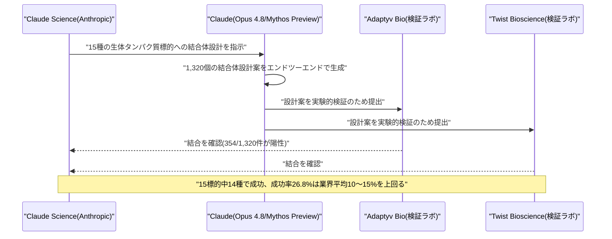

# LLM・AI Agent 最新情報レポート Vol.113
<!-- x-summary: Anthropic、Claudeが創薬向けタンパク質結合体設計で15標的中14種に成功、業界平均を上回る -->

**作成日**: 2026年8月20日（JST）
**対象期間**: 2026年8月19日〜8月20日（Vol.112との差分）

---

## 目次

1. [Google Cloudアップデート](#1-google-cloudアップデート)
2. [Microsoft Azure AIアップデート](#2-microsoft-azure-aiアップデート)
3. [LLM Model / AI Agentアーキテクチャ・研究](#3-llm-model--ai-agentアーキテクチャ研究)
   - [3.1 進化戦略による省メモリ・全パラメータ微調整手法「Agentic ESOpt」](#31-進化戦略による省メモリ全パラメータ微調整手法agentic-esopt)
4. [公式ブログ・論文のリサーチ・要約](#4-公式ブログ論文のリサーチ要約)
   - [4.1 OpenAI、ゼロデータ保持と両立する新監視機構「Private Safety Processing」を発表](#41-openaiゼロデータ保持と両立する新監視機構private-safety-processingを発表)
   - [4.2 OpenAI、ChatGPT Adsを欧州31カ国へ拡大](#42-openaichatgpt-adsを欧州31カ国へ拡大)
   - [4.3 Anthropic、Claudeによるタンパク質結合体設計・分析化学の加速を発表](#43-anthropicclaudeによるタンパク質結合体設計分析化学の加速を発表)
   - [4.4 Google、Search・Geminiに学生向けAI学習ツール群を追加](#44-googlesearchgeminiに学生向けai学習ツール群を追加)
5. [AI Agent搭載SaaS製品情報](#5-ai-agent搭載saas製品情報)
   - [5.1 リーガルAI「Harvey」、次世代プラットフォーム「Harvey II」を発表](#51-リーガルaiharvey次世代プラットフォームharvey-iiを発表)
6. [LLM/AI Agentセキュリティインシデント](#6-llmai-agentセキュリティインシデント)
7. [その他特筆すべき情報](#7-その他特筆すべき情報)
   - [7.1 OpenAI CFO、社内で「2027年に上場企業になる」と明言](#71-openai-cfo社内で2027年に上場企業になると明言)
   - [7.2 NVIDIA H200チップ、ByteDance・Tencentへの出荷が本格化](#72-nvidia-h200チップbytedancetencentへの出荷が本格化)
   - [7.3 Samsung、AI需要逼迫を背景に先端ファウンドリ価格を最大15%引き上げ](#73-samsungai需要逼迫を背景に先端ファウンドリ価格を最大15引き上げ)
   - [7.4 中国Unitree、上海IPOで株価急騰、DeepSeekも出資](#74-中国unitree上海ipoで株価急騰deepseekも出資)
   - [7.5 2026年の米テック業界レイオフ数、すでに2025年通年を上回る](#75-2026年の米テック業界レイオフ数すでに2025年通年を上回る)
   - [7.6 Cerebras、ラックスケールAI推論システム「CS-4」を発表](#76-cerebrasラックスケールai推論システムcs-4を発表)
8. [参考リンク](#8-参考リンク)

---

> **今号について:** 対象期間（8月19日〜20日）で最も注目すべきは、Anthropicが公開した、Claude（Opus 4.8および未公開のMythos Preview）によるタンパク質結合体（バインダー）設計の実験結果である。15種の生体タンパク質標的のうち14種で実験的に検証された結合タンパク質の設計に成功し、成功率は業界平均とされる10〜15%を大きく上回る26.8%に達したといい、創薬の初期プロセスをAIがほぼ人手を介さず代替できる可能性を示すものとして注目される。OpenAIも動きが活発で、複数セッションにまたがる不正利用パターンをゼロデータ保持と両立させながら検知する新機構「Private Safety Processing」のプレビュー発表、ChatGPT Adsの欧州31カ国への拡大発表に加え、CFOサラ・フライアー氏が社内オールハンズで「2027年には上場企業になる」と明言するなど、IPOを見据えた事業運営の輪郭が徐々に明らかになりつつある。Googleも、Search・GeminiにインタラクティブなAIシミュレーション機能を含む学生向け学習支援ツール群を追加し、若年層ユーザーの囲い込みを図る動きを見せた。AI Agent搭載SaaS製品では、リーガルAI大手Harveyが記憶機能を核とする次世代プラットフォーム「Harvey II」を発表している。一方、AIインフラ・資本市場の面でも大きな動きが相次いだ。NVIDIAのH200チップが実際にByteDance・Tencentへ出荷され始めたこと、AI需要の逼迫を受けてSamsungが先端ファウンドリ価格を最大15%引き上げたこと、そして中国のヒューマノイドロボット大手UnitreeがDeepSeekの出資を受けつつ上海証券取引所に上場し株価が公開価格から一時629%急騰したことなど、AI関連の設備投資・資本市場が過熱している様子がうかがえる。反面、米テック業界の2026年通年レイオフ数がすでに2025年通年を上回ったとの集計も報じられ、AI投資拡大と雇用縮小が同時進行している構図が浮き彫りになった。なお、Google Cloud・Microsoft Azureの確度の高い新規アップデート、および新規のセキュリティインシデントは、対象期間中には確認できなかった。

---

## 1. Google Cloudアップデート

新情報なし。対象期間中、Google Cloud Blog・Vertex AI release notes・Gemini Enterprise Agent Platform release notes等を確認したが、確度の高い新規アップデートは確認できなかった。

---

## 2. Microsoft Azure AIアップデート

新情報なし。対象期間中、Microsoft Foundry Blog・Azure Blog・techcommunity.microsoft.com等を確認したが、確度の高い新規アップデートは確認できなかった。

---

## 3. LLM Model / AI Agentアーキテクチャ・研究

### 3.1 進化戦略による省メモリ・全パラメータ微調整手法「Agentic ESOpt」

シンガポール国立大学等の研究者らは8月19日、ロングホライズン（長期系列）タスクを扱うLLMエージェントの全パラメータ微調整を進化戦略（Evolution Strategies, ES）ベースで行う新フレームワーク「Agentic ESOpt」をarXivで発表した。従来のRLベースの微調整（GRPO等）は逆伝播に依存する重いトレーニングスタックを要するため大規模LLMへの適用が難しく、また分岐が多くステップごとの報酬が疎になりがちなロングホライズンなエージェント推論ではクレジット割り当てが著しく困難という課題があった。Agentic ESOptは、現在のモデルパラメータ周辺に摂動をサンプリングし、生成されたエージェント群を環境からのスカラー報酬で評価してその報酬で重み付けしたオンライン更新を適用するというES的アプローチを採用。更新プロセスは完全に前向き推論のみで逆伝播が不要なため、活性化値やオプティマイザ状態を保持する必要がなく、推論時と同等レベルのGPUメモリのみで全パラメータの最適化が可能になる点が最大の技術的特徴で、ターン単位の報酬分解を必要とせず外部メモリ・ツール・スキルを統合したエージェントにも適用できるという。ベンチマーク評価では、数独タスクでGRPOベースラインに対し12.50ポイントの改善、Math/DocVQAタスクでベースモデルに対し平均13.7ポイントの改善、WebArena-Liteでのタスク成功率が29.47%から36.16%への向上、36種のテスト時設定中28設定でベースラインを上回るなど、勾配ベースのRLを上回る性能を報告している。本手法により、より大規模なLLMの微調整や、プロンプト空間の最適化技術との共進化が実用的になるとしている。[[1]](#ref-1) [[2]](#ref-2) [[3]](#ref-3)

---

## 4. 公式ブログ・論文のリサーチ・要約

### 4.1 OpenAI、ゼロデータ保持と両立する新監視機構「Private Safety Processing」を発表

OpenAIは8月19日、企業向けAPI顧客向けに提供している「ゼロデータ保持（Zero Data Retention, ZDR）」制度に関連し、新たな安全性機能「Private Safety Processing」をプレビュー発表した。ZDRは対象顧客のプロンプト・モデル応答を処理後に一切保持せず、OpenAI社員がその内容を閲覧できないことを保証する制度だが、従来は個別のやり取り単体でしかリスク検知ができず、複数の会話にまたがる悪用パターン（例えば、あるチャットでソフトウェアの脆弱性について質問し、別のチャットで遠隔操作について質問するなど）を検出できないという課題があった。Private Safety Processingは、基になる会話内容そのものにOpenAI社員がアクセスすることなく、関連する複数のやり取りにまたがるパターンを自動システムが検知できるようにする仕組みで、顧客データは顧客管理のインフラ上に置くか、顧客が管理する暗号鍵でOpenAI側に保管される。ZDRとの両立を保ったまま、不正利用者や「ミスアラインされたAIエージェント」によるハッキング行為の抑止を狙うもので、現在は一部の早期顧客向けにテスト段階にあり、9月に本格展開と技術白書の公開を予定している。なお、児童性的虐待素材（CSAM）の疑いがある画像については、法律上の要請により引き続き保持・報告される。この発表は、Anthropicが企業向けにデータログの保持を必須とする方針を取っていることと対比する形で報じられた。[[4]](#ref-4) [[5]](#ref-5) [[6]](#ref-6)

### 4.2 OpenAI、ChatGPT Adsを欧州31カ国へ拡大

OpenAIは8月19日、米国でのChatGPT広告テスト開始から約半年を経て、ドイツ・フランス・スペイン・イタリア・オランダ・スウェーデン・ノルウェー・デンマーク・オーストリアなど欧州31市場へChatGPT Adsを展開すると発表した。展開は8月24日開始予定で、同社にとって過去最大規模のChatGPT Ads拡大となる。広告はFreeプランおよびGoプランのユーザーにのみ表示され、Plus・Pro・Enterpriseなど有料サブスクリプションユーザーには表示されない。広告主は当初OpenAI Ads Solutionsチームや代理店・技術パートナー経由でのみアクセス可能で、セルフサービス型のAds Managerは今夏後半に提供予定。EU一般データ保護規則（GDPR）がパーソナライズ広告に明示的同意を要求するため、欧州展開は米国よりも準備に時間を要したとされ、同社は広告表示にあたり「同意」を軸とした設計を強調している。パブリッシャーコンテンツは引き続き無料で提供される方針も併せて報じられている。[[7]](#ref-7) [[8]](#ref-8) [[9]](#ref-9) [[10]](#ref-10)

### 4.3 Anthropic、Claudeによるタンパク質結合体設計・分析化学の加速を発表

Anthropicは米国時間8月18日、Claude（Opus 4.8および未公開のMythos Preview）が創薬の初期プロセスであるタンパク質結合体（バインダー）設計を、ほぼ人手を介さずエンドツーエンドで実行できることを示す実験結果を公開した。実験では15種の生体タンパク質標的のうち14種で、実験的に検証された結合タンパク質の設計に成功。合計1,320個の設計案のうち354個が、外部提携先であるAdaptyv BioとTwist Bioscienceの独立した2つの研究室でターゲットへの結合が確認され、成功率は約22〜35%（モデル・モードにより変動、全体では26.8%）と、業界平均とされる10〜15%を大きく上回った。従来、専門家が数週間〜数か月かけて行っていた作業をAIが代替できる可能性を示すものとして位置づけられている。同時に、Claude Opus 5による分析化学タスクの評価結果も発表された。核磁気共鳴（NMR）および液体クロマトグラフィー質量分析（LC-MS）の生データを与えたところ、Claudeはそれぞれ23分・19分で処理を完了し、純度推定値は96.4%（研究室側の評価は96.33%）とほぼ一致する精度を示したという。これらの成果は、Anthropicが6月30日に立ち上げた科学研究向けAIワークベンチ「Claude Science」を基盤としており、AIによる創薬・化学研究の実務への浸透を印象づける内容となっている。[[11]](#ref-11) [[12]](#ref-12) [[13]](#ref-13)

### 4.4 Google、Search・Geminiに学生向けAI学習ツール群を追加

Googleは8月19日、Google SearchおよびGeminiアプリに向けて学生向けの新しいAI学習支援機能群を発表した。Geminiでは、質問に応じてインタラクティブな3Dシミュレーションを生成できる新機能を追加し、「DNAの仕組みを見せて」と依頼すれば回転・ズーム可能な3D構造を生成したり、振り子のエネルギー伝達の様子を可視化したり、キャッシュバーンレートをインタラクティブな表形式で確認できるようにするなど、応答にテーブル・グリッド・シミュレーションを組み込めるようになった。Google Searchでも複雑なトピックを理解するためのカスタムツール・シミュレーションを生成できるようになり、例えば「pHスケール」を検索するとAI Overview内でインタラクティブな可視化が表示される。さらにGemini Liveでは、学生が音声で複数ステップにわたる調査レポートの作成を依頼し、バックグラウンドで処理が進行、完了後に通知を受けて会話形式で内容を議論できる機能も追加された。加えて、Geminiのサイドパネルに新設された「Student」ハブ（gemini.google.com/students）では、フラッシュカードや練習問題などのツール・特典が一覧できるようになる。この発表は、OpenAIのChatGPT for Teens展開（既報）や学習系AIスタートアップとの競争が激化するなか、Googleが学生層におけるAIアシスタントの主導権確保を狙う動きとして位置づけられている。[[14]](#ref-14) [[15]](#ref-15) [[16]](#ref-16)

---

## 5. AI Agent搭載SaaS製品情報

### 5.1 リーガルAI「Harvey」、次世代プラットフォーム「Harvey II」を発表

リーガルAIプラットフォーム大手のHarveyは8月18日（米国時間）、次世代プラットフォーム「Harvey II」を発表した。目玉機能は、弁護士個人の起草スタイル・トーン・構成・引用形式の好みを学習し、Harvey本体だけでなくMicrosoft Word・Outlookにも適用できる「Memory」機能で、都度背景情報や指示を伝え直す必要をなくすことを狙う。また、案件（マター）単位でドキュメント・タスク・権限・活動履歴を整理する「Spaces」機能や、より高度化されたAIエージェント群も統合されており、弁護士がAIと協働する際の文脈維持・権限管理を強化した構成となっている。法務分野のAI Agent活用が、単発のドラフト生成支援から、案件・個人の文脈を継続的に保持するエージェント基盤へと進化しつつある動きを象徴する事例といえる。[[17]](#ref-17) [[18]](#ref-18) [[19]](#ref-19)

---

## 6. LLM/AI Agentセキュリティインシデント

新情報なし。The Hacker News・BleepingComputer・Cloud Security Alliance等の専門メディア・セキュリティ企業のレポートを多角的に確認したが、対象期間（8月19日〜20日）に新規公表された、これまでの報告書で未取り上げのLLM/AI Agent関連セキュリティインシデント・脆弱性は確認できなかった。なお、インシデントそのものではないが、Google傘下のMandiantが8月19日、複数のAIエージェントを連鎖させてソースコード中の脆弱性を探索する内部ツール「Agentic Vulnerability Discovery Harness（AVDH）」の運用実績を公表しており、盗まれた企業リポジトリの調査でわずか2日間に100件以上の検証済み高深刻度脆弱性を発見したとしている。AIエージェントが「攻撃される側」だけでなく「脆弱性発見に使われる側」としても急速に実運用能力を高めている一端を示す動きとして付記する。[[20]](#ref-20)

---

## 7. その他特筆すべき情報

### 7.1 OpenAI CFO、社内で「2027年に上場企業になる」と明言

OpenAIのCFOサラ・フライアー氏は8月19日の全社集会（オールハンズ）で従業員に対し、OpenAIは「2027年には上場企業になる」と明言した。ただし「事業の成長ペースがさらに加速すれば、それより早まる可能性もある」とも述べたという。フライアー氏は「IPOはゴールではなく、あくまで一つのマイルストーン（次の資金調達に過ぎない）」と位置づけ、3月に1,220億ドルを調達したことで当面の資金的な余裕があると説明した。OpenAIは6月に非公開でSECにIPO目論見書を提出済みだが、上場時期は正式には未公表。社内ではCEOサム・アルトマン氏が2026年中の上場を望む一方、フライアー氏はより慎重な2027年案を支持してきたとされ、今回の発言はその路線が社内で共有されたことを示すものとされる。[[21]](#ref-21)

### 7.2 NVIDIA H200チップ、ByteDance・Tencentへの出荷が本格化

NVIDIAのH200チップの中国向け出荷が実際に開始されたことが8月19日に報じられた。ByteDanceとTencentがそれぞれ約1万個規模のH200チップを受け取ったとされる。米政府は各社に最大10万個までの購入を認めているが、現在は中国政府側が自国半導体産業育成のため、輸入チップを香港など中国本土外に留め置くよう求めている構図になっているという。H200はNVIDIAの現行最新世代（Blackwell系）より旧世代のチップで、中国顧客は依然として最先端チップは購入できない状態にある。米中の先端AIチップを巡る規制・政治力学の変化を示す動きとして注目されている。[[22]](#ref-22) [[23]](#ref-23)

### 7.3 Samsung、AI需要逼迫を背景に先端ファウンドリ価格を最大15%引き上げ

サムスン電子が、AI半導体需要の急拡大を受けて先端受託製造（ファウンドリ）サービスの新規受注価格を最大15%引き上げたことが8月19日に判明した。4nm（SF4）プロセスは中国・米国顧客向けが10〜15%、台湾顧客向けが5〜10%の値上げ、5nm（SF5）プロセスは10〜15%、8nmプロセスは約10%の値上げとなった。背景には、TSMCの先端製造キャパシティがAIチップ需要でほぼ埋まっており、米国の輸出規制強化で海外ファウンドリへの依存度を高めている中国企業を中心にサムスンへの発注が急増し、値上げを受け入れる顧客が多いことがある。2022年以来赤字が続いていたサムスンのファウンドリ事業にとって、収益改善への転換点となる可能性がある動きとして報じられている。[[24]](#ref-24) [[25]](#ref-25)

### 7.4 中国Unitree、上海IPOで株価急騰、DeepSeekも出資

バック転などで知られる中国のヒューマノイドロボットメーカーUnitreeが8月19日、上海証券取引所STARマーケット（科創板）に上場し、初値が公開価格（150.8元）から一時629%急騰し1,100元をつけた（終値ベースでも約460〜542%高、845元）。IPOでは61億元（約9億400万ドル）を調達し、公開株は8,000倍超の応募超過という同市場の記録的な人気となった。これにより時価総額は約660億ドルとなり、バイドゥやJD.comを上回る規模に達し、中国本土で初めて上場したヒューマノイドロボットメーカーとなった。注目点として、このIPOには中国AI企業DeepSeekも約1億4,080万元を出資していたことが判明しており、中国のAI・ロボティクス業界の資本連携を示す事例としても報じられている。なお、Unitreeは上場直前に新型ヒューマノイド「Superman」（跳躍高2m、走行速度12.66m/s）を発表している。[[26]](#ref-26) [[27]](#ref-27) [[28]](#ref-28)

### 7.5 2026年の米テック業界レイオフ数、すでに2025年通年を上回る

レイオフ追跡サービスLayoffs.fyiの集計によると、2026年に入ってからの米テック業界の人員削減数が8月18日時点で126,305人に達し、2025年通年の合計（約122,606〜127,000人規模）にすでに並ぶ、または上回ったことが8月19日にかけて報じられた。わずか7ヶ月余りでこの規模に達したことになり、直近ではSalesforce、LinkedIn、サイバーセキュリティ企業Rapid7などの人員削減が寄与しているとされる。この急増の背景として、各社がAIへの設備投資（capex）を拡大する一方で、生成AIツールによるコーディング業務や定型業務の自動化を進めていることが挙げられており、AI投資の拡大と雇用縮小が同時進行している状況を象徴するデータとして報じられた。[[29]](#ref-29) [[30]](#ref-30)

### 7.6 Cerebras、ラックスケールAI推論システム「CS-4」を発表

AIチップ企業Cerebrasは米国時間8月18日、新アーキテクチャ「Nexus」に基づくラックスケールAI推論システム「CS-4」を発表した。WSE-3 Turboウェハースケールエンジンを1ラックあたり3基搭載し、GPUベースのシステム比で最大30倍高速な推論性能、10兆パラメータ規模のモデルで毎秒1,000トークン超のスループットを実現するとしている。前世代CS-3比でもトークン処理速度は最大2倍、電力あたりスループットは最大10倍向上したという。Compute・Power・I/Oを独立してスケール可能なモジュール設計を採用し、ウェハー間レイテンシを最小2マイクロ秒まで削減する「Direct Wafer Links」を搭載。初出荷は本四半期中を予定しており、OpenAIやAMDとのパートナーシップも同時に語られている。[[31]](#ref-31) [[32]](#ref-32)

---

## 8. 参考リンク

**[1]** [Agentic ESOpt: Fine-Tuning Long-Horizon LLM Agents with Minimal GPU Requirements | Hugging Face Papers](https://huggingface.co/papers/2608.17310)

**[2]** [zz1358m/Agentic-ESOpt | GitHub](https://github.com/zz1358m/Agentic-ESOpt)

**[3]** [Agentic ESOpt: Fine-Tuning Long-Horizon LLM Agents with Minimal GPU Requirements | arXiv](https://arxiv.org/abs/2608.17310)

**[4]** [Offering zero data retention for frontier models | OpenAI](https://openai.com/index/offering-zero-data-retention-for-frontier-models/)

**[5]** [OpenAI previews zero retention safety system as Anthropic requires data logs | Axios](https://www.axios.com/2026/08/19/openai-previews-zero-retention-safety-system-as-anthropic-requires-data-logs)

**[6]** [OpenAI to Enhance Safety Processes for Paid Tool Customers | Bloomberg](https://www.bloomberg.com/news/articles/2026-08-19/openai-to-enhance-safety-processes-for-paid-tool-customers)

**[7]** [ChatGPT Ads expands across Europe | OpenAI](https://openai.com/index/chatgpt-ads-expands-across-europe/)

**[8]** [ChatGPT Ads coming to Netherlands next week as OpenAI expands across Europe | NL Times](https://nltimes.nl/2026/08/19/chatgpt-ads-coming-netherlands-next-week-openai-expands-across-europe)

**[9]** [OpenAI builds offerings on consent as it expands ChatGPT Ads to Europe | Digiday](https://digiday.com/marketing/openai-builds-offerings-on-consent-as-it-expands-chatgpt-ads-to-europe/)

**[10]** [OpenAI confirms ChatGPT Ads will launch in 31 European countries next week | Trending Topics](https://www.trendingtopics.eu/openai-confirms-chatgpt-ads-will-launch-in-31-european-countries-next-week/)

**[11]** [Claude accelerates protein design | Anthropic](https://www.anthropic.com/research/Claude-accelerates-protein-design)

**[12]** [Anthropic says Claude designed protein binders for 14 of 15 targets in lab test | Storyboard18](https://www.storyboard18.com/digital/anthropic-says-claude-designed-protein-binders-for-14-of-15-targets-in-lab-test-108129.htm)

**[13]** [Anthropic: Claude protein binder design | CryptoBriefing](https://cryptobriefing.com/anthropic-claude-protein-binder-design/)

**[14]** [Google launches new study tools for students across Search and Gemini | TechCrunch](https://techcrunch.com/2026/08/19/google-launches-new-study-tools-for-students-across-search-and-gemini/)

**[15]** [Gemini app AI Mode study tools | 9to5Google](https://9to5google.com/2026/08/19/gemini-app-ai-mode-study-tools/)

**[16]** [Google is giving students a free year of Gemini Pro plus new AI study features | Tom's Guide](https://www.tomsguide.com/ai/google-gemini/google-is-giving-students-a-free-year-of-gemini-pro-plus-new-ai-study-features)

**[17]** [Harvey Launches Next Generation of Its Platform, Harvey II | Law.com](https://www.law.com/legaltechnews/2026/08/18/harvey-launches-next-generation-of-its-platform-harvey-ii-/)

**[18]** [Next Gen 'Harvey II' Launches with Memory at Its Core | Artificial Lawyer](https://www.artificiallawyer.com/2026/08/18/next-gen-harvey-ii-launches-with-memory-at-its-core/)

**[19]** [Legaltech giant Harvey launches next-generation AI platform | The Global Legal Post](https://www.globallegalpost.com/news/legaltech-giant-harvey-launches-next-generation-ai-platform-1012947020)

**[20]** [Google Mandiant AVDH AI vulnerability discovery tool | Help Net Security](https://www.helpnetsecurity.com/2026/08/19/google-mandiant-avdh-ai-vulnerability-discovery-tool/)

**[21]** [OpenAI CFO says company plans to go public in 2027 | CNBC](https://www.cnbc.com/2026/08/19/open-ai-ipo-timing-2027-friar.html)

**[22]** [First Nvidia H200 shipments reach ByteDance and Tencent as Beijing loosens its import block | Tom's Hardware](https://www.tomshardware.com/pc-components/gpus/first-nvidia-h200-shipments-reach-bytedance-and-tencent-as-beijing-loosens-its-import-block)

**[23]** [Nvidia's H200 Chips Are Flowing Into China Again: ByteDance, Tencent Get Around 10,000 Each | Benzinga](https://www.benzinga.com/markets/tech/26/08/61293582/nvidias-h200-chips-are-flowing-into-china-again-bytedance-tencent-get-around-10000-each-report-says)

**[24]** [Samsung raises advanced chipmaking prices | Yahoo Finance](https://finance.yahoo.com/technology/ai/articles/samsung-raises-advanced-chipmaking-prices-101830976.html)

**[25]** [Samsung raises foundry chip prices up to 15% amid AI demand | China Tech News](https://www.chinatechnews.com/2026/08/19/127802-samsung-raises-foundry-chip-prices-up-to-15-amid-ai-demand)

**[26]** [China's backflipping robot maker Unitree jumps in Shanghai IPO | CNBC](https://www.cnbc.com/2026/08/19/china-backflipping-robot-maker-unitree-jumps-shanghai-ipo.html)

**[27]** [Robotics giant Unitree's shares surge in Shanghai debut | Semafor](https://www.semafor.com/article/08/19/2026/robotics-giant-unitrees-shares-surge-in-shanghai-debut)

**[28]** [Unitree China dancing robots IPO trading surge valuation | Fortune](https://fortune.com/2026/08/19/unitree-china-dancing-robots-ipo-trading-surge-valuation/)

**[29]** [Tech layoffs 2026: Tracking all of the job losses across Microsoft, Meta, Oracle, Samsung and others | Yahoo Tech](https://tech.yahoo.com/general/article/tech-layoffs-2026-tracking-all-of-the-job-losses-across-microsoft-meta-oracle-samsung-and-others-144545528.html)

**[30]** [2026 tech layoffs surpass 2025 | Futurism](https://futurism.com/future-society/2026-tech-layoffs-surpass-2025)

**[31]** [Introducing Cerebras CS-4 | Cerebras](https://www.cerebras.ai/blog/introducing-cerebras-cs-4)

**[32]** [Cerebras reimagines AI cluster design with switchless CS-4 architecture | Network World](https://www.networkworld.com/article/4211472/cerebras-reimagines-ai-cluster-design-with-switchless-cs-4-architecture.html)
