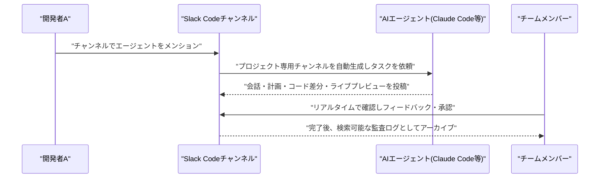

# LLM・AI Agent 最新情報レポート Vol.115
<!-- x-summary: Slackが複数のAIコーディングエージェントをチームで共同運用できる新機能「Slack Code」を発表 -->

**作成日**: 2026年8月22日（JST）
**対象期間**: 2026年8月21日〜8月22日（Vol.114との差分）

---

## 目次

1. [Google Cloudアップデート](#1-google-cloudアップデート)
   - [1.1 Google Antigravity、Gemini Enterprise加入者向けに標準搭載で提供拡大](#11-google-antigravitygemini-enterprise加入者向けに標準搭載で提供拡大)
2. [Microsoft Azure AIアップデート](#2-microsoft-azure-aiアップデート)
3. [LLM Model / AI Agentアーキテクチャ・研究](#3-llm-model--ai-agentアーキテクチャ研究)
4. [公式ブログ・論文のリサーチ・要約](#4-公式ブログ論文のリサーチ要約)
   - [4.1 Anthropic、Claude Codeにデータレジデンシー課金対応・SDK移行コマンドを追加(v2.1.238/v2.1.239)](#41-anthropicclaude-codeにデータレジデンシー課金対応sdk移行コマンドを追加v21238v21239)
   - [4.2 Google DeepMind、ゲームAI研究15年を振り返るブログ記事を公開](#42-google-deepmindゲームai研究15年を振り返るブログ記事を公開)
5. [AI Agent搭載SaaS製品情報](#5-ai-agent搭載saas製品情報)
   - [5.1 Slack、複数のAIコーディングエージェントをチームで共同運用できる新機能「Slack Code」を発表](#51-slack複数のaiコーディングエージェントをチームで共同運用できる新機能slack-codeを発表)
6. [LLM/AI Agentセキュリティインシデント](#6-llmai-agentセキュリティインシデント)
   - [6.1 OWASP、AIエージェントの「スキル」機構を対象とした「Agentic Skills Top 10 v1.0」を正式リリース](#61-owaspaiエージェントのスキル機構を対象としたagentic-skills-top-10-v10を正式リリース)
7. [その他特筆すべき情報](#7-その他特筆すべき情報)
   - [7.1 NVIDIA、AIスタートアップPoolsideに最大60億ドル規模のライセンス供与・出資契約](#71-nvidiaaiスタートアップpoolsideに最大60億ドル規模のライセンス供与出資契約)
   - [7.2 NVIDIA、韓国AI半導体新興Rebellionsと提携・出資・買収の可能性を協議](#72-nvidia韓国ai半導体新興rebellionsと提携出資買収の可能性を協議)
   - [7.3 Broadcom、AI半導体投資拡大に向け最大700億〜1,000億ドル規模の負債調達を協議](#73-broadcomai半導体投資拡大に向け最大700億1000億ドル規模の負債調達を協議)
   - [7.4 軌道上データセンターのStarcloud、NVIDIA参加のもと2.5億ドルを追加調達](#74-軌道上データセンターのstarcloudnvidia参加のもと25億ドルを追加調達)
8. [参考リンク](#8-参考リンク)

---

> **今号について:** 対象期間(8月21日〜22日)は、前号までのような大型モデルリリースや重大インシデントこそ無かったものの、AIエージェントを実際の業務フローに組み込む「実装・運用」レイヤーでの動きが目立った一日となった。中でも注目は、SlackがAnthropicのClaude Code・CognitionのDevin・GitHub Copilot・Vercelのエージェントなど複数のAIコーディングエージェントを専用チャンネルに統合し、チーム全員でレビュー・監督できるようにする新機能「Slack Code」を発表したことである。個人のターミナル作業だったAIコーディングを、チームのグループチャット上での共同作業へと転換させる狙いがあり、コーディングエージェントの「民主化」と「ガバナンス強化」を両立させる製品として注目される。同様の文脈で、Google CloudもAIコーディングエージェント「Antigravity」をGemini Enterprise加入者向けに標準搭載で拡大し、支出管理・監査ログなど企業向けガバナンス機能を強化した。セキュリティ面では、重大インシデントの報告こそ無かったが、OWASPがAIエージェントの「スキル」(再利用可能な命令セット)層に潜むリスクを体系化した「Agentic Skills Top 10 v1.0」を正式リリースし、業界全体でスキルのサプライチェーンリスクへの関心が高まっていることを示した。ビジネス面では、NVIDIAがAIコーディングモデル企業Poolsideに最大60億ドル規模のライセンス供与・出資を行ったほか、韓国のAI半導体新興Rebellionsとも提携・買収を協議していることが明らかになるなど、NVIDIAによる周辺エコシステムへの投資が加速している。またBroadcomはAnthropicなど大手AIラボ向けの計算基盤拡張のため最大700億〜1,000億ドル規模の負債調達を進めており、AIインフラ投資の資金調達スキームが一段と大型化・多様化している。なお、Microsoft Azure、LLM Model/AI Agentアーキテクチャの学術研究については、対象期間中に確認できる新規発表はなかった。

---

## 1. Google Cloudアップデート

### 1.1 Google Antigravity、Gemini Enterprise加入者向けに標準搭載で提供拡大

Googleは2026年8月21日、公式ブログでAIコーディングエージェント「Google Antigravity」をGemini Enterpriseの対象プラン(Standard、Plus、Standard Emerging Market)に追加ライセンスや別課金なしで標準搭載すると発表した。開発者向けにはVisual Studio Code拡張機能が正式版(GA)となったほか、Visual Studio・JetBrains・Zed向け拡張機能もプレビューとして新たに提供され、Antigravity 2.0デスクトップアプリ・CLIも引き続き利用できる。企業の管理者向けには、プロジェクト単位の月次予算上限設定やチーム間でのトークンクォータのプール化、超過利用時の月次上限付き従量課金といった支出管理機能に加え、ワークスペースのサンドボックス化やブラウザ・MCPサーバーへのアクセス制御、プロンプト・応答・メタデータを記録する監査ログなどのセキュリティ・ガバナンス機能が追加された。Workforce Identity Federation(WIF)やApplication Default Credentials(ADC)によるネイティブ認証統合にも対応し、Accenture、AirAsia、CGI、Cognizant、Datamatics、Deloitte、Wiproなどが採用事例として紹介されている。[[1]](#ref-1) [[2]](#ref-2)

---

## 2. Microsoft Azure AIアップデート

新情報なし

対象期間(8月21日〜22日)において、Microsoft Foundry(旧Azure AI Foundry)を含むAzure AI関連の新規発表は確認できなかった。直近の主要アップデートは8月19日付「GPT-chat-latestのGPT-5.6 Sol基盤への更新」であり、Vol.114で既報のため本号では対象外とした。

---

## 3. LLM Model / AI Agentアーキテクチャ・研究

新情報なし

対象期間(8月21日〜22日)において、arXiv等で公開されたLLMモデル・AI Agentアーキテクチャに関する新規の論文・技術報告で、Vol.114までに未掲載のものは確認できなかった。

---

## 4. 公式ブログ・論文のリサーチ・要約

### 4.1 Anthropic、Claude Codeにデータレジデンシー課金対応・SDK移行コマンドを追加(v2.1.238/v2.1.239)

Anthropicは2026年8月20日から21日にかけて、ターミナル向けコーディングエージェント「Claude Code」のv2.1.238およびv2.1.239を相次いでリリースした。v2.1.239(8月21日)では、データレジデンシー・ワークスペース向けにUS専用推論の1.1倍課金を`/cost`表示やステータスラインに反映するようになったほか、`anthropic` SDKの0.x系から1.x系への移行を支援する`/claude-api upgrade`コマンドが追加された。またclaude.aiから同期されたプラグインが`name@synced`として表示・個別管理できるようになり、Alpine/musl環境でのネイティブ画像ペースト・クリップボード・音声キャプチャアドオンの不具合も修正された。前日のv2.1.238(8月20日)では、`keybindingFlavor`設定の"readline"モードでBash同様のCtrl+W挙動に対応したほか、プラグインマーケットプレイス向けに短期トークンなどのHTTPヘッダーを生成する`headersHelper`コマンド、セルフホスト型ランナー向けの遅延シャットダウンフラグ`--defer-shutdown-max-min`が追加されている。[[3]](#ref-3)

### 4.2 Google DeepMind、ゲームAI研究15年を振り返るブログ記事を公開

Google DeepMindは2026年8月21日前後、公式ブログに「Exploring new frontiers of AI and games research」と題した記事を公開した。2015年のAtari(DQN、49種のゲームをピクセルから直接学習)から、AlphaGo、AlphaStarを経て、2026年に発表したEVE Online開発元Fenris Creationsとの新たな研究提携に至るまでの、ゲームを活用したAI研究15年間の系譜を振り返る内容となっている。記事では各世代が「より制御された環境」から「より制御されていない環境」へと段階的に制約を緩和してきた経緯を説明し、数千人のプレイヤーが単一の宇宙を共有し20年以上にわたり継続的に発展してきたEVE Onlineの複雑なプレイヤー主導型経済を、エージェントの長期記憶・継続学習・長期計画能力を検証する新たな研究基盤として位置づけている。[[4]](#ref-4)

---

## 5. AI Agent搭載SaaS製品情報

### 5.1 Slack、複数のAIコーディングエージェントをチームで共同運用できる新機能「Slack Code」を発表

Salesforce傘下のSlackは2026年8月21日、AnthropicのClaude Code、CognitionのDevin、GitHub Copilot、Vercelのエージェントなど複数のAIコーディングエージェントを専用のSlackチャンネルに組み込む新機能「Slack Code」を発表した。チャンネル内でエージェントをメンションするとプロジェクト専用チャンネルが自動生成され、チームメンバー全員が会話・計画・コード差分・ライブHTMLプレビューの各タブを通じて作業内容をリアルタイムで確認し、フィードバックやデプロイ前の承認を行える。作業終了後は検索可能な監査ログとしてチャンネルがアーカイブされる仕組みも備える。全てのSlackプランで追加課金なしに利用できるが、各パートナーエージェントへのアクセス権自体は利用者側で別途用意する必要がある。従来は個人のターミナル上で完結しがちだったAIコーディングを、チームによる共同レビュー・監督のプロセスへと転換させる狙いがある。[[5]](#ref-5) [[6]](#ref-6) [[7]](#ref-7)

---

## 6. LLM/AI Agentセキュリティインシデント

### 6.1 OWASP、AIエージェントの「スキル」機構を対象とした「Agentic Skills Top 10 v1.0」を正式リリース

OWASPは2026年8月17日、Black Hat USA・DEF CON 2026を経て、AIエージェントが自律的に発見・読み込み・実行する「スキル」(SKILL.mdによるメタデータとスクリプト・リソース一式で構成される再利用可能な命令セット)に潜むセキュリティリスクを体系化した「Agentic Skills Top 10(AST10)v1.0」を正式リリースした。これをセキュリティメディアDark Readingが8月21日付の解説記事で取り上げ、OpenClaw・Claude Code・Cursor/Codex・VS Codeなど主要なエージェント基盤を横断する形で、悪意あるスキル・サプライチェーン侵害・過剰権限スキル・メタデータ改ざん・信頼できない外部命令・隔離の弱さ・更新の乖離・スキャン不足・ガバナンス欠如・クロスプラットフォーム再利用という10大リスクを整理して紹介している。背景には、2026年1月に12の公開者アカウントから1,184件の悪意あるスキルが配布された「ClawHavoc」キャンペーンや、USENIX Security 2026における公開マーケットプレイス上の9万8,380件のスキルを対象とした測定調査で157件の悪意あるスキル(632件の脆弱性を内包)が確認された事例があり、クロスプラットフォームでの一貫した検証を可能にする「Universal Skill Format」(YAML標準案)も併せて提示されている。[[8]](#ref-8) [[9]](#ref-9)

---

## 7. その他特筆すべき情報

### 7.1 NVIDIA、AIスタートアップPoolsideに最大60億ドル規模のライセンス供与・出資契約

NVIDIAは2026年8月20日から21日にかけて、AIモデル開発ソフトウェア企業Poolsideに対し、同社のモデル開発基盤「Model Factory」を60億ドルでライセンス取得すると同時に、評価額120億ドル(プレマネー)で10億ドルを出資する契約を締結したと報じられた。Model FactoryはPoolsideのオープンウェイトなコーディングモデル群「Laguna」(Laguna XS.2、M.1等)の開発に用いられてきた基盤であり、NVIDIAはあわせてLaguna開発に携わった従業員109人に採用オファーを提示している。関係者によれば、本契約は買収でもアクハイア(人材獲得目的の買収)でもなく、Poolsideの共同創業者3人は引き続き経営に残るほか、非独占契約のためPoolsideは他社への技術提供も継続できるとされる。60億ドルのライセンス料は2027年末までにPoolsideの投資家に分配される見込みとされている。[[10]](#ref-10) [[11]](#ref-11)

### 7.2 NVIDIA、韓国AI半導体新興Rebellionsと提携・出資・買収の可能性を協議

Bloombergは2026年8月21日、NVIDIAのジェンスン・フアンCEOが米カリフォルニア州サンタクララの本社で、韓国のデータセンター向け推論用AIチップ設計スタートアップRebellionsの共同創業者兼CEOであるパク・ソンヒョン氏と会談し、技術提携・出資・買収まで幅広い選択肢を協議していると報じた。RebellionsはSKハイニックス、サムスンベンチャーズ、Armホールディングス、および韓国政府から累計約8.5億ドルを調達しており、直近の評価額は約23億ドル。協議は初期段階であり、合意に至るかは不透明だが、韓国では先端半導体を国家的資産とみなす傾向が強く、国内チップ設計企業が関わる買収的な取引には当局が慎重に目を光らせるとみられている。[[12]](#ref-12)

### 7.3 Broadcom、AI半導体投資拡大に向け最大700億〜1,000億ドル規模の負債調達を協議

CNBCおよび複数メディアは2026年8月20日から21日にかけて、Broadcomが裏付けとなる特別目的会社(SPV)を通じ、AIインフラ拡張の資金として最大700億〜800億ドル(報道によっては上限1,000億ドル)規模の負債調達を市場で進めていると報じた。融資側は優先トランシェ約450億ドル、劣後トランシェ約350億ドルを軸に検討しているとされ、BlackstoneとApollo Global Managementが調達に参加する見通し。この資金は、BroadcomとApollo、Blackstoneが2026年6月に発表したAnthropic向け計算基盤拡張パートナーシップ(Broadcomのカスタムチップ・ネットワーキング技術を通じて2028年までに主要AIラボへ20ギガワット超の計算能力を供給する計画のうち、まず350億ドルを投じて1ギガワット分を追加する第一弾)をさらに拡張するものと位置づけられている。[[13]](#ref-13) [[14]](#ref-14)

### 7.4 軌道上データセンターのStarcloud、NVIDIA参加のもと2.5億ドルを追加調達

宇宙空間でAI推論を行う衛星データセンターを開発するStarcloudは2026年8月21日、Manhattan West主導によるシリーズAエクステンションで2.5億ドルを調達し、評価額23億ドル(累計調達額4.5億ドル)に達したと発表した。既存投資家のBenchmark、EQT、Soma、NFX、776に加え、NVIDIAが2,500万ドルを出資したほか、Cisco Investments、Cedar Capital、Goanna Capital、Standard Capitalなどが新規に参加した。Starcloudは今回の資金で、NVIDIAのH100比25倍の宇宙内演算能力を持つとされる次世代モジュール「Space-1 Vera Rubin Module」を搭載した衛星群の開発を進める計画で、2025年11月にはH100 GPUを軌道上に打ち上げて小型言語モデル「NanoGPT」を訓練することに成功している。最終的には衛星群による軌道上20ギガワット規模の計算能力構築を目指すとしている。[[15]](#ref-15)

---

## 8. 参考リンク

**[1]** [Expanding Google Antigravity for enterprise customers | Google Cloud Blog](https://cloud.google.com/blog/products/ai-machine-learning/expanding-google-antigravity-for-enterprise-customers)

**[2]** [Google tethers Antigravity to enterprise controls amid AI shakeup | The Register](https://www.theregister.com/ai-and-ml/2026/08/21/google-tethers-antigravity-to-enterprise-controls-amid-ai-shakeup/)

**[3]** [Claude Code Changelog | Anthropic](https://code.claude.com/docs/en/changelog)

**[4]** [From Atari to EVE Online: Building on 15 Years of AI Research in Games | Google DeepMind](https://deepmind.google/blog/from-atari-to-eve-online-building-on-15-years-of-ai-research-in-games/)

**[5]** [Introducing Slack Code: Agentic Coding for Teams | Salesforce](https://www.salesforce.com/introducing-slack-code/)

**[6]** [Slack wants to drag AI coding out of the terminal and into the group chat | VentureBeat](https://venturebeat.com/orchestration/slack-wants-to-drag-ai-coding-out-of-the-terminal-and-into-the-group-chat)

**[7]** [Slack Launches Code For AI Coding Collaboration | Dataconomy](https://dataconomy.com/2026/08/21/slack-launches-code-for-ai-coding-collaboration/)

**[8]** [OWASP Agentic AI Top 10: A Practitioner's Guide | Dark Reading](https://www.darkreading.com/cyber-risk/owasp-agentic-ai-top-10-a-practitioner-s-guide)

**[9]** [OWASP Agentic Skills Top 10 | OWASP Foundation](https://owasp.org/www-project-agentic-skills-top-10/)

**[10]** [Nvidia to Pay AI Startup Poolside a $6 Billion License, Newcomer Says | Bloomberg](https://www.bloomberg.com/news/articles/2026-08-20/nvidia-to-pay-ai-startup-poolside-a-6-billion-license-newcomer-says)

**[11]** [Sources: Poolside Strikes $6 Billion Licensing Deal with Nvidia & Raises $1 Billion for Remaining Company at $12 Billion Valuation | Newcomer](https://www.newcomer.co/p/sources-poolside-strikes-6-billion)

**[12]** [Nvidia in Talks With Chip Startup Rebellions for Potential Deal | Bloomberg](https://www.bloomberg.com/news/articles/2026-08-21/nvidia-in-talks-with-chip-startup-rebellions-for-potential-deal)

**[13]** [Broadcom debt deal expected to reach upwards of $70 billion, sources say | CNBC](https://www.cnbc.com/2026/08/21/broadcom-debt-deal-expected-to-reach-upwards-of-70-billion-sources.html)

**[14]** [Broadcom seeks up to $80 billion in debt for AI chip deal | Qz](https://qz.com/broadcom-debt-financing-ai-chips-anthropic-082126)

**[15]** [Starcloud raises $250 million for orbital data centers as launch options dry up | TechCrunch](https://techcrunch.com/2026/08/21/starcloud-raises-200-million-for-orbital-data-centers-as-launch-options-dry-up/)
