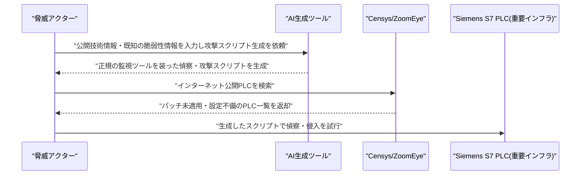

# LLM・AI Agent 最新情報レポート Vol.116
<!-- x-summary: Anthropicが年換算収益650億ドル超を背景に8月末にもIPO申請へ、規模はSpaceX超えとの観測も -->

**作成日**: 2026年8月23日(JST)
**対象期間**: 2026年8月22日〜8月23日(Vol.115との差分)

---

## 目次

1. [Google Cloudアップデート](#1-google-cloudアップデート)
   - [1.1 xAI「Grok 4.6」、Google Cloud Vertex AI(Model Garden)でプレビュー提供開始](#11-xaigrok-46google-cloud-vertex-aimodel-gardenでプレビュー提供開始)
2. [Microsoft Azure AIアップデート](#2-microsoft-azure-aiアップデート)
3. [LLM Model / AI Agentアーキテクチャ・研究](#3-llm-model--ai-agentアーキテクチャ研究)
4. [公式ブログ・論文のリサーチ・要約](#4-公式ブログ論文のリサーチ要約)
   - [4.1 OpenAI、カリフォルニア州AI安全法案「SB 53」の規制強化を要請](#41-openaiカリフォルニア州ai安全法案sb-53の規制強化を要請)
5. [AI Agent搭載SaaS製品情報](#5-ai-agent搭載saas製品情報)
   - [5.1 Firecrawl、コーディングエージェント向け検索インデックス「Developer Index」を発表](#51-firecrawlコーディングエージェント向け検索インデックスdeveloper-indexを発表)
6. [LLM/AI Agentセキュリティインシデント](#6-llmai-agentセキュリティインシデント)
   - [6.1 CISA等、AI生成攻撃スクリプトによるSiemens製PLC標的化について合同勧告](#61-cisa等ai生成攻撃スクリプトによるsiemens製plc標的化について合同勧告)
7. [その他特筆すべき情報](#7-その他特筆すべき情報)
   - [7.1 Anthropic、史上最大級規模になり得るIPO申請を8月末にも実施へ](#71-anthropic史上最大級規模になり得るipo申請を8月末にも実施へ)
   - [7.2 NVIDIA、データセンター開発企業Cloverleaf Infrastructureに出資・戦略提携](#72-nvidiaデータセンター開発企業cloverleaf-infrastructureに出資戦略提携)
   - [7.3 ブラジル政府、AIスーパーコンピュータ整備に約4.4億ドルを投資、米中双方の技術を採用](#73-ブラジル政府aiスーパーコンピュータ整備に約44億ドルを投資米中双方の技術を採用)
8. [参考リンク](#8-参考リンク)

---

> **今号について:** 対象期間(8月22日〜23日)で最も注目すべきは、AnthropicがSpaceXの記録的な新規株式公開に匹敵する、あるいはそれを上回る規模になり得るIPO申請を早ければ8月末にも行う準備を進めていると報じられたことである。年換算収益が7月末時点で約650億ドルに達するなど急拡大を続ける同社だが、申請書類には「AIへの反発」自体が経営リスク要因として記載される見通しであることも明らかになり、事業成長とレピュテーションリスクが同居する局面にあることをうかがわせる。製品・プラットフォーム面では、xAIの最新フラッグシップモデル「Grok 4.6」がGoogle CloudのVertex AI Model Garden上でプレビュー提供され、50万トークンのコンテキストウィンドウと4段階の推論強度設定を備えたエージェント向けモデルとして、Vertex AI経由でのアクセスが可能になった。政策面では、OpenAIがこれまで慎重姿勢だったカリフォルニア州のAI安全法案「SB 53」について、フロンティアモデルの訓練・評価中の重大インシデント監視義務化など、逆に規制強化を要請する声明を発表し、連邦レベルの包括的AI立法が進まない中で州規制を将来の全国基準の土台と位置づける姿勢への転換を示した。セキュリティ面では、CISA・NSA・FBI等の米当局が、AIを用いて生成した攻撃・偵察スクリプトによりSiemens製PLC(産業用制御機器)を狙う攻撃キャンペーンについて合同勧告を発出し、「理論上のリスクではなく現在進行形の脅威」であると強い表現で警告した。インフラ投資面では、NVIDIAがデータセンター開発企業Cloverleaf Infrastructureに出資・戦略提携したほか、ブラジル政府がHuawei・iFlytek(中国)とNVIDIA(米国)の双方の技術を組み合わせる形でAIスーパーコンピュータ整備に約4.4億ドルを投じるなど、米中いずれか一方に依存しない多極的なAIインフラ布陣を敷く動きも見られた。なお、Microsoft Azure、LLM Model/AI Agentアーキテクチャの学術研究については、対象期間中に確認できる新規発表はなかった。

---

## 1. Google Cloudアップデート

### 1.1 xAI「Grok 4.6」、Google Cloud Vertex AI(Model Garden)でプレビュー提供開始

xAIのコーディング・エージェント向け最新フラッグシップモデル「Grok 4.6」が、Google CloudのVertex AI Model Garden上でプレビュー提供された。50万トークンのコンテキストウィンドウを持ち、長時間稼働するエージェントタスクやインタラクティブなビジュアル作業向けに設計されている。推論の強度をlow/medium/high/extra highの4段階で設定可能で、テキストと画像入力、関数呼び出し(function calling)、構造化出力に対応する。価格は100万トークンあたり2ドルから。既存のコンプライアンス・課金基盤を使ってVertex AI経由でxAIモデルへアクセスできるようにする狙いがあり、8月20日にVertex AI上でxAIのGrok 4.1系モデル(fast-reasoning/non-reasoning)が提供終了となったのと入れ替わる形での新モデル追加となる。[[1]](#ref-1) [[2]](#ref-2)

---

## 2. Microsoft Azure AIアップデート

新情報なし

対象期間(8月22日〜23日)において、Microsoft Foundry(旧Azure AI Foundry)を含むAzure AI関連の確度の高い新規発表は確認できなかった。直近の主要アップデートはオープンモデルカタログへのDeepSeek-V4-Flash-0731・NVIDIA Nemotron系モデル追加(8月19日)であり、対象期間より前のため本号では対象外とした。

---

## 3. LLM Model / AI Agentアーキテクチャ・研究

新情報なし

対象期間(8月22日〜23日)において、arXiv等で公開されたLLMモデル・AI Agentアーキテクチャに関する新規の論文・技術報告で、対象期間内に投稿日を確認できるものは見つからなかった。

---

## 4. 公式ブログ・論文のリサーチ・要約

### 4.1 OpenAI、カリフォルニア州AI安全法案「SB 53」の規制強化を要請

OpenAIのGlobal Affairsチームは2026年8月22日、カリフォルニア州のAI安全法案「SB 53」について、これまでの慎重・反対的な姿勢から一転し、規制強化を求める声明を発表した。具体的には、訓練中・評価中のフロンティアモデルについて重大インシデントの監視を義務付けることや、モデル開発ライフサイクル全体にわたるサイバーセキュリティ保護の強化などを修正提案として示している。連邦レベルでの包括的なAI立法が実現しない現状を踏まえ、州レベルの規制が将来的な全国基準の土台になり得るという、いわば「逆連邦主義」的アプローチを支持する立場への転換を示した点が注目される。[[3]](#ref-3) [[4]](#ref-4)

---

## 5. AI Agent搭載SaaS製品情報

### 5.1 Firecrawl、コーディングエージェント向け検索インデックス「Developer Index」を発表

ウェブスクレイピング・検索APIを手がけるFirecrawlは2026年8月22日、コーディングエージェント向けに特化した検索インデックス「Developer Index」を発表した。GitHubリポジトリ・ドキュメント・Issueなど7,000万件超の一次情報源を横断検索でき、コード動作の質問、ライブラリ・フレームワークの仕様、APIの契約、エラーメッセージ、既知の不具合などについて、一般的なウェブページ経由ではなく一次情報から直接回答を導けるよう設計されている。1,179件の実際の開発者クエリを用いた評価では、上位10件内再現率(recall@10)が63%に達し、他の外部プロバイダーを約10ポイント上回ったとしている。Firecrawl CLIまたはMCP経由での利用が推奨されており、APIキー不要で試用を開始できる。[[5]](#ref-5) [[6]](#ref-6)

---

## 6. LLM/AI Agentセキュリティインシデント

### 6.1 CISA等、AI生成攻撃スクリプトによるSiemens製PLC標的化について合同勧告

米CISA・NSA・FBI・エネルギー省(DOE)・環境保護庁(EPA)は2026年8月20日、水道・エネルギー・製造業などの重要インフラで使用されるSiemens S7シリーズPLC(産業用制御機器)を狙う攻撃キャンペーンについて合同セキュリティ勧告(AA26-231A)を発出した。脅威アクターがAIを用いて、公開されている技術情報・既知の脆弱性・オープンソースの産業オートメーションライブラリを基に、正規の監視ツールを装った攻撃・偵察スクリプトを迅速に生成・改良していると警告している。攻撃者はCensysやZoomEyeなどのインターネットスキャンサービスを使い、パッチ未適用やセキュリティ設定が甘いインターネット公開PLCを特定しているという。当局は「これは理論上のリスクではなく、現在進行形の脅威である」と強い表現で警告しており、対象セクターは重要製造業、エネルギー、上下水道、化学、食品・農業、商業施設など多岐にわたる。[[7]](#ref-7) [[8]](#ref-8) [[9]](#ref-9)

---

## 7. その他特筆すべき情報

### 7.1 Anthropic、史上最大級規模になり得るIPO申請を8月末にも実施へ

Anthropicが早ければ2026年8月末にもIPO申請を行う準備を進めていると、2026年8月21日に複数メディアが報じた。関係者によれば、IPOの規模はSpaceXが樹立した過去最大の新規株式公開記録に匹敵する、あるいはそれを上回る可能性があるという。同社の年換算収益は7月末時点で約650億ドルに達し、2025年末から急拡大を続けている。CNBCの報道では、IPO申請書類に「AIへの反発」が経営リスク要因として記載される見通しであることも明らかになった。同社は2026年6月にSECへS-1の非公開下書きを既に提出済みとされる。[[10]](#ref-10) [[11]](#ref-11)

### 7.2 NVIDIA、データセンター開発企業Cloverleaf Infrastructureに出資・戦略提携

NVIDIAは2026年8月21日、データセンター用地・電力インフラを開発するCloverleaf Infrastructureとの戦略的パートナーシップおよび少数株出資を発表した。出資額は非公表だが、数億ドル規模になり得ると報じられている。Cloverleafは2024年設立で、NGP・Sandbrook Capitalから3億ドルの出資を受けており、Oracleやウィスコンシン州のOpenAI向け拠点を含め、これまでに7ギガワット超のプロジェクトを開発・売却済み、パイプラインは10ギガワット超に達する。今回の提携により、Cloverleafは用地選定・電力・冷却・計算インフラの統合最適化を図るNVIDIAのプラットフォーム「DSX」を導入し、顧客が設計の早い段階から用地・電力・冷却・計算・設備の意思決定を一体的に行えるようにする。[[12]](#ref-12) [[13]](#ref-13) [[14]](#ref-14)

### 7.3 ブラジル政府、AIスーパーコンピュータ整備に約4.4億ドルを投資、米中双方の技術を採用

ブラジル政府は2026年8月21日、AIエコシステム強化のため約23億レアル(約4.44億ドル)を投じると発表した。うち13億レアル(約2.51億ドル)はリオデジャネイロ州のスーパーコンピュータ整備に充てられ、中国のHuaweiが計算インフラを、iFlytekがポルトガル語大規模言語モデルの開発を担当する。残る10億レアル(約1.93億ドル)はリオグランデ・ド・ノルテ州向けの入札に投じられ、世界トップ10入りを目指すAIスーパーコンピュータの調達先としてNVIDIAが有力視されている。米中いずれか一方に依存しない「バランス外交」的な布陣が特徴で、AIインフラの調達においても地政学的な多極化が進んでいることを示す事例として報じられた。[[15]](#ref-15) [[16]](#ref-16)

---

## 8. 参考リンク

**[1]** [Grok 4.6 on Vertex AI | xAI](https://x.ai/news/grok-4-6-vertex-ai)

**[2]** [Grok models on Vertex AI | Google Cloud Docs](https://docs.cloud.google.com/gemini-enterprise-agent-platform/models/partner-models/grok)

**[3]** [OpenAI says California should strengthen its AI safety bill | TechCrunch](https://techcrunch.com/2026/08/22/openai-says-california-should-strengthen-its-ai-safety-bill/)

**[4]** [OpenAI calls for California to strengthen AI safety laws | Engadget](https://www.engadget.com/2242200/openai-calls-for-california-to-strengthen-ai-safety-laws/)

**[5]** [Developer Index: Code & Docs Search API for Coding Agents | Firecrawl](https://www.firecrawl.dev/developer-index)

**[6]** [Developer Index | Firecrawl Docs](https://docs.firecrawl.dev/features/developer)

**[7]** [AA26-231A: AI-Generated Exploit Scripts Targeting Siemens S7 PLCs | CISA](https://www.cisa.gov/news-events/cybersecurity-advisories/aa26-231a)

**[8]** [AI-Generated Exploit Scripts Target Critical Infrastructure PLCs | The Hacker News](https://thehackernews.com/2026/08/ai-generated-exploit-scripts-target.html)

**[9]** [US agencies warn of AI-based attacks on Siemens S7 PLCs | Help Net Security](https://www.helpnetsecurity.com/2026/08/20/usa-ai-attacks-siemens-s7-plcs-critical-infrastructure/)

**[10]** [Anthropic preparing IPO filing as soon as the end of August, sources say | CryptoBriefing](https://cryptobriefing.com/anthropic-preparing-ipo-filing-as-soon-as-the-end-of-august-sources-say/)

**[11]** [Anthropic IPO filing will show 'AI backlash' as risk, sources say | CNBC](https://www.cnbc.com/2026/08/21/-anthropic-ipo-filing-will-show-ai-backlash-as-risk-sources-say.html)

**[12]** [Cloverleaf Infrastructure Forms Strategic Partnership with NVIDIA to Accelerate Data Center Infrastructure Development | PR Newswire](https://www.prnewswire.com/news-releases/cloverleaf-infrastructure-forms-strategic-partnership-with-nvidia-to-accelerate-data-center-infrastructure-development-302857329.html)

**[13]** [Cloverleaf deal is latest example of Nvidia using its war chest to patch cracks in the AI bubble | The Register](https://www.theregister.com/systems/2026/08/22/cloverleaf-deal-is-latest-example-of-nvidia-using-its-war-chest-to-patch-cracks-in-the-ai-bubble/5291369)

**[14]** [Nvidia backs data center powered land company Cloverleaf | Data Center Dynamics](https://www.datacenterdynamics.com/en/news/nvidia-backs-data-center-powered-land-company-cloverleaf/)

**[15]** [Brazil launches AI supercomputer push while balancing US and Chinese tech | Al Jazeera](https://www.aljazeera.com/economy/2026/8/21/brazil-launches-ai-supercomputer-push-while-balancing-us-and-chinese-tech)

**[16]** [Brazil AI investment: Huawei, Nvidia supercomputer, Lula | China Global South](https://chinaglobalsouth.com/2026/08/21/brazil-ai-investment-huawei-nvidia-supercomputer-lula/)
