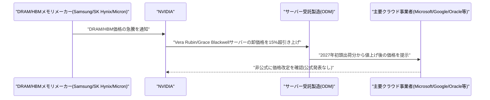

# LLM・AI Agent 最新情報レポート Vol.117
<!-- x-summary: NVIDIA、DRAM/HBM価格高騰を受けAIサーバーを15%超値上げへ、Microsoft等主要顧客に通知 -->

**作成日**: 2026年8月24日(JST)
**対象期間**: 2026年8月23日〜8月24日(Vol.116との差分)

---

## 目次

1. [Google Cloudアップデート](#1-google-cloudアップデート)
2. [Microsoft Azure AIアップデート](#2-microsoft-azure-aiアップデート)
3. [LLM Model / AI Agentアーキテクチャ・研究](#3-llm-model--ai-agentアーキテクチャ研究)
4. [公式ブログ・論文のリサーチ・要約](#4-公式ブログ論文のリサーチ要約)
5. [AI Agent搭載SaaS製品情報](#5-ai-agent搭載saas製品情報)
6. [LLM/AI Agentセキュリティインシデント](#6-llmai-agentセキュリティインシデント)
7. [その他特筆すべき情報](#7-その他特筆すべき情報)
   - [7.1 NVIDIA、DRAM/HBM価格高騰を受けAIサーバー価格を15%超値上げへ](#71-nvidiadramhbm価格高騰を受けaiサーバー価格を15超値上げへ)
   - [7.2 Anthropic、Google TPU創設者Amir Salek氏を招聘し自社製半導体開発に本格着手](#72-anthropicgoogle-tpu創設者amir-salek氏を招聘し自社製半導体開発に本格着手)
   - [7.3 Alibaba出資の中国ロボット企業Dexmal、評価額30億ドルで新規資金調達を模索](#73-alibaba出資の中国ロボット企業dexmal評価額30億ドルで新規資金調達を模索)
8. [参考リンク](#8-参考リンク)

---

> **今号について:** 対象期間(8月23日〜24日)は、前号までのような大型モデルリリースや重大セキュリティインシデントの報告こそ無かったが、AI産業を支える「インフラの土台」に関わる2つの動きが目立った一日となった。一つは、NVIDIAがDRAM/HBM(広帯域メモリ)の価格急騰を受け、Vera Rubin・Grace Blackwellを搭載する主力AIサーバー構成について2027年初頭出荷分から15%を超える価格引き上げをMicrosoft・Google・Oracleなど大手クラウド事業者向けに非公式に通知したと報じられたことである。AIブームを支えるメモリ需給の逼迫が、いよいよ川下のクラウド事業者のコスト構造に直接跳ね返り始めている実態を示す事例といえる。もう一つは、AnthropicがGoogleのTPU(Tensor Processing Unit)プログラムの創設者であるAmir Salek氏を招聘し、自社製半導体の開発基盤づくりを本格化させたと報じられたことである。ライバルのOpenAIもBroadcomと共同開発したカスタムチップ「Jalapeno」を年内に投入予定であり、主要AIラボがNVIDIA依存からの脱却と計算資源の内製化を競う動きが一段と鮮明になっている。このほか、Alibabaが出資する中国のロボティクス企業Dexmalが評価額30億ドルでの新規資金調達を模索していることも明らかになり、フィジカルAI(実体を伴うAI)領域への投資家の関心の高まりもうかがえた。なお、Google Cloud・Microsoft Azure・LLM Model/AI Agentアーキテクチャの学術研究・公式ブログ・AI Agent搭載SaaS製品・セキュリティインシデントの各カテゴリについては、対象期間中に前号までの既報と重複しない確度の高い新規発表は確認できなかった。

---

## 1. Google Cloudアップデート

新情報なし

対象期間(8月23日〜24日)において、Vertex AI・Gemini Enterprise・Google Antigravityを含むGoogle Cloud AI関連の確度の高い新規発表は確認できなかった。直近の主要アップデートはGoogle Antigravityのenterprise向け標準搭載拡大(8月21日、Vol.115で既報)であり、対象期間より前のため本号では対象外とした。

---

## 2. Microsoft Azure AIアップデート

新情報なし

対象期間(8月23日〜24日)において、Microsoft Foundry(旧Azure AI Foundry)・Azure OpenAI Service・Copilot Studioを含むAzure AI関連の新規発表は確認できなかった。直近の主要アップデートはオープンモデルカタログへのDeepSeek-V4-Flash-0731・NVIDIA Nemotron系モデル追加(8月19日、Vol.116で既報)であり、対象期間より前のため本号では対象外とした。

---

## 3. LLM Model / AI Agentアーキテクチャ・研究

新情報なし

対象期間(8月23日〜24日)において、arXiv等で投稿日を確認できるLLM Model・AI Agentアーキテクチャに関する新規の論文・技術報告は見つからなかった。

---

## 4. 公式ブログ・論文のリサーチ・要約

新情報なし

対象期間(8月23日〜24日)において、OpenAI・Anthropic・Google/DeepMindの公式ブログ・ニュースルームから、前号までの既報と重複しない確度の高い新規発表は確認できなかった。直近の主要発表はOpenAIによるカリフォルニア州AI安全法案「SB 53」の規制強化要請(8月22日、Vol.116で既報)であり、対象期間より前のため本号では対象外とした。なお、Claude Codeは8月22〜23日にかけてv2.1.240/v2.1.241へのマイナーアップデートが確認されたが、内容はバグ修正と信頼性改善にとどまり、独立した特筆事項としては扱わなかった。

---

## 5. AI Agent搭載SaaS製品情報

新情報なし

対象期間(8月23日〜24日)において、AI Agentを搭載したSaaS製品・企業向けツールに関する確度の高い新規発表は確認できなかった。直近の主要発表はFirecrawlのコーディングエージェント向け検索インデックス「Developer Index」(8月22日、Vol.116で既報)であり、対象期間より前のため本号では対象外とした。

---

## 6. LLM/AI Agentセキュリティインシデント

新情報なし

対象期間(8月23日〜24日)において、LLM/AI Agent関連のセキュリティインシデント・脆弱性・攻撃事例に関する確度の高い新規発表は確認できなかった。直近の主要発表はCISA等によるAI生成攻撃スクリプトを用いたSiemens製PLC標的化に関する合同勧告AA26-231A(8月20日、Vol.116で既報)であり、対象期間より前のため本号では対象外とした。

---

## 7. その他特筆すべき情報

### 7.1 NVIDIA、DRAM/HBM価格高騰を受けAIサーバー価格を15%超値上げへ

Bloombergは2026年8月22日、NVIDIAがVera RubinおよびGrace Blackwellを搭載する主力AIサーバー構成について、2027年初頭出荷分から15%を超える価格引き上げをサーバー受託製造業者(ODM)経由でMicrosoft・Google(Alphabet)・Oracleなど大手クラウド事業者に非公式に通知したと報じた。値上げ幅はチップ世代とメモリ構成によって異なるという。主因はSamsung・SK Hynix・MicronなどのDRAM/HBM(広帯域メモリ)供給コストの急騰で、AIアクセラレータの高性能化に伴うメモリ需要が供給を上回っている状況が背景にある。NVIDIA自身はこの値上げを公式発表しておらず、非公開の形で顧客・サプライヤーに伝達されたとされる。CNBC・Fortune・24/7 Wall St.など複数メディアが8月22〜23日にかけて追随報道し、AIブームを支えるメモリ需給の逼迫がクラウド事業者のコスト構造に直接影響し始めている実態を示す事例として取り上げている。[[1]](#ref-1) [[2]](#ref-2) [[3]](#ref-3) [[4]](#ref-4)

### 7.2 Anthropic、Google TPU創設者Amir Salek氏を招聘し自社製半導体開発に本格着手

Bloombergは2026年8月21日、AnthropicがGoogleのカスタムチッププログラム「TPU」の創設者であるAmir Salek氏を、自社のコンピュート部門(Compute team)に採用したと報じた。Salek氏はGoogleでTPU事業を率い、2022年まで在籍して第7世代までのTPU開発を主導した人物で、退社後はCerberus Capital Managementのシニア・マネージング・ディレクターを経てAnthropicに合流する。新職務ではコンピュート・プラットフォーム責任者のJames Bradbury氏の下で働く予定。Anthropicは現在NVIDIA・Google・Amazonなど複数のサプライヤーからチップを調達しているが、供給不足への対応と自社ニーズに合わせた設計を可能にするため、自社製半導体事業の基盤づくりを進めている。ライバルのOpenAIもBroadcomと共同開発したカスタムチップ「Jalapeno」を年内に使用開始する計画であり、大手AIラボによる半導体内製化競争が加速していることを示す動きとして、8月22日にかけて複数メディアが追随報道した。[[5]](#ref-5) [[6]](#ref-6) [[7]](#ref-7)

### 7.3 Alibaba出資の中国ロボット企業Dexmal、評価額30億ドルで新規資金調達を模索

Bloombergは2026年8月21日、中国のロボティクス・スタートアップDexmalが、フィジカルAI(実体を伴うAI)分野でのブレークスルーを目指し、約200億元(約30億ドル)の評価額での新規資金調達を進めていると報じた。創業者のTang Wenbin氏が北京で開催された世界ロボット会議でのインタビューで明らかにしたもので、Dexmalは過去にAlibaba GroupおよびNIO Capitalが主導したラウンド、さらに中国のAI研究機関Zhipu(Z.AI)が参加したラウンドを経ている。中国国内では物理AI・ロボティクス分野への投資家の関心が高まっており、LLM・AI Agentの能力が実世界のロボット制御へと波及しつつある動向を象徴する事例として報じられた。[[8]](#ref-8)

---

## 8. 参考リンク

**[1]** [Nvidia customers notified about AI-related price hikes above 15% | Bloomberg](https://www.bloomberg.com/news/articles/2026-08-22/nvidia-customers-notified-about-ai-related-price-hikes-above-15)

**[2]** [Nvidia customers reportedly warned about AI-related price hikes | CNBC](https://www.cnbc.com/2026/08/22/nvidia-customers-reportedly-warned-about-ai-related-price-hikes-.html)

**[3]** [Nvidia customers notified about AI-related price hikes above 15% | Fortune](https://fortune.com/2026/08/22/nvidia-customers-ai-related-price-hikes-15-percent-vera-rubin-grace-blackwell-chips/)

**[4]** [Nvidia's 15% Price Hike Reveals the Hidden Cost of the AI Boom | 24/7 Wall St.](https://247wallst.com/investing/2026/08/23/nvidias-15-price-hike-reveals-the-hidden-cost-of-the-ai-boom/)

**[5]** [Anthropic Taps Google Chip Veteran as Part of Push Into Hardware | Bloomberg](https://www.bloomberg.com/news/articles/2026-08-21/anthropic-taps-google-chip-veteran-as-part-of-push-into-hardware)

**[6]** [Anthropic hires Google chip veteran Amir Salek amid in-house semiconductor push | Storyboard18](https://www.storyboard18.com/amp/brand-makers/anthropic-hires-google-chip-veteran-amir-salek-amid-in-house-semiconductor-push-108501.htm)

**[7]** [Anthropic Hires the Founder of Google's TPU Program | FourWeekMBA](https://fourweekmba.com/ai-anthropic-amir-salek-tpu-chip-compute-strategy/)

**[8]** [Alibaba-Backed Robot Firm Seeks $3 Billion Value in New Funding | Bloomberg](https://www.bloomberg.com/news/articles/2026-08-21/alibaba-backed-robot-firm-seeks-3-billion-value-in-new-funding)
