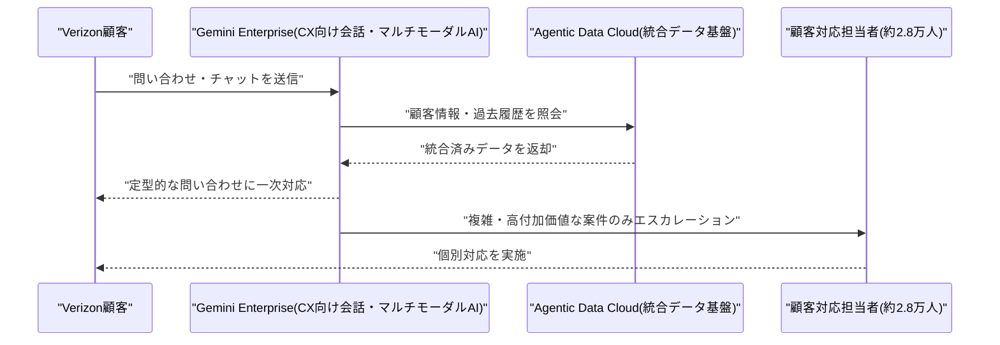

# LLM・AI Agent 最新情報レポート Vol.118
<!-- x-summary: Google Cloud、Verizonと戦略提携しGemini Enterpriseを2.8万人の顧客対応に導入へ -->

**作成日**: 2026年8月25日(JST)
**対象期間**: 2026年8月24日〜8月25日(Vol.117との差分)

---

## 目次

1. [Google Cloudアップデート](#1-google-cloudアップデート)
2. [Microsoft Azure AIアップデート](#2-microsoft-azure-aiアップデート)
3. [LLM Model / AI Agentアーキテクチャ・研究](#3-llm-model--ai-agentアーキテクチャ研究)
4. [公式ブログ・論文のリサーチ・要約](#4-公式ブログ論文のリサーチ要約)
5. [AI Agent搭載SaaS製品情報](#5-ai-agent搭載saas製品情報)
6. [LLM/AI Agentセキュリティインシデント](#6-llmai-agentセキュリティインシデント)
7. [その他特筆すべき情報](#7-その他特筆すべき情報)
   - [7.1 SoftBank、過去最大1兆円規模の個人向け社債発行でOpenAI投資資金を確保](#71-softbank過去最大1兆円規模の個人向け社債発行でopenai投資資金を確保)
   - [7.2 Alibaba、香港で102億ドルの株式調達を実施しAIフルスタック投資を加速](#72-alibaba香港で102億ドルの株式調達を実施しaiフルスタック投資を加速)
8. [参考リンク](#8-参考リンク)

---

> **今号について:** 対象期間(8月24日〜25日)で最も注目すべきは、Google Cloudが通信大手Verizonと戦略的パートナーシップを締結し、Gemini Enterprise Agent Platformを同社の顧客対応・ネットワーク運用・従業員生産性の各領域に展開すると発表したことである。約2万8,000人の顧客対応担当者を抱えるVerizonの事業規模を踏まえると、企業向けAI Agentプラットフォームの実運用が着実に拡大している事例といえる。ビジネス面では、AIインフラへの巨額投資を支える資金調達の動きが引き続き目立った一日となった。SoftBank Groupは日本国内の個人向け社債として過去最大となる1兆円規模の起債を計画していることを明らかにし、OpenAIへの600億ドル超の投資コミットメントを賄う資金確保を急いでいる。同時に、Alibaba Groupも香港市場で過去最大級となる102億ドルの株式調達を実施し、調達資金の全額をチップ・インフラ・モデル開発を含む「フルスタックAI」投資に充てる方針を示した一方、株価は最大8.5%下落する場面もあった。両社に共通するのは、AI開発競争を勝ち抜くための巨額資本の確保が、株式・債券市場を問わず一段と切迫した経営課題になっているという構図である。なお、Microsoft Azure・LLM Model/AI Agentアーキテクチャの学術研究・OpenAI/Anthropic/Google公式ブログ・AI Agent搭載SaaS製品・セキュリティインシデントの各カテゴリについては、対象期間中に前号までの既報と重複しない確度の高い新規発表は確認できなかった。

---

## 1. Google Cloudアップデート

### 1.1 Google Cloud、Verizonと戦略的パートナーシップを締結しGemini Enterpriseを全社展開

Google Cloudは2026年8月24日、米通信大手Verizonとの戦略的パートナーシップ締結を発表した。Verizonは、企業向けAI Agentプラットフォーム「Gemini Enterprise」をカスタマーエクスペリエンス(CX)・ネットワーク運用・従業員生産性の3領域に展開する。具体的には、約2万8,000人規模の顧客対応担当者が対応する定型的な問い合わせ・チャットの一次対応を会話型・マルチモーダルAIが担うことで、担当者がより複雑で高付加価値な案件に注力できる体制を構築する。あわせて、社内の従業員生産性向上やエージェント間オーケストレーションにもGemini Enterpriseを活用する計画としている。この取り組みの基盤には、Verizonが複数年かけて進めてきたレガシーなデータレイクの統合、およびGoogleの「Agentic Data Cloud」への移行があり、組織間のデータサイロを解消し単一の信頼できるデータ基盤を確立したことが、今回のAI導入加速の土台になったと説明されている。通信業界の大手事業者がGemini Enterpriseを全社規模で採用する事例として、複数メディアが8月24日に報じた。[[1]](#ref-1) [[2]](#ref-2) [[3]](#ref-3) [[4]](#ref-4)

---

## 2. Microsoft Azure AIアップデート

新情報なし

対象期間(8月24日〜25日)において、Microsoft Foundry(旧Azure AI Foundry)・Azure OpenAI Service・Copilot Studioを含むAzure AI関連の確度の高い新規発表は確認できなかった。直近の主要アップデートはオープンモデルカタログへのDeepSeek-V4-Flash-0731・NVIDIA Nemotron系モデル追加(8月19日、Vol.116で既報)であり、対象期間より前のため本号では対象外とした。

---

## 3. LLM Model / AI Agentアーキテクチャ・研究

新情報なし

対象期間(8月24日〜25日)において、arXiv等で投稿日を確認できるLLM Model・AI Agentアーキテクチャに関する新規の論文・技術報告は見つからなかった。

---

## 4. 公式ブログ・論文のリサーチ・要約

新情報なし

対象期間(8月24日〜25日)において、OpenAI・Anthropic・Google/DeepMindの公式ブログ・ニュースルームから、前号までの既報と重複しない確度の高い新規発表は確認できなかった。直近の主要発表はOpenAIによるカリフォルニア州AI安全法案「SB 53」の規制強化要請(8月22日、Vol.116で既報)であり、対象期間より前のため本号では対象外とした。

---

## 5. AI Agent搭載SaaS製品情報

新情報なし

対象期間(8月24日〜25日)において、AI Agentを搭載したSaaS製品・企業向けツールに関する確度の高い新規発表は確認できなかった。直近の主要発表はFirecrawlのコーディングエージェント向け検索インデックス「Developer Index」(8月22日、Vol.116で既報)であり、対象期間より前のため本号では対象外とした。

---

## 6. LLM/AI Agentセキュリティインシデント

新情報なし

対象期間(8月24日〜25日)において、LLM/AI Agent関連のセキュリティインシデント・脆弱性・攻撃事例に関する確度の高い新規発表は確認できなかった。直近の主要発表はCISA等によるAI生成攻撃スクリプトを用いたSiemens製PLC標的化に関する合同勧告AA26-231A(8月20日、Vol.116で既報)であり、対象期間より前のため本号では対象外とした。

---

## 7. その他特筆すべき情報

### 7.1 SoftBank、過去最大1兆円規模の個人向け社債発行でOpenAI投資資金を確保

Bloombergは2026年8月24日、SoftBank Groupが日本国内の個人投資家向け社債として発行体史上最大となる1兆円(約63億ドル)規模の起債を計画していると報じた。7年債で、表面利率は4.3〜4.9%程度を想定しているとされ、9月4日の価格決定を見込む。SoftBankはOpenAIに対し600億ドルを超える投資コミットメントを行っており、データセンター拡張などコンピューティング基盤への支出も積み増している状況にあることが、今回の大型起債の背景にある。今回の起債後もなお200億ドルを超える資金ギャップが残る可能性があり、追加の海外借入れも視野に入るとされる。銀行側は預金の伸び悩みや信用格付け、7年という償還期間の長さからリスクを取りづらく、個人投資家への依存度が一段と高まっているという。SoftBankにとって今年3回目となる個人向け社債発行であり、AI投資を賄うための資金調達圧力の高まりを象徴する動きとして、Japan Times・Investing.com・Yahoo Financeなど複数メディアが8月24日に追随報道した。[[5]](#ref-5) [[6]](#ref-6) [[7]](#ref-7)

### 7.2 Alibaba、香港で102億ドルの株式調達を実施しAIフルスタック投資を加速

Bloombergは2026年8月23日、Alibaba Group Holdingが香港市場で710百万株を1株112.70香港ドルで売り出し、香港市場における企業の公募増資として過去最大となる香港ドル800億(約102億ドル)を調達したと報じた。この規模は、Alphabet・Intelに次いで今年世界第3位のプライマリー増資案件になるという。調達額は米国上場株の直近終値に対し3.6%のディスカウント価格で設定されたが、機関投資家からは募集額の約3倍に相当する需要が集まった。Alibabaは調達資金の100%を、チップ・インフラからモデルの開発・展開までを含む「フルスタックAI」能力への投資に充てる方針を明らかにしている。一方で、増資発表を受けAlibaba株は24日の香港市場で一時8.5%下落し、2025年初頭以来の下げ幅を記録した。中国最大手のEC・クラウド企業が、グローバルなAI競争で主導権を握るために巨額の自己資金投入を続けている実態を示す事例として、CNBC・Investing.com(Reuters)など複数メディアが8月23〜24日にかけて報じた。[[8]](#ref-8) [[9]](#ref-9) [[10]](#ref-10)

---

## 8. 参考リンク

**[1]** [Verizon taps into Google Cloud to bring AI to the enterprise | Light Reading](https://www.lightreading.com/ai-machine-learning/verizon-taps-into-google-cloud-to-bring-ai-to-the-enterprise)

**[2]** [Verizon, Google Cloud Expand AI Partnership | Telecom Reseller](https://telecomreseller.com/2026/08/24/verizon-google-cloud-expand-ai-partnership/)

**[3]** [Verizon taps Google for enterprise AI, infrastructure deployment | CIO Dive](https://www.ciodive.com/news/verizon-google-cloud-partner-enterprise-AI/828648/)

**[4]** [Google Cloud Announces Strategic Partnership with Verizon to Scale Enterprise AI | BigDATAwire](https://www.hpcwire.com/bigdatawire/this-just-in/google-cloud-announces-strategic-partnership-with-verizon-to-scale-enterprise-ai/)

**[5]** [SoftBank Plans Record $6.3 Billion Retail Bond Sale in Japan | Bloomberg](https://www.bloomberg.com/news/articles/2026-08-24/softbank-plans-record-1-trillion-retail-bond-offering-in-japan)

**[6]** [SoftBank plans record $6.3 billion retail bond sale in Japan | The Japan Times](https://www.japantimes.co.jp/business/2026/08/24/companies/softbank-plan-bond-sale/)

**[7]** [SoftBank plans record $6.3 bln bond sale as AI spending accelerates | Investing.com](https://www.investing.com/news/stock-market-news/softbank-plans-record-63-bln-bond-sale-as-ai-spending-accelerates-4872543)

**[8]** [Alibaba Raises $10.2 Billion for AI in Record Hong Kong Share Sale | Bloomberg](https://www.bloomberg.com/news/articles/2026-08-23/alibaba-to-raise-10-billion-by-selling-shares-for-ai-expansion)

**[9]** [Alibaba plunges after announcing $10.2 billion share placement to fund AI push | CNBC](https://www.cnbc.com/2026/08/24/alibaba-share-placement-drop-ai-hong-kong.html)

**[10]** [Alibaba plans record $10.2 billion Hong Kong share sale to fund AI | Investing.com](https://www.investing.com/news/company-news/alibaba-plans-record-102-billion-hong-kong-share-sale-to-fund-ai-4872426)
