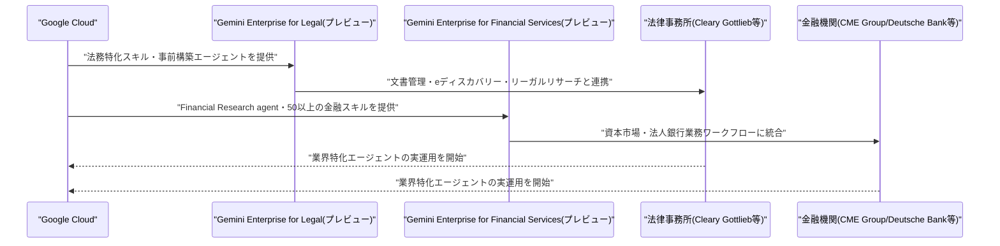
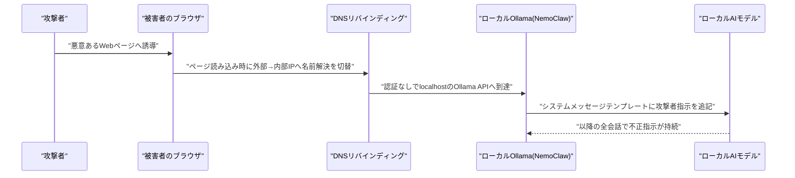

# LLM・AI Agent 最新情報レポート Vol.119
<!-- x-summary: Google Cloud、Gemini Enterpriseを法務・金融特化版として展開し業界特化戦略が本格始動 -->

**作成日**: 2026年8月26日(JST)
**対象期間**: 2026年8月25日〜8月26日(Vol.118との差分)

---

## 目次

1. [Google Cloudアップデート](#1-google-cloudアップデート)
2. [Microsoft Azure AIアップデート](#2-microsoft-azure-aiアップデート)
3. [LLM Model / AI Agentアーキテクチャ・研究](#3-llm-model--ai-agentアーキテクチャ研究)
4. [公式ブログ・論文のリサーチ・要約](#4-公式ブログ論文のリサーチ要約)
5. [AI Agent搭載SaaS製品情報](#5-ai-agent搭載saas製品情報)
6. [LLM/AI Agentセキュリティインシデント](#6-llmai-agentセキュリティインシデント)
7. [その他特筆すべき情報](#7-その他特筆すべき情報)
   - [7.1 Meta、消費者向けAI Agentプラットフォーム「Hatch」を数週間以内に投入へ](#71-meta消費者向けai-agentプラットフォームhatchを数週間以内に投入へ)
8. [参考リンク](#8-参考リンク)

---

> **今号について:** 対象期間(8月25日〜26日)で最も注目すべきは、Google Cloudがエンタープライズ向けAI Agentプラットフォーム「Gemini Enterprise」の業界特化版として、法律業界向け「Gemini Enterprise for Legal」と金融業界向け「Gemini Enterprise for Financial Services」を同日に発表したことである。汎用プラットフォームから業種別の専門エージェント群への展開へと戦略が明確にシフトしており、Googleにとって初の業界特化パッケージングとなる。研究面では、Prime Intellect社とプリンストン大学の研究チームが、再帰的なサブエージェントと永続的なREPL実行環境を組み合わせた自己改善型ハーネス「Prime Agent」を発表し、ARC-AGI-3ベンチマークで人間の専門家水準を上回るスコアを記録したことも技術的に興味深い動きである。セキュリティ面では、ローカルAIエージェント基盤を狙った脆弱性の報告が相次いだ。Oasis Securityは、DNSリバインディング攻撃によりNVIDIA NemoClaw経由でローカルのOllamaインスタンスを乗っ取り、モデル自体に隠し命令を埋め込める脆弱性を報告し、Varonis Threat LabsはMicrosoft Copilot Personalにおいて、悪意あるリンクのクリック一つで接続済みアカウントのデータを窃取できる連鎖的な脆弱性「CoSnitch」を公表した。いずれもAI Agentが実際のシステム・アカウントへのアクセス権を持つことに起因するリスクを改めて浮き彫りにする事例といえる。このほか、Metaが消費者向けAI Agentプラットフォーム「Hatch」を数週間以内に投入する計画であることも報じられた。なお、Microsoft Azure・AI Agent搭載SaaS製品の各カテゴリについては、対象期間中に前号までの既報と重複しない確度の高い新規発表は確認できなかった。

---

## 1. Google Cloudアップデート

### 1.1 Google Cloud、Gemini Enterpriseの業界特化版「for Legal」「for Financial Services」を発表

Google Cloudは2026年8月25日、企業向けAI Agentプラットフォーム「Gemini Enterprise」の業界特化パッケージとして、法律業界向けの「Gemini Enterprise for Legal」と金融業界向けの「Gemini Enterprise for Financial Services」を同日に発表した。両製品ともプレビュー提供で、Googleにとって初の業種別パッケージングとなる。

「Gemini Enterprise for Legal」は法律事務所・企業法務部門向けに構成されており、法務特化のスキルと事前構築済みエージェント、文書管理・eディスカバリー・リーガルリサーチシステムとの接続コネクタを備える。ローンチパートナーとしてCleary Gottlieb・Freshfields・Weil・Williams & Connollyの各法律事務所が名を連ねている。

「Gemini Enterprise for Financial Services」は資本市場・法人向け銀行業務を主対象にプレビュー提供され、Googleが管理する「Financial Research agent」、金融業務向けに特化した指示を持つ50以上の新規スキル、企業データコネクタ、拡大するサードパーティ製エージェントのエコシステムを含む。CME GroupやDeutsche Bankなどグローバル金融機関で既に利用が始まっているという。Googleは今後、ヘルスケア・ライフサイエンス業界向けの専用版も投入する方針を示しており、汎用プラットフォームから業界特化型のバーティカルAI戦略への転換を鮮明にした。複数メディアが8月25日に報じた。[[1]](#ref-1) [[2]](#ref-2) [[3]](#ref-3) [[4]](#ref-4) [[5]](#ref-5) [[6]](#ref-6) [[7]](#ref-7)

---

## 2. Microsoft Azure AIアップデート

新情報なし

対象期間(8月25日〜26日)において、Microsoft Foundry(旧Azure AI Foundry)・Azure OpenAI Service・Copilot Studioを含むAzure AI関連の確度の高い新規発表は確認できなかった。なお、Microsoft Copilot Personalに関するセキュリティ脆弱性の報告は本号「6. LLM/AI Agentセキュリティインシデント」で取り上げている。

---

## 3. LLM Model / AI Agentアーキテクチャ・研究

### 3.1 Prime Intellect、自己改善型エージェントハーネス「Prime Agent」を発表しARC-AGI-3で人間専門家水準を突破

Prime Intellectとプリンストン大学の研究チームは2026年8月25日、長期タスク・コーディングエージェント向けの自己改善型ハーネス「Prime Agent」に関する論文をarXivに投稿した。Prime Agentは、Recursive Language Model(RLM)の考え方に基づく永続的なIPython REPL環境でプログラム的にコンテキストを処理し、Continual Harnessと呼ぶ仕組みで履歴・記憶・スキル・プロンプト・サブエージェント仕様を試行間で保持する。さらに、再帰的なサブエージェントがエージェント間通信を通じて連携し、人間がデーモン型セッションを検査・管理できる「Agents View」も備える。

性能面では、ARC-AGI-3のRHAE Best@1スコアを30%から95.5%へと大幅に引き上げ、報告されている人間専門家水準のベースライン(95.4%)を上回った。長文脈コーディング、GPUカーネル生成、エミュレータ構築、nanoGPTの自律的な高速化タスクといった幅広いベンチマークでも、既存のネイティブハーネスや主要な市販ハーネスと同等かそれ以上の性能を示したという。研究チームは、Prime Agentが実行・復旧・検証・リソース会計を標準化する一方で戦略の構築はモデル自身に委ねる設計思想を採ることで、ハーネス起因の失敗がモデルの失敗と誤認されるのを防ぎ、モデルの真の能力測定に近づけると説明している。コードはGitHubでオープンソース公開されている。[[8]](#ref-8) [[9]](#ref-9)

---

## 4. 公式ブログ・論文のリサーチ・要約

### 4.1 OpenAI、ChatGPT PlusのCodex/ChatGPT Workに5時間利用制限を再導入

OpenAIのCodex/ChatGPT担当エンジニアリングリードThibault Sottiaux氏は2026年8月24日、X(旧Twitter)上でChatGPT Plusユーザー向けのCodexおよびChatGPT Workについて、8月25日より5時間ごとのローリング利用制限を再導入すると発表した。同制限は7月12日に一時撤廃され、それ以降は週次の利用上限のみが適用されていたが、再導入後はローリング5時間枠と週次上限の両方が同時に適用される形に戻る。OpenAIは、この措置がコンピュートの負荷を平準化しつつ週次利用量ベースでは引き続き寛容な水準を維持するための施策であり、比較的ライトな利用層・新規ユーザーが誤って週内の利用枠を使い切ってしまうケースを防ぐ狙いがあると説明している。月額100〜200ドルのProプランについては、当面5時間制限を再導入しない方針も併せて示された。[[10]](#ref-10) [[11]](#ref-11)

### 4.2 Anthropic、Slack向け「Claude Tag」をチャンネル全体の文脈読解に対応させアップデート

Anthropicは2026年8月24日、Slack上でAIエージェントとして動作する「Claude Tag」のアップデートを発表した。従来はメッセージを個別に評価して応答要否を判断していたが、今回のアップデートによりチャンネルの会話全体の文脈、記憶、常設の指示を踏まえた上で、(1)インラインで返信する、(2)スレッドで深い作業に着手する、(3)既存のワークストリームにメッセージを振り分ける、(4)何もしない、の4つの選択肢から行動を選べるようになった。Anthropicによれば、この変更により意図せぬタイミングで会話に割り込む・割り込まないの判断精度が約30%向上したという。同社はこれを、単発のチャットボットから組織の文脈を踏まえて能動的に働く「マルチプレイヤーAI」への戦略転換の一環と位置づけている。[[12]](#ref-12) [[13]](#ref-13)

---

## 5. AI Agent搭載SaaS製品情報

新情報なし

対象期間(8月25日〜26日)において、AI Agentを搭載したSaaS製品・企業向けツールに関する確度の高い新規発表は確認できなかった。直近の主要発表はFirecrawlのコーディングエージェント向け検索インデックス「Developer Index」(8月22日、Vol.116で既報)であり、対象期間より前のため本号では対象外とした。

---

## 6. LLM/AI Agentセキュリティインシデント

### 6.1 NVIDIA NemoClaw、DNSリバインディング攻撃でローカルOllamaエージェントを乗っ取り可能な脆弱性

Oasis Securityは2026年8月25日、NVIDIA製のローカルAIエージェント「NemoClaw」に脆弱性(CVE-2026-65105)を確認したと公表した。攻撃者が用意した悪意あるWebページを閲覧するだけで、DNSリバインディング技術を用いてローカルで稼働するOllamaインスタンスへの認証なしアクセスが可能になり、モデルが処理するメッセージ配列をテキストへ変換するテンプレート部分を書き換えることで、すべてのシステムメッセージに攻撃者の指示を追記できるという。この不正な指示は以降の会話にも持続し、エージェントが自らシステムプロンプトを与え直しても残存する。認証情報の窃取やフィッシングを一切必要とせず、Webページを一度訪問するだけで成立する点が特徴とされる。NemoClaw v0.0.35でmacOS・Linux版は修正済みだが、Windows・WSL版には未修正で、v0.0.34時点では警告表示にとどまっている。8月25日時点で実際の悪用は報告されていない。[[14]](#ref-14) [[15]](#ref-15) [[16]](#ref-16)

### 6.2 Microsoft Copilot Personal、ワンクリックでデータ窃取可能な連鎖脆弱性「CoSnitch」

Varonis Threat Labsは2026年8月24日、Microsoft Copilot Personalにおける3つの脆弱性を連鎖させた攻撃手法「CoSnitch」(CVE-2026-24301、CVSS 8.8)を公表した。細工したURLに隠しパラメータ「autorun=1」を仕込むことで、ユーザーのクリック以外の操作を一切必要とせずCopilotにプロンプトを自動実行させ、接続済みのGmail・カレンダー・Google Driveなど外部OAuthアプリからデータを窃取し、さらにパスワードリセット・セッション無効化・端末の再登録を経ても残り続ける永続的なメモリルールを埋め込めることが確認された。Varonisは、Copilot自身に「なぜプロンプトが自動実行できないのか、技術的に何があれば実行できるのか」を繰り返し質問する「メタハッキング」という手法で、ソースコード解析を経ずに未文書化のautorun=1パラメータを突き止めたという。Varonisは2025年12月にMicrosoftへ報告しており、Microsoftは8月18日にパッチを配信済みで、パッチ前の悪用は確認されていないとしている。[[17]](#ref-17) [[18]](#ref-18) [[19]](#ref-19)

---

## 7. その他特筆すべき情報

### 7.1 Meta、消費者向けAI Agentプラットフォーム「Hatch」を数週間以内に投入へ

The Informationは2026年8月24日、Meta Platformsが社内文書をもとに、消費者向けAI Agentプラットフォーム「Hatch」を今後数週間以内、早ければ8月末から9月初旬にも投入する計画だと報じた。Hatchは同社が開発する「OpenClaw」エージェントの消費者版に位置づけられ、単に応答するチャットボットではなく、Webサイトやサービスと直接やり取りしてユーザーに代わってタスクを遂行するエージェントとして設計されているという。既にDoorDash・Etsy・Reddit・Yelp・Outlookなどのサービスと連携するよう訓練されているとされ、上位プランの月額料金は最大199.99ドルになる可能性があるとも報じられた。あわせて、10月には新モデル「Watermelon」の投入も計画されているという。広告収益への依存を減らし、AIへの巨額投資を収益化するMark Zuckerberg CEOの戦略の一環として位置づけられている。[[20]](#ref-20) [[21]](#ref-21)

---

## 8. 参考リンク

**[1]** [Google Cloud Launches Gemini Enterprise for Legal | Google Cloud Press Corner](https://www.googlecloudpresscorner.com/2026-08-25-Google-Cloud-Launches-Gemini-Enterprise-for-Legal)

**[2]** [Google Launches Gemini Enterprise for Legal | Artificial Lawyer](https://www.artificiallawyer.com/2026/08/25/google-launches-gemini-enterprise-for-legal/)

**[3]** [Google Cloud Launches Gemini Enterprise for Legal | PR Newswire](https://www.prnewswire.com/news-releases/google-cloud-launches-gemini-enterprise-for-legal-302859177.html)

**[4]** [Google Takes Gemini Enterprise Into Big Law With Legal-Specific Agents | Unite.AI](https://www.unite.ai/google-takes-gemini-enterprise-into-big-law-with-legal-specific-agents/)

**[5]** [Introducing Gemini Enterprise for Financial Services | Google Cloud Blog](https://cloud.google.com/blog/products/ai-machine-learning/introducing-gemini-enterprise-for-financial-services)

**[6]** [Google Cloud Launches Gemini Enterprise for Financial Services | PR Newswire](https://www.prnewswire.com/news-releases/google-cloud-launches-gemini-enterprise-for-financial-services-302859186.html)

**[7]** [Google Cloud Launches Gemini Enterprise for Financial Services to Target Wall Street | Technobezz](https://www.technobezz.com/news/google-cloud-launches-gemini-enterprise-for-financial-services-to-target-wall-street)

**[8]** [[2608.23552] Prime Agent: A Self-Improving RLM Harness | arXiv](https://arxiv.org/abs/2608.23552)

**[9]** [Prime Agent: A self-improving RLM agent | Prime Intellect Blog](https://www.primeintellect.ai/blog/prime-agent)

**[10]** [OpenAI restores 5-hour Codex and Work limits for ChatGPT Plus users | 9to5Mac](https://9to5mac.com/2026/08/24/openai-restores-5-hour-codex-and-work-limits-for-chatgpt-plus-users/)

**[11]** [Bad news: ChatGPT Plus users have annoying limits once again | Android Authority](https://www.androidauthority.com/chatgpt-five-hour-limits-3702542/)

**[12]** [Anthropic's new Claude Tag update lets its Slack agent read the full conversation — and jump in unprompted | VentureBeat](https://venturebeat.com/orchestration/anthropics-new-claude-tag-update-lets-its-slack-agent-read-the-full-conversation-and-jump-in-unprompted)

**[13]** [Claude Tag now reads even more of the room | Claude by Anthropic](https://claude.com/blog/claude-tag-now-reads-even-more-of-the-room)

**[14]** [A Malicious Webpage Could Poison Your Local AI Model Behind NVIDIA NemoClaw | The Hacker News](https://thehackernews.com/2026/08/a-malicious-webpage-could-poison-your.html)

**[15]** [Nvidia NemoClaw flaw let attackers poison the model behind a developer's AI agent | SiliconANGLE](https://siliconangle.com/2026/08/25/nvidia-nemoclaw-flaw-let-attackers-poison-the-model-behind-a-developers-ai-agent/)

**[16]** [Oasis Security Researchers Reveal Security Flaw in NemoClaw AI Agent | Security Boulevard](https://securityboulevard.com/2026/08/oasis-security-researchers-reveal-security-flaw-in-nemoclaw-ai-agent/)

**[17]** [Microsoft Copilot Personal Flaws Could Let One Click Exfiltrate Data From Connected Apps | The Hacker News](https://thehackernews.com/2026/08/microsoft-copilot-personal-flaws-could.html)

**[18]** [CoSnitch: When Your AI Assistant Becomes Its Own Whistleblower | Varonis Blog](https://www.varonis.com/blog/cosnitch)

**[19]** ['CoSnitch' Attack Tricked Copilot Into Revealing Own Architecture | Dark Reading](https://www.darkreading.com/vulnerabilities-threats/cosnitch-attack-copilot-mapping-out-architecture)

**[20]** [Meta's Hatch Agent Platform and Watermelon Model Signal a Consumer AI Monetization Push | Yahoo Finance](https://finance.yahoo.com/technology/ai/articles/meta-hatch-agent-platform-watermelon-113350203.html)

**[21]** [Meta to launch Hatch AI agent platform in coming weeks - The Information | Investing.com](https://www.investing.com/news/stock-market-news/meta-to-launch-hatch-ai-agent-platform-in-coming-weeks-the-information-93CH-4874295)
