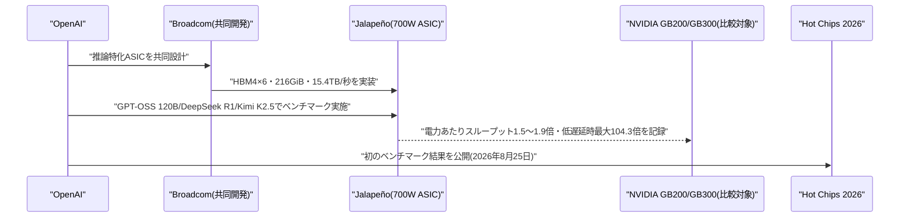

# LLM・AI Agent 最新情報レポート Vol.120
<!-- x-summary: OpenAIが独自推論チップJalapeñoの初のベンチマークを公開、NVIDIA比で電力あたり最大1.9倍の性能を記録 -->

**作成日**: 2026年8月27日(JST)
**対象期間**: 2026年8月26日〜8月27日(Vol.119との差分)

---

## 目次

1. [Google Cloudアップデート](#1-google-cloudアップデート)
2. [Microsoft Azure AIアップデート](#2-microsoft-azure-aiアップデート)
3. [LLM Model / AI Agentアーキテクチャ・研究](#3-llm-model--ai-agentアーキテクチャ研究)
4. [公式ブログ・論文のリサーチ・要約](#4-公式ブログ論文のリサーチ要約)
   - [4.1 OpenAI、独自推論チップ「Jalapeño」の初ベンチマークを公開しNVIDIA比で電力効率最大1.9倍を記録](#41-openai独自推論チップjalapeñoの初ベンチマークを公開しnvidia比で電力効率最大19倍を記録)
   - [4.2 OpenAI、ChatGPTからo3ファミリーを正式に退役](#42-openaichatgptからo3ファミリーを正式に退役)
5. [AI Agent搭載SaaS製品情報](#5-ai-agent搭載saas製品情報)
   - [5.1 OpenAI、ChatGPT Work/Codex向けに管理者専用の「Admin」プラグインを提供開始](#51-openaichatgpt-workcodex向けに管理者専用のadminプラグインを提供開始)
6. [LLM/AI Agentセキュリティインシデント](#6-llmai-agentセキュリティインシデント)
7. [その他特筆すべき情報](#7-その他特筆すべき情報)
   - [7.1 NVIDIA、2026年第2四半期決算で予想を上回る増収も株価は伸び悩み](#71-nvidia2026年第2四半期決算で予想を上回る増収も株価は伸び悩み)
8. [参考リンク](#8-参考リンク)

---

> **今号について:** 対象期間(8月26日〜27日)で最も注目すべきは、OpenAIが独自開発の推論特化ASIC「Jalapeño」に関する初の公開ベンチマーク結果を発表したことである。Broadcomと共同開発したこのチップは、消費電力あたりのスループットでNVIDIAのGB200/GB300比1.5〜1.9倍、レイテンシでも最大3.6倍優れた結果を示したとされ、Hot Chips 2026で詳細が公開された。フロンティアラボが自らモデル学習だけでなく推論用シリコンにまで踏み込み、NVIDIA依存からの脱却を具体的な数値で示した点で、AIインフラの勢力図に一石を投じる動きといえる。皮肉にも同じ8月26日、当のNVIDIAは第2四半期決算で市場予想を上回る増収増益を記録しつつも株価は伸び悩むという対照的な結果となり、自社チップ開発を進めるハイパースケーラー・AIラボの動きが投資家心理に影を落とし始めていることも垣間見える。プロダクト面では、OpenAIがChatGPT WorkおよびCodexの管理者向けに、利用状況分析やメンバー管理を対話形式で行える「Admin」プラグインを追加し、企業向け機能の拡充を継続している。なお、Google Cloud・Microsoft Azure・LLM Model/AI Agentアーキテクチャの学術研究・セキュリティインシデントの各カテゴリについては、対象期間中に前号までの既報と重複しない確度の高い新規発表は確認できなかった。

---

## 1. Google Cloudアップデート

新情報なし

対象期間(8月26日〜27日)において、Gemini Enterprise・Vertex AI(Gemini Enterprise Agent Platform)・Google Workspaceを含むGoogle Cloud AI関連の確度の高い新規発表は確認できなかった。直近の主要発表は「Gemini Enterprise for Legal」「Gemini Enterprise for Financial Services」(8月25日、Vol.119で既報)であり、対象期間より前のため本号では対象外とした。

---

## 2. Microsoft Azure AIアップデート

新情報なし

対象期間(8月26日〜27日)において、Microsoft Foundry(旧Azure AI Foundry)・Azure OpenAI Service・Copilot Studioを含むAzure AI関連の確度の高い新規発表は確認できなかった。

---

## 3. LLM Model / AI Agentアーキテクチャ・研究

新情報なし

対象期間(8月26日〜27日)において、LLM Model/AI Agentのアーキテクチャに関する確度の高い新規の学術研究・技術発表は確認できなかった。直近の主要発表はPrime Intellectの自己改善型エージェントハーネス「Prime Agent」(8月25日、Vol.119で既報)である。なお、OpenAIの推論チップ「Jalapeño」に関するハードウェア面の発表は、公式ブログでの結果公開という性質から本号では「4. 公式ブログ・論文のリサーチ・要約」で取り上げている。

---

## 4. 公式ブログ・論文のリサーチ・要約

### 4.1 OpenAI、独自推論チップ「Jalapeño」の初ベンチマークを公開しNVIDIA比で電力効率最大1.9倍を記録

OpenAIは2026年8月25日、Broadcomと共同開発した推論特化ASIC「Jalapeño」の初の公開ベンチマーク結果を自社ブログで発表した。同日開催の半導体カンファレンス「Hot Chips 2026」でも詳細が公開されている。

Jalapeñoは1パッケージあたりHBM4スタックを6基搭載し、216GiBのメモリ容量と15.4TB/秒のメモリ帯域幅を実現する。消費電力は700Wに抑えられており、比較対象となったNVIDIA GB200(1.2kW)・GB300(1.4kW)・AMD MI355X(1.4kW)よりも大幅に低い点が特徴である。ベンチマークはGPT-OSS 120B、DeepSeek R1 670B、Moonshot AIのKimi K2.5(1兆パラメータ)という3つのオープンモデルを用いて実施され、電力あたりのスループットでGB200/GB300比1.5〜1.9倍、GB300の従来の最速設定条件下での低レイテンシ動作点においては電力あたりスループットが最大104.3倍に達したケースもあったとOpenAIは主張している。具体例として、GPT-OSS 120Bでは電力あたり混合トークン処理数が85,448(GB200は44,960)に達し、エンドツーエンドのレイテンシは1.80秒から1.03秒へ短縮されたという。

フロンティアラボが自社利用向けに推論チップの独自設計に踏み込み、その性能を数値付きで公開したのは今回が初めてであり、NVIDIA一強とされてきたAI推論インフラの調達構造に変化をもたらす可能性がある動きとして注目されている。[[1]](#ref-1) [[2]](#ref-2) [[3]](#ref-3) [[4]](#ref-4) [[5]](#ref-5)

### 4.2 OpenAI、ChatGPTからo3ファミリーを正式に退役

OpenAIは2026年8月26日、2026年5月28日の予告から90日間のサンセット期間を経て、o3モデルファミリーをChatGPTから正式に退役させた。この措置はChatGPTのみが対象でAPI経由の提供には変更がなく、より高性能な新モデルへ利用を集約する目的があるとされる。なお、より計算資源を投入した上位版「o3-pro」については、Pro・Team・Enterprise・Eduの各プラン利用者向けに引き続きChatGPT上で提供が継続される。API版o3の提供終了は2026年12月11日に予定されており、後継としてgpt-5.6-solへの置き換えが案内されている。[[6]](#ref-6) [[7]](#ref-7)

---

## 5. AI Agent搭載SaaS製品情報

### 5.1 OpenAI、ChatGPT Work/Codex向けに管理者専用の「Admin」プラグインを提供開始

OpenAIは2026年8月25日、ChatGPT WorkおよびCodexの管理者向けに、対話形式で管理業務を遂行できる「Admin」プラグインを発表した。従来は複雑なプロンプトの入力や複数の管理画面の行き来が必要だった作業を、単一の会話の中で「質問する→詳細を確認する→権限のある変更を実施する→結果を確認する」という一連の流れとして完結できるようにした点が特徴である。

具体的には、(1)ChatGPT Work・Codex全体の利用状況やクレジット消費量を分析し、追加のトレーニングが必要な部署やクレジット上限に近づいているメンバー・グループを特定する、(2)メンバーやグループの追加・削除、オンボーディング・オフボーディングなどの定型的なチーム管理作業を実行する、(3)メンバー・グループ・ワークスペース単位の利用上限を調整し、支出リクエストを承認・却下する、といった機能を管理者に提供する。OpenAIは、これにより拡大を続けるワークスペースの安全性・生産性・予算管理を両立しやすくなるとしている。エンタープライズ向けにAI Agent的な対話型インターフェースを管理業務そのものへ広げる動きの一例といえる。[[8]](#ref-8) [[9]](#ref-9) [[10]](#ref-10)

---

## 6. LLM/AI Agentセキュリティインシデント

新情報なし

対象期間(8月26日〜27日)において、LLM/AI Agentに関する確度の高い新規のセキュリティインシデント・脆弱性報告は確認できなかった。直近の主要発表はNVIDIA NemoClawの脆弱性(8月25日)およびMicrosoft Copilot Personalの「CoSnitch」(8月24日)であり、いずれもVol.119で既報のため本号では対象外とした。

---

## 7. その他特筆すべき情報

### 7.1 NVIDIA、2026年第2四半期決算で予想を上回る増収も株価は伸び悩み

NVIDIAは2026年8月26日(米国時間)、2027会計年度第2四半期(2026年7月26日期末)の決算を発表した。売上高は962億ドルで市場予想の924億ドルを上回り、前年同期比で約106%増となった。非GAAPベースの1株当たり利益は2.22ドルとなり、アナリスト予想の2.06〜2.09ドルを上回った。粗利率は2四半期連続で75%を維持したが、メモリやウェハーなど部材コストの上昇を背景に、次四半期は74%へ低下する見通しが示された。

会社側は次四半期(第3四半期)の売上高見通しを1,080億ドル(上下2%)とし、アナリスト予想の1,042億ドルを上回る強気の見通しを示した。ジェンスン・フアンCEOは需要が加速していると説明したが、決算内容が市場予想を上回ったにもかかわらず、AI投資の持続性への懸念や、OpenAIの「Jalapeño」に代表される自社製推論チップ開発の広がりを背景に、株価の反応は限定的にとどまった。[[11]](#ref-11) [[12]](#ref-12) [[13]](#ref-13)

---

## 8. 参考リンク

**[1]** [Jalapeño's first results show industry-leading speed and efficiency in AI inference | OpenAI](https://openai.com/index/jalapeno-first-results/)

**[2]** [OpenAI's Jalapeño chip is built for fast inference at scale, benchmarks show | TechCrunch](https://techcrunch.com/2026/08/25/openais-jalapeno-chip-is-built-for-fast-inference-at-scale-benchmarks-show/)

**[3]** [OpenAI Jalapeño AI chip challenges Nvidia in inference | CNBC](https://www.cnbc.com/2026/08/26/openai-jalapeno-ai-chip-nvidia.html)

**[4]** [OpenAI's 700W Jalapeño ASIC outpaces 1,400W Nvidia flagship GPU — claims up to 1.9x throughput per kilowatt and 3.6x lower latency, co-developed with Broadcom | Tom's Hardware](https://www.tomshardware.com/tech-industry/semiconductors/openai-says-its-jalapeno-chip-beats-nvidias-gb300-in-first-published-benchmarks)

**[5]** [OpenAI Debuts Jalapeño AI Inference Chip, with Samsung Reportedly Supplying HBM4 | TrendForce](https://www.trendforce.com/news/2026/08/26/news-openai-debuts-jalapeno-ai-inference-chip-with-samsung-reportedly-supplying-hbm4/)

**[6]** [OpenAI Retired o3 From ChatGPT Today. The Real Cost Is the Churn It Forces on Everyone Else. | Forkast](https://forkast.news/openai-retired-o3-from-chatgpt-today-the-real-cost-is-the-churn-it-forces-on-everyone-else/)

**[7]** [OpenAI o3 Leaves ChatGPT Aug 26: Retirement + Bug Reports | OrcaRouter](https://www.orcarouter.ai/blog/o3-chatgpt-retirement-august-26)

**[8]** [Introducing the Admin plugin for ChatGPT Work and Codex | OpenAI](https://openai.com/index/introducing-admin-plugin/)

**[9]** [OpenAI announces the Admin plugin for ChatGPT Work and Codex | 9to5Mac](https://9to5mac.com/2026/08/25/openai-announces-the-admin-plugin-for-chatgpt-work-and-codex/)

**[10]** [OpenAI launches Admin plugin for ChatGPT Work and Codex | Investing.com](https://www.investing.com/news/stock-market-news/openai-launches-admin-plugin-for-chatgpt-work-and-codex-93CH-4875799)

**[11]** [Nvidia doubles Q2 revenue to $96 billion and crushes estimates, as CEO Jensen Huang says demand is accelerating | Fortune](https://fortune.com/2026/08/26/nvidia-results-q2-earnings/)

**[12]** [Nvidia Sales Forecast Tops Estimates but Shares Fall on AI Spending Concerns | Bloomberg](https://www.bloomberg.com/news/articles/2026-08-26/nvidia-estimate-topping-forecast-fails-to-wow-investors)

**[13]** [Nvidia (NVDA) Q2 2027 earnings report: Live updates | CNBC](https://www.cnbc.com/2026/08/26/nvidia-nvda-earnings-report-q2-2027-live-updates.html)
