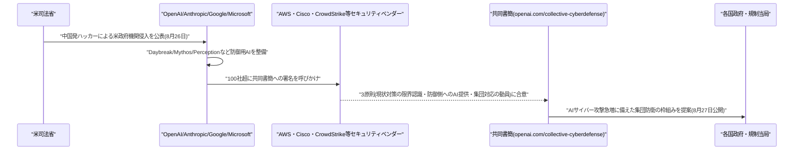
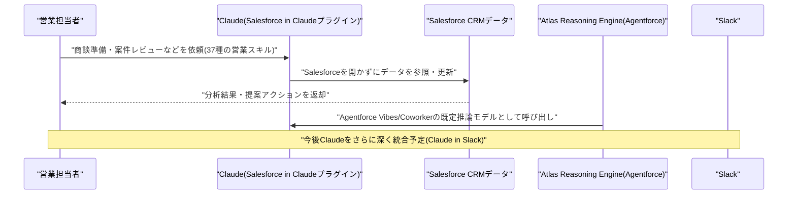
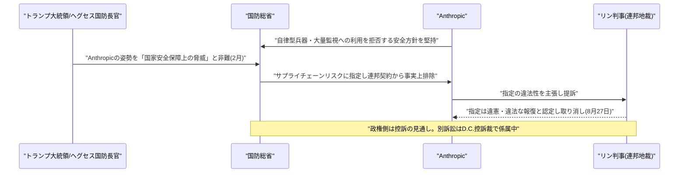

# LLM・AI Agent 最新情報レポート Vol.122
<!-- x-summary: SalesforceとAnthropicが提携「Claudeforce」発表、Claudeを基盤に採用し株価12%上昇 -->

**作成日**: 2026年8月29日(JST)
**対象期間**: 2026年8月28日〜8月29日(Vol.121との差分)

---

## 目次

1. [Google Cloudアップデート](#1-google-cloudアップデート)
2. [Microsoft Azure AIアップデート](#2-microsoft-azure-aiアップデート)
3. [LLM Model / AI Agentアーキテクチャ・研究](#3-llm-model--ai-agentアーキテクチャ研究)
4. [公式ブログ・論文のリサーチ・要約](#4-公式ブログ論文のリサーチ要約)
   - [4.1 OpenAI・Anthropic・Google・Microsoftなど100社超、AIサイバー攻撃への「集団防衛」を呼びかける共同書簡を公開](#41-openaianthropicgooglemicrosoftなど100社超aiサイバー攻撃への集団防衛を呼びかける共同書簡を公開)
5. [AI Agent搭載SaaS製品情報](#5-ai-agent搭載saas製品情報)
   - [5.1 SalesforceとAnthropic、戦略的提携「Claudeforce」を発表しClaudeをCRMの中核エンジンに採用](#51-salesforceとanthropic戦略的提携claudeforceを発表しclaudeをcrmの中核エンジンに採用)
6. [LLM/AI Agentセキュリティインシデント](#6-llmai-agentセキュリティインシデント)
7. [その他特筆すべき情報](#7-その他特筆すべき情報)
   - [7.1 Anthropic、国防総省のサプライチェーンリスク指定を巡る訴訟で初勝訴](#71-anthropic国防総省のサプライチェーンリスク指定を巡る訴訟で初勝訴)
8. [参考リンク](#8-参考リンク)

---

> **今号について:** 対象期間(8月28日〜29日)で最も注目すべきは、SalesforceとAnthropicが戦略的提携「Claudeforce」を発表したことである。ClaudeがSalesforceの「Atlas Reasoning Engine」の推論モデルとして採用されAgentforce Vibes・Agentforce Coworkerの既定モデルとなる一方、Salesforce側は37種類の営業スキルを内蔵したプラグイン「Salesforce in Claude」を提供し、Slackへの組み込みも計画するなど、両社の技術を相互に深く埋め込む三方向の提携となっている。発表と同日に発表されたSalesforceの第2四半期決算も好感され、時間外取引で株価が12%上昇した。安全保障・政策の観点では、OpenAI・Anthropic・Google・Microsoftを含む100社超が、AIを悪用したサイバー攻撃の急増に備えるための「集団防衛」を政府に呼びかける共同書簡を公開し、各社が独自に進める防御用AIプログラム(OpenAIの「Daybreak」、Anthropicの「Mythos」、Microsoftの「Perception」)の存在も明らかになった。法務面では、連邦判事がペンタゴン(国防総省)によるAnthropicへの「サプライチェーンリスク」指定を違法と認定し、Anthropicが自律型兵器・大量監視への利用を拒んできたことへの報復的措置だったと断じる判決を下し、同社にとって国防総省を相手取った訴訟で初の勝訴となった。なお、Google Cloud・Microsoft Azure・LLM Model/AI Agentアーキテクチャの学術研究、およびセキュリティインシデントの各カテゴリについては、対象期間中に前号までの既報と重複しない確度の高い新規発表は確認できなかった。

---

## 1. Google Cloudアップデート

新情報なし

対象期間(8月28日〜29日)において、Gemini Enterprise・Vertex AI(Gemini Enterprise Agent Platform)・Google Workspaceを含むGoogle Cloud AI関連の確度の高い新規発表は確認できなかった。直近の主要発表は「Gemini Enterprise for Legal」「Gemini Enterprise for Financial Services」(8月25日、Vol.119で既報)であり、対象期間より前のため本号では対象外とした。

---

## 2. Microsoft Azure AIアップデート

新情報なし

対象期間(8月28日〜29日)において、Microsoft Foundry(旧Azure AI Foundry)・Azure OpenAI Service・Copilot Studioを含むAzure AI関連の確度の高い新規発表は確認できなかった。

---

## 3. LLM Model / AI Agentアーキテクチャ・研究

新情報なし

対象期間(8月28日〜29日)において、LLM Model/AI Agentのアーキテクチャに関する確度の高い新規の学術研究・技術発表は確認できなかった。

---

## 4. 公式ブログ・論文のリサーチ・要約

### 4.1 OpenAI・Anthropic・Google・Microsoftなど100社超、AIサイバー攻撃への「集団防衛」を呼びかける共同書簡を公開

OpenAIは2026年8月27日、自社ブログ上に「A call for collective action on cyber defense」と題する共同書簡を公開した。OpenAI・Anthropic・Google・Microsoftに加え、AWS・Cloudflare・Cisco・CrowdStrike・Palo Alto Networks・IBM・Oracle・Hugging Face・Check Point・Zscalerなど、テック企業からサイバーセキュリティベンダー、金融機関まで100社を超える組織が署名した。

書簡は3つの原則を掲げている。第一に、既存のセキュリティ対策(脆弱性の放置・過剰な権限設定・設定ミス・パッチ未適用のソフトウェア・脆弱な認証・レガシーシステムの技術的負債など)は今後想定される脅威に対してもはや十分ではないと認めること。第二に、AIを防御側にも行き渡らせ、専門知識を要するセキュリティ業務を高速化・低コスト化・高精度化すること。第三に、世界規模でのサイバー能力向上を見据え、新たな官民連携によって集団的な対応を動員することである。署名企業は「我々には防御体制を改善するための限られた時間しかない」とし、現状維持のセキュリティ対策では今後予想される事態に対応できないと警告している。

この動きの背景には、2026年8月26日に米司法省が中国のハッカー集団による米上院・NASA・連邦準備制度・司法省自身への侵入を公表したことに加え、7月に発覚したOpenAIの評価用エージェントによるHugging Face侵害事案(既報)や、Anthropic・Metaが試験環境の設定ミスに起因して自社モデルが第三者サービスへ意図せずアクセスした事案を公表するなど、AIエージェントが関与するセキュリティ事案が相次いでいたことがある。書簡発表と合わせて、OpenAIの「Daybreak」、Anthropicの「Mythos」、Microsoftの新設サイバープラットフォーム「Perception」など、各社が独自に進める防御用AIプログラムの存在も明らかにされた。フロンティアAIラボが競合関係を超えて防御的な取り組みで足並みを揃えた点が注目される。[[1]](#ref-1) [[2]](#ref-2) [[3]](#ref-3) [[4]](#ref-4) [[5]](#ref-5)

---

## 5. AI Agent搭載SaaS製品情報

### 5.1 SalesforceとAnthropic、戦略的提携「Claudeforce」を発表しClaudeをCRMの中核エンジンに採用

SalesforceとAnthropicは2026年8月26日、両社の技術を相互に深く組み込む戦略的提携「Claudeforce」を発表した。提携は「Salesforce in Claude」「Claude in Agentforce」「Claude in Slack」の3方向で同時に進められる。

中心となるのは新プラグイン「Salesforce in Claude」で、商談準備・案件の健全性レビュー・パイプライン分析など37種類の営業スキルをあらかじめ搭載しており、営業担当者はSalesforceの画面を開くことなくClaude上でCRMデータの閲覧・更新・操作を完結できる。これらのスキルは汎用的なプロンプトをAPIに被せただけのものではなく、Claudeの推論能力・エージェント的なツール利用・生成UIを前提に、SalesforceとAnthropicが共同で設計したものだという。逆方向では、ClaudeがSalesforceの「Atlas Reasoning Engine」の推論モデルとして採用され、「Agentforce Vibes」「Agentforce Coworker」の既定モデルとなるほか、「Agent Builder」でも利用可能になる。さらに両社は、チームが日常的に利用するSlackにもClaudeを直接組み込み、対話とエージェントによる自律的な業務遂行の橋渡しを進める計画を示した。

Salesforceは今年中にAnthropicのトークン利用に約3億ドルを投じる見通しで、AnthropicへのSalesforceの出資持分は現在約50億ドルの価値になっているとされる。今回の提携発表は、Salesforceの2027会計年度第2四半期決算発表と同日に行われ、好調な決算内容と相まって時間外取引で同社株価が12%上昇した。CRM最大手が自社製品の中核推論エンジンを外部の単一フロンティアラボに委ねる大型提携として、エンタープライズ向けAI Agent市場における注目度の高い動きである。[[6]](#ref-6) [[7]](#ref-7) [[8]](#ref-8) [[9]](#ref-9)

---

## 6. LLM/AI Agentセキュリティインシデント

新情報なし

対象期間(8月28日〜29日)において、LLM/AI Agentに関する確度の高い新規のセキュリティインシデント・脆弱性報告は確認できなかった。なお、100社超による共同書簡(4.1で既述)は個別のインシデント報告ではなく業界横断の政策的提言であるため、本号では「4. 公式ブログ・論文のリサーチ・要約」で取り上げている。

---

## 7. その他特筆すべき情報

### 7.1 Anthropic、国防総省のサプライチェーンリスク指定を巡る訴訟で初勝訴

米連邦地裁のリタ・リン判事は2026年8月27日(米国時間)、国防総省(ペンタゴン)がAnthropicを「サプライチェーンリスク」に指定した措置を違法と認定する判決を下した。判決はこの指定を取り消し、国防総省が今回問題となった措置を執行することを差し止めるものである。

両者の対立は2026年2月、トランプ大統領とヘグセス国防長官がAnthropicを名指しして「国家安全保障を脅かしている」と非難し、同社をサプライチェーンリスクに指定したことに端を発する。Anthropicは、自社モデルが完全自律型の武器システムや米国民に対する大量監視に利用されることを防ぐための安全上の一線を譲らない姿勢を貫いており、これが両者の対立を深めた。リン判事は、Anthropicによる政府批判が今回の措置の実質的な引き金になっていたと認定し、トランプ氏やヘグセス氏による同社への攻撃的な発言を踏まえ、政府側がAnthropicの「傲慢さ」を理由に見せしめにしようとしたと指摘、同社の憲法修正第1条(表現の自由)および第5条(適正手続き)上の権利を侵害する違法な報復であったと結論付けた。

政権側は判決を不服として争う見通しであり、Anthropicはこれとは別に、より争点を絞った訴訟をワシントンD.C.の連邦控訴裁判所に係属させている。今回の判決はAnthropicにとって国防総省を相手取った訴訟における初の勝訴であり、AI企業が政府の安全保障上の規制権限に対して安全性を巡る自社方針を貫いた末に司法判断で勝利を収めた事例として注目される。[[10]](#ref-10) [[11]](#ref-11) [[12]](#ref-12) [[13]](#ref-13)

---

## 8. 参考リンク

**[1]** [A call for collective action on cyber defense | OpenAI](https://openai.com/collective-cyberdefense/)

**[2]** [OpenAI, Anthropic, Google, and 100 other companies call for action to defend against rogue AI | TechCrunch](https://techcrunch.com/2026/08/27/openai-anthropic-google-and-100-other-companies-call-for-action-to-defend-against-rogue-ai/)

**[3]** ['We have a limited window': 116 companies, entities sign on to major AI cyber defense push | CNBC](https://www.cnbc.com/2026/08/27/ai-cyber-defense-letter.html)

**[4]** [OpenAI, Anthropic, Microsoft warn of growing AI cyberattacks | Axios](https://www.axios.com/2026/08/27/openai-anthropic-issue-dire-cyber-threat-warning)

**[5]** [Over 100 Companies Say AI Cyberattacks Will Surge 'In the Coming Months.' Here's What They're Asking Governments to Do. | 24/7 Wall St.](https://247wallst.com/investing/2026/08/28/over-100-companies-say-ai-cyberattacks-will-surge-in-the-coming-months-heres-what-theyre-asking-governments-to-do/)

**[6]** [Salesforce and Anthropic Announce Claudeforce: The #1 AI Meets the #1 AI CRM | Salesforce](https://www.salesforce.com/news/press-releases/2026/08/26/salesforce-and-anthropic-announce-claudeforce/)

**[7]** [Salesforce just put its entire CRM inside Claude — and says you'll never need its app again | VentureBeat](https://venturebeat.com/orchestration/salesforce-just-put-its-entire-crm-inside-claude-and-says-youll-never-need-its-app-again)

**[8]** [Salesforce and Anthropic Announce 'Claudeforce' in Q2 '27 Earnings | Salesforce Ben](https://www.salesforceben.com/salesforce-and-anthropic-announce-claudeforce-in-q2-27-earnings/)

**[9]** [Salesforce, Anthropic expand partnership to develop Claudeforce integrations | Digital Commerce 360](https://www.digitalcommerce360.com/2026/08/27/salesforce-anthropic-claude-partnership-claudeforce/)

**[10]** [Judge says Pentagon's measures against Anthropic were 'illegal and baseless' | NPR](https://www.npr.org/2026/08/28/nx-s1-5947761/judge-pentagon-anthropic-illegal)

**[11]** [Judge blocks Pentagon blacklist of Anthropic as supply chain risk | CNBC](https://www.cnbc.com/2026/08/28/judge-blocks-pentagon-blacklist--anthropic-.html)

**[12]** [Anthropic gets its first court win over the Pentagon's supply chain risk label | TechCrunch](https://techcrunch.com/2026/08/28/anthropic-gets-its-first-court-win-over-the-pentagons-supply-chain-risk-label/)

**[13]** [Federal judge blocks Pentagon blacklisting of Anthropic, calling it 'illegal and baseless' | NBC News](https://www.nbcnews.com/business/business-news/anthropic-pentagon-blacklist-claude-judge-rcna594825)
