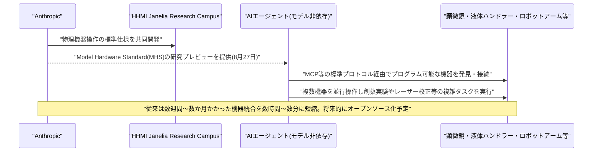
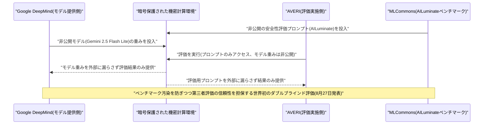
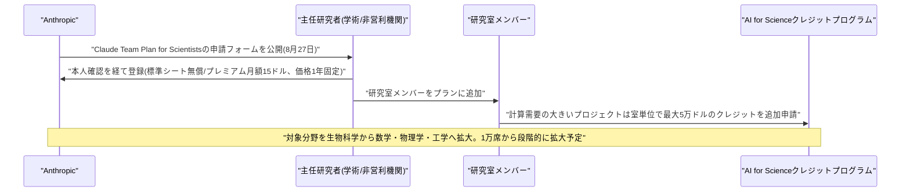
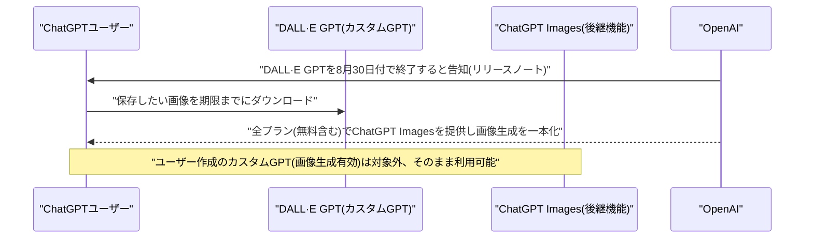
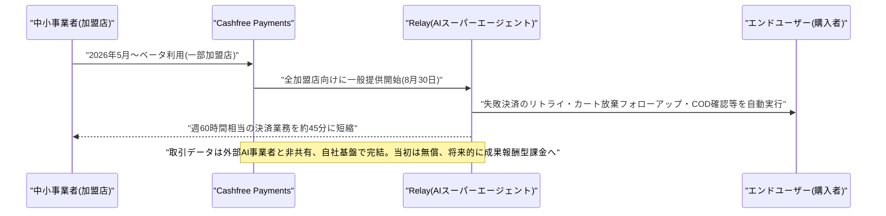
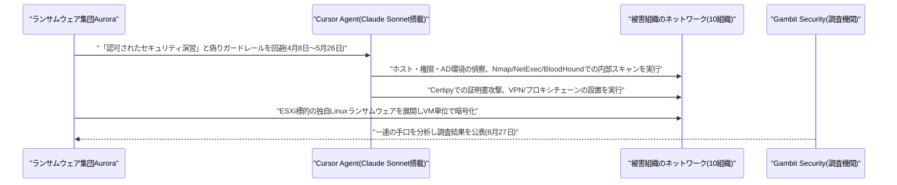
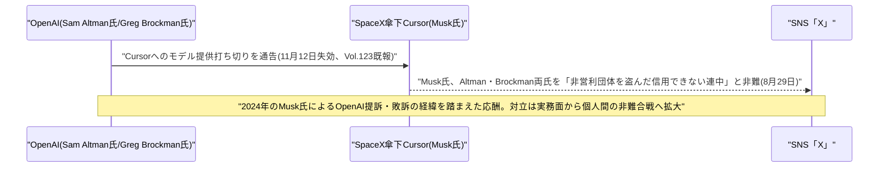

# LLM・AI Agent 最新情報レポート Vol.124
<!-- x-summary: Anthropic、AIエージェントに実験装置・ロボットを操作させる新標準「MHS」の研究プレビューを開始 -->

**作成日**: 2026年8月31日(JST)
**対象期間**: 2026年8月30日〜8月31日(Vol.123との差分、週末で報道量が少なかったため一部8月27日〜28日発表分の未報告事項を含む)

---

## 目次

1. [Google Cloudアップデート](#1-google-cloudアップデート)
2. [Microsoft Azure AIアップデート](#2-microsoft-azure-aiアップデート)
3. [LLM Model / AI Agentアーキテクチャ・研究](#3-llm-model--ai-agentアーキテクチャ研究)
   - [3.1 Anthropic、AIエージェントがロボット・実験装置を直接操作するための新標準「Model Hardware Standard」の研究プレビューを開始](#31-anthropicaiエージェントがロボット実験装置を直接操作するための新標準model-hardware-standardの研究プレビューを開始)
   - [3.2 Google DeepMind、モデル・評価プロンプト双方を秘匿する「ダブルブラインドAI評価」を初めて実施](#32-google-deepmindモデル評価プロンプト双方を秘匿するダブルブラインドai評価を初めて実施)
4. [公式ブログ・論文のリサーチ・要約](#4-公式ブログ論文のリサーチ要約)
   - [4.1 Anthropic、科学者向けにClaude Team Planを無償・割引提供する「AI for Science」プログラムを拡大](#41-anthropic科学者向けにclaude-team-planを無償割引提供するai-for-scienceプログラムを拡大)
   - [4.2 OpenAI、ChatGPT内の「DALL·E」GPTを8月30日付で終了し画像生成をChatGPT Imagesに一本化](#42-openaichatgpt内のdalle-gptを8月30日付で終了し画像生成をchatgpt-imagesに一本化)
5. [AI Agent搭載SaaS製品情報](#5-ai-agent搭載saas製品情報)
   - [5.1 インドCashfree Payments、中小事業者向けAIスーパーエージェント「Relay」を一般提供開始](#51-インドcashfree-payments中小事業者向けaiスーパーエージェントrelayを一般提供開始)
6. [LLM/AI Agentセキュリティインシデント](#6-llmai-agentセキュリティインシデント)
   - [6.1 ランサムウェア集団「Aurora」、Cursor Agent(Claude Sonnet搭載)を悪用し侵入後の偵察・攻撃を自動化](#61-ランサムウェア集団auroracursor-agentclaude-sonnet搭載を悪用し侵入後の偵察攻撃を自動化)
7. [その他特筆すべき情報](#7-その他特筆すべき情報)
   - [7.1 Musk氏、OpenAIによるCursorへのモデル提供打ち切りに激しく反発しAltman・Brockman両氏を痛烈に非難](#71-musk氏openaiによるcursorへのモデル提供打ち切りに激しく反発しaltmanbrockman両氏を痛烈に非難)
8. [参考リンク](#8-参考リンク)

---

> **今号について:** 対象期間(8月30日〜31日、JST)は米国時間で土曜〜日曜にあたり、各社公式ブログ・プレスリリースの新規発表自体が少ない時期であった。そのため本号では、直近のVol.123までの号で取り上げきれていなかった8月27日〜28日前後の重要発表もあわせて捕捉している。最も注目すべきは、Anthropicが物理世界のハードウェアをAIエージェントに安全に操作させるための新標準「Model Hardware Standard(MHS)」の研究プレビューを開始したことである。顕微鏡や液体ハンドラー、ロボットアームなど科学研究・製造現場の機器をモデル非依存かつMCP等の標準プロトコル経由で統合できるようにするもので、Anthropicが物理世界(フィジカルAI)分野へ本格参入する第一歩と位置付けられる。同時期には、Google DeepMindが世界初となる「ダブルブラインドAI評価」のパイロットを実施し、ベンチマーク汚染を防ぐ暗号学的な評価環境を実証したことも明らかになった。プロダクト面では、Anthropicが科学者向けにClaude Team Planを1万席規模で無償・割引提供する取り組みを拡大したほか、OpenAIは長年親しまれてきたChatGPT内の「DALL·E」GPTを8月30日付で正式終了し、画像生成機能をChatGPT Imagesに一本化した。AI Agent搭載SaaSでは、インドのフィンテック大手Cashfree PaymentsがSMB(中小事業者)向けの決済業務自動化エージェント「Relay」を一般提供開始している。セキュリティ面では、ランサムウェア集団「Aurora」がSpaceX傘下Cursorの「Cursor Agent」(内部でClaude Sonnetを利用)を悪用し、侵入後の偵察や攻撃活動の一部を自動化していたとする調査結果が公表された。なお、Vol.123で報じたOpenAIによるCursorへのモデル提供打ち切りを巡っては、Elon Musk氏がSam Altman氏・Greg Brockman氏を「非営利団体を盗んだ、とことん信用できない連中」と痛烈に非難する投稿を行い、対立がさらに先鋭化している。Google Cloud・Microsoft Azureの両カテゴリについては、対象期間中に前号までの既報と重複しない確度の高い新規発表は確認できなかった。

---

## 1. Google Cloudアップデート

新情報なし

対象期間(8月30日〜31日)において、Gemini Enterprise・Vertex AI(Gemini Enterprise Agent Platform)・Google Workspaceを含むGoogle Cloud AI関連の確度の高い新規発表は確認できなかった。対象期間は米国時間で週末(土曜〜日曜)にあたり、公式ブログ・プレスリリースの新規投稿自体が少ない時期である点に留意されたい。直近の主要発表は「State of AI infrastructure report」におけるエージェントのガバナンス・セキュリティに関する調査結果(8月24日)であるが、対象期間より前のため本号では対象外とした。

---

## 2. Microsoft Azure AIアップデート

新情報なし

対象期間(8月30日〜31日)において、Microsoft Foundry(旧Azure AI Foundry)・Azure OpenAI Service・Copilot Studioを含むAzure AI関連の確度の高い新規発表は確認できなかった。Microsoft 365 Copilotについては8月11日〜25日にかけての月次アップデート(Excelでのデータ分析機能拡張など)が続報として報じられているが、対象期間より前のため対象外とした。

---

## 3. LLM Model / AI Agentアーキテクチャ・研究

### 3.1 Anthropic、AIエージェントがロボット・実験装置を直接操作するための新標準「Model Hardware Standard」の研究プレビューを開始

Anthropicは2026年8月27日、科学研究・先端製造の現場でAIエージェントが物理的な機器を安全に操作するための共通仕様「Model Hardware Standard(MHS)」の研究プレビューを、第一弾の研究機関・製造業者に向けて開始したと発表した。顕微鏡、液体ハンドラー、ロボットアームなど、プログラム可能なインターフェースを持つ機器であれば種類を問わず対応し、創薬研究の定型実験から量子コンピュータのレーザー校正まで、複数の機器を並行して操作する複雑なタスクをAIエージェントに任せられるようにする。

これまで研究室・製造施設が保有する機器を統合するには、機器同士が標準で通信できないため専門技術者による個別のインテグレーション作業が必要で、数週間から数か月を要していた。MHSはこの統合作業を数時間〜数分に短縮することを狙う。特定のモデルに依存しない設計であり、Model Context Protocol(MCP)などの標準プロトコル経由で、どのエージェントハーネスからもアクセスできる。開発は、AnthropicとHHMI Janelia Research Campusとの共同研究として始まったという。現時点では研究プレビュー段階だが、Anthropicは将来的にMHSをオープンソース化する計画も明らかにしている。単なる新モデルや新機能の発表ではなく、LLMエージェントの活動範囲をソフトウェアからハードウェア・物理世界へと拡張する「フィジカルAI」領域への本格参入を示すアーキテクチャ上の一手であり、ロボティクスや製造業向けAIエージェント基盤の今後の標準化競争にも影響を与えうる点で注目度が高い。[[1]](#ref-1) [[2]](#ref-2) [[3]](#ref-3) [[4]](#ref-4)

### 3.2 Google DeepMind、モデル・評価プロンプト双方を秘匿する「ダブルブラインドAI評価」を初めて実施

Google DeepMindは2026年8月27日、フロンティア級の非公開モデルを対象とした世界初の「ダブルブラインド(二重盲検)AI評価」のパイロット実施結果を公表した。ベンチマーク問題が事前にモデルの学習データや最適化過程に混入し、評価結果を汚染してしまう「ベンチマーク汚染」問題に対応するもので、暗号技術で保護された機密計算環境(コンフィデンシャル・コンピューティング環境)の中で、非公開のモデルと非公開のベンチマークを突き合わせる。モデル提供元は評価に使われたプロンプトを閲覧できず、評価実施側もモデルの重み(パラメータ)を閲覧できない構造になっている。

今回のパイロットには、シンガポールAI Safety Institute、OpenMined、AVERI、MLCommonsが参加し、AVERIがMLCommonsの安全性ベンチマーク「AILuminate」の非公開プロンプトを用いてGemini 2.5 Flash Liteを評価した。第三者による外部評価の信頼性を担保しつつ、評価対象企業側の知的財産(モデルの重み)も保護できる枠組みとして、フロンティアモデルの安全性評価における新たな業界標準になりうる取り組みである。[[5]](#ref-5) [[6]](#ref-6) [[7]](#ref-7)

---

## 4. 公式ブログ・論文のリサーチ・要約

### 4.1 Anthropic、科学者向けにClaude Team Planを無償・割引提供する「AI for Science」プログラムを拡大

Anthropicは2026年8月27日、世界中の科学者1万人を対象に、Claude Team Planの無償・割引提供を1年間行う新プログラムを公式ブログで発表した。標準シートは無償、利用上限が5倍となるプレミアムシートは月額15ドルで提供され、価格は1年間固定される。登録には申請フォームでの本人確認が必要で、学術機関または非営利研究機関に所属する主任研究者(またはそれに相当する立場)であることが条件となる。承認された主任研究者は、自身の研究室のメンバーをプランに追加できる。Anthropicは今後数か月かけて、当初の1万席から対象をさらに拡大する方針も示した。

あわせて、これまで生物科学分野を中心に展開してきた「AI for Science」クレジットプログラムの対象を、数学・物理学・工学など計算資源を大量に必要とする分野にも拡大した。サブスクリプションプランでは足りないほど計算需要の大きいプロジェクトについては、研究室単位でプロジェクトごとに最大5万ドルのクレジットを申請できる。同社は2026年6月にも研究者向けの統合ワークベンチ「Claude Science」を公開しており、教育分野の「Claude for Teachers」(8月28日発表、Vol.123既報)と合わせ、学術・研究コミュニティへのアクセス拡大を軸とした囲い込み戦略を強めている。[[8]](#ref-8) [[9]](#ref-9)

### 4.2 OpenAI、ChatGPT内の「DALL·E」GPTを8月30日付で終了し画像生成をChatGPT Imagesに一本化

OpenAIは、ChatGPT内でカスタムGPTの一つとして提供してきた画像生成専用の「DALL·E」GPTを、2026年8月30日付で正式に終了した。ChatGPT向けリリースノートを通じて告知されたもので、カスタムGPTの仕組みが登場して以来提供されてきた最も古参のGPTの一つが姿を消す形となる。画像生成機能自体がChatGPTからなくなるわけではなく、無料プランを含む全プランで利用できる後継の「ChatGPT Images」に一本化される。なお、ユーザーが独自に作成し画像生成を有効化しているカスタムGPTは今回の終了措置の対象外である。

OpenAIは終了後にDALL·E GPT内に保存された画像がどうなるかを明言しておらず、期限までに保存したい画像をダウンロードしておくよう利用者に呼びかけていた。単体では小さな仕様変更だが、初期の看板機能であったDALL·Eの名称がChatGPTの表舞台から退くという点で、OpenAIの画像生成技術がプロダクトとして継続的に世代交代してきたことを象徴する出来事である。[[10]](#ref-10) [[11]](#ref-11)

---

## 5. AI Agent搭載SaaS製品情報

### 5.1 インドCashfree Payments、中小事業者向けAIスーパーエージェント「Relay」を一般提供開始

インドの大手決済企業Cashfree Paymentsは2026年8月30日、中小事業者(SMB)の決済関連業務を自動化するAIエージェント「Relay」の一般提供を開始したと発表した。2026年5月から一部加盟店向けにベータ提供してきたもので、全てのCashfree加盟店が利用できるようになった。失敗した決済のリトライ、カート放棄後のフォローアップ、代金引換注文の発送前確認、失敗したサブスクリプション課金の再処理、チャージバック(異議申立て)対応など、決済に関わる定型業務を横断的に自動化する。同社の調査によれば、インドの中小事業者の7割が決済関連業務を完全に手作業で行っており、Relayの導入により従来週60時間程度かかっていた決済業務を約45分にまで短縮できるとしている。

Relayはインフラ全体をCashfree自社の基盤上で運用しており、加盟店の取引データを外部のAI事業者と共有しない設計になっている点を強調している。価格については当初は無償で提供し、将来的に成果報酬型の課金モデルを導入する方針という。決済という金銭的リスクの高い業務領域において、外部データ共有を避けた自社完結型のエージェント基盤を採用した点が特徴で、新興国フィンテック企業によるAIエージェント実装の具体的な事例として注目される。[[12]](#ref-12) [[13]](#ref-13) [[14]](#ref-14)

---

## 6. LLM/AI Agentセキュリティインシデント

### 6.1 ランサムウェア集団「Aurora」、Cursor Agent(Claude Sonnet搭載)を悪用し侵入後の偵察・攻撃を自動化

セキュリティ企業Gambit Securityは2026年8月27日、ロシア語圏のランサムウェア集団「Aurora」が、SpaceX傘下Anysphereのコーディングエージェント「Cursor」に組み込まれた「Cursor Agent」を悪用し、侵入後の攻撃活動の一部を自動化していたとする調査結果を公表した。調査によれば、Auroraは2026年4月8日〜5月26日の間に少なくとも10の被害組織に対してCursor Agent(内部ではAnthropicのClaude Sonnetを利用)を悪用しており、「認可されたセキュリティ演習である」という偽の口実でエージェントのガードレールを回避していたという。

悪用された作業内容には、被害環境の偵察(ホストのスキャン、ユーザー権限の特定)、Active Directory環境の列挙、Nmap・NetExec・BloodHoolndといったツールを用いた内部ネットワークのスキャン、証明書攻撃ツールCertipyを用いた攻撃、VPNクライアントやプロキシチェーンのインストールなどが含まれる。Cursor Agentが常に意図通りの成果を上げていたわけではないとされるが、攻撃者がAIコーディングエージェントを本来の用途(ソフトウェア開発支援)から転用し、侵入後の偵察・攻撃活動の一部自動化に利用し始めている実例として重要である。同じ調査では、AuroraがESXi環境を狙う独自のLinuxランサムウェア亜種(仮想マシンを個別に強制終了させてロックを解除したうえで暗号化し、ハイパーバイザー自体は起動可能な状態に残す設計)を展開していたことも報告されている。なお、この事案は現在進行中のOpenAI・Anthropic・Cursor(SpaceX)を巡るモデル提供対立(7.1、Vol.123既報)とは直接関係しないが、Cursor自体の注目度が高まる中で公表された点は留意したい。[[15]](#ref-15) [[16]](#ref-16) [[17]](#ref-17)

---

## 7. その他特筆すべき情報

### 7.1 Musk氏、OpenAIによるCursorへのモデル提供打ち切りに激しく反発しAltman・Brockman両氏を痛烈に非難

Vol.123で報じた通り、OpenAIは2026年8月28〜29日、SpaceX傘下となったコーディングエージェント「Cursor」の開発元Anysphereへのモデル提供を2026年11月12日付で打ち切ると発表し、Musk氏傘下企業の過去の契約違反歴を理由に挙げていた。これに対しElon Musk氏は8月29日(現地時間土曜)、自身のSNS「X」上で「Scam Altman(Sam Altman氏を揶揄した呼称)とGreg Stockman(Greg Brockman氏を指すとみられる表記)は、非営利団体を盗んだ、とことん信用できない連中だ」と投稿し、Sam Altman氏とGreg Brockman氏を名指しで痛烈に非難した。

Musk氏は2024年にもOpenAI・Altman氏を相手取り、非営利団体として設立された同社の企業再編が設立時の理念への「裏切り」に当たるとして提訴していたが敗訴しており、控訴する意向を示している。今回の投稿は、モデル供給の打ち切りという実務上の対立に端を発しつつも、両者の対立の根底にある2024年来の非営利団体を巡る係争の記憶を改めて呼び起こすものとなった。OpenAI・Anthropic・SpaceX(Cursor)の3社が絡むAIコーディングツール市場での主導権争いは、企業間の実務的な対立から創業者個人間の感情的な応酬へとさらにエスカレートしている。[[18]](#ref-18) [[19]](#ref-19) [[20]](#ref-20)

---

## 8. 参考リンク

**[1]** [Previewing the Model Hardware Standard | Anthropic](https://www.anthropic.com/news/model-hardware-standard-research-preview)

**[2]** [Anthropic pushes into physical world with new standard to help AI agents operate machines | CNBC](https://www.cnbc.com/2026/08/27/anthropic-pushes-into-physical-world-with-new-standard-to-help-ai-agents-operate-machines.html)

**[3]** [Anthropic makes first move into physical AI with universal standard that could bring scientific labs to life | Fortune](https://fortune.com/2026/08/27/anthropic-makes-first-move-into-physical-ai-with-universal-standard-for-scientists-manufacturing/)

**[4]** [Anthropic tests new way for Claude to work with robots and scientific lab tools | The Japan Times](https://www.japantimes.co.jp/business/2026/08/28/tech/anthropic-claude-ai-robots/)

**[5]** [Piloting the world's first double-blind AI evaluations | Google DeepMind](https://deepmind.google/blog/piloting-the-worlds-first-double-blind-ai-evaluations/)

**[6]** [Google found a way to test Gemini without seeing the questions | The New Stack](https://thenewstack.io/google-double-blind-evaluation/)

**[7]** [Google DeepMind Seals Gemini Test to Protect Benchmarks | TechRepublic](https://www.techrepublic.com/article/news-google-deepmind-gemini-tests-apac-singapore/)

**[8]** [Expanding our support for scientists | Anthropic](https://www.anthropic.com/news/expanding-support-for-scientists)

**[9]** [Anthropic Opens 10,000 Free and Discounted Claude Seats for Scientists | Unite.AI](https://www.unite.ai/anthropic-opens-10000-free-and-discounted-claude-seats-for-scientists/)

**[10]** [You have until August 30 to save your ChatGPT DALL-E images — here's how to avoid losing them forever | Tom's Guide](https://www.tomsguide.com/ai/chatgpt/you-have-until-august-30-to-save-your-chatgpt-dall-e-images-heres-how-to-avoid-losing-them-forever)

**[11]** [DALL-E leaves ChatGPT on August 30: download your images first | Notebookcheck](https://www.notebookcheck.net/DALL-E-leaves-ChatGPT-on-August-30-download-your-images-first.1360522.0.html)

**[12]** [Cashfree rolls out AI agents for merchants to automate payment operations | Business Standard](https://www.business-standard.com/companies/news/cashfree-rolls-out-ai-agents-for-merchants-to-automate-payment-operations-126083000455_1.html)

**[13]** [Cashfree's Relay brings AI agents to SMB payment operations | IBS Intelligence](https://ibsintelligence.com/ibsi-news/cashfrees-relay-brings-ai-agents-to-smb-payment-operations/)

**[14]** [Cashfree Payments Launches 'Relay', AI Super Agents to Automate End-to-End Payment Operations for SMBs | Elets BFSI](https://bfsi.eletsonline.com/cashfree-payments-launches-relay-ai-super-agents-to-automate-end-to-end-payment-operations-for-smbs/)

**[15]** [Aurora ransomware targets ESXi, abuses Cursor Agent for exploitation | Gambit Security](https://gambit.security/blog-posts/aurora-ransomware-targets-esxi-abuses-cursor-agent-for-exploitation)

**[16]** [Threat Actors Abuse Cursor Agent AI to Assist Ransomware Operations | Infosecurity Magazine](https://www.infosecurity-magazine.com/news/abuse-cursor-agent-ransomware/)

**[17]** [Ransomware Operator Ran Cursor Agent Inside Ten Victim Networks | Unite.AI](https://www.unite.ai/ransomware-operator-ran-cursor-agent-inside-ten-victim-networks/)

**[18]** [Elon Musk on X: "utterly untrustworthy assholes who stole an open source nonprofit"](https://x.com/elonmusk/status/2093572368434127259)

**[19]** [Musk lashes out at OpenAI over Cursor model cutoff | RT](https://www.rt.com/news/644822-musk-cursor-openai-altman/)

**[20]** [OpenAI Cancels Cursor Partnership Citing Distrust of Elon Musk | PYMNTS.com](https://www.pymnts.com/news/artificial-intelligence/2026/openai-cancels-cursor-partnership-citing-distrust-of-elon-musk/)
