# LLM・AI Agent 最新情報レポート Vol.127
<!-- x-summary: Google、Gemini 3.8 FlashとCyber特化版を公開。脆弱性パッチ生成精度は他モデルの2.6倍を記録 -->

**作成日**: 2026年9月3日(JST)
**対象期間**: 2026年9月2日〜9月3日(Vol.126との差分)

---

## 目次

1. [Google Cloudアップデート](#1-google-cloudアップデート)
   - [1.1 Gemini Enterprise Agent Platform、Memory Bank/Sessionsの従量課金体系が発効](#11-gemini-enterprise-agent-platformmemory-banksessionsの従量課金体系が発効)
2. [Microsoft Azure AIアップデート](#2-microsoft-azure-aiアップデート)
   - [2.1 GitHub Copilotのコードレビュー機能、プルリクエストの承認権限を取得](#21-github-copilotのコードレビュー機能プルリクエストの承認権限を取得)
   - [2.2 GitHub Copilot CLI、セッション管理・MCP設定統合などをアップデート](#22-github-copilot-cliセッション管理mcp設定統合などをアップデート)
   - [2.3 Microsoft Foundry、「Foundry IQ Serverless」の新料金体系を公開](#23-microsoft-foundryfoundry-iq-serverlessの新料金体系を公開)
3. [LLM Model / AI Agentアーキテクチャ・研究](#3-llm-model--ai-agentアーキテクチャ研究)
   - [3.1 「仕様駆動開発」によるエージェント型ソフトウェア工学の社会技術モデルを提案](#31-仕様駆動開発によるエージェント型ソフトウェア工学の社会技術モデルを提案)
   - [3.2 EDGE:誤差依存グラフによるマルチエージェントLLMシステムの複数誤り帰属手法](#32-edge誤差依存グラフによるマルチエージェントllmシステムの複数誤り帰属手法)
   - [3.3 ソフトウェア知識グラフによるLLM生成コードの接地、Claude Codeオーケストレーションの成功率を改善](#33-ソフトウェア知識グラフによるllm生成コードの接地claude-codeオーケストレーションの成功率を改善)
4. [公式ブログ・論文のリサーチ・要約](#4-公式ブログ論文のリサーチ要約)
   - [4.1 Google DeepMind、「Gemini 3.8 Flash」「Gemini 3.8 Flash Cyber」を発表](#41-google-deepmindgemini-38-flashgemini-38-flash-cyberを発表)
   - [4.2 Anthropic、企業向け新枠組み「Enterprise Frontier Safeguards」を発表](#42-anthropic企業向け新枠組みenterprise-frontier-safeguardsを発表)
   - [4.3 OpenAI、ChatGPTにEpicのEHR連携・公的医療データ連携機能を追加](#43-openaichatgptにepicのehr連携公的医療データ連携機能を追加)
5. [AI Agent搭載SaaS製品情報](#5-ai-agent搭載saas製品情報)
   - [5.1 CrowdStrike、AIエージェントのランタイムを守る「Falcon Guardian」を発表](#51-crowdstrikeaiエージェントのランタイムを守るfalcon-guardianを発表)
   - [5.2 CrowdStrike、NVIDIAと共同でサイバーセキュリティ特化フロンティアモデル「SafeMind」を発表](#52-crowdstrikenvidiaと共同でサイバーセキュリティ特化フロンティアモデルsafemindを発表)
   - [5.3 CrowdStrike、脆弱性対応を自動化する50超のAIエージェント群「Falcon IQ」を発表](#53-crowdstrike脆弱性対応を自動化する50超のaiエージェント群falcon-iqを発表)
6. [LLM/AI Agentセキュリティインシデント](#6-llmai-agentセキュリティインシデント)
   - [6.1 「GitSpawn」:悪意ある.gitconfigがAIコーディングエージェント7製品に任意コード実行を許す脆弱性群](#61-gitspawn悪意あるgitconfigがaiコーディングエージェント7製品に任意コード実行を許す脆弱性群)
7. [その他特筆すべき情報](#7-その他特筆すべき情報)
   - [7.1 G20、AI規制で「軽い規制」原則(カロライナ原則)に合意](#71-g20ai規制で軽い規制原則カロライナ原則に合意)
   - [7.2 テキサス州、AI需要急増で新規データセンターの電力接続を凍結](#72-テキサス州ai需要急増で新規データセンターの電力接続を凍結)
   - [7.3 PwC、AIデータセンター投資が2050年までに累計31.6兆ドルに達すると予測](#73-pwcaiデータセンター投資が2050年までに累計316兆ドルに達すると予測)
   - [7.4 エンタープライズAI企業Wonderful、5.5億ドルのシリーズCで評価額50億ドルに](#74-エンタープライズai企業wonderful55億ドルのシリーズcで評価額50億ドルに)
8. [参考リンク](#8-参考リンク)

---

> **今号について:** 対象期間(9月2日〜3日)で最大の注目点は、Googleが前回モデルリリースからわずか3週間で新モデル「Gemini 3.8 Flash」とサイバーセキュリティ特化版「Gemini 3.8 Flash Cyber」を発表したことである。長期ソフトウェアエンジニアリングベンチマークで多くの大型フロンティアモデルを上回る性能を低コストで達成し、Cyber版は実世界の脆弱性発見率が70%を超えるという。同時期には、Anthropicが企業顧客向けの新しいセキュリティ・プライバシー枠組み「Enterprise Frontier Safeguards」を発表し、OpenAIもChatGPTにEpicの電子カルテ連携機能を追加するなど、フロンティア3社がそれぞれ異なる切り口で企業・専門領域向けの機能拡充を進めた。SaaS領域では、CrowdStrikeが年次カンファレンス「Fal.Con 2026」でAIエージェントのランタイム保護「Falcon Guardian」、NVIDIAと共同開発のサイバー特化フロンティアモデル「SafeMind」、脆弱性対応の自動化エージェント群「Falcon IQ」を立て続けに発表し、セキュリティ運用の「エージェント化」を強力に推進した。セキュリティ面では、主要なAIコーディングエージェント7製品(Claude Code、Codex、Cursor等)にまたがる脆弱性群「GitSpawn」が公表され、悪意あるGit設定ファイルがエージェントの起動操作を通じて任意コードを実行できる問題が明らかになった。その他、G20が「軽い規制」を志向する非拘束的枠組み「カロライナ原則」への合意を発表する一方、テキサス州がAI需要急増を受けて新規データセンターの電力接続を凍結するなど、AIインフラの急拡大とその副作用が同時に顕在化した対象期間となった。

---

## 1. Google Cloudアップデート

### 1.1 Gemini Enterprise Agent Platform、Memory Bank/Sessionsの従量課金体系が発効

Google CloudのGemini Enterprise Agent Platform(旧Vertex AI Agent Builder系)において、エージェント向けの記憶管理機能「Memory Bank」と会話状態管理機能「Sessions」の従量課金体系が、2026年9月1日より正式に発効した。これまでプレビュー期間中は無料で利用できていたが、今回の課金開始によりコスト構造が明確化された。

Memory Bankのストレージは「Agent Storage」として1GiB・月あたり0.30ドルで課金され、読み取りAPIリクエストは300万回ごとにAgent Compute vCPU時間換算で0.085ドル、書き込みAPIリクエストも100万回ごとに同額が課金される。記憶生成や埋め込み処理に使用されるモデルトークンは、別途各モデルのSKUで課金される仕組みで、埋め込みモデル「gemini-embedding-2」を用いた類似検索設定にも対応している。エージェント基盤の運用コストが本格的に発生し始めたことで、企業がAIエージェントの記憶管理を長期運用する際のコスト試算がより現実的なものになった。[[1]](#ref-1) [[2]](#ref-2)

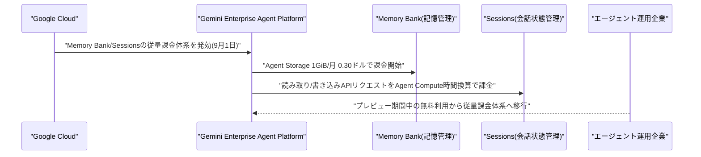

---

## 2. Microsoft Azure AIアップデート

### 2.1 GitHub Copilotのコードレビュー機能、プルリクエストの承認権限を取得

GitHubは2026年9月1日、GitHub Copilotのコードレビュー機能がプルリクエスト(PR)を正式に「承認(Approve)」できるようになったと発表した。Copilotによる承認は、リポジトリで設定された必須レビュー数のカウントにも算入される仕様となっている。既定ではオフになっており、管理者がエンタープライズ・組織・リポジトリ単位で有効化を選択でき、対象ファイルパスによる制限も可能である。

各レビュー時には「承認可能かどうか」を判定する評価コメントが自動生成され、PRが更新されると承認は自動的に取り消され再レビューが必要になる仕組みが組み込まれている。現在はGitHub Copilot Pro/Pro+/Max/Business/Enterprise向けにパブリックプレビューとして提供されており、開発ワークフローにおけるAIエージェントの権限がレビューの「承認」という重要な意思決定領域にまで拡張された事例として注目される。[[3]](#ref-3) [[4]](#ref-4)

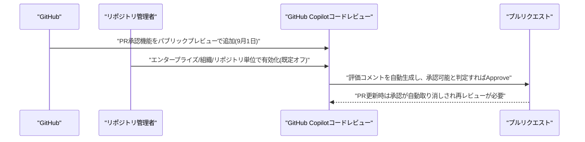

### 2.2 GitHub Copilot CLI、セッション管理・MCP設定統合などをアップデート

GitHubは2026年9月1日、ターミナル向けの「GitHub Copilot CLI」をアップデートした。セッション一覧のサイドバーに「最近」「作成日」「名前」などの並べ替えオプションが追加され、選択した並べ替え順は再起動後も保持されるようになった。エンタープライズ管理者向けには、サインイン先を承認済みGitHub組織へ限定する`forceLoginOrgs`設定が新たに追加されている。

またMCP(Model Context Protocol)関連の設定や、MCPサーバーの追加・編集・認証フォームが、従来の別画面ではなくプラグインダッシュボード内に統合された。大規模リポジトリにおけるファイルパス補完も高速化され、Bazelサンドボックスへの対応も強化されるなど、CLI経由でAIエージェントを日常的に使う開発者の運用性向上を狙ったアップデートとなっている。[[5]](#ref-5) [[6]](#ref-6)

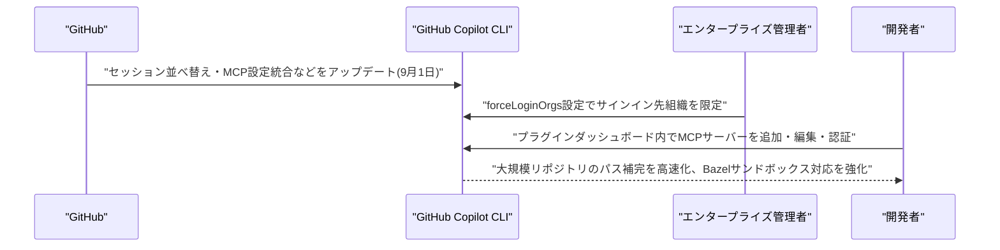

### 2.3 Microsoft Foundry、「Foundry IQ Serverless」の新料金体系を公開

Microsoftは2026年9月1日、Azure AI Search上で提供される統合ナレッジ検索基盤「Foundry IQ」のサーバーレスティアについて、新しい料金レートをAzure価格ページおよびAzureポータル上で公開した。実際の課金開始は2026年9月13日からとなる。既報のEU/リージョナル/APAC Data Zoneのモデル利用料金改定(Vol.126既報)とは別の、Foundry IQ固有の新料金プランである。

サーバーレスティアはインフラのクラスタ管理や容量予約が不要で、アイドル時には自動的にゼロスケールする従量課金モデルを採用しており、消費量は「Compute Unit(CU)」単位(0.25CU刻み、Compute Unit-Hourで課金)で計測される。Foundry IQはWork IQ・Fabric IQ・Azure SQL・File Search・MCPソースを横断して検索できる基盤であり、AIエージェントが複数のデータソースを統合的に参照する際のコスト構造がより柔軟になった形である。[[7]](#ref-7) [[8]](#ref-8)

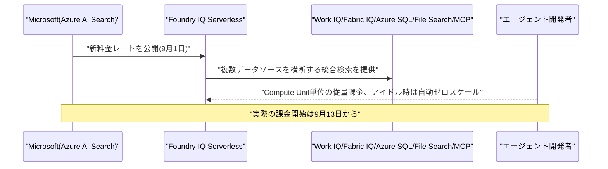

---

## 3. LLM Model / AI Agentアーキテクチャ・研究

### 3.1 「仕様駆動開発」によるエージェント型ソフトウェア工学の社会技術モデルを提案

Jessica Diazらの研究チームは2026年9月1日頃、arXivに論文「Spec-Driven Development for Agentic Software Engineering: Harnessing Human-Agent Teamwork」を公開した。ソフトウェア開発が、人間の開発者を単に加速する「バイブコーディング」から、自律エージェントにゴールレベルのタスクを委任する「エージェント型ソフトウェア工学(ASE)」へと移行しつつあると論じている。

本論文は、仕様(spec)を人間とエージェント間の「契約基盤」とする仕様駆動開発(SDD)の社会技術モデルを提示し、エージェントを取り巻く技術的ハーネスとチームを取り巻く方法論的ハーネスを区別して具体例とともに特徴づけている。さらに、人間の役割が再定義される5種類の人間・エージェント間インタラクションパターンの類型を提案し、SDDがバイブコーディングによって希薄化した説明責任・検証可能性・移転可能性を、仕様中心の形で再構築するものだと結論づけている。[[9]](#ref-9)

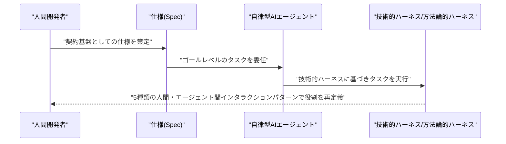

### 3.2 EDGE:誤差依存グラフによるマルチエージェントLLMシステムの複数誤り帰属手法

Jun Hou、Priya Pitre、Yi Fang、Xuan Wangらは2026年9月2日頃、EMNLP 2026採択論文「EDGE: Error Dependency Graph-Guided Multi-Error Attribution in Multi-Agent LLM Systems」をarXivに公開した。複数の専門エージェントが連携動作するマルチエージェントLLMシステムでは、タスク失敗の原因となる誤りが複数のエージェント・ステップにまたがって伝播することが多く、従来手法の多くは単一の根本原因を時系列順に特定する設計になっている点が課題とされてきた。

本研究は「誤差依存グラフ(Error Dependency Graph)」という構造を導入し、エージェント間の情報依存関係をグラフとして明示的にモデル化することで、複数の誤りが相互に連鎖・増幅する状況でも各誤りの発生源と伝播経路を切り分けて特定することを狙う。近年のマルチエージェントLLM系の「失敗原因究明(failure attribution)」研究群の流れに位置づけられ、エージェント・オーケストレーションの信頼性・デバッグ可能性を高めるアーキテクチャ的アプローチとして注目される。[[10]](#ref-10)

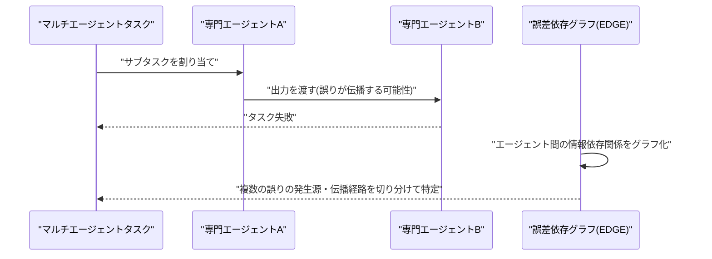

### 3.3 ソフトウェア知識グラフによるLLM生成コードの接地、Claude Codeオーケストレーションの成功率を改善

Yue Sun、Tong Liu、Yipu Liao、Jingde Chen、Ke Liらは2026年9月2日頃、論文「Reliable LLM-Generated Programs for High-Energy Physics Experiments through Graph-Grounded Software Knowledge」をarXivに公開した。汎用LLMは、素粒子物理解析基盤ROOTのような大規模かつ相互依存の強いソフトウェアエコシステム上でのプログラム生成において、必要なAPI・依存関係・利用慣習がユーザー要求だけからは特定できず、信頼性の低いコードを生成しがちだという課題に取り組んでいる。

本研究では、異種ソフトウェア知識をグラフ化した「ソフトウェア知識グラフ」に対するハイブリッド検索、スキル選択型のワークフロー例示、実行結果に基づく自己修復(execution-guided repair)を組み合わせたグラウンディング(接地)システムを提案した。ROOTタスク275件のベンチマークで、Claude Codeによるオーケストレーション下での初回実行成功率を58.5%から76.0%に、単体オーケストレーション下でも51.3%から64.0%に改善したと報告しており、ツール利用型AIエージェントの「知識接地」アーキテクチャの具体的な有効性を示す事例として興味深い。[[11]](#ref-11)

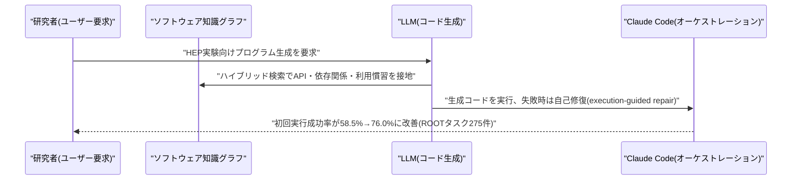

---

## 4. 公式ブログ・論文のリサーチ・要約

### 4.1 Google DeepMind、「Gemini 3.8 Flash」「Gemini 3.8 Flash Cyber」を発表

Google DeepMindは2026年9月2日、前回モデルリリースからわずか3週間で新モデル「Gemini 3.8 Flash」と、サイバーセキュリティ特化版「Gemini 3.8 Flash Cyber」を発表した。3.8 Flashは長期ソフトウェアエンジニアリングのベンチマーク「DeepSWE v1.1」で多くの大型フロンティアモデルを上回る性能を低コストで達成し、HLE-Verifiedでは54.9%のスコアを記録した。長時間稼働するドキュメント処理系のエージェントタスクでは、前世代の3.7 Flashの3倍以上のタスクを完遂できるとしている。価格は前モデルと同水準の入力100万トークンあたり0.75ドル・出力3.75ドル(2026年12月31日までの導入価格、2027年1月1日以降は倍額に改定予定)。

サイバー特化版のGemini 3.8 Flash Cyberは、外部評価機関Collinear運営のCWE-Benchでpass@1スコア47.2%を記録し大手フロンティアモデルの47.8%に迫る性能を低コストで実現、実世界の脆弱性発見率は70%を超えるという。Chrome Securityチームの評価では、他の商用モデルと比べ2.6倍多い正しい脆弱性パッチを生成したと報告されている。Cyber版は政府機関や重要インフラ事業者、審査済みセキュリティチーム向けの新プログラム「Google Fairwind」を通じてのみ提供され、通常版はGemini app、AI Mode、Google Sheets、Google Antigravity、AI Studio、Gemini API、Vertex AI(プレビュー)などで即日利用可能となった。[[12]](#ref-12) [[13]](#ref-13) [[14]](#ref-14)

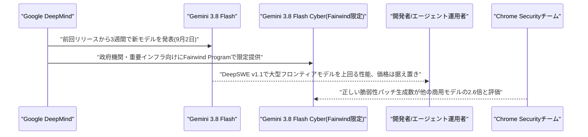

### 4.2 Anthropic、企業向け新枠組み「Enterprise Frontier Safeguards」を発表

Anthropicは2026年9月1日、企業顧客向けの新しいセキュリティ・プライバシー枠組み「Enterprise Frontier Safeguards(EFS)」を発表した。ゼロデータ保持(ZDR)によるプライバシー保護と、不正利用検知のための安全対策を組み合わせた仕組みで、監視用データはAnthropicではなく顧客自身が管理するクラウドインフラ側に保存される。攻撃的サイバー能力や生物兵器能力の構築試行、漏洩認証情報の兆候といった自動化された不正利用検知はAnthropic側で行うが、データの管理権限・暗号鍵・人手によるレビューは顧客側に残る設計となっている。

この枠組みは、金融・医療・製造・通信・法律・小売・公共部門など100社超の顧客、およびAWS・Google Cloud・Microsoft Azureとの協力を経て開発され、Comcast・KPMG・Mastercard・Salesforce・Visaなどの大手企業や、大手米銀のCISOが参加するAnalysis and Resilience Center for Systemic Riskの意見も反映されている。追加費用なしで段階的に展開され、今秋の広範な提供開始が予定されている。顧客データの取り扱いを巡る従来の懸念に応える形での、企業向けガバナンス強化の取り組みといえる。[[15]](#ref-15) [[16]](#ref-16) [[17]](#ref-17)

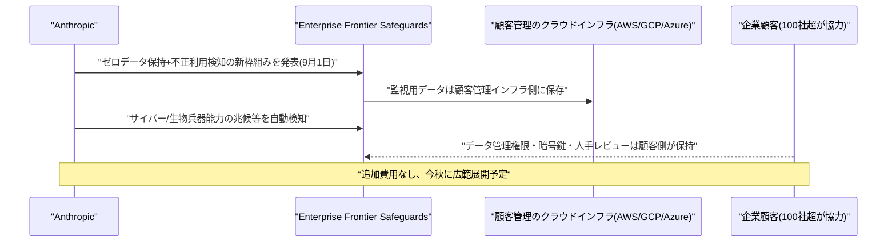

### 4.3 OpenAI、ChatGPTにEpicのEHR連携・公的医療データ連携機能を追加

OpenAIは2026年9月1日、医療機関がEpic社の電子カルテ(EHR)環境をChatGPTに接続できる新機能と、9つの公的医療データソースに接続する「Healthcare Public Data」プラグインを発表した。EHR連携により、認可された臨床医は患者の診療記録・検査結果・服薬情報・専門医の記録などを横断的に参照しながらChatGPT上で質問でき、「前回受診後に何が変わったか」「本日の診察前に確認すべき検査結果は何か」といった問い合わせに対応できるようになる。

Healthcare Public DataプラグインはClinicalTrials.gov、CMS Coverage、RxNorm、DailyMed、PubMedなど9つの公式情報源への接続を統合し、治験の適格基準や薬剤識別情報、保険適用範囲などを個別に検索せず比較・確認できるようにする。安全設計として本機能は読み取り専用に限定されており、ChatGPTが患者記録に書き込むことはできないとOpenAIは説明している。医療分野における生成AI活用が、単純な質問応答から実際の臨床データ基盤との統合フェーズへ進んでいることを示す事例である。[[18]](#ref-18) [[19]](#ref-19) [[20]](#ref-20)

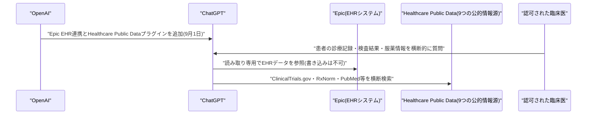

---

## 5. AI Agent搭載SaaS製品情報

### 5.1 CrowdStrike、AIエージェントのランタイムを守る「Falcon Guardian」を発表

CrowdStrikeは2026年9月1日、年次カンファレンス「Fal.Con 2026」(ラスベガス)初日に、企業内で稼働するAIエージェントを検出・統制するセキュリティ製品「Falcon Guardian」を発表した。Windows/macOS/Linuxの各エンドポイント上で稼働する既知・未知のAIエージェントを継続的に発見し、どこで誰が使用しているか、そのセキュリティ状態を可視化する機能を備える。

「Agent Access Controls」機能では、管理対象エンドポイントで実行を許可するAIエージェントを定義し、未承認エージェントをブロックしてガバナンスポリシーを実行可能な制御に変換できる。さらに「Runtime Detection and Response」機能により、エージェントへの攻撃や悪意あるエージェント挙動を検知し、プロンプトからランタイム挙動・影響範囲までの実行チェーン全体を再構成する。Falcon Flexの顧客向けに即時提供開始となった。[[21]](#ref-21) [[22]](#ref-22) [[23]](#ref-23)

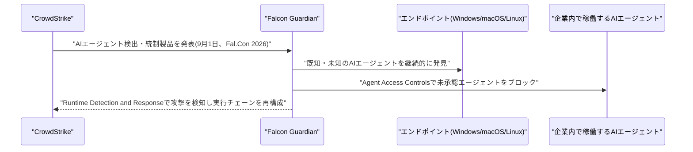

### 5.2 CrowdStrike、NVIDIAと共同でサイバーセキュリティ特化フロンティアモデル「SafeMind」を発表

CrowdStrikeは2026年9月1日、Fal.Con 2026初日に、Cyber Superintelligence Labが開発した専用セキュリティモデル群「CrowdStrike SafeMind」を発表した。攻撃側の「Red Tempest」(15年分のインシデントレスポンスデータ等で訓練された攻撃エミュレーションモデル)と、防御側の「Blue Solano」(実戦で検証された対策を展開する防御モデル)の2種類で構成される。

Red TempestがNVIDIAのシミュレーション技術上で顧客環境のデジタルツインを探索して攻撃経路を発見し、Blue Solanoがそれを修復するというサイクルを、攻撃経路がなくなるまで繰り返す仕組みである。学習にはCrowdStrikeの脅威インテリジェンスやFalcon Complete MDRのイベント注釈データも用いられており、NVIDIAのオープンモデル「Nemotron」を基盤に共同開発された。SafeMindはFalconプラットフォームにネイティブ統合されるほか、「Project QuiltWorks」プログラムを通じてスタンドアロンでの利用も提供される。[[24]](#ref-24) [[25]](#ref-25) [[26]](#ref-26)

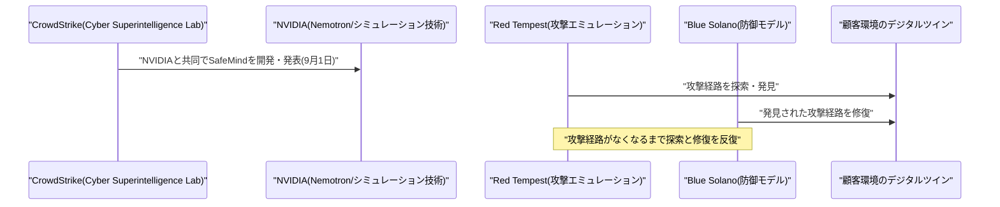

### 5.3 CrowdStrike、脆弱性対応を自動化する50超のAIエージェント群「Falcon IQ」を発表

CrowdStrikeは2026年9月2日、Fal.Con 2026の2日目に、脆弱性の評価・優先順位付け・修復を自動化するエージェント型自動化プラットフォーム「Falcon IQ」を発表した。NVIDIAのオープンモデル「Nemotron」とCrowdStrike自社の「Charlotte AI AgentWorks」を基盤とし、50を超える専用AIエージェントを搭載する。

同日、CrowdStrikeはFalcon GuardianをGoogle Agent Gatewayにも拡張したと発表し、Google Cloud上で構築されたエンタープライズAIアプリケーションに対してプロンプトインジェクションや機密データ漏えいなどのAIランタイムリスクを検知・防止する機能も追加した。これら一連のAIエージェント関連発表を受け、CrowdStrike株は発表当日に4%上昇した。セキュリティ運用の各工程(検出・攻撃シミュレーション・修復)がAIエージェント群によって連鎖的に自動化されつつある動きを示す事例である。[[27]](#ref-27) [[28]](#ref-28) [[29]](#ref-29)

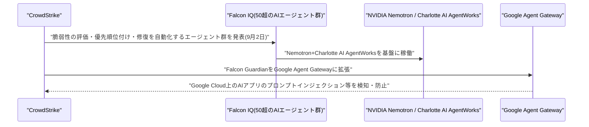

---

## 6. LLM/AI Agentセキュリティインシデント

### 6.1 「GitSpawn」:悪意ある.gitconfigがAIコーディングエージェント7製品に任意コード実行を許す脆弱性群

セキュリティ企業Manifold Securityは2026年9月2日、Claude Code、Codex、Cursor、Goose、Hermes Agent、Qwen Code、Grok Buildなど主要なコマンドライン型AIコーディングエージェント7製品にまたがる計8件の脆弱性を「GitSpawn」として公表した。原因はGitの性能設定`core.fsmonitor`にあり、リポジトリ自身の`.git/config`に任意コマンドを仕込んでおくと、エージェントが起動時に自動実行する`git status`等の操作がそのコマンドをログインユーザー権限で実行してしまう。

攻撃が成立するには`.git`ディレクトリを含む形でファイルが渡される経路(zip展開、共有ドライブ、USBメモリなど)が必要で、通常の`git clone`では発生しない。GooseとClaude Code、Cursorは修正済みだが、Hermes Agent、Qwen Code、Grok Buildおよび Claude Codeの別経路(ultrareviewコマンド)は9月1日の再検証時点で未修正だった。OpenAIも同種の脆弱性クラスに対しCodex向けに3件のCVEを発行しており、GooseにはCVE-2026-72718、Hermes AgentにはCVE-2026-71963が割り当てられている。AIコーディングエージェントが日常的に実行する「暗黙のGit操作」自体が攻撃対象となりうることを示した事例であり、影響範囲の広さから注目される。[[30]](#ref-30) [[31]](#ref-31)

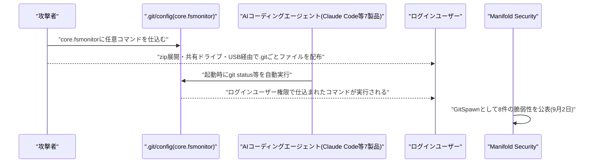

---

## 7. その他特筆すべき情報

### 7.1 G20、AI規制で「軽い規制」原則(カロライナ原則)に合意

米ノースカロライナ州チャペルヒルで2026年9月1日〜2日に開催されたG20イノベーション閣僚会合において、米商務長官ハワード・ラトニックとホワイトハウス科学技術政策局長マイケル・クラチオスが主導し、AI規制について「新たな規制機関を作らない」「業界横断の一律規制ではなくセクター別ルールと業界主導のテスト協力を優先する」との非拘束的枠組み「カロライナ原則(Carolina Principles)」への署名を各国に呼びかけた。

米商務長官は会合終了時、G20全加盟国がこの枠組みを承認したと発表し、中国も署名した。イーロン・マスク、NVIDIAのジェンセン・ファン、OpenAIのサム・アルトマンら業界首脳も同会合に参加した。トランプ政権とシリコンバレーにとって規制緩和方針での勝利と評されており、AI規制の国際的な潮流が「軽い規制」寄りに傾いたことを示す出来事となった。[[32]](#ref-32) [[33]](#ref-33) [[34]](#ref-34)

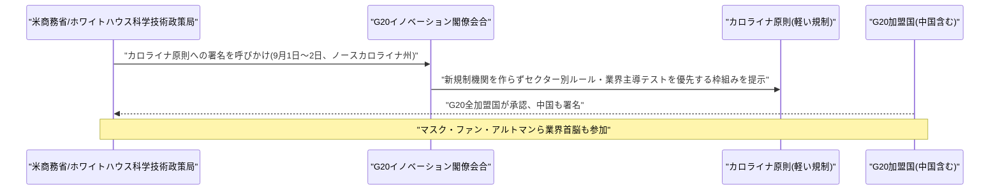

### 7.2 テキサス州、AI需要急増で新規データセンターの電力接続を凍結

テキサス州の送電網は2026年9月1日までに、AI関連の電力需要申請が急増(2023年の約48GWから現在474GW超、実際のピーク需要の5倍超)したことを受け、新規データセンター向けの送電網接続を凍結し、既存の計画についても調査を開始したと報じられた。米国主要データセンター拠点としては初の大規模凍結措置とされる。

背景には、実際の資金や顧客が確定していないまま複数の投機的な電力申請(「ゴースト需要」)を出す開発業者の存在があり、他州でも同様の審査厳格化の動きが広がっている。電力大手エクセロンでは審査基準の厳格化により「高確度」のデータセンター需要見積もりが40%減少(約11GWへ)した事例も報告されており、AIインフラ投資の急拡大がついに電力網の物理的な制約に直面し始めたことを示す事例である。[[35]](#ref-35) [[36]](#ref-36)

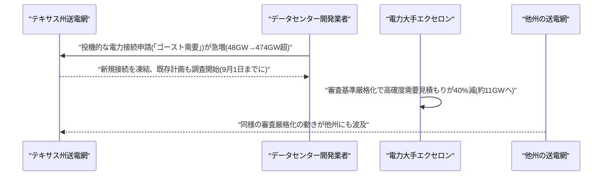

### 7.3 PwC、AIデータセンター投資が2050年までに累計31.6兆ドルに達すると予測

会計大手PwCは2026年9月2日、46カ国・地域を対象とした調査結果として、AI需要の高まりを背景に世界のデータセンター向け年間資本支出が今年の約8000億ドルから2030年に1.1兆ドル、2050年には1.8兆ドルへ増加し、2050年までの累計投資額が31.6兆ドルに達すると予測した。AI導入が加速するシナリオでは最大50兆ドルに達する可能性もあるとしている。

地域別では米国が15.1兆ドルと全体のほぼ半分を占め、アジア太平洋が8.2兆ドル、欧州が5.6兆ドルと続く。PwCは、電力の安定調達が投資先を左右する最大の要因になると指摘しており、前掲7.2のテキサス州における電力接続凍結の事例とあわせ、AIインフラ投資の規模と電力制約の緊張関係が今後さらに顕在化していく可能性を示唆する内容となっている。[[37]](#ref-37) [[38]](#ref-38)

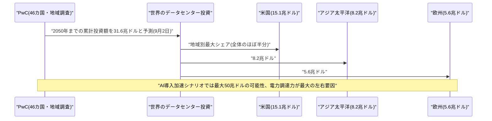

### 7.4 エンタープライズAI企業Wonderful、5.5億ドルのシリーズCで評価額50億ドルに

アムステルダム拠点のエンタープライズAIスタートアップWonderfulは2026年9月2日、Insight Partnersを主導投資家として5億5000万ドルのシリーズC資金調達を実施し、評価額が50億ドルに達したと発表した。Salesforceのほか、既存投資家のIndex Ventures、IVP、Vine Ventures、9Yards、Bessemer Venture Partnersが参加した。

同社は2025年初頭の創業からわずか約6カ月前の前回ラウンド(評価額20億ドル)から評価額を2倍以上に伸ばした形で、累計調達額は8億ドルを超える。同社はモデル非依存でエージェント・ワークフロー・アプリを統合する「AI OS」を企業向けに提供しており、エンタープライズ向けAIエージェント基盤への投資家の評価が急速に高まっていることを示す事例である。[[39]](#ref-39) [[40]](#ref-40) [[41]](#ref-41)

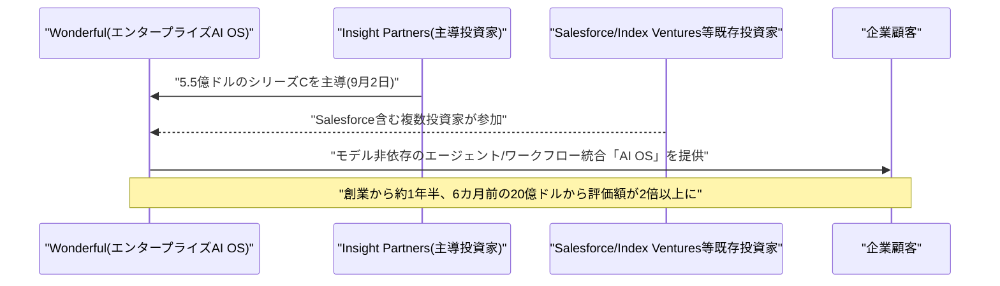

---

## 8. 参考リンク

**[1]** [Gemini Enterprise Agent Platform pricing | Google Cloud](https://cloud.google.com/products/gemini-enterprise-agent-platform/pricing)

**[2]** [Gemini Enterprise Agent Platform release notes | Google Cloud Documentation](https://docs.cloud.google.com/gemini-enterprise-agent-platform/release-notes)

**[3]** [Copilot code review can now approve pull requests | GitHub Changelog](https://github.blog/changelog/2026-09-01-copilot-code-review-can-now-approve-pull-requests/)

**[4]** [GitHub Puts Copilot in the Approval Seat for Pull Requests | DevOps.com](https://devops.com/github-puts-copilot-in-the-approval-seat-for-pull-requests/)

**[5]** [copilot-cli/changelog.md | github/copilot-cli (GitHub)](https://github.com/github/copilot-cli/blob/main/changelog.md)

**[6]** [Releases · github/copilot-cli | GitHub](https://github.com/github/copilot-cli/releases/)

**[7]** [Pricing - Foundry IQ | Microsoft Azure](https://azure.microsoft.com/en-us/pricing/details/search/)

**[8]** [Foundry IQ: Build smarter agents faster with unified knowledge and serverless retrieval | Microsoft Foundry Blog](https://devblogs.microsoft.com/foundry/build-smarter-agents-faster-with-foundry-iq/)

**[9]** [Spec-Driven Development for Agentic Software Engineering: Harnessing Human-Agent Teamwork | arXiv:2609.00252](https://arxiv.org/abs/2609.00252)

**[10]** [EDGE: Error Dependency Graph-Guided Multi-Error Attribution in Multi-Agent LLM Systems | arXiv:2609.01360](https://arxiv.org/abs/2609.01360)

**[11]** [Reliable LLM-Generated Programs for High-Energy Physics Experiments through Graph-Grounded Software Knowledge | arXiv:2609.01095](https://arxiv.org/abs/2609.01095)

**[12]** [Introducing Gemini 3.8 Flash and 3.8 Flash Cyber | Google](https://blog.google/innovation-and-ai/models-and-research/gemini-models/3-8-flash-and-3-8-flash-cyber/)

**[13]** [Google DeepMind Releases Gemini 3.8 Flash and Gemini 3.8 Flash Cyber | MarkTechPost](https://www.marktechpost.com/2026/09/02/google-deepmind-releases-gemini-3-8-flash-and-gemini-3-8-flash-cyber-one-core-model-two-access-envelopes/)

**[14]** [Gemini 3.8 Flash rolling out three weeks after last release | 9to5Google](https://9to5google.com/2026/09/02/gemini-3-8-flash-launch/)

**[15]** [Developing Enterprise Frontier Safeguards with our customers | Anthropic](https://www.anthropic.com/news/enterprise-frontier-safeguards)

**[16]** [Anthropic Introduces Enterprise Frontier Safeguards (EFS) | MarkTechPost](https://www.marktechpost.com/2026/09/02/anthropic-enterprise-frontier-safeguards-efs/)

**[17]** [Anthropic changes data retention policy after pushback from customers | CNBC](https://www.cnbc.com/2026/09/01/anthropic-data-retention.html)

**[18]** [Healthcare organizations can now connect EHR and additional industry data to ChatGPT | OpenAI](https://openai.com/index/chatgpt-connects-health-records-and-healthcare-sources/)

**[19]** [ChatGPT for Healthcare unveils new integrations with Epic, public health data sources | Fierce Healthcare](https://www.fiercehealthcare.com/ai-and-machine-learning/chatgpt-healthcare-unveils-new-integrations-epic-ehr-public-health-data)

**[20]** [OpenAI Connects Epic Health Records and Public Data to ChatGPT | Unite.AI](https://www.unite.ai/openai-connects-epic-health-records-and-public-data-to-chatgpt/)

**[21]** [CrowdStrike Unveils Falcon Guardian to Secure AI Agents Where They Execute | CrowdStrike](https://www.crowdstrike.com/en-us/press-releases/crowdstrike-unveils-falcon-guardian-ai-agent-security/)

**[22]** [CrowdStrike launches Falcon Guardian to police AI agents at the endpoint | SiliconANGLE](https://siliconangle.com/2026/09/01/crowdstrike-launches-falcon-guardian-to-police-ai-agents-at-the-endpoint/)

**[23]** [CrowdStrike Falcon Guardian Secures Autonomous AI Agents | ChannelInsider](https://www.channelinsider.com/security/tools-and-platforms/crowdstrike-falcon-guardian-ai-agent-security/)

**[24]** [CrowdStrike Launches Frontier Models for Cybersecurity, Created with NVIDIA | CrowdStrike](https://www.crowdstrike.com/en-us/press-releases/crowdstrike-launches-frontier-models-for-cybersecurity-with-nvidia/)

**[25]** [Autonomous red teaming debuts at CrowdStrike Fal.Con | SiliconANGLE](https://siliconangle.com/2026/09/01/autonomous-red-teaming-crowdstrike-falcon/)

**[26]** [CrowdStrike and Nvidia launch SafeMind AI cybersecurity system | Quartz](https://qz.com/crowdstrike-nvidia-safemind-ai-cybersecurity-090226)

**[27]** [CrowdStrike Falcon IQ: 50+ AI Agents vs Vulnerabilities | CloudNews](https://cloudnews.tech/crowdstrike-unveils-falcon-iq-50-ai-agents-to-tackle-vulnerabilities/)

**[28]** [CrowdStrike at Fal.Con Day 2: AI security takes center stage | Investing.com](https://www.investing.com/news/transcripts/crowdstrike-at-falcon-day-2-ai-security-takes-center-stage-93CH-4886599)

**[29]** [CrowdStrike Hits Record as Fal.Con 2026 Unveils Google Cloud Deal and AI Agent Push | BigGo Finance](https://finance.biggo.com/news/6b14cdf1-fef7-44d0-973b-379ede38ad71)

**[30]** [Malicious Git Configs Can Make Claude Code and Other AI Coding Agents Run Attacker Commands | The Hacker News](https://thehackernews.com/2026/09/malicious-git-configs-can-make-claude.html)

**[31]** [GitSpawn Flaws Let Attackers Execute Code via AI Coding Agents | Cyber Security News](https://cybersecuritynews.com/gitspawn-flaws-execute-code/)

**[32]** [US Strikes Light-Touch AI Regulation Accord With G20 Members | Bloomberg](https://www.bloomberg.com/news/articles/2026-09-02/us-strikes-light-touch-ai-regulation-accord-with-g20-members)

**[33]** [US urges hands-off approach to AI regulation at G20 tech meeting | BusinessWorld](https://bworldonline.com/technology/2026/09/02/774057/us-urges-hands-off-approach-to-ai-regulation-at-g20-tech-meeting/)

**[34]** [Carolina Principles: US Pushes Lighter AI Rules at G20 | Enterprise DNA](https://enterprisedna.co/resources/news/us-g20-carolina-principles-ai-regulation-enterprise-september-2026/)

**[35]** [Analysis-Texas' halt on powering data centers reflects US reckoning over 'ghost' demand | BNN Bloomberg](https://www.bnnbloomberg.ca/business/artificial-intelligence/2026/09/01/texas-halt-on-powering-data-centres-reflects-us-reckoning-over-ghost-demand/)

**[36]** [AI Infrastructure Boom Hits A New Bottleneck As States Crack Down On 'Ghost' Power Demand | Allwork.Space](https://allwork.space/2026/09/ai-infrastructure-boom-hits-a-new-bottleneck-as-states-crack-down-on-ghost-power-demand)

**[37]** [Data Center Spending to Reach $31.6 Trillion by 2050 on AI Boom | Bloomberg](https://www.bloomberg.com/news/articles/2026-09-02/data-center-spending-to-reach-31-6-trillion-by-2050-on-ai-boom)

**[38]** [Global investment in AI infrastructure to hit US$31.6 trillion through 2050 | PwC](https://www.pwc.com/gx/en/news-room/press-releases/2026/global-investment-in-ai-infrastructure.html)

**[39]** [Wonderful raises $550M Series C at $5B valuation for enterprise AI OS | Dealroom](https://dealroom.co/news/148397-wonderful-raises-550m-series-c-at-5b-valuation-for-enterprise-ai-os/)

**[40]** [AI Startup Wonderful Raises Funds at $5 Billion Valuation | Bloomberg](https://www.bloomberg.com/news/articles/2026-09-02/ai-startup-wonderful-raises-funds-at-5-billion-valuation)

**[41]** [Wonderful more than doubles its valuation to $5B in under 6 months | TechCrunch](https://techcrunch.com/2026/09/02/wonderful-more-than-doubles-its-valuation-to-5b-in-under-6-months/)
