# LLM・AI Agent 最新情報レポート Vol.128
<!-- x-summary: OpenAI、「GPT-6 Astra」を正式公開。ARC-AGI-3で99.9%を記録、AGI時代到来と評す声も -->

**作成日**: 2026年9月4日(JST)
**対象期間**: 2026年9月3日〜9月4日(Vol.127との差分)

---

## 目次

1. [Google Cloudアップデート](#1-google-cloudアップデート)
2. [Microsoft Azure AIアップデート](#2-microsoft-azure-aiアップデート)
   - [2.1 GitHub Copilot、コンテンツ除外機能がアプリ/CLIで一般提供開始](#21-github-copilotコンテンツ除外機能がアプリcliで一般提供開始)
   - [2.2 GitHub Copilot、エンタープライズ管理設定で任意モデルをデフォルトに指定可能に](#22-github-copilotエンタープライズ管理設定で任意モデルをデフォルトに指定可能に)
   - [2.3 Microsoft Agent Framework(Python)がv1.17.0にアップデート](#23-microsoft-agent-frameworkpythonがv1170にアップデート)
3. [LLM Model / AI Agentアーキテクチャ・研究](#3-llm-model--ai-agentアーキテクチャ研究)
   - [3.1 MASkills:マルチエージェントLLMシステムのための継続的スキル最適化](#31-maskillsマルチエージェントllmシステムのための継続的スキル最適化)
   - [3.2 HEART:ツールプリミティブによるハーネスエンジニアリング](#32-heartツールプリミティブによるハーネスエンジニアリング)
   - [3.3 二層協調内省:マルチエージェントLLMシステムへのゲーム理論的アプローチ](#33-二層協調内省マルチエージェントllmシステムへのゲーム理論的アプローチ)
4. [公式ブログ・論文のリサーチ・要約](#4-公式ブログ論文のリサーチ要約)
   - [4.1 OpenAI、「GPT-6 Astra」を正式公開、ブロックマン氏は「AGI時代へようこそ」と表現](#41-openaigpt-6-astraを正式公開ブロックマン氏はagi時代へようこそと表現)
5. [AI Agent搭載SaaS製品情報](#5-ai-agent搭載saas製品情報)
   - [5.1 AIセキュリティのHiddenLayer、シリーズBで1億ドル調達](#51-aiセキュリティのhiddenlayerシリーズbで1億ドル調達)
   - [5.2 JetStream、AIエージェントの行動を事前承認する「Clearance」を発表](#52-jetstreamaiエージェントの行動を事前承認するclearanceを発表)
   - [5.3 独Atira、産業向け見積自動化AIエージェントに1750万ドル調達](#53-独atira産業向け見積自動化aiエージェントに1750万ドル調達)
6. [LLM/AI Agentセキュリティインシデント](#6-llmai-agentセキュリティインシデント)
   - [6.1 JFrog Artifactoryの認証バイパス脆弱性、悪用確認でCISA KEVに追加](#61-jfrog-artifactoryの認証バイパス脆弱性悪用確認でcisa-kevに追加)
   - [6.2 LiteLLMのMCPゲートウェイに認証バイパス脆弱性、CISA KEVに追加](#62-litellmのmcpゲートウェイに認証バイパス脆弱性cisa-kevに追加)
   - [6.3 GUI操作型AIエージェント「Agent-S」にDoS脆弱性3件](#63-gui操作型aiエージェントagent-sにdos脆弱性3件)
7. [その他特筆すべき情報](#7-その他特筆すべき情報)
   - [7.1 NVIDIA、Hugging Faceを129億ドルで買収](#71-nvidiahugging-faceを129億ドルで買収)
   - [7.2 OpenAI・Anthropic・xAIで大規模同時障害が発生](#72-openaianthropicxaiで大規模同時障害が発生)
   - [7.3 サム・アルトマン氏「AI業界は恩恵を伝えるのに失敗した」と発言](#73-サムアルトマン氏ai業界は恩恵を伝えるのに失敗したと発言)
8. [参考リンク](#8-参考リンク)

---

> **今号について:** 対象期間(9月3日〜4日)最大のニュースは、OpenAIが新モデル「GPT-6 Astra」を正式ローンチしたことである。社長グレッグ・ブロックマン氏が「AGI時代へようこそ」と宣言し、ARC-AGI-3で99.9%、コンピュータ操作ベンチマークOSWorld 2.0で72.6%という高いスコアを記録した一方、サイバー能力が同社基準で初めて「Critical」レベルに到達し、高度な内部安全対策を初めて発動させたモデルでもある。同日、CEOサム・アルトマン氏はBloombergのインタビューで「AI業界は恩恵を伝えるのに失敗している」と自省的な発言も行っており、AGI級モデルの発表と業界への懸念表明が同時に起きた点が印象的である。
>
> インフラ・資本市場では、NVIDIAがオープンソースAIモデル配布基盤Hugging Faceを約129億ドルで買収する契約を締結したことが大きな話題となった。計算インフラとモデル配布の両方をNVIDIAが握ることになり、独占規制上の注目も集めている。また同じ9月3日には、ChatGPT・Claude・Grokがほぼ同時にサービス障害を起こす一幕もあり、主要フロンティアモデルへの依存集中リスクを改めて印象づけた。
>
> AIエージェントの研究・実務面では、マルチエージェントシステムのスキル学習(MASkills)、ツール利用ハーネス設計(HEART)、内省の理論的限界を扱うゲーム理論的分析(Bilevel Coordinated Reflection)など、エージェントアーキテクチャに関する論文が相次いで公開された。SaaS領域ではAIセキュリティのHiddenLayerが1億ドルのシリーズBを、独Atiraが産業向け見積自動化エージェントで1750万ドルを調達するなど、資金調達が活発だった。セキュリティ面では、ソフトウェアサプライチェーン基盤JFrog ArtifactoryとMCPゲートウェイLiteLLMの認証バイパス脆弱性がいずれもCISAのKEV(悪用実績のある脆弱性)カタログに追加され、AI関連インフラの中核コンポーネントへの実攻撃が相次いで確認された対象期間となった。

---

## 1. Google Cloudアップデート

新情報なし。対象期間中、Google Cloud Blog・Vertex AI release notes・Gemini Enterprise Agent Platform release notesなどを確認したが、Vol.127既報(Memory Bank/Sessionsの課金体系発効)以降で発表日を確度高く特定できる新規アップデートは確認できなかった。

---

## 2. Microsoft Azure AIアップデート

### 2.1 GitHub Copilot、コンテンツ除外機能がアプリ/CLIで一般提供開始

GitHubは2026年9月2日、GitHub Copilotアプリおよびターミナル向け「GitHub Copilot CLI」において、企業・組織・リポジトリ管理者が設定する「コンテンツ除外(content exclusion)」ポリシーが一般提供(GA)されたと発表した。これにより、除外設定されたファイルはCopilotのコンテキストとして参照されなくなり、機微なコードやシークレットを含むリポジトリをエージェント的ワークフロー全体で保護できるようになった。

対象はGitHub Copilot Business/Enterpriseの顧客で、除外設定の変更が実際に反映されるまでには最大30分程度のタイムラグがある点、また一部シナリオではCopilot Chatのエージェントモードで除外が完全に適用されない場合がある点が注意点として挙げられている。プルリクエスト承認機能(Vol.127既報)に続き、AIエージェントに与える権限とガードレールの両輪を同時に整備する動きが続いている。[[1]](#ref-1)

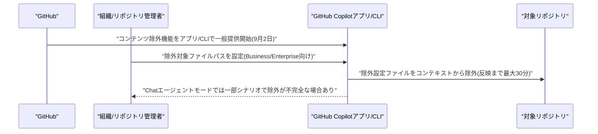

### 2.2 GitHub Copilot、エンタープライズ管理設定で任意モデルをデフォルトに指定可能に

GitHubは2026年9月2日、GitHub Copilotのエンタープライズ管理設定(enterprise-managed settings)を通じて、新規会話の既定モデルとして任意のCopilotモデルを指定できる機能を追加したと発表した。組織の利用ポリシーやコスト方針に合わせて、管理者が全社的なデフォルトモデルを一括設定できるようになる。

さらに、エンタープライズ内のチームごとに異なるデフォルトモデルを割り当てるカスタマイズにも対応しており、チームメンバーシップに応じてユーザーへ表示される既定モデルを出し分けることが可能になった。エージェント運用におけるモデル選択のガバナンスを、個々の利用者任せではなく組織側で統制する動きの一環である。[[2]](#ref-2)

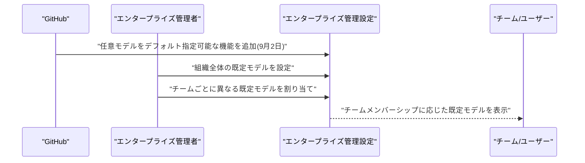

### 2.3 Microsoft Agent Framework(Python)がv1.17.0にアップデート

Microsoftは2026年9月3日、オープンソースのAIエージェント開発フレームワーク「Microsoft Agent Framework」のPython版バージョン1.17.0をリリースした。Foundryホスト型デプロイ向けにエンドツーエンドのTelegramエージェントサンプルを追加したほか、Agent Serverのモデル履歴選択機能を強化し会話リプレイ時の意図しない履歴混同を防止した。

OpenAI SDK 3.x系への対応も追加され後方互換性は維持、Mistral連携クライアントは公式Mistral SDKへ移行した。またプロバイダー側の拒否応答・OAuth同意応答・関数呼び出し承認が、履歴保存・リプレイ・ホスティング・UI変換の各処理をまたいで正しく保持されるよう修正されており、エージェント運用基盤としての細部の信頼性が積み上げられている。[[3]](#ref-3)

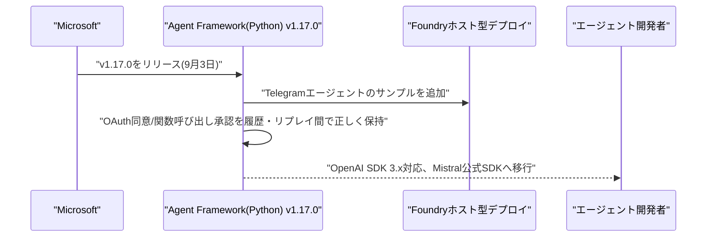

---

## 3. LLM Model / AI Agentアーキテクチャ・研究

### 3.1 MASkills:マルチエージェントLLMシステムのための継続的スキル最適化

Huaiyuan Yao、Xiaoou Liu、Charles Fleming、Tianlong Chen、Hua Weiらは2026年9月2日頃、論文「MASkills: Continual Skills Optimization for Multi-Agent LLM Systems」をarXivに公開した。マルチエージェントLLMシステムが対話経験から継続的に改善する際、従来の自己内省(self-reflection)手法が構築する「経験メモリ」は、呼び出し・洗練・スケールが難しいという課題を抱えている点に着目している。

本論文は、いつ・どのように行動し、どのツールやリソースを使うべきかを規定する構造化された手続き的知識である「エージェントスキル」を、より実用的な学習単位として提案する。新しいエージェント最適化パイプライン「MASkills」は、スキル条件付きクレジット割当、階層的クレジット集約、モメンタム平滑化最適化を統合し、スキルライブラリが精緻化・帰納・統合・剪定を通じて進化する仕組みを実現した。HotpotQA、LoCoMo、GAIAでの実験を通じてその有効性を実証しており、マルチエージェントシステムの「経験の蓄積のしかた」自体をアーキテクチャとして再設計する研究として注目される。[[4]](#ref-4)

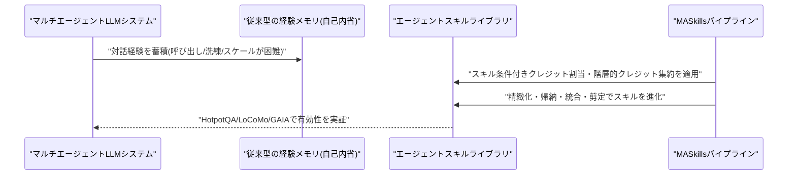

### 3.2 HEART:ツールプリミティブによるハーネスエンジニアリング

Haibo Jin、Suijin Wang、Xucheng Yu、Haojing Luo、Haohan Wangらは2026年9月1日頃、論文「Harness Engineering in LLM Tool Use via Agent-Native Reusable Tool Primitives」をarXivに公開した。外部ツールを利用するLLMエージェントには、ツール出力形式やAPIスキーマの不整合による多段階・多ターン推論の脆弱さと、大規模なツールカタログ下での性能劣化という2つの課題があると指摘する。

本研究は、硬直的なAPIスキーマベースの呼び出しを、自然言語をインターフェースとする「Tool Primitives」に置き換える設計を提案する。各ツールをLLMインターフェースでラップしてスキーマ解決と実行を内部化することで、ネストした多ターンのツール間通信を可能にした。さらにPlanner・Router・Verifierの3要素から成るハーネスエンジニアリングフレームワーク「HEART」を提案し、動的なツール呼び出し計画・多段階実行・フィードバック駆動のリカバリを実現している。ツール利用型エージェントの「ハーネス」そのものを設計対象とする、近年のエージェントアーキテクチャ研究の潮流を反映した内容である。[[5]](#ref-5)

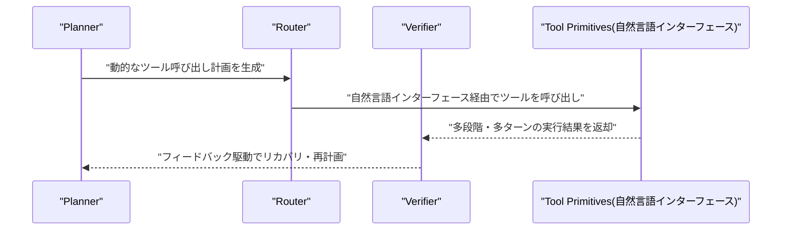

### 3.3 二層協調内省:マルチエージェントLLMシステムへのゲーム理論的アプローチ

Yihang Chen、Yuxiang Chen、Yuxuan Huang、Meng Fang、Weilin Luo、Jun Wangらは2026年9月2日頃、論文「Bilevel Coordinated Reflection: A Game-Theoretic Approach to Multi-Agent LLM Systems」をarXivに公開した。オーケストレータがタスクをワーカーチームに分解し、テキストによる内省(reflection)を通じて改善するマルチエージェントLLMシステムについて、協調・メモリ改善・外部検証の役割を統一的に説明する理論的枠組みが不足している点を課題としている。

本論文はオーケストレータとワーカー間の相互作用を「二層(bilevel)協調ゲーム」としてモデル化し、結合が有界であればワーカーの局所更新ゲームが近似ポテンシャルゲームとなり、その均衡のずれがタスク分解の品質によって制御されることを示した。また自由形式の内省を意味的メモリ状態上の確率的遷移として解析し、有限時間での収束上界を導出・最悪ケースでのタイト性を証明した。さらに「観測可能な生成テキストのみに基づく検証ゲートは、テキスト識別不能な環境間では一様に性能を改善できない」という情報理論的な不可能性結果も示しており、マルチエージェントの「内省による自己改善」に理論的な限界を突きつける内容として興味深い。[[6]](#ref-6)

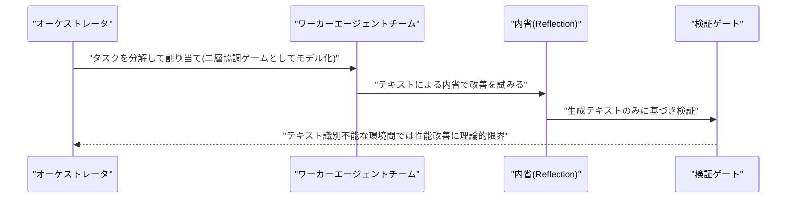

---

## 4. 公式ブログ・論文のリサーチ・要約

### 4.1 OpenAI、「GPT-6 Astra」を正式公開、ブロックマン氏は「AGI時代へようこそ」と表現

OpenAIは2026年9月3日、コンピュータ操作エージェント機能を搭載した新モデル「GPT-6 Astra」を正式にローンチした。発表の場で社長グレッグ・ブロックマン氏は「Welcome to the AGI era(AGI時代へようこそ)」と述べ、「後から振り返れば、AGIが実現したのはこのモデルだったと言うことになるかもしれない」と発言した。Astraはブラウザ・表計算・Webページ・デスクトップアプリを人間同様に操作する「コンピュータ使用エージェント」機能を中核とし、税務申告書の作成、ゲーム開発、建築レンダリング、法務メモ作成、賃貸物件検索といった実務タスクの遂行力をデモした。テキサス州StargateのGPU10万基超を用いた、OpenAI史上最大規模の学習実行(training run)から生まれたモデルだという。

ベンチマークでは、ARC-AGI-3で専用の「Provider Adapterハーネス」使用時に99.9%(標準ハーネスでは62.7%)、コンピュータ操作ベンチマークOSWorld 2.0で72.6%(前モデルGPT-5.6 Solの65.7%を上回り、タスク所要時間は約47%短縮)、FrontierMath Tier 4で97.6%、攻撃コード開発力を測るExploitBenchで満点の100%を記録した。この高いサイバー能力により、OpenAI自身のPreparedness Frameworkにおいて初めて「Critical」レベルのサイバーセキュリティ能力に到達したと判定され、チェックポイント暗号化や思考過程(CoT)を含む全軌跡の監視強化など、社内の高度な安全対策が初めて発動した。一般提供版はエクスプロイトのPoC作成などサイバー攻撃関連の高度なリクエストを拒否する設計とされ、審査制プログラム「Daybreak」参加組織への先行提供を経て、数日以内にChatGPT Plus/Pro/Business/Enterprise、OpenAI API、Codex、AWS(Bedrock)経由でも順次利用可能になる。価格は入力100万トークンあたり10ドル・出力50ドル(キャッシュ入力1ドル・キャッシュ書き込み12.50ドル)。[[7]](#ref-7) [[8]](#ref-8) [[9]](#ref-9) [[10]](#ref-10) [[11]](#ref-11) [[12]](#ref-12)

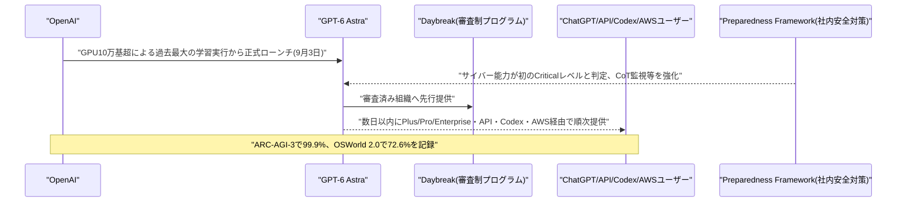

---

## 5. AI Agent搭載SaaS製品情報

### 5.1 AIセキュリティのHiddenLayer、シリーズBで1億ドル調達

AIセキュリティ企業HiddenLayer(米オースティン)は2026年9月2日、Delta-v Capital主導のシリーズBラウンドで1億ドルを調達したと発表した。Ten Eleven Ventures、Morgan Stanley、Microsoft傘下M12、Booz Allen Venturesなどが参加し、創業以来の累計調達額は約1億5000万ドル超となった。同社のARR(年間経常収益)は過去12カ月で10倍超に成長し、新規顧客50社以上を獲得したという。

調達資金は、AIエージェントの実行時挙動を保護する「Agentic Runtime Security」、およびClaude Code・CursorなどAIコーディングエージェントを保護する「Agent Harness Security」製品の拡張に充てられる。エンタープライズがAIエージェントの実運用を拡大するのに合わせ、ランタイム保護・ハーネス保護への投資家の評価が急速に高まっていることを示す事例である。[[13]](#ref-13) [[14]](#ref-14) [[15]](#ref-15)

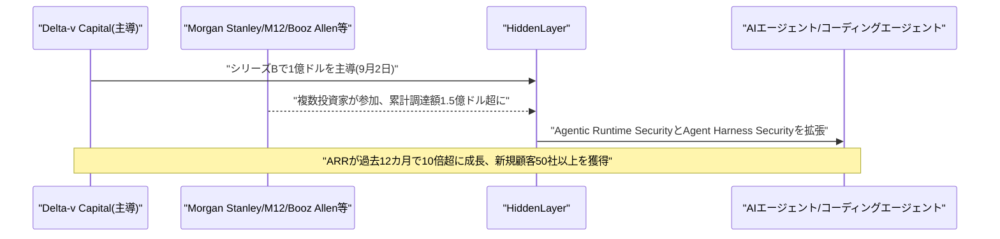

### 5.2 JetStream、AIエージェントの行動を事前承認する「Clearance」を発表

セキュリティ企業JetStreamは2026年9月2日、AIエージェントの各アクションを実行前に評価・承認する推論エンジン「JetStream Clearance」を発表した。JetStream AI Gatewayを通過する全リクエストについて、要求元のエージェントやユーザー、承認済みの設計、呼び出すツール、実行内容の対応関係をマッピングし、データ持ち出しパターンのような危険なシーケンスを事後検知ではなく実行前にブロックする。

AIエージェントの予算執行やAPI利用が本番運用へと移行するなかで、暴走エージェントによる不正操作を未然に止める新しい制御カテゴリーとして位置づけられている。従来型の事後ログ監視・異常検知とは異なり、行動そのものを「許可される前提」から「都度承認が必要な前提」へ転換する思想が特徴である。[[16]](#ref-16) [[17]](#ref-17)

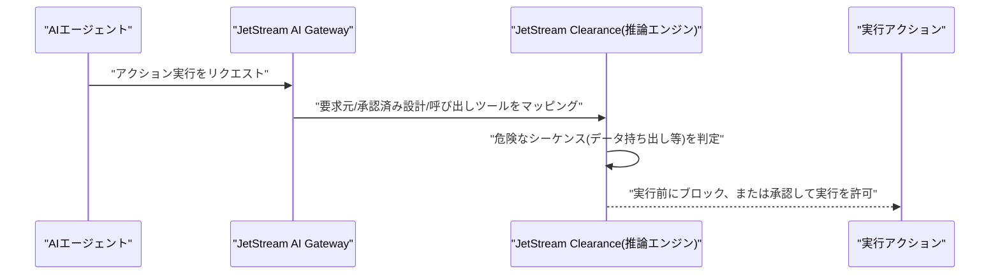

### 5.3 独Atira、産業向け見積自動化AIエージェントに1750万ドル調達

ミュンヘン拠点のAtiraは2026年9月3日、Accel主導のシード資金1500万ドルを調達したと発表した。既発表の未公開プレシード250万ドルと合わせ総額1750万ドルとなる。UVC Partners、Fortino、BOOOMに加え、Whirlpool CEOのMarc Bitzer氏、Celonis共同CEOのBastian Nominacher氏ら個人投資家も参加した。

同社は、産業企業が顧客要求を技術的に実現可能な見積書へ変換する「セールスエンジニアリング」業務(世界で年間1280億ドル規模と試算)を、マルチエージェントシステムで自動化するプロダクトを提供している。2025年の商用ローンチ以降15社以上の顧客を獲得し、うち5社では100ユーザー超が本番利用中だという。バックオフィス業務の中でも専門性が高く自動化が遅れていた領域に、マルチエージェント型AIが実運用レベルで浸透し始めている事例である。[[18]](#ref-18) [[19]](#ref-19)

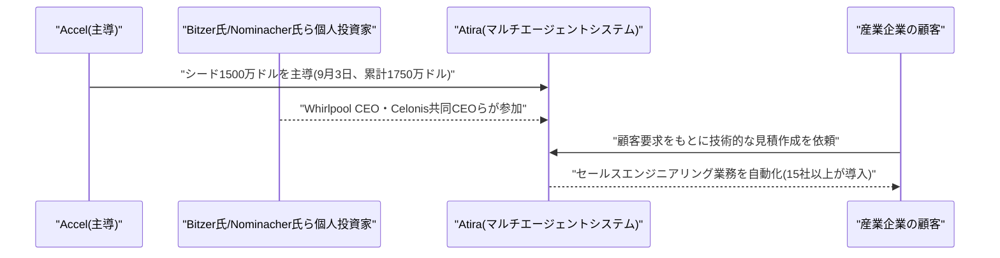

---

## 6. LLM/AI Agentセキュリティインシデント

### 6.1 JFrog Artifactoryの認証バイパス脆弱性、悪用確認でCISA KEVに追加

セキュリティ企業watchTowr等の報告を受け、CISA(米サイバーセキュリティ・インフラセキュリティ庁)は2026年9月2日、ソフトウェアサプライチェーン管理基盤JFrog Artifactoryの認証バイパス脆弱性(CVE-2026-82329、CVSS 9.8)を、実際に悪用が確認された脆弱性カタログ「KEV」に追加した。脆弱性自体は8月28日にJFrogが公表・パッチを提供済みだったが、公開からわずか72時間程度で実悪用が始まったとされる。

未認証の攻撃者がネットワーク経由で管理者権限トークンを生成できる欠陥で、攻撃者は実際に管理者トークンを生成し、ユーザー・グループ・認証情報・フェデレーションアクセス関係を列挙していたことが確認された。一部の攻撃では永続的な管理アクセスを確保するためのバックドアユーザー作成も観測されている。CISAは米連邦機関に9月5日までの修正を義務付けた。Artifactoryはコンテナイメージやオープンソースモデルの配布パイプラインを含むソフトウェアサプライチェーンの中核に位置するため、AI開発基盤への波及リスクも指摘されている。[[20]](#ref-20) [[21]](#ref-21) [[22]](#ref-22)

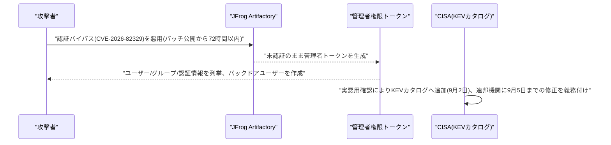

### 6.2 LiteLLMのMCPゲートウェイに認証バイパス脆弱性、CISA KEVに追加

CISAは2026年9月2日、LLMプロキシ/ゲートウェイとして広く使われるオープンソース製品「LiteLLM」の認証バイパス脆弱性(CVE-2026-59822、CVSS 8.8)をKEVカタログに追加した。原因はMCP(Model Context Protocol)のStreamable HTTPエンドポイントにおけるOAuth2パススルーのフォールバック処理にあり、未認証の攻撃者が任意のBearerトークンを用いて認証済みMCPセッションを確立できる欠陥だった。v1.84.0で修正済みである。

CISAは同日、SonicWall、Artifactory(前掲6.1)、Switchvox、Starlette、Kestraなど計7件の脆弱性をまとめてKEVに追加しており、攻撃者はこれらを組み合わせてリバースシェルの展開や認証情報窃取、暗号資産マイニングなどの追撃を行っていると報告されている。多くの企業でLLMアプリケーションとMCPサーバー間のゲートウェイとして利用されるLiteLLMの脆弱性は、AIエージェント基盤全体への影響範囲が広いという点で注目に値する。[[23]](#ref-23) [[24]](#ref-24)

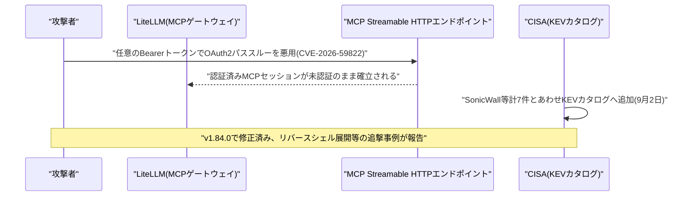

### 6.3 GUI操作型AIエージェント「Agent-S」にDoS脆弱性3件

2026年9月3日、GUI操作型AIエージェントフレームワーク「Agent-S」(simular-ai製、v0.3.2以前)のOCR HTTP APIコンポーネントに複数のサービス拒否(DoS)脆弱性が公開された。`ocr_server.py`の`ImageData`関数が受け取る`img_bytes`引数を操作することでリソース枯渇を引き起こせる脆弱性(CVE-2026-84886、CVSS 6.9)のほか、関連する2件のDoS脆弱性(CVE-2026-84885、CVE-2026-84887)も報告されている。

いずれも認証不要でリモートから攻撃可能である。エクスプロイトは既に公開されているが、開発元は早期の連絡に応答しておらずパッチ提供状況は不明である。GUI操作(コンピュータ使用)型のAIエージェントフレームワークが広く使われ始めるなか、その周辺コンポーネント(OCR等の補助API)がまだ十分な堅牢性を備えていない実態を示す事例といえる。[[25]](#ref-25) [[26]](#ref-26) [[27]](#ref-27)

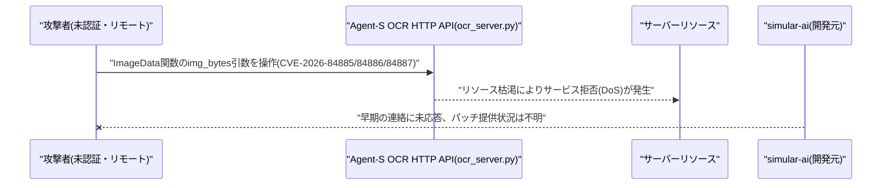

---

## 7. その他特筆すべき情報

### 7.1 NVIDIA、Hugging Faceを129億ドルで買収

NVIDIAは2026年9月3日、オープンソースAIモデル配布プラットフォーム「Hugging Face」を約129億ドル(株主への支払い約119億ドル、従業員向けリテンション報酬約10億ドル)で買収する最終契約を締結したと正式発表した。契約自体は9月2日付。Hugging Faceは300万件のモデル、100万件のアプリケーション、50万件のデータセットをホストし、1800万人の開発者が利用するプラットフォームであり、買収額はNVIDIAにとって2025年末のGroq資産買収(200億ドル)に次ぐ過去2番目の規模となる。

取引は2027年前半の完了を予定し、規制当局の承認が条件となる。NVIDIAのCEOジェンスン・フアン氏は、Hugging Faceが引き続きオープンソース・オープンウェイトモデルを支援し、開発者アクセスの拡大に取り組むと表明した。計算インフラ(GPU)とモデル配布プラットフォームの両方をNVIDIAが握ることになるため、独占禁止規制上の注目を集める可能性が指摘されている。[[28]](#ref-28) [[29]](#ref-29) [[30]](#ref-30)

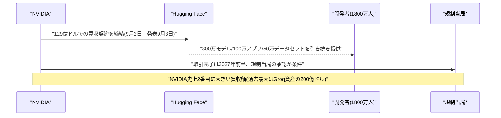

### 7.2 OpenAI・Anthropic・xAIで大規模同時障害が発生

2026年9月3日、米東部時間午前10時30分〜11時頃、ChatGPT(OpenAI)、Claude(Anthropic)、Grok(xAI)がほぼ同時にサービス障害を起こした。障害検知サービスDowndetectorには米国内でChatGPTに35,000件超、Claudeに1,400件、Grokに1,200件超の障害報告が寄せられ、これらのモデルAPIに依存するCursorなど開発者向けサービスも連鎖的にダウンした。

OpenAIはChatGPTとCodexでのエラー率上昇を調査中と発表し、AnthropicはOpus 4.8/Opus 5を中心に一部モデルで障害が発生したと説明した。3社の障害が同時期に重なった原因が共通のインフラ(クラウド事業者やネットワーク)にあるのかは明らかになっていないが、コーディング・リサーチ・コンテンツ生成といった業務をAIに依存する企業の広範な業務混乱を招いた。主要フロンティアモデルへの依存が特定少数のプロバイダーに集中していることのリスクを改めて浮き彫りにした出来事である。[[31]](#ref-31) [[32]](#ref-32)

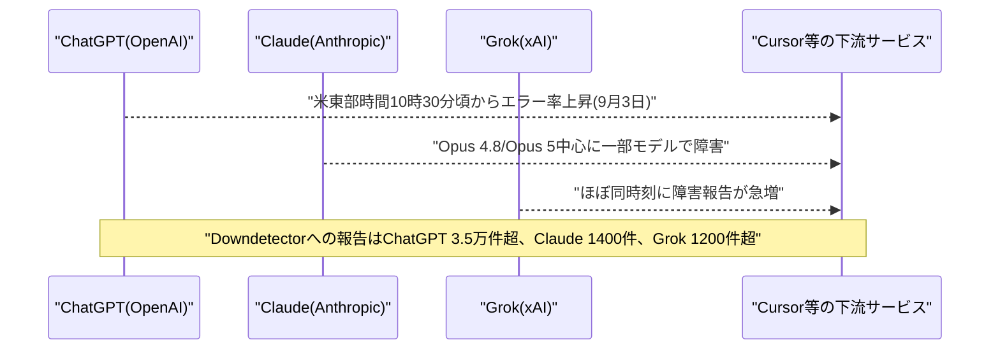

### 7.3 サム・アルトマン氏「AI業界は恩恵を伝えるのに失敗した」と発言

OpenAIのCEOサム・アルトマン氏は2026年9月3日、Bloomberg Televisionのインタビューで、AI業界全体が技術のメリットを伝えることに「ひどく失敗している(done a terrible job)」と述べた。「世界を滅ぼす」「大量の雇用が失われる」といったリスクに関する議論に業界が多くの時間を割いてきた一方、AIがもたらす恩恵やリスク低減策の説明が不足しており、これが世界各地でのAI反発(バックラッシュ)を招く一因になっていると警告した。

同氏は「我々自身も下手だった。他社よりはましかもしれないが、他よりは悪い部分もある」と自社の姿勢についても認めた。GPT-6 Astraの発表(前掲4.1)と同日のインタビューであり、AGI級と位置づけるモデルを世に出すタイミングで、業界トップ自らが世論とのコミュニケーション不足を公に認めた発言として注目される。[[33]](#ref-33) [[34]](#ref-34)

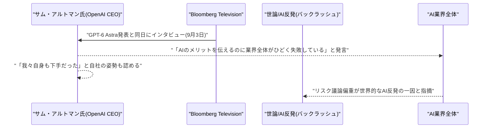

---

## 8. 参考リンク

**[1]** [Content exclusions generally available in Copilot app and CLI | GitHub Changelog](https://github.blog/changelog/2026-09-02-content-exclusions-generally-available-in-copilot-app-and-cli/)

**[2]** [Enterprise managed settings support any default model | GitHub Changelog](https://github.blog/changelog/2026-09-02-enterprise-managed-settings-support-any-default-model/)

**[3]** [Release python-1.17.0 · microsoft/agent-framework | GitHub](https://github.com/microsoft/agent-framework/releases/tag/python-1.17.0)

**[4]** [MASkills: Continual Skills Optimization for Multi-Agent LLM Systems | arXiv:2609.02094](https://arxiv.org/abs/2609.02094)

**[5]** [Harness Engineering in LLM Tool Use via Agent-Native Reusable Tool Primitives | arXiv:2609.01736](https://arxiv.org/abs/2609.01736)

**[6]** [Bilevel Coordinated Reflection: A Game-Theoretic Approach to Multi-Agent LLM Systems | arXiv:2609.02750](https://arxiv.org/abs/2609.02750)

**[7]** [The path to Astra | OpenAI](https://openai.com/index/path-to-astra/)

**[8]** [GPT-6 Astra system card and safety overview | OpenAI](https://openai.com/index/safety-overview-gpt-6-astra/)

**[9]** [Astra: ARC-AGI-3 results | ARC Prize](https://arcprize.org/blog/astra)

**[10]** [Welcome to the AGI era: OpenAI launches GPT-6 Astra | Axios](https://www.axios.com/2026/09/03/openai-astra-gpt-6-agi-brockman)

**[11]** [OpenAI's Astra reaches Critical cyber capability, triggers new safeguards | CNBC](https://www.cnbc.com/2026/09/03/open-ai-astra-gpt-6-cyber.html)

**[12]** ["Welcome to the AGI era": OpenAI launches GPT-6 Astra | VentureBeat](https://venturebeat.com/technology/welcome-to-the-agi-era-openai-launches-gpt-6-astra)

**[13]** [HiddenLayer nabs $100M as enterprises rush to secure their AI deployments | TechCrunch](https://techcrunch.com/2026/09/02/hiddenlayer-nabs-100m-as-enterprises-rush-to-secure-their-ai-deployments/)

**[14]** [HiddenLayer Raises $100M Series B to Advance Trustworthy AI | PR Newswire](https://www.prnewswire.com/news-releases/hiddenlayer-raises-100m-series-b-to-advance-trustworthy-ai-302867783.html)

**[15]** [HiddenLayer Raises $100 Million for AI Runtime Security | SecurityWeek](https://www.securityweek.com/hiddenlayer-raises-100-million-for-ai-runtime-security/)

**[16]** [JetStream Launches Verified MCP Governance Layer for Enterprise AI | Newswire](https://www.newswire.com/news/jetstream-launches-verified-mcp-governance-layer-for-enterprise-ai-22824752)

**[17]** [JetStream Announces Clearance, an AI Zero Trust Reasoning Engine | PR-Inside](https://www.pr-inside.com/jetstream-announces-clearance-an-ai-zero-trust-reasoning-engine-r5218694.htm)

**[18]** [Exclusive: German AI startup Atira raises $17.5 million to unclog the paperwork bottleneck in industrial dealmaking | Fortune](https://fortune.com/2026/09/03/exclusive-german-ai-startup-atira-raises-17-5-million-to-unclog-the-paperwork-bottleneck-in-industrial-dealmaking/)

**[19]** [Atira sammelt 15 Millionen Dollar für KI-Agenten im industriellen Vertrieb ein | Startbase](https://www.startbase.com/news/atira-sammelt-15-millionen-dollar-fuer-ki-agenten-im-industriellen-vertrieb-ein)

**[20]** [Critical JFrog Artifactory Vulnerability Reportedly Exploited in the Wild | SecurityWeek](https://www.securityweek.com/critical-jfrog-artifactory-vulnerability-reportedly-exploited-in-the-wild/)

**[21]** [Hackers Exploit Critical JFrog Artifactory Flaw to Forge Admin Tokens | BleepingComputer](https://www.bleepingcomputer.com/news/security/hackers-exploit-critical-jfrog-artifactory-flaw-to-forge-admin-tokens/)

**[22]** [Attackers Pounce on Critical Artifactory Flaw After Disclosure | Dark Reading](https://www.darkreading.com/application-security/attackers-pounce-critical-artifactory-flaw-disclosure)

**[23]** [CVE-2026-59822 | LiteLLM Security Advisory | GitLab Advisory Database](https://advisories.gitlab.com/pypi/litellm/CVE-2026-59822/)

**[24]** [CISA Adds Seven Exploited Flaws as Attackers Deploy Reverse Shells and Crypto Miners | Hendry Adrian](https://www.hendryadrian.com/cisa-adds-seven-exploited-flaws-as-attackers-deploy-reverse-shells-and-crypto-miners/)

**[25]** [CVE-2026-84886: Resource Consumption in simular-ai/Agent-S | OffSeq Radar](https://radar.offseq.com/threat/cve-2026-84886-resource-consumption-in-simular-ai-agent-s-fcab4451a999b867)

**[26]** [CVE-2026-84885: Denial of Service in simular-ai/Agent-S | OffSeq Radar](https://radar.offseq.com/threat/cve-2026-84885-denial-of-service-in-simular-ai-agent-s-4a8d6083ab328bfa)

**[27]** [CVE-2026-84887: Denial of Service in simular-ai/Agent-S | OffSeq Radar](https://radar.offseq.com/threat/cve-2026-84887-denial-of-service-in-simular-ai-agent-s-d72a25d453815b8d)

**[28]** [NVIDIA confirms it will buy Hugging Face for $12.9 billion | TechCrunch](https://techcrunch.com/2026/09/03/nvidia-confirms-it-will-buy-hugging-face-for-12-9-billion/)

**[29]** [NVIDIA agrees to buy Hugging Face for almost $13 billion in AI expansion | CNBC](https://www.cnbc.com/2026/09/03/nvidia-agrees-to-buy-hugging-face-for-almost-13-billion-ai-expansion.html)

**[30]** [NVIDIA Corporation Form 8-K | U.S. Securities and Exchange Commission](https://www.sec.gov/Archives/edgar/data/0001045810/000104581026000078/nvda-20260902.htm)

**[31]** [OpenAI, Anthropic, SpaceX's xAI hit by outages | Yahoo Finance](https://finance.yahoo.com/technology/ai/articles/openai-anthropic-spacexai-hit-outages-153529608.html)

**[32]** [Major AI Platforms Go Down in Unprecedented Simultaneous Outage | MacDailyNews](https://macdailynews.com/2026/09/03/major-ai-platforms-go-down-in-unprecedented-simultaneous-outage/)

**[33]** [Sam Altman Says AI Industry Has Failed To Explain Its Benefits | Free Press Journal](https://www.freepressjournal.in/tech/sam-altman-says-ai-industry-has-failed-to-explain-its-benefits-warns-fear-of-destroying-the-world-wiping-out-jobs-is-making-ai-look-terrifying)

**[34]** [OpenAI's Sam Altman just admitted he was wrong about AI | Windows Central](https://www.windowscentral.com/artificial-intelligence/openai-chatgpt/openais-sam-altman-just-admitted-he-was-wrong-about-ai)
