# LLM・AI Agent 最新情報レポート Vol.129
<!-- x-summary: OpenAI、水道・電力網など重要インフラ防衛者向けに10億ドル規模のAIセキュリティ支援プログラムを発表 -->

**作成日**: 2026年9月5日(JST)
**対象期間**: 2026年9月3日〜9月5日(Vol.128との差分)

---

## 目次

1. [Google Cloudアップデート](#1-google-cloudアップデート)
   - [1.1 Google Antigravity v2.12.2、Gemini 3.8 FlashのADCアクセスをエンタープライズ向けに追加](#11-google-antigravity-v2122gemini-38-flashのadcアクセスをエンタープライズ向けに追加)
   - [1.2 Gemini Notebookの監査ログ、Workspace管理コンソールでデフォルト提供開始](#12-gemini-notebookの監査ログworkspace管理コンソールでデフォルト提供開始)
2. [Microsoft Azure AIアップデート](#2-microsoft-azure-aiアップデート)
   - [2.1 OpenAI「GPT-6 Astra」、Microsoft Foundryの限定アクセスプログラムで提供開始](#21-openaigpt-6-astramicrosoft-foundryの限定アクセスプログラムで提供開始)
   - [2.2 GitHub Copilot CLI、MCP OAuth対応強化・Windows 11タスクバー連携・サンドボックス制限強化](#22-github-copilot-climcp-oauth対応強化windows-11タスクバー連携サンドボックス制限強化)
3. [LLM Model / AI Agentアーキテクチャ・研究](#3-llm-model--ai-agentアーキテクチャ研究)
   - [3.1 MemoryLACE:メモリのライフサイクルを意識した統合とエビデンス検索](#31-memorylaceメモリのライフサイクルを意識した統合とエビデンス検索)
   - [3.2 PlanFence:分散LLMエージェントメモリのための依存関係スコープ検証](#32-planfence分散llmエージェントメモリのための依存関係スコープ検証)
   - [3.3 DoPR:効率的なLLMリランキングのための再利用可能な圧縮文書プレフィックス](#33-dopr効率的なllmリランキングのための再利用可能な圧縮文書プレフィックス)
4. [公式ブログ・論文のリサーチ・要約](#4-公式ブログ論文のリサーチ要約)
   - [4.1 OpenAI、重要インフラ防衛者向けに10億ドル規模「Daybreak for Frontline Defenders」と自律防御構想「Defense Factory」を発表](#41-openai重要インフラ防衛者向けに10億ドル規模daybreak-for-frontline-defendersと自律防御構想defense-factoryを発表)
   - [4.2 Anthropic、Claude Code v2.1.260をリリース](#42-anthropicclaude-code-v21260をリリース)
   - [4.3 Google Research、雄のショウジョウバエ脳の完全なコネクトームをAIで解明](#43-google-research雄のショウジョウバエ脳の完全なコネクトームをaiで解明)
5. [AI Agent搭載SaaS製品情報](#5-ai-agent搭載saas製品情報)
   - [5.1 Adobe、アジェンティックAIマーケティングのインド発スタートアップ「Rilo」を買収](#51-adobeアジェンティックaiマーケティングのインド発スタートアップriloを買収)
   - [5.2 プライバシー重視の家庭向けAIアシスタント「Ollie」、シードで750万ドル調達](#52-プライバシー重視の家庭向けaiアシスタントollieシードで750万ドル調達)
   - [5.3 Coder、SpaceXAIをローンチパートナーに規制業界向け「Agent Relay」を発表](#53-coderspacexaiをローンチパートナーに規制業界向けagent-relayを発表)
6. [LLM/AI Agentセキュリティインシデント](#6-llmai-agentセキュリティインシデント)
   - [6.1 「GitSpawn」:Gitリポジトリの設定だけでAIコーディングエージェントに任意コード実行](#61-gitspawngitリポジトリの設定だけでaiコーディングエージェントに任意コード実行)
   - [6.2 Unit 42、AIエージェントが攻撃全工程を自律実行したランサムウェア侵害を報告](#62-unit-42aiエージェントが攻撃全工程を自律実行したランサムウェア侵害を報告)
7. [その他特筆すべき情報](#7-その他特筆すべき情報)
   - [7.1 データセンター新興企業Crusoe、評価額300億ドルで30億ドル超調達、Jane Streetと1.3兆円規模のクラウド契約](#71-データセンター新興企業crusoe評価額300億ドルで30億ドル超調達jane-streetと13兆円規模のクラウド契約)
   - [7.2 米NHTSA、テスラの無人配車車両「サイバーキャブ」に対する連邦安全性調査を開始](#72-米nhtsaテスラの無人配車車両サイバーキャブに対する連邦安全性調査を開始)
8. [参考リンク](#8-参考リンク)

---

> **今号について:** 対象期間で最も規模の大きい発表は、OpenAIが重要インフラの防衛者向けに打ち出した「Daybreak for Frontline Defenders」である。水道・電力網・地方自治体・地域銀行・非営利団体・オープンソースメンテナーなど、十分なセキュリティ予算を持たない組織に対し、自社のサイバーセキュリティモデル「Daybreak」への無償・低コストアクセスや研修支援に総額10億ドル分のクレジットを投じる内容で、攻撃能力と防御力の差である「Defender's Window」を早期に埋めることを狙う。同時に、脆弱性の発見から修正提案までを自律的に行うエージェント・ファーストのセキュリティ運用体制「Defense Factory」構想も公開しており、AI企業自身が「攻撃側の能力向上」に対する危機感を強めていることがうかがえる。
>
> 一方でその危機感を裏付けるように、セキュリティ研究者からはAIエージェントを悪用した実際の攻撃事例が相次いで報告された。Manifold Securityは、Claude Code・OpenAI Codex・Cursorなど主要7種のCLI型AIコーディングエージェントに影響する脆弱性クラス「GitSpawn」を公表し、Gitの設定ファイルを仕込んだだけでサンドボックス外の任意コード実行を許してしまう欠陥を明らかにした。またUnit 42(Palo Alto Networks)は、人間の攻撃者がフロンティアAIモデルとエージェント型攻撃フレームワークを用い、通常2週間はかかる侵入工程をわずか10時間で完了させたランサムウェア侵害事例を報告している。
>
> 製品面では、Google Antigravityへの「Gemini 3.8 Flash」ADCアクセス追加、Microsoft FoundryでのGPT-6 Astra提供開始、GitHub Copilot CLIのサンドボックス強化など、各社ともAIコーディングエージェントの「権限管理」を精緻化する方向でのアップデートが目立った。研究面では、マルチエージェントシステムのメモリ整合性(MemoryLACE, PlanFence)やRAGのコスト最適化(DoPR)を扱う論文が新たに公開されている。SaaS・資本市場では、Adobeによるアジェンティックマーケティング企業Riloの買収、データセンター新興企業Crusoeの評価額300億ドルでの30億ドル超調達など、AIエージェントの実運用拡大とそれを支えるインフラ投資が並行して進んだ対象期間となった。

---

## 1. Google Cloudアップデート

### 1.1 Google Antigravity v2.12.2、Gemini 3.8 FlashのADCアクセスをエンタープライズ向けに追加

Googleは2026年9月3日、エージェント型コーディングツール「Google Antigravity」のバージョン2.12.2を公開した。AGY Enterprise環境において、「長期的なコーディングと自律エージェント向けに設計された最も知能の高いワークホースモデル」と位置づけられる「Gemini 3.8 Flash」を、Application Default Credentials(ADC)経由で利用できるようになったことが目玉である。GEMINI_API_KEY接続時のモデルカタログにも同モデルが追加された。

このほか、`/resume`の会話ピッカーにワークスペース別グループ表示(Ctrl+Fでフラット表示に切替可能)が追加され、Markdownで定義するカスタムエージェントがデフォルトでアンビエントスキル・ルール・サブエージェントを継承する仕様に変更されたほか、1024文字を超える認可コードを返すMCP OAuth認証の不具合も修正された。エージェント運用の権限まわりの地味な改善が積み重ねられている。[[1]](#ref-1) [[2]](#ref-2)

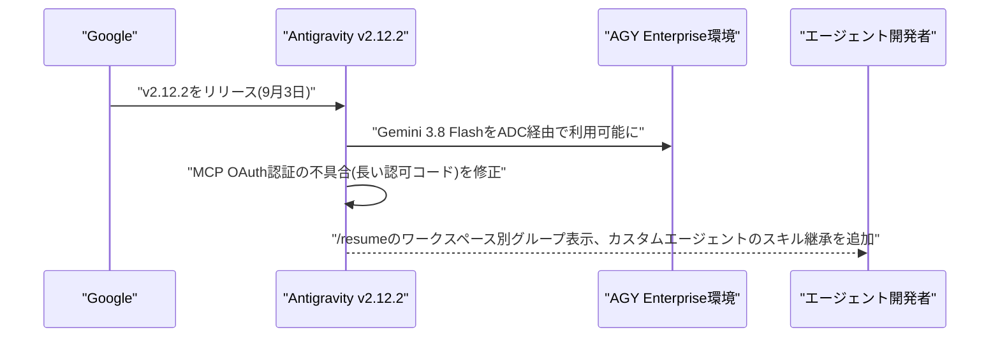

### 1.2 Gemini Notebookの監査ログ、Workspace管理コンソールでデフォルト提供開始

Googleは2026年9月3日、Google Workspace管理コンソールにおいて「Gemini Notebook」(旧NotebookLM系機能)の包括的な監査ログ機能の段階的ロールアウトを開始した。最大15日かけて全ユーザーに機能が可視化される予定で、監査ログ自体はデフォルトで有効になる一方、BigQueryへのエクスポートは管理者が別途有効化するまで無効のままとなる。

エンタープライズ利用が広がるGemini Notebookについて、誰がどの資料を参照・要約させたかを追跡できるガバナンス機能を整備する動きであり、Gemini Enterprise全体でのコンプライアンス強化の一環と位置づけられる。[[3]](#ref-3) [[4]](#ref-4)

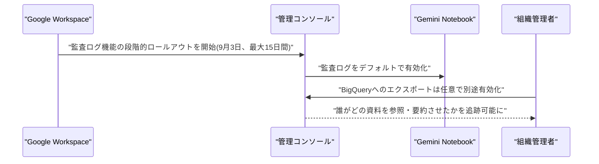

---

## 2. Microsoft Azure AIアップデート

### 2.1 OpenAI「GPT-6 Astra」、Microsoft Foundryの限定アクセスプログラムで提供開始

Microsoftは2026年9月3日、OpenAIの新フロンティアモデル「GPT-6 Astra」を、Microsoft Foundryの限定アクセスプログラム(Limited Access Program)経由でロールアウト開始したと発表した。Foundry Models上ではStandardとProvisioned Throughputの2種類のデプロイオプションが用意され、GlobalとUS Data Zoneの両リージョンで利用可能。価格は入力100万トークンあたり10ドル・出力50ドルとOpenAI版と同水準である。

Astra自体は前号既報のとおりコンピュータ操作・コーディング・リサーチ向けのエージェント機能を核とするモデルで、OpenAIは同モデルを自社基準で初めて「Critical」レベルのサイバーセキュリティ能力に到達したモデルと評価している。専用APIを持たないワークフローでも画面情報を解釈して承認済みインターフェースを操作できる「computer use」機能をFoundry経由で企業システムに組み込めるようになった点が、Azure側の実務上のポイントである。[[5]](#ref-5) [[6]](#ref-6)

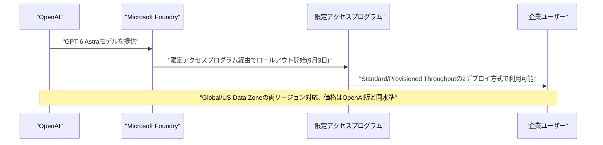

### 2.2 GitHub Copilot CLI、MCP OAuth対応強化・Windows 11タスクバー連携・サンドボックス制限強化

GitHubは2026年9月3日と4日、GitHub Copilot CLIのプレリリース版v1.0.83-4およびv1.0.83-5を相次いで公開した。v1.0.83-4ではMCP OAuthサインインにClient ID Metadata Document(CIMD)対応が追加され、セッション再開時に中断セッション復元プロンプトがデフォルトで表示されなくなった。

v1.0.83-5では、Windows 11のタスクバーに実行中のCopilotセッションをライブステータスカード付きで表示する機能が追加された一方、macOS/Linuxのサンドボックス機能が強化され、サンドボックス化されたコマンドがローカルマシン上で動作するサービスに到達できなくなった(macOSでは127.0.0.1にバインドするサーバーへの到達もブロックされるため、ローカルポートを使うテストスイートには`/sandbox`の「Allow local network」設定が必要)。同一スレッドで再入されたセッションロックがフリーズせずエラーを返すよう修正されるなど、堅牢性向上が続いている。[[7]](#ref-7) [[8]](#ref-8)

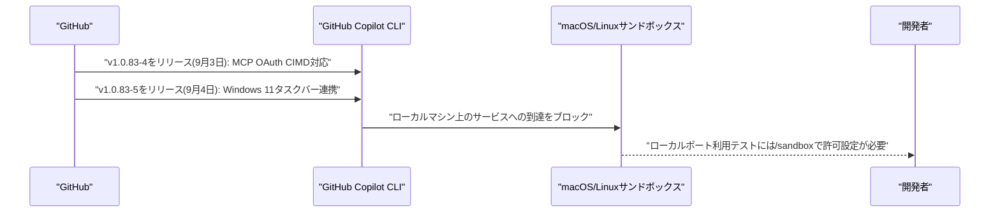

---

## 3. LLM Model / AI Agentアーキテクチャ・研究

### 3.1 MemoryLACE:メモリのライフサイクルを意識した統合とエビデンス検索

Meriem Yacoubi、Pia Schmidt、Nenad Petrovic、Ahmed Frikha、Martin Kirchhoff、Alois Knollらは2026年9月3日頃、論文「MemoryLACE: Memory Lifecycle-Aware Consolidation and Evidence Retrieval」をarXivに公開した。長期稼働するLLMエージェントは対話を跨いで情報を保持する必要がある一方、既存のテキストベースのメモリシステムは意味的に関連する記憶を検索できても、記憶同士の関係(統合・置換・矛盾)を暗黙のままにしてしまう課題があると指摘する。

提案手法「MemLACE」は、「マージ」「後継化」「矛盾」という疎な関係性を通じてテキストエビデンスのライフサイクルを明示的にモデル化する軽量なメモリフレームワークで、原子的な自然言語メモリとその出典を保持したまま、現在・過去・支持・矛盾という関係を持つ「エビデンスユニット」を再構成して下流の推論に提供する。既存手法との比較実験では、状態が変化していく構造化タスク群で精度向上が確認された。HPEC 2026(2026年9月14〜18日開催)に採択済みである。[[9]](#ref-9)

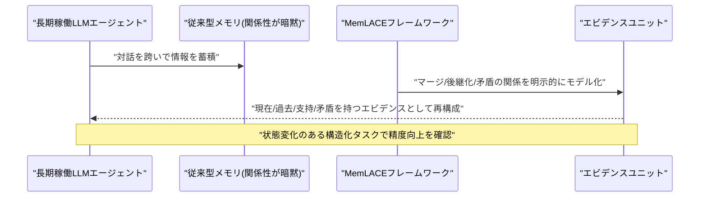

### 3.2 PlanFence:分散LLMエージェントメモリのための依存関係スコープ検証

Evan Chen、Shiqiang Wang、Christopher G. Brintonは2026年9月3日頃、論文「Fresh Memory, Stale Plans: Dependency-Scoped Validation for Distributed LLM-Agent Memory」をarXivに公開した。分散配置されたLLMエージェントチームでは、最新の事実を読み取れる状態にあっても、既に古くなったプランのまま行動してしまう「stale-plan execution」問題が起きうると指摘する。例えば、あるプランナーが要件r3から行動を導出した後、別のエージェントが要件r4をコミットしても、実行者がr3ベースの行動をそのまま実行してしまうケースである。

提案手法「PlanFence」は、プランが使用した公開レコードを明示的に引用させ、実行者が保留中の外部アクションに影響しうるレコードのみを検証し、検証が不完全な場合は再プランニングまたはブロックを行う、依存関係スコープ型のアクション検証プロトコルである。プラン策定後に要件が更新される30件の制御されたライブワークフロー実験では、freshnessのみに依拠する既存方式が全タスクで陳腐化したプランのまま実行してしまったのに対し、PlanFenceは無効なアクションを一切発生させずに全タスクを完了させた。[[10]](#ref-10)

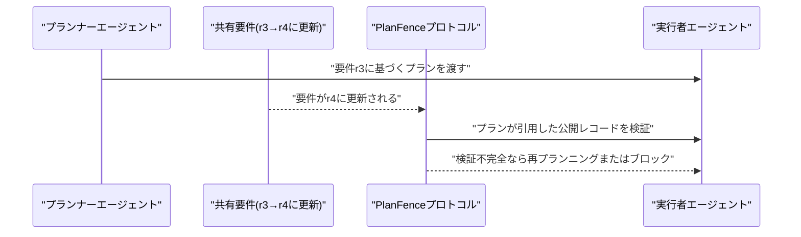

### 3.3 DoPR:効率的なLLMリランキングのための再利用可能な圧縮文書プレフィックス

Beiya Dai、Yifan Wei、Guang Yang、Xing Shi、Xinbing Wang、Zhouhan Linらは2026年9月3日、論文「DoPR: Reusable Compressed Document Prefixes for Efficient LLM Reranking」をarXivに公開した。LLMは高精度なリランカーとして機能する一方、pointwise方式のリランキングでは同一文書が異なるクエリに対して繰り返し処理され、文書側の計算が大幅に冗長化するという課題がある。

提案手法「DoPR」は、オフラインの文書処理とオンラインのリランキングを分離する圧縮文書プレフィックスフレームワークで、クエリに依存しない文書表現を選択してオフラインで圧縮済みプレフィックス状態に変換・事前計算し、文書が検索されるたびにそれを再利用する。オンラインのリランキング時にはクエリとスコアリングトークンのみを処理すればよく、文書側の圧縮とクエリ横断でのプレフィックス状態再利用の両面からコストを削減する。RAGパイプラインのリランキング段階におけるコスト・レイテンシ課題への新しいアプローチである。[[11]](#ref-11)

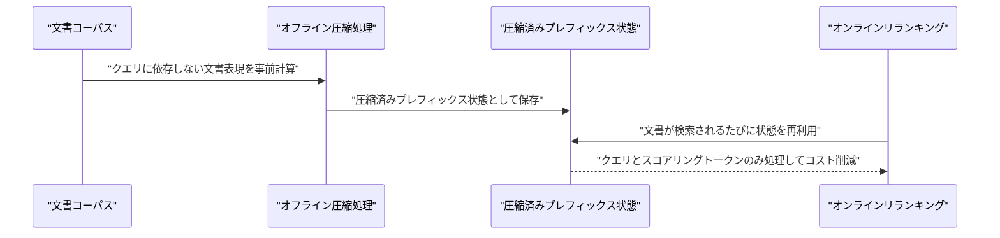

---

## 4. 公式ブログ・論文のリサーチ・要約

### 4.1 OpenAI、重要インフラ防衛者向けに10億ドル規模「Daybreak for Frontline Defenders」と自律防御構想「Defense Factory」を発表

OpenAIは2026年9月3〜4日、電力網・水道インフラ・地方自治体・地域銀行・非営利団体・オープンソースメンテナーなど、十分なセキュリティ予算を持たない「フロントライン防衛者」向けの支援プログラム「Daybreak for Frontline Defenders」を発表した。一般的な防御作業向けにOpenAIの主力モデルを使う「Daybreak Blue」と、より高度でセンシティブな作業向けに承認組織限定で提供する専門サイバーモデル「Daybreak Red」の2段構成で、総額10億ドル分のDaybreakアクセス・研修・技術支援・パートナーシップを提供する。

同時に、脆弱性の発見・検証・修正提案までを自律的に行う「エージェント・ファースト」のセキュリティ運用体制「Defense Factory」のアーキテクチャも公開した。オープンウェイトモデルなど攻撃側の能力と防御側のセキュリティ水準の差を「Defender's Window(防御側の猶予期間)」と呼び、この差が今後急速に縮小するとの危機感を背景に掲げている。Daybreak利用の全個人アカウントには、9月1日付でハードウェアセキュリティキーの導入も義務化された。[[12]](#ref-12) [[13]](#ref-13) [[14]](#ref-14)

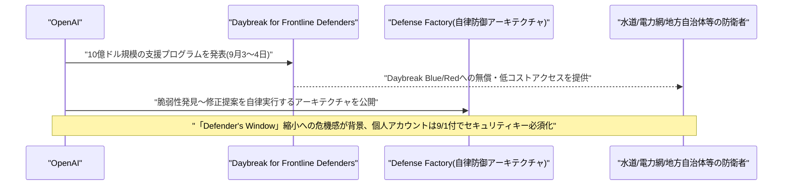

### 4.2 Anthropic、Claude Code v2.1.260をリリース

Anthropicは2026年9月3日、開発者向けCLIツール「Claude Code」のv2.1.260をリリースした。会話画面の横にフルスクリーンで開き、Claudeが編集中の未コミット変更を表示する「diffパネル」を`/diff`コマンドで追加。プロンプトキャッシュミスの原因(ツール定義やシステムプロンプトの変更、TTL超過によるアイドルなど)を`/cost`やステータスラインに表示する機能、ヘッドレスセッション向けの`/reload-plugins`なども追加された。

前バージョン(v2.1.259)でBashの引数にReadの拒否ルールが誤って適用され、通常のビルド・grepコマンドがブロックされていた不具合を修正したほか、cloud-hosted claude.aiセッションでコネクタの追加・削除時に「Claude in Chrome」ツールが「Not connected」で失敗する問題や、絵文字・アクセント文字の折り返し表示崩れなど、細かな修正も多数含まれる(累計66件のCLI変更)。[[15]](#ref-15)

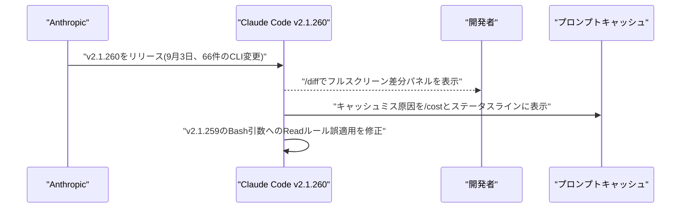

### 4.3 Google Research、雄のショウジョウバエ脳の完全なコネクトームをAIで解明

Google ResearchはJanelia Research Campus(HHMI)、MRC分子生物学研究所、ケンブリッジ大学と共同で2026年9月3日、雄のショウジョウバエの脳・視葉・腹側神経索を含む中枢神経系全体の神経回路地図(コネクトーム)を完成させたと発表した。16万6000個超のニューロンと1億2500万のシナプス結合をマッピングしており、これまでで最大規模の完全な脳地図となる。

Google Researchの研究者は、数百万枚の2D電子顕微鏡画像をAIで3Dの神経形状へ統合・再構成する手法を用いて解析を実現した。研究成果は学術誌Cellに同日付で掲載され、視覚系・味覚・社会的行動の神経科学に関する関連論文3本も同時公開された。約20年に及ぶ研究の集大成であり、AIによる大規模生物データ解析の到達点を示す事例として注目される。[[16]](#ref-16) [[17]](#ref-17)

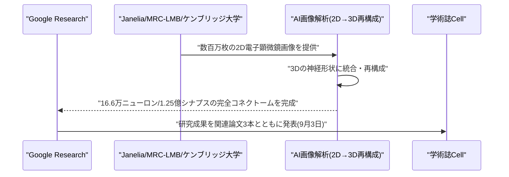

---

## 5. AI Agent搭載SaaS製品情報

### 5.1 Adobe、アジェンティックAIマーケティングのインド発スタートアップ「Rilo」を買収

Adobeは2026年9月2〜3日、インド・ムンバイ拠点のAI自動化スタートアップRiloを買収したと発表した。Riloは2025年にIIT Bombay出身のDhruv Jaglan氏とGeorgi Boby氏が創業し、Peak XV Partners、DeVC、Day Zero Venturesが出資していた。自然言語による指示だけで、競合分析、LinkedIn/Redditでのアウトリーチ、コンテンツ再利用、営業通話分析、リード獲得などのマーケティング業務を自動化するAIエージェント・ワークフローを構築できるのが特徴で、ローンチから数カ月で1万人以上のユーザーを獲得していた。

買収は知的財産のライセンス供与と6人体制のチームの移籍という形で行われ、財務条件は非公開。Rilo単体のプロダクトは今後終了し、既存顧客は利用できなくなる。AdobeにとってCanva・Anthropic・OpenAIなどとの競争が激化するマーケティングソフトウェア分野での布石であり、インドでの2件目の買収(前回は2023年のRephrase.ai)となる。[[18]](#ref-18) [[19]](#ref-19)

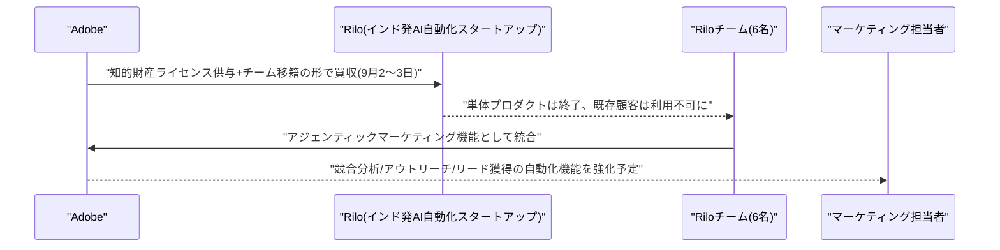

### 5.2 プライバシー重視の家庭向けAIアシスタント「Ollie」、シードで750万ドル調達

サンディエゴ拠点のOllieは2026年9月3日、Khosla VenturesとAI Houseを主要投資家とするシードラウンドで750万ドルを調達したと発表した。同社は家庭・家族向けAIアシスタントとして初めてSOC 2準拠を達成した企業の一つとされ、ユーザーデータをAI訓練目的などで第三者と共有しないサブスクリプション型ビジネスモデルを採用している。

共同創業者兼CEOのBill Lennon氏は、信頼とプライバシーが事業の中核であると説明した。競争が激化するAIアシスタント市場において、広告・データ販売に依存しない収益モデルとプライバシー保護を差別化要因に据える戦略を取っている点が特徴的である。[[20]](#ref-20)

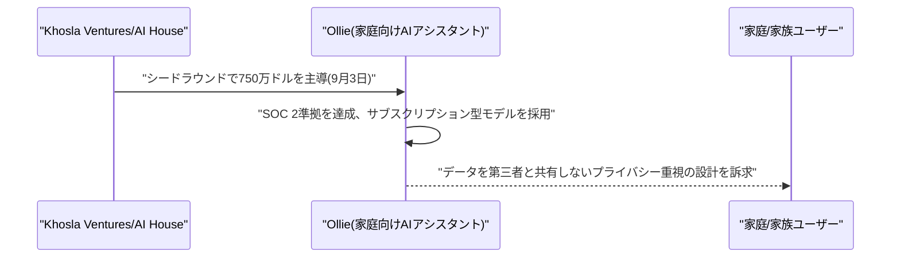

### 5.3 Coder、SpaceXAIをローンチパートナーに規制業界向け「Agent Relay」を発表

開発者向けプラットフォームのCoderは2026年9月3〜4日、Cursorのクラウドコーディングエージェントを顧客自身のインフラ上で実行できるセルフホスト型実行環境「Coder Agent Relay」を発表し、SpaceXAIをローンチパートナーとした。ソースコードや機密情報、社内システムを顧客が管理するネットワーク内に留めたまま、Cursor側が推論・計画などのエージェントループを担当する仕組みで、開発者は従来通りのCursor体験(アプリ・Web・モバイル)を利用できる。

銀行、政府機関、防衛関連など、これまでベンダーホスト型AIコーディングツールを採用できなかった規制の厳しいエンタープライズ市場の開拓を狙う。現在はデザインパートナーとの非公開プレビュー段階にある。[[21]](#ref-21) [[22]](#ref-22)

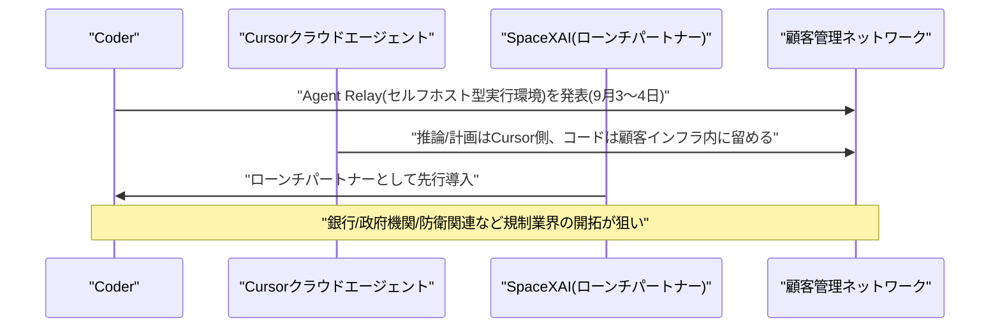

---

## 6. LLM/AI Agentセキュリティインシデント

### 6.1 「GitSpawn」:Gitリポジトリの設定だけでAIコーディングエージェントに任意コード実行

セキュリティ企業Manifold Securityは2026年9月1日、Claude Code、OpenAI Codex、Cursor、Grok Build、goose、Hermes Agent、Qwen Codeなど主要7種のCLI型AIコーディングエージェントに影響する計8件の脆弱性クラス「GitSpawn」を公表した(関連CVE: CVE-2026-19592〈OpenAI Codex〉、CVE-2026-72718〈Claude Code、CVSS 7.0〉)。攻撃者はリポジトリの`.git/config`内でGitの`core.fsmonitor`設定(ファイル変更監視用ヘルパーコマンドの指定)を悪用し、エージェントが起動時にバックグラウンドで実行する`git status`や`git diff`などの通常操作をトリガーに、サンドボックス外・ユーザー承認プロンプトなしで任意コマンドを実行させることができる。

Claude CodeとHermes Agentではワークスペース信頼プロンプトが承認される前に、Qwen Codeではユーザー認証前に、Grok Buildでは最初のキー入力時点でペイロードが発火する。攻撃には`.git`ディレクトリが保持された状態でリポジトリが渡される必要があり、共有アーカイブ・共有ドライブ・同期フォルダ・USBメモリ経由などが該当する(通常のクローンでは再現しない)。goose、Claude Code、Cursor、OpenAI Codexは修正済みだが、公開時点でHermes Agent 0.21.0、Qwen Code 0.22.3、Grok Build 1.0.13は未修正のままだった。[[23]](#ref-23) [[24]](#ref-24) [[25]](#ref-25)

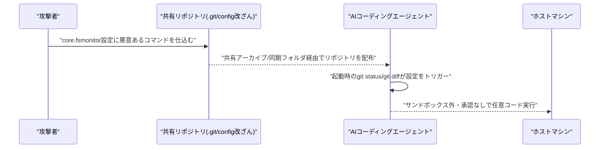

### 6.2 Unit 42、AIエージェントが攻撃全工程を自律実行したランサムウェア侵害を報告

Palo Alto NetworksのUnit 42は2026年9月2〜4日、フロンティアAIモデルとエージェント型攻撃フレームワークを用いた攻撃者が、通常は人間のレッドチームで約2週間かかる侵入工程(MITRE ATT&CK手法50種類以上)をわずか10時間で完了させたランサムウェア侵害を報告した。攻撃は公開APIエンドポイントへの侵入から始まり、偵察専門エージェントが内部マイクロサービスを自動マッピング、サブエージェント群が企業コードリポジトリ内のハードコードされたトークンやサービスパスワードを抽出、別のエージェントがシークレット管理システムに侵入してルート権限相当の管理者認証情報を奪取、さらにCI/CDパイプラインをハイジャックしクラウドアクセスキーを窃取した。

Terraform設定へのバックドア設置も試みられたが、ブランチ保護機能により阻止された。攻撃者はクラウド・ID管理・CI/CD・SaaS防御を体系的に無力化した後、被害企業に対し攻撃で使用したのと同じAIエージェントが自動生成した80ページのセキュリティ監査レポートを「置き土産」として残すという異例の展開となった。攻撃者は身代金交渉担当者に対し、フロンティアモデルとエージェント型攻撃フレームワークを使用したと説明している。[[26]](#ref-26) [[27]](#ref-27) [[28]](#ref-28)

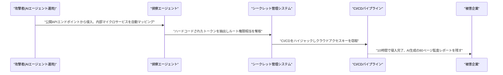

---

## 7. その他特筆すべき情報

### 7.1 データセンター新興企業Crusoe、評価額300億ドルで30億ドル超調達、Jane Streetと1.3兆円規模のクラウド契約

AI向けデータセンターを手掛ける新興企業Crusoeは2026年9月3日、Atreides ManagementとValor Equity Partnersが主導する形で30億ドル超を調達し、評価額は約300億ドルに達したとBloombergが報じた。アブダビ政府系ファンドMubadala傘下のMubadala Capitalも出資に参加し、評価額は昨年10月の100億ドルからわずか10カ月で3倍近くに急伸した。

同時期に、トレーディング大手Jane Streetとの間で5年間・総額約130億ドル規模のGPUクラウド供給契約を締結したことも判明し、Jane StreetのCoreWeave分と合わせた総クラウド委託額は約190億ドルに達した。同社は既にOpenAI、Microsoft、Meta、Oracleにもインフラを供給しており、AIインフラ需要の高まりを象徴する動きとなった。[[29]](#ref-29) [[30]](#ref-30)

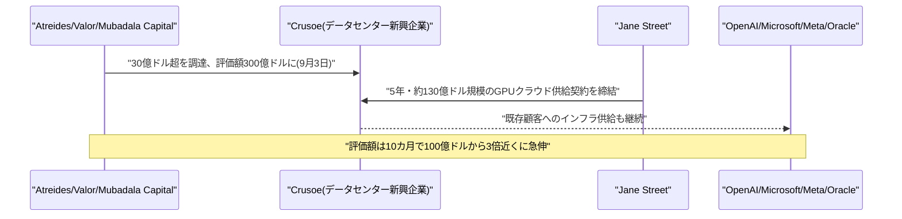

### 7.2 米NHTSA、テスラの無人配車車両「サイバーキャブ」に対する連邦安全性調査を開始

米運輸省道路交通安全局(NHTSA)は2026年9月4日、テスラがハンドルやペダルを持たない無人配車車両「サイバーキャブ」の商用展開を開始した直後に、連邦自動車安全基準(FMVSS)適合の自己認証プロセスを検証する監査照会(案件番号AQ26002)を開始したと発表した。対象は推定約1,000台のサイバーキャブで、ブレーキペダルやバックミラーなど一部の安全規則が要求する装備を車両が備えていない点が問題視されている。

同種の調査は2022年にAmazon傘下のZooxに対しても行われ、Zooxが商用認可を得るまでに4年を要した前例がある。運転操作を丸ごとAIエージェントに委ねる自律走行サービスの商用化に対し、規制当局がどこまで踏み込むかが注目される事案であり、テスラの完全無人運転(FSD)技術の展開計画にも影響を与える可能性がある。[[31]](#ref-31) [[32]](#ref-32)

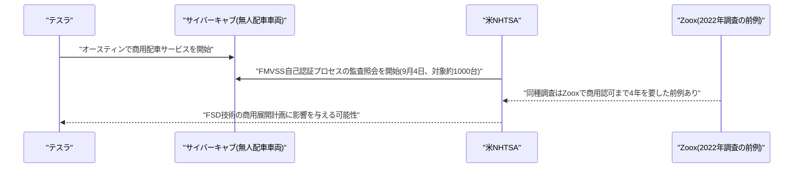

---

## 8. 参考リンク

**[1]** [Antigravity Changelog | Google Antigravity](https://antigravity.google/changelog/)

**[2]** [Google Antigravity release notes | ReleaseBot](https://releasebot.io/updates/google/antigravity)

**[3]** [Introducing comprehensive audit logs for Gemini Notebook in the Workspace Admin console | Google Workspace Updates](https://workspaceupdates.googleblog.com/2026/08/introducing-comprehensive-audit-logs-for-Gemini-Notebook-in-the-Workspace-Admin-console.html)

**[4]** [Gemini Enterprise release notes | Google Cloud Docs](https://docs.cloud.google.com/gemini/enterprise/docs/release-notes)

**[5]** [GPT-6 Astra: Frontier intelligence for work, now generally available in Microsoft Foundry | Azure Blog](https://azure.microsoft.com/en-us/blog/gpt-6-astra-frontier-intelligence-for-work-now-generally-available-in-microsoft-foundry/)

**[6]** [Microsoft brings OpenAI's GPT-6 Astra to Foundry with limited access | Unite.AI](https://www.unite.ai/microsoft-brings-openais-gpt-6-astra-to-foundry-with-limited-access/)

**[7]** [Release v1.0.83-4 · github/copilot-cli | GitHub](https://github.com/github/copilot-cli/releases/tag/v1.0.83-4)

**[8]** [Release v1.0.83-5 · github/copilot-cli | GitHub](https://github.com/github/copilot-cli/releases/tag/v1.0.83-5)

**[9]** [MemoryLACE: Memory Lifecycle-Aware Consolidation and Evidence Retrieval | arXiv:2609.03201](https://arxiv.org/abs/2609.03201)

**[10]** [Fresh Memory, Stale Plans: Dependency-Scoped Validation for Distributed LLM-Agent Memory | arXiv:2609.03340](https://arxiv.org/abs/2609.03340)

**[11]** [DoPR: Reusable Compressed Document Prefixes for Efficient LLM Reranking | arXiv:2609.03311](https://arxiv.org/abs/2609.03311)

**[12]** [The Defense Factory | OpenAI](https://openai.com/the-defense-factory/)

**[13]** [Daybreak for Frontline Defenders | OpenAI](https://openai.com/index/daybreak-for-frontline-defenders/)

**[14]** [OpenAI commits $1B in AI credits to frontline cyber defenders | The Register](https://www.theregister.com/security/2026/09/04/openai-commits-1b-in-ai-credits-to-frontline-cyber-defenders/5294382)

**[15]** [Release v2.1.260 · anthropics/claude-code | GitHub](https://github.com/anthropics/claude-code/releases/tag/v2.1.260)

**[16]** [A connectomics milestone: Mapping the complete male fruit fly brain | Google Research](https://research.google/blog/a-connectomics-milestone-mapping-the-complete-male-fruit-fly-brain/)

**[17]** [Scientists complete map of male fruit fly brain | Google Blog](https://blog.google/innovation-and-ai/technology/research/male-fruit-fly-brain-map/)

**[18]** [Adobe acquires Indian market intelligence startup Rilo | TechCrunch](https://techcrunch.com/2026/09/02/adobe-acquires-indian-market-intelligence-startup-rilo/)

**[19]** [Adobe acquires Indian AI automation startup Rilo to boost agentic push | Business Standard](https://www.business-standard.com/companies/news/adobe-acquires-indian-ai-automation-startup-rilo-to-boost-agentic-push-126090201601_1.html)

**[20]** [Ollie is betting privacy can win the AI assistant race | TechCrunch](https://techcrunch.com/2026/09/03/ollie-is-betting-privacy-can-win-the-ai-assistant-race/)

**[21]** [Coder unveils Agent Relay with SpaceXAI as launch partner | AIwire](https://www.hpcwire.com/aiwire/2026/09/04/coder-unveils-agent-relay-with-spacexai-as-launch-partner/)

**[22]** [Agent Relay: SpaceXAI launch partner for Cursor cloud agents | Coder Blog](https://coder.com/blog/agent-relay-spacexai-launch-partner-cursor-cloud-agents)

**[23]** [Malicious Git configs can make Claude, Codex, and other AI coding agents run arbitrary code | The Hacker News](https://thehackernews.com/2026/09/malicious-git-configs-can-make-claude.html)

**[24]** [GitSpawn: AI coding agents Git hijack | Manifold Security](https://www.manifold.security/blog/ai-coding-agents-git-hijack)

**[25]** [GitSpawn flaws let attackers execute code | Cybersecurity News](https://cybersecuritynews.com/gitspawn-flaws-execute-code/)

**[26]** [AI agents carried out every step of this ransomware attack then left the victim an 80-page security audit | The Register](https://www.theregister.com/security/2026/09/02/ai-agents-carried-out-every-step-of-this-ransomware-attack-then-left-the-victim-an-80-page-security-audit/5294009)

**[27]** [AI-assisted cyber attack: Inside a Unit 42 investigation | Unit 42, Palo Alto Networks](https://unit42.paloaltonetworks.com/ai-assisted-cyber-attack-inside-a-unit-42-investigation/)

**[28]** [Agentic ransomware took down enterprise in ten hours, AI left 80-page audit | DataBreaches.net](https://databreaches.net/2026/09/03/agentic-ransomware-took-down-enterprise-in-ten-hours-ai-left-80-page-audit/)

**[29]** [Crusoe raises over $3 billion in funding at $30 billion valuation | Bloomberg](https://www.bloomberg.com/news/articles/2026-09-03/crusoe-raises-over-3-billion-in-funding-at-30-billion-valuation)

**[30]** [Crusoe signs roughly $13 billion AI cloud deal with Jane Street | Bloomberg](https://www.bloomberg.com/news/articles/2026-09-03/crusoe-signs-roughly-13-billion-ai-cloud-deal-with-jane-street)

**[31]** [Feds launch investigation into Tesla's Cybercab deployment | TechCrunch](https://techcrunch.com/2026/09/04/feds-launch-investigation-into-teslas-cybercab-deployment/)

**[32]** [Investigation: Tesla Cybercab self-certification | NHTSA](https://www.nhtsa.gov/press-releases/investigation-tesla-cybercab-self-certification)
