# LLM・AI Agent 最新情報レポート Vol.132
<!-- x-summary: OpenAI、未公開次世代AIがナビエ-ストークス方程式の特異点発生を証明したと発表、数学者と功績論争に -->

**作成日**: 2026年9月8日(JST)
**対象期間**: 2026年9月7日〜9月8日(Vol.131との差分)

---

## 目次

1. [Google Cloudアップデート](#1-google-cloudアップデート)
   - [1.1 アクセンチュアとGoogle Cloud、「Gemini Enterprise Business Group」を新設](#11-アクセンチュアとgoogle-cloudgemini-enterprise-business-groupを新設)
2. [Microsoft Azure AIアップデート](#2-microsoft-azure-aiアップデート)
   - [2.1 OpenAI「GPT-6 Astra」、Microsoft Foundryで一般提供(GA)開始](#21-openaigpt-6-astramicrosoft-foundryで一般提供ga開始)
3. [LLM Model / AI Agentアーキテクチャ・研究](#3-llm-model--ai-agentアーキテクチャ研究)
   - [3.1 Compact-Memory LLM Agents:オンライン最大メンバークラスタリングとアトム認識パッキングによる圧縮メモリ](#31-compact-memory-llm-agentsオンライン最大メンバークラスタリングとアトム認識パッキングによる圧縮メモリ)
   - [3.2 マルチエージェントチームにおける「代替可能性」の実証的検証](#32-マルチエージェントチームにおける代替可能性の実証的検証)
   - [3.3 ERPBench:競争的市場エコロジーを横断した企業意思決定エージェント評価ベンチマーク](#33-erpbench競争的市場エコロジーを横断した企業意思決定エージェント評価ベンチマーク)
4. [公式ブログ・論文のリサーチ・要約](#4-公式ブログ論文のリサーチ要約)
   - [4.1 OpenAI、未公開次世代モデルがナビエ-ストークス方程式のミレニアム懸賞問題を解いたと発表、数学者との功績論争に発展](#41-openai未公開次世代モデルがナビエ-ストークス方程式のミレニアム懸賞問題を解いたと発表数学者との功績論争に発展)
   - [4.2 Google DeepMind、ヒトゲノム全変異を予測する「AlphaGenome Atlas」を公開](#42-google-deepmindヒトゲノム全変異を予測するalphagenome-atlasを公開)
5. [AI Agent搭載SaaS製品情報](#5-ai-agent搭載saas製品情報)
   - [5.1 Lightsage、AIエージェント時代の「Agent-Led Growth」基盤構築へ400万ドルを調達](#51-lightsageaiエージェント時代のagent-led-growth基盤構築へ400万ドルを調達)
   - [5.2 中国Beisen(北森)、一体型AI HRエキスパートプラットフォーム「Mavens」を発表](#52-中国beisen北森一体型ai-hrエキスパートプラットフォームmavensを発表)
   - [5.3 Buzzably、クリエイター主導型のAIコンテンツ制作エンジンをローンチ](#53-buzzablyクリエイター主導型のaiコンテンツ制作エンジンをローンチ)
6. [LLM/AI Agentセキュリティインシデント](#6-llmai-agentセキュリティインシデント)
   - [6.1 Google脅威インテリジェンス、AIエージェントが6時間未満で数千件の認証情報を窃取した自律型攻撃を報告](#61-google脅威インテリジェンスaiエージェントが6時間未満で数千件の認証情報を窃取した自律型攻撃を報告)
7. [その他特筆すべき情報](#7-その他特筆すべき情報)
   - [7.1 中国Inspur、子会社「Aivres」経由でNVIDIA製AIチップの対中輸出規制を回避していたと発覚](#71-中国inspur子会社aivres経由でnvidia製aiチップの対中輸出規制を回避していたと発覚)
8. [参考リンク](#8-参考リンク)

---

> **今号について:** 対象期間で最も衝撃的だったのは、OpenAIが公式ブログで公表した、GPT-6 Astraを上回る未公開の次世代モデルによるナビエ-ストークス方程式のミレニアム懸賞問題への「解」である。約1万体のエージェントが88時間で特異点発生の証明に到達し、GPT-6 Astraがさらに17時間かけてLeanで形式検証したとされるが、NYUの数学者やAnthropicの研究者が独自に進めていた関連研究との功績を巡る係争に発展しており、真偽・功績表示の両面で今後も検証が続く見通しである。同日、Google DeepMindもヒトゲノム全変異(約90億通り)の分子的影響を予測する無料データベース「AlphaGenome Atlas」を公開しており、基盤科学分野でのAI活用が立て続けに大きな節目を迎えた対象期間となった。
>
> セキュリティ面では、GoogleのGTIG(脅威インテリジェンスグループ)が「AI Threat Tracker」レポートで、金銭目的の攻撃者がAIエージェントを用いて侵害からわずか6時間未満で数千件規模の認証情報を窃取する自律型キャンペーンを構築していた事例を報告した。攻撃トラフィックが被害組織自身のクラウドリソースから発信されるため検知が困難だったといい、AIエージェントが攻撃側の自動化ツールとしても実運用段階に入りつつある実態が改めて示された。
>
> 製品・インフラ面では、アクセンチュアとGoogle Cloudがエージェンティックエンタープライズ市場に向けた新組織「Gemini Enterprise Business Group」を設立したほか、OpenAI「GPT-6 Astra」がMicrosoft Foundryで一般提供(GA)を迎えるなど、大手クラウドベンダーによるエージェント型AIの実装基盤整備が加速した。スタートアップでは、AIエージェント時代の製品可視化を支援するLightsageや、中国HR大手BeisenのAI HRプラットフォーム「Mavens」など、エージェントを軸とした新カテゴリの製品・資金調達も相次いだ。地政学面では、中国Inspurが子会社Aivres経由でNVIDIA製AIチップの対中輸出規制を回避していたとするニューヨーク・タイムズの調査報道も明らかになり、AI半導体を巡る規制の実効性に改めて疑問が投げかけられた対象期間だった。

---

## 1. Google Cloudアップデート

### 1.1 アクセンチュアとGoogle Cloud、「Gemini Enterprise Business Group」を新設

アクセンチュアとGoogle Cloudは2026年9月8日、既存の「Accenture Google Business Group」内に新組織「Accenture Gemini Enterprise Business Group」を設立すると発表した。エージェンティックAI時代における企業のGemini Enterprise活用を加速する狙いで、Gemini Enterprise認定を受けた専門人材と両社共同開発のAIソリューションを結集し、顧客ごとに専用のAIエージェント・アプリケーションを設計・開発する「フォワード・デプロイド・エンジニア(FDE)」を新たに1,000人規模で育成する計画である。アクセンチュアが抱えるGoogle Cloud関連スキル人材(約5万人規模)を土台に、専任チームとして立ち上げる。

事例として、動画配信のYouTubeがNFLサンデーチケットの需要急増時に、アクセンチュア・Google Cloudと協力してGemini Enterpriseエージェントを導入し、顧客対応のセンチメントを11%向上、平均対応時間(AHT)を37%短縮した実績が紹介された。アクセンチュアは2026年もGoogle Cloudの「Global Services Partner of the Year」を4年連続で受賞しており、両社の協業関係は着実に深化している。[[1]](#ref-1) [[2]](#ref-2)

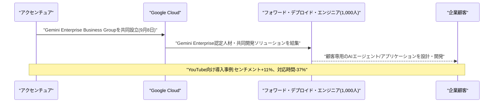

---

## 2. Microsoft Azure AIアップデート

### 2.1 OpenAI「GPT-6 Astra」、Microsoft Foundryで一般提供(GA)開始

Microsoftは2026年9月7日(米国太平洋時間)、OpenAIの最新フロンティアモデル「GPT-6 Astra」を、企業向けAI基盤「Microsoft Foundry」(旧Azure AI Foundry)のモデルカタログにおいて一般提供(GA)に切り替えた。モデル自体は9月3日からLimited Access Programとして先行提供が始まっており、9月7日付でステータスがGAへ更新された形である。同モデルはComputer Use(画面操作)機能を備え、API未対応のレガシーアプリケーションでも画面情報を解釈しながら記録更新・開発ツール操作・テスト実行・レポート作成などを自律的に遂行できる点が特徴で、企業向けAIを対話型チャットから自律的なエージェント型ワークフローへ移行させることを狙う。

価格はGlobal Standardティアで入力100万トークンあたり10ドル・出力50ドルで、Global/US Data Zoneの2種類のデプロイ先が用意される一方、EUデータゾーンは提供開始時点では未対応となっている。前号までに既報のGitHub Copilotへの追加とは別に、Microsoft Foundry・Copilot Cowork・Copilot Studioなどエンタープライズ向けAI基盤全体でのエージェント実行環境としての位置付けが今回の新規性である。[[3]](#ref-3) [[4]](#ref-4)

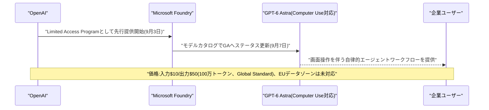

---

## 3. LLM Model / AI Agentアーキテクチャ・研究

### 3.1 Compact-Memory LLM Agents:オンライン最大メンバークラスタリングとアトム認識パッキングによる圧縮メモリ

Jiahe Geng、Jinpeng Wang、Kun Yuanは2026年9月上旬、論文「Compact-Memory LLM Agents via Online Max-Member Clustering and Atom-Aware Packing」を発表した。長時間の対話を扱うLLMエージェントは、レイテンシ・コスト・コンテキスト長の制約からフルコンテキストのプロンプトが現実的でなくなる一方、既存のメモリ圧縮手法は「想起精度」のみを最適化基準にしがちで、圧縮メモリ運用下での「品質とトークンコストのトレードオフ」を直接扱えていないという課題を指摘する。

提案手法「RSM-full」は、コサイン類似度でゲーティングした最大メンバーマージによる書き込みルールと、情報の最小単位(アトム)を意識してグループ化するコンテキストパッカーを組み合わせたオンラインのクラスタ化メモリパイプラインである。独自ベンチマーク「AMA-Bench」において、4kトークンのプロンプト予算下でフルコンテキスト手法の83%の品質を、トークンコストはわずか32%で達成し、既存のオンラインK-Meansベースの手法を3.5〜6.0ポイント上回ったと報告している。[[5]](#ref-5)

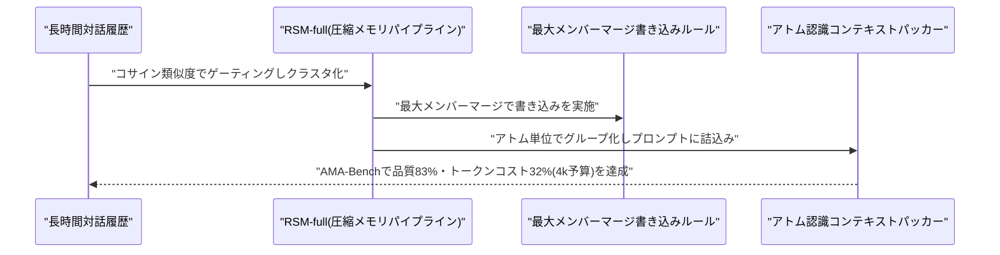

### 3.2 マルチエージェントチームにおける「代替可能性」の実証的検証

Jianxin Gaoら5名は2026年9月上旬、論文「Testing Interchangeability in LLM Agent Teams」を発表した。マルチエージェントシステムの実運用では「同じ役割を担うエージェントは別のエージェントと入れ替え可能」という暗黙の前提が置かれがちだが、本論文はこれを実証的に検証する。同一ベースモデルから独立に8チームを編成し、各エージェントが10回の形成エピソードにわたり私的なノートを保持した状態で役割の一致するエージェントをチーム間でトレードし、保持タスクでの変化を計測した。

結果、ロスター変更に伴う混乱そのものは再現しつつ担当者は変えない「プラセボ」条件と比較して、エージェントの入れ替え自体によるタスクスコアの低下はわずかである一方、チームが単位進捗あたりに費やすコミュニケーション量は16〜63%増加することが分かった。特にHanabiでは、入れ替えられたエージェントの方が経験の浅い新人エージェントよりもコストが高くつくことが示され、これは元パートナーと学習した暗黙の了解(convention)からの干渉によるものと解釈されている。[[6]](#ref-6)

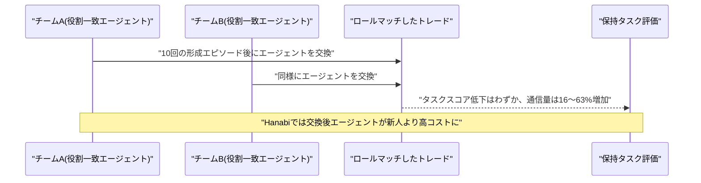

### 3.3 ERPBench:競争的市場エコロジーを横断した企業意思決定エージェント評価ベンチマーク

Xinran Zhangら4名は2026年9月上旬、論文「ERPBench: Evaluating LLM Agents for Enterprise Decision-Making Across Competitive Market Ecologies」を発表した。LLMエージェントは企業のERP(Enterprise Resource Planning)業務への応用が期待される一方、既存の評価は「競争的な市場環境が変わってもビジネス上の意思決定の結論が転移するか」をほとんど検証していないという課題意識に基づく。

価格設定・生産・調達・在庫・財務・共有市場での競争が結合した6ラウンドのERPシミュレーション上で、同一の100固定問題を「Solo」(固定ルールベースの相手と競争)と「Arena」(6体のLLMエージェントが同一市場で競争)という2種類の市場エコロジーで評価する仕組みを構築した。6モデルファミリーで合計1,200のモデルレベル軌跡・7,200の意思決定ラウンドを収集した結果、Soloでは平均評価額2億5,229万・平均順位1.67でDeepSeekが首位だったのに対し、Arenaでは平均評価額2億6,395万・平均順位1.76でGeminiが首位となり、勝者モデルが市場環境によって入れ替わることが判明した。[[7]](#ref-7)

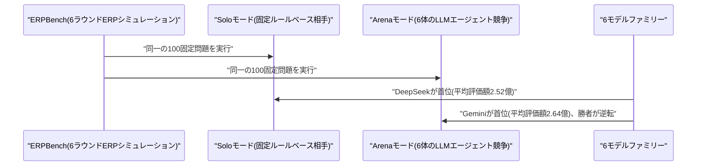

---

## 4. 公式ブログ・論文のリサーチ・要約

### 4.1 OpenAI、未公開次世代モデルがナビエ-ストークス方程式のミレニアム懸賞問題を解いたと発表、数学者との功績論争に発展

OpenAIは2026年9月8日、公式ブログ「On the Navier–Stokes Millennium Prize Problem」を公開し、GPT-6 Astraを大幅に上回る性能を持つ未公開の次世代内部モデルが、クレイ数学研究所のミレニアム懸賞問題の一つであるナビエ-ストークス方程式の存在と滑らかさ問題について、有限時間での特異点(ブローアップ)発生を示す証明を生成したと発表した。約1万体のAIエージェントを並行稼働させて開始から約88時間で解に到達し、その後GPT-6 Astraがさらに17時間をかけて定理証明支援系Leanでの形式検証を実施した。プロセス全体でエージェントは270万件のメッセージを送受信し、約1,300億の出力トークンを消費したという。

この発表は、NYUの数学者Tristan Buckmaster氏とAnthropicの研究者Levent Alpöge氏が独自に進めていた関連研究(強制オイラー方程式に関するブローアップ研究)を巡る係争に発展している。OpenAIは、両氏に関する噂を耳にして9月1日に着手し、9月6日に自社の証明とLean検証を完了した後に両氏へ共同発表を持ちかけたところ、両氏の研究はナビエ-ストークス方程式ではなく関連するが別個の「強制オイラー方程式」を扱ったものだったと判明した、と経緯を説明している。一方Buckmaster氏は証明自体をまだ確認していないと述べており、功績表示や情報の扱いを巡ってOpenAIと当事者双方の説明が食い違っている。数学界の権威ある未解決問題にAIが到達したとする主張だけに、真偽・功績の両面で検証と論争が続いている。[[8]](#ref-8) [[9]](#ref-9)

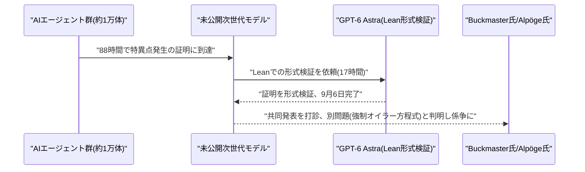

### 4.2 Google DeepMind、ヒトゲノム全変異を予測する「AlphaGenome Atlas」を公開

Google DeepMindは2026年9月8日、ヒトゲノム上で起こりうる約90億通りの一塩基変異すべてについて分子的影響を予測した無料データベース「AlphaGenome Atlas」を公開した。配列から機能を予測する自社モデル「AlphaGenome」をゲノム全域にわたって事前計算することで構築されており、データセットの規模は約1ペタバイトと、2022年に拡充したAlphaFold Databaseの30倍以上に達する。

あわせて、AlphaGenomeとAlphaMissenseの予測に保存性やタンパク質機能欠失の特徴を統合した新指標「AlphaGenome Variant Impact(AVI)」スコアも導入され、スプライシングや遺伝子発現など各要因への影響を分解して確認できる。Atlasは2026年9月8日付でWebポータル・API・エージェント型開発基盤「Google Antigravity」のスキルとして非商用の研究目的で無料公開されており、商用利用向けのGoogle Cloud経由アクセスも近日提供予定という。DeepMindは論文中で、Atlas・AVIはあくまで研究ツールであり臨床診断のための十分な証拠にはならず、臨床用途としての検証・承認も受けていないと明記している。[[10]](#ref-10) [[11]](#ref-11)

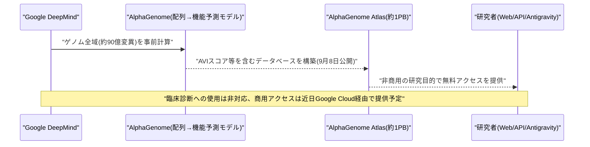

---

## 5. AI Agent搭載SaaS製品情報

### 5.1 Lightsage、AIエージェント時代の「Agent-Led Growth」基盤構築へ400万ドルを調達

サンフランシスコ拠点のスタートアップLightsageは2026年9月8日、Nexus Venture Partnersが主導するシードラウンドで400万ドルを調達したと発表した。Claude CodeやCodex、Cursorなどのコーディングエージェントがソフトウェアを発見・評価・導入する時代の到来を見据え、ソフトウェア企業が自社製品を「AIエージェントの視点」から可視化・最適化する「Agent-Led Growth(ALG)」プラットフォームを提供する。

複数のコーディングエージェントやアンサーエンジン上でシミュレーションを実行し、ドキュメントの分かりにくさ・APIの不具合・MCPサーバーとの非互換性など、エージェントが製品を使いこなせない原因を診断する仕組みが特徴。ラウンドには元Salesforce CTOのSteven Tamm氏、Postman CEOのAbhinav Asthana氏、Docusign社長のRobert Chatwani氏ら業界関係者が個人投資家として参加し、Reducto、Daytona、Firecrawl、Rime、Tinyfishなど複数のソフトウェア企業が既にプラットフォームを利用しているという。[[12]](#ref-12) [[13]](#ref-13)

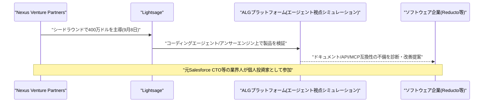

### 5.2 中国Beisen(北森)、一体型AI HRエキスパートプラットフォーム「Mavens」を発表

中国のHR SaaS大手Beisen Holdings Limited(北森)は2026年9月7日、中国初とする一体型AI HRエキスパートプラットフォーム「Mavens」と、15種類以上のAI HRエージェント(「デジタルHRツイン」)の投入を正式発表した(8月28日の第4回ユーザーカンファレンスでの発表を9月7日付プレスリリースで公表)。2026年を「AIアプリケーション企業」への戦略転換の年と位置付け、オンボーディング・異動・退職といった定型業務を実行する「プロセス型AIアシスタント」と、人材の選考・育成・定着の専門的評価を行う「タレント型AIエキスパート」の2系統でエージェント群を構成している。

同社の発表によれば、AI HR製品の年間契約額(ACV)は前年比10倍の8,700万人民元超に達し、1,500社以上の企業顧客が既にAIエージェントを利用しているという。中国のHR領域におけるAIエージェント実装が急速に進んでいることを示す事例である。[[14]](#ref-14) [[15]](#ref-15)

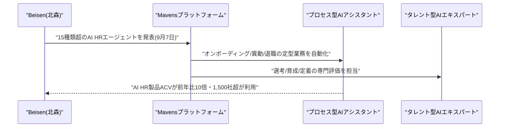

### 5.3 Buzzably、クリエイター主導型のAIコンテンツ制作エンジンをローンチ

Buzzably Limitedは2026年9月8日、クリエイターやコンテンツチーム向けに、アイデアや素材を調査・検証・公開可能な記事へ仕上げる「人間主導型」のAIコンテンツ制作エンジン「Buzzably」を正式ローンチした(サービス自体は9月4日から先行利用可能だった)。AI支援ライティング、リサーチ、ファクトチェック、複数の執筆ペルソナ、コンテンツガードレール、パブリッシング機能を単一のワークフローに統合し、各工程でAIにどこまで任せるか(全て自分で書く/AIと協働する/エージェントに委任する)をユーザーが選べる設計になっている。

料金体系はFreeプランとProプラン(月額9.99ドル〜)の2種類で、エンタープライズ向けというより個人クリエイター・小規模コンテンツチーム向けのプロダクトである点が特徴。生成AI時代のコンテンツ制作を「エージェント任せ」と「人間主導」の間で柔軟に選べるようにする製品カテゴリの一例といえる。[[16]](#ref-16) [[17]](#ref-17)

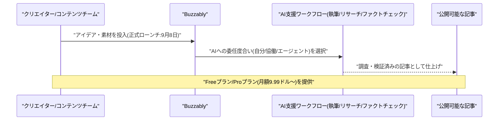

---

## 6. LLM/AI Agentセキュリティインシデント

### 6.1 Google脅威インテリジェンス、AIエージェントが6時間未満で数千件の認証情報を窃取した自律型攻撃を報告

Googleの脅威インテリジェンスグループ(GTIG)は2026年9月8日、公式ブログで最新の「GTIG AI Threat Tracker」レポートを公開し、金銭目的の脅威アクターがAIエージェントを用いて自律的な大規模認証情報窃取キャンペーンを構築・実行していた事例を報告した。攻撃者はAIコーディングチャットボットとマークダウン形式の「エージェント指示書(プレイブック)」を用い、脆弱性スキャン・認証情報収集・IPローテーションによる検知回避までを人手を介さず自動で実行するマルチエージェント型の攻撃基盤を、侵害からキャンペーン完了までわずか6時間未満で構築・稼働させ、数千件規模の第三者認証情報を窃取したという。攻撃トラフィックは被害組織自身の侵害済みクラウドリソースから発信されたため正規通信のように見え、検知が困難だった。

Googleは自社Geminiのセーフティ機構がこの挙動を検知したことを契機に脅威アクターの関連アセットを無効化し、モデル・分類器の強化で対応したと説明している。同レポートでは他にも、サプライチェーン上でMCPサーバーにバックドアを仕込んだ攻撃(追跡名UNC6780)や、中国系スパイ集団がGeminiを使い自動ペネトレーションテストツールを開発していた事例も報告された。一方でGoogleは、脅威アクターがゼロデイの発見から悪用までを完全に自律実行するパイプラインを実運用の標的に対して行った例はまだ確認していないとも釘を刺しており、現状は「エージェントが既存ツールを協調させ、人手の介在を減らしながら戦術的判断を下す」段階にとどまるとしている。[[18]](#ref-18) [[19]](#ref-19) [[20]](#ref-20)

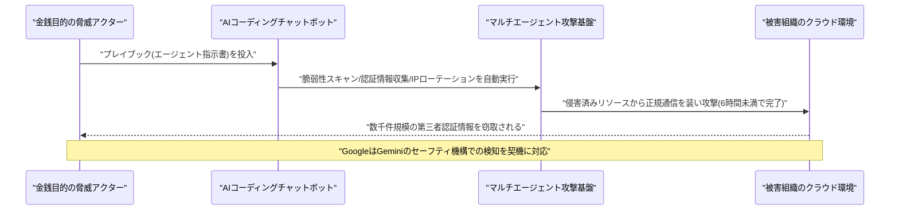

---

## 7. その他特筆すべき情報

### 7.1 中国Inspur、子会社「Aivres」経由でNVIDIA製AIチップの対中輸出規制を回避していたと発覚

ニューヨーク・タイムズ(NYT)は2026年9月6〜7日、米商務省が2023年に禁輸対象のエンティティリストに指定した中国サーバー大手Inspur Groupが、米カリフォルニア州の子会社を「Aivres Systems」に社名変更したうえでエンティティリストの対象から外れ、事業を継続していたとする調査報道を公開した。Aivresは2024年4月〜2026年2月の間に少なくとも56億ドル相当の先端技術を東南アジア経由で輸出しており、うち30億ドル超はNVIDIAの最新Blackwellチップを搭載したサーバーだったという。

これらのサーバーは最終的にByteDanceやAlibabaなど中国企業に渡っていたとされ、米連邦当局はAivresの事業について調査を開始したが進捗は不明という。この報道は米中間で進行中のAIサミット協議にも影を落としているとされ、輸出規制の「抜け穴」を突いた企業構造の組み替えが、AI半導体を巡る米中の攻防を一段と複雑にしている実態を示している。[[21]](#ref-21) [[22]](#ref-22)

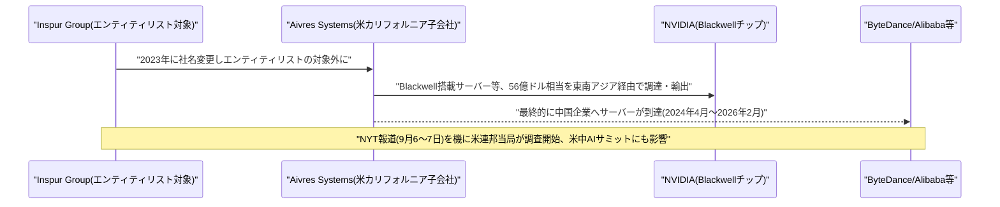

---

## 8. 参考リンク

**[1]** [Accenture and Google Cloud Deepen Partnership with Formation of New Accenture Gemini Enterprise Business Group | Accenture Newsroom](https://newsroom.accenture.com/news/2026/accenture-and-google-cloud-deepen-partnership-with-formation-of-new-accenture-gemini-enterprise-business-group)

**[2]** [Accenture and Google Cloud Launch Gemini Enterprise Business Group | AIwire (HPCwire)](https://www.hpcwire.com/aiwire/2026/09/08/accenture-and-google-cloud-launch-gemini-enterprise-business-group/)

**[3]** [OpenAI GPT-6 Astra Hits GA in Microsoft Foundry: Computer Use, Agentic Execution, and $10 to $75 per Million Tokens | StorageReview](https://www.storagereview.com/news/openai-gpt-6-astra-launches-in-microsoft-foundry-with-agentic-execution-and-computer-use)

**[4]** [GPT-6 Astra in Foundry: the price, the gate and the EU gap | technspire](https://technspire.com/en/blog/gpt-6-astra-foundry-price-gate-eu-gap)

**[5]** [Compact-Memory LLM Agents via Online Max-Member Clustering and Atom-Aware Packing | arXiv](https://arxiv.org/abs/2609.04915)

**[6]** [Testing Interchangeability in LLM Agent Teams | arXiv](https://arxiv.org/abs/2609.05279)

**[7]** [ERPBench: Evaluating LLM Agents for Enterprise Decision-Making Across Competitive Market Ecologies | arXiv](https://arxiv.org/abs/2609.04667)

**[8]** [On the Navier–Stokes Millennium Prize Problem | OpenAI](https://openai.com/index/navier-stokes-solution/)

**[9]** [OpenAI says it solved Navier-Stokes. Nobody has seen the proof. | TheNextWeb](https://thenextweb.com/news/openai-navier-stokes-claim-verification-credit)

**[10]** [AlphaGenome Atlas: Molecular predictions for 9 Billion human DNA variants | Google DeepMind](https://deepmind.google/blog/alphagenome-atlas-a-predictive-map-of-every-possible-dna-letter-change-in-the-human-genome/)

**[11]** [AlphaGenome Atlas Predicts Effects of All 9 Billion Human DNA Variants | Unite.AI](https://www.unite.ai/alphagenome-atlas-predicts-effects-of-all-9-billion-human-dna-variants/)

**[12]** [Lightsage gets $4M in funding to help software makers sell directly to autonomous AI agents | SiliconANGLE](https://siliconangle.com/2026/09/08/lightsage-gets-4m-in-funding-to-help-software-makers-sell-directly-to-autonomous-ai-agents/)

**[13]** [Lightsage Raises $4M to Build the Growth Stack for Internet Software's Newest Customer: AI Agents | GlobeNewswire](https://www.globenewswire.com/news-release/2026/09/08/3357801/0/en/lightsage-raises-4m-to-build-the-growth-stack-for-internet-software-s-newest-customer-ai-agents.html)

**[14]** [Beisen Unveils 15 AI HR Experts on Mavens Platform; AI Monetization Continues to Accelerate | GlobeNewswire](https://www.globenewswire.com/news-release/2026/09/07/3356974/0/en/beisen-unveils-15-ai-hr-experts-on-mavens-platform-ai-monetization-continues-to-accelerate.html)

**[15]** [Beisen launches AI HR expert platform Mavens as annual AI... | completeaitraining](https://completeaitraining.com/news/beisen-launches-ai-hr-expert-platform-mavens-as-annual-ai/)

**[16]** [Buzzably Launches AI Content Engine | Yahoo Finance](https://finance.yahoo.com/technology/ai/articles/buzzably-launches-ai-content-engine-010000303.html)

**[17]** [Buzzably Launches AI Content Engine That Puts Creators in Control of How They Work With AI | Manila Times (PR Newswire)](https://www.manilatimes.net/2026/09/08/tmt-newswire/pr-newswire/buzzably-launches-ai-content-engine-that-puts-creators-in-control-of-how-they-work-with-ai/2420092)

**[18]** [GTIG AI Threat Tracker: From Prompting to Autonomy – The Evolution of Adversarial AI | Google Cloud Blog](https://cloud.google.com/blog/topics/threat-intelligence/from-prompting-to-autonomy-the-evolution-of-adversarial-ai)

**[19]** [Autonomous AI Agents Compromise Thousands of Credentials in Under Six Hours | The Hacker News](https://thehackernews.com/2026/09/autonomous-ai-agents-compromise.html)

**[20]** [Threat actors are giving AI agents a bigger role in cyberattacks | Help Net Security](https://www.helpnetsecurity.com/2026/09/08/ai-agents-cyberattacks-automation-google-research/)

**[21]** [Nvidia chip export loophole clouds US-China AI summit talks | Asia Times](https://asiatimes.com/2026/09/nvidia-chip-export-loophole-clouds-us-china-ai-summit-talks/)

**[22]** [Inspur Group Allegedly Bypassed US AI Chip Curbs, Sending $5.6 Billion In Advanced Technology To China Via Its Aivres Subsidiary | Free Press Journal](https://www.freepressjournal.in/tech/inspur-group-allegedly-bypassed-us-ai-chip-curbs-sending-56-billion-in-advanced-technology-to-china-via-its-aivres-subsidiary)
