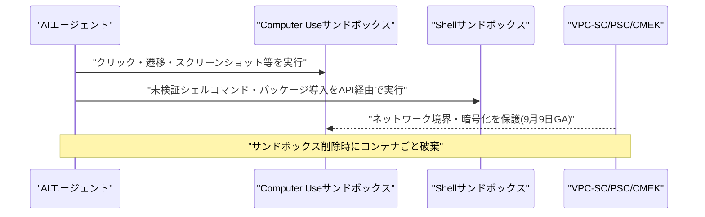
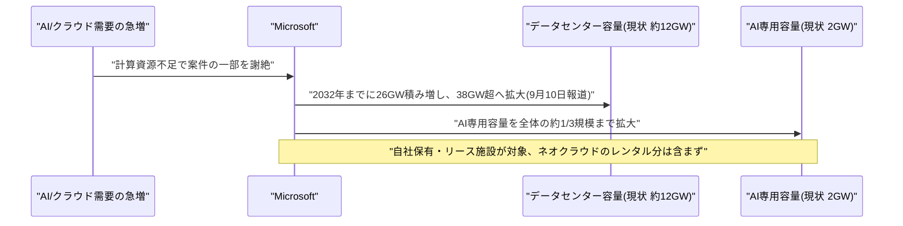
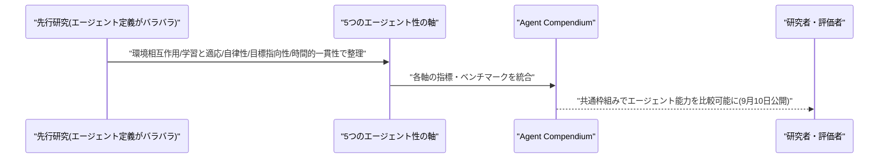
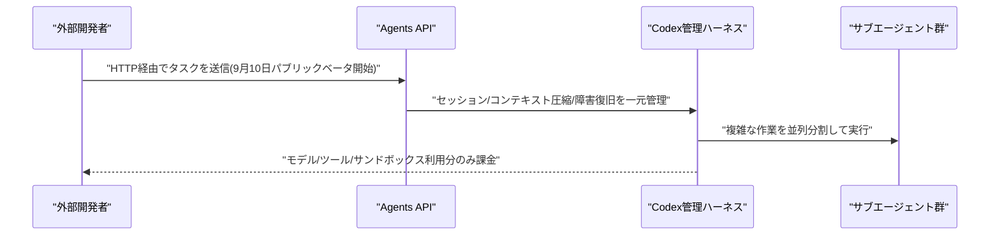
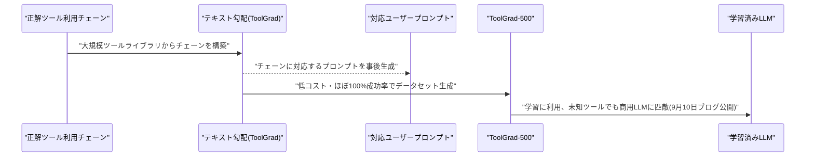
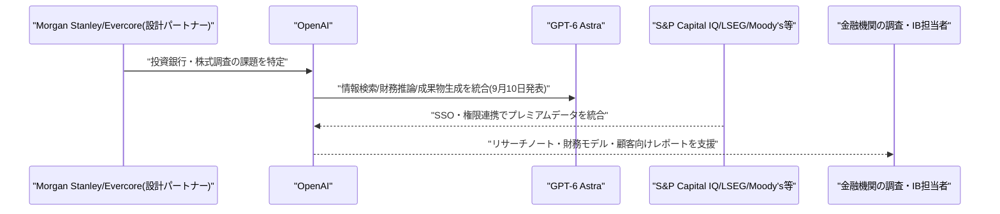
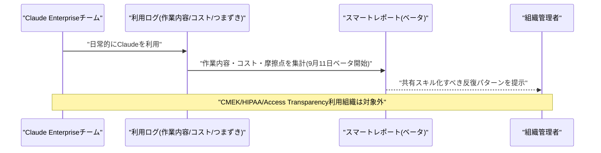
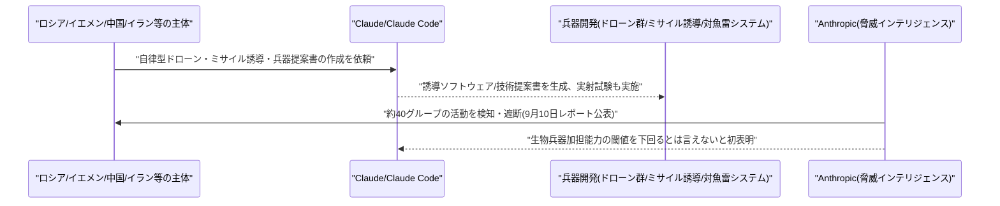
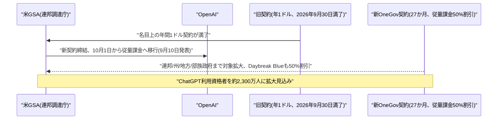

# LLM・AI Agent 最新情報レポート Vol.135
<!-- x-summary: OpenAIがCodexの管理基盤を「Agents API」として一般公開、誰でもエージェント開発が可能に -->

**作成日**: 2026年9月11日(JST)
**対象期間**: 2026年9月10日〜9月11日(Vol.134との差分)

---

## 目次

1. [Google Cloudアップデート](#1-google-cloudアップデート)
   - [1.1 Google Cloud、Gemini Enterprise Agent PlatformのComputer Use/Shellサンドボックスを一般提供(GA)化](#11-google-cloudgemini-enterprise-agent-platformのcomputer-useshellサンドボックスを一般提供ga化)
2. [Microsoft Azure AIアップデート](#2-microsoft-azure-aiアップデート)
   - [2.1 Microsoft、AI需要急増を受けデータセンター容量を2032年までに38ギガワットへ3倍超に拡大する計画を表明](#21-microsoftai需要急増を受けデータセンター容量を2032年までに38ギガワットへ3倍超に拡大する計画を表明)
3. [LLM Model / AI Agentアーキテクチャ・研究](#3-llm-model--ai-agentアーキテクチャ研究)
   - [3.1 「Defining AI Agents」:エージェント性を評価する統一基準「Agent Compendium」を提案](#31-defining-ai-agentsエージェント性を評価する統一基準agent-compendiumを提案)
   - [3.2 A2ABreak:エージェント間通信プロトコル「A2A」に仕様準拠のまま悪用可能な11件の脆弱性](#32-a2abreakエージェント間通信プロトコルa2aに仕様準拠のまま悪用可能な11件の脆弱性)
4. [公式ブログ・論文のリサーチ・要約](#4-公式ブログ論文のリサーチ要約)
   - [4.1 OpenAI、Codexの管理基盤を外部公開する「Agents API」パブリックベータを開始](#41-openaicodexの管理基盤を外部公開するagents-apiパブリックベータを開始)
   - [4.2 Google Research、テキスト勾配でツール利用データセットを効率生成する「ToolGrad」を紹介](#42-google-researchテキスト勾配でツール利用データセットを効率生成するtoolgradを紹介)
5. [AI Agent搭載SaaS製品情報](#5-ai-agent搭載saas製品情報)
   - [5.1 OpenAI、金融機関向け「ChatGPT for Financial Services」を発表](#51-openai金融機関向けchatgpt-for-financial-servicesを発表)
   - [5.2 Anthropic、Claude Enterpriseの利用実態を分析する「スマートレポート」ベータを提供開始](#52-anthropicclaude-enterpriseの利用実態を分析するスマートレポートベータを提供開始)
6. [LLM/AI Agentセキュリティインシデント](#6-llmai-agentセキュリティインシデント)
   - [6.1 Anthropic、脅威インテリジェンスレポートでイラン・ロシア・中国によるClaudeの兵器転用を報告、生物兵器の閾値超えにも初めて言及](#61-anthropic脅威インテリジェンスレポートでイランロシア中国によるclaudeの兵器転用を報告生物兵器の閾値超えにも初めて言及)
7. [その他特筆すべき情報](#7-その他特筆すべき情報)
   - [7.1 OpenAI、米GSAとの新契約で連邦政府機関向けに一律50%割引の従量課金モデルへ移行](#71-openai米gsaとの新契約で連邦政府機関向けに一律50割引の従量課金モデルへ移行)
8. [参考リンク](#8-参考リンク)

---

> **今号について:** 対象期間で最も衝撃的だったのは、Anthropicが公表した脅威インテリジェンスレポート「Detecting and countering misuse of AI: September 2026」である。2025年12月〜2026年8月に検知・遮断した悪用事例をサイバー攻撃・影響工作・監視・詐欺・生物兵器・通常兵器・蒸留の7分野にわたって報告しており、ロシアの一団が自律判断で標的を選定・起爆する自爆型ドローン群の開発を試みていた事例、イエメンの拠点が長射程弾道ミサイルや極超音速滑空体の誘導ソフトウェア作成にClaude Codeを利用し実射試験まで行っていた事例、中国の関係主体が対魚雷兵器システムの技術提案書をClaudeに査読させながら作成していた事例などが明らかになった。さらに同社は「最新のClaudeモデル群はもはや生物兵器への実質的な加担能力の閾値を下回っているとは言い切れない」と初めて公式に言明しており、フロンティアAIの兵器転用リスクが仮説の段階から実例の検証段階に入ったことを示す対象期間となった。
>
> 製品・基盤面では、AIエージェントを外部開発者・企業システムの「部品」として提供する動きが加速した。OpenAIはCodexを支えてきた管理基盤(セッション・オーケストレーション・コンテキスト圧縮・障害復旧・サブエージェント連携)を「Agents API」としてパブリックベータ公開し、任意の開発者が同じ基盤で長時間稼働型エージェントを構築できるようにした。同時に投資銀行・株式調査業務に特化した「ChatGPT for Financial Services」も発表しており、Morgan StanleyやEvercoreとの設計パートナーシップを経て、S&P Capital IQ・LSEG・Moody'sなど主要データベンダーとの連携も進めている。Google Cloudも「Gemini Enterprise Agent Platform」のComputer Use/Shellサンドボックスを一般提供化し、VPC Service ControlsやCMEKによるエンタープライズ向けガバナンス機能を整えるなど、エージェントの実行基盤整備が三社横並びで進んだ。
>
> 研究面では、急速に膨張する「エージェント」という語の定義・評価基準を統一しようとする試みと、その裏側で標準化が進むエージェント間通信プロトコルの脆弱性を指摘する研究が同時に登場した。前者は環境相互作用・学習と適応・自律性・目標指向性・時間的一貫性の5軸でエージェント性を整理する「Agent Compendium」を提案し、後者はLinux Foundation管轄のA2Aプロトコルについて、実装ミスなしに仕様準拠のまま悪用できる11件の脆弱性を報告した。エージェントを定義・評価する基盤と、エージェント同士を繋ぐ基盤の両方が、まだ発展途上であることを示す対象期間だった。インフラ面では、MicrosoftがAI需要の急増による事業機会の逸失を受け、データセンター容量を2032年までに現状の3倍超となる38ギガワットへ拡大する計画を明らかにしている。

---

## 1. Google Cloudアップデート

### 1.1 Google Cloud、Gemini Enterprise Agent PlatformのComputer Use/Shellサンドボックスを一般提供(GA)化

Google Cloudは2026年9月9日、「Gemini Enterprise Agent Platform」(旧Vertex AI)においてエージェントが安全に外部操作を実行するための「Computer Use」サンドボックスと「Shell」サンドボックスを一般提供(GA)へ移行したと発表した。Computer Useサンドボックスは、クリック・サイト遷移・スクリーンショット取得といった人間の操作を模したブラウザ操作をエージェントに実行させるための隔離されたコンテナ環境で、Shellサンドボックスは、隔離されたLinuxコンテナ内でエージェントが未検証のシェルコマンドを実行し、パッケージのインストールやファイル操作を行えるようにするAPI(`/exec`呼び出し)を提供する。いずれも自社インフラ上では何も実行されず、サンドボックス削除時にコンテナごと破棄される設計になっている。

同時に、サンドボックスのデータ・ネットワーク境界を保護するVPC Service Controls・プライベートサービスコネクト(PSC-E/PSC-I)、ディスクやスナップショットを暗号化するCustomer-Managed Encryption Keys(CMEK)、実行の一時停止・再開機能も導入された。企業が未検証コードの実行をエージェントに委ねる場面が増える中、Google Cloud側もガバナンス・セキュリティ機能を先回りして整備した形である。[[1]](#ref-1) [[2]](#ref-2)



---

## 2. Microsoft Azure AIアップデート

### 2.1 Microsoft、AI需要急増を受けデータセンター容量を2032年までに38ギガワットへ3倍超に拡大する計画を表明

Bloombergは2026年9月10日、Microsoftが計算資源の不足によりAI・クラウド案件の一部を断らざるを得ない状況を解消するため、データセンター容量を大幅に拡大する計画だと報じた。現在約12ギガワットの容量を、2032年までに26ギガワット積み増して38ギガワット超へ、3倍超に拡大するという内容で、これはニューヨーク州のピーク時電力使用量を上回る規模になる。AI専用容量については現在の2ギガワットから、2032年時点での38ギガワット全体のおよそ3分の1にまで拡大する計画としている。

拡大の対象はMicrosoft自社保有・リース双方の施設で、CoreWeaveなどネオクラウドからのレンタル分は含まれない。同社の設備投資は前会計年度に1,450億ドルに達し、データセンター関連の将来的なリース債務は3,290億ドルに上るとされ、2027会計年度第1四半期だけで500億ドルの設備投資を見込むなど、AzureにおけるAIインフラ投資が一段と積み増される見通しであることを示す内容だった。[[3]](#ref-3) [[4]](#ref-4)



---

## 3. LLM Model / AI Agentアーキテクチャ・研究

### 3.1 「Defining AI Agents」:エージェント性を評価する統一基準「Agent Compendium」を提案

Mia LassiterとBrinnae Bentは2026年9月10日、論文「Defining AI Agents: A Compendium of Criteria, Metrics, and Benchmarks」を発表した。人工知能分野における「エージェント」という語には標準的な定義が存在せず、これが研究間の評価・比較・再現性を損なっていると指摘する。

論文は、環境相互作用・学習と適応・自律性・目標指向的な振る舞い・時間的一貫性という5つの「エージェント性」の軸で先行研究を整理する構成をとる。各軸について、その能力がこれまでどのように概念化されてきたかを検討した上で、評価に用いられてきた指標・ベンチマーク・評価フレームワークを統合している。この整理結果は「Agent Compendium」という一般公開のデジタルリソースとしてまとめられ、異なるAIシステム間でエージェント能力を比較するための共通の枠組みを提供するとしている。[[5]](#ref-5)



### 3.2 A2ABreak:エージェント間通信プロトコル「A2A」に仕様準拠のまま悪用可能な11件の脆弱性

Alireza Lotfi、Mirza Masfiqur Rahman、Imtiaz Karim、Elisa Bertinoは2026年9月9日、論文「A2ABreak: Systematic Security Analysis of the A2A Protocol」を発表した。Linux Foundationが管轄するAgent2Agent(A2A)プロトコルは、組織の垣根を越えて自律型AIエージェント同士が互いを発見・認証し、タスクを委任し合うためのオープン標準で、ツール連携を担うModel Context Protocol(MCP)を補完し、マルチエージェント・エコシステムの水平的な通信レイヤーとして急速に普及しつつあるが、これまで体系的なセキュリティ分析は行われていなかったと指摘する。

論文は「A2ABreak」と呼ぶ手法により、発見・開始・タスク実行・中断の各フェーズにまたがる11件のプロトコルレベルの脆弱性を特定した。いずれも実装上の不備や設定ミスを伴わず、仕様に準拠したままでも悪用可能な点が特徴で、保護されていないコンテキストIDを介したクライアント間のコンテキスト注入、委任チェーンにおける多段の身元情報喪失を突いた認証情報の窃取、未検証の能力申告を行う不正エージェントによるデータ持ち出しなどが具体例として挙げられている。手法は独立した専門家によるレビューに対して適合率73.3%・F1値84.6%を達成した一方、同じ仕様書を読ませたゼロショットLLMのベースラインは検証済みの指摘を1件も生成できなかったという。[[6]](#ref-6)

```mermaid
sequenceDiagram
    participant A2A as "A2Aプロトコル(仕様)"
    participant Break as "A2ABreak(体系的分析)"
    participant Rogue as "不正エージェント/悪意ある委任先"
    participant Victim as "委任元エージェント・組織"

    Break->>A2A: "発見/開始/実行/中断の各フェーズを分析"
    Break-->>Victim: "11件の脆弱性を特定(実装ミス不要、仕様準拠のまま悪用可)"
    Rogue->>Victim: "未検証の能力申告・多段委任で認証情報窃取/データ持ち出し"
    Note over Break,Victim: "専門家レビュー適合率73.3%、ゼロショットLLMは0件検出"
```

---

## 4. 公式ブログ・論文のリサーチ・要約

### 4.1 OpenAI、Codexの管理基盤を外部公開する「Agents API」パブリックベータを開始

OpenAIは2026年9月10日、Codexおよび「ChatGPT for Work」を支えてきた管理基盤(マネージドハーネス)を、単一のAPI呼び出しの背後に隠した「Agents API」のパブリックベータを全開発者向けに公開した。数分から数時間、時には数日にわたって継続しうるタスクを想定しており、モデル呼び出しにコンテキスト管理・ツール実行・サンドボックスアクセス・サブエージェント連携・長時間セッション制御までを組み合わせたハーネスを、開発者が自前で構築せずに利用できるようにする。

エージェントはコードを実行し、ファイルを操作し、MCPサーバーへ接続し、外部ツールを呼び出し、成果物を作成し、必要に応じて古いコンテキストを圧縮し、複雑な作業を複数のサブエージェントに分割して並列実行させることができる。追加の基盤利用料は発生せず、モデルのトークン・ツール・サンドボックスの実行時間分のみが課金対象となる。ベータ期間中もAgents API自体への固定課金は発生しない設計で、パブリックベータは2026年9月10日から利用可能になっている。[[7]](#ref-7) [[8]](#ref-8) [[9]](#ref-9)



### 4.2 Google Research、テキスト勾配でツール利用データセットを効率生成する「ToolGrad」を紹介

Google Researchは2026年9月10日、公式ブログでGoogle・東京大学・理化学研究所AIP・東北大学の研究者らによる手法「ToolGrad」を紹介した。大規模なツールライブラリから複雑で妥当なAPIワークフローを構築するためのツール利用データセット生成手法で、プロンプト最適化で用いられる「テキスト勾配」の概念を、合成データセット生成に応用している点が特徴である。

ToolGradはまず正解となるツール利用チェーンを生成し、その後に対応するユーザープロンプトを注釈付けするという、従来と逆の順序をとる。明示的なツール利用の解の方が、プロンプト単体よりも曖昧さのない情報を提供でき、LLMの呼び出しも1ステップで済むという発想に基づく。この手法で生成したデータセット「ToolGrad-500」は、より複雑なツール利用・低コスト・ほぼ100%の成功率を実現しており、これで学習したLLMはベースライン手法で学習したモデルを上回り、未知のツールを含む分布外データセットにおいて最先端の商用LLMに匹敵する性能を示したと報告されている。コード・データセット・モデルはGitHubで公開されている。[[10]](#ref-10) [[11]](#ref-11)



---

## 5. AI Agent搭載SaaS製品情報

### 5.1 OpenAI、金融機関向け「ChatGPT for Financial Services」を発表

OpenAIは2026年9月10日、投資銀行・株式調査業務向けにカスタマイズした「ChatGPT for Financial Services」を発表した。「ChatGPT for Work」をベースに、最新モデル「GPT-6 Astra」の推論能力と金融データを組み合わせ、リサーチノート・財務モデル・顧客向けレポートの作成を支援する。Morgan StanleyおよびEvercoreとの設計パートナーシップを通じて製品の出発点を固めており、両社の業務における最大の課題がデータへの信頼できるアクセスと高品質な成果物作成にあったことから、投資銀行・株式調査領域を最初のターゲットに据えたという。

自社でデータ契約を持つ金融機関向けには、S&P Capital IQ・LSEG・MSCI・Dow Jones Factiva・Moody'sとの間でシングルサインオン・権限連携の統合を進めているほか、Daloopa・PitchBook・LSEG News・Crunchbaseのプレミアムデータセットを製品に組み込み、決算説明会の書き起こし・財務諸表・企業ファンダメンタルズ・非上場企業情報をカバーする。OpenAIはGPT-6 Astraについて、情報検索・財務推論・成果物生成という金融業務の中核となる3能力で最先端の性能を持つと説明している。[[12]](#ref-12) [[13]](#ref-13)



### 5.2 Anthropic、Claude Enterpriseの利用実態を分析する「スマートレポート」ベータを提供開始

Anthropicは2026年9月11日、Claude Enterpriseプラン向けに、チームのClaude利用状況を分析する「スマートレポート(Smart Reports)」のベータ提供を開始した。組織内でどのような作業が実際にこなされているか、そのコスト、セッションがどこでつまずいているか、そして繰り返し現れるパターンのうちどれを共有スキルとしてパッケージ化する価値があるかをレポートする機能で、既存の管理ダッシュボード・分析APIに続く、利用実態の可視化機能の拡充にあたる。

スマートレポートはClaude Enterpriseプランでベータ提供されるが、顧客管理鍵(CMEK)・HIPAA構成・Access Transparencyを利用している組織では現時点で利用できない制限がある。企業がClaude導入の効果測定や、属人化した使い方を組織的なスキルへ転換する動きを後押しする機能として位置付けられる。[[14]](#ref-14) [[15]](#ref-15)



---

## 6. LLM/AI Agentセキュリティインシデント

### 6.1 Anthropic、脅威インテリジェンスレポートでイラン・ロシア・中国によるClaudeの兵器転用を報告、生物兵器の閾値超えにも初めて言及

Anthropicは2026年9月10日、脅威インテリジェンスレポート「Detecting and countering misuse of AI: September 2026」を公表した。2025年12月〜2026年8月の間に検知・遮断した悪用事例を、サイバー攻撃・影響工作・監視・詐欺・生物兵器・通常兵器開発・不正蒸留の7分野、約40の追跡対象グループにわたって報告する内容で、2025年3月・8月・11月に続く4回目の脅威レポートにあたる。レポートは、AIが国家レベルの作戦と個人による作戦との間の労力・ツールの差を「崩壊」させたこと、報告された作戦の大半がチャットボットへの一問一答ではなく、マルチエージェント基盤による直接実行・オーケストレーションを通じてAIに実現されていたことを主要な傾向として挙げている。

兵器関連では、ロシア拠点の一団が人間の最終承認なしに標的を自律選定・起爆する自爆型ドローン群の開発を試みていた事例、イエメン北部を拠点とするグループが長射程弾道ミサイルおよび極超音速滑空体の誘導ソフトウェア作成にClaude Codeを利用し実際に誘導ロケットの実射試験まで行った(失敗後、数時間以内に原因究明のためClaudeに再度助言を求めた)事例、中国系の主体が対魚雷兵器システムに関する中国語の技術提案書をClaudeに査読させながら作成していた事例が明らかにされた。さらにAnthropicは「最新のClaudeモデル群は、もはや生物兵器への実質的な加担能力の閾値を下回っているとは言い切れない」と表明しており、大手AI企業がこの点を公式に認めたのは初めてだという。影響工作ではロシア・イラン・トルコ、湾岸・南アジア・アフリカ・欧州にまたがる9件の事例が報告され、イランのネットワークはIRGC報道官の公式な口調を模したメッセージを生成し、CSIS・Brookings・RANDに虚偽の見解を帰属させていたことも判明した。[[16]](#ref-16) [[17]](#ref-17) [[18]](#ref-18) [[19]](#ref-19)



---

## 7. その他特筆すべき情報

### 7.1 OpenAI、米GSAとの新契約で連邦政府機関向けに一律50%割引の従量課金モデルへ移行

米連邦調達庁(GSA)は2026年9月10日、OpenAIとの間で新たな27か月間の「OneGov」契約を締結したと発表した。2025年8月に締結され、連邦機関がChatGPT Enterpriseを年間1機関あたり1ドルという名目上の価格で利用できた従来契約(2026年9月30日満了予定)を終了し、10月1日からはトークン使用量に応じた従量課金へ移行、ChatGPTの各モデルの利用料金を通常の商用価格から一律50%割引とする内容である。プラットフォームアクセス料・最低発注額・支出コミットメントは設けられていない。

対象範囲は連邦行政機関に留まらず、立法・司法機関、さらには州・地方・部族政府にも拡大される。加えて、身元確認済みの全政府機関はサイバー防御向けモデル「Daybreak Blue」への商用価格50%割引でのアクセスも承認され、導入を支援するトレーニング・啓発プログラムも拡充される。OpenAIはこの新契約により、ChatGPTの利用資格を持つ人数が約2,300万人に拡大すると見込んでいる。[[20]](#ref-20) [[21]](#ref-21)



---

## 8. 参考リンク

<a id="ref-1"></a>
**[1]** [Computer Use | Gemini Enterprise Agent Platform | Google Cloud Documentation](https://docs.cloud.google.com/gemini-enterprise-agent-platform/scale/sandbox/computer-use)

<a id="ref-2"></a>
**[2]** [Gemini Enterprise Agent Platform release notes | Google Cloud Documentation](https://docs.cloud.google.com/gemini-enterprise-agent-platform/release-notes)

<a id="ref-3"></a>
**[3]** [Microsoft AI Focused Data Center Plan to Add 26 Gigawatts of Compute | Bloomberg](https://www.bloomberg.com/news/features/2026-09-10/microsoft-ai-focused-data-center-plan-to-add-26-gigawatts-of-compute)

<a id="ref-4"></a>
**[4]** [Microsoft Eyes Massive Data Center Push To Triple Computing Power And Solve Capacity Bottlenecks | Yahoo Finance](https://finance.yahoo.com/technology/articles/microsoft-eyes-massive-data-center-233026556.html)

<a id="ref-5"></a>
**[5]** [Defining AI Agents: A Compendium of Criteria, Metrics, and Benchmarks | arXiv](https://arxiv.org/abs/2609.11018)

<a id="ref-6"></a>
**[6]** [A2ABreak: Systematic Security Analysis of the A2A Protocol | arXiv](https://arxiv.org/abs/2609.10871)

<a id="ref-7"></a>
**[7]** [OpenAI Launches the Agents API in Public Beta, Putting the Codex Harness Behind One API Call | MarkTechPost](https://www.marktechpost.com/2026/09/10/openai-launches-the-agents-api-in-public-beta-putting-the-codex-harness-behind-one-api-call/)

<a id="ref-8"></a>
**[8]** [OpenAI launches Agents API: cloud agents, subagents, hosted sandboxes, and the Codex harness | Datastudios](https://www.datastudios.org/post/openai-agents-api-cloud-agents-subagents-hosted-sandboxes-codex-harness)

<a id="ref-9"></a>
**[9]** [Introducing the Agents API and hosted sandboxes | OpenAI Developer Community](https://community.openai.com/t/introducing-the-agents-api-and-hosted-sandboxes/1396481)

<a id="ref-10"></a>
**[10]** [ToolGrad: Efficient tool-use dataset generation with textual "gradients" | Google Research Blog](https://research.google/blog/toolgrad-efficient-tool-use-dataset-generation-with-textual-gradients/)

<a id="ref-11"></a>
**[11]** [ToolGrad: Efficient Tool-use Dataset Generation with Textual "Gradients" | arXiv](https://arxiv.org/abs/2508.04086)

<a id="ref-12"></a>
**[12]** [OpenAI Launches ChatGPT for Financial Services With Built-In Data | Unite.AI](https://www.unite.ai/openai-launches-chatgpt-for-financial-services-with-built-in-data/)

<a id="ref-13"></a>
**[13]** [OpenAI Launches ChatGPT For Financial Services With GPT-6 Astra And Built-In Premium Data | Pulse2](https://pulse2.com/openai-launches-chatgpt-for-financial-services-with-gpt-6-astra-and-built-in-premium-data/)

<a id="ref-14"></a>
**[14]** [Get started with smart reports | Claude Help Center](https://support.claude.com/en/articles/16893491-get-started-with-smart-reports)

<a id="ref-15"></a>
**[15]** [Claude Updates by Anthropic - September 2026 | Releasebot](https://releasebot.io/updates/anthropic/claude)

<a id="ref-16"></a>
**[16]** [Countering misuse of AI: September 2026 | Anthropic](https://www.anthropic.com/threat-intelligence-report-september-2026)

<a id="ref-17"></a>
**[17]** [Anthropic Says Iran, Russia Used Claude for Weapons Research | Bloomberg](https://www.bloomberg.com/news/articles/2026-09-11/anthropic-says-us-adversaries-aimed-claude-at-weapons-research)

<a id="ref-18"></a>
**[18]** [Anthropic says it blocked misuse of its AI that could have supported biological weapons | Washington Times](https://www.washingtontimes.com/news/2026/sep/10/anthropic-says-blocked-misuse-ai-could-supported-biological-weapons/)

<a id="ref-19"></a>
**[19]** [Anthropic Threat Report: AI Models Near Bioweapons Threshold as Drone Kill Software Emerges | Tech Times](https://www.techtimes.com/articles/327308/20260911/anthropic-threat-report-ai-models-near-bioweapons-threshold-drone-kill-software-emerges.htm)

<a id="ref-20"></a>
**[20]** [GSA unveils new, token-based OneGov discount with OpenAI | Nextgov/FCW](https://www.nextgov.com/acquisition/2026/09/gsa-unveils-new-token-based-onegov-discount-openai/415908/)

<a id="ref-21"></a>
**[21]** [OpenAI Gives US Agencies 50% Off Models, Ending $1 Per Year Deal | Bloomberg](https://www.bloomberg.com/news/articles/2026-09-10/openai-gives-us-agencies-50-off-models-ending-1-per-year-deal)
